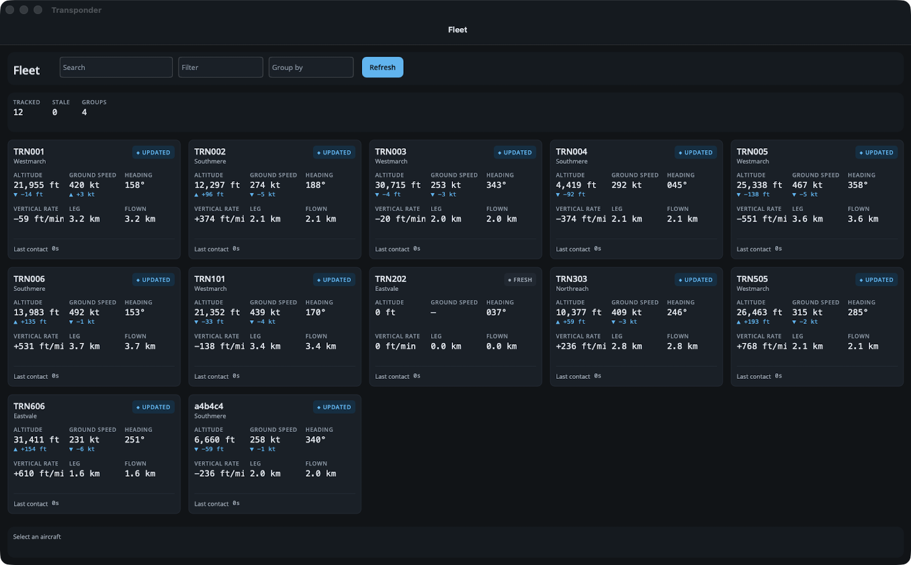
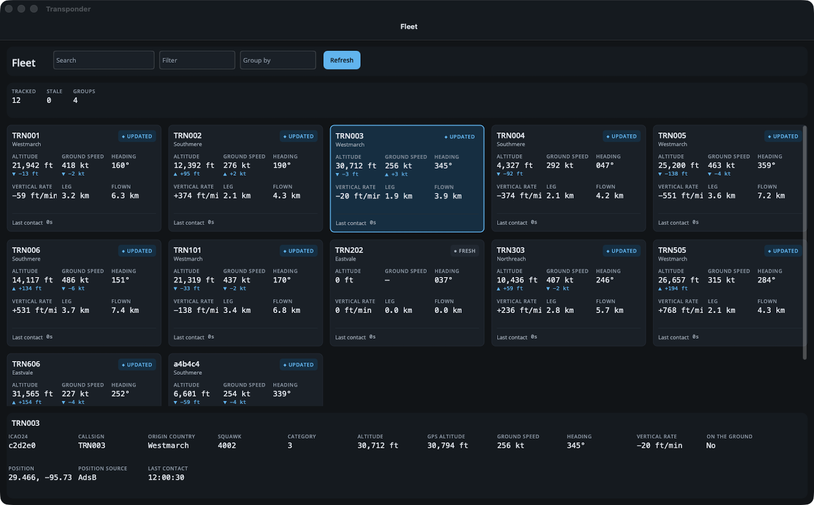

<p align="center">
  
</p>

<h1 align="center">Transporter</h1>

<p align="center">
  Polled data can still be reactive — a DynamicData and .NET MAUI fleet dashboard over aircraft above Houston.
</p>

<p align="center">
  <a href="https://github.com/RLittlesII/Transporter/actions/workflows/ci.yml"></a>
  
  
  
  
  <a href="LICENSE"></a>
</p>

<p align="center">
  <a href="#audience">Audience</a> •
  <a href="#core-idea">Core idea</a> •
  <a href="#the-app-fleet-tracking-dashboard">The app</a> •
  <a href="#dynamicdata-operators-to-demonstrate">Operators</a> •
  <a href="#data-source-opensky-network">Data source</a> •
  <a href="#demo-resilience">Demo resilience</a> •
  <a href="#closing-act-optional-swap-in-a-push-source">Closing act</a> •
  <a href="#open-items">Open items</a> •
  <a href="#build">Build</a>
</p>

---

## Audience

Line-of-business and enterprise .NET developers. Most of them work with data behind REST endpoints, SQL queries, and other request/response services, not push-based feeds. The demo should show a pattern they can apply to their own apps right away.

## Core idea

**Polled data can still be reactive.** Poll a REST API for a full snapshot, use `EditDiff` to turn successive snapshots into changesets, and from that point on everything is a normal DynamicData pipeline. Many developers assume reactive collections require a push source; this demo shows they don't.

## The app: "Fleet Tracking Dashboard"

Live aircraft over Houston — both international airports, the ship channel and Galveston Bay — framed as a fleet dashboard so the audience maps it onto their own domains (trucks, technicians, shipments, tickets). The box was chosen so the ships closing act can subscribe to the same geography ([decision 0001](src/Transporter/Integrations/OpenSky/.spec/decisions/0001-houston-bounding-box.md)).

UI features:

- Live grid of aircraft (one row per aircraft, updating in place)
- Search box and dropdown filters
- Column sorting chosen by the user
- Grouped view (by origin country or aircraft category)
- Master-detail: selected aircraft in a detail pane
- Summary counts and aggregates per group
- "Stale" indicator for aircraft that stop reporting — marked and kept, never removed, at a configurable five minutes
- Optional: map view

### Screenshots

Taken on the Mac Catalyst head against a recorded replay, so the aircraft are synthetic.

<table>
  <tr>
    <td width="50%"></td>
    <td width="50%"></td>
  </tr>
  <tr>
    <td align="center">Live grid, updating in place, with summary counts</td>
    <td align="center">Master-detail: the selected aircraft in the detail pane</td>
  </tr>
</table>

## DynamicData operators to demonstrate

In roughly the order the audience meets them:

| Operator                              | Used for                                                                                                                                                                                                                                                                                                                                                                                                                           |
| ------------------------------------- | ---------------------------------------------------------------------------------------------------------------------------------------------------------------------------------------------------------------------------------------------------------------------------------------------------------------------------------------------------------------------------------------------------------------------------------- |
| `EditDiff`                            | Snapshot to changeset (the headline feature)                                                                                                                                                                                                                                                                                                                                                                                       |
| `Filter` with an observable predicate | Search box and dropdowns                                                                                                                                                                                                                                                                                                                                                                                                           |
| `Sort` with a user-selected comparer  | Column sorting                                                                                                                                                                                                                                                                                                                                                                                                                     |
| `Group`                               | Grouped grid by country or category                                                                                                                                                                                                                                                                                                                                                                                                |
| `Bind`                                | Pushing changes into the UI collection                                                                                                                                                                                                                                                                                                                                                                                             |
| Aggregates (`Count`, etc.)            | Summary counts per group                                                                                                                                                                                                                                                                                                                                                                                                           |
| `AutoRefresh`                         | Re-evaluating filters and sorts when a held item's properties change. The aircraft pipeline has no subject for it — the projection emits a new vehicle per change rather than mutating one, so staleness re-evaluates on the observed clock instead ([`fleet-pipeline` decision 0001](src/Transporter/Tracking/.spec/decisions/0001-no-autorefresh-in-this-pipeline.md)). Shown as the operator a mutating push source reaches for |
| `ExpireAfter` / staleness             | Items that stop reporting. Aircraft are _marked_ at five minutes rather than removed; `ExpireAfter` itself is for vessels, which go silent rather than departing                                                                                                                                                                                                                                                                   |

## Data source: OpenSky Network

- **Docs:** https://openskynetwork.github.io/opensky-api/rest.html
- **Base URL:** `https://opensky-network.org/api`
- **Endpoint:** `GET /states/all`
    - Bounding box: `lamin`, `lomin`, `lamax`, `lomax`
    - `extended=1` adds aircraft category (useful for grouping)
- **No OpenAPI spec**, so there is nothing to generate a client from. The client is written with [Flurl](https://flurl.dev) over `System.Text.Json` — fluent query parameters for the bounding box, hooks for token refresh, readable rate-limit headers, and `HttpTest` instead of a hand-rolled message handler. See [ADR-0001](.spec/adr/0001-flurl-for-http.md).

### Response shape

`states` is an array of arrays; fields are positional, not named. Needs a custom `JsonConverter`.

| Index | Field             | Notes                               |
| ----- | ----------------- | ----------------------------------- |
| 0     | `icao24`          | **The cache key**                   |
| 1     | `callsign`        | May be null; padded to 8 chars      |
| 2     | `origin_country`  | Good for grouping                   |
| 3     | `time_position`   | Unix seconds, nullable              |
| 4     | `last_contact`    | Unix seconds                        |
| 5     | `longitude`       | Nullable                            |
| 6     | `latitude`        | Nullable                            |
| 7     | `baro_altitude`   | Meters, nullable                    |
| 8     | `on_ground`       | bool                                |
| 9     | `velocity`        | m/s, nullable                       |
| 10    | `true_track`      | Degrees from north, nullable        |
| 11    | `vertical_rate`   | m/s, nullable                       |
| 12    | `sensors`         | Usually null                        |
| 13    | `geo_altitude`    | Meters, nullable                    |
| 14    | `squawk`          | Nullable                            |
| 15    | `spi`             | bool                                |
| 16    | `position_source` | 0 ADS-B, 1 ASTERIX, 2 MLAT, 3 FLARM |
| 17    | `category`        | Only with `extended=1`              |

### Authentication

- OAuth2 client credentials only (no basic auth).
- Create an API client on the OpenSky account page to get `client_id` and `client_secret`.
- Token URL: `https://auth.opensky-network.org/auth/realms/opensky-network/protocol/openid-connect/token`
- Tokens expire after 30 minutes; refresh on expiry or on a 401.
- The application reads both from the developer's user-secrets store, never from the repository. [`docs/credentials.md`](docs/credentials.md) is how to put them there, check them, and rotate them; the short form, in a terminal of your own:

    ```sh
    dotnet user-secrets set "OpenSky:ClientId" "<client id>" --id transporter-gui
    dotnet user-secrets set "OpenSky:ClientSecret" "<client secret>" --id transporter-gui
    ```

    The next build of the head packages the store into the app bundle, so a built bundle holds the secret and is never shared ([`aircraft-source`](src/Transporter/Integrations/OpenSky/.spec/README.md) B-058).

### Limits

| Tier              | Daily credits | Resolution |
| ----------------- | ------------- | ---------- |
| Anonymous         | 400           | 10 seconds |
| Registered (free) | 4,000         | 5 seconds  |

Credit cost per `/states/all` call by bounding box area: ≤25 sq° = 1, 25–100 = 2, 100–400 = 3, >400 or global = 4.

- The Houston box is about 2.9 sq°, so 1 credit per call. At the chosen 15-second interval that is 240 credits per hour — a talk spends roughly 180 of the daily 4,000, and rehearsal is unconstrained. Leaving the 1-credit tier is what costs. **Register for a free account.**
- Remaining credits appear in the `X-Rate-Limit-Remaining` header; a `429` response includes `X-Rate-Limit-Retry-After-Seconds`.

### Gotchas

- OpenSky may block AWS and other hyperscaler IPs. **Run the demo from a laptop, not a cloud VM.**
- Terms ask that public presentations cite the OpenSky paper. **Add a credit slide:** Schäfer, Strohmeier, Lenders, Martinovic, Wilhelm, "Bringing Up OpenSky: A Large-scale ADS-B Sensor Network for Research."

## Backup source: airplanes.live

- Docs: https://airplanes.live/api-guide/
- Endpoint: `/v2/point/[lat]/[lon]/[radius]` (radius up to 250 nm)
- Named JSON fields (easier than OpenSky), 1 request per second, non-commercial, no SLA.
- **Access terms are unclear:** email them before relying on it.

## Demo resilience

- Put each data source behind a typed API contract that mirrors the provider, a client that caches what it fetches, and a per-type strategy that projects those cached records into domain vehicles. The strategies all adhere to one seam, and a decorator picks which is live — so swapping sources is a new strategy, not a new pipeline. See [ADR-0002](.spec/adr/0002-contract-client-strategy-tracker.md).
- Implementations: live OpenSky, and **replay from recorded snapshots** — a recorded fixture is a set of the provider's own records, so replay re-derives nothing. Recordings are an NDJSON append log, one line per snapshot, per [ADR-0004](.spec/adr/0004-ndjson-recording-format.md).
- Record several minutes of snapshots during rehearsal. Be able to switch to replay on stage if the venue network fails.
- This also makes a teaching point: the pipeline doesn't care where the data comes from.
- The operational half — what to do before the talk, on the day, and when something breaks — is the [stage-day runbook](docs/runbook.md).

## Closing act (optional): swap in a push source

Replace the polled source with a push source and show that everything downstream of the cache is unchanged. Options:

- **Ships via AISStream.io** (my favorite, and it fits the "fleet" theme). Free WebSocket feed of live vessel positions, keyed by MMSI, filterable by bounding box. Requires a free API key (sign up with GitHub). Community .NET package: `AISStream.NET`; official C# example uses `ClientWebSocket`. Ships go silent rather than being removed, so `ExpireAfter` matters here too.
- **Coinbase** via `JKorf.Coinbase.Net` (Advanced Trade WebSocket). Order book updates map almost directly onto `AddOrUpdate` / `Remove`. Crypto may distract an enterprise audience.
- **Simulated push source** with no network dependency at all.

## Alternatives considered

| Option                              | Why not the main demo                                                                     |
| ----------------------------------- | ----------------------------------------------------------------------------------------- |
| Coinbase order book                 | Great fit technically, but push-only lesson, fast/bursty data, crypto domain may distract |
| Ships (AISStream)                   | Very cool, but push-based so it skips the `EditDiff` lesson; kept as the closing act      |
| Wikimedia EventStreams              | Append-only events; needs derived state                                                   |
| Bluesky Jetstream                   | Event-shaped; main .NET library (FishyFlip) deprecated in favor of CarpaNet               |
| Local processes / FileSystemWatcher | Great offline fallback, less compelling story                                             |

## Open items

- [x] Register an OpenSky account and create an API client — done 2026-10-09; the credentials go in the user-secrets store (§ "Authentication")
- [x] Pick the bounding box (metro area) and polling interval — Houston: IAH, HOU, the ship channel and Galveston Bay, polled every 15 seconds ([decision 0001](src/Transporter/Integrations/OpenSky/.spec/decisions/0001-houston-bounding-box.md))
- [x] Decide UI framework (WPF, Avalonia, Blazor, MAUI)
- [ ] Record replay snapshots during rehearsal
- [ ] Decide on the closing act (ships, Coinbase, or simulated)
- [ ] If using ships: get an AISStream API key
    - [x] Intend to show ships
- [ ] Add OpenSky citation slide
- [ ] Decide the vessel WebSocket client: `ClientWebSocket` or `AISStream.NET` (§ "Closing act" names both)
- [ ] Decide, per command, whether a view model reaches its actor with `Tell` or `Ask` (`mvvm` § "Two kinds of input, two routes")
- [x] Decide whether the build gets a `Test` target — yes; `Default` depends on it, so a green build is a green test run ([item 0017](.issue/0017-test-target.yml))

## Technology Decisions

- [Maui.Markup](https://github.com/CommunityToolkit/Maui.Markup?WT.mc_id=dotnet-29192-cxa)
- [C# Language Extensions](https://github.com/louthy/language-ext)
- [Akka](https://github.com/akkadotnet/akka.net)
- [Mapperly](https://github.com/riok/mapperly)
- [Flurl](https://flurl.dev) — the polled HTTP client ([ADR-0001](.spec/adr/0001-flurl-for-http.md))

## Build

Requires the .NET SDK pinned in [`global.json`](global.json).

```sh
dotnet tool restore
./build.sh                  # what CI runs: compile, format, test
dotnet test test/UnitTests  # the tests alone
```

The application builds and starts with no credentials, and its live source is
refused. To see live aircraft, put the OpenSky client id and secret into the
user-secrets store first — [`docs/credentials.md`](docs/credentials.md) — and
then build the head, since the store is read at build:

```sh
dotnet build src/Gui -t:Run -f net10.0-maccatalyst
```

## License

[MIT](LICENSE) © 2026 Rodney Littles, II.
