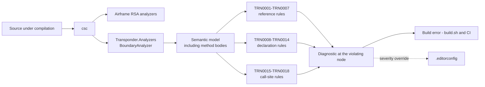
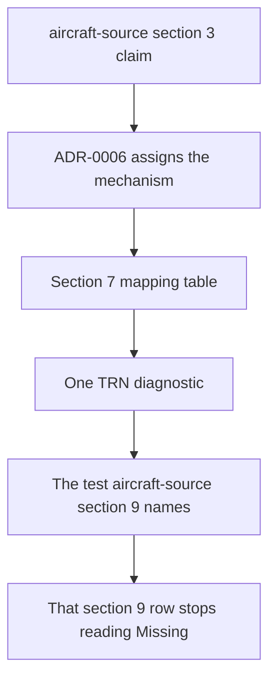

# Specification: Boundary analyzer

## 1. Business Goal

<!-- Rules: ../../../.spec/templates/feature.md § 1 -->

A third of [`aircraft-source`](../../aircraft-source/.spec/README.md)'s claims
exist to hold its layers apart, and none of them is verified. Eighteen rows in
that specification's § 9 read `Missing` and name a test class that does not
exist, so every item in the Feature can be implemented and **nothing can ship**
— which is what its § 11 row 3 records. The failure state this Feature removes
is not an absent test suite; it is worse than that. A boundary claim is the
kind a reader believes is satisfied because no code has crossed it yet, and
[ADR-0006](../../../.spec/adr/0006-an-analyzer-enforces-the-layer-boundaries.md)
established that the obvious mechanism cannot tell the difference: a reference
lives in a method body, `System.Reflection` reaches signatures only, so a
reflection test for `aircraft-source` B-045 passes on a view model that
constructs a response envelope inside a method and throws it away. This Feature
builds the mechanism that decision chose — a Roslyn analyzer, shipped from this
repository, reporting those claims as compiler diagnostics at the line that
violates them, while it is being written. The outcome is that the repository's
layering stops being an agreement the author remembers and becomes a build
error for everyone, including a contributor who has read none of this. For a
repository whose purpose is to be a conference talk's takeaway, the enforcement
is part of what is being demonstrated.

## 2. User Needs

<!-- Rules: ../../../.spec/templates/feature.md § 2 -->

| #   | Persona                                                              | Need                                                                                                                                | Pain point today                                                                                                                                                                                 |
| --- | -------------------------------------------------------------------- | ----------------------------------------------------------------------------------------------------------------------------------- | ------------------------------------------------------------------------------------------------------------------------------------------------------------------------------------------------ |
| 1   | The presenter, after the talk, maintaining the repository as a sample | The layering survives contact with contributors who never read the specification                                                     | The rules live in prose — a specification section, a skill, a code review. Nothing stops a pull request that names a wire type from a view model, and review is worst at catching one line at a time. |
| 2   | A developer in the audience reading the repository afterwards         | To see the layer rules enforced by the same compiler that builds the code, as the demonstrated practice rather than an assertion     | The repository tells them a boundary exists and shows them nothing that holds it. The most interesting claim the sample makes about structure is the one it cannot show working.                  |
| 3   | The implementer of any `aircraft-source` item                          | A boundary violation to fail where it was written, with the claim named, rather than as a red assertion elsewhere read backwards     | Eighteen § 9 rows name a test that does not exist, so the implementer gets no signal at all, and the claims most likely to be "satisfied by absence" are exactly the unverified ones.             |
| 4   | The person deciding what ships                                        | The eighteen `Missing` rows to close, because a `Missing` row blocks ship                                                           | `aircraft-source` § 11 row 3 is open: no mechanism exists, so no item can claim `done`, and the scheduling question has no answer written anywhere.                                               |

## 3. Acceptance Criteria

<!-- Rules: ../../../.spec/templates/feature.md § 3 -->

Nineteen claims in four groups: **B-001 – B-008** the diagnostic surface — what
a diagnostic is, what it carries, where it reports and how loud it is;
**B-009 – B-013** what the rules may examine and what they may not;
**B-014 – B-017** how the analyzer ships and how a violation reaches a build;
and **B-018 and B-019** the discipline that keeps this Feature from becoming a
second store for another specification's claims.

Claim ids are per-Feature, per
[`spec-and-traceability`](../../../.skills/spec-and-traceability/SKILL.md)
§ "Claims and traceability". `B-004` here and `B-004` in
[`aircraft-source`](../../aircraft-source/.spec/README.md) are different
claims. Because this specification is *about* that one, every reference to a
foreign claim below is written with its specification —
`aircraft-source B-045`, never a bare `B-045`. A bare id in this document is
this document's own.

| ID    | Claim                                                                                                                                                                                                                                                                                                              | Source                                                                       |
| ----- | ------------------------------------------------------------------------------------------------------------------------------------------------------------------------------------------------------------------------------------------------------------------------------------------------------------------ | ---------------------------------------------------------------------------- |
| B-001 | Each claim the analyzer enforces SHALL have exactly one diagnostic id, and each diagnostic id SHALL enforce exactly one claim.                                                                                                                                                                                      | ADR-0006 § Decision                                                          |
| B-002 | Every diagnostic SHALL carry the `TRN` prefix, SHALL be numbered from the analyzer's own sequence starting at `TRN0001`, and SHALL NOT encode the number of the claim it enforces.                                                                                                                                  | [adr/0001](adr/0001-trn-ids-on-their-own-sequence.md); ADR-0006 § Decision 4  |
| B-003 | A diagnostic's title and message SHALL name the specification and the claim id it enforces, so a build message says which agreement broke without the reader holding this document.                                                                                                                                | ADR-0006 § Decision 4                                                        |
| B-004 | A diagnostic SHALL be reported at the syntax node that violates the claim — the reference, the declaration, or the registration — and SHALL NOT be reported with no location, nor with an empty symbol name in its message.                                                                                         | ADR-0006 § Decision 2; `RocketSurgeonsGuild/Airframe#403`                     |
| B-005 | No diagnostic SHALL be reported against generated code; the analyzer SHALL declare `GeneratedCodeAnalysisFlags.None`.                                                                                                                                                                                               | `RocketSurgeonsGuild/Airframe#403`; `.editorconfig` cannot reach a generator  |
| B-006 | Every diagnostic SHALL default to `error`, and the only way to weaken one SHALL be a severity entry in [`.editorconfig`](../../../.editorconfig).                                                                                                                                                                   | ADR-0006 § Consequences                                                      |
| B-007 | A diagnostic id SHALL NOT be renumbered, and a retired one SHALL NOT be reused.                                                                                                                                                                                                                                    | [adr/0001](adr/0001-trn-ids-on-their-own-sequence.md) § Decision 3           |
| B-008 | The analyzer SHALL carry exactly the eighteen `aircraft-source` claims ADR-0006 assigns it — `aircraft-source` B-002, B-004 – B-008, B-010, B-014, B-030 – B-032, B-037, B-041, B-044 – B-048 — and SHALL carry no rule that no claim asks for.                                                                     | ADR-0006 § Decision drivers; `aircraft-source` § 11 row 3                     |
| B-009 | A claim about what may reference what SHALL be evaluated over the semantic model including method bodies — a local, a `new`, a cast, a generic argument supplied at a call site, a type named only inside a method — and SHALL NOT be reported satisfied from signatures alone.                                     | ADR-0006 § Context — the constraint that forces the choice                    |
| B-010 | A claim about a declaration's shape SHALL be evaluated on that declaration, and reported on it.                                                                                                                                                                                                                    | ADR-0006 § Context — "what a declaration may look like"                       |
| B-011 | A claim about registration SHALL be evaluated at the registration call site rather than on the registered type, so a lifetime or an alias is read where it is chosen.                                                                                                                                               | `aircraft-source` B-008, B-031 — both are about the call, not the type        |
| B-012 | The mocking-framework half of `aircraft-source` B-010 SHALL be reported at the call that produces the double.                                                                                                                                                                                                       | `aircraft-source` § 9 row B-010                                              |
| B-013 | No diagnostic SHALL assert a computed value; a claim about behaviour SHALL remain an xUnit test, and the analyzer SHALL NOT become a second place to assert one.                                                                                                                                                    | ADR-0006 § Decision 6                                                        |
| B-014 | The analyzer SHALL be its own project, referenced by the projects it analyzes as an analyzer and not as an assembly, so no analyzer code reaches the shipped application.                                                                                                                                           | ADR-0006 § Consequences — nothing new in the app's graph                      |
| B-015 | The analyzer SHALL take no dependency the application takes, and no application or test project SHALL name a type from it.                                                                                                                                                                                         | `transponder-conventions` § Dependencies; ADR-0006 § Consequences            |
| B-016 | Each enforced claim SHALL be proven by the test `aircraft-source` § 9 already names for it, under that name; those names SHALL NOT be changed to suit the implementation.                                                                                                                                           | `aircraft-source` § 9; `spec-and-traceability` § "A cite names something that exists" |
| B-017 | A violation SHALL fail the ordinary build — `./build.sh` and the pull-request workflow it drives — rather than a separate lint step a contributor can skip.                                                                                                                                                         | ADR-0006 § Consequences — "a build error for everyone"                       |
| B-018 | A rule SHALL NOT exist before the claim it enforces: a new diagnostic requires a § 3 row in the specification it serves, written by that specification's `spec-author`.                                                                                                                                             | ADR-0006 § Decision 4; `spec-and-traceability` § "Section ownership"         |
| B-019 | § 7's mapping table SHALL be the only store for which diagnostic enforces which claim, and SHALL NOT restate a foreign claim's text, nor the test name `aircraft-source` § 9 owns.                                                                                                                                  | `spec-and-traceability` § "One answer, one section"                          |

## 4. Constraints

<!-- Rules: ../../../.spec/templates/feature.md § 4 -->

| #   | Constraint                                                                                                                                                      | Source                                                                                  | Impact                                                                                                                                                                                 |
| --- | --------------------------------------------------------------------------------------------------------------------------------------------------------------- | --------------------------------------------------------------------------------------- | -------------------------------------------------------------------------------------------------------------------------------------------------------------------------------------- |
| 1   | An analyzer is loaded by the compiler, not by the application, so it targets the Roslyn load contract rather than the repository's application framework          | Roslyn analyzer hosting                                                                 | The analyzer project's target framework is fixed by what `csc` will load, not by `global.json`'s SDK or the app's `net10.0`. B-014's reference shape follows from it.                   |
| 2   | A diagnostic reported with no location cannot be suppressed by a `#pragma` or by any `.editorconfig` section, and one reported against generated source cannot be fixed at all | `RocketSurgeonsGuild/Airframe#403`, reproduced in this repository on 2026-10-04          | B-004 and B-005 are not polish: they are the difference between a rule a contributor can work with and one whose only escape is disabling it for a whole project.                      |
| 3   | No architecture-rule library joins the repository                                                                                                                | ADR-0006 § Consequences                                                                 | NetArchTest and ArchUnitNET are out, and `Directory.Packages.props` grows only by what the analyzer project itself needs.                                                              |
| 4   | Package versions are central and a `.csproj` carries no `Version` attribute                                                                                      | `transponder-conventions` § Dependencies                                                 | Every package the analyzer and its tests need is added to `Directory.Packages.props` in the same change.                                                                               |
| 5   | A claim id identifies a claim only with its specification                                                                                                        | `spec-and-traceability` § "Claims and traceability"                                      | A diagnostic id cannot carry a claim number, which is what [adr/0001](adr/0001-trn-ids-on-their-own-sequence.md) decides and B-002 states.                                              |
| 6   | The Airframe `RSA` set already loads for every project in the repository, with five of its rules raised to `error`                                                | [`Directory.Build.props`](../../../Directory.Build.props); [`.editorconfig`](../../../.editorconfig) | `TRN` ids must not collide with `RSA`, `CS`, `CA` or `IDE`, and a `TRN` severity override sits in the same file as the `RSA` ones rather than in a mechanism of its own.                |
| 7   | Every claim this analyzer carries stands `Missing` until it exists, and a `Missing` row blocks ship                                                               | `aircraft-source` §§ 9, 11 row 3                                                        | The schedule is not this Feature's to set, but the dependency is one-way: no `aircraft-source` item can claim `done` before this one lands.                                             |

## 5. Out of Scope

<!-- Rules: ../../../.spec/templates/feature.md § 5 -->

| #   | Item                                                                               | Exclusion reason                                                                                                                                                                                                         |
| --- | ---------------------------------------------------------------------------------- | ------------------------------------------------------------------------------------------------------------------------------------------------------------------------------------------------------------------------ |
| 1   | `aircraft-source` B-009 and B-049                                                   | ADR-0006 § Decision: both constrain code that does not exist — no published provider version, no push provider — so there is nothing to analyze. They are review obligations on the change that creates the precondition. |
| 2   | A code fix for any diagnostic                                                      | A diagnostic reports; nothing here promises to rewrite the violation. A `CodeFixProvider` is a later Feature, and `RocketSurgeonsGuild/Airframe#402` is a reminder that a missing fix is a known, separate gap.           |
| 3   | Rules for [`replay-source`](../../replay-source/.spec/README.md) claims             | That specification's § 9 is unwritten, so no claim there has been assigned to this mechanism yet. § 11 row 3 carries the question.                                                                                        |
| 4   | Re-litigating the Airframe `RSA` severities, or replacing that set                 | `.editorconfig` already configures them and ADR-0006 § Decision 3 treats this analyzer as the same mechanism with our rules in it, not a replacement.                                                                     |
| 5   | Naming, ordering, line length and documentation rules                              | Airframe's `RSA1xxx` – `RSA3xxx` already cover style. B-008 and B-018 forbid a rule no claim asks for, and a style rule here would be exactly that.                                                                      |
| 6   | Packaging the analyzer for consumption by other repositories                       | It enforces this repository's layering, named against this repository's folders. A package implies rules general enough to reuse, which these are not.                                                                    |
| 7   | Analyzing the `.build` project                                                     | [`.build/Directory.Build.props`](../../../.build/Directory.Build.props) deliberately imports nothing from the root, so the build project carries no analyzers at all today. Keeping it that way is the existing decision. |

## 6. Concern Separation

<!-- Rules: ../../../.spec/templates/feature.md § 6 -->

| Item                                                                      | Classification | Notes                                                                                                                                                                                                                 |
| ------------------------------------------------------------------------- | -------------- | --------------------------------------------------------------------------------------------------------------------------------------------------------------------------------------------------------------------- |
| Closing the eighteen `Missing` rows so items can ship                     | Business       | The reason this Feature is scheduled at all. It is a release gate, not a technical preference, and § 1's failure state is stated in those terms.                                                                       |
| Enforcement at compile time rather than at test time                      | Both           | Technically it is the only option that sees method bodies (ADR-0006 § Context). It is also the business claim the talk makes about this repository, which is why the technical reading alone would understate it.      |
| The diagnostic id scheme and its own sequence                             | Technical      | [adr/0001](adr/0001-trn-ids-on-their-own-sequence.md). No audience sees an id; it exists so the rules stay addressable as the analyzer grows.                                                                          |
| Reporting at the violating node, and never on generated code              | Both           | Technically a Roslyn registration detail. In business terms it is whether a contributor can act on the message or can only switch the rule off, which Constraint 2 shows is a real outcome and not a hypothetical one. |
| Default severity `error`, overridable only in `.editorconfig`             | Both           | The technical choice is a `DiagnosticDescriptor` default. The business choice is that stopping work is acceptable and that the escape hatch is a visible edit rather than a silent suppression.                        |
| What the analyzer may not assert                                          | Technical      | B-013. Keeping behaviour in xUnit is a separation-of-mechanism rule; no outcome in § 1 depends on which one proves a computed value.                                                                                   |

## 7. Technical Design

<!-- Rules: ../../../.spec/templates/feature.md § 7 -->

**The mapping**

One diagnostic per enforced claim (B-001), `TRN` ids on their own sequence
([adr/0001](adr/0001-trn-ids-on-their-own-sequence.md), B-002), grouped by what
the rule has to look at. This table is the only store for the mapping (B-019):
the claim's text lives in
[`aircraft-source`](../../aircraft-source/.spec/README.md) § 3 and the test
that proves it in that specification's § 9, so neither is copied here.

| Diagnostic | Enforces                 | What it examines                                                                      |
| ---------- | ------------------------ | ------------------------------------------------------------------------------------- |
| `TRN0001`  | `aircraft-source` B-004  | Every reference to the positional row from outside the integration                    |
| `TRN0002`  | `aircraft-source` B-045  | Every reference to the envelope or the row, against the two types allowed to hold them |
| `TRN0003`  | `aircraft-source` B-046  | Every reference to a snapshot, against the client, its cache and the projection        |
| `TRN0004`  | `aircraft-source` B-047  | References from below `IFleetTracker` to a contract, client, cache, snapshot or concrete source |
| `TRN0005`  | `aircraft-source` B-032  | References to a domain type from the cache                                            |
| `TRN0006`  | `aircraft-source` B-041  | References from a view model to a strategy, a client, a cache or the decorator         |
| `TRN0007`  | `aircraft-source` B-044  | Imperative mutation of a bound collection                                             |
| `TRN0008`  | `aircraft-source` B-002  | The envelope's members                                                                |
| `TRN0009`  | `aircraft-source` B-005  | The contract's method signatures                                                      |
| `TRN0010`  | `aircraft-source` B-006  | The types the contract's declarations name                                            |
| `TRN0011`  | `aircraft-source` B-007  | Implementations of the contract: count per transport, accessibility, sealedness, explicit implementation |
| `TRN0012`  | `aircraft-source` B-014  | The snapshot's members                                                                |
| `TRN0013`  | `aircraft-source` B-037  | The per-type tracker source interface's members                                       |
| `TRN0014`  | `aircraft-source` B-048  | The contract's name and any interface above it                                        |
| `TRN0015`  | `aircraft-source` B-008  | Registration and resolution call sites naming an implementation type                  |
| `TRN0016`  | `aircraft-source` B-030  | The cache's declaration and the type it is registered as                              |
| `TRN0017`  | `aircraft-source` B-031  | The cache's registration: lifetime, and one per client                                |
| `TRN0018`  | `aircraft-source` B-010  | Calls producing the contract's double (the mocking-framework half only)               |

`TRN0001` – `TRN0007` are the rules that cannot be written any other way:
each is satisfied or violated by a reference that may appear only inside a
method body, which is ADR-0006 § Context's whole argument and this
specification's B-009. `TRN0008` – `TRN0014` read declarations (B-010).
`TRN0015` – `TRN0018` read call sites — registrations, resolutions, and the
call that builds a double (B-011, B-012).

**Layout**

```
src/Transponder.Analyzers/            the analyzer project (B-014)
  BoundaryAnalyzer.cs                 one DiagnosticAnalyzer; the registrations
  Diagnostics.cs                      the TRN descriptors (B-002, B-003, B-006)
  Layers.cs                           how a layer is identified — see Decision required
test/UnitTests/Analyzers/             BoundaryAnalyzerTests, BoundaryAnalyzerDescriptorTests
```

The analyzer project sits under `src/` beside the application projects rather
than under `.build/`: it is shipped code that the compiler loads, not build
automation. `test/UnitTests` keeps the tests, because
[`transponder-conventions`](../../../.skills/transponder-conventions/SKILL.md)
§ `test-from-scenarios` names one test project and ADR-0006 § Decision 5 says
the analyzer's tests are ordinary tests.

**Diagrams**





Not applicable — no sequence diagram and no state diagram: the analyzer has no
collaborators to sequence and no state. Nothing in it outlives one compilation.

**Interface changes**

No file exists yet, so the shape is written out here rather than as a row; it
becomes a row under `| Type | File | Claims it makes visible |` in the change
that creates each file, per
[`spec-and-traceability`](../../../.skills/spec-and-traceability/SKILL.md)
§ "A declaration belongs to the file that compiles".

```csharp
// One analyzer, eighteen descriptors. One analyzer class per rule would give
// eighteen copies of the layer identification below, which is the part most
// likely to change once § 11 row 1 is answered.
[DiagnosticAnalyzer(LanguageNames.CSharp)]
public sealed class BoundaryAnalyzer : DiagnosticAnalyzer
{
    public override ImmutableArray<DiagnosticDescriptor> SupportedDiagnostics { get; }

    public override void Initialize(AnalysisContext context);
}
```

`Initialize` is where B-005 is satisfied, by
`ConfigureGeneratedCodeAnalysis(GeneratedCodeAnalysisFlags.None)`, and B-009 by
registering operation actions over bodies rather than symbol actions over
signatures. A descriptor carries the `TRN` id (B-002), the enforced claim in
its title and message format (B-003), and `error` as its default severity
(B-006); `Diagnostics.cs` holds them so the conventions B-001 – B-007 are
checkable in one place by one test class rather than eighteen.

**Decision required**

> How does a rule know which layer a type belongs to? B-009 needs the question
> answered before a reference rule can be written, and the answer binds all
> seven of them.
>
> | Option | Summary | Tradeoff |
> | ------ | ------- | -------- |
> | A. Namespace and folder convention | `Integrations.<Provider>.Contracts`, `Model`, `Tracking`, `Features.*.ViewModels` are already fixed by `transponder-conventions` § Project structure. The rule reads the containing namespace. | Nothing new to maintain, and the convention is already enforced socially and by `dotnet_style_namespace_match_folder`. A file in the wrong folder silently changes which rules apply to it, and the analyzer then enforces the layout rather than the boundary. |
> | B. A marker attribute per layer | Each layer's types carry `[Layer(Layer.Contract)]` or similar; the rule reads the attribute. | Explicit and unambiguous, and survives a reorganization. It is also a new public surface on every type the analyzer cares about, invented for the analyzer's benefit, which `aircraft-source` B-037's own argument — do not widen a seam to describe its source — argues against. |
> | C. Project boundaries | One project per layer; the rule reads the assembly. | The compiler enforces it with no analyzer at all for the coarse cases. It is also a restructure of the whole repository for one Feature, and the integration deliberately lives inside `Transponder` so its types can stay `internal`. |
>
> **Recommendation:** A, with the layout read from one place in the analyzer
> (`Layers.cs`) so B's attribute remains available later for a type that the
> convention cannot classify. The hazard A carries — a misfiled file quietly
> changing its own rules — is worth one test of its own rather than a different
> mechanism.
> **Awaiting:** the person (§ 11 row 1).

## 8. Testing Strategy

<!-- Rules: ../../../.spec/templates/feature.md § 8 -->

**Testability assessment**

| Dimension          | Verdict      | Finding                                                                                                                                                                                                                                 | Recommendation                                                                                                                 |
| ------------------ | ------------ | --------------------------------------------------------------------------------------------------------------------------------------------------------------------------------------------------------------------------------------- | ------------------------------------------------------------------------------------------------------------------------------- |
| DI seams           | Pass         | An analyzer has no dependencies to inject: it is handed a compilation and reports. The seam under test is the source text, which the test supplies as a string.                                                                           | —                                                                                                                              |
| Behavior isolation | Pass         | Each rule is one descriptor over one registration, and a test compiles the minimum source that triggers it. No rule reads the filesystem, a clock, or the network.                                                                        | —                                                                                                                              |
| Coverage potential | **Qualified** | Thirteen of this Feature's claims are ordinary tests. Four are not: B-014 and B-015 are about the project graph, B-017 about the build, B-018 about process. A test asserting an `.csproj` attribute asserts the build file, not behaviour. | Those four stand **Review** in § 9 with the obligation named, rather than being given a test that would read as coverage of them. |

**Scenarios**

Scenarios live in
[`boundary-analyzer.feature`](boundary-analyzer.feature) beside this file, each
carrying the `@B-00n` tag of the claim it proves. Scenarios are documentation;
the xUnit tests execute
([`test-from-scenarios`](../../../.skills/test-from-scenarios/SKILL.md)).

- Diagnostic surface → B-001 – B-008
- What a rule may examine → B-009 – B-013
- Shipping and the build gate → B-014 – B-017
- The discipline that keeps one store → B-018, B-019

A rule's own correctness is proven by the test
[`aircraft-source`](../../aircraft-source/.spec/README.md) § 9 names for the
claim it enforces, under that name (B-016). Those eighteen tests are not
restated here and not re-specified: that matrix owns them, and this
specification's scenarios cover the analyzer's conventions, not the eighteen
rules' subject matter.

The tests compile source text in-process and assert both the diagnostic id and
its location, because B-004 is a claim about where a diagnostic lands and a
test that asserts only the id would pass on the failure mode Constraint 2
describes.

## 9. Traceability Matrix

<!-- Rules: ../../../.spec/templates/feature.md § 9 -->

| Claim ID | Scenario  | Test                                                                                                                              | Status  |
| -------- | --------- | --------------------------------------------------------------------------------------------------------------------------------- | ------- |
| B-001    | `@B-001`  | `BoundaryAnalyzerDescriptorTests.GivenTheSupportedDiagnostics_WhenEachIsMappedToAClaim_ThenTheMappingIsOneToOne`                   | Missing |
| B-002    | `@B-002`  | `BoundaryAnalyzerDescriptorTests.GivenTheSupportedDiagnostics_WhenTheIdsAreRead_ThenEachIsTrnPrefixedAndCarriesNoClaimNumber`      | Missing |
| B-003    | `@B-003`  | `BoundaryAnalyzerDescriptorTests.GivenTheSupportedDiagnostics_WhenTheTitlesAndMessagesAreRead_ThenEachNamesItsSpecificationAndClaim` | Missing |
| B-004    | `@B-004`  | `BoundaryAnalyzerTests.GivenAViolationInAMethodBody_WhenAnalyzed_ThenTheDiagnosticIsReportedAtThatNodeAndNamesTheSymbol`           | Missing |
| B-005    | `@B-005`  | `BoundaryAnalyzerTests.GivenAViolationInGeneratedSource_WhenAnalyzed_ThenNothingIsReported`                                        | Missing |
| B-006    | `@B-006`  | `BoundaryAnalyzerDescriptorTests.GivenTheSupportedDiagnostics_WhenTheDefaultSeveritiesAreRead_ThenEveryOneIsError`                 | Missing |
| B-007    | `@B-007`  | `BoundaryAnalyzerDescriptorTests.GivenTheSupportedDiagnostics_WhenTheIdsAreCompared_ThenNoneIsDuplicatedAndNoRetiredIdIsReused`    | Missing |
| B-008    | `@B-008`  | `BoundaryAnalyzerDescriptorTests.GivenTheMappingTable_WhenComparedWithTheAssignedClaims_ThenItIsExactlyTheEighteenAndNothingMore`  | Missing |
| B-009    | `@B-009`  | `BoundaryAnalyzerTests.GivenATypeNamingAForbiddenTypeOnlyInsideAMethodBody_WhenAnalyzed_ThenItIsReported`                          | Missing |
| B-010    | `@B-010`  | `BoundaryAnalyzerTests.GivenAForbiddenShapeOnADeclaration_WhenAnalyzed_ThenItIsReportedOnThatDeclaration`                          | Missing |
| B-011    | `@B-011`  | `BoundaryAnalyzerTests.GivenAForbiddenRegistration_WhenAnalyzed_ThenItIsReportedAtTheRegistrationCall`                            | Missing |
| B-012    | `@B-012`  | `BoundaryAnalyzerTests.GivenAMockingFrameworkProducingTheContractsDouble_WhenAnalyzed_ThenItIsReportedAtThatCall`                  | Missing |
| B-013    | `@B-013`  | `BoundaryAnalyzerDescriptorTests.GivenTheMappingTable_WhenEachClaimIsClassified_ThenNoneIsAClaimAboutAComputedValue`               | Missing |
| B-014    | `@B-014`  | **Review** — the analyzer's reference shape is a build-file fact. The obligation is on the pull request that adds the project: an analyzer reference with no assembly reference, and no analyzer assembly in the app's output. | Missing |
| B-015    | `@B-015`  | **Review** — same pull request: the package the analyzer needs is not added to an application project, and no application or test file names an analyzer type.                      | Missing |
| B-016    | `@B-016`  | **Review** — a cite check, not a behaviour: each test name in `aircraft-source` § 9 exists in `test/UnitTests` spelled that way. A test asserting its own name proves nothing.      | Missing |
| B-017    | `@B-017`  | **Review** — `./build.sh` fails on a seeded violation, observed once when the first rule lands. Asserting it in xUnit would assert the harness rather than the build.               | Missing |
| B-018    | `@B-018`  | `BoundaryAnalyzerDescriptorTests.GivenADiagnosticWithNoClaimInTheMappingTable_WhenTheDescriptorsAreRead_ThenItIsReportedAsUnclaimed` | Missing |
| B-019    | `@B-019`  | `BoundaryAnalyzerDescriptorTests.GivenTheMappingTable_WhenARowIsRead_ThenItNamesASpecificationAndClaimAndRestatesNeitherTextNorTest` | Missing |

Nineteen rows, nineteen claims, every one `Missing` — **and this is the gate**.
No rule exists yet, so nothing here is coverage, and the eighteen rows in
[`aircraft-source`](../../aircraft-source/.spec/README.md) § 9 that wait on this
Feature stay `Missing` too. That specification's § 9 remains the only place
those eighteen claims' build state is written; this matrix carries this
Feature's own claims and nothing about theirs.

Four rows name a review obligation rather than a test, for the reason § 8's
coverage row gives: a test over a project file or a build script asserts the
file, not the claim. The obligation names what is checked and when, which is
[lesson 0006](../../../.spec/lessons/0006-a-row-is-not-a-reason-to-write-a-test.md)'s
form — a row is not a reason to write a test — rather than a gap left silent.

## 10. Lessons / Spec Deltas

<!-- Rules: ../../../.spec/templates/feature.md § 10 -->

No Feature-scoped lesson yet. Three repository-wide lessons bear on this
document:
[lesson 0002](../../../.spec/lessons/0002-metadata-about-a-rule-drifts-too.md),
which is why § 3 carries no build state and § 9 is the only store for one;
[lesson 0006](../../../.spec/lessons/0006-a-row-is-not-a-reason-to-write-a-test.md),
which is why the four rows above name a review obligation instead of a test
that would read as coverage; and
[lesson 0003](../../../.spec/lessons/0003-a-dedupe-is-a-move-and-a-move-has-a-destination.md),
which is why B-019 states where the mapping lives rather than only forbidding
a copy of it.

B-004 and B-005 were not derived from ADR-0006. They were written after an
upstream analyzer in this repository's own build reported a diagnostic with an
empty symbol name and no location at all, which no `#pragma` and no
`.editorconfig` section could reach, leaving a project-wide `NoWarn` as the
only escape — `RocketSurgeonsGuild/Airframe#403`, filed 2026-10-04. The rule we
are about to write has exactly that failure mode available to it.

## 11. Open Questions

<!-- Rules: ../../../.spec/templates/feature.md § 11 -->

| #   | Question                                                                                                                                                                                                                                                                                                                                                                                                                       | Owner         | Target date                      |
| --- | ------------------------------------------------------------------------------------------------------------------------------------------------------------------------------------------------------------------------------------------------------------------------------------------------------------------------------------------------------------------------------------------------------------------------------- | ------------- | -------------------------------- |
| 1   | How does a rule identify a layer — namespace convention, a marker attribute, or project boundaries? § 7's "Decision required" carries the three options and recommends the namespace convention with the attribute held in reserve. It binds all seven reference rules, so it is answered before `0022` starts rather than inside it.                                                                                            | the person    | Before `0022` starts             |
| 2   | ADR-0006 § Context enumerates seventeen claim ids and says eighteen; `aircraft-source` § 11 row 3 enumerates eighteen, including B-044, and that Feature's § 9 row for B-044 does name the analyzer. § 7's table takes the § 9 rows as authoritative. Correcting the ADR — still `proposed`, so it may change freely — is `spec-author`'s call, not something to settle by writing an eighteenth rule and leaving the record wrong. | `spec-author` | Before this specification leaves draft |
| 3   | Does this analyzer also carry [`replay-source`](../../replay-source/.spec/README.md) claims? That specification's § 9 is unwritten, so none is assigned yet, and B-008 fixes the set at eighteen. If any arrive, this is a § 3 amendment and a new `TRN` id, not an extension of an existing rule.                                                                                                                              | `spec-author` | Before `replay-source` § 9 is written |
| 4   | When is this Feature scheduled against the talk date? This document answers the "by whom" half of `aircraft-source` § 11 row 3 and the "when" half remains open there. Its items can be cut and ranked without the answer; nothing can ship without it.                                                                                                                                                                         | the person    | Before any item claims `done`    |

## 12. Sign-off

<!-- Rules: ../../../.spec/templates/feature.md § 12 -->

| Sections | Owner       | Status   |
| -------- | ----------- | -------- |
| §§ 1-5   | spec-author | 🟡 Draft |
| §§ 6-7   | implementer | 🟡 Draft |
| §§ 8-9   | test-writer | 🟡 Draft |

What `approved` requires, and why a `Missing` row in § 9 does not hold it
back, is [the template's § 12](../../../.spec/templates/feature.md).

## Decisions

<!-- Rules: ../../../.spec/templates/feature.md § Decisions -->

None yet. No product or scope call has been made or reversed here: the
mechanism was chosen repository-wide in
[ADR-0006](../../../.spec/adr/0006-an-analyzer-enforces-the-layer-boundaries.md)
and the one choice this Feature has made of its own — the diagnostic id scheme
— is a durable technical decision, so it is
[adr/0001](adr/0001-trn-ids-on-their-own-sequence.md) beside this file rather
than a `decisions/` record.

## Tasks

<!-- Rules: ../../../.spec/templates/feature.md § Tasks -->

| Item                                                            | Claims                                        |
| --------------------------------------------------------------- | --------------------------------------------- |
| [`0019`](../.issue/0019-boundary-analyzer.yml)                   | all 19 — the parent; its children hold the work |
| [`0020`](../.issue/0020-analyzer-project-and-build-gate.yml)     | B-014, B-015, B-017                           |
| [`0021`](../.issue/0021-diagnostic-surface.yml)                  | B-001 – B-008, B-013, B-016, B-018, B-019     |
| [`0022`](../.issue/0022-reference-rules.yml)                     | B-009                                         |
| [`0023`](../.issue/0023-declaration-rules.yml)                   | B-010                                         |
| [`0024`](../.issue/0024-registration-and-double-rules.yml)       | B-011, B-012                                  |

Every claim is carried by exactly one child, and `0019` carries all of them
because the children are slices of it. The children are cut on what a rule has
to look at rather than on § 3's four groups: `0021` holds the conventions every
rule obeys, and `0022` – `0024` hold the three families § 7's mapping table
groups, because a reference rule, a declaration rule and a call-site rule are
three different registrations against the same compilation.

`depends_on` sequences them: `0020` first, because nothing can be written
before the project the compiler loads exists; `0021` next, because the
descriptor conventions are what every rule is then built against; then `0022`,
`0023` and `0024` in parallel, each held by § 11 row 1 only in `0022`'s case.

The eighteen `aircraft-source` claims are **not** listed in any `claims:` here.
They belong to that specification and its § 9 owns their coverage; an item in
this Feature naming them would be the second store B-019 forbids.

## Scoring

<!-- Rules: ../../../.spec/templates/feature.md § Scoring -->

| Date       | Item   | Field | Rationale                                                                                                                                                                                                                                                                                                                                                               |
| ---------- | ------ | ----- | ----------------------------------------------------------------------------------------------------------------------------------------------------------------------------------------------------------------------------------------------------------------------------------------------------------------------------------------------------------------------- |
| 2026-10-04 | `0019` | value | 5. Eighteen rows in another Feature's § 9 cannot leave `Missing` without this, and a `Missing` row blocks ship — so every item in `aircraft-source` is complete-but-unshippable until this lands. Nothing else in the repository has that property.                                                                                                                      |
| 2026-10-04 | `0019` | risk  | 4. The hazard is a rule that is wrong rather than absent: a reference rule written too broadly stops work that was never wrong, and ADR-0006 § Consequences names the only escape as a severity override. A rule written too narrowly is worse — it reports nothing, the § 9 row reads `Verified`, and the boundary is unenforced while the matrix says otherwise.         |
| 2026-10-04 | `0020` | risk  | 3. An analyzer referenced as an assembly rather than as an analyzer compiles, loads, and silently analyzes nothing — `CS8032` on a bad load is a *warning*, which this repository's own build demonstrated on 2026-10-04 when a version bump left every `RSA` rule inactive and the build green.                                                                           |
| 2026-10-04 | `0021` | risk  | 2. Lowest of the children and deliberately first after the project: the conventions are checkable by one test class over `SupportedDiagnostics`, and getting them wrong is visible immediately rather than silently. B-004 and B-005 are the two that matter, and both have a known failure mode to write the test against.                                               |
| 2026-10-04 | `0022` | risk  | 4. The reference rules are the ones ADR-0006 exists for and the ones with nothing to fall back on. They need the semantic model over method bodies, they are held by § 11 row 1, and a misfiled file under the recommended namespace convention changes which rules apply to it without reporting anything.                                                               |
| 2026-10-04 | `0023` | risk  | 3. Declaration rules read what is in front of them, so the shape is tractable. The hazard is partial reading: `aircraft-source` B-007 is four conditions in one claim — one implementation per transport, `internal`, `sealed`, explicitly implemented — and a rule that checks three of them reports `Verified` for the fourth.                                           |
| 2026-10-04 | `0024` | risk  | 4. Call-site rules are the most brittle: a registration is an extension-method call whose lifetime and alias are arguments, and the same registration can be spelled several ways. A rule keyed to one spelling misses the others and the § 9 row still flips to `Verified`.                                                                                             |

`0019` carries a `value` and no child does: a child omits it to inherit the
parent's, and `risk` is never inherited. The derivation of `priority` and
`rank` from the two is the item schema's
([`item.yml`](../../../.spec/templates/item.yml)), including that a dependency
edge cut in another Feature moves a rank here with no row in this table.

Every number above is scored against §§ 6-7 as written, not against a guess at
them, because this specification's design sections were written in the same pass
as its claims. They are re-scored when § 11 row 1 is answered, which is the one
open question that changes a child's shape rather than its schedule.
