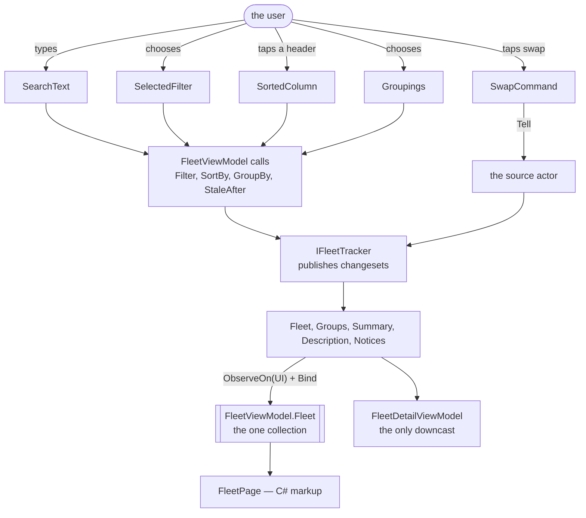
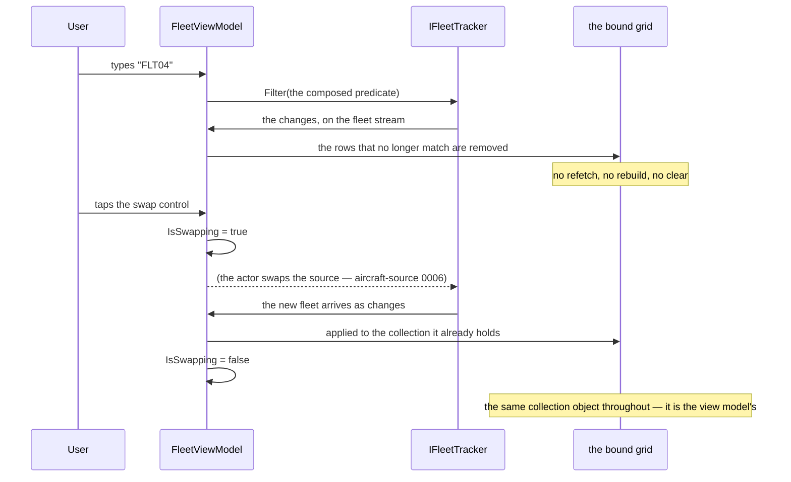
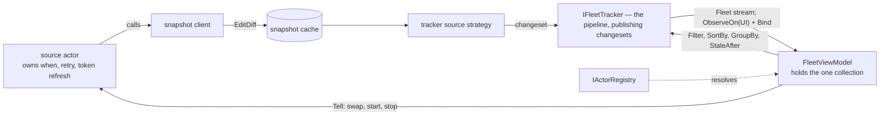

# Specification: Fleet dashboard

## 1. Business Goal

<!-- Rules: ../../../.spec/templates/feature.md § 1 -->

`fleet-pipeline` builds the collection; nothing looks at it. What the audience actually sees in a talk is a grid, and the demo's claim is made or lost on that screen: rows that update in place rather than flicker, a search box that re-filters without refetching, a column header that reorders without reloading, and a row that goes stale and stays. The repository today has the MAUI template — a `MainPage.xaml` with a dotnet bot and a click counter, bound to a demo view model that `Ask`s an actor and reads `.Result` on a continuation, which is the first thing `mvvm` § "Never add" forbids. So the surface the talk is delivered through is both absent and, where it exists, a worked example of the pattern this repository argues against. This Feature builds the dashboard: one page in C# markup, columns from the live source's description rather than from markup, every user input leaving as an observable or an actor message, and a detail pane that is the only place in the application allowed to ask which kind of vehicle it is holding. The failure state removed is a demo whose pipeline is correct and whose screen cannot show it.

## 2. User Needs

<!-- Rules: ../../../.spec/templates/feature.md § 2 -->

| #   | Persona                                                                                                                               | Need                                                                                                         | Pain point today                                                                                                                                            |
| --- | ------------------------------------------------------------------------------------------------------------------------------------- | ------------------------------------------------------------------------------------------------------------ | ----------------------------------------------------------------------------------------------------------------------------------------------------------- |
| 1   | Line-of-business .NET developer in the talk audience, whose data lives behind REST endpoints and SQL queries (README.md § "Audience") | To watch a grid update in place while a feed runs, and to read the one view model that makes it happen       | The repository's only page is the template's counter; there is nothing to read and nothing to point at                                                      |
| 2   | The same developer, whose own view model holds the filtering, the sorting and a copy of the list                                      | A view model thin enough to read in one sitting — input in, observable or message out, projection back       | `DemoViewModel` is the example they would copy, and it blocks on `.Result` inside a continuation                                                            |
| 3   | The same developer, whose grid's columns are compiled into the markup                                                                 | Columns, sorts and groupings that arrive from the source                                                     | Nothing consumes the description `fleet-pipeline` B-020 supplies, so the swap it exists for is still unproven on screen                                     |
| 4   | The presenter, demonstrating that a feed can stop                                                                                     | A row that is visibly marked when its aircraft goes quiet, and stays put                                     | `fleet-pipeline` marks it; nothing shows the mark, and a mark nobody can see is indistinguishable from no mark                                              |
| 5   | The presenter, at the closing act (README.md § "Closing act")                                                                         | To swap planes for ships in front of people, with a busy indicator covering it and no visible rebuild        | The swap is a registration today. Without a control and an indicator, the most load-bearing moment of the talk is a code change rather than a demonstration |
| 6   | Whoever maintains this repository after the talk                                                                                      | One page, one view model per surface, and the template's XAML gone rather than left as an apparent precedent | A `.xaml` file left from a template reads as the convention, and `maui-ui` has to say in words that it is not one                                           |

## 3. Acceptance Criteria

<!-- Rules: ../../../.spec/templates/feature.md § 3 -->

Twenty-seven claims, in seven groups: **B-001 – B-004** the surfaces and how they
are wired; **B-005 – B-008** the grid, including the stale mark; **B-009 –
B-012** the user's input; **B-013 – B-015** the detail pane and the summary;
**B-016 – B-019** the swap control and what a view model may not hold;
**B-020 – B-022** the swap test and the boundaries; **B-023 – B-027** the
arrival notice's two surfaces.

B-023 – B-027 were added on 2026-10-05, when the person asked for a visible sign
that new data had arrived. `fleet-pipeline` B-025 – B-027 publish the signal;
these five decide what is shown, where, and how often. Two surfaces, because the
answer was both: a banner that always reflects the latest notice, and a toast
that interrupts only for something worth interrupting for.

B-008 is grouped with the grid because it is what a row shows, and delivered by
`0038` with the pane and the summary, because the mark it displays arrives from
the pipeline item that derives it. A group is about subject; an item is about
what has to exist first.

Claim ids are scoped to this specification
(`transponder-conventions` § "Claim ids are `B-00n`"). A claim of another
Feature is written with that Feature's name — `fleet-pipeline` B-020, not
B-020.

| ID    | Claim                                                                                                                                                                                                                                                                                                                    | Source                                                                   |
| ----- | ------------------------------------------------------------------------------------------------------------------------------------------------------------------------------------------------------------------------------------------------------------------------------------------------------------------------ | ------------------------------------------------------------------------ |
| B-001 | The dashboard SHALL present one page carrying the fleet grid, the search and filter controls, the grouping selection, the summary and the detail pane.                                                                                                                                                                   | README.md § "UI features"                                                |
| B-002 | Every surface SHALL be built in C# markup through `CommunityToolkit.Maui.Markup`; no new `.xaml` SHALL be added, and the template's `MainPage.xaml`, its code-behind and `DemoViewModel` SHALL be removed rather than extended.                                                                                          | maui-ui § "Stack and wiring"; § 2 need 6                                 |
| B-003 | A page SHALL take its view model by constructor and SHALL NOT resolve one from a static or a service locator.                                                                                                                                                                                                            | maui-ui § "Stack and wiring"; mvvm § "The shape"                         |
| B-004 | Pages and view models SHALL be registered through the container's user-interface builder block, and SHALL NOT be registered ad hoc elsewhere in startup.                                                                                                                                                                 | maui-ui § "Stack and wiring"                                             |
| B-005 | The view model SHALL materialise the one collection the grid binds, from the fleet stream the tracker publishes, marshalling to the injected user-interface scheduler as it binds; it SHALL hold no second collection, SHALL copy no rows, and SHALL dispose that subscription with itself and nothing of the tracker's. | `fleet-pipeline` B-002; mvvm § "Projecting state back"                   |
| B-006 | A change to one vehicle SHALL update that row in place and SHALL NOT re-create the other rows.                                                                                                                                                                                                                           | maui-ui § "The UI reads; it never drives"                                |
| B-007 | The grid's columns SHALL be built from the live source's description, and no column, header or cell SHALL be compiled into the markup.                                                                                                                                                                                   | `fleet-pipeline` B-020; maui-ui § "The swap test"                        |
| B-008 | A row whose vehicle is stale SHALL carry a visible mark, and SHALL remain in the grid in its place.                                                                                                                                                                                                                      | `fleet-pipeline` B-016; § 2 need 4                                       |
| B-009 | The search text and the filter selections SHALL be composed into one predicate handed to the tracker's `Filter`; no view model SHALL filter, enumerate or edit a collection itself.                                                                                                                                      | mvvm § "Two kinds of input, two routes"; `fleet-pipeline` B-006          |
| B-010 | Search SHALL match case-insensitively, ignoring leading and trailing whitespace, against the vehicle's label and the columns the description marks searchable; empty text SHALL match every vehicle.                                                                                                                     | README.md § "UI features"; decided call                                  |
| B-011 | A filter selection SHALL compose with the search text by conjunction, and clearing one SHALL NOT clear the other.                                                                                                                                                                                                        | Decided call — a dropdown that silently resets a search reads as a bug   |
| B-012 | Choosing a column SHALL hand that column's comparer from the description to the tracker, choosing it again SHALL hand the reverse, and choosing a grouping SHALL hand one of the description's groupings.                                                                                                                | `fleet-pipeline` B-009 and B-012; README.md § "UI features"              |
| B-013 | Selecting a row SHALL show that vehicle in the detail pane, which SHALL be the only surface in the application that names a concrete `TransportVehicle` subclass.                                                                                                                                                        | ADR-0005 item 6; maui-ui § "The swap test"                               |
| B-014 | Clearing the selection SHALL empty the detail pane, and a selection SHALL NOT survive its vehicle leaving the collection.                                                                                                                                                                                                | Decided call — a detail pane showing a vehicle the grid no longer has    |
| B-015 | The summary SHALL bind what the tracker derives and SHALL NOT be recomputed in a view model or a view.                                                                                                                                                                                                                   | `fleet-pipeline` B-015; mvvm § "Does not belong in a view model"         |
| B-016 | Swapping the live source SHALL be sent to an actor as a message rather than published as an observable value, and a busy indicator SHALL cover the swap until the new fleet arrives.                                                                                                                                     | mvvm § "Two kinds of input, two routes"; `aircraft-source` decision 0002 |
| B-017 | No view or view model SHALL hold an `HttpClient`, a socket, a timer, a poll, a cache write, or a blocking call — no `.Result`, no `.Wait()`, no `GetAwaiter().GetResult()` — and an `Ask` SHALL carry an explicit timeout.                                                                                               | mvvm § "Never add"; maui-ui § "Never add"                                |
| B-018 | No view or view model SHALL derive staleness, filter, sort, group or expire anything; it SHALL supply the predicate, comparer or grouping the user chose and project what comes back.                                                                                                                                    | mvvm § "Thin means"; `fleet-pipeline` B-008                              |
| B-019 | A view model's display formatting SHALL be the only transformation it performs on a domain value, and a canonical unit SHALL be converted in an explicitly named member rather than inline in a binding.                                                                                                                 | ADR-0005 item 7; mapping                                                 |
| B-020 | No view or view model SHALL name an API contract, an API type, a client, a cache, a snapshot, a strategy, a concrete `ITrackerSource` or the swap decorator; its dependencies SHALL be `IFleetTracker`, `IFleetQuery` and the actors.                                                                                    | `aircraft-source` B-041 and B-047; hot-swap-source                       |
| B-021 | Swapping the live source SHALL require editing no view and no markup: the columns, comparers and groupings change because the description changed.                                                                                                                                                                       | maui-ui § "The swap test"; `fleet-pipeline` B-021                        |
| B-022 | No cast, type test or `switch` on a concrete `TransportVehicle` subclass SHALL appear outside the detail pane.                                                                                                                                                                                                           | ADR-0005 item 6; domain-model § "Never add"                              |
| B-023 | The page SHALL carry a banner showing the most recent notice — its instant, the vehicles tracked, and how many the changeset added, updated and removed — and SHALL NOT compute any of those numbers.                                                                                                                    | `fleet-pipeline` B-025; decided call 2026-10-05                          |
| B-024 | The banner SHALL change only when a notice arrives, and SHALL NOT clear, reorder, re-create or obscure any row of the grid.                                                                                                                                                                                              | `fleet-pipeline` B-025; maui-ui § "The UI reads; it never drives"        |
| B-025 | A toast SHALL appear only for a notice worth interrupting for — a quiet notice, a resumed notice, and the swap completing — and SHALL NOT appear for an ordinary update, however long the toast's own interval is set.                                                                                                   | Decided call 2026-10-05; `fleet-pipeline` B-027                          |
| B-026 | The banner's interval and the toast's interval SHALL be separate inputs on the page, each editable while the application runs, each published as an observable, defaulting to one second and one minute.                                                                                                                 | Decided call 2026-10-05; `fleet-pipeline` B-026 and § 4 row 10           |
| B-027 | No view model SHALL name a toast, snackbar, alert or any other platform notification type; a view model SHALL publish notices and a view SHALL be what renders one.                                                                                                                                                      | mvvm § "Never add"; maui-ui § "Never add"                                |

## 4. Constraints

<!-- Rules: ../../../.spec/templates/feature.md § 4 -->

| #   | Constraint                                                                                                                                                                                                                                                                                                                                                                                                                                                                                                                                                                                                                                                                                                             | Source                                                            | Impact                                                                                                                                                                                                                                                    |
| --- | ---------------------------------------------------------------------------------------------------------------------------------------------------------------------------------------------------------------------------------------------------------------------------------------------------------------------------------------------------------------------------------------------------------------------------------------------------------------------------------------------------------------------------------------------------------------------------------------------------------------------------------------------------------------------------------------------------------------------- | ----------------------------------------------------------------- | --------------------------------------------------------------------------------------------------------------------------------------------------------------------------------------------------------------------------------------------------------- |
| 1   | `fleet-pipeline` owns every operator. This Feature supplies inputs and binds outputs, and claims nothing about what the pipeline does with either.                                                                                                                                                                                                                                                                                                                                                                                                                                                                                                                                                                     | `fleet-pipeline` § 3; dynamic-data-pipeline                       | A behaviour that looks like a UI bug and is a pipeline rule — a filter not re-evaluating, a row vanishing — is reported against that Feature's claims, not fixed in a view.                                                                               |
| 2   | Three of `fleet-pipeline`'s open questions land here, and two change this Feature's surface: where the summary is exposed (its § 11 row 2), and whether a column carries a formatted cell or a canonical value plus a formatter (its § 11 row 3).                                                                                                                                                                                                                                                                                                                                                                                                                                                                      | `fleet-pipeline` § 11                                             | B-015 and B-019 are written against the recommendations: the summary on the tracker, and the column carrying a display-formatted cell. If either is answered the other way, both claims are amended before `0036` starts. § 11 row 1 carries this.        |
| 3   | MAUI's shipped grid is `CollectionView`; this repository has no third-party grid and does not add one.                                                                                                                                                                                                                                                                                                                                                                                                                                                                                                                                                                                                                 | `Directory.Packages.props`; maui-ui                               | "Columns" are a template the description drives rather than a grid feature, and B-006's in-place update is `CollectionView`'s behaviour given a changeset-bound collection — not something a converter can rescue.                                        |
| 4   | The MAUI heads do not build on Linux CI, so no test here may need one.                                                                                                                                                                                                                                                                                                                                                                                                                                                                                                                                                                                                                                                 | [item 0018](../../../.issue/0018-linux-ci-build-scope.yml)        | Every claim that can be proven must be provable by a view-model test. What is left — markup, a page's registration, what a view may name — is an analyzer rule or a review, never a UI test runner this repository does not have.                         |
| 5   | View models live beside the actors they talk to, under `src/Transponder/Features/`, and the pages live in `src/Gui`.                                                                                                                                                                                                                                                                                                                                                                                                                                                                                                                                                                                                   | `transponder-conventions` § "Project structure"                   | The split is why a view-model test needs no MAUI head: nothing in `src/Transponder` references a page. A view model that would need one has reached for something `maui-ui` keeps in the view.                                                            |
| 6   | The swap is already specified: `aircraft-source` `0006` owns the decorator and the disposal, and its decision 0002 chose the busy indicator over a frozen grid.                                                                                                                                                                                                                                                                                                                                                                                                                                                                                                                                                        | `aircraft-source` `0006`, decisions/0002                          | B-016 claims the control and the indicator only. The actor that performs the swap, and what it disposes, are that item's.                                                                                                                                 |
| 7   | `DemoViewModel` and `MainPage.xaml` are the template's, and `MauiProgram` registers both.                                                                                                                                                                                                                                                                                                                                                                                                                                                                                                                                                                                                                              | `src/Gui/MauiProgram.cs`, `src/Gui/MainPage.xaml`                 | B-002 removes all three registrations rather than leaving a second page nobody opens. The removal is this Feature's because it is the thing that replaces them.                                                                                           |
| 9   | A toast needs `CommunityToolkit.Maui`, not the `.Markup` package this repository has. `Toast` and `Snackbar` live in the full toolkit and need `UseMauiCommunityToolkit()` beside the existing `UseMauiCommunityToolkitMarkup()`.                                                                                                                                                                                                                                                                                                                                                                                                                                                                                      | `Directory.Packages.props`; `src/Gui/MauiProgram.cs`              | `0041` adds one central package version and one builder call — the only package this Feature adds. The banner needs nothing, which is why B-023 is deliverable even if the toolkit addition is refused.                                                   |
| 10  | A toast is a platform alert: drawn by the operating system, outside the page's visual tree, and this repository runs no UI test runner (row 4).                                                                                                                                                                                                                                                                                                                                                                                                                                                                                                                                                                        | maui-ui; row 4                                                    | B-025's § 9 row is a **review**, not a test. A view-model test still proves which notices are offered for interruption and which are not, so that half is asserted and the rendering half is read.                                                        |
| 11  | The two surfaces pace independently, and both intervals are edited on stage.                                                                                                                                                                                                                                                                                                                                                                                                                                                                                                                                                                                                                                           | Decided call 2026-10-05 (the person); `fleet-pipeline` § 4 row 10 | B-026 is two inputs and two observables, not one setting. `fleet-pipeline` B-026 takes the interval per subscription, so this Feature subscribes twice and paces each — no throttling is implemented here, which keeps that operator tested in one place. |
| 8   | **The architecture review is answered (2026-10-05), and it moved this Feature's seams.** [ADR-0009](../../../.spec/adr/0009-the-pipeline-publishes-changesets-a-consumer-binds.md): the pipeline publishes changeset streams and owns no bound collection, so **this Feature's view model calls `ObserveOn(UserInterfaceThread)` and `Bind`**, holds the resulting collection, and disposes that subscription with itself. `IFleetQuery` is deleted — the four inputs are methods on the tracker (`Filter`, `SortBy`, `GroupBy`, `StaleAfter`), which this Feature's view models call with the value the user chose; the tracker owns the subject behind each and its default. `StaleVehicle` stays the bound element. | ADR-0009; `fleet-pipeline` § 11 row 4                             | B-005, B-009 and B-012 are amended for it, and § 7's member table, prose and diagrams are rewritten. The rate cap stays in the pipeline, so B-026 and B-027 are unchanged.                                                                                |

## 5. Out of Scope

<!-- Rules: ../../../.spec/templates/feature.md § 5 -->

| #   | Item                                                                                | Exclusion reason                                                                                                                                                   |
| --- | ----------------------------------------------------------------------------------- | ------------------------------------------------------------------------------------------------------------------------------------------------------------------ |
| 1   | Every pipeline operator, and staleness itself                                       | `fleet-pipeline` owns them (§ 4 row 1). This Feature shows the mark; it does not decide who is stale.                                                              |
| 2   | The swap decorator, the disposal of an outgoing source, and the actor that swaps    | `aircraft-source` `0006` (§ 4 row 6). B-016 is the control and the indicator.                                                                                      |
| 3   | The map view                                                                        | Optional in README.md § "UI features", and a second surface rather than this one. It would bind the same collection B-005 binds, so nothing here forecloses it.    |
| 4   | A settings surface for the staleness threshold, the polling interval or credentials | `fleet-pipeline` B-017 makes the threshold configurable and the provider's options are `aircraft-source`'s; a screen to edit either is a feature nobody asked for. |
| 5   | Theming, dark mode, platform-specific styling, accessibility beyond MAUI's defaults | No need in §§ 1-2 asks for them, and the demo runs on one machine the presenter controls.                                                                          |
| 6   | Desktop and mobile layout variants                                                  | The talk is delivered from one screen. One layout, and the heads that do not build on Linux CI stay out of the test story (§ 4 row 4).                             |
| 7   | A UI test runner, and snapshot or screenshot tests                                  | § 4 row 4. The view-model test is the whole of this Feature's executing coverage, which is also the argument for keeping the views empty.                          |

## 6. Concern Separation

<!-- Rules: ../../../.spec/templates/feature.md § 6 -->

| Item                                                       | Classification | Notes                                                                                                                                                                      |
| ---------------------------------------------------------- | -------------- | -------------------------------------------------------------------------------------------------------------------------------------------------------------------------- |
| One page carrying grid, filters, grouping, summary, detail | Business       | README.md § "UI features" lists the surfaces; § 2 need 1 is why they are on one screen rather than behind navigation.                                                      |
| C# markup, and the template's XAML removed                 | Technical      | `maui-ui` § "Stack and wiring", plus § 2 need 6: a left-behind `.xaml` reads as the convention. No business statement depends on it.                                       |
| Search and filter semantics                                | Business       | B-010 and B-011 are what a user expects of a search box — case-insensitive, trimmed, empty means everything, and a dropdown that does not clear the search.                |
| Composing input into one predicate rather than filtering   | Technical      | The user-visible result is identical either way; which side of the seam does the work is `mvvm`'s rule and the reason the view model stays readable.                       |
| The detail pane is the only place a subclass appears       | Both           | Business: § 2 need 1 — the pane is where an aircraft's own fields are worth showing. Technical: ADR-0005 item 6 makes it the one legitimate downcast.                      |
| The swap control and its busy indicator                    | Both           | Business: § 2 need 5, the closing act is performed in front of people. Technical: `Tell` rather than an observable, because a swap is an effect and an actor owns failure. |
| What a view model may not hold                             | Technical      | B-017 – B-020 constrain the code. The business reason is indirect and real: § 2 need 2 is a developer copying this view model into their own application.                  |

## 7. Technical Design

<!-- Rules: ../../../.spec/templates/feature.md § 7 -->

One page, three view models, and no logic in the markup. `FleetViewModel` owns
the grid, the inputs and the selection; `FleetDetailViewModel` owns the pane;
`FleetSummaryViewModel` projects the tracker's counts. Each derives `RxObject`
and uses the `field`-keyword property form (`mvvm` § "The shape").

`FleetViewModel` drives the pipeline through the four methods the tracker
exposes — `Filter`, `SortBy`, `GroupBy` and `StaleAfter` — because the four
things the pipeline reacts to are four things the user changes. It implements no
interface to do it and constructs no observable for it: `IFleetQuery` was deleted
by the § 11 row 4 review, and the tracker owns the subject behind each method and
the default it starts at (`fleet-pipeline` § 7, ADR-0009). So a keystroke is a
property setter composing a predicate and one call; the pipeline still never
names the view model.

That keeps `mvvm` § "Two kinds of input, two routes" intact where it matters: a
continuous value still goes to the pipeline and a discrete effect still goes to
an actor as a `Tell`. What changed is the carrier for the continuous half — a
method call rather than an observable this Feature publishes — and the view model
is thinner for it, since it no longer owns four subjects whose defaults it had to
remember.

**This Feature owns every `Bind` in the application.** The tracker publishes
`IObservable<IChangeSet<…>>`; a view model marshals to
`ISchedulerProvider.UserInterfaceThread`, binds, and disposes that one
subscription with itself (`mvvm` § "Projecting state back"). Two consequences
worth stating: a disposal bug here freezes one view's rows rather than stopping
the fleet, and the grid's collection is this view model's for its lifetime — the
object is not replaced by a source swap (B-005, B-006).

**Domain model**

No domain type is added or changed. The types below are view state.

| Field                                 | Type                                            | Notes                                                                                                                                                                                                                                                                                                               |
| ------------------------------------- | ----------------------------------------------- | ------------------------------------------------------------------------------------------------------------------------------------------------------------------------------------------------------------------------------------------------------------------------------------------------------------------- |
| `FleetViewModel.Fleet`                | `ReadOnlyObservableCollection<StaleVehicle>`    | **The one collection, materialised here.** `_tracker.Fleet.ObserveOn(schedulers.UserInterfaceThread).Bind(out field).Subscribe()` in the constructor, disposed with the view model. The tracker publishes a stream and owns no collection (ADR-0009), so this is where it becomes one — and the only place (B-005). |
| `FleetViewModel.SearchText`           | `string`                                        | `RaiseAndSetIfChanged`; published into the predicate (B-009).                                                                                                                                                                                                                                                       |
| `FleetViewModel.Filters`              | `IReadOnlyList<FleetFilterChoice>`              | What the dropdowns offer, from the description's searchable columns.                                                                                                                                                                                                                                                |
| `FleetViewModel.SelectedFilter`       | `Option<FleetFilterChoice>`                     | Absent means no dropdown constraint, which is a value rather than a null (B-011).                                                                                                                                                                                                                                   |
| `FleetViewModel.Columns`              | `IReadOnlyList<FleetColumn>`                    | From the description, in its order (B-007).                                                                                                                                                                                                                                                                         |
| `FleetViewModel.SortedColumn`         | `Option<(FleetColumn Column, bool Descending)>` | Which header is active and in which direction (B-012).                                                                                                                                                                                                                                                              |
| `FleetViewModel.Groupings`            | `IReadOnlyList<FleetGrouping>`                  | From the description.                                                                                                                                                                                                                                                                                               |
| `FleetViewModel.Selected`             | `Option<TransportVehicle>`                      | The abstract type: the grid selects a vehicle, and only the pane learns which kind (B-013).                                                                                                                                                                                                                         |
| `FleetViewModel.IsSwapping`           | `bool`                                          | Drives the busy indicator (B-016).                                                                                                                                                                                                                                                                                  |
| `FleetViewModel.SwapCommand`          | `ICommand`                                      | Tells the actor; never `Ask`s it (B-016, B-017).                                                                                                                                                                                                                                                                    |
| `FleetFilterChoice.Name`              | `string`                                        | What the dropdown shows.                                                                                                                                                                                                                                                                                            |
| `FleetFilterChoice.Matches`           | `Func<TransportVehicle, bool>`                  | The constraint, over the base only (B-022).                                                                                                                                                                                                                                                                         |
| `FleetDetailViewModel.Vehicle`        | `Option<TransportVehicle>`                      | Absent empties the pane (B-014).                                                                                                                                                                                                                                                                                    |
| `FleetDetailViewModel.Rows`           | `IReadOnlyList<(string Label, string Value)>`   | The pane's own projection, where the one legitimate downcast happens (B-013) and where a canonical unit is converted by a named member (B-019).                                                                                                                                                                     |
| `FleetSummaryViewModel.Tracked`       | `int`                                           | Projected from the tracker's summary; not recomputed (B-015).                                                                                                                                                                                                                                                       |
| `FleetSummaryViewModel.Stale`         | `int`                                           | Same.                                                                                                                                                                                                                                                                                                               |
| `FleetSummaryViewModel.Groups`        | `int`                                           | Same.                                                                                                                                                                                                                                                                                                               |
| `FleetBannerViewModel.Latest`         | `Option<FleetNotice>`                           | The most recent notice at the banner's cadence; absent until the first arrives (B-023).                                                                                                                                                                                                                             |
| `FleetBannerViewModel.BannerInterval` | `TimeSpan`                                      | Edited on the page, published as an observable into `IFleetTracker.Notices` (B-026). One second by default.                                                                                                                                                                                                         |
| `FleetBannerViewModel.ToastInterval`  | `TimeSpan`                                      | The second subscription's cadence, edited separately (B-026). One minute by default.                                                                                                                                                                                                                                |
| `FleetBannerViewModel.Interrupting`   | `IObservable<FleetNotice>`                      | The notices worth interrupting for — quiet, resumed, and the swap completing — which the **page** turns into a toast (B-025, B-027).                                                                                                                                                                                |

**Diagrams**





Class diagram: not applicable — the member tables above state the shape, and a
second rendering of three view models would be one more thing to keep in step.

**Interface changes**

**None.** `IFleetQuery` is gone (ADR-0009), so this Feature implements no
interface of the pipeline's and declares none of its own: it consumes
`IFleetTracker`'s streams and hands four observables to the composition root.
The page and the view models are classes rather than interfaces — nothing
substitutes a view, and a view model is substituted in a test by construction
rather than through a seam.

| Type              | File                                                                                                                              | Claims it makes visible |
| ----------------- | --------------------------------------------------------------------------------------------------------------------------------- | ----------------------- |
| `MauiProgram`     | [`src/Gui/MauiProgram.cs`](../../../src/Gui/MauiProgram.cs)                                                                       | B-002, B-004            |
| `MainPage` (XAML) | [`src/Gui/MainPage.xaml`](../../../src/Gui/MainPage.xaml)                                                                         | B-002 — removed by it   |
| `DemoViewModel`   | [`src/Transponder/Features/Demo/ViewModels/DemoViewModel.cs`](../../../src/Transponder/Features/Demo/ViewModels/DemoViewModel.cs) | B-002 — removed by it   |

Where the new code goes, following `transponder-conventions` § "Project
structure":

```
src/Gui/Views/                        FleetPage, the grid, filter, summary and detail markup
src/Transponder/Features/Fleet/       FleetViewModel, FleetDetailViewModel, FleetSummaryViewModel, FleetFilterChoice
```

`src/Transponder/Features/Demo/` leaves entirely under B-002: the actor stays
only if something still sends to it, and nothing will.

**How the tracker reaches a view model**

Half of this is already decided by rules this repository holds, and writing it
down is what stops it being re-litigated in an implementation pull request.

**The view model takes `IFleetTracker` by constructor. It does not reach it
through an actor, and no actor holds it.** Three rules converge on that:

- `aircraft-source` B-041 makes `IFleetTracker` what view models depend on.
- `akka-actor` § "Who owns what": an actor "emits snapshots and **never holds
  the collection the UI binds to**", and its `Never add` list names "a
  collection of tracked items held in an actor". The tracker owns the one
  collection (`fleet-pipeline` B-002), so it is not an actor and is not held by
  one.
- `mvvm` § "The shape": dependencies arrive by constructor, nothing from a
  static or a locator.

So the two routes out of a view model are the two `mvvm` § "Two kinds of input,
two routes" already names, and nothing else: a **continuous** value — a
keystroke, a chosen comparer, a grouping — is published as an observable
to the pipeline through the method that takes it (B-009, B-012), and a
**discrete effect** — swap the source, start, stop — is `Tell`d to an actor resolved from
`IActorRegistry` (B-016). Data comes back the one way: the tracker's streams,
bound here (B-005).

What the actors own here is **time and failure upstream of the seam**, which is
the arrangement [ADR-0002](../../../.spec/adr/0002-contract-client-strategy-tracker.md)
already describes: a source actor polls on its own schedule, the client it calls
writes its cache, the strategy projects, and the tracker's pipeline sees a
changeset. The actor and the view model never exchange tracked items at all,
which is why neither needs to know the other holds any.



**The two notice surfaces**

`fleet-pipeline` publishes the notices and this Feature decides what a person
sees. Two surfaces, two cadences, and the split is what keeps either one
useful:

- **The banner** is in the page's own markup and always shows the latest notice
  — `14:32:10 · 37 tracked · 1 added, 2 updated, 1 removed`. It overlays
  nothing, so it can update every second without covering the grid it is
  describing (B-023, B-024).
- **The toast** interrupts, so it is reserved for a notice that earns it: the
  feed going quiet, the feed resuming, and the swap completing. B-025 forbids
  one for an ordinary update at any interval, because a toast every second is
  the demo arguing against itself on a projector.

Both subscribe to `IFleetTracker.Notices(IObservable<TimeSpan>)` separately,
each with its own interval observable fed by its own input field (B-026). No
throttling is written here: the operator lives in the pipeline, tested once
(`fleet-pipeline` § 4 row 10).

**The view model does not name the toast.** It exposes `Interrupting`, and the
page subscribes and calls the toolkit (B-027). That keeps every notice decision
— which kinds interrupt, at what cadence — in a plain class a test drives, and
leaves the platform call in the one place this repository cannot test anyway
(§ 4 row 10).

**Decision required**

> What is **not** settled is the startup wiring, and it is a mechanism question
> rather than a design one. `AddAkkaHost` takes an
> `Action<ActorSystem, IActorRegistry>` and hands an actor starter no
> `IServiceProvider`
> ([`src/Gui/Container/AkkaHostBuilder.cs`](../../../src/Gui/Container/AkkaHostBuilder.cs)),
> while every actor above the seam needs container-resolved collaborators — the
> client, the cache, the clock writer, the options. `ClickActor` is the only
> actor in the repository and it needs nothing, so the question has never come
> up.
>
> Three sub-questions, none answerable from this repository as it stands: how a
> source actor gets its dependencies (`DependencyResolver`, a `Props` factory
> closing over the provider, or a registration that resolves the actor from the
> container); whether `IFleetTracker` is a container singleton the pages resolve
> or an object the composition root builds and registers; and who starts the
> first poll, and when, given a page may be constructed before any actor has
> reported.
>
> **Recommendation:** answer it with a spike rather than inside an
> implementation item — [item `0040`](../../../.issue/0040-actor-wiring-and-tracker-lifetime-spike.yml),
> which `fleet-pipeline` `0031` and this Feature's `0036` both name in their
> `spikes`. It is a day of reading Akka.Hosting and the MAUI container against
> this repository's own builder blocks, and the wrong guess is expensive in both
> directions: an actor that resolves its own dependencies from a static provider
> is the service locator `mvvm` forbids one layer down, and a tracker built
> twice is two collections (`fleet-pipeline` B-002) with no error to say so.
> **Awaiting:** the spike's finding, then the person (§ 11 row 4).

The two `fleet-pipeline` open questions that decide B-015's and B-019's shape
are § 4 row 2; this Feature opens no other design decision of its own.

## 8. Testing Strategy

<!-- Rules: ../../../.spec/templates/feature.md § 8 -->

**Testability assessment**

| Dimension          | Verdict       | Finding                                                                                                                                                                                                                                                                     | Recommendation                                                                                                                                                        |
| ------------------ | ------------- | --------------------------------------------------------------------------------------------------------------------------------------------------------------------------------------------------------------------------------------------------------------------------- | --------------------------------------------------------------------------------------------------------------------------------------------------------------------- |
| DI seams           | Pass          | Each view model takes `IFleetTracker`, `IActorRegistry` and `ISchedulerProvider` by constructor and constructs none of them. A test substitutes the tracker, uses a `TestKit` probe for the registry, and drives one `TestScheduler`.                                       | —                                                                                                                                                                     |
| Behavior isolation | **Qualified** | The view models isolate cleanly; the views do not test at all (§ 4 row 4). That is the design — `maui-ui` § "Testing" says the view-model test is the whole of the UI's coverage — but it means B-001, B-002, B-006 and B-007 have no executing proof of their visual half. | Prove what can be proven at the view model: the columns it exposes (B-007), the predicate it publishes (B-009 – B-011). What is left is an analyzer rule or a review. |
| Coverage potential | **Qualified** | Thirteen claims are about a value a view model produces and are ordinary xUnit tests. Nine are structural or visual — B-001 – B-004, B-006, B-017, B-018, B-020, B-022 — and a test proves none of them.                                                                    | Four become analyzer rules, extending the set ADR-0006 established. B-001, B-002 and B-006 take a review, recorded with what was looked at (lesson 0011).             |
| Fixtures           | Pass          | A test builds synthetic `Aircraft` and a description by hand, and feeds them through a substituted tracker. No provider shape, no JSON and no HTTP appears anywhere in this Feature's arrangements.                                                                         | —                                                                                                                                                                     |
| Determinism        | Pass          | One `TestScheduler` in both scheduler positions; the view models marshal at their own boundary, so a test advances time rather than waiting. No test opens a window.                                                                                                        | —                                                                                                                                                                     |

**Three mechanisms, and which proves what.** A value a view model computes is
an xUnit test. A rule about what a view or view model may name or do is an
analyzer diagnostic ([ADR-0006](../../../.spec/adr/0006-an-analyzer-enforces-the-layer-boundaries.md)).
A claim about what is on the screen, which this repository can neither test nor
analyze (§ 4 row 4), is a **review**: performed by a reader, recorded in § 9
with what was looked at and what change re-does it
([lesson 0011](../../../.spec/lessons/0011-a-review-nobody-performed-is-not-a-review-nobody-can-perform.md)).
A review is not a weaker test; it is the honest form for a claim nothing
executes.

**Scenarios**

Full Gherkin lives in [`fleet-dashboard.feature`](fleet-dashboard.feature)
beside this file — twenty-seven scenarios, each tagged with the `@B-00n` it
proves. Scenarios are documentation; the xUnit tests and the analyzer's
diagnostics are what execute.

- Happy path → B-005, B-007, B-009 – B-013, B-015, B-016, B-023, B-026
- Failure mode → B-006, B-008, B-014, B-017, B-024, B-025
- Validation failure → B-001 – B-004, B-018 – B-022, B-027
- Data-driven → B-010, B-011, B-026

## 9. Traceability Matrix

<!-- Rules: ../../../.spec/templates/feature.md § 9 -->

**This is the gate, and all twenty-seven rows read `Missing`.** Nothing here is
built, and nothing can be until `fleet-pipeline` exposes a tracker to bind.
Three rows name a review rather than a test, because what is on a screen is
not something this repository executes or analyzes (§ 8); they are `Missing`
until someone performs them and records what they looked at.

| Claim ID | Scenario | Test                                                                                                                                                                       | Status  |
| -------- | -------- | -------------------------------------------------------------------------------------------------------------------------------------------------------------------------- | ------- |
| B-001    | `@B-001` | review — the page carries all five surfaces; re-done by any change to `FleetPage`'s layout                                                                                 | Missing |
| B-002    | `@B-002` | review — no `.xaml` remains under `src/Gui` but the template's shell, and `MauiProgram` registers neither removed type; re-done by any new page                            | Missing |
| B-003    | `@B-003` | `FleetPageTests.GivenTheFleetPage_WhenItIsConstructed_ThenItTakesItsViewModelAndResolvesNothing`                                                                           | Missing |
| B-004    | `@B-004` | `ContainerTests.GivenTheConstructedApplication_WhenThePagesAndViewModelsAreResolved_ThenEachWasRegisteredThroughTheUserInterfaceBuilder`                                   | Missing |
| B-005    | `@B-005` | `FleetViewModelTests.GivenATrackerPublishingAFleet_WhenTheViewModelIsConstructed_ThenItBindsTheStreamIntoItsOneCollection`                                                 | Missing |
| B-006    | `@B-006` | review — one vehicle's change produces one row update and no re-creation; re-done by a change to the grid's item template                                                  | Missing |
| B-007    | `@B-007` | `FleetViewModelTests.GivenADescription_WhenTheColumnsAreRead_ThenTheyAreTheDescriptionsInItsOrder`                                                                         | Missing |
| B-008    | `@B-008` | `FleetViewModelTests.GivenAStaleVehicle_WhenItsRowIsProjected_ThenItIsMarkedAndStillInTheFleet`                                                                            | Missing |
| B-009    | `@B-009` | `FleetViewModelTests.GivenSearchTextAndAFilter_WhenTheyChange_ThenOnePredicateReachesTheTrackerAndNoCollectionIsEnumerated`                                                | Missing |
| B-010    | `@B-010` | `FleetSearchTests.GivenSearchText_WhenItIsMatched_ThenMatchingIsCaseInsensitiveTrimmedAndEmptyMatchesEverything`                                                           | Missing |
| B-011    | `@B-011` | `FleetSearchTests.GivenASearchAndAFilter_WhenEitherIsCleared_ThenTheOtherStillApplies`                                                                                     | Missing |
| B-012    | `@B-012` | `FleetViewModelTests.GivenAColumnChosenTwiceAndAGroupingChosen_WhenTheTrackerIsRecorded_ThenItReceivedTheComparerItsReverseAndTheGrouping`                                 | Missing |
| B-013    | `@B-013` | `FleetDetailViewModelTests.GivenASelectedAircraft_WhenItsRowsAreRead_ThenTheyIncludeFieldsOnlyAnAircraftReports`                                                           | Missing |
| B-014    | `@B-014` | `FleetDetailViewModelTests.GivenASelectionThatLeavesTheFleet_WhenTheSelectionIsRead_ThenItIsAbsentAndThePaneIsEmpty`                                                       | Missing |
| B-015    | `@B-015` | `FleetSummaryViewModelTests.GivenTheTrackersSummary_WhenItChanges_ThenTheProjectedCountsFollowItAndNothingIsRecomputed`                                                    | Missing |
| B-016    | `@B-016` | `FleetViewModelTests.GivenTheSwapCommand_WhenItIsInvoked_ThenTheActorIsToldAndTheBusyIndicatorCoversIt`                                                                    | Missing |
| B-017    | `@B-017` | analyzer — a view or view model holding an `HttpClient`, timer, socket, cache write, blocking call or untimed `Ask` is reported                                            | Missing |
| B-018    | `@B-018` | analyzer — filtering, sorting, grouping, expiry or staleness arithmetic in a view or view model is reported at the expression                                              | Missing |
| B-019    | `@B-019` | `FleetDetailViewModelTests.GivenAnAltitudeInMetres_WhenItIsProjected_ThenTheConversionIsANamedMemberAndTheCanonicalValueIsUnchanged`                                       | Missing |
| B-020    | `@B-020` | analyzer — `BoundaryAnalyzer`'s existing view-model rule, extended to the dashboard's types                                                                                | Missing |
| B-021    | `@B-021` | `FleetViewModelTests.GivenASecondDescription_WhenItArrives_ThenTheColumnsGroupingsAndFiltersChangeWithNoMarkupEdit`                                                        | Missing |
| B-022    | `@B-022` | analyzer — a cast, `is` or `switch` on a vehicle subclass outside the detail pane is reported at the expression                                                            | Missing |
| B-023    | `@B-023` | `FleetBannerViewModelTests.GivenANotice_WhenTheBannerIsProjected_ThenItShowsTheInstantAndTheCountsAndComputesNone`                                                         | Missing |
| B-024    | `@B-024` | `FleetBannerViewModelTests.GivenNoNoticeArrives_WhenTheBannerIsRead_ThenItIsUnchanged`, plus a review that it overlays no row                                              | Missing |
| B-025    | `@B-025` | `FleetBannerViewModelTests.GivenAnUpdatedAQuietAndAResumedNotice_WhenTheInterruptingOnesAreObserved_ThenOnlyTheQuietAndResumedAppear`, plus a review of the rendered toast | Missing |
| B-026    | `@B-026` | `FleetBannerViewModelTests.GivenTwoIntervalsEditedWhileRunning_WhenNoticesArrive_ThenEachSurfaceIsPacedByItsOwn`                                                           | Missing |
| B-027    | `@B-027` | analyzer — a toast, snackbar or alert type named in a view model is reported at the reference                                                                              | Missing |

## 10. Lessons / Spec Deltas

<!-- Rules: ../../../.spec/templates/feature.md § 10 -->

None yet — nothing is built, so no bug has been closed here.

## 11. Open Questions

<!-- Rules: ../../../.spec/templates/feature.md § 11 -->

| #   | Question                                                                                                                                                                                                                                                                                                                                                                                                                                                                                                                                      | Owner                      | Target date |
| --- | --------------------------------------------------------------------------------------------------------------------------------------------------------------------------------------------------------------------------------------------------------------------------------------------------------------------------------------------------------------------------------------------------------------------------------------------------------------------------------------------------------------------------------------------- | -------------------------- | ----------- |
| 1   | `fleet-pipeline` § 11 rows 2 and 3 decide B-015's and B-019's shape (§ 4 row 2). Both are written against the recommendations; answering either the other way amends a claim here before `0036` starts.                                                                                                                                                                                                                                                                                                                                       | the person                 | 2026-10-12  |
| 2   | `Features/Demo/` leaves under B-002. Does `ClickActor` go with it, or stay as the repository's one worked example of an actor for `akka-actor` to point at?                                                                                                                                                                                                                                                                                                                                                                                   | the person                 | 2026-10-12  |
| 3   | B-016's busy indicator covers the swap per `aircraft-source` decision 0002. Does the same indicator cover the first load, before any source has reported — or is an empty grid with a message the right first impression?                                                                                                                                                                                                                                                                                                                     | the person                 | 2026-10-12  |
| 4   | How a source actor gets its container-resolved dependencies, and who starts the first poll. **Partly answered 2026-10-05**: ADR-0009 makes `IFleetTracker` a container singleton disposed by the container, so what is left is the actor's wiring and the first subscription — a late subscriber receives changes from that point, not the current fleet. § 7's decision block states the three sub-questions; [item `0040`](../../../.issue/0040-actor-wiring-and-tracker-lifetime-spike.yml) is the spike, and `0036` names it in `spikes`. | the spike, then the person | 2026-10-12  |

## 12. Sign-off

<!-- Rules: ../../../.spec/templates/feature.md § 12 -->

| Sections | Owner       | Status      |
| -------- | ----------- | ----------- |
| §§ 1-5   | spec-author | 🟢 Approved |
| §§ 6-7   | implementer | 🟢 Approved |
| §§ 8-9   | test-writer | 🟢 Approved |

What `approved` requires, and why a `Missing` row in § 9 does not hold it back,
is [the template's § 12](../../../.spec/templates/feature.md). No row here is
🟢, so no item below moves to `in-progress`.

**Review of 2026-10-05, after ADR-0009.** Mechanically clean: 27 claims, 27 § 9
rows, 27 scenarios, every `@B-00n` tagged once, and no claim naming a type. One
finding.

**The `@B-005` scenario asserted something B-005 did not claim — closed.** Its
last step, "disposing the view model disposes that subscription and nothing of
the tracker's", is the right behaviour and now the most load-bearing one this
Feature has: ADR-0009 moved the `Bind` here, so a disposal bug freezes a view's
rows while the fleet keeps running and nothing else in the application would
report it. A scenario may only prove its claim, so **B-005 gained the disposal
clause** rather than the step coming out.

**Re-reviewed after the input surface changed.** The pipeline's four inputs
became methods on the tracker, so B-009 and B-012 are reworded — the view model
hands a value to `Filter`, `SortBy`, `GroupBy` or `StaleAfter` rather than
publishing an observable the pipeline was constructed with — and § 7, two
diagrams, one scenario and two § 9 test names follow. `mvvm` § "Two kinds of
input, two routes" still holds: the continuous value goes to the pipeline, the
discrete effect goes to an actor; only the carrier changed, and this Feature is
thinner for it, owning no subject and no default.

`fleet-pipeline`'s blocking finding is also closed, and its answer reaches this
Feature: the tracker holds no subscription of its own and its notice derivation
is built per subscription, so a view model may assume nothing is live until it
subscribes, and that disposing the tracker completes the stream its collection is
bound to.

## Decisions

<!-- Rules: ../../../.spec/templates/feature.md § Decisions -->

None yet. The swap's own product call — a busy indicator rather than a frozen
grid — was made in `aircraft-source`
[decision 0002](../../aircraft-source/.spec/decisions/0002-busy-indicator-on-swap.md)
and is honoured here by B-016 rather than re-decided.

The domain base this Feature binds is
[ADR-0005](../../../.spec/adr/0005-an-abstract-base-carries-the-tracked-item.md),
whose item 6 is why the detail pane exists as a named exception.

## Tasks

<!-- Rules: ../../../.spec/templates/feature.md § Tasks -->

| Item                                                           | Claims                                          |
| -------------------------------------------------------------- | ----------------------------------------------- |
| [`0035`](../.issue/0035-fleet-dashboard.yml)                   | all 27 — the parent; its children hold the work |
| [`0036`](../.issue/0036-fleet-page-and-grid.yml)               | B-001 – B-007                                   |
| [`0037`](../.issue/0037-search-sort-and-grouping-input.yml)    | B-009 – B-012                                   |
| [`0038`](../.issue/0038-detail-pane-and-summary.yml)           | B-008, B-013 – B-015, B-019                     |
| [`0039`](../.issue/0039-swap-control-and-thin-view-models.yml) | B-016 – B-018, B-020 – B-022                    |
| [`0041`](../.issue/0041-arrival-banner-and-toast.yml)          | B-023 – B-027                                   |

Every claim is carried by exactly one child. `0036` removes the template's page
and view model as it replaces them (B-002), which is why that claim is not an
item of its own: a removal with no replacement leaves the application without a
page.

Each item's `depends_on` sequences the work: `0036` waits on `fleet-pipeline`
`0032`, which is the first item with a description to build columns from;
`0037` and `0038` wait on `0036` and on the pipeline items whose outputs they
bind — `0033` for the filtered collection and the summary, `0034` for the stale
mark; `0039` waits on `0036` and on `aircraft-source` `0006`, which is the
decorator its control drives.

## Scoring

<!-- Rules: ../../../.spec/templates/feature.md § Scoring -->

| Date       | Item   | Field | Rationale                                                                                                                                                                                                                                                                                                                                           |
| ---------- | ------ | ----- | --------------------------------------------------------------------------------------------------------------------------------------------------------------------------------------------------------------------------------------------------------------------------------------------------------------------------------------------------- |
| 2026-10-05 | `0035` | value | The talk is delivered through this screen. A correct pipeline nobody can see demonstrates nothing, and § 2 need 1 is the whole audience.                                                                                                                                                                                                            |
| 2026-10-05 | `0035` | risk  | Thirteen of twenty-seven claims have no executing proof (§ 8), three of them only a review. That is the honest cost of a repository with no UI test runner, and the mitigation is keeping the views empty rather than adding one.                                                                                                                   |
| 2026-10-05 | `0036` | value | Everything else here attaches to the page this item builds, and three items name it in `depends_on`.                                                                                                                                                                                                                                                |
| 2026-10-05 | `0036` | risk  | Two hazards, both of which look like success. A `CollectionView` whose item template re-creates its children refills the grid on every change and flickers only once the feed is real (B-006). And columns built once from the first description look right until a swap, which is the moment that matters (B-007).                                 |
| 2026-10-05 | `0037` | value | The search box and the header tap are the two gestures the audience is asked to believe cost nothing.                                                                                                                                                                                                                                               |
| 2026-10-05 | `0037` | risk  | Lowest here. The trap is a view model that filters its own copy to "make it work", which is the pattern the demo exists to replace — visible in review and reported by the analyzer rule B-018 names.                                                                                                                                               |
| 2026-10-05 | `0038` | value | § 2 need 1's master-detail, and the stale mark § 2 need 4 asks to see.                                                                                                                                                                                                                                                                              |
| 2026-10-05 | `0038` | risk  | The detail pane is the one place a downcast is legal, and legal-here reads as legal-everywhere to the next reader (B-013, B-022). The other hazard is a selection that outlives its vehicle: the pane then shows a vehicle the grid does not have, and nothing errors (B-014).                                                                      |
| 2026-10-05 | `0039` | value | The closing act is performed with this control, in front of people (§ 2 need 5).                                                                                                                                                                                                                                                                    |
| 2026-10-05 | `0039` | risk  | Highest of the four. `DemoViewModel` is the existing example of exactly what B-017 forbids — an `Ask` continued with `.Result` — so the pattern is in the repository to be copied. And an indicator that clears on the message being sent rather than on the new fleet arriving shows an empty grid at the moment the audience is watching hardest. |
