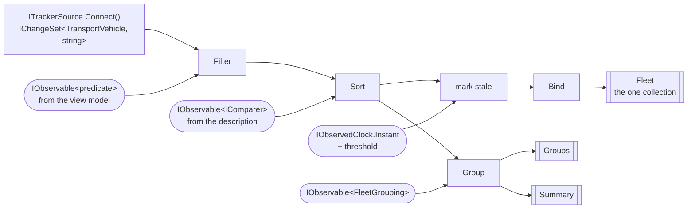
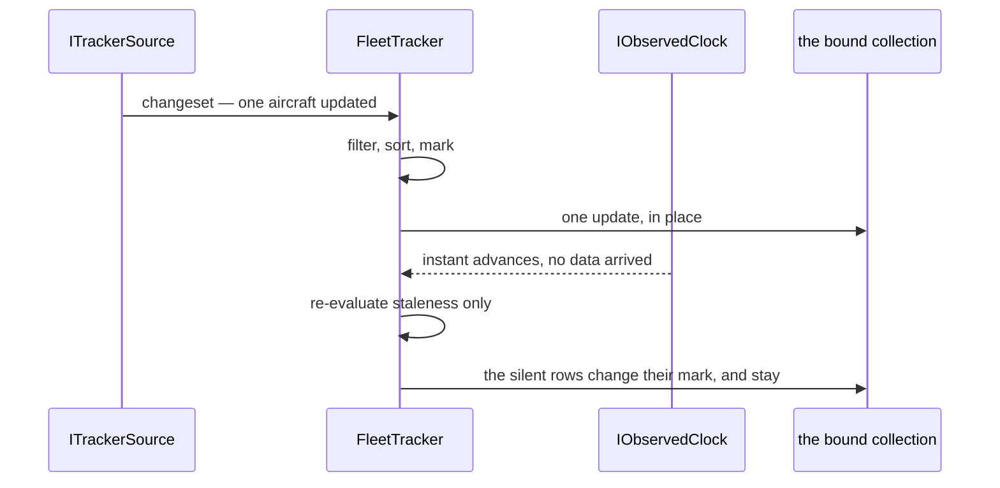

# Specification: Fleet pipeline

## 1. Business Goal

<!-- Rules: ../../../.spec/templates/feature.md § 1 -->

`aircraft-source` built the half of the headline nobody shows: a polled snapshot becoming a changeset. It stops at the seam deliberately — its § 5 row 1 excludes the operators themselves and says building them is the next feature — so what exists today is a stream of domain vehicles arriving at an interface nothing consumes. The talk's claim is not that a snapshot can become a changeset; it is that **once it has, everything after it is an ordinary DynamicData pipeline**, indistinguishable from one fed by a push source. That claim is unproven while the pipeline does not exist, and it is the only part of the demo the audience will try to copy on Monday. This Feature builds the pipeline: one collection of `TransportVehicle`, built once at startup, filtered and sorted by inputs the user changes, grouped and counted, with a silent vehicle marked rather than vanishing — and a source description that supplies the columns and comparers, so swapping planes for ships swaps a registration and not a view. The failure state removed is a demo that can show data arriving and nothing being done with it.

## 2. User Needs

<!-- Rules: ../../../.spec/templates/feature.md § 2 -->

| #   | Persona                                                                                                                               | Need                                                                                                                     | Pain point today                                                                                                                                                      |
| --- | ------------------------------------------------------------------------------------------------------------------------------------- | ------------------------------------------------------------------------------------------------------------------------ | --------------------------------------------------------------------------------------------------------------------------------------------------------------------- |
| 1   | Line-of-business .NET developer in the talk audience, whose data lives behind REST endpoints and SQL queries (README.md § "Audience") | To see that a polled source reaches the same operators a push source would, and to read the one place they are assembled | `aircraft-source` ends at `ITrackerSource`; the operators the audience came to see are named in a skill and a README table and exist nowhere in the source            |
| 2   | The same developer, whose own grid is re-queried and re-bound on every keystroke                                                      | A search box and a set of dropdowns that re-filter an existing collection without refetching or rebuilding anything      | Their current answer is a handler that clears a list and refills it, which is the pattern this demo exists to replace; nothing here yet shows the alternative         |
| 3   | The same developer, whose rows are a fixed set of columns compiled into the view                                                      | Columns, comparers and groupings that come from the source rather than from the markup                                   | With no description to supply them, a second source means editing the grid — which is the swap failing quietly rather than loudly                                     |
| 4   | The presenter, demonstrating that a feed can stop                                                                                     | A vehicle that goes silent to be visibly marked and kept, at a threshold they can set before the talk                    | Nothing derives staleness downstream of the seam; `TransportVehicle.IsStale` takes an instant and no caller passes one, so a row either vanishes or lies              |
| 5   | The presenter, at the closing act (README.md § "Closing act")                                                                         | The grid, filters, sorts, groups and counts to survive a source swap untouched                                           | `aircraft-source` B-042 claims only that the fleet tracker _owns_ a pipeline. Ownership of nothing survives any swap, so the closing act's claim is currently vacuous |
| 6   | Whoever maintains this repository after the talk                                                                                      | The pipeline assembled in one readable place, disposed deliberately                                                      | A pipeline grown a stage at a time across a view model, a page and a tracker is the shape every one of these skills' `Never add` lists is written against             |

## 3. Acceptance Criteria

<!-- Rules: ../../../.spec/templates/feature.md § 3 -->

Twenty-four claims, in seven groups: **B-001 – B-005** the spine — what is built,
when, and what is bound; **B-006 – B-008** search and filtering; **B-009 – B-011**
sorting; **B-012 – B-015** grouping and aggregates; **B-016 – B-019** staleness;
**B-020 – B-022** the source description; **B-023 and B-024** the boundaries.

Claim ids are scoped to this specification. This Feature's `B-001` is not
`aircraft-source`'s, and neither is renumbered for the other
(`transponder-conventions` § "Claim ids are `B-00n`"). Where a claim of the other
Feature is cited it is written with its Feature's name.

| ID    | Claim                                                                                                                                                                                                                                              | Source                                                                    |
| ----- | -------------------------------------------------------------------------------------------------------------------------------------------------------------------------------------------------------------------------------------------------- | ------------------------------------------------------------------------- |
| B-001 | The pipeline SHALL be constructed once, from `ITrackerSource.Connect()`, and SHALL NOT be rebuilt, re-subscribed or re-bound because the live source changed.                                                                                      | dynamic-data-pipeline § "The spine"; `aircraft-source` B-042              |
| B-002 | Exactly one collection of `TransportVehicle` SHALL exist downstream of the seam; no view, view model or tracker SHALL hold a second collection of tracked items.                                                                                   | dynamic-data-pipeline § "Never add"; mvvm § "Projecting state back"       |
| B-003 | Every change to that collection SHALL arrive through the pipeline; no code SHALL add to, remove from, clear or reorder it imperatively.                                                                                                            | `aircraft-source` B-044; dynamic-data-pipeline § "Never add"              |
| B-004 | The pipeline SHALL dispose every subscription it creates when the tracker is disposed, and a source swap SHALL dispose nothing the pipeline needs and leak nothing it replaced.                                                                    | dynamic-data-pipeline § "Keep the pipeline the thing that does the work"  |
| B-005 | The pipeline SHALL schedule the work a view observes on `ISchedulerProvider.UserInterfaceThread` and SHALL NOT read `CurrentThreadScheduler`, `TaskPoolScheduler` or any other ambient scheduler inline.                                           | mvvm § "Projecting state back"; `SchedulerProvider` remarks               |
| B-006 | Filtering SHALL be driven by an observable predicate over `TransportVehicle`: a new predicate value SHALL re-evaluate the existing items and SHALL NOT re-subscribe to the source or refetch anything.                                             | dynamic-data-pipeline § "The spine"; README.md § "DynamicData operators"  |
| B-007 | Before any predicate arrives, every vehicle the source reports SHALL be visible; an absent filter SHALL NOT be an empty fleet.                                                                                                                     | Decided call — an empty grid at startup reads as a broken feed            |
| B-008 | No filter SHALL be applied by enumerating or editing the bound collection, and none SHALL be re-evaluated by a UI event handler.                                                                                                                   | maui-ui § "The UI reads; it never drives"                                 |
| B-009 | Sorting SHALL be driven by an observable comparer: a new comparer SHALL reorder the existing items in place, and SHALL NOT clear, refill or rebuild the collection.                                                                                | dynamic-data-pipeline § "The spine"; maui-ui § "The UI reads"             |
| B-010 | Every comparer SHALL come from the live source's description (B-020) and SHALL compare using members of `TransportVehicle` only.                                                                                                                   | maui-ui § "The swap test"; ADR-0005 item 6                                |
| B-011 | A comparer SHALL break ties on `Key`, so the order is total and two sorts of an unchanged fleet produce the same sequence.                                                                                                                         | Decided call — rows swapping places on an unchanged fleet reads as churn  |
| B-012 | Grouping SHALL be driven by an observable grouping key chosen from the description, and changing it SHALL regroup the existing items without rebuilding the pipeline.                                                                              | README.md § "UI features"; dynamic-data-pipeline § "The spine"            |
| B-013 | `TransportVehicle` SHALL declare the grouping answer as an `abstract` member, so a new source cannot inherit one; `Aircraft` SHALL answer with its origin country.                                                                                 | ADR-0005 item 2; README.md § "DynamicData operators"                      |
| B-014 | Each group SHALL carry its count of vehicles and its count of stale vehicles, derived from the same stream, and neither SHALL be computed by enumerating the bound collection.                                                                     | README.md § "UI features"; dynamic-data-pipeline § "The spine"            |
| B-015 | A fleet-wide summary — vehicles tracked, vehicles stale, groups present — SHALL derive from the same stream as the collection and SHALL update as the collection does.                                                                             | README.md § "UI features"                                                 |
| B-016 | A vehicle silent for longer than the threshold SHALL be reported as stale **and SHALL remain in the collection**, keyed and visible.                                                                                                               | README.md § "UI features"; dynamic-data-pipeline § "Staleness and expiry" |
| B-017 | The staleness threshold SHALL be configurable and SHALL default to five minutes.                                                                                                                                                                   | README.md § "UI features"                                                 |
| B-018 | Staleness SHALL be measured against `IObservedClock`, SHALL NOT read `DateTime.UtcNow` or `DateTimeOffset.Now` inline, and SHALL be re-evaluated when the observed instant advances — so a vehicle becomes stale with no new data arriving for it. | `aircraft-source` B-043 and B-003; ADR-0007                               |
| B-019 | No vehicle SHALL be removed from the collection because it stopped reporting, and `ExpireAfter` SHALL NOT appear in this pipeline.                                                                                                                 | README.md § "DynamicData operators"; see § 5 row 2                        |
| B-020 | The live source SHALL supply a description naming the columns, comparers and grouping keys available for it; each column SHALL be a display name plus a selector over `TransportVehicle`.                                                          | maui-ui § "The swap test"; ADR-0005 item 6                                |
| B-021 | Swapping the live source SHALL swap the description, and SHALL NOT require editing the pipeline, a comparer, a predicate or a grouping key.                                                                                                        | hot-swap-source; README.md § "Closing act"                                |
| B-022 | No column, comparer, predicate, grouping key or aggregate SHALL downcast, type-test or `switch` on a concrete `TransportVehicle` subclass.                                                                                                         | ADR-0005 item 6; domain-model § "Never add"                               |
| B-023 | Nothing in this Feature SHALL name an API contract, an API type, a client, a cache, a snapshot or a concrete `ITrackerSource`.                                                                                                                     | `aircraft-source` B-047; hot-swap-source                                  |
| B-024 | Nothing in this Feature SHALL read a network, a file or a wall clock.                                                                                                                                                                              | dynamic-data-pipeline § "Testing"; see § 4 row 5                          |

## 4. Constraints

<!-- Rules: ../../../.spec/templates/feature.md § 4 -->

| #   | Constraint                                                                                                                                                                | Source                                                                              | Impact                                                                                                                                                                                                                                        |
| --- | ------------------------------------------------------------------------------------------------------------------------------------------------------------------------- | ----------------------------------------------------------------------------------- | --------------------------------------------------------------------------------------------------------------------------------------------------------------------------------------------------------------------------------------------- |
| 1   | The seam is fixed and is not ours to widen: `ITrackerSource.Connect()` returns `IObservable<IChangeSet<TransportVehicle, string>>` and nothing else.                      | `aircraft-source` B-033, ADR-0002                                                   | Everything this Feature needs arrives as a changeset of the abstract base. A member a column wants and the base does not carry comes from the description (B-020), never from widening the seam or the base.                                  |
| 2   | `IFleetTracker` does not exist yet. `aircraft-source` item `0007` declares it and gives it the clock.                                                                     | `aircraft-source` § Tasks                                                           | Every item here waits on `0007`. The declaration in § 7 is this Feature's addition to a file another Feature creates, which is why § 7 writes the members rather than the whole interface.                                                    |
| 3   | `IObservedClock` exposes `Current` and no observable, so nothing can notice the instant advancing.                                                                        | `src/Transponder/Tracking/IObservedClock.cs`                                        | B-018's second clause cannot be satisfied by reading `Current`. § 7 adds an observable member to the read side; the write side (`IObservedClockWriter`) is untouched, so ADR-0007's separation holds.                                         |
| 4   | A projection builds a **new** `Aircraft` per change: `AircraftTrackerSource` uses `Transform`, so an updated vehicle arrives as a replacement, not as a mutated instance. | `src/Transponder/Tracking/Sources/AircraftTrackerSource.cs`                         | `AutoRefresh` has no subject in this pipeline as it stands — there are no in-place property changes to refresh on. This is an open question, not a silent omission: § 7's decision block and § 11 row 1 carry it, and no claim depends on it. |
| 5   | No test here may reach a network, a file or the wall clock, and both schedulers are injected.                                                                             | `transponder-conventions` § `test-from-scenarios`; `SchedulerProvider` remarks      | A test feeds a changeset in and advances one `TestScheduler`. The clock is a double returning instants the test chose, which is also what makes B-018 provable without waiting five minutes.                                                  |
| 6   | Staleness is **marked** for aircraft and **expiring** is a vessel treatment; the two are not interchangeable.                                                             | dynamic-data-pipeline § "Staleness and expiry"; README.md § "DynamicData operators" | B-019 forbids `ExpireAfter` in this pipeline outright. The vessel source will need the other treatment, and it gets it in its own specification rather than by a flag here.                                                                   |
| 7   | DynamicData is already referenced centrally; nothing here adds a package.                                                                                                 | `Directory.Packages.props`; `aircraft-source` § 4 row 17                            | No central-package change belongs to this Feature. An item that needs one has found a design problem, not a missing dependency.                                                                                                               |

## 5. Out of Scope

<!-- Rules: ../../../.spec/templates/feature.md § 5 -->

| #   | Item                                                                                                                   | Exclusion reason                                                                                                                                                                                                                                                                                    |
| --- | ---------------------------------------------------------------------------------------------------------------------- | --------------------------------------------------------------------------------------------------------------------------------------------------------------------------------------------------------------------------------------------------------------------------------------------------- |
| 1   | Every MAUI surface — the grid, the search box, the dropdowns, the master-detail pane, the summary row, the view models | The dashboard is its own Feature, `fleet-dashboard`. This one is provable with no UI at all, and keeping the split means the pipeline's claims cannot be "satisfied" by a screenshot. The view models supply the predicate, the comparer and the grouping key this Feature consumes as observables. |
| 2   | `ExpireAfter`, and removal on silence                                                                                  | B-019 excludes it here. It is the vessel treatment, and it belongs to the closing act's specification where going silent means gone rather than quiet.                                                                                                                                              |
| 3   | The map view                                                                                                           | README.md § "UI features" marks it optional, and a map is a surface rather than a pipeline stage. Nothing here forecloses it: a map binds the same one collection B-002 requires.                                                                                                                   |
| 4   | Turning search text and dropdown selections into a predicate                                                           | `mvvm` § "Two kinds of input, two routes" puts that in the view model, which supplies the predicate the user chose. This Feature claims what the pipeline does with a predicate, not how one is composed.                                                                                           |
| 5   | The source swap itself — the decorator, the disposal of an outgoing source, the busy indicator                         | `aircraft-source` `0006` owns it (its B-038 – B-040). This Feature claims only that the swap costs the pipeline nothing (B-001, B-021).                                                                                                                                                             |
| 6   | Recording and replay                                                                                                   | `replay-source` owns both. The pipeline cannot tell a replayed changeset from a live one, which is the point; it therefore says nothing about either.                                                                                                                                               |
| 7   | A second grouping level, grouped aggregates beyond count, and user-defined columns                                     | No need in §§ 1-2 asks for any of them, and `domain-model` § "Never add" rules out the third level the first would invite.                                                                                                                                                                          |

## 6. Concern Separation

<!-- Rules: ../../../.spec/templates/feature.md § 6 -->

| Item                                                                    | Classification | Notes                                                                                                                                                                                                                 |
| ----------------------------------------------------------------------- | -------------- | --------------------------------------------------------------------------------------------------------------------------------------------------------------------------------------------------------------------- |
| A silent vehicle is marked, not removed, at a configurable five minutes | Business       | § 2 need 4 and README.md § "UI features". The threshold is a product number; what reads it is technical. B-016, B-017.                                                                                                |
| One collection, built once, never rebuilt on a swap                     | Both           | Business, because § 2 need 5 is the closing act's claim; technical, because the mechanism is subscription lifetime and disposal. B-001 – B-004.                                                                       |
| A column, comparer and grouping key come from the source                | Both           | Business: a second source must not mean editing the grid (§ 2 need 3). Technical: the description is what replaces the downcast ADR-0005 item 6 forbids. B-020 – B-022.                                               |
| Filtering and sorting take observable inputs                            | Technical      | The user-visible behavior is the dashboard's; what the pipeline owes it is re-evaluation without a rebuild. B-006, B-009.                                                                                             |
| Counts per group and for the fleet                                      | Business       | § 2 need 1 — the summary row is part of what the audience is shown. Derivation from the same stream is the technical half. B-014, B-015.                                                                              |
| Staleness is measured against the observed clock                        | Technical      | The business statement is row 1 above. That the instant comes from the provider rather than the wall clock is ADR-0007's, and under replay it is the difference between a loaded fleet and a fleet that is all stale. |
| The boundaries                                                          | Technical      | B-022 – B-024 constrain what may name what. No business statement is served by them directly; the swap they protect is § 2 need 5's.                                                                                  |

## 7. Technical Design

<!-- Rules: ../../../.spec/templates/feature.md § 7 -->

The pipeline is one object's constructor and one disposal. `FleetTracker` takes
the seam, the clock, the scheduler provider, the live source's description and
the user's inputs; it builds the stages once in the order
`dynamic-data-pipeline` § "The spine" names; and it exposes the collection, the
groups and the summary. Nothing else in the application subscribes to the seam.

**Domain model**

The two additions this Feature makes to existing types, and the types it
introduces. `TransportVehicle` and `Aircraft` exist; the member below is new on
each (B-013).

| Field                              | Type                                             | Notes                                                                                                                                                                                                  |
| ---------------------------------- | ------------------------------------------------ | ------------------------------------------------------------------------------------------------------------------------------------------------------------------------------------------------------ |
| `TransportVehicle.GroupKey`        | `string`, `abstract`                             | The answer a view groups by, abstract so a new source cannot inherit one (ADR-0005 item 2, B-013). A string because a grouping key is a label, and the description names which key is being asked for. |
| `Aircraft.GroupKey`                | `string`, `override`                             | The origin country. `OriginCountry` is already non-optional and defaults to empty, so the key is never absent.                                                                                         |
| `FleetColumn.Name`                 | `string`                                         | What a header shows.                                                                                                                                                                                   |
| `FleetColumn.Value`                | `Func<TransportVehicle, string>`                 | The cell, already display-formatted. A selector rather than a member name, so no reflection and no cast (B-020, B-022).                                                                                |
| `FleetColumn.Comparer`             | `Option<IComparer<TransportVehicle>>`            | Absent when the column is not sortable, which is a fact about the column rather than a null to remember (`language-ext-usage`).                                                                        |
| `FleetGrouping.Name`               | `string`                                         | What the grouping dropdown shows — "Origin country", "Category".                                                                                                                                       |
| `FleetGrouping.Key`                | `Func<TransportVehicle, string>`                 | How the group is read. The default grouping's selector is `GroupKey`; a second grouping a source offers supplies its own.                                                                              |
| `FleetSourceDescription.Columns`   | `IReadOnlyList<FleetColumn>`                     | In display order (B-020).                                                                                                                                                                              |
| `FleetSourceDescription.Groupings` | `IReadOnlyList<FleetGrouping>`                   | What this source can be grouped by.                                                                                                                                                                    |
| `FleetSummary.Tracked`             | `int`                                            | Vehicles in the collection (B-015).                                                                                                                                                                    |
| `FleetSummary.Stale`               | `int`                                            | How many of them are stale.                                                                                                                                                                            |
| `FleetSummary.Groups`              | `int`                                            | Groups present under the current grouping.                                                                                                                                                             |
| `FleetGroup.Key`                   | `string`                                         | The group's value.                                                                                                                                                                                     |
| `FleetGroup.Vehicles`              | `ReadOnlyObservableCollection<TransportVehicle>` | The group's own bound rows — a projection of the one collection, not a second store of items (B-002).                                                                                                  |
| `StaleVehicle.Vehicle`             | `TransportVehicle`                               | What the collection carries: the vehicle and whether it is currently stale. The flag is **not** stored on the vehicle — `domain-model` § "Never add" forbids that, and the clock moves.                |
| `StaleVehicle.IsStale`             | `bool`                                           | Derived at the moment the pipeline evaluated it, from `TransportVehicle.IsStale(asOf, threshold)` (B-016, B-018).                                                                                      |

**Diagrams**





Class diagram: not applicable — the shape is one class and five records, and
the member tables above state it without a second rendering to keep in step.

**Interface changes**

`IFleetTracker`'s file is created by `aircraft-source` `0007`; these are the
members this Feature adds to it, and they are written out because the file does
not exist yet (`transponder-conventions` § "Declarations in § 7").

```csharp
public interface IFleetTracker : IDisposable
{
    /// <summary>Gets the one collection everything binds to (B-002).</summary>
    ReadOnlyObservableCollection<StaleVehicle> Fleet { get; }

    /// <summary>Gets the current grouping's groups (B-012).</summary>
    ReadOnlyObservableCollection<FleetGroup> Groups { get; }

    /// <summary>Gets the counts, derived from the same stream as the collection (B-015).</summary>
    IObservable<FleetSummary> Summary { get; }

    /// <summary>Gets the live source's columns and groupings (B-020).</summary>
    IObservable<FleetSourceDescription> Description { get; }
}
```

The user's inputs arrive by constructor rather than as settable members, so the
tracker cannot be driven imperatively (B-003):

```csharp
public interface IFleetQuery
{
    IObservable<Func<TransportVehicle, bool>> Predicate { get; }

    IObservable<IComparer<TransportVehicle>> Comparer { get; }

    IObservable<FleetGrouping> Grouping { get; }

    IObservable<TimeSpan> StaleThreshold { get; }
}
```

Each is an `IObservable<T>` the dashboard pushes into, and each has a starting
value the pipeline does not wait for: a predicate matching everything (B-007),
the description's first comparer, its first grouping, and five minutes (B-017).

The one additive member on an existing interface, for § 4 row 3:

```csharp
public interface IObservedClock
{
    DateTimeOffset Current { get; }

    /// <summary>Gets the observed instant, and every advance of it (B-018).</summary>
    IObservable<DateTimeOffset> Instant { get; }
}
```

`IObservedClockWriter` is untouched: the write side still only sets, and a
consumer holding the read side still cannot advance time (ADR-0007 decision 1).

| Type               | File                                                                                                | Claims it makes visible |
| ------------------ | --------------------------------------------------------------------------------------------------- | ----------------------- |
| `TransportVehicle` | [`src/Transponder/Model/TransportVehicle.cs`](../../../src/Transponder/Model/TransportVehicle.cs)   | B-013                   |
| `Aircraft`         | [`src/Transponder/Model/Aircraft.cs`](../../../src/Transponder/Model/Aircraft.cs)                   | B-013                   |
| `IObservedClock`   | [`src/Transponder/Tracking/IObservedClock.cs`](../../../src/Transponder/Tracking/IObservedClock.cs) | B-018                   |

Where the new types go, following `transponder-conventions` § "Project
structure":

```
src/Transponder/Tracking/          IFleetQuery, FleetTracker's pipeline, StaleVehicle
src/Transponder/Tracking/Fleet/    FleetColumn, FleetGrouping, FleetSourceDescription, FleetGroup, FleetSummary
```

The description lives under `Tracking/` rather than `Model/` deliberately: it
describes how a source is _presented_, which is not a domain fact, and
`domain-model` § "Never add" keeps UI-shaped types out of the model.

**Decision required**

> `AutoRefresh` is in README.md's operator table and has no subject in this
> pipeline. § 4 row 4 is why: the aircraft strategy projects with `Transform`,
> so an updated aircraft arrives as a replacement and no instance is ever
> mutated in place. There is nothing to refresh on.
>
> | Option | Summary                                                                                                                                                         | Tradeoff                                                                                                                                                                                                                  |
> | ------ | --------------------------------------------------------------------------------------------------------------------------------------------------------------- | ------------------------------------------------------------------------------------------------------------------------------------------------------------------------------------------------------------------------- |
> | A.     | No `AutoRefresh`. Staleness re-evaluates on the clock's observable (B-018), and value changes arrive as changeset updates, which filters and sorts already see. | The simplest pipeline, and it keeps `domain-model`'s "no stored staleness flag". Costs the talk one operator from its own table — the audience is told `AutoRefresh` exists and shown why this pipeline does not need it. |
> | B.     | Mutate the projected vehicle in place when a snapshot updates, and let `AutoRefresh` re-evaluate filters and sorts.                                             | Demonstrates the operator the table promises. Costs value-replacement semantics: the strategy becomes stateful, `Transform` gains a lookup, and a vehicle's identity and its values stop arriving together.               |
> | C.     | Keep A for the aircraft feed and demonstrate `AutoRefresh` in the closing act, where a push source genuinely mutates what it already holds.                     | Both honest and complete, at the cost of deferring an operator the main demo advertises to the optional act — which, per README.md § "Open items", is not yet chosen.                                                     |
>
> **Recommendation:** A, with the README's operator table amended to say where
> `AutoRefresh` would apply and why this pipeline does not reach for it. B
> trades a correct pipeline for a demo beat, and the demo's own claim is that
> the pipeline is ordinary.
> **Awaiting:** the person (§ 11 row 1).

## 8. Testing Strategy

<!-- Rules: ../../../.spec/templates/feature.md § 8 -->

**Testability assessment**

| Dimension          | Verdict       | Finding                                                                                                                                                                                                                                                                                                                         | Recommendation                                                                                                                                                                                                                                  |
| ------------------ | ------------- | ------------------------------------------------------------------------------------------------------------------------------------------------------------------------------------------------------------------------------------------------------------------------------------------------------------------------------- | ----------------------------------------------------------------------------------------------------------------------------------------------------------------------------------------------------------------------------------------------- |
| DI seams           | Pass          | The tracker takes the seam, the clock, the scheduler provider, the description and `IFleetQuery` by constructor and constructs none of them. A test drives the whole pipeline with a `SourceCache<TransportVehicle, string>` it owns and four subjects, with no provider, no HTTP and no UI anywhere in the arrangement.        | —                                                                                                                                                                                                                                               |
| Behavior isolation | Pass          | Each stage is observable at its own output: the collection for filter, sort and staleness, `Groups` for grouping, `Summary` for the aggregates. A failing assertion names a stage.                                                                                                                                              | —                                                                                                                                                                                                                                               |
| Coverage potential | **Qualified** | Nineteen claims are about a value or a sequence the code produces and are ordinary xUnit tests. Five are structural — B-003, B-008, B-022, B-023 and B-005's "SHALL NOT read inline" half — and a test cannot prove the absence of a line anywhere in an assembly.                                                              | The analyzer already carries this class of rule for `aircraft-source` ([ADR-0006](../../../.spec/adr/0006-an-analyzer-enforces-the-layer-boundaries.md)). Five rules are added to it, which is `0031`'s and `0032`'s work, not a new mechanism. |
| Fixtures           | Pass          | Every vehicle is a synthetic `Aircraft` built in the test — invented `icao24` values, callsigns and countries — and a changeset is produced by writing to a cache the test holds. No JSON and no provider shape appear in this Feature's tests at all, which is B-023 showing up as an arrangement that cannot name a snapshot. | —                                                                                                                                                                                                                                               |
| Determinism        | Pass          | Both schedulers are one `TestScheduler`, and the clock is a double whose `Instant` the test pushes. Five minutes of silence is three lines and no waiting (§ 4 row 5).                                                                                                                                                          | —                                                                                                                                                                                                                                               |

**Two mechanisms, and which proves what.** The split `aircraft-source` § 8
establishes holds here unchanged: a computed value is an xUnit test, a rule
about which types may reference which is an analyzer diagnostic, and nothing is
asserted twice. A test over `typeof(...)` is neither.

**Scenarios**

Full Gherkin lives in [`fleet-pipeline.feature`](fleet-pipeline.feature) beside
this file — twenty-four scenarios, each tagged with the `@B-00n` it proves.
Scenarios are documentation; the xUnit tests and the analyzer's diagnostics are
what execute.

- Happy path → B-001, B-002, B-006, B-007, B-009, B-011 – B-015, B-020
- Failure mode → B-004, B-005, B-016 – B-019
- Validation failure → B-003, B-008, B-010, B-021 – B-024
- Data-driven → B-011, B-014, B-017

## 9. Traceability Matrix

<!-- Rules: ../../../.spec/templates/feature.md § 9 -->

**This is the gate, and all twenty-four rows read `Missing`.** Nothing in this
Feature is built: `IFleetTracker` does not exist (§ 4 row 2), so every row names
the test or the diagnostic that will prove its claim and records that it does
not yet. The named tests are the contract between this section and the items in
`## Tasks`; a row moves when a run or a build makes it move, never because the
code looks right.

| Claim ID | Scenario | Test                                                                                                                                   | Status  |
| -------- | -------- | -------------------------------------------------------------------------------------------------------------------------------------- | ------- |
| B-001    | `@B-001` | `FleetTrackerTests.GivenAFleetTracker_WhenTheLiveSourceChanges_ThenTheCollectionIsNotRebuiltOrRebound`                                 | Missing |
| B-002    | `@B-002` | `FleetTrackerTests.GivenAFleetTracker_WhenItsCollectionsAreRead_ThenTheyProjectTheOneCollection`                                       | Missing |
| B-003    | `@B-003` | analyzer — an imperative `Add`, `Remove` or `Clear` on a bound fleet collection is reported at the call                                | Missing |
| B-004    | `@B-004` | `FleetTrackerTests.GivenASubscribedPipeline_WhenTheTrackerIsDisposed_ThenEverySubscriptionIsDisposed`                                  | Missing |
| B-005    | `@B-005` | `FleetTrackerTests.GivenATestScheduler_WhenTheCollectionChanges_ThenTheChangeIsObservedOnTheUserInterfaceThread`                       | Missing |
| B-006    | `@B-006` | `FleetFilterTests.GivenABoundFleet_WhenANewPredicateArrives_ThenTheVisibleRowsChangeAndTheSourceIsNotResubscribed`                     | Missing |
| B-007    | `@B-007` | `FleetFilterTests.GivenNoPredicateHasArrived_WhenVehiclesAreReported_ThenEveryVehicleIsVisible`                                        | Missing |
| B-008    | `@B-008` | analyzer — a filter or sort re-evaluated from an event handler is reported at the handler                                              | Missing |
| B-009    | `@B-009` | `FleetSortTests.GivenABoundFleet_WhenANewComparerArrives_ThenTheRowsReorderWithoutBeingClearedOrRefilled`                              | Missing |
| B-010    | `@B-010` | `FleetSortTests.GivenEveryComparerInTheDescription_WhenEachIsApplied_ThenItReadsOnlyBaseMembers`                                       | Missing |
| B-011    | `@B-011` | `FleetSortTests.GivenTwoVehiclesThatCompareEqual_WhenSortedTwice_ThenBothSortsOrderThemByKey`                                          | Missing |
| B-012    | `@B-012` | `FleetGroupTests.GivenABoundFleet_WhenTheGroupingChanges_ThenTheGroupsReformWithoutRebuildingThePipeline`                              | Missing |
| B-013    | `@B-013` | `AircraftTests.GivenAnAircraft_WhenItsGroupKeyIsRead_ThenItIsTheOriginCountry`, plus the compile error a source that answers none is   | Missing |
| B-014    | `@B-014` | `FleetGroupTests.GivenAGroupWithOneSilentVehicle_WhenItsCountsAreRead_ThenTheyReportTwoTrackedAndOneStale`                             | Missing |
| B-015    | `@B-015` | `FleetSummaryTests.GivenAFleetThatChanges_WhenTheSummaryIsObserved_ThenEachChangeProducesTheNewCounts`                                 | Missing |
| B-016    | `@B-016` | `StalenessTests.GivenAVehicleSilentPastTheThreshold_WhenTheFleetIsRead_ThenItIsMarkedStaleAndStillPresent`                             | Missing |
| B-017    | `@B-017` | `StalenessTests.GivenNoConfiguredThreshold_WhenStalenessIsEvaluated_ThenItIsFiveMinutes`                                               | Missing |
| B-018    | `@B-018` | `StalenessTests.GivenNoNewDataForAVehicle_WhenTheObservedInstantAdvancesPastTheThreshold_ThenItBecomesStale`                           | Missing |
| B-019    | `@B-019` | `StalenessTests.GivenAVehicleSilentForAnHour_WhenTheFleetIsRead_ThenNothingWasRemoved`, and the analyzer rule forbidding `ExpireAfter` | Missing |
| B-020    | `@B-020` | `FleetSourceDescriptionTests.GivenTheAircraftDescription_WhenItsColumnsAreRead_ThenEachCarriesANameAndASelector`                       | Missing |
| B-021    | `@B-021` | `FleetTrackerTests.GivenASecondDescription_WhenItArrives_ThenTheColumnsAndGroupingsChangeAndNoPipelineStageIsRebuilt`                  | Missing |
| B-022    | `@B-022` | analyzer — a cast, `is` or `switch` on a `TransportVehicle` subclass outside the detail pane is reported at the expression             | Missing |
| B-023    | `@B-023` | analyzer — a reference to a contract, client, cache or snapshot from `Tracking/` is reported at the reference                          | Missing |
| B-024    | `@B-024` | `FleetTrackerTests` arrangement — no test in this Feature constructs an HTTP, file or clock type, asserted by the suite's own fixture  | Missing |

## 10. Lessons / Spec Deltas

<!-- Rules: ../../../.spec/templates/feature.md § 10 -->

None yet — nothing is built, so no bug has been closed here.

## 11. Open Questions

<!-- Rules: ../../../.spec/templates/feature.md § 11 -->

| #   | Question                                                                                                                                                                                                                    | Owner      | Target date |
| --- | --------------------------------------------------------------------------------------------------------------------------------------------------------------------------------------------------------------------------- | ---------- | ----------- |
| 1   | `AutoRefresh` has no subject in this pipeline (§ 4 row 4). Take option A, B or C from § 7's decision block? A also means amending README.md's operator table, which is a change to the project-wide specification.          | the person | 2026-10-12  |
| 2   | Does the fleet-wide summary belong on `IFleetTracker` (B-015, as § 7 has it) or on the dashboard's view model, derived from the same stream? The claim is the pipeline's either way; the member's address is a design call. | the person | 2026-10-12  |
| 3   | `FleetColumn.Value` returns `string`, so the pipeline never converts a unit and the view never formats one. Is a display-formatted cell the right boundary, or should a column expose the canonical value and a formatter?  | the person | 2026-10-12  |

## 12. Sign-off

<!-- Rules: ../../../.spec/templates/feature.md § 12 -->

| Sections | Owner       | Status   |
| -------- | ----------- | -------- |
| §§ 1-5   | spec-author | 🟡 Draft |
| §§ 6-7   | implementer | 🟡 Draft |
| §§ 8-9   | test-writer | 🟡 Draft |

What `approved` requires, and why a `Missing` row in § 9 does not hold it back,
is [the template's § 12](../../../.spec/templates/feature.md). Every row here is
🟡, so no item below moves to `in-progress` yet
(`transponder-conventions` § "The rules that bind every change").

## Decisions

<!-- Rules: ../../../.spec/templates/feature.md § Decisions -->

None yet. § 7's decision block and § 11 row 1 are open; whichever option the
person takes becomes this Feature's `decisions/0001`.

The layering this specification sits downstream of is
[ADR-0002](../../../.spec/adr/0002-contract-client-strategy-tracker.md), the
domain base it is written against
[ADR-0005](../../../.spec/adr/0005-an-abstract-base-carries-the-tracked-item.md),
and the clock it measures silence with
[ADR-0007](../../../.spec/adr/0007-the-live-source-advances-the-observed-clock.md)
— all three repository-wide, none restated here.

## Tasks

<!-- Rules: ../../../.spec/templates/feature.md § Tasks -->

| Item                                                     | Claims                                          |
| -------------------------------------------------------- | ----------------------------------------------- |
| [`0030`](../.issue/0030-fleet-pipeline.yml)              | all 24 — the parent; its children hold the work |
| [`0031`](../.issue/0031-pipeline-spine.yml)              | B-001 – B-005, B-023, B-024                     |
| [`0032`](../.issue/0032-source-description-and-sort.yml) | B-009 – B-011, B-013, B-020 – B-022             |
| [`0033`](../.issue/0033-filter-group-and-aggregates.yml) | B-006 – B-008, B-012, B-014, B-015              |
| [`0034`](../.issue/0034-staleness-marking.yml)           | B-016 – B-019                                   |

Every claim is carried by exactly one child. `0031` builds the spine and binds
the collection, so the two boundary claims land there: a boundary cannot be
asserted before one side of it exists. `0032` comes before `0033` because the
grouping `0033` applies is chosen from the description `0032` introduces, and
because the comparer and the grouping key are the same mechanism.

Each item's `depends_on` sequences the work: `0031` waits on `aircraft-source`
`0007`, which declares `IFleetTracker`; `0032` and `0034` wait on `0031`; and
`0033` waits on both — on `0032` for the groupings it applies, and on `0034`
because B-014's stale count has nothing to count until a vehicle can be marked.
The prerequisites are direct ones only: no item restates a dependency it
already inherits through another.

## Scoring

<!-- Rules: ../../../.spec/templates/feature.md § Scoring -->

| Date       | Item   | Field | Rationale                                                                                                                                                                                                                                                                                                                                                                                                                                  |
| ---------- | ------ | ----- | ------------------------------------------------------------------------------------------------------------------------------------------------------------------------------------------------------------------------------------------------------------------------------------------------------------------------------------------------------------------------------------------------------------------------------------------ |
| 2026-10-05 | `0030` | value | § 1 is the demo's own claim: that everything downstream of the cache is ordinary. `aircraft-source` proved the step into the pipeline and nothing after it, so without this Feature the talk demonstrates half a sentence.                                                                                                                                                                                                                 |
| 2026-10-05 | `0030` | risk  | Five of twenty-four claims are structural and need analyzer rules rather than tests (§ 8), which is a known mechanism rather than an unknown. The real hazard is § 11 row 1: an operator the project-wide README advertises has no subject here, and that is a specification answer, not a bug.                                                                                                                                            |
| 2026-10-05 | `0031` | value | Everything else in the Feature is a stage attached to what this item builds, and three items name it in `depends_on`.                                                                                                                                                                                                                                                                                                                      |
| 2026-10-05 | `0031` | risk  | The hazards are both invisible at runtime. A pipeline assembled per swap works perfectly and leaks (B-001, B-004) — on a projector that reads as a memory bug. And a `Bind` that marshals on whatever thread the source arrived on works on a developer's machine until the grid is real (B-005).                                                                                                                                          |
| 2026-10-05 | `0032` | value | The swap the closing act rests on is this item's: a column, comparer or grouping key compiled into a view is the swap failing quietly (§ 2 need 3).                                                                                                                                                                                                                                                                                        |
| 2026-10-05 | `0032` | risk  | Adding an `abstract` member to `TransportVehicle` breaks every subclass by design (B-013) — the point is that it does not compile — but it also lands in a file `aircraft-source` owns, so it needs that Feature's reader. A sortable column whose comparer reads a member the base does not carry is the other hazard, and it presents as a cast someone adds to make it build.                                                           |
| 2026-10-05 | `0033` | value | The search box and the dropdowns are what the audience watches, and §2 need 2 is the pattern they came to replace.                                                                                                                                                                                                                                                                                                                         |
| 2026-10-05 | `0033` | risk  | Lowest here: the stages are ordinary operators with observable inputs, and the one trap — an empty predicate reading as an empty fleet (B-007) — is a claim precisely because it is the easy mistake.                                                                                                                                                                                                                                      |
| 2026-10-05 | `0034` | value | § 2 need 4 and a visible demo beat: a feed that stops is what a stale mark exists to show.                                                                                                                                                                                                                                                                                                                                                 |
| 2026-10-05 | `0034` | risk  | Highest of the four. B-018's second clause needs a member `IObservedClock` does not have (§ 4 row 3), so the item changes an interface another Feature delivered. Then two silent-wrong-answer hazards: an inline `UtcNow` passes every test written against a controlled clock and is wrong only under replay, and staleness evaluated once on arrival leaves a silent fleet permanently fresh — which looks exactly like a working demo. |
