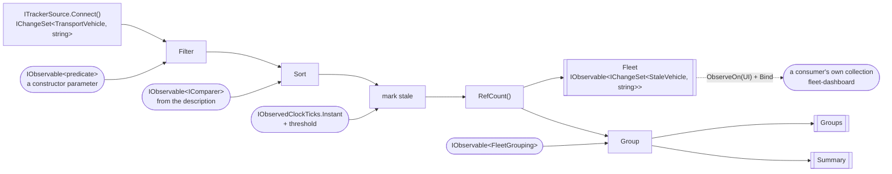
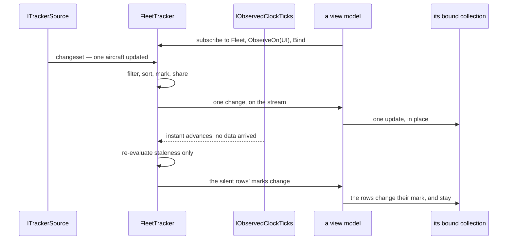

# Specification: Fleet pipeline

## 1. Business Goal

<!-- Rules: ../../../.spec/templates/feature.md § 1 -->

`aircraft-source` built the half of the headline nobody shows: a polled snapshot becoming a changeset. It stops at the seam deliberately — its § 5 row 1 excludes the operators themselves and says building them is the next feature — so what exists today is a stream of domain vehicles arriving at an interface nothing consumes. The talk's claim is not that a snapshot can become a changeset; it is that **once it has, everything after it is an ordinary DynamicData pipeline**, indistinguishable from one fed by a push source. That claim is unproven while the pipeline does not exist, and it is the only part of the demo the audience will try to copy on Monday. This Feature builds the pipeline: one collection of `TransportVehicle`, built once at startup, filtered and sorted by inputs the user changes, grouped and counted, with a silent vehicle marked rather than vanishing — and a source description that supplies the columns and comparers, so swapping planes for ships swaps a registration and not a view. The failure state removed is a demo that can show data arriving and nothing being done with it.

## 2. User Needs

<!-- Rules: ../../../.spec/templates/feature.md § 2 -->

| #   | Persona                                                                                                                               | Need                                                                                                                     | Pain point today                                                                                                                                                      |
| --- | ------------------------------------------------------------------------------------------------------------------------------------- | ------------------------------------------------------------------------------------------------------------------------ | --------------------------------------------------------------------------------------------------------------------------------------------------------------------- |
| 1   | Line-of-business .NET developer in the talk audience, whose data lives behind REST endpoints and SQL queries (README.md § "Audience") | To see that a polled source reaches the same operators a push source would, and to read the one place they are assembled | `aircraft-source` ends at `ITrackerSource`; the operators the audience came to see are named in a skill and a README table and exist nowhere in the source            |
| 2   | The same developer, whose own grid is re-queried and re-bound on every keystroke                                                      | A search box and a set of dropdowns that re-filter an existing collection without refetching or rebuilding anything      | Their current answer is a handler that clears a list and refills it, which is the pattern this demo exists to replace; nothing here yet shows the alternative         |
| 3   | The same developer, whose rows are a fixed set of columns compiled into the view                                                      | Columns, comparers and groupings that come from the source rather than from the markup                                   | With no description to supply them, a second source means editing the grid — which is the swap failing quietly rather than loudly                                     |
| 4   | The presenter, demonstrating that a feed can stop                                                                                     | A vehicle that goes silent to be visibly marked and kept, at a threshold they can set before the talk                    | Nothing derives staleness downstream of the seam; `TransportVehicle.IsStale` takes an instant and no caller passes one, so a row either vanishes or lies              |
| 5   | The presenter, at the closing act (README.md § "Closing act")                                                                         | The grid, filters, sorts, groups and counts to survive a source swap untouched                                           | `aircraft-source` B-042 claims only that the fleet tracker _owns_ a pipeline. Ownership of nothing survives any swap, so the closing act's claim is currently vacuous |
| 6   | Whoever maintains this repository after the talk                                                                                      | The pipeline assembled in one readable place, disposed deliberately                                                      | A pipeline grown a stage at a time across a view model, a page and a tracker is the shape every one of these skills' `Never add` lists is written against             |

## 3. Acceptance Criteria

<!-- Rules: ../../../.spec/templates/feature.md § 3 -->

Twenty-eight claims, in eight groups: **B-001 – B-005 and B-028** the spine —
what is built, when, what is published and who binds it; **B-006 – B-008** search
and filtering; **B-009 – B-011** sorting; **B-012 – B-015** grouping and
aggregates; **B-016 – B-019** staleness; **B-020 – B-022** the source
description; **B-023 and B-024** the boundaries; **B-025 – B-027** the arrival
notice.

B-028 was added, and B-002 and B-005 amended, on 2026-10-05 by
[ADR-0009](../../../.spec/adr/0009-the-pipeline-publishes-changesets-a-consumer-binds.md):
the pipeline publishes changeset streams and owns no bound collection, so the
`Bind` and the marshal to the UI scheduler belong to whoever consumes it. B-005
had required the opposite of [`mvvm`](../../../.skills/mvvm/SKILL.md)
§ "Projecting state back", which puts marshalling at the view model boundary and
not deep inside the pipeline; the skill wins, and the claim is corrected to what
the pipeline actually owes — injected schedulers, and no marshalling on anyone's
behalf.

B-025 – B-027 were added on 2026-10-05, after the rest were written, when the
person asked for a visible sign that new data had arrived. They are the
pipeline's half of it — the signal — and they are here rather than in
`fleet-dashboard` because the tracker already holds the clock and derives the
counts, so a notice is the same derivation as the summary B-015 claims. What is
shown, and where, is `fleet-dashboard`'s.

Claim ids are scoped to this specification. This Feature's `B-001` is not
`aircraft-source`'s, and neither is renumbered for the other
(`transponder-conventions` § "Claim ids are `B-00n`"). Where a claim of the other
Feature is cited it is written with its Feature's name.

| ID    | Claim                                                                                                                                                                                                                                                                                                                                                                          | Source                                                                        |
| ----- | ------------------------------------------------------------------------------------------------------------------------------------------------------------------------------------------------------------------------------------------------------------------------------------------------------------------------------------------------------------------------------ | ----------------------------------------------------------------------------- |
| B-001 | The pipeline SHALL be constructed once, from `ITrackerSource.Connect()`, and SHALL NOT be rebuilt, re-subscribed or re-bound because the live source changed.                                                                                                                                                                                                                  | dynamic-data-pipeline § "The spine"; `aircraft-source` B-042                  |
| B-002 | The pipeline SHALL publish the fleet as a stream of changesets and SHALL NOT own a bound collection; a consumer SHALL materialise exactly one collection from it, whose element carries the vehicle and its derived stale mark, and no view, view model or tracker SHALL hold a second collection of tracked items.                                                            | ADR-0009; dynamic-data-pipeline § "Never add"; mvvm § "Projecting state back" |
| B-003 | Every change to that collection SHALL arrive through the pipeline; no code SHALL add to, remove from, clear or reorder it imperatively.                                                                                                                                                                                                                                        | `aircraft-source` B-044; dynamic-data-pipeline § "Never add"                  |
| B-004 | The pipeline SHALL dispose every subscription it creates when the tracker is disposed, and a source swap SHALL dispose nothing the pipeline needs and leak nothing it replaced.                                                                                                                                                                                                | dynamic-data-pipeline § "Keep the pipeline the thing that does the work"      |
| B-005 | Every scheduler the pipeline uses SHALL be one it was given, and it SHALL NOT read `CurrentThreadScheduler`, `TaskPoolScheduler` or any other ambient scheduler inline; it SHALL NOT marshal to a user-interface thread on a consumer's behalf, because that is the consumer's boundary.                                                                                       | ADR-0009; mvvm § "Projecting state back"; `SchedulerProvider` remarks         |
| B-006 | Filtering SHALL be driven by an observable predicate over `TransportVehicle`: a new predicate value SHALL re-evaluate the existing items and SHALL NOT re-subscribe to the source or refetch anything.                                                                                                                                                                         | dynamic-data-pipeline § "The spine"; README.md § "DynamicData operators"      |
| B-007 | Before any predicate arrives, every vehicle the source reports SHALL be visible; an absent filter SHALL NOT be an empty fleet.                                                                                                                                                                                                                                                 | Decided call — an empty grid at startup reads as a broken feed                |
| B-008 | No filter SHALL be applied by enumerating or editing the bound collection, and none SHALL be re-evaluated by a UI event handler.                                                                                                                                                                                                                                               | maui-ui § "The UI reads; it never drives"                                     |
| B-009 | Sorting SHALL be driven by an observable comparer: a new comparer SHALL reorder the existing items in place, and SHALL NOT clear, refill or rebuild the collection.                                                                                                                                                                                                            | dynamic-data-pipeline § "The spine"; maui-ui § "The UI reads"                 |
| B-010 | Every comparer SHALL come from the live source's description (B-020) and SHALL compare using members of `TransportVehicle` only.                                                                                                                                                                                                                                               | maui-ui § "The swap test"; ADR-0005 item 6                                    |
| B-011 | A comparer SHALL break ties on `Key`, so the order is total and two sorts of an unchanged fleet produce the same sequence.                                                                                                                                                                                                                                                     | Decided call — rows swapping places on an unchanged fleet reads as churn      |
| B-012 | Grouping SHALL be driven by an observable grouping key chosen from the description, and changing it SHALL regroup the existing items without rebuilding the pipeline.                                                                                                                                                                                                          | README.md § "UI features"; dynamic-data-pipeline § "The spine"                |
| B-013 | `TransportVehicle` SHALL declare the grouping answer as an `abstract` member, so a new source cannot inherit one; `Aircraft` SHALL answer with its origin country.                                                                                                                                                                                                             | ADR-0005 item 2; README.md § "DynamicData operators"                          |
| B-014 | Each group SHALL carry its count of vehicles and its count of stale vehicles, derived from the same stream, and neither SHALL be computed by enumerating the bound collection.                                                                                                                                                                                                 | README.md § "UI features"; dynamic-data-pipeline § "The spine"                |
| B-015 | A fleet-wide summary — vehicles tracked, vehicles stale, groups present — SHALL derive from the same stream as the collection and SHALL update as the collection does.                                                                                                                                                                                                         | README.md § "UI features"                                                     |
| B-016 | A vehicle silent for longer than the threshold SHALL be reported as stale **and SHALL remain in the fleet**, keyed and present in any collection bound from it.                                                                                                                                                                                                                | README.md § "UI features"; dynamic-data-pipeline § "Staleness and expiry"     |
| B-017 | The staleness threshold SHALL be configurable and SHALL default to five minutes.                                                                                                                                                                                                                                                                                               | README.md § "UI features"                                                     |
| B-018 | Staleness SHALL be measured against the observed clock, SHALL NOT read `DateTime.UtcNow` or `DateTimeOffset.Now` inline, and SHALL be re-evaluated when the observed instant advances — so a vehicle becomes stale with no new data arriving for it.                                                                                                                           | `aircraft-source` B-043 and B-003; ADR-0007; ADR-0010                         |
| B-019 | No vehicle SHALL be removed from the fleet because it stopped reporting, and `ExpireAfter` SHALL NOT appear in this pipeline.                                                                                                                                                                                                                                                  | README.md § "DynamicData operators"; see § 5 row 2                            |
| B-020 | The live source SHALL supply a description naming the columns, comparers and grouping keys available for it; each column SHALL be a display name plus a selector over `TransportVehicle`.                                                                                                                                                                                      | maui-ui § "The swap test"; ADR-0005 item 6                                    |
| B-021 | Swapping the live source SHALL swap the description, and SHALL NOT require editing the pipeline, a comparer, a predicate or a grouping key.                                                                                                                                                                                                                                    | hot-swap-source; README.md § "Closing act"                                    |
| B-022 | No column, comparer, predicate, grouping key or aggregate SHALL downcast, type-test or `switch` on a concrete `TransportVehicle` subclass.                                                                                                                                                                                                                                     | ADR-0005 item 6; domain-model § "Never add"                                   |
| B-023 | Nothing in this Feature SHALL name an API contract, an API type, a client, a cache, a snapshot or a concrete `ITrackerSource`.                                                                                                                                                                                                                                                 | `aircraft-source` B-047; hot-swap-source                                      |
| B-024 | Nothing in this Feature SHALL read a network, a file or a wall clock.                                                                                                                                                                                                                                                                                                          | dynamic-data-pipeline § "Testing"; see § 4 row 5                              |
| B-025 | The tracker SHALL publish a notice each time a changeset arrives carrying at least one change, and the notice SHALL carry the observed instant and the counts — vehicles tracked, and vehicles added, updated and removed by that changeset. A changeset carrying no change SHALL produce no notice.                                                                           | Decided call 2026-10-05; see § 7 § "The arrival notice"                       |
| B-026 | The notices SHALL be reachable as a stream paced by a caller-supplied minimum-interval observable, so two consumers SHALL be able to run at two different cadences at once and either SHALL be changeable while the application runs. An interval SHALL default to one second until a value arrives, and the most recent notice in a capped window SHALL be the one published. | Decided call 2026-10-05; see § 4 rows 8 and 10                                |
| B-027 | The tracker SHALL publish a quiet notice when no changeset has arrived for longer than the staleness threshold, and a resumed notice on the next changeset after one, so silence is reported once rather than inferred from the absence of notices.                                                                                                                            | Decided call 2026-10-05; `aircraft-source` decision 0002 (the swap's own)     |
| B-028 | The stages SHALL be shared: a second subscriber SHALL NOT cause a second connection to the seam, a second diff pass or a second evaluation of the filter, the sort or the stale mark, and the stages SHALL tear down when the last subscriber unsubscribes.                                                                                                                    | ADR-0009; dynamic-data-pipeline § "The spine"                                 |

## 4. Constraints

<!-- Rules: ../../../.spec/templates/feature.md § 4 -->

| #   | Constraint                                                                                                                                                                | Source                                                                                    | Impact                                                                                                                                                                                                                                                                                                                                                                    |
| --- | ------------------------------------------------------------------------------------------------------------------------------------------------------------------------- | ----------------------------------------------------------------------------------------- | ------------------------------------------------------------------------------------------------------------------------------------------------------------------------------------------------------------------------------------------------------------------------------------------------------------------------------------------------------------------------- |
| 1   | The seam is fixed and is not ours to widen: `ITrackerSource.Connect()` returns `IObservable<IChangeSet<TransportVehicle, string>>` and nothing else.                      | `aircraft-source` B-033, ADR-0002                                                         | Everything this Feature needs arrives as a changeset of the abstract base. A member a column wants and the base does not carry comes from the description (B-020), never from widening the seam or the base.                                                                                                                                                              |
| 2   | `IFleetTracker` does not exist yet. `aircraft-source` item `0007` declares it and gives it the clock.                                                                     | `aircraft-source` § Tasks                                                                 | Every item here waits on `0007`. The declaration in § 7 is this Feature's addition to a file another Feature creates, which is why § 7 writes the members rather than the whole interface.                                                                                                                                                                                |
| 3   | `IObservedClock` exposes `Current` and no observable, so nothing can notice the instant advancing.                                                                        | `src/Transponder/Tracking/IObservedClock.cs`                                              | B-018's second clause cannot be satisfied by reading `Current`. [ADR-0010](../../../.spec/adr/0010-a-third-seam-carries-the-observed-clocks-ticks.md) adds a third read-side seam, `IObservedClockTicks`, rather than widening the interface `aircraft-source` published; both existing interfaces are untouched, so ADR-0007's separation holds unamended.               |
| 4   | A projection builds a **new** `Aircraft` per change: `AircraftTrackerSource` uses `Transform`, so an updated vehicle arrives as a replacement, not as a mutated instance. | `src/Transponder/Tracking/Sources/AircraftTrackerSource.cs`                               | `AutoRefresh` has no subject in this pipeline as it stands — there are no in-place property changes to refresh on. This is an open question, not a silent omission: § 7's decision block and § 11 row 1 carry it, and no claim depends on it.                                                                                                                             |
| 5   | No test here may reach a network, a file or the wall clock, and both schedulers are injected.                                                                             | `transponder-conventions` § `test-from-scenarios`; `SchedulerProvider` remarks            | A test feeds a changeset in and advances one `TestScheduler`. The clock is a double returning instants the test chose, which is also what makes B-018 provable without waiting five minutes.                                                                                                                                                                              |
| 6   | Staleness is **marked** for aircraft and **expiring** is a vessel treatment; the two are not interchangeable.                                                             | dynamic-data-pipeline § "Staleness and expiry"; README.md § "DynamicData operators"       | B-019 forbids `ExpireAfter` in this pipeline outright. The vessel source will need the other treatment, and it gets it in its own specification rather than by a flag here.                                                                                                                                                                                               |
| 7   | DynamicData is already referenced centrally; nothing here adds a package.                                                                                                 | `Directory.Packages.props`; `aircraft-source` § 4 row 17                                  | No central-package change belongs to this Feature. An item that needs one has found a design problem, not a missing dependency.                                                                                                                                                                                                                                           |
| 8   | The notice interval is changed live, on stage, as part of the demo.                                                                                                       | Decided call 2026-10-05 (the person)                                                      | B-026's interval is an observable rather than an option read at startup. The input field is `fleet-dashboard`'s; the pipeline only promises that a new value takes effect without anything being rebuilt (B-001).                                                                                                                                                         |
| 9   | A notice is a value, not a presentation. It carries an instant and counts, and nothing about a banner, a toast, a duration or a colour.                                   | mvvm § "Thin means"; domain-model § "Never add"                                           | B-025's notice is bindable by anything and renderable by anything. What is shown for which notice is `fleet-dashboard`'s, which is what lets the same notice drive a banner and a toast without the pipeline knowing either exists.                                                                                                                                       |
| 10  | The banner and the toast pace independently — one can update every second while the other interrupts once a minute.                                                       | Decided call 2026-10-05 (the person)                                                      | The cap is **per consumer**, so it is not a member holding one interval. B-026 makes the notices a stream a caller paces, which keeps the rate-cap operator in the pipeline (one implementation, tested once) and the cadence with whoever is showing something. It also keeps `IFleetQuery` at four members rather than growing the bag § 11 row 4 concern 2 flags.      |
| 11  | The pipeline publishes changeset streams and owns no bound collection ([ADR-0009](../../../.spec/adr/0009-the-pipeline-publishes-changesets-a-consumer-binds.md)).        | ADR-0009; mvvm § "Projecting state back"                                                  | `Bind` and `ObserveOn(UserInterfaceThread)` are the consumer's, which is what B-002 and B-005 now say. A stage that needs a materialised collection to work has found a design problem: every stage here operates on a changeset.                                                                                                                                         |
| 12  | The stages are shared by DynamicData's cache-aware `RefCount()` — not Rx's `Publish().RefCount()` pair.                                                                   | ADR-0009; DynamicData 9.4.33 `ObservableCacheEx.RefCount`                                 | One upstream subscription, an internal cache created on the first subscriber and disposed when the last unsubscribes. B-028 is provable by subscribing twice and counting connections to the seam. A consumer joining while another is bound reads the current fleet from that cache; the first one to arrive after every consumer has gone waits for the next changeset. |
| 13  | The tracker is a container singleton, disposed by the container; the view model disposes only its own `Bind` subscription.                                                | ADR-0009; item [`0040`](../../../.issue/0040-actor-wiring-and-tracker-lifetime-spike.yml) | B-004 is proved in a unit test that constructs the tracker directly, so no container stands between the claim and the assertion. How an actor above the seam gets its collaborators, and who starts the first poll, stays `0040`'s.                                                                                                                                       |

## 5. Out of Scope

<!-- Rules: ../../../.spec/templates/feature.md § 5 -->

| #   | Item                                                                                                                   | Exclusion reason                                                                                                                                                                                                                                                                                    |
| --- | ---------------------------------------------------------------------------------------------------------------------- | --------------------------------------------------------------------------------------------------------------------------------------------------------------------------------------------------------------------------------------------------------------------------------------------------- |
| 1   | Every MAUI surface — the grid, the search box, the dropdowns, the master-detail pane, the summary row, the view models | The dashboard is its own Feature, `fleet-dashboard`. This one is provable with no UI at all, and keeping the split means the pipeline's claims cannot be "satisfied" by a screenshot. The view models supply the predicate, the comparer and the grouping key this Feature consumes as observables. |
| 2   | `ExpireAfter`, and removal on silence                                                                                  | B-019 excludes it here. It is the vessel treatment, and it belongs to the closing act's specification where going silent means gone rather than quiet.                                                                                                                                              |
| 3   | The map view                                                                                                           | README.md § "UI features" marks it optional, and a map is a surface rather than a pipeline stage. Nothing here forecloses it: a map binds the same one collection B-002 requires.                                                                                                                   |
| 4   | Turning search text and dropdown selections into a predicate                                                           | `mvvm` § "Two kinds of input, two routes" puts that in the view model, which supplies the predicate the user chose. This Feature claims what the pipeline does with a predicate, not how one is composed.                                                                                           |
| 5   | The source swap itself — the decorator, the disposal of an outgoing source, the busy indicator                         | `aircraft-source` `0006` owns it (its B-038 – B-040). This Feature claims only that the swap costs the pipeline nothing (B-001, B-021).                                                                                                                                                             |
| 6   | Recording and replay                                                                                                   | `replay-source` owns both. The pipeline cannot tell a replayed changeset from a live one, which is the point; it therefore says nothing about either.                                                                                                                                               |
| 7   | A second grouping level, grouped aggregates beyond count, and user-defined columns                                     | No need in §§ 1-2 asks for any of them, and `domain-model` § "Never add" rules out the third level the first would invite.                                                                                                                                                                          |
| 8   | A live poll interval, and the OpenSky credit cost shown beside it                                                      | [`decisions/0002`](decisions/0002-the-poll-interval-is-not-a-live-input.md) keeps the poll a startup option of `aircraft-source`'s: pacing a notice costs nothing, and a faster poll spends credits from a daily 4,000 (README.md § "Limits"). B-026's notice interval stays live.                  |
| 9   | The `Bind` call itself, and the `ReadOnlyObservableCollection` it produces                                             | ADR-0009 puts both in the consumer. This Feature publishes the changesets and claims what they contain (B-002); which collection is materialised, on which scheduler, and disposed with what, is `fleet-dashboard`'s — and a test here binds one itself rather than asserting a view's.             |

## 6. Concern Separation

<!-- Rules: ../../../.spec/templates/feature.md § 6 -->

| Item                                                                    | Classification | Notes                                                                                                                                                                                                                 |
| ----------------------------------------------------------------------- | -------------- | --------------------------------------------------------------------------------------------------------------------------------------------------------------------------------------------------------------------- |
| A silent vehicle is marked, not removed, at a configurable five minutes | Business       | § 2 need 4 and README.md § "UI features". The threshold is a product number; what reads it is technical. B-016, B-017.                                                                                                |
| One collection, materialised by whoever binds, never rebuilt on a swap  | Both           | Business, because § 2 need 5 is the closing act's claim; technical, because the mechanism is subscription lifetime and disposal. B-001 – B-004.                                                                       |
| A column, comparer and grouping key come from the source                | Both           | Business: a second source must not mean editing the grid (§ 2 need 3). Technical: the description is what replaces the downcast ADR-0005 item 6 forbids. B-020 – B-022.                                               |
| Filtering and sorting take observable inputs                            | Technical      | The user-visible behavior is the dashboard's; what the pipeline owes it is re-evaluation without a rebuild. B-006, B-009.                                                                                             |
| Counts per group and for the fleet                                      | Business       | § 2 need 1 — the summary row is part of what the audience is shown. Derivation from the same stream is the technical half. B-014, B-015.                                                                              |
| Staleness is measured against the observed clock                        | Technical      | The business statement is row 1 above. That the instant comes from the provider rather than the wall clock is ADR-0007's, and under replay it is the difference between a loaded fleet and a fleet that is all stale. |
| The boundaries                                                          | Technical      | B-022 – B-024 constrain what may name what. No business statement is served by them directly; the swap they protect is § 2 need 5's.                                                                                  |
| Who calls `Bind`, and where the marshal happens                         | Technical      | ADR-0009. No business statement is served either way: the audience sees the same grid. What it buys is a pipeline provable with no view model, and a `mvvm` rule that stops contradicting a claim. B-002, B-005.      |
| One connection to the seam however many consumers                       | Both           | Business, because a second diff pass over the same snapshots spends OpenSky credits the day's budget is counted in. Technical, because the mechanism is DynamicData's cache-aware `RefCount()`. B-028.                |

## 7. Technical Design

<!-- Rules: ../../../.spec/templates/feature.md § 7 -->

The pipeline is one object's constructor and one disposal. `FleetTracker` takes
the seam, the clock and its ticks, the scheduler provider, the live source's
description and the four inputs the user changes; it builds the stages once in
the order `dynamic-data-pipeline` § "The spine" names; and it **publishes
observables** — the fleet, the groups, the summary, the description and the
notices. It binds nothing and holds no collection
([ADR-0009](../../../.spec/adr/0009-the-pipeline-publishes-changesets-a-consumer-binds.md)),
and nothing else in the application subscribes to the seam.

The constructor is the whole input surface, so it is worth reading as one thing:

```csharp
public FleetTracker(
    ITrackerSource source,
    IObservedClock clock,
    IObservedClockTicks ticks,
    ISchedulerProvider schedulers,
    IObservable<FleetSourceDescription> description,
    IObservable<Func<TransportVehicle, bool>> predicate,
    IObservable<IComparer<TransportVehicle>> comparer,
    IObservable<FleetGrouping> grouping,
    IObservable<TimeSpan> staleThreshold)
```

Nine parameters and no settable member, which is B-003 as a shape: there is no
way to drive the tracker imperatively because there is nothing to drive. Each
input has a starting value the pipeline does not wait for — a predicate matching
everything (B-007), the description's first comparer, its first grouping, and
five minutes (B-017) — applied with `StartWith` at the stage that reads it rather
than demanded of the caller.

The stages are shared with DynamicData's `RefCount()` — **not** Rx's
`Publish().RefCount()` pair. The library's own is cache-aware: one upstream
subscription, an internal cache created on the first subscriber and disposed when
the last unsubscribes, so a consumer subscribing while another is bound reads the
current fleet rather than only later changes (B-028, § 4 row 12).

**Domain model**

The two additions this Feature makes to existing types, and the types it
introduces. `TransportVehicle` and `Aircraft` exist; the member below is new on
each (B-013).

| Field                              | Type                                            | Notes                                                                                                                                                                                                  |
| ---------------------------------- | ----------------------------------------------- | ------------------------------------------------------------------------------------------------------------------------------------------------------------------------------------------------------ |
| `TransportVehicle.GroupKey`        | `string`, `abstract`                            | The answer a view groups by, abstract so a new source cannot inherit one (ADR-0005 item 2, B-013). A string because a grouping key is a label, and the description names which key is being asked for. |
| `Aircraft.GroupKey`                | `string`, `override`                            | The origin country. `OriginCountry` is already non-optional and defaults to empty, so the key is never absent.                                                                                         |
| `FleetColumn.Name`                 | `string`                                        | What a header shows.                                                                                                                                                                                   |
| `FleetColumn.Value`                | `Func<TransportVehicle, string>`                | The cell, already display-formatted. A selector rather than a member name, so no reflection and no cast (B-020, B-022).                                                                                |
| `FleetColumn.Comparer`             | `Option<IComparer<TransportVehicle>>`           | Absent when the column is not sortable, which is a fact about the column rather than a null to remember (`language-ext-usage`).                                                                        |
| `FleetGrouping.Name`               | `string`                                        | What the grouping dropdown shows — "Origin country", "Category".                                                                                                                                       |
| `FleetGrouping.Key`                | `Func<TransportVehicle, string>`                | How the group is read. The default grouping's selector is `GroupKey`; a second grouping a source offers supplies its own.                                                                              |
| `FleetSourceDescription.Columns`   | `IReadOnlyList<FleetColumn>`                    | In display order (B-020).                                                                                                                                                                              |
| `FleetSourceDescription.Groupings` | `IReadOnlyList<FleetGrouping>`                  | What this source can be grouped by.                                                                                                                                                                    |
| `FleetSummary.Tracked`             | `int`                                           | Vehicles in the fleet (B-015).                                                                                                                                                                         |
| `FleetSummary.Stale`               | `int`                                           | How many of them are stale.                                                                                                                                                                            |
| `FleetSummary.Groups`              | `int`                                           | Groups present under the current grouping.                                                                                                                                                             |
| `FleetGroup.Key`                   | `string`                                        | The group's value.                                                                                                                                                                                     |
| `FleetGroup.Count`                 | `int`                                           | Vehicles in the group (B-014).                                                                                                                                                                         |
| `FleetGroup.StaleCount`            | `int`                                           | How many of them are stale (B-014). Derived from the same stream, never by enumerating anything bound.                                                                                                 |
| `FleetGroup.Vehicles`              | `IObservable<IChangeSet<StaleVehicle, string>>` | The group's rows as a stream, so a consumer rendering one group binds it and one that needs only the counts does not. Not a second store of items (B-002, ADR-0009).                                   |
| `StaleVehicle.Vehicle`             | `TransportVehicle`                              | What the published element carries: the vehicle and whether it is currently stale. The flag is **not** stored on the vehicle — `domain-model` § "Never add" forbids that, and the clock moves.         |
| `StaleVehicle.IsStale`             | `bool`                                          | Derived at the moment the pipeline evaluated it, from `TransportVehicle.IsStale(asOf, threshold)` (B-016, B-018).                                                                                      |
| `FleetNotice.Kind`                 | `FleetNoticeKind`                               | `Updated`, `Quiet` or `Resumed` (B-025, B-027). An enum rather than three types, because every consumer handles all three and a hierarchy would be matched on.                                         |
| `FleetNotice.Instant`              | `DateTimeOffset`                                | The observed instant the notice reports, read from the clock (B-018). Never a wall-clock read.                                                                                                         |
| `FleetNotice.Tracked`              | `int`                                           | Vehicles in the fleet when the notice was raised.                                                                                                                                                      |
| `FleetNotice.Added`                | `int`                                           | Vehicles the changeset added (B-025).                                                                                                                                                                  |
| `FleetNotice.Updated`              | `int`                                           | Vehicles it updated.                                                                                                                                                                                   |
| `FleetNotice.Removed`              | `int`                                           | Vehicles it removed. `Added + Updated + Removed` is zero only for a `Quiet` or `Resumed` notice, because B-025 raises none for an empty changeset.                                                     |

**The arrival notice**

The person asked for a visible sign that new data had arrived. The pipeline's
half is the signal, and three decisions shape it.

**A notice is raised by a changeset that changed something, not by a poll.**
`EditDiff` already answers "did anything move": a fetch where no aircraft
reported differently produces an empty changeset, and B-025 raises nothing for
it. So silence means "nothing moved", which is information, and the alternative
— a notice per envelope — would announce 180 non-events in a 45-minute talk.
`Quiet` and `Resumed` (B-027) are what keep "nothing moved" distinguishable
from "the feed stopped", which is the one case where the absence of notices is
not information.

**The cap is per consumer, not per tracker.** The banner and the toast pace
independently (§ 4 row 10), so the notices are reached through a stream a caller
paces rather than through a property holding one interval:

```csharp
/// <summary>Notices, paced by the caller (B-025 – B-027).</summary>
/// <param name="minimumInterval">The least time between notices; a new value takes effect without rebuilding anything.</param>
IObservable<FleetNotice> Notices(IObservable<TimeSpan> minimumInterval);
```

Two callers, two cadences, one rate-cap operator — written and tested once, in
the pipeline, which is what keeps `fleet-dashboard` from implementing throttling
twice and differently. That it is a method on an interface of properties is
§ 11 row 4 concern 7, and the review kept it: pacing is an operator with
behaviour to test, not a projection a consumer shapes.

**A notice carries values, not presentation** (§ 4 row 9). No duration, no
colour, no severity, no text. `Quiet` is a fact about the feed; that it is worth
interrupting someone for is a judgement, and it is made in
`fleet-dashboard`.

**Diagrams**



The dotted edge is the Feature boundary. Everything left of it is this
specification's; the `Bind` on the right is `fleet-dashboard`'s, and § 5 row 9
says so.



Class diagram: not applicable — the shape is one class and six records, and the
member tables above state it without a second rendering to keep in step. State
machine: not applicable — the tracker has no modes; `FleetNoticeKind` is a value
on a notice, not a state the tracker sits in.

**Interface changes**

The review § 11 row 4 asked for landed on 2026-10-05, and these are the shapes
it decided ([ADR-0009](../../../.spec/adr/0009-the-pipeline-publishes-changesets-a-consumer-binds.md),
[ADR-0010](../../../.spec/adr/0010-a-third-seam-carries-the-observed-clocks-ticks.md)).
They are no longer provisional. Nothing in § 3 names a type, so the amendments
the review cost were the two claims whose _obligation_ changed, B-002 and B-005,
plus B-028 for the sharing — not one claim per declaration.

`IFleetTracker`'s file is created by `aircraft-source` `0007`; these are the
members this Feature adds to it, and they are written out because the file does
not exist yet (`transponder-conventions` § "Declarations in § 7").

```csharp
public interface IFleetTracker : IDisposable
{
    /// <summary>Gets the fleet, shared, for a consumer to bind (B-002, B-028).</summary>
    IObservable<IChangeSet<StaleVehicle, string>> Fleet { get; }

    /// <summary>Gets the current grouping's groups (B-012).</summary>
    IObservable<IChangeSet<FleetGroup, string>> Groups { get; }

    /// <summary>Gets the counts, derived from the same stream as the fleet (B-015).</summary>
    IObservable<FleetSummary> Summary { get; }

    /// <summary>Gets the live source's columns and groupings (B-020).</summary>
    IObservable<FleetSourceDescription> Description { get; }

    /// <summary>Notices, paced by the caller (B-025 – B-027).</summary>
    /// <param name="minimumInterval">The least time between notices; a new value takes effect without rebuilding anything.</param>
    IObservable<FleetNotice> Notices(IObservable<TimeSpan> minimumInterval);
}
```

Every member is a stream, so no member of this interface is UI-affine and a
consumer need not know which thread it is on to read one. **There is no
`IFleetQuery`**: an earlier draft declared one, and the review deleted it — the
four inputs are constructor parameters (above), because a seam shaped by its only
implementer is the pipeline's input pointing at its consumer.

One new interface, beside the two `aircraft-source` published rather than
widening either (§ 4 row 3, ADR-0010):

```csharp
public interface IObservedClockTicks
{
    /// <summary>Gets the observed instant, and every advance of it (B-018).</summary>
    IObservable<DateTimeOffset> Instant { get; }
}
```

`ObservedClock` implements it alongside `IObservedClock` and
`IObservedClockWriter`. Neither of those changes: the write side still only sets,
and a consumer holding a read side still cannot advance time (ADR-0007
decision 1).

| Type               | File                                                                                                | Claims it makes visible |
| ------------------ | --------------------------------------------------------------------------------------------------- | ----------------------- |
| `TransportVehicle` | [`src/Transponder/Model/TransportVehicle.cs`](../../../src/Transponder/Model/TransportVehicle.cs)   | B-013                   |
| `Aircraft`         | [`src/Transponder/Model/Aircraft.cs`](../../../src/Transponder/Model/Aircraft.cs)                   | B-013                   |
| `IObservedClock`   | [`src/Transponder/Tracking/IObservedClock.cs`](../../../src/Transponder/Tracking/IObservedClock.cs) | B-018                   |

Where the new types go, following `transponder-conventions` § "Project
structure":

```
src/Transponder/Tracking/          FleetTracker's pipeline, IObservedClockTicks, StaleVehicle
src/Transponder/Tracking/Fleet/    FleetColumn, FleetGrouping, FleetSourceDescription, FleetGroup, FleetSummary, FleetNotice
```

The description lives under `Tracking/` rather than `Model/` deliberately: it
describes how a source is _presented_, which is not a domain fact, and
`domain-model` § "Never add" keeps UI-shaped types out of the model.

**No open decisions.**

`AutoRefresh` was the one open block here, and it is closed:
[`decisions/0001`](decisions/0001-no-autorefresh-in-this-pipeline.md) took option
A on 2026-10-05. There is no `AutoRefresh` stage, because `AircraftTrackerSource`
projects with `Transform` and an updated aircraft arrives as a new instance — § 4
row 4's fact, and nothing to refresh on. Staleness re-evaluates on
`IObservedClockTicks.Instant` (B-018), and a vehicle's value changes arrive as
changeset updates that `Filter` and `Sort` already see. README.md's operator
table now records where the operator would apply and why this pipeline does not
reach for it.

The shapes above came out of the § 11 row 4 review and are recorded in ADR-0009
and ADR-0010 rather than here; what is left for this section is to follow the
code once it exists — a declaration becomes a type-table row when its file
lands (`transponder-conventions` § "Declarations in § 7").

## 8. Testing Strategy

<!-- Rules: ../../../.spec/templates/feature.md § 8 -->

**Testability assessment**

| Dimension          | Verdict       | Finding                                                                                                                                                                                                                                                                                                                                                                              | Recommendation                                                                                                                                                                                                                                                                            |
| ------------------ | ------------- | ------------------------------------------------------------------------------------------------------------------------------------------------------------------------------------------------------------------------------------------------------------------------------------------------------------------------------------------------------------------------------------ | ----------------------------------------------------------------------------------------------------------------------------------------------------------------------------------------------------------------------------------------------------------------------------------------- |
| DI seams           | Pass          | The tracker takes the seam, the clock and its ticks, the scheduler provider, the description and the four input observables by constructor and constructs none of them. A test drives the whole pipeline with a `SourceCache<TransportVehicle, string>` it owns and four subjects, binding the fleet stream itself, with no provider, no HTTP and no UI anywhere in the arrangement. | —                                                                                                                                                                                                                                                                                         |
| Behavior isolation | Pass          | Each stage is observable at its own output: the collection for filter, sort and staleness, `Groups` for grouping, `Summary` for the aggregates. A failing assertion names a stage.                                                                                                                                                                                                   | —                                                                                                                                                                                                                                                                                         |
| Coverage potential | **Qualified** | Twenty-three claims are about a value or a sequence the code produces and are ordinary xUnit tests. Five are structural — B-003, B-008, B-022, B-023 and B-005's "SHALL NOT read inline" half — and a test cannot prove the absence of a line anywhere in an assembly.                                                                                                               | The analyzer already carries this class of rule for `aircraft-source` ([ADR-0006](../../../.spec/adr/0006-an-analyzer-enforces-the-layer-boundaries.md)). Five rules are added to it, which is `0031`'s and `0032`'s work, not a new mechanism. **B-024 is not one of them** — see below. |
| Fixtures           | Pass          | Every vehicle is a synthetic `Aircraft` built in the test — invented `icao24` values, callsigns and countries — and a changeset is produced by writing to a cache the test holds. No JSON and no provider shape appear in this Feature's tests at all, which is B-023 showing up as an arrangement that cannot name a snapshot.                                                      | —                                                                                                                                                                                                                                                                                         |
| Determinism        | Pass          | Both schedulers are one `TestScheduler`, and the clock is a double whose `Instant` the test pushes. Five minutes of silence is three lines and no waiting (§ 4 row 5).                                                                                                                                                                                                               | —                                                                                                                                                                                                                                                                                         |

**B-024 is unenforced, deliberately.** Decided 2026-10-05 by the person: no
analyzer rule is written to prove that this Feature's tests do not reach a
network, a file or the wall clock. The rule stands as a convention and its § 9
row is satisfied by the Feature's own arrangement — every vehicle is built in
the test, every changeset written to a cache the test holds, both schedulers are
one `TestScheduler` and the clock is a double — checked by a reader at review
rather than by a build. A sixth analyzer rule asserting that tests we said we
would not write were not written buys enforcement of the one claim whose
violation is visible in the arrangement it would inspect. This is the documented
exemption `AGENTS.md` § "Exemption Requirements" asks for; B-024's row moves to
`Verified` when the suite exists and the review confirms it, like any other.

**Two mechanisms, and which proves what.** The split `aircraft-source` § 8
establishes holds here unchanged: a computed value is an xUnit test, a rule
about which types may reference which is an analyzer diagnostic, and nothing is
asserted twice. A test over `typeof(...)` is neither.

**Scenarios**

Full Gherkin lives in [`fleet-pipeline.feature`](fleet-pipeline.feature) beside
this file — twenty-nine scenarios, each tagged with the `@B-00n` it proves.
B-025 carries two, because it states two things a single scenario would have
had to prove at once: a changeset that changed something raises a notice, and
one that changed nothing raises none. § 9 still gives it one row, and the
row's tag anchors both.
Scenarios are documentation; the xUnit tests and the analyzer's diagnostics are
what execute.

- Happy path → B-001, B-002, B-006, B-007, B-009, B-011 – B-015, B-020, B-025,
  B-028
- Failure mode → B-004, B-005, B-016 – B-019, B-027
- Validation failure → B-003, B-008, B-010, B-021 – B-024
- Data-driven → B-011, B-014, B-017, B-026

## 9. Traceability Matrix

<!-- Rules: ../../../.spec/templates/feature.md § 9 -->

**This is the gate, and all twenty-eight rows read `Missing`.** Nothing in this
Feature is built: `IFleetTracker` does not exist (§ 4 row 2), so every row names
the test or the diagnostic that will prove its claim and records that it does
not yet. The named tests are the contract between this section and the items in
`## Tasks`; a row moves when a run or a build makes it move, never because the
code looks right.

| Claim ID | Scenario | Test                                                                                                                                                                      | Status  |
| -------- | -------- | ------------------------------------------------------------------------------------------------------------------------------------------------------------------------- | ------- |
| B-001    | `@B-001` | `FleetTrackerTests.GivenAFleetTracker_WhenTheLiveSourceChanges_ThenTheCollectionIsNotRebuiltOrRebound`                                                                    | Missing |
| B-002    | `@B-002` | `FleetTrackerTests.GivenTheFleetAndGroupStreams_WhenBoundByOneConsumer_ThenOneCollectionIsMaterialisedCarryingTheStaleMark`                                               | Missing |
| B-003    | `@B-003` | analyzer — an imperative `Add`, `Remove` or `Clear` on a bound fleet collection is reported at the call                                                                   | Missing |
| B-004    | `@B-004` | `FleetTrackerTests.GivenASubscribedPipeline_WhenTheTrackerIsDisposed_ThenEverySubscriptionIsDisposed`                                                                     | Missing |
| B-005    | `@B-005` | `FleetTrackerTests.GivenATestScheduler_WhenTheFleetChanges_ThenEveryScheduledWorkItemRanOnTheInjectedSchedulerAndNoneMarshalledForAConsumer`                              | Missing |
| B-006    | `@B-006` | `FleetFilterTests.GivenABoundFleet_WhenANewPredicateArrives_ThenTheVisibleRowsChangeAndTheSourceIsNotResubscribed`                                                        | Missing |
| B-007    | `@B-007` | `FleetFilterTests.GivenNoPredicateHasArrived_WhenVehiclesAreReported_ThenEveryVehicleIsVisible`                                                                           | Missing |
| B-008    | `@B-008` | analyzer — a filter or sort re-evaluated from an event handler is reported at the handler                                                                                 | Missing |
| B-009    | `@B-009` | `FleetSortTests.GivenABoundFleet_WhenANewComparerArrives_ThenTheRowsReorderWithoutBeingClearedOrRefilled`                                                                 | Missing |
| B-010    | `@B-010` | `FleetSortTests.GivenEveryComparerInTheDescription_WhenEachIsApplied_ThenItReadsOnlyBaseMembers`                                                                          | Missing |
| B-011    | `@B-011` | `FleetSortTests.GivenTwoVehiclesThatCompareEqual_WhenSortedTwice_ThenBothSortsOrderThemByKey`                                                                             | Missing |
| B-012    | `@B-012` | `FleetGroupTests.GivenABoundFleet_WhenTheGroupingChanges_ThenTheGroupsReformWithoutRebuildingThePipeline`                                                                 | Missing |
| B-013    | `@B-013` | `AircraftTests.GivenAnAircraft_WhenItsGroupKeyIsRead_ThenItIsTheOriginCountry`, plus the compile error a source that answers none is                                      | Missing |
| B-014    | `@B-014` | `FleetGroupTests.GivenAGroupWithOneSilentVehicle_WhenItsCountsAreRead_ThenTheyReportTwoTrackedAndOneStale`                                                                | Missing |
| B-015    | `@B-015` | `FleetSummaryTests.GivenAFleetThatChanges_WhenTheSummaryIsObserved_ThenEachChangeProducesTheNewCounts`                                                                    | Missing |
| B-016    | `@B-016` | `StalenessTests.GivenAVehicleSilentPastTheThreshold_WhenTheFleetIsRead_ThenItIsMarkedStaleAndStillPresent`                                                                | Missing |
| B-017    | `@B-017` | `StalenessTests.GivenNoConfiguredThreshold_WhenStalenessIsEvaluated_ThenItIsFiveMinutes`                                                                                  | Missing |
| B-018    | `@B-018` | `StalenessTests.GivenNoNewDataForAVehicle_WhenTheObservedInstantAdvancesPastTheThreshold_ThenItBecomesStale`                                                              | Missing |
| B-019    | `@B-019` | `StalenessTests.GivenAVehicleSilentForAnHour_WhenTheFleetIsRead_ThenNothingWasRemoved`, and the analyzer rule forbidding `ExpireAfter`                                    | Missing |
| B-020    | `@B-020` | `FleetSourceDescriptionTests.GivenTheAircraftDescription_WhenItsColumnsAreRead_ThenEachCarriesANameAndASelector`                                                          | Missing |
| B-021    | `@B-021` | `FleetTrackerTests.GivenASecondDescription_WhenItArrives_ThenTheColumnsAndGroupingsChangeAndNoPipelineStageIsRebuilt`                                                     | Missing |
| B-022    | `@B-022` | analyzer — a cast, `is` or `switch` on a `TransportVehicle` subclass outside the detail pane is reported at the expression                                                | Missing |
| B-023    | `@B-023` | analyzer — a reference to a contract, client, cache or snapshot from `Tracking/` is reported at the reference                                                             | Missing |
| B-024    | `@B-024` | the Feature's own arrangement — no test constructs an HTTP, file or clock type — confirmed at review. Unenforced by analyzer, by the exemption in § 8                     | Missing |
| B-025    | `@B-025` | `FleetNoticeTests.GivenAChangesetThatChangedSomething_WhenTheNoticesAreObserved_ThenOneCarriesTheInstantAndTheCounts`, and `…_GivenAnEmptyChangeset_ThenNoNoticeIsRaised` | Missing |
| B-026    | `@B-026` | `FleetNoticeTests.GivenTwoSubscribersAtDifferentIntervals_WhenNoticesArriveFaster_ThenEachReceivesTheLatestAtItsOwnCadence`                                               | Missing |
| B-027    | `@B-027` | `FleetNoticeTests.GivenNoChangesetForLongerThanTheThreshold_WhenTheClockAdvances_ThenAQuietNoticeIsRaisedOnceAndTheNextChangesetResumes`                                  | Missing |
| B-028    | `@B-028` | `FleetTrackerTests.GivenTwoSubscribers_WhenBothAreBound_ThenTheSeamIsConnectedOnceAndTheStagesStopWhenTheLastUnsubscribes`                                                | Missing |

## 10. Lessons / Spec Deltas

<!-- Rules: ../../../.spec/templates/feature.md § 10 -->

None yet — nothing is built, so no bug has been closed here.

## 11. Open Questions

<!-- Rules: ../../../.spec/templates/feature.md § 11 -->

| #   | Question                                                                                                                                                                                                                                                                                                                                                                                                                                                              | Owner         | Target date |
| --- | --------------------------------------------------------------------------------------------------------------------------------------------------------------------------------------------------------------------------------------------------------------------------------------------------------------------------------------------------------------------------------------------------------------------------------------------------------------------- | ------------- | ----------- |
| 1   | **Answered 2026-10-05 — option A, [`decisions/0001`](decisions/0001-no-autorefresh-in-this-pipeline.md).** `AutoRefresh` has no subject in this pipeline (§ 4 row 4), staleness re-evaluates on the clock's observable (B-018), and README.md's operator table records where the operator would apply instead.                                                                                                                                                        | the person    | Closed      |
| 2   | **Answered 2026-10-05 — it stays on the tracker.** The pivot's scope call keeps every operator in the pipeline, aggregates included, so `Summary` is published beside the fleet and the groups and is derived once rather than in each consumer that shows it (ADR-0009 decision 2). B-015 is unchanged.                                                                                                                                                              | the person    | 2026-10-12  |
| 3   | **Answered 2026-10-05 — the display-formatted cell is the boundary.** `FleetColumn.Value` stays a `string`: the pipeline converts no unit and the view formats none, which keeps unit logic out of the markup and B-022's no-downcast rule cheap. B-020 is unchanged; a canonical value plus a formatter was rejected as a second member per column and a generic `FleetColumn<T>` no need asks for. No `decisions/` record — it shapes code, not what the demo does. | the person    | Closed      |
| 4   | **Answered 2026-10-05 — see the resolution below.** Seven concerns, resolved by [ADR-0009](../../../.spec/adr/0009-the-pipeline-publishes-changesets-a-consumer-binds.md) and [ADR-0010](../../../.spec/adr/0010-a-third-seam-carries-the-observed-clocks-ticks.md). § 7 is not yet rewritten against them: that is the `implementer`'s section, and § 12 §§ 6-7 stays 🟡 until it is.                                                                                | the architect | —           |
| 5   | **Answered 2026-10-05 — no, [`decisions/0002`](decisions/0002-the-poll-interval-is-not-a-live-input.md).** The poll interval stays `aircraft-source`'s startup option and is excluded by § 5 row 8; a control that polls faster can empty the day's 4,000 credits during the talk. The notice interval (B-026) stays live.                                                                                                                                            | the person    | Closed      |

**§ 11 row 4 — the review, and what it decided.** Raised by the person on
2026-10-05 on reading § 7, and answered the same day. Concern 1 was not patched
but dissolved: asked which split to take, the person pivoted instead — an object
owning a `ReadOnlyObservableCollection` has already decided its consumer has a
UI, and `Bind` is the one part of the chain the consumer owns. The pipeline
publishes changesets; a consumer binds them. [ADR-0009](../../../.spec/adr/0009-the-pipeline-publishes-changesets-a-consumer-binds.md)
records that and the four calls that follow from it;
[ADR-0010](../../../.spec/adr/0010-a-third-seam-carries-the-observed-clocks-ticks.md)
records the clock seam. The seven concerns, and what each is now:

1. **`IFleetTracker` carries two kinds of member** — **dissolved.** It carries
   one kind: streams. The fleet and the groups are `IObservable<IChangeSet<…>>`,
   so no member is UI-affine and the thread question does not arise. Rejected on
   the way: splitting the interface by affinity, which answers the symptom and
   keeps a collection the pipeline cannot know anyone wants (ADR-0009, option 3);
   and moving the operators into the view model as well, which would have sent
   B-006 – B-015 to `fleet-dashboard` and made § 1's "one readable place" false.

2. **`IFleetQuery` is a bag of four unrelated observables** — **deleted.** The
   predicate, comparer, grouping and threshold arrive as four
   `IObservable<T>` constructor parameters. The seam was shaped by its only
   implementer, a view model, which is an input seam pointing the wrong way.
   Rejected: one `FleetQuery` value republished whole, which re-pushes the
   comparer on every keystroke and needs `DistinctUntilChanged` per stage; and
   four single-member interfaces, four types for four observables one class
   implements anyway.

3. **`StaleVehicle` makes the bound element a wrapper** — **kept, and B-002
   amended to match.** The fleet stream's element carries the vehicle and its
   derived mark, so a consumer binds once and reads the mark off the row. The
   claim now says that, because a claim and a design that disagree is the defect,
   not the wrapper. Rejected: stale keys as a second stream, which puts a join in
   the layer `mvvm` wants thin; and `IsStale` on the vehicle, which stores clock
   state on a domain object.

4. **`IObservedClock` gains a member another Feature published** — **not
   widened.** A third read-side seam, `IObservedClockTicks`, carries the advance
   (ADR-0010). `IObservedClock` and `IObservedClockWriter` are untouched, so
   ADR-0007 stands unamended — it is still `proposed` and could have been
   widened, but its read/write split is what B-018 relies on. Rejected: a
   pipeline that ticks itself on a scheduler, which ages a paused replay.

5. **`FleetSourceDescription` is UI-shaped and sits under `Tracking/`** —
   **it stays there.** The tracker publishes it, so it lives with what publishes
   it, and `domain-model` is satisfied by its being out of `Model/`. B-020's
   subject does not move. Rejected: a shared top-level `Fleet/` folder, a third
   home needing its own reference rule; and splitting display names into the
   dashboard, which is the swap test failing quietly — a second source would mean
   editing the dashboard, which B-021 exists to prevent.

6. **`IFleetTracker : IDisposable`, resolved as a container singleton** —
   **singleton, container-disposed** (§ 4 row 13). The view model disposes only
   its own `Bind` subscription. B-004 is proved in a unit test that constructs the
   tracker directly, so the container never stands between the claim and the
   assertion, and `IDisposable` still means something: the tracker holds the
   staleness tick and quiet-notice subscriptions, which exist whether or not
   anyone is bound. Startup wiring stays [item `0040`](../../../.issue/0040-actor-wiring-and-tracker-lifetime-spike.yml)'s.

7. **`Notices(IObservable<TimeSpan>)` is a method on an interface of
   properties** — **kept as a method.** Pacing is an operator with behaviour to
   test, not a projection, and one implementation is why two consumers cannot
   throttle differently by accident (§ 4 row 10). The mixed shape concern 1
   raised is gone with concern 1. Rejected: an uncapped property with each
   consumer applying its own cap, which moves a tested operator into two view
   models and amends `fleet-dashboard` B-027.

The property that made this cheap held: no claim, scenario or § 9 row named a
type, so a review that replaced every declaration cost two claim amendments
(B-002, B-005) and one addition (B-028) — and those three because the pivot
changed _what the pipeline owes_, not because it changed a type. § 7 and its
member tables are what still has to move, and that is the `implementer`'s, with
`0031` waiting on it.

## 12. Sign-off

<!-- Rules: ../../../.spec/templates/feature.md § 12 -->

| Sections | Owner       | Status   |
| -------- | ----------- | -------- |
| §§ 1-5   | spec-author | 🟡 Draft |
| §§ 6-7   | implementer | 🟡 Draft |
| §§ 8-9   | test-writer | 🟡 Draft |

What `approved` requires, and why a `Missing` row in § 9 does not hold it back,
is [the template's § 12](../../../.spec/templates/feature.md). Every row here is
🟡, so no item below moves to `in-progress` yet
(`transponder-conventions` § "The rules that bind every change").

## Decisions

<!-- Rules: ../../../.spec/templates/feature.md § Decisions -->

| Record                                                            | The call                                                                                                   |
| ----------------------------------------------------------------- | ---------------------------------------------------------------------------------------------------------- |
| [`0001`](decisions/0001-no-autorefresh-in-this-pipeline.md)       | No `AutoRefresh` stage here — the projection replaces rather than mutates, so the operator has no subject. |
| [`0002`](decisions/0002-the-poll-interval-is-not-a-live-input.md) | The notice cadence is live on stage; the poll interval stays a startup option, and § 5 row 8 excludes it.  |

Two repository-wide ADRs were written the same day and bind this Feature's
shape: [ADR-0009](../../../.spec/adr/0009-the-pipeline-publishes-changesets-a-consumer-binds.md),
the pipeline publishes changesets and a consumer binds them, and
[ADR-0010](../../../.spec/adr/0010-a-third-seam-carries-the-observed-clocks-ticks.md),
a third seam carries the observed clock's ticks. Both are cross-cutting rather
than this Feature's, which is why they are in the root `.spec/adr/`.

§ 7's decision block is answered by `0001` and its owner records the outcome
there. § 11 row 3 was answered without a record: it shapes code rather than what
the demo does, which the [decision template](../../../.spec/templates/decision.md)
puts in an ADR's territory, and no shape changed.

The layering this specification sits downstream of is
[ADR-0002](../../../.spec/adr/0002-contract-client-strategy-tracker.md), the
domain base it is written against
[ADR-0005](../../../.spec/adr/0005-an-abstract-base-carries-the-tracked-item.md),
and the clock it measures silence with
[ADR-0007](../../../.spec/adr/0007-the-live-source-advances-the-observed-clock.md)
— all three repository-wide, none restated here.

## Tasks

<!-- Rules: ../../../.spec/templates/feature.md § Tasks -->

| Item                                                     | Claims                                            |
| -------------------------------------------------------- | ------------------------------------------------- |
| [`0030`](../.issue/0030-fleet-pipeline.yml)              | all 27 — the parent; its children hold the work   |
| [`0031`](../.issue/0031-pipeline-spine.yml)              | B-001 – B-005, B-023, B-024                       |
| [`0032`](../.issue/0032-source-description-and-sort.yml) | B-009 – B-011, B-013, B-020 – B-022               |
| [`0033`](../.issue/0033-filter-group-and-aggregates.yml) | B-006 – B-008, B-012, B-014, B-015, B-025 – B-027 |
| [`0034`](../.issue/0034-staleness-marking.yml)           | B-016 – B-019                                     |

Every claim is carried by exactly one child. `0031` builds the spine and binds
the collection, so the two boundary claims land there: a boundary cannot be
asserted before one side of it exists. `0032` comes before `0033` because the
grouping `0033` applies is chosen from the description `0032` introduces, and
because the comparer and the grouping key are the same mechanism.

Each item's `depends_on` sequences the work: `0031` waits on `aircraft-source`
`0007`, which declares `IFleetTracker`; `0032` and `0034` wait on `0031`; and
`0033` waits on both — on `0032` for the groupings it applies, and on `0034`
because B-014's stale count has nothing to count until a vehicle can be marked.
The prerequisites are direct ones only: no item restates a dependency it
already inherits through another.

## Scoring

<!-- Rules: ../../../.spec/templates/feature.md § Scoring -->

| Date       | Item   | Field | Rationale                                                                                                                                                                                                                                                                                                                                                                                                                                                                                                                                                                 |
| ---------- | ------ | ----- | ------------------------------------------------------------------------------------------------------------------------------------------------------------------------------------------------------------------------------------------------------------------------------------------------------------------------------------------------------------------------------------------------------------------------------------------------------------------------------------------------------------------------------------------------------------------------- |
| 2026-10-05 | `0030` | value | § 1 is the demo's own claim: that everything downstream of the cache is ordinary. `aircraft-source` proved the step into the pipeline and nothing after it, so without this Feature the talk demonstrates half a sentence.                                                                                                                                                                                                                                                                                                                                                |
| 2026-10-05 | `0030` | risk  | Five of twenty-eight claims are structural and need analyzer rules rather than tests (§ 8), which is a known mechanism rather than an unknown. The real hazard is § 11 row 1: an operator the project-wide README advertises has no subject here, and that is a specification answer, not a bug.                                                                                                                                                                                                                                                                          |
| 2026-10-05 | `0031` | value | Everything else in the Feature is a stage attached to what this item builds, and three items name it in `depends_on`.                                                                                                                                                                                                                                                                                                                                                                                                                                                     |
| 2026-10-05 | `0031` | risk  | The hazards are both invisible at runtime. A pipeline assembled per swap works perfectly and leaks (B-001, B-004) — on a projector that reads as a memory bug. And a `Bind` that marshals on whatever thread the source arrived on works on a developer's machine until the grid is real (B-005).                                                                                                                                                                                                                                                                         |
| 2026-10-05 | `0032` | value | The swap the closing act rests on is this item's: a column, comparer or grouping key compiled into a view is the swap failing quietly (§ 2 need 3).                                                                                                                                                                                                                                                                                                                                                                                                                       |
| 2026-10-05 | `0032` | risk  | Adding an `abstract` member to `TransportVehicle` breaks every subclass by design (B-013) — the point is that it does not compile — but it also lands in a file `aircraft-source` owns, so it needs that Feature's reader. A sortable column whose comparer reads a member the base does not carry is the other hazard, and it presents as a cast someone adds to make it build.                                                                                                                                                                                          |
| 2026-10-05 | `0033` | value | The search box and the dropdowns are what the audience watches, and §2 need 2 is the pattern they came to replace.                                                                                                                                                                                                                                                                                                                                                                                                                                                        |
| 2026-10-05 | `0033` | risk  | Lowest here: the stages are ordinary operators with observable inputs, and the one trap — an empty predicate reading as an empty fleet (B-007) — is a claim precisely because it is the easy mistake.                                                                                                                                                                                                                                                                                                                                                                     |
| 2026-10-05 | `0033` | risk  | 2 to 3, on taking B-025 – B-027. Two of the three hazards are silent: a rate cap applied per subscription rather than per subscriber swallows one consumer's notices into another's window, which reads as "the banner is just slow"; and a quiet notice raised on every clock tick past the threshold, rather than once, turns a stopped feed into a stream of identical interruptions. Aim a test at two subscribers at two intervals, and at advancing the clock twice past the threshold.                                                                             |
| 2026-10-05 | `0033` | value | 4, unchanged. The notice is the visible sign that the feed is alive, which is § 2 need 1's whole point, but it is an addition to this item's existing outcome rather than a new one.                                                                                                                                                                                                                                                                                                                                                                                      |
| 2026-10-05 | `0034` | value | § 2 need 4 and a visible demo beat: a feed that stops is what a stale mark exists to show.                                                                                                                                                                                                                                                                                                                                                                                                                                                                                |
| 2026-10-05 | `0034` | risk  | Highest of the four. B-018's second clause needs a member `IObservedClock` does not have (§ 4 row 3), so the item changes an interface another Feature delivered. Then two silent-wrong-answer hazards: an inline `UtcNow` passes every test written against a controlled clock and is wrong only under replay, and staleness evaluated once on arrival leaves a silent fleet permanently fresh — which looks exactly like a working demo.                                                                                                                                |
| 2026-10-05 | `0031` | risk  | Unchanged at 3 after ADR-0009, for a different reason. The leak hazard is smaller — no bound collection to rebuild per swap — and a new one replaces it: sharing is one `RefCount()` call, and without it two subscribers mean two diff passes over the same snapshots, which is invisible until someone profiles it or the credits run out early. Reaching for Rx's `Publish().RefCount()` instead of DynamicData's is the same trap one layer down: it shares the subscription and loses the cache, so a second page opens empty. B-028 exists to make both assertable. |
| 2026-10-05 | `0034` | risk  | 4 to 3 after ADR-0010. The item no longer widens an interface another Feature published — a new seam breaks no implementer and no test double — so what is left is the two silent-wrong-answer hazards: an inline `UtcNow` that passes every controlled-clock test and fails only under replay, and staleness evaluated once on arrival, which leaves a silent fleet permanently fresh and looks exactly like a working demo.                                                                                                                                             |
