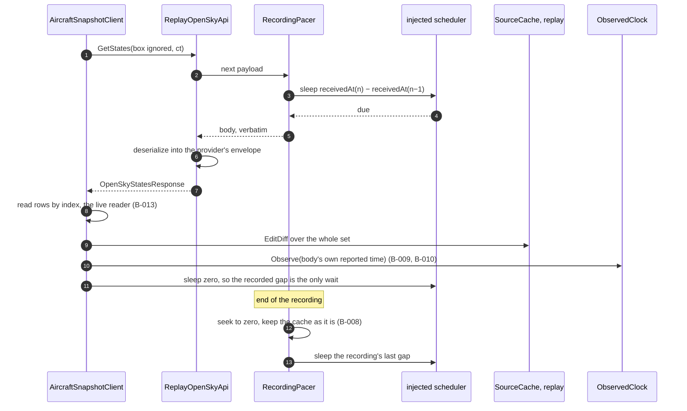

# Specification: Replay source

## 1. Business Goal

<!-- Rules: ../../../.spec/templates/feature.md § 1 -->

The talk's claim is that polled data can still be reactive, and it is proved by a grid filling on stage. That proof currently depends on a venue network and on a provider that blocks hyperscaler IPs, rate-limits by credit, and hands out tokens that expire in thirty minutes — so the demo's headline mechanism and the venue wifi share a single point of failure. This feature removes it by recording what a live provider actually sent during rehearsal and feeding those payloads back at their original spacing through the same `ITrackerSource` seam and the same selector the live sources use. The outcome is a fallback the presenter can reach with the control they already have, for aircraft and for vessels both, and a second thing for free: because nothing downstream can tell a recording from a live feed, replay _is_ the demonstration that the pipeline does not care where the data comes from. The failure state removed is a demo that only works on a good network — which, as the [stage-day runbook](../../../docs/runbook.md) puts it, is a gamble, not a demo.

## 2. User Needs

<!-- Rules: ../../../.spec/templates/feature.md § 2 -->

| #   | Persona                                                                                  | Need                                                                    | Pain point today                                                                                                                                             |
| --- | ---------------------------------------------------------------------------------------- | ----------------------------------------------------------------------- | ------------------------------------------------------------------------------------------------------------------------------------------------------------ |
| 1   | The presenter running the demo on stage (README.md § "Demo resilience")                  | To finish the talk when the venue network dies mid-sentence             | The only source of data is a provider reached over a network nobody in the room controls, and there is nothing to fall back to                               |
| 2   | The presenter at the closing act (README.md § "Closing act"; run-the-demo § "Never add") | The ships ending to survive the same failure as the main demo           | The closing act is the one part with no fallback at all, so the riskiest minute of the talk is also the least protected                                      |
| 3   | Line-of-business .NET developer in the talk audience (README.md § "Audience")            | To see that the pipeline is indifferent to its source, not be told it   | "Swap the source and nothing downstream changes" is an assertion until the audience watches a recording drive the same grid the live feed drove              |
| 4   | The same developer, reading this repository afterwards — the repository is the takeaway  | One switch between sources, not a live path and a separate offline path | Most codebases grow an "offline mode" flag that only runs under pressure, and it is the code least exercised and most likely to be broken when it is needed  |
| 5   | The same developer, whose CI cannot reach the provider                                   | To exercise the pipeline end to end with no network and no credential   | OpenSky blocks hyperscaler IPs (README.md § "Gotchas"), so a build agent can never run the live path, and a test that needs a key passes only on one machine |
| 6   | The presenter rehearsing the day before, inside the credit budget (README.md § "Limits") | To capture rehearsal traffic without paying twice for it                | Credits are the budget; a recorder that polls on its own doubles the spend of every rehearsal it observes                                                    |

## 3. Acceptance Criteria

<!-- Rules: ../../../.spec/templates/feature.md § 3 -->

Twenty-seven claims in six groups: **B-001 – B-006** the recording;
**B-007 – B-014** playback; **B-015 – B-018** selection and swap;
**B-019 – B-021** the vessel half; **B-022 and B-023** the substitution point
of each half, appended as § 11 rows 1 and 2 were answered rather than
renumbered into the groups they belong to — ids here are permanent; and
**B-024 – B-027** which recording a run loads, answered in
[adr/0001](adr/0001-recording-selected-by-configuration.md).

Claim ids are per-Feature, per spec-and-traceability § "Claims and
traceability". `B-001` here and `B-001` in
[`aircraft-source`](../../../src/Transponder/Integrations/OpenSky/.spec/README.md) are different
claims: an `.issue/` item names its spec, and its `claims:` ids resolve
against that spec.

| ID    | Claim                                                                                                                                                                                                                                                                                                                                                  | Source                                                              |
| ----- | ------------------------------------------------------------------------------------------------------------------------------------------------------------------------------------------------------------------------------------------------------------------------------------------------------------------------------------------------------ | ------------------------------------------------------------------- |
| B-001 | A recording SHALL be written in the format [ADR-0004](../../../.spec/adr/0004-ndjson-recording-format.md) fixes: one line per payload, the provider's payload verbatim, beside the instant it arrived.                                                                                                                                                 | ADR-0004; api-mock § "Recording"                                    |
| B-002 | The recorder SHALL NOT reshape, filter, reorder or omit a payload, including an empty or sparse one; what the provider sent SHALL be what the line holds.                                                                                                                                                                                              | api-mock § "Recording" — raw, not parsed                            |
| B-003 | Recording SHALL NOT issue a request of its own; it SHALL record what a live source already fetched, so recording costs no additional credit and opens no additional socket.                                                                                                                                                                            | README.md § "Limits"; § 4 row 10                                    |
| B-004 | Recording SHALL be observationally transparent: the changesets reaching the fleet SHALL be identical whether recording is on or off.                                                                                                                                                                                                                   | Decided call — a recorder is a tap, not a second source             |
| B-005 | A recording intended for stage use SHALL span at least the staleness threshold, so appearance, update and staleness are all reproducible from it.                                                                                                                                                                                                      | api-mock § "Recording"; aircraft-source B-051                       |
| B-006 | A rehearsal recording SHALL NOT be committed to the repository, and SHALL NOT be used as a test fixture unless it has been scrubbed of real traffic first.                                                                                                                                                                                             | api-mock § "Never add"; § 4 row 7                                   |
| B-007 | Replay SHALL emit payloads in recorded order at the recorded inter-arrival spacing, derived from the recorded instants, and SHALL NOT substitute a fixed interval.                                                                                                                                                                                     | api-mock § "Replay"                                                 |
| B-008 | On reaching the end of a recording, replay SHALL continue from its first payload; the stream SHALL NOT complete, fault, or emit a changeset that removes every vehicle at the loop boundary.                                                                                                                                                           | api-mock § "Replay"                                                 |
| B-009 | The observed instant downstream SHALL be the replayed payload's own reported time — never the recorded arrival instant, and never an ambient clock.                                                                                                                                                                                                    | aircraft-source B-003; ADR-0004 § "Decision"                        |
| B-010 | Staleness under replay SHALL be driven by the recording's time base, so a vehicle becomes observably stale at the same point in the recording at which it did live; the staleness clock SHALL be injected, not ambient.                                                                                                                                | api-mock § "Replay"; dynamic-data-pipeline § "Staleness and expiry" |
| B-011 | Replay SHALL make no network request and SHALL require no credential; it SHALL run to completion with the provider unreachable and no secrets configured.                                                                                                                                                                                              | api-mock § "Strategies on the same seam"; § 4 row 2                 |
| B-012 | A torn or unparseable final line SHALL be discarded and the stream SHALL continue; a recording truncated mid-write SHALL NOT fault replay.                                                                                                                                                                                                             | ADR-0004 § "Decision"                                               |
| B-013 | Replay SHALL produce domain vehicles through the same projection the live strategy uses; there SHALL NOT be a second converter, parser or mapper for recorded payloads.                                                                                                                                                                                | mapping § "One mapper per boundary"; api-mock § "Recording"         |
| B-014 | A recording SHALL remain replayable after a converter fix, with no re-recording — which is what recording the payload raw is for.                                                                                                                                                                                                                      | api-mock § "Recording"; ADR-0004 § "Decision drivers"               |
| B-015 | Replay SHALL be selected through the same mechanism as any live source, and there SHALL be no offline-mode flag, no replay-only selector, and no second selection path.                                                                                                                                                                                | api-mock § "Replay"; hot-swap-source § "Never add"                  |
| B-016 | No consumer SHALL be able to observe from the seam that replay rather than a live provider is selected.                                                                                                                                                                                                                                                | aircraft-source B-039; hot-swap-source § "Never add"                |
| B-017 | Swapping to replay SHALL stop the outgoing live source, so a swapped-out poller stops spending credits and a swapped-out socket stops reading.                                                                                                                                                                                                         | aircraft-source B-040; hot-swap-source § "Disposal discipline"      |
| B-018 | Swapping to or from replay SHALL NOT rebuild the tracker, its collection, its filters, its sorts, its groups or its bindings.                                                                                                                                                                                                                          | hot-swap-source § "What must not be rebuilt"                        |
| B-019 | A vessel recording SHALL use the same format and the same selection path as an aircraft recording, with one line per received message; messages SHALL NOT be batched into poll-shaped snapshots to make a push feed resemble a polled one.                                                                                                             | api-mock § "Strategies on the same seam"; ais-stream                |
| B-020 | A recorded vessel fallback SHALL exist before the closing act is presented.                                                                                                                                                                                                                                                                            | run-the-demo § "Never add"                                          |
| B-021 | Replay SHALL introduce no vehicle, record or snapshot type of its own; it SHALL reproduce whatever the recorded provider's own Feature defines.                                                                                                                                                                                                        | aircraft-source § 5 row 3; § 5 row 2 below                          |
| B-022 | Replay SHALL substitute at the provider's own API contract, handing back recorded envelopes, and SHALL introduce no snapshot client, cache, converter or projection of its own; the live path's snapshot client SHALL be the one constructed over it.                                                                                                  | ADR-0002 § "Decision" item 2; § 11 row 1                            |
| B-023 | Vessel replay SHALL substitute at the strategy — an `ITrackerSource` fed by a recording — because a push provider has no contract to stand in for; it SHALL reach the seam the same way every other source does.                                                                                                                                       | ADR-0002 § "Consequences"; § 4 row 5                                |
| B-024 | The recording each replay source reads SHALL be named in configuration, one key per source, through the same mechanism the interval and the bounding box use; no recording SHALL be compiled in as a default, a source with none named SHALL NOT be registered or selectable, and configuration SHALL NOT determine whether replay is the live source. | adr/0001; aircraft-source B-050                                     |
| B-025 | A named recording SHALL resolve against a single configured recordings root, defaulting to `recordings/` relative to the running application and overridable, so a rehearsal writes and a replay reads the same place without either naming an absolute path.                                                                                          | adr/0001; ADR-0004 § "Decision"                                     |
| B-026 | A configured recording that is absent, unreadable, or shorter than the staleness threshold SHALL be reported when the application starts, and SHALL NOT first be discovered when replay is selected.                                                                                                                                                   | adr/0001; aircraft-source B-029                                     |
| B-027 | The component that paces a recording SHALL be handed an opened payload stream rather than a path, and SHALL perform no file resolution of its own.                                                                                                                                                                                                     | adr/0001; § 4 row 8                                                 |

## 4. Constraints

<!-- Rules: ../../../.spec/templates/feature.md § 4 -->

| #   | Constraint                                                                                                                                                                      | Source                                             | Impact                                                                                                                                                                                                                                                                                                                 |
| --- | ------------------------------------------------------------------------------------------------------------------------------------------------------------------------------- | -------------------------------------------------- | ---------------------------------------------------------------------------------------------------------------------------------------------------------------------------------------------------------------------------------------------------------------------------------------------------------------------- |
| 1   | The recording format is fixed repository-wide: NDJSON, one line per payload, payload verbatim beside its arrival instant.                                                       | ADR-0004                                           | Rules out choosing a format here, and rules out a per-feed format. An accepted ADR is immutable, so a different format is a new ADR superseding it — not a claim in this section.                                                                                                                                      |
| 2   | OpenSky blocks AWS and other hyperscaler IPs, and the venue network is outside our control.                                                                                     | README.md § "Gotchas"; run-the-demo                | Rules out treating replay as a test convenience: it is the stage contingency and a CI prerequisite. Also rules out any replay path that needs the provider reachable to start.                                                                                                                                         |
| 3   | The observed instant comes from the provider's own envelope, and no consumer reads an ambient clock to supply one.                                                              | aircraft-source B-003                              | Rules out the recorded arrival instant being used as the observed instant. The arrival instant paces playback (B-007) and nothing else — two times on one line, one job each.                                                                                                                                          |
| 4   | The response envelope and the positional row may be referenced only by the class implementing the API contract and by the snapshot client; the snapshot dies at the projection. | aircraft-source B-045, B-046                       | Satisfied rather than relaxed. Replay substitutes at the contract and brings no client of its own (B-022), so the envelope and the positional row stay referenced by exactly the two components B-045 names. **B-045 is not widened**, and a replay component that parses a recorded payload itself remains ruled out. |
| 5   | A contract layer exists only where the provider is request/response shaped; a push provider's strategy has none.                                                                | aircraft-source B-049; § 4 row 4 of that spec      | Rules out one uniform substitution point across both feeds. Aircraft replay has a contract it could stand in for; vessel replay has none, so the two halves substitute at different depths — B-022 for aircraft, B-023 for vessels. Both reach the seam, which is the only symmetry a swap target needs.               |
| 6   | `Vessel`, the vessel client, its cache and its tracker source are unspecified — deferred by the aircraft-source specification.                                                  | aircraft-source § 5 row 3                          | Rules out any claim here about a vessel record's members, keys or units. B-019 and B-021 claim replay behavior over whatever that Feature defines, and no more.                                                                                                                                                        |
| 7   | A rehearsal recording is operational data — real callsigns, real positions — and credentials are never committed, logged, or placed in a fixture.                               | api-mock § "Never add"; aircraft-source § 4 row 12 | Rules out committing a recording, shipping one as a fixture, and any test that reads one. `recordings/` is git-ignored (ADR-0004); fixtures stay synthetic and committed beside their tests.                                                                                                                           |
| 8   | No test may touch a network or the wall clock.                                                                                                                                  | api-mock § "Tests"; test-from-scenarios            | Rules out `Thread.Sleep`, a real delay, and a test that replays in real time. Replay's cadence is driven by an injected scheduler, so a test advances time deliberately — in production as well as in tests.                                                                                                           |
| 9   | There is no Gherkin runner in this repository — no Reqnroll, no bindings, no step definitions.                                                                                  | AGENTS.md; spec-and-traceability                   | Rules out the `.feature` file being the executing artifact, and rules out an `@ignore` tag. A scenario existing never means a claim is covered; the § 9 row pointing at an xUnit test does.                                                                                                                            |
| 10  | Credits are the budget — a ≤25 sq° box costs 1 credit per poll against 4,000 per day, polled every 15 seconds.                                                                  | README.md § "Limits"; aircraft-source B-050        | Rules out a recorder that polls independently of the live source (B-003), which would double rehearsal spend. Recording is a tap on traffic already paid for.                                                                                                                                                          |
| 11  | A vehicle past the staleness threshold is marked and kept, never removed, at a configurable five minutes.                                                                       | aircraft-source B-051                              | Fixes the minimum useful recording length (B-005): a recording shorter than the threshold can never show staleness, so it cannot rehearse the part of the talk staleness is in.                                                                                                                                        |
| 12  | Nothing but the swap decorator is registered as `ITrackerSource`; a strategy registers as `ITrackerSourceStrategy`, which is what the decorator is handed as an enumerable.     | ADR-0011 § "Decision"                              | Rules out registering replay as `ITrackerSource` itself, which hands replay to consumers in place of the selector and makes the swap do nothing. Replay registers as a strategy, in one line, and the selector finds it there. Ordering no longer matters — the record said it did until `0049` ran the library.       |

## 5. Out of Scope

<!-- Rules: ../../../.spec/templates/feature.md § 5 -->

| #   | Item                                                                                           | Exclusion reason                                                                                                                                                                                                                                          |
| --- | ---------------------------------------------------------------------------------------------- | --------------------------------------------------------------------------------------------------------------------------------------------------------------------------------------------------------------------------------------------------------- |
| 1   | The simulated source                                                                           | A separate Feature. It generates movement with no recording, no fixture and no cadence file, so ADR-0004 does not bind it and none of B-001 – B-014 applies. aircraft-source § 5 row 4 groups replay and simulated only because both were excluded there. |
| 2   | The vessel feed itself — `Vessel`, the AISStream client, its cache and its tracker source      | Deferred by aircraft-source § 5 row 3 and still unspecified. B-019 – B-021 claim replay's behavior over that feed; defining the feed is the vessel Feature's § 3, and writing it here would be authoring another Feature's claims.                        |
| 3   | Performing the recording                                                                       | An operational task at rehearsal, tracked in README.md § "Open items". B-005 claims what a stage recording must contain; capturing one is not code.                                                                                                       |
| 4   | A scrubbing tool                                                                               | B-006 forbids unscrubbed reuse; it does not commission an automated scrubber. Scrubbing a few minutes of NDJSON by hand is why the format is line-oriented and legible (ADR-0004 § "Consequences").                                                       |
| 5   | A transport control — seek, pause, scrub position, step a frame, change playback speed         | Playback is forward and looping (B-007, B-008). A transport is a media player nobody asked for, and ADR-0004 explicitly buys no index to seek with.                                                                                                       |
| 6   | Compression of recordings                                                                      | ADR-0004 § "Consequences" accepts uncompressed JSON at demo length and defers compression to a later record if it ever matters.                                                                                                                           |
| 7   | The swap control, the stage choreography, and what the audience sees during the gap            | `hot-swap-source` owns them, and the gap is already decided in aircraft-source decisions/0002. This spec claims replay's obligations as a swap target (B-015 – B-018) and stops there.                                                                    |
| 8   | An offline mode, an environment flag, or a "use replay" setting separate from source selection | Forbidden by B-015 and by hot-swap-source § "Never add". Recorded as an exclusion because it is the obvious thing to add under pressure, and the whole point is that there is one switch.                                                                 |
| 9   | Recording the domain side of the seam — changesets, vehicles, or the fleet's contents          | A recording is provider payloads (B-001). Recording after the projection would bake today's projection into the file and foreclose B-014, which is the reason raw was chosen over parsed.                                                                 |
| 10  | A history store, a track per vehicle, or any persistence of domain state                       | Each cache holds current state; aircraft-source § 5 row 14 rules a history collection out. A recording is an input to the pipeline, not an archive of its output.                                                                                         |
| 11  | The pipeline operators, the grid, and every other UI concern                                   | Downstream of the seam and untouched by a swap (B-018). `maui-ui` and `mvvm` own them; no scenario here names a UI mechanic.                                                                                                                              |
| 12  | A Gherkin runner, Reqnroll, step definitions, or bindings                                      | § 4 row 9. Scenarios are documentation; a runner would move the coverage gate off § 9, which is where AGENTS.md puts it.                                                                                                                                  |
| 13  | The `airplanes.live` backup source                                                             | Its access terms are unresolved (README.md § "Backup source"). A second live provider is a different contingency from a recording, and it gets its own contract and strategy if and when the terms clear.                                                 |

## 6. Concern Separation

<!-- Rules: ../../../.spec/templates/feature.md § 6 -->

One row per concern, not per claim, with the claim ids each row answers for in
its Notes — so coverage is read down the column rather than counted in rows,
and no claim is copied here to drift from § 3. The rows follow § 3's six
groups.

The judgment this section exists to keep separate is the one § 1 turns on: a
recording exists for a business reason — a venue network this demo does not
control — and the technical shape that follows from it is a second contract
implementation rather than a second client. Those are two readings of one
decision, and the **Both** rows below are where they are written as two.

The classifications are applied as
[`aircraft-source`](../../../src/Transponder/Integrations/OpenSky/.spec/README.md)
§ 6 applies them: **Business** where the shape could have gone either way
technically and a product judgment picked it; **Technical** where a constraint
or a skill decided it and no business party expressed a preference; **Both**
where a technical shape was chosen for a reason § 1 states. This Feature has
more **Both** rows than most, which is a finding rather than an accident —
nearly every technical choice below is downstream of one sentence about a
venue network.

| Item                                                              | Classification | Notes                                                                                                                                                                                                                                                                                          |
| ----------------------------------------------------------------- | -------------- | ---------------------------------------------------------------------------------------------------------------------------------------------------------------------------------------------------------------------------------------------------------------------------------------------- |
| A recording holds the provider's bytes, not our reading of them   | Both           | § 1 wants a fallback that outlives a converter fix, which is a business property stated as re-recording nobody has to do. Technically it puts the tap below deserialization, since an envelope that has been through a reader and back is no longer verbatim. B-001, B-002, B-014.             |
| Recording taps traffic already paid for                           | Both           | § 4 row 10 is the business half — one day's credits, and a rehearsal must not spend the talk's. Technically the tap observes a response that was going to be fetched anyway and issues nothing of its own. B-003.                                                                              |
| Recording changes nothing the fleet sees                          | Technical      | A tap that perturbs its subject is a second source wearing a tap's name. No product stake; the claim exists because the failure is invisible from downstream. B-004.                                                                                                                           |
| A recording's usefulness is measured in minutes                   | Business       | The threshold is the talk's: staleness is part of the demo, so a recording too short to show it cannot rehearse the segment it exists for. No technical reading picks a length — § 4 row 11 supplies the number. B-005.                                                                        |
| A rehearsal recording is operational data                         | Both           | Technically § 4 row 7 and a git-ignored directory. The business half is that a recording holds real callsigns and real positions and this repository is public. B-006.                                                                                                                         |
| The cadence belongs to the recording, not to the poller           | Both           | § 1's claim is that nothing downstream can tell replay from live, and a recording played at a fixed interval is visibly not the feed it recorded. Technically it moves the wait into the replay transport and takes the live client's own interval to zero — "Where the cadence lives". B-007. |
| The end of a recording is not the end of the feed                 | Both           | A talk runs longer than a rehearsal capture, which is why looping is claimed rather than left to the operator. The technical half is a rewind, and the hazard is the seam: a grid that empties at the loop boundary reads as the demo dying. B-008.                                            |
| Two times on one line, one job each                               | Technical      | ADR-0004 put both on the line and § 4 row 3 says which does what. Nobody outside the code has a stake in it, and the whole risk is that a reader reaches for the nearer one. B-009, B-010.                                                                                                     |
| Replay owes nothing to the network                                | Both           | § 1: the venue network is the failure being removed, so a fallback that needs the provider reachable removes nothing. Technically it means no socket, no credential, and no startup gate that demands one. B-011.                                                                              |
| A torn last line costs the line                                   | Technical      | ADR-0004 § "Decision". A recorder stopped with a keystroke is the ordinary case rather than the exception, and the line-oriented format was chosen partly so the damage is bounded to one line. B-012.                                                                                         |
| One projection, whatever fed it                                   | Technical      | `mapping` § "One mapper per boundary". A second converter for recorded payloads is the shape this Feature exists to avoid: it would make the observed instant something two implementations each have to keep honouring. B-013, B-022.                                                         |
| One switch, and replay sits behind it like anything else          | Both           | § 1 names this as the second thing the Feature buys: replay _is_ the proof the pipeline does not care where data comes from, and that proof is false the moment a consumer can tell. ADR-0011 is the technical half. B-015, B-016.                                                             |
| A swapped-out source stops spending                               | Both           | Credits again, and a poller still running behind a swapped-away source reads as a leak on a projector. The subscription owns the poll, so stopping it is the swap itself rather than a disposal this Feature performs. B-017.                                                                  |
| The pipeline survives the swap                                    | Both           | § 1's closing act. Technically the decorator sits below everything that would be rebuilt, so this row is satisfied by where the seam is rather than by anything replay does. B-018.                                                                                                            |
| Configuration names which recording; the selector names whether   | Both           | `adr/0001`. The business half earns the row: a presenter has exactly one control, and a configuration key that could also turn replay on would be a second control hiding in a file. B-024.                                                                                                    |
| One root, so a rehearsal and the stage mean the same directory    | Technical      | `adr/0001` item 2 — resolution against a configured root rather than an absolute path in a settings file. No product judgment in it. B-025.                                                                                                                                                    |
| A recording that cannot serve is a report, not a refusal to start | Business       | The departure from `aircraft-source`'s validator, and a product call: an absent credential stops the application because nothing works without it, where an unusable recording must not take the live demo down with it. The presenter learns at startup and still has a talk. B-026.          |
| File resolution happens once, where the source is registered      | Technical      | `adr/0001` item 5. It keeps the component holding the time-base logic free of I/O, which is what lets a test drive it with synthetic lines and no file system. B-027.                                                                                                                          |
| Both feeds record alike and substitute at different depths        | Technical      | § 4 row 5: a contract layer exists only where the provider is request/response shaped. The asymmetry follows from the providers rather than from a choice made here, and the symmetry that matters — both reach the seam — is untouched. B-019, B-023.                                         |
| A recorded fallback exists before the closing act is presented    | Business       | README.md leaves the closing act optional; B-020 makes the fallback mandatory once it is on the agenda. That is a commitment about what gets presented rather than a technical property, which is why it belongs to the person running the talk.                                               |
| Replay defines no type of its own                                 | Technical      | § 5 row 2 and `aircraft-source` § 5 row 3. Replay reproduces whatever the recorded provider's Feature defines; a replay-flavoured vehicle would be a second domain model to keep in step, and it would make B-016 false by construction. B-021.                                                |

## 7. Technical Design

<!-- Rules: ../../../.spec/templates/feature.md § 7 -->

Four records settle what this section would otherwise have had to, and it cites
them rather than restating them: the substitution depth of each half in
[ADR-0002](../../../.spec/adr/0002-contract-client-strategy-tracker.md), the
recording format in
[ADR-0004](../../../.spec/adr/0004-ndjson-recording-format.md), what registers
as what in
[ADR-0011](../../../.spec/adr/0011-the-swap-decorator-selects-among-registered-strategies.md),
and which recording a run loads in
[adr/0001](adr/0001-recording-selected-by-configuration.md). What is left is
this Feature's own shape: where the tap sits, how a recording is opened, read
and looped, which component owns the cadence, and how a second chain over the
same classes is constructed and registered.

**Domain model**

**Not applicable — replay introduces no type of its own (B-021).** The vehicles
a recording produces are the recorded provider's: `Aircraft` and its base are
[`aircraft-source`](../../../src/Transponder/Integrations/OpenSky/.spec/README.md)
§ 7's and [ADR-0005](../../../.spec/adr/0005-an-abstract-base-carries-the-tracked-item.md)'s,
and `Vessel` is unspecified (§ 5 row 2). The only shapes below are transport
and configuration ones, and none of them crosses the projection.

**The recorded line**

ADR-0004 fixes the line; what matters to every component here is that it
carries two instants with one job each, and that mixing them is the failure
B-009 and B-010 are separate claims about.

| Field        | Type                       | Job                                                                                                                                                                              |
| ------------ | -------------------------- | -------------------------------------------------------------------------------------------------------------------------------------------------------------------------------- |
| `receivedAt` | ISO-8601 instant           | **Paces playback, and nothing else.** The gap between consecutive values is the only cadence replay has (B-007). It never reaches the observed clock and never leaves the pacer. |
| `body`       | the provider's JSON, as-is | **Everything downstream.** Deserialized into the provider's own envelope type, whose own reported time becomes the observed instant (B-009) and so the staleness base (B-010).   |

**What this Feature adds**

Six components, none of which exists yet. The home each lands in is the
implementer's to create, and the Feature's specification and `.issue/` move
beside its code in the change that builds it (`transponder-conventions`
§ "Where a specification lives",
[lesson 0015](../../../.spec/lessons/0015-a-move-that-leaves-its-references-behind-is-half-a-move.md)).
Two homes are in play — the recording spine serves both feeds, where the
aircraft substitution is OpenSky's — so the move picks `src/Transponder/Recording`
and the OpenSky half registers from the integration it substitutes inside.

| Component                            | Proposed home                                 | Item   | Owns                                                                                                                                                                                                               |
| ------------------------------------ | --------------------------------------------- | ------ | ------------------------------------------------------------------------------------------------------------------------------------------------------------------------------------------------------------------ |
| `RecordingWriter`                    | `src/Transponder/Recording`                   | `0009` | Appends one NDJSON line per observed payload. Knows the format and nothing about who observed it. B-001, B-002.                                                                                                    |
| The tap                              | `src/Transponder/Integrations/OpenSky/Http`   | `0009` | Hands the writer the response body before anything parses it, on traffic the live client already paid for. B-003, B-004.                                                                                           |
| `RecordingPacer`                     | `src/Transponder/Recording`                   | `0010` | Reads an opened stream forward, discards a torn final line, rewinds at the end, and releases each payload when the recorded spacing says it is due. B-007, B-008, B-012, B-027.                                    |
| `ReplayOpenSkyApi`                   | `src/Transponder/Integrations/OpenSky/Replay` | `0011` | `IOpenSkyApi` over a pacer. Deserializes `body` into the provider's envelope and returns it; ignores the box and the extended flag, because a recording was taken with the ones it was taken with. B-013, B-022.   |
| `ReplayOptions` and its registration | `src/Transponder/Recording`                   | `0012` | One key per replay source, the recordings root, resolution to an opened stream, the startup report, and the construction of the second chain. B-024, B-025, B-026, and B-015 – B-018 by registering as a strategy. |
| The vessel replay strategy           | with the vessel integration, once one exists  | `0013` | `ITrackerSourceStrategy` fed by a pacer directly, since there is no contract to stand in for. B-019 – B-021, B-023.                                                                                                |

**Where the cadence lives**

B-022 puts the live `AircraftSnapshotClient` over the replay contract, and that
client already owns a loop: it fetches, then sleeps its configured interval on
the injected scheduler. Left alone, a replayed payload would be spaced by the
recorded gap **plus** that interval, and B-007 would be false by exactly the
amount nobody notices on stage.

**The cadence lives in the pacer, and the replay chain's client is given an
interval of zero.** `GetStates` on the replay contract completes when the pacer
says the next payload is due, so the only wait in the loop is the recorded one.
The zero interval is not a global setting: the replay chain is hand-constructed
at registration (below), so it is handed its own `OpenSkyOptions` instance and
the live chain's is untouched.

Two consequences are worth stating rather than discovering:

- **A placeholder bounding box is configured on the replay chain's options.**
  The client reads the box before calling the contract and throws without one,
  and no request is made with it. An options value that exists only to satisfy a
  check is a wart; it is preferred to relaxing the live client's guard, which
  exists because a box nobody chose is a demo pointed at open ocean.
- **Rejected: letting the pacer absorb the client's interval** by waiting the
  recorded gap minus whatever already elapsed. It needs no second options
  instance, and it is correct only while the live interval stays shorter than
  the shortest recorded gap — fifteen seconds against a recording taken at
  fifteen seconds. It fails by drifting, which is the failure mode this Feature
  is least able to see.

**A second chain over the same classes**

B-022's "the same client class, not a second one" means a second _instance_,
not a second registration of the same singleton. Three things follow, and all
three are registration-time:

- **The replay chain gets its own `SourceCache<AircraftSnapshot, string>`.**
  Sharing the live cache would leave the outgoing feed's aircraft in the
  collection under the incoming one, which is the failure mode `hot-swap-source`
  lists and which B-016 forbids being visible.
- **The replay chain gets its own per-type seam** — an empty interface beside
  `IAircraftTrackerSource`, declaring nothing for the same reason that one does.
  It is not decoration: `SwappingTrackerSource.Select(Type)` resolves a strategy
  by `Single(type.IsInstanceOfType)`, so two instances of `AircraftTrackerSource`
  with no seam to tell them apart make every swap throw.
- **Registration is a method of its own**, taking configuration the way
  `AddOpenSky` does, so an application and a test compose the same graph and
  differ only in what configuration they supply (B-052's reading, applied here
  before there is a second chain to get wrong).

**Opening a recording, and looping it**

Resolution happens once, where the source is registered: the configured name is
combined with the configured root, the file is opened, and the pacer is handed
the stream (B-025, B-027). The pacer reads forward, and at the end seeks to the
beginning of the same stream rather than reopening it — so the stream must be
seekable, which a `FileStream` is and which a test's `MemoryStream` is.

Three rules at the boundary:

- **Nothing is cleared on rewind.** The cache keeps what it holds and the first
  payload is applied as an ordinary differential update, so the boundary emits
  the changes between the last payload and the first and never a removal of
  everything (B-008).
- **The boundary's spacing is the recording's last gap.** There is no recorded
  interval between the final line and the first, and inventing a fixed one is
  what B-007 forbids; the most recent observed cadence is the honest stand-in.
- **Time moves backwards at the boundary, and that is correct.**
  `IObservedClockWriter.Observe` sets rather than taking the later of the two,
  which [ADR-0007](../../../.spec/adr/0007-the-live-source-advances-the-observed-clock.md)
  decided for exactly this case: a looping recording restarts its time base and
  the fleet stops being stale, the same way it did when the recording began.

A torn final line is discarded on read and the stream continues to the rewind
(B-012). A line that is complete but unparseable is the same case — the
recording is a log, not a contract, and one bad line costs one payload.

**The tap sits below deserialization**

B-002 requires the line to hold what the provider sent, which rules out
recording a reconstructed envelope: `OpenSkyStatesResponse` round-tripped
through a writer is this repository's reading of the payload, not the payload.
The transport currently reads its body straight into the envelope type, so the
tap belongs where the raw body still exists — in the HTTP pipeline beneath the
contract, observing the response the live poll already made.

Rejected: **a decorator over `IOpenSkyApi`**, which is the obvious shape and
reaches only the deserialized envelope, so it can satisfy B-001's "beside the
instant it arrived" and not B-002's "verbatim". The two claims are separate for
this reason.

The tap is scoped to the states endpoint. The token endpoint is on the same
client cache and must never be recorded — a recording is shared and scrubbed by
hand, and § 4 row 7 puts credentials outside what may be written at all.

**Diagrams**

The constructed chain, with the live one above and the replay one below.
Dashed nodes are outside this Feature.

```mermaid
graph LR
  sky(["OpenSky /states/all"])
  file[("recordings/*.ndjson")]

  subgraph contracts["Integrations/OpenSky/Contracts"]
    api["IOpenSkyApi"]
  end

  subgraph live["the live chain"]
    httpApi["OpenSkyHttpApi"]
    tap["recording tap"]
    liveClient["AircraftSnapshotClient"]
    liveCache[("SourceCache, live")]
    liveStrategy["AircraftTrackerSource<br/>IAircraftTrackerSource"]
  end

  subgraph replay["the replay chain"]
    pacer["RecordingPacer"]
    replayApi["ReplayOpenSkyApi"]
    replayClient["AircraftSnapshotClient<br/>same class, interval zero"]
    replayCache[("SourceCache, replay")]
    replayStrategy["AircraftTrackerSource<br/>its own per-type seam"]
  end

  writer["RecordingWriter"]
  decorator["SwappingTrackerSource"]
  tracker["FleetTracker"]:::out
  clock["ObservedClock"]

  sky -->|"raw body"| tap
  tap --> writer
  writer --> file
  tap --> httpApi
  httpApi -.->|implements| api
  replayApi -.->|implements| api
  file -->|"opened once, at registration"| pacer
  pacer -->|"body, when due"| replayApi
  httpApi --> liveClient
  replayApi --> replayClient
  liveClient --> liveCache
  replayClient --> replayCache
  liveClient -->|"reported time"| clock
  replayClient -->|"recorded reported time"| clock
  liveCache --> liveStrategy
  replayCache --> replayStrategy
  liveStrategy -->|ITrackerSourceStrategy| decorator
  replayStrategy -->|ITrackerSourceStrategy| decorator
  decorator --> tracker

  classDef out stroke-dasharray: 4 3
```



One replayed payload, and the loop boundary. This earns its place because it is
where the two instants separate, and where the only wait in the loop is visible.



**Interface changes**

Every file below is new, so the declarations are written out; each becomes a row
in this table once its file exists (`transponder-conventions` § "Declarations in
§ 7"). Accessibility follows the repository's rule — a type a consumer never
names is `internal`, and the registration method is the only public surface.

| Type                 | File                                                                                | Claims it makes visible                                        |
| -------------------- | ----------------------------------------------------------------------------------- | -------------------------------------------------------------- |
| `IRecordingWriter`   | [`IRecordingWriter.cs`](../../../src/Transponder/Recording/IRecordingWriter.cs)     | B-001's shape, and that a tap never faults into a poll (B-004) |
| `RecordingWriter`    | [`RecordingWriter.cs`](../../../src/Transponder/Recording/RecordingWriter.cs)       | B-001, B-002                                                   |
| `UnrecordedPayloads` | [`UnrecordedPayloads.cs`](../../../src/Transponder/Recording/UnrecordedPayloads.cs) | B-004 — the null object is what makes the tap branch-free      |
| `RecordingOptions`   | [`RecordingOptions.cs`](../../../src/Transponder/Recording/RecordingOptions.cs)     | The one recordings root a rehearsal writes and a replay reads  |

The remaining declarations are written out because their files do not exist yet.

```csharp
/// <summary>Releases a recording's payloads at the spacing they arrived with.</summary>
internal interface IRecordingPacer
{
    /// <summary>Waits until the next payload is due, then answers it verbatim.</summary>
    /// <param name="cancellationToken">Stops the wait.</param>
    /// <returns>The payload as the provider sent it; the recording rewinds rather than ending.</returns>
    Task<string> Next(CancellationToken cancellationToken);
}

/// <summary>Which recording each replay source reads (adr/0001). The root is not here — see below.</summary>
internal sealed class ReplayOptions
{
    /// <summary>The configuration section this binds under.</summary>
    internal const string Section = "Replay";

    /// <summary>Gets or sets the aircraft recording's file name. Null until configuration names one, and no default is compiled in.</summary>
    public string? Aircraft { get; set; }

    /// <summary>Gets or sets the vessel recording's file name. Null until configuration names one.</summary>
    public string? Vessels { get; set; }
}

/// <summary>The replay chain's seam, empty for the reason <see cref="IAircraftTrackerSource"/> is.</summary>
internal interface IAircraftReplayTrackerSource : ITrackerSourceStrategy;
```

**The recordings root moved, and the reason is `adr/0001` item 2.** This section
first declared `Root` on `ReplayOptions`, beside the recording names. `0009`
needed the same root to write to, and two types each carrying one would be two
places for one answer — with the second one edited being the one that is wrong
on stage. It lives on
[`RecordingOptions`](../../../src/Transponder/Recording/RecordingOptions.cs)
instead, which `0009` built, and `ReplayOptions` reads it from there. That is
what "a rehearsal writes and a replay reads the same place" requires in code
rather than in prose.

`ReplayOpenSkyApi` implements `IOpenSkyApi` explicitly, as `OpenSkyHttpApi`
does, so the contract's members are reachable only through the contract. It
introduces no envelope type and no row reader: the provider's own
`OpenSkyStatesResponse` is deserialized with the converter already attached to
`OpenSkyStateRow`, which is what keeps B-013's "no second converter" true in
code rather than in prose.

**The startup report**

B-026 is a report, not a refusal. At startup each named recording is resolved
and read far enough to answer three questions — does it exist, can it be read,
does it span the staleness threshold — and each answer is logged naming the
recording and the defect. A recording that fails any of them leaves its source
unregistered, which is what B-024 already does for a source with no recording
named: the control is absent rather than offering a wrong recording.

This departs deliberately from
[`OpenSkyConfigurationValidator`](../../../src/Transponder/Integrations/OpenSky/Configuration/OpenSkyConfigurationValidator.cs),
which fails the host. An absent credential means nothing works; an unusable
recording means the fallback is gone while the live demo is fine, and stopping
the application for it would turn a degraded talk into no talk.

**The vessel half**

B-023 substitutes at the strategy: a vessel replay source implements
`ITrackerSourceStrategy` directly and is fed by a pacer over the same format,
because a push provider has no contract to stand in for (§ 4 row 5). It
registers the same way, is selected the same way, and reaches the same seam —
the asymmetry is the depth and nothing else.

It is designed here and not built. `0013` waits on a specification rather than
on an item: `Vessel`, its client, its cache and its tracker source are
unspecified (§ 5 row 2), and what a vessel replay projects into cannot be
written before they exist.

**Credential validation follows the live source**

No open decisions. The one this section raised — whether an application
composing the OpenSky integration may start with no credential, which B-011
requires and `AddOpenSky`'s `ValidateOnStart` refuses — was answered by the
person on 2026-10-06, and § 11 row 4 carries the options and why this one won.

The shape it settles: **credential validation is registered with the live
transport rather than with the integration.** `AddOpenSky` splits into a shared
part and a live part, and the replay registration calls the shared part only.

| Registered by   | What it carries                                                                                                                                 |
| --------------- | ----------------------------------------------------------------------------------------------------------------------------------------------- |
| shared          | `OpenSkyOptions`, the observed clock's three aliases, `AircraftSnapshotMapper`, the scheduler provider.                                         |
| the live part   | `OpenSkyCredentials` and their validation, the token source, the Flurl client cache, `OpenSkyHttpApi`, and the live cache, client and strategy. |
| the replay part | `ReplayOptions` and its report, the pacer, `ReplayOpenSkyApi`, and the replay cache, client and strategy.                                       |

Two things this is **not**. It is not two compositions of one graph: the shared
part is one private method both call, which is the objection that ruled out
building the replay chain outside `AddOpenSky` altogether. And it is not a
credential becoming optional — a composition that registers the live transport
validates exactly as it does today, so
[`aircraft-source`](../../../src/Transponder/Integrations/OpenSky/.spec/README.md)
B-029 stays true as written for every composition it was written against. What
is new is a composition it never contemplated: one with no live transport at
all, where there is no credential to be missing.

B-029 is therefore unamended here, and amending it is not this Feature's to do
— it is a delivered claim of another Feature, with a § 9 row and a test behind
it. Whether its wording should gain the clause out loud is `aircraft-source`'s
`spec-author`'s call.

## 8. Testing Strategy

<!-- Rules: ../../../.spec/templates/feature.md § 8 -->

**Testability assessment**

Against § 7's design, not against the claims alone — the assessment of a shape
nobody has committed to is worth nothing.

| Dimension          | Verdict       | Finding                                                                                                                                                                                                                                                                                                                                                                                                                                                   | Recommendation                                                                                                                                                                                                                                                                                     |
| ------------------ | ------------- | --------------------------------------------------------------------------------------------------------------------------------------------------------------------------------------------------------------------------------------------------------------------------------------------------------------------------------------------------------------------------------------------------------------------------------------------------------- | -------------------------------------------------------------------------------------------------------------------------------------------------------------------------------------------------------------------------------------------------------------------------------------------------- |
| DI seams           | Pass          | The substitution point is already an interface, and `adr/0001` item 5 hands the pacer an opened stream rather than a path — so the one component with time-base logic has no I/O to stub and a `MemoryStream` of synthetic lines reaches it whole. The replay chain is hand-constructed at registration, which is itself the seam a composition test uses.                                                                                                | —                                                                                                                                                                                                                                                                                                  |
| Behavior isolation | **Qualified** | The cadence lives in the pacer, and the loop that calls it lives in `AircraftSnapshotClient`. B-007 is provable at the pacer in one statement, and a pacer that paces correctly proves nothing about an outer loop that adds its own interval on top — which is the failure § 7 rejected an option to avoid.                                                                                                                                              | B-007 takes two tests: one at the pacer for the spacing, one through the client for the zero interval. `test-from-scenarios` § "A claim proven only against an inner method" is the rule; § 9 gives B-007 one row and names both.                                                                  |
| Coverage potential | **Qualified** | Twenty-two claims are about a value or an observable sequence and are ordinary tests. Five are not: B-005 is about what a captured recording contains, B-006 about what is committed, B-020 about what exists before a talk is given, and B-021 and half of B-022 about what types a component may introduce. This repository's answer to a structural claim is a compiler diagnostic, and the boundary analyzer carries no rule bearing on any of these. | Four are marked **Review** rather than given a test that reads a declaration ([lesson 0006](../../../.spec/lessons/0006-a-row-is-not-a-reason-to-write-a-test.md)); B-022's other half is an ordinary composition test, so its row names both. B-005's review cannot be performed yet — see below. |
| Fixtures           | **Qualified** | Every fixture is synthetic NDJSON: two or three lines as a `static readonly string`, in a `*Cases.cs` beside the tests, parsed the way production parses it. The hazard is specific to this Feature and stated as a claim: **a rehearsal recording is operational data and is never a fixture** (B-006), so the one artefact that would make these tests easy to write is the one thing they may not read.                                                | A torn line is a fixture whose last line is cut mid-token, not a file truncated by a test. Keep the loop cases short — three lines is enough for a boundary.                                                                                                                                       |
| Determinism        | Pass          | Nothing here reads the wall clock. Spacing comes from recorded instants advanced on `ISchedulerProvider`, and staleness from the observed clock the replayed envelope writes — so a test advances time deliberately and a recording's whole span passes in microseconds. No test reaches a network, and B-011's own scenario is that none can.                                                                                                            | —                                                                                                                                                                                                                                                                                                  |

**Two mechanisms, and which proves what**

An **xUnit test** proves a value the code computes or a sequence it emits. A
**review** proves a claim about something the repository does not contain — a
captured recording, a file that must stay uncommitted, a type nobody may
introduce — where there is no value to compute and no declaration worth
asserting over. A review is a mechanism and it can be performed: it records what
was looked at, on which item, and what change re-does it.

There is no third mechanism here. The boundary analyzer
([ADR-0006](../../../.spec/adr/0006-an-analyzer-enforces-the-layer-boundaries.md))
carries no rule bearing on this Feature, and asking for one is
`Transponder.Analyzers`' own Feature rather than a line in this section. A test
over `typeof(...)` is not an option: it executes, so it looks like the first
mechanism, and it asserts a declaration, so it does the second's job badly.

**One review cannot be performed yet.** B-005 claims a stage recording spans at
least the staleness threshold, and § 5 row 3 keeps capturing one out of scope —
so there is nothing to look at. Its automated half arrives with B-026, whose
startup check measures exactly that span; the row stays `Missing` and says so.

**Two claims wait on another Feature.** B-019 and B-023 are about a vessel
recording and a vessel strategy, and § 5 row 2 defers the feed. Their rows name
what will prove them and record that the subject does not exist
([lesson 0011](../../../.spec/lessons/0011-a-review-nobody-performed-is-not-a-review-nobody-can-perform.md)).

**A finding for `spec-author`: B-011's test is a host test, and `0010` cannot
write it.** B-011 — replay runs with no credential configured — is provable only
against a composed host, and the composition that makes it true is § 11 row 4's
registration split, which is `0012`'s. `0010` holds the claim and delivers
nothing that can move its row. This is the shape
[lesson 0011](../../../.spec/lessons/0011-a-review-nobody-performed-is-not-a-review-nobody-can-perform.md)
names, and the remedy is a claim reassignment in § Tasks rather than a test
`0010` cannot write — not this section's to make.

**Scenarios**

Twenty-seven scenarios in [`replay-source.feature`](replay-source.feature)
beside this file, one per claim, each tagged with the `@B-00n` it proves.
Scenarios are documentation; the xUnit tests are what execute, and none is
written yet.

- Happy path → B-001, B-003, B-004, B-007, B-009, B-011, B-013 – B-016, B-018,
  B-019, B-022, B-023, B-025, B-027
- Failure mode → B-008, B-010, B-012, B-017, B-026
- Validation failure → B-005, B-006, B-020, B-021, B-024
- Data-driven → B-002

Four buckets and one claim in the last, which is the honest count rather than a
spread: B-002 is the only claim whose proof is the same assertion over several
payloads — empty, sparse, and ordinary. Four of the five validation-failure rows
assert an absence rather than a behaviour, and they are exactly the four the next
section marks Review; B-024 is the odd one, a registration a host test observes.

**What the tests need before any of them can be written**

Nothing central. The stack `transponder-conventions` mandates is already
referenced, `Akka.TestKit.Xunit2` arrived with `0006`, and `test/UnitTests`
already stands up the application's own composition in
`TransponderCompositionTests` — which is the shape every host-level row below
reuses rather than assembling a graph by hand.

Two traps are worth carrying, because both cost a cycle in this Feature
specifically:

- **A generated fixture names a builder after its parameter's _type_**, so
  `AircraftSnapshotClient`'s two `IOptions<OpenSkyOptions>`-shaped and
  cache-shaped parameters collide the moment the replay chain hands it different
  ones. That type's fixture is hand-written over `AutoFixtureBase<T>`, saying so
  in its remarks.
- **The arrangement is not a helper.** A synthetic recording is _data_ and may be
  built by a private method; the stream handed to the pacer, the host, and the
  configuration handed to the registration are the `// Given` and stay in the
  test body ([lesson 0015](../../../.spec/lessons/0015-a-helper-that-builds-the-arrangement-is-the-arrangement.md)).

## 9. Traceability Matrix

<!-- Rules: ../../../.spec/templates/feature.md § 9 -->

**This is the gate, and twenty-two of the twenty-seven rows read `Missing`.**
Five are `Verified` and they all arrived with `0009`, which built the recorder:
B-001 – B-004 against `RecordingWriterTests` and `RecordingTapTests`, and
B-006 as a review a reader can now perform. Everything else is unbuilt — no
pacer, no replay contract, no registration — and those rows name what will
prove each claim rather than leaving the section empty, which is the difference
between a gate that says what is owed and one that says only that something is.

A row's Status becomes `Verified` when every mechanism it names passes in a run,
and a review becomes `Verified` when it is performed and recorded. A scenario
existing is never coverage; this section is the only place a claim's build state
is written.

Three kinds of entry appear in Test, and § 8 says which proves what. An **xUnit
test** proves a value or a sequence. A **Review** proves a claim about something
the repository does not contain, and B-005's cannot be performed until a
recording exists. **Waiting** marks a row whose subject belongs to a Feature that
has no specification yet — B-019 and B-023, the vessel half.

The Scenario column carries the `@B-00n` tag rather than a scenario title, so a
retitled scenario does not silently orphan a row. Every claim carries exactly one
scenario here, so no tag anchors two.

| Claim ID | Scenario | Test                                                                                                                                                                                                                                                                                                                                                                                               | Status   |
| -------- | -------- | -------------------------------------------------------------------------------------------------------------------------------------------------------------------------------------------------------------------------------------------------------------------------------------------------------------------------------------------------------------------------------------------------- | -------- |
| B-001    | `@B-001` | `RecordingWriterTests.GivenAPayloadAndTheInstantItArrived_WhenTheLineIsWritten_ThenItHoldsBothInTheFormatADR0004Fixes`, with `GivenAnArrivalInstantOffFromUtc_...ThenTheInstantIsWrittenAsUtc` and `GivenThreePayloads_WhenEachIsRecorded_ThenThereIsOneLinePerPayload` — `0009`                                                                                                                   | Verified |
| B-002    | `@B-002` | `RecordingWriterTests.GivenAPayloadTheProviderSent_WhenItIsRecorded_ThenTheLineHoldsThoseBytesUnchanged`, over `RecordingWriterCases` — `0009`                                                                                                                                                                                                                                                     | Verified |
| B-003    | `@B-003` | `RecordingTapTests.GivenRecordingIsOn_WhenOnePollCompletes_ThenOnlyThePollsOwnRequestWasMade`, asserting the calls Flurl's `HttpTest` saw rather than counting in the tap — `0009`                                                                                                                                                                                                                 | Verified |
| B-004    | `@B-004` | `RecordingTapTests.GivenOnePayloadPolledWithRecordingOnAndOff_WhenEachEnvelopeIsRead_ThenTheyAreIdenticalAndSoAreTheRequests`, with `RecordingWriterTests.GivenADestinationThatThrows_...ThenTheTaskCompletesAndTheFailureIsLogged` for the failing-write half — `0009`                                                                                                                            | Verified |
| B-005    | `@B-005` | **Review**, and it cannot be performed yet: § 5 row 3 keeps capturing a recording out of scope, so there is nothing to look at. Performed against the recording taken for the talk, before the talk. Its automated half arrives with B-026, whose startup check measures exactly this span — `0009`                                                                                                | Missing  |
| B-006    | `@B-006` | **Review**, done on `0009`: `.gitignore` line 361 is `recordings/`, no tracked file carries an `.ndjson` extension, and no test reads a recording — every payload a test uses is a synthetic `static readonly` in `OpenSkyPayloads`, and the recorder's own tests write to a `StringWriter`. Re-done by any change that commits a recording, adds an `.ndjson` fixture, or points a test at a file | Verified |
| B-007    | `@B-007` | Two tests, per § 8's behaviour-isolation finding: `RecordingPacerTests.GivenThreePayloadsFifteenSecondsApart_WhenTheRecordingIsReplayed_ThenEachIsReleasedAtTheRecordedSpacing` for the spacing, and `ReplayCadenceTests.GivenTheLiveClientOverTheReplayContract_WhenPayloadsArrive_ThenNoIntervalOfItsOwnIsAdded` — `0010`                                                                        | Missing  |
| B-008    | `@B-008` | `RecordingPacerTests.GivenTheRecordingIsReplayedPastItsEnd_WhenTheBoundaryIsCrossed_ThenTheFirstPayloadFollowsTheLastAndNoChangesetRemovesEveryAircraft` — `0010`                                                                                                                                                                                                                                  | Missing  |
| B-009    | `@B-009` | `ReplayOpenSkyApiTests.GivenALineWhosePayloadReportsOneInstantAndArrivedAtAnother_WhenItIsReplayed_ThenTheReportedOneIsTheObservedInstant` — `0011`                                                                                                                                                                                                                                                | Missing  |
| B-010    | `@B-010` | `ReplayStalenessTests.GivenAnAircraftLastReportedSixMinutesBeforeTheRecordingEnds_WhenTheRecordingIsReplayed_ThenItIsMarkedStaleAtThatPointAndKept` — `0011`                                                                                                                                                                                                                                       | Missing  |
| B-011    | `@B-011` | `ReplayCompositionTests.GivenNoCredentialConfiguredAndNoReachableProvider_WhenTheHostStartsAndReplayRuns_ThenTheFleetFillsAndNoRequestIsMade` — a host test over the registration split § 11 row 4 decided, so **`0012` builds what moves this row** while `0010` holds the claim (§ 8's finding for `spec-author`)                                                                                | Missing  |
| B-012    | `@B-012` | `RecordingPacerTests.GivenARecordingWhoseFinalLineIsCutMidToken_WhenItIsReplayed_ThenEveryCompleteLineIsReplayedAndTheStreamDoesNotFault` — `0010`                                                                                                                                                                                                                                                 | Missing  |
| B-013    | `@B-013` | `ReplayOpenSkyApiTests.GivenAPayloadThatProducedAnAircraftLive_WhenTheSamePayloadIsReplayed_ThenTheAircraftIsIdenticalAndTheLiveProjectionBuiltIt` — `0011`                                                                                                                                                                                                                                        | Missing  |
| B-014    | `@B-014` | `ReplayOpenSkyApiTests.GivenARecordingTakenBeforeAConverterFix_WhenItIsReplayedAfterTheFix_ThenTheCorrectedValuesAreObservedWithNoRecapture` — `0010`                                                                                                                                                                                                                                              | Missing  |
| B-015    | `@B-015` | `ReplayCompositionTests.GivenBothSourcesRegistered_WhenReplayIsSelected_ThenItIsSelectedThroughTheOneDecoratorAndNothingElseSelectsIt` — `0012`                                                                                                                                                                                                                                                    | Missing  |
| B-016    | `@B-016` | `ReplaySwapTests.GivenTheFleetIsObserved_WhenTheSourceSwapsToReplay_ThenNoMarkerCompletionOrErrorReachesTheSeam` — `0012`                                                                                                                                                                                                                                                                          | Missing  |
| B-017    | `@B-017` | `ReplaySwapTests.GivenALivePollerIsRunning_WhenReplayBecomesTheLiveSource_ThenTheOutgoingPollStops` — `0012`                                                                                                                                                                                                                                                                                       | Missing  |
| B-018    | `@B-018` | `ReplaySwapTests.GivenAFilterASortAndAGroupInPlace_WhenTheSourceSwapsToReplay_ThenNoneIsRebuiltAndTheBindingSurvives` — `0012`                                                                                                                                                                                                                                                                     | Missing  |
| B-019    | `@B-019` | **Waiting** on the vessel feed's specification (§ 5 row 2). The test it will take is `VesselRecordingTests.GivenASequenceOfReceivedMessages_WhenEachIsRecorded_ThenThereIsOneLinePerMessageAndNoneIsBatched` — `0013`                                                                                                                                                                              | Missing  |
| B-020    | `@B-020` | **Review**, performed before the closing act is presented: a vessel recording is named in configuration and the startup report clears it. Re-done by the change that alters the closing act's source — `0013`                                                                                                                                                                                      | Missing  |
| B-021    | `@B-021` | **Review** — no vehicle, record or snapshot type declared under the replay namespaces. Re-done by any change that adds a type there, and the reviewer's question is whether the type belongs to the recorded provider's Feature instead — `0013`                                                                                                                                                   | Missing  |
| B-022    | `@B-022` | Both halves: `ReplayCompositionTests.GivenTheReplayChainIsRegistered_WhenItIsResolved_ThenTheClientIsTheLiveClassOverTheReplayContract` for what it reuses, and a **Review** that the replay namespaces declare no client, cache, converter or projection of their own — `0011`                                                                                                                    | Missing  |
| B-023    | `@B-023` | **Waiting** on the vessel feed's specification (§ 5 row 2). The test it will take is `VesselReplayTrackerSourceTests.GivenARecordingAndNoContractToStandInFor_WhenTheStrategyIsRegistered_ThenItReachesTheSeamLikeEveryOtherSource` — `0013`                                                                                                                                                       | Missing  |
| B-024    | `@B-024` | `ReplayRegistrationTests.GivenAnAircraftRecordingNamedAndNoVesselOne_WhenTheHostStarts_ThenOnlyTheAircraftReplaySourceIsSelectableAndTheLiveSourceIsStillSelected` — `0012`                                                                                                                                                                                                                        | Missing  |
| B-025    | `@B-025` | `ReplayRegistrationTests.GivenAConfiguredRootAndARecordingName_WhenTheRecordingIsOpened_ThenItResolvesUnderThatRootAndNeitherValueCarriedAnAbsolutePath` — `0012`                                                                                                                                                                                                                                  | Missing  |
| B-026    | `@B-026` | `ReplayStartupReportTests.GivenOneRecordingSpanningNinetySecondsAndOneThatDoesNotExist_WhenTheHostStarts_ThenBothAreReportedAndNeitherSourceIsRegistered` — `0012`                                                                                                                                                                                                                                 | Missing  |
| B-027    | `@B-027` | `RecordingPacerTests.GivenSyntheticLinesInAMemoryStream_WhenThePacerIsDriven_ThenItReplaysThemWithNoFileSystemAndReadsNoConfiguration` — proven by a test that has no file system rather than by reading the constructor — `0010`                                                                                                                                                                  | Missing  |

**What the matrix says about the items.** Every claim has a row and a named
mechanism, so no item is waiting on this section. Four rows are blocked on
something other than work: B-005 on a recording nobody has captured, B-019 and
B-023 on a specification nobody has written, and B-011 on an item other than the
one holding its claim. The other eighteen move when their item builds and their
test passes.

**`0009` is closed on five of its six claims, and B-005 is why it is not six.**
That row needs a recording to look at, which § 5 row 3 keeps out of scope and
chore `0052` is filed to generate — so the claim stays with `0009` and the row
stays `Missing`, rather than the item being held open waiting on a file nothing
in its scope produces.

## 10. Lessons / Spec Deltas

<!-- Rules: ../../../.spec/templates/feature.md § 10 -->

**Spec delta, 2026-10-06, from `0009`: ADR-0004's two requirements cannot both
hold for a payload containing a line break.** The record fixes one JSON object
per line _and_ the provider's payload verbatim, and a payload with a raw
newline in it satisfies the second only by breaking the first. Nothing had
noticed, because OpenSky sends compact JSON and the question only arises for a
provider that pretty-prints — but this Feature's own test fixtures are
pretty-printed, so the recorder met the case on its first run.

What `0009` built: the payload is written **verbatim** and a warning is logged
naming the broken shape. Verbatim wins because B-002 forbids omitting or
reshaping a payload outright, where the one-line shape is ADR-0004's and the
record is still `proposed`. Minifying the body was rejected — it parses what
the record says is unparsed, and `1250.0` coming back as `1250` would make
"verbatim" untrue in a way no test would catch.

The delta is ADR-0004's to absorb: its decision should say that `body` must be
newline-free and that a provider which pretty-prints needs a superseding
record. Not amended here, because an ADR binds more than this Feature and
`0009` is not the change that decides for the repository.

No Feature-scoped lesson yet — the above is a specification gap rather than a
bug that shipped. One repository-wide lesson bears on this
document: [lesson 0002](../../../.spec/lessons/0002-metadata-about-a-rule-drifts-too.md),
which is why § 3 keeps no build state § 9 owns, and why §§ 6 – 9 said in words
that they were unwritten rather than carrying a template row until the design
and coverage passes wrote them. All four are written now; a `Missing` row in
§ 9 is the only place this Feature's build state is recorded.

## 11. Open Questions

<!-- Rules: ../../../.spec/templates/feature.md § 11 -->

None. All four questions this specification opened have been answered and are
recorded below rather than deleted — an answered question is a record of what
was asked. A question arriving later is added here as a row — `#`, Question,
Owner, Target date — rather than settled in conversation.

**Row 1 — answered: replay substitutes at the API contract, and selection stays
at the seam.** A replay implementation of the provider's contract hands back
recorded envelopes, and the live path's own snapshot client and cache are
constructed over it — the same client class, not a second one. That whole chain
registers as another `ITrackerSourceStrategy`, so replay is a swap target like
any live strategy and B-015 – B-018 hold as written. The claim is B-022.

The seam it registers as was `ITrackerSource` when this row was first answered,
and ADR-0011 changed it after `0049` ran ADR-0003's library: only the decorator
registers as `ITrackerSource` now, and a strategy that did would reach consumers
in place of the selector. § 4 row 12 carries the rule; the sentence above is
corrected rather than left as the answer that was written.

Two consequences worth keeping visible. **aircraft-source B-045 is not
widened**: replay introduces no client, so the envelope and the positional row
stay restricted to the two components that claim names (§ 4 row 4). And the
reason this reading won is that the recorded envelope carries the provider's own
reported time, so B-009's observed instant and B-010's staleness come free, with
no second implementation to re-derive them — where a replay client of its own
would have meant a second positional-row reader to keep correct and a second
place B-003 had to be honoured. A boundary rule honoured in two implementations
is one that drifts.

The decision binds any provider's contract rather than this Feature alone, so it
is recorded in [ADR-0002](../../../.spec/adr/0002-contract-client-strategy-tracker.md)
— amended there rather than given a record of its own, because that ADR's
subject already is the layering and where each thing substitutes in it.

**Row 2 — answered: vessel replay substitutes at the strategy.** It cannot
mirror row 1, because there is no vessel contract to stand in for (§ 4 row 5),
so the two halves substitute at different depths: aircraft replay below the
snapshot client, vessel replay at the strategy itself. B-023 claims it, and
ADR-0002 § "Consequences" accepts the asymmetry as following from its own
reading rather than from anything about the vessel feed. Both halves still reach
`ITrackerSource`, so the symmetry a swap target actually needs is untouched —
what makes something selectable is the seam it lands on, not the depth it
substitutes at.

**Row 3 — answered: configuration names the recording, and the pacer is handed
a stream.** ADR-0004 fixed the format and said nothing about which recording a
run loads; [adr/0001](adr/0001-recording-selected-by-configuration.md) answers
it, scoped to this Feature because nothing outside it is bound. One key per
replay source names the recording, through the same configuration mechanism the
interval and the bounding box use, with **no default compiled in** — a source
with no recording named is not registered and so is not selectable, which is a
visible absence rather than a wrong recording. Paths resolve against one
configured recordings root, defaulting to `recordings/` beside the running
application. Configuration never decides _whether_ replay is live; the selector
does (B-015), and a recording named but never selected is normal. B-024 – B-027
carry it.

The alternative worth naming is newest-wins — order by the UTC instant already
in the filename and take the most recent, so a rehearsal needs no configuration
edit. It was rejected because a thirty-second test capture taken after the real
rehearsal silently becomes the stage recording, and B-005 then fails invisibly
at the one moment it matters. The cost of the chosen answer is one configuration
edit per rehearsal, and B-026 is what makes a forgotten edit visible at startup
rather than at the swap.

**Row 4 — answered: credential validation is registered with the live transport,
not with the integration.** Raised by the design pass and answered by the person
the same day. B-011 claims replay runs with no credential configured, and
`AddOpenSky` registers `OpenSkyCredentials` with `ValidateOnStart`, so an
application composing the OpenSky integration refuses to start without them —
which left B-011 unprovable above the unit level and left a recordings-only
laptop unable to start the demo at all, the exact situation this Feature exists
for.

`AddOpenSky` splits into a shared part and a live part, and the credentials and
their validation move to the live part. A composition that registers the live
transport validates exactly as it does today; one that registers only replay has
no credential to be missing. § 7 § "Credential validation follows the live
source" carries which registration holds what.

Two alternatives were named and rejected. **Leave the gate as it is** and prove
B-011 at the chain rather than at the host: no change to a delivered claim and
the least work, but it answers the Feature's own scenario by narrowing it to
what a unit test can reach, and a venue with no network and a laptop with no
secrets still cannot start the application. **Build the replay chain outside
`AddOpenSky` entirely**, constructing the contract-side graph itself: both
claims hold untouched, at the cost of a second composition of one graph — which
is what `AddOpenSky`'s own remarks argue against, and the first production
scenario it drifts from passes in a test.

What the answer costs: `aircraft-source` B-029 says a missing credential fails
at application startup, with no clause about which sources are registered. It
stays true for every composition it was written against, and the new case is one
it never contemplated. The claim is not amended here — it is another Feature's,
delivered, with a § 9 row and a test behind it — so whether its wording should
say so out loud is `aircraft-source`'s `spec-author`'s call.

## 12. Sign-off

<!-- Rules: ../../../.spec/templates/feature.md § 12 -->

| Sections | Owner       | Status   |
| -------- | ----------- | -------- |
| §§ 1-5   | spec-author | 🟡 Draft |
| §§ 6-7   | implementer | 🟡 Draft |
| §§ 8-9   | test-writer | 🟡 Draft |

What `approved` requires, and why a `Missing` row in § 9 does not hold it
back, is [the template's § 12](../../../.spec/templates/feature.md).

## Decisions

<!-- Rules: ../../../.spec/templates/feature.md § Decisions -->

None yet.

One record of this Feature's own:
[adr/0001](adr/0001-recording-selected-by-configuration.md) — which recording a
run loads, named in configuration rather than discovered. It is scoped here
because nothing outside this Feature is bound by it; the two records below bind
every Feature and sit at the root.

The recording format this specification is written against binds both replay
feeds rather than this Feature alone, so it is recorded in the
repository-wide [ADR-0004](../../../.spec/adr/0004-ndjson-recording-format.md),
as the layering and each half's
substitution point are in [ADR-0002](../../../.spec/adr/0002-contract-client-strategy-tracker.md) —
neither here nor in this Feature's `adr/`. The scope call that this Feature
covers both replay feeds while the simulated source becomes its own is recorded
as § 5 row 1 rather than as a `decisions/` file, because it is a boundary of
this specification rather than a call made and reversed inside it.

## Tasks

<!-- Rules: ../../../.spec/templates/feature.md § Tasks -->

| Item                                                  | Claims                                          |
| ----------------------------------------------------- | ----------------------------------------------- |
| [`0008`](../.issue/0008-replay-source.yml)            | all 27 — the parent; its children hold the work |
| [`0009`](../.issue/0009-recording-tap.yml)            | B-001 – B-006                                   |
| [`0010`](../.issue/0010-playback-pacer.yml)           | B-007, B-008, B-011, B-012, B-014, B-027        |
| [`0011`](../.issue/0011-aircraft-replay-contract.yml) | B-009, B-010, B-013, B-022                      |
| [`0012`](../.issue/0012-replay-selection.yml)         | B-015 – B-018, B-024 – B-026                    |
| [`0013`](../.issue/0013-vessel-replay-strategy.yml)   | B-019 – B-021, B-023                            |

Every claim is carried by exactly one child, and `0008` carries all of them
because the children are slices of it rather than work beside it. The cut
follows the component boundaries § 3 is grouped by, with one departure:
playback splits from the substitution point, so `0010` holds the claims about
reading a recording and pacing it — true wherever replay stands in — while
`0011` holds the ones B-022 fixes to the contract.

`0013` is the exception, and the reason is in this specification rather than in
its item. Its claims can be designed but not built: § 5 row 2 defers the vessel
feed, and aircraft-source § 5 row 3 leaves `Vessel`, its client, its cache and
its tracker source unspecified, so what `0013` waits on is an unwritten
specification rather than an unfiled item.

Three of these items also have prerequisites in the aircraft Feature — the
recorder taps a live client, the contract substitution needs a live projection
to run above it, and selection needs the decorator. Those dependencies are
recorded in the items, where `depends_on` is authoritative, and are deliberately
not restated here as ids.

B-024 – B-027 arrived after these items were cut, when § 11 row 3 was answered,
and the items were amended to carry them: naming, root resolution and the
startup report to `0012`, where a run's recording surfaces, and the stream the
pacer is handed to `0010`, whose own open question the answer closed. The
invariant above holds across all 27 again.

## Scoring

<!-- Rules: ../../../.spec/templates/feature.md § Scoring -->

| Date       | Item   | Field | Rationale                                                                                                                                                                                                                                                                                                                                                                                                                                                      |
| ---------- | ------ | ----- | -------------------------------------------------------------------------------------------------------------------------------------------------------------------------------------------------------------------------------------------------------------------------------------------------------------------------------------------------------------------------------------------------------------------------------------------------------------- |
| 2026-10-04 | `0008` | value | § 1 names one outcome — a fallback the presenter can reach with the control they already have — and the demo survives a dead venue network only if it lands whole.                                                                                                                                                                                                                                                                                             |
| 2026-10-04 | `0013` | value | README makes the closing act optional, while B-020 makes a fallback mandatory _once it is presented_. Conditional on the act happening, so below the parent rather than dropped.                                                                                                                                                                                                                                                                               |
| 2026-10-04 | `0008` | risk  | Spans recording, playback, selection and both feeds, and crosses two boundaries it is forbidden to duplicate — the provider's contract and the seam.                                                                                                                                                                                                                                                                                                           |
| 2026-10-04 | `0009` | risk  | B-004 makes transparency the claim: a tap that perturbs what the fleet sees fails in a way nothing downstream reports, and B-003 forbids buying correctness with a second poll.                                                                                                                                                                                                                                                                                |
| 2026-10-04 | `0010` | risk  | Time-base work throughout — pacing from recorded instants on an injected scheduler, the loop boundary, the torn final line — with § 11 row 3 bearing on it only as stream-or-path.                                                                                                                                                                                                                                                                             |
| 2026-10-04 | `0011` | risk  | Substitutes below a client it must not duplicate (B-022) while carrying the two claims most easily confused with each other: the reported time against the arrival instant (B-009, B-010).                                                                                                                                                                                                                                                                     |
| 2026-10-04 | `0012` | risk  | § 4 row 12 is the hazard: a strategy registered after Scrutor's `Decorate<>` resolves raw and silently, so the failure appears on stage rather than in a build.                                                                                                                                                                                                                                                                                                |
| 2026-10-04 | `0013` | risk  | Claims behaviour over a feed no specification defines yet (§ 5 row 2), and substitutes at a depth nothing else in this Feature uses (B-023).                                                                                                                                                                                                                                                                                                                   |
| 2026-10-04 | `0012` | risk  | Two registration-time hazards now stack here and neither shows at runtime: a strategy registered after Scrutor's `Decorate<>` resolves raw, so the swap silently does nothing; and a recording named but absent or shorter than the staleness threshold is a stage failure unless B-026's startup report catches it first.                                                                                                                                     |
| 2026-10-06 | `0012` | risk  | 4 → 3. One of those two stacked hazards is gone rather than mitigated: ADR-0003 is superseded by ADR-0011 after `0049` ran the library it named, and the decorator is handed its strategies by the container with no ordering to get wrong. What is left is the recording hazard — named but absent, unreadable or too short, answered by B-026's startup report — and the narrower registration trap § 4 row 12 now states, which a composition test can see. |

`0013` is the one child carrying a `value` of its own; the rest omit it to
inherit `0008`'s. `risk` is never inherited, and it moves when a claim lands on
an item: `0012` rose when B-024 – B-026 added the no-default rule and the
startup report, while `0010` held, having lost an open question and gained no
work.
