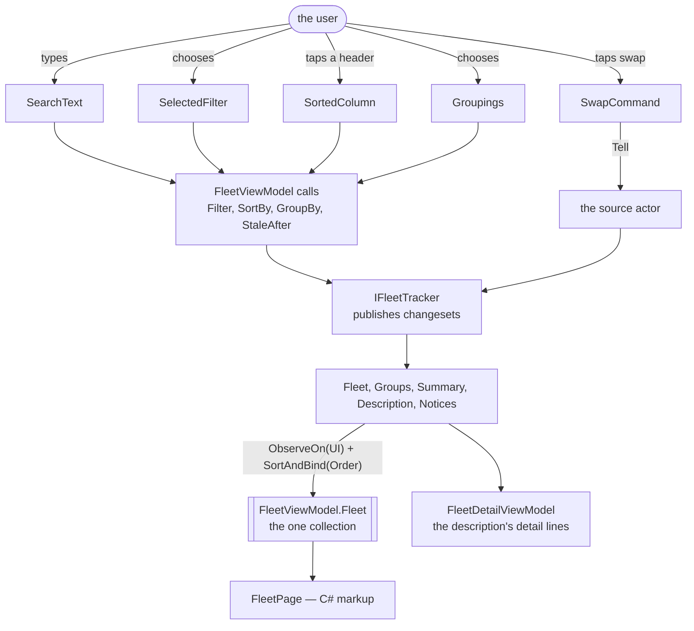
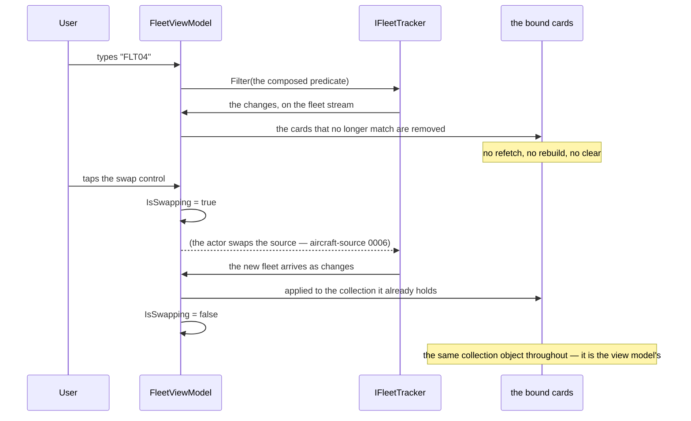
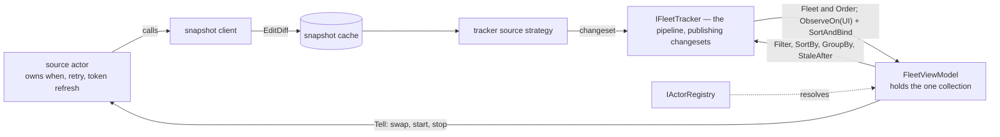

# Specification: Fleet dashboard

## 1. Business Goal

<!-- Rules: ../../../../../.spec/templates/feature.md § 1 -->

`fleet-pipeline` builds the collection; nothing looks at it. What the audience actually sees in a talk is a grid, and the demo's claim is made or lost on that screen: rows that update in place rather than flicker, a search box that re-filters without refetching, a column header that reorders without reloading, and a row that goes stale and stays. The repository today has the MAUI template — a `MainPage.xaml` with a dotnet bot and a click counter, bound to a demo view model that `Ask`s an actor and reads `.Result` on a continuation, which is the first thing `mvvm` § "Never add" forbids. So the surface the talk is delivered through is both absent and, where it exists, a worked example of the pattern this repository argues against. This Feature builds the dashboard: one page in C# markup, columns from the live source's description rather than from markup, every user input leaving as an observable or an actor message, and a detail pane that is the only place in the application allowed to ask which kind of vehicle it is holding. The failure state removed is a demo whose pipeline is correct and whose screen cannot show it.

## 2. User Needs

<!-- Rules: ../../../../../.spec/templates/feature.md § 2 -->

| #   | Persona                                                                                                                               | Need                                                                                                                            | Pain point today                                                                                                                                                                       |
| --- | ------------------------------------------------------------------------------------------------------------------------------------- | ------------------------------------------------------------------------------------------------------------------------------- | -------------------------------------------------------------------------------------------------------------------------------------------------------------------------------------- |
| 1   | Line-of-business .NET developer in the talk audience, whose data lives behind REST endpoints and SQL queries (README.md § "Audience") | To watch a grid update in place while a feed runs, and to read the one view model that makes it happen                          | The repository's only page is the template's counter; there is nothing to read and nothing to point at                                                                                 |
| 2   | The same developer, whose own view model holds the filtering, the sorting and a copy of the list                                      | A view model thin enough to read in one sitting — input in, observable or message out, projection back                          | `DemoViewModel` is the example they would copy, and it blocks on `.Result` inside a continuation                                                                                       |
| 3   | The same developer, whose grid's columns are compiled into the markup                                                                 | Columns, sorts and groupings that arrive from the source                                                                        | Nothing consumes the description `fleet-pipeline` B-020 supplies, so the swap it exists for is still unproven on screen                                                                |
| 4   | The presenter, demonstrating that a feed can stop                                                                                     | A row that is visibly marked when its aircraft goes quiet, and stays put                                                        | `fleet-pipeline` marks it; nothing shows the mark, and a mark nobody can see is indistinguishable from no mark                                                                         |
| 5   | The presenter, at the closing act (README.md § "Closing act")                                                                         | To swap planes for ships in front of people, with a busy indicator covering it and no visible rebuild                           | The swap is a registration today. Without a control and an indicator, the most load-bearing moment of the talk is a code change rather than a demonstration                            |
| 6   | Whoever maintains this repository after the talk                                                                                      | One page, one view model per surface, and the template's XAML gone rather than left as an apparent precedent                    | A `.xaml` file left from a template reads as the convention, and `maui-ui` has to say in words that it is not one                                                                      |
| 7   | The developer of need 1, and the presenter answering their questions                                                                  | To see what each aircraft is doing between polls — where it is over, how far it moved since the last one, and where it has been | A row shows a callsign, a country, a last contact and raw coordinates. Nothing says a position changed, so a live feed reads as a static table, and the grid is too dense to show more |
| 8   | The presenter, rehearsing with the dashboard open all day                                                                             | A screen readable for hours — dark, low in glare, with type that does not jitter as values tick                                 | The page carries the MAUI template's palette: a purple brand colour that means nothing and grey cells on white                                                                         |
| 9   | Anyone in the room with a colour-vision deficiency — roughly one man in twelve                                                        | Every status — fresh, stale, throttled, quiet — told apart without relying on colour                                            | Nothing says a status must be more than a colour, so the stale mark B-008 claims could ship as a tint some of the audience cannot see                                                  |

## 3. Acceptance Criteria

<!-- Rules: ../../../../../.spec/templates/feature.md § 3 -->

Forty claims, in eight groups: **B-001 – B-004** the surfaces and how they
are wired; **B-005 – B-008** the grid, including the stale mark; **B-009 –
B-012 and B-039** the user's input; **B-013 – B-015** the detail pane and the summary;
**B-016 – B-019, B-028 and B-040** the controls that tell an actor, and what a view
model may not hold; **B-020 – B-022** the swap test and the boundaries;
**B-023 – B-027** the arrival notice's two surfaces; **B-029 – B-038** the cards,
the trail map, and how a status is shown.

**B-029 – B-037 were added, and B-006 and B-008 amended, on 2026-10-08**, by
[decision 0002](decisions/0002-cards-and-a-trail-map-replace-the-grid.md): the
person replaced the grid's rows with cards, added a detail map of the path
flown, and asked for a dark theme readable all day and by a colour-blind viewer.
B-006 and B-008 say "card" where they said "row", and B-008's mark now names
B-032's rule; both rows in § 9 already read `Missing`, so the amendment
re-earns nothing. B-001,
B-005 and B-007 stand as written — cards are still one collection in a
`CollectionView`, with every cell from the description. Every value a card adds
is derived, and B-018 forbids this Feature deriving one, so each is claimed
upstream — `fleet-pipeline` B-032 – B-040 and `aircraft-source` B-054 and
B-055 — and these claims bind it. **§ 5 rows 3 and 5 moved with them**: the
map of one vehicle's trail and one dark theme are in scope; a fleet-wide map, a
light theme and a theme switch are not.

**B-017 and B-036 were amended, and B-038 added, the same day**, when the
person answered § 11 rows 7 and 8. B-017 now says an animation a view runs
toward a value already bound is not a timer — it fetches, derives and polls
nothing — so the next poll counts down (B-036) and a changed readout pulses
(B-038). The view model is no different: it still holds no timer. The delta a
readout shows comes from the description (`fleet-pipeline` B-042), so this
Feature formats nothing to show it.

**B-013 and B-022 were amended on 2026-10-09**, from the person's review of
`0038`. The pane had been the one surface allowed to name a subclass, and
`FleetDetailViewModel` used the allowance to switch on `Aircraft`, label its
own lines and convert metres to feet — logic the person found was neither thin
nor the view model's, and conversions `DisplayUnit` already owned. The lines
moved to the description (`fleet-pipeline` B-043), so B-013 reads them from
there and B-022 loses its exception: nothing in this Feature names a subclass
now, and ADR-0005 item 6 is amended to match.

**B-039 was added on 2026-10-08**, from the review of `fleet-pipeline` B-030,
which publishes the values the data holds for the filter control and had no
claim here to offer them. It is grouped with B-009 – B-012 because it is the
same control. The values are the pipeline's, taken before its filter, so a
choice is never withdrawn by choosing another; what this Feature adds is that
they are offered, and what becomes of a selection when the grouping changes.
A value the old key took means nothing under the new one, so it is cleared;
a curated choice and the search text mean the same under any grouping, so
they stay, which is B-011's rule applied to a third input.

B-028 was added on 2026-10-07, from spike
[`0040`](../../../../../.issue/0040-actor-wiring-and-tracker-lifetime-spike.yml):
the person asked that a button click cause an update, and nothing in the
repository let one — the first subscription starts the poll and the cadence does
the rest, so the only actor message the demo had was a swap performed once in the
closing act. It is grouped with B-016 because it is the same shape — a discrete
effect told to an actor, with an indicator over it — and the group's heading
widened rather than a group being invented for one claim.
[ADR-0012](../../../../../.spec/adr/0012-a-user-triggered-refresh-is-told-to-an-actor.md)
is why it is a message and not a fifth method on the tracker, and
`aircraft-source` B-053 is what performs the poll and refuses one inside the
cadence. **B-009 – B-012 did not move**: a chosen comparer is still a continuous
value, which is `mvvm` § "Two kinds of input, two routes" unamended.

B-023 – B-027 were added on 2026-10-05, when the person asked for a visible sign
that new data had arrived. `fleet-pipeline` B-025 – B-027 publish the signal;
these five decide what is shown, where, and how often. Two surfaces, because the
answer was both: a banner that always reflects the latest notice, and a toast
that interrupts only for something worth interrupting for.

B-008 is grouped with the grid because it is what a card shows, and delivered
by `0070` with the card, since 2026-10-08 — `0038` carried it while the surface
was a row, and nothing of `0038`'s was built against it. A group is about subject; an item is about
what has to exist first.

Claim ids are scoped to this specification
(`transponder-conventions` § "Claim ids are `B-00n`"). A claim of another
Feature is written with that Feature's name — `fleet-pipeline` B-020, not
B-020.

| ID    | Claim                                                                                                                                                                                                                                                                                                                                                                                                                                                                                                                                                             | Source                                                                                        |
| ----- | ----------------------------------------------------------------------------------------------------------------------------------------------------------------------------------------------------------------------------------------------------------------------------------------------------------------------------------------------------------------------------------------------------------------------------------------------------------------------------------------------------------------------------------------------------------------- | --------------------------------------------------------------------------------------------- |
| B-001 | The dashboard SHALL present one page carrying the fleet grid, the search and filter controls, the grouping selection, the summary and the detail pane.                                                                                                                                                                                                                                                                                                                                                                                                            | README.md § "UI features"                                                                     |
| B-002 | Every surface SHALL be built in C# markup through `CommunityToolkit.Maui.Markup`; no new `.xaml` SHALL be added, and the template's `MainPage.xaml`, its code-behind and `DemoViewModel` SHALL be removed rather than extended.                                                                                                                                                                                                                                                                                                                                   | maui-ui § "Stack and wiring"; § 2 need 6                                                      |
| B-003 | A page SHALL take its view model by constructor and SHALL NOT resolve one from a static or a service locator.                                                                                                                                                                                                                                                                                                                                                                                                                                                     | maui-ui § "Stack and wiring"; mvvm § "The shape"                                              |
| B-004 | Pages and view models SHALL be registered through the container's user-interface builder block, and SHALL NOT be registered ad hoc elsewhere in startup.                                                                                                                                                                                                                                                                                                                                                                                                          | maui-ui § "Stack and wiring"                                                                  |
| B-005 | The view model SHALL materialise the one collection the grid binds, from the fleet stream the tracker publishes, marshalling to the injected user-interface scheduler as it binds; it SHALL hold no second collection, SHALL copy no rows, and SHALL dispose that subscription with itself and nothing of the tracker's.                                                                                                                                                                                                                                          | `fleet-pipeline` B-002; mvvm § "Projecting state back"                                        |
| B-006 | A change to one vehicle SHALL update that card in place and SHALL NOT re-create the other cards.                                                                                                                                                                                                                                                                                                                                                                                                                                                                  | maui-ui § "The UI reads; it never drives"                                                     |
| B-007 | The grid's columns SHALL be built from the live source's description, and no column, header or cell SHALL be compiled into the markup.                                                                                                                                                                                                                                                                                                                                                                                                                            | `fleet-pipeline` B-020; maui-ui § "The swap test"                                             |
| B-008 | A card whose vehicle is stale SHALL carry a visible mark — an icon and a word as well as a colour (B-032) — and SHALL remain in the fleet in its place.                                                                                                                                                                                                                                                                                                                                                                                                           | `fleet-pipeline` B-016; § 2 need 4                                                            |
| B-009 | The search text and the filter selections SHALL be composed into one predicate handed to the tracker's `Filter`; no view model SHALL filter, enumerate or edit a collection itself.                                                                                                                                                                                                                                                                                                                                                                               | mvvm § "Two kinds of input, two routes"; `fleet-pipeline` B-006                               |
| B-010 | Search SHALL match case-insensitively, ignoring leading and trailing whitespace, against the vehicle's label and the cell every column of the description produces for it; empty text SHALL match every vehicle.                                                                                                                                                                                                                                                                                                                                                  | README.md § "UI features"; § 11 row 5                                                         |
| B-011 | A filter selection SHALL compose with the search text by conjunction, and clearing one SHALL NOT clear the other.                                                                                                                                                                                                                                                                                                                                                                                                                                                 | Decided call — a dropdown that silently resets a search reads as a bug                        |
| B-012 | Choosing a column SHALL hand that column's comparer from the description to the tracker, choosing it again SHALL hand the reverse, and choosing a grouping SHALL hand one of the description's groupings.                                                                                                                                                                                                                                                                                                                                                         | `fleet-pipeline` B-009 and B-012; README.md § "UI features"                                   |
| B-013 | Selecting a card SHALL show that vehicle in the detail pane, one line for each detail line the description names (`fleet-pipeline` B-043), each its name beside its cell; the pane SHALL name no concrete `TransportVehicle` subclass and convert no unit.                                                                                                                                                                                                                                                                                                        | ADR-0005 item 6; maui-ui § "The swap test"                                                    |
| B-014 | Clearing the selection SHALL empty the detail pane, and a selection SHALL NOT survive its vehicle leaving the collection.                                                                                                                                                                                                                                                                                                                                                                                                                                         | Decided call — a detail pane showing a vehicle the grid no longer has                         |
| B-015 | The summary SHALL bind what the tracker derives and SHALL NOT be recomputed in a view model or a view.                                                                                                                                                                                                                                                                                                                                                                                                                                                            | `fleet-pipeline` B-015; mvvm § "Does not belong in a view model"                              |
| B-016 | Swapping the live source SHALL be sent to an actor as a message rather than published as an observable value, and a busy indicator SHALL cover the swap until the new fleet arrives.                                                                                                                                                                                                                                                                                                                                                                              | mvvm § "Two kinds of input, two routes"; `aircraft-source` decision 0002                      |
| B-017 | No view or view model SHALL hold an `HttpClient`, a socket, a timer, a poll, a cache write, or a blocking call — no `.Result`, no `.Wait()`, no `GetAwaiter().GetResult()` — and an `Ask` SHALL carry an explicit timeout. An animation a view runs toward a value already bound — an instant, a changed cell — is not a timer under this claim, so long as it fetches, derives and polls nothing (amended 2026-10-08, § 11 row 7).                                                                                                                               | mvvm § "Never add"; maui-ui § "Never add"                                                     |
| B-018 | No view or view model SHALL derive staleness, filter, sort, group or expire anything; it SHALL supply the predicate, comparer or grouping the user chose and project what comes back.                                                                                                                                                                                                                                                                                                                                                                             | mvvm § "Thin means"; `fleet-pipeline` B-008                                                   |
| B-019 | A view model's display formatting SHALL be the only transformation it performs on a domain value, and a canonical unit SHALL be converted in an explicitly named member rather than inline in a binding.                                                                                                                                                                                                                                                                                                                                                          | ADR-0005 item 7; mapping                                                                      |
| B-020 | No view or view model SHALL name an API contract, an API type, a client, a cache, a snapshot, a strategy, a concrete `ITrackerSource` or the swap decorator; its dependencies SHALL be `IFleetTracker`, `ISchedulerProvider` and the actors.                                                                                                                                                                                                                                                                                                                      | `aircraft-source` B-041 and B-047; hot-swap-source                                            |
| B-021 | Swapping the live source SHALL require editing no view and no markup: the columns, comparers and groupings change because the description changed.                                                                                                                                                                                                                                                                                                                                                                                                                | maui-ui § "The swap test"; `fleet-pipeline` B-021                                             |
| B-022 | No cast, type test or `switch` on a concrete `TransportVehicle` subclass SHALL appear in this Feature, the detail pane included.                                                                                                                                                                                                                                                                                                                                                                                                                                  | ADR-0005 item 6; domain-model § "Never add"                                                   |
| B-023 | The page SHALL carry a banner showing the most recent notice — its instant, the vehicles tracked, and how many the changeset added, updated and removed — and SHALL NOT compute any of those numbers.                                                                                                                                                                                                                                                                                                                                                             | `fleet-pipeline` B-025; decided call 2026-10-05                                               |
| B-024 | The banner SHALL change only when a notice arrives, and SHALL NOT clear, reorder, re-create or obscure any row of the grid.                                                                                                                                                                                                                                                                                                                                                                                                                                       | `fleet-pipeline` B-025; maui-ui § "The UI reads; it never drives"                             |
| B-025 | A toast SHALL appear only for a notice worth interrupting for — a quiet notice, a resumed notice, and the swap completing — and SHALL NOT appear for an ordinary update, however long the toast's own interval is set.                                                                                                                                                                                                                                                                                                                                            | Decided call 2026-10-05; `fleet-pipeline` B-027                                               |
| B-026 | The banner's interval and the toast's interval SHALL be separate inputs on the page, each editable while the application runs, each published as an observable, defaulting to one second and one minute.                                                                                                                                                                                                                                                                                                                                                          | Decided call 2026-10-05; `fleet-pipeline` B-026 and § 4 row 10                                |
| B-027 | No view model SHALL name a toast, snackbar, alert or any other platform notification type; a view model SHALL publish notices and a view SHALL be what renders one.                                                                                                                                                                                                                                                                                                                                                                                               | mvvm § "Never add"; maui-ui § "Never add"                                                     |
| B-028 | The page SHALL carry a refresh control that `Tell`s an actor and SHALL NOT `Ask` one, call a client, or await anything; while a demanded poll is outstanding the control SHALL show it is working, and that indicator SHALL be driven by the gesture rather than by the fleet changing, since a poll returning identical data changes nothing.                                                                                                                                                                                                                    | ADR-0012; `aircraft-source` B-053 and decisions/0003; mvvm § "Two kinds of input, two routes" |
| B-029 | The fleet SHALL be shown as one card per vehicle, in columns whose count follows the page's width, and each card SHALL be built from the roles the description names (`fleet-pipeline` B-036); a role the description leaves empty SHALL be absent from the card, and no card SHALL be laid out around one source's fields.                                                                                                                                                                                                                                       | decisions/0002; B-007; B-021                                                                  |
| B-030 | A card SHALL show the distance its vehicle moved since the previous poll and since it was first seen, bound from the fleet element (`fleet-pipeline` B-032 and B-033), and SHALL show neither — not a zero — for a vehicle that carries none.                                                                                                                                                                                                                                                                                                                     | decisions/0002; § 2 need 7; B-018                                                             |
| B-031 | A card SHALL show how long before the observed instant its vehicle last reported; the age SHALL change when the observed instant advances (`fleet-pipeline` B-031) and never on a timer, and subtracting those two instants for display is the formatting B-019 permits — no other arithmetic over instants SHALL appear in a view model.                                                                                                                                                                                                                         | decisions/0002; B-017; B-019                                                                  |
| B-032 | Every status the page shows — fresh, updated, stale, without a position, quiet and throttled — SHALL be carried by an icon and a word as well as a colour, so none is read from colour alone.                                                                                                                                                                                                                                                                                                                                                                     | decisions/0002; § 2 need 9; WCAG 2.2 § 1.4.1                                                  |
| B-033 | The page SHALL use one dark theme drawn from one set of named colour tokens, with no colour written into a view as a literal; body text SHALL contrast with the surface beneath it at least 7:1, and every other label at least 4.5:1.                                                                                                                                                                                                                                                                                                                            | decisions/0002; § 2 need 8; WCAG 2.2 §§ 1.4.3 and 1.4.6                                       |
| B-034 | The detail pane SHALL draw the selected vehicle's trail on a map (`fleet-pipeline` B-034), coloured across the trail measure's range (`fleet-pipeline` B-037) by a sequential ramp that stays ordered under protan, deutan and tritan vision, broken where a point follows a gap (`fleet-pipeline` B-035), and SHALL follow the trail rather than redraw it from empty: a point added extends the line at its head, and a point the trail's bound drops (`fleet-pipeline` B-034) trims the line at its tail, so the line holds exactly the points the trail does. | decisions/0002; § 2 need 7; B-013                                                             |
| B-035 | The detail pane SHALL list the selected vehicle's trail newest first, each point with its last contact and its distance from the point before, bound from the trail and computing neither.                                                                                                                                                                                                                                                                                                                                                                        | decisions/0002; `fleet-pipeline` B-034; B-018                                                 |
| B-036 | The page SHALL show when the next poll is due and, while the provider refuses polls, that it is throttled and for how long, bound from the poll status the tracker publishes (`fleet-pipeline` B-040); it SHALL show neither for a source that does not poll, and SHALL count down to the due instant by a view animation toward the bound value, never by a timer in a view model (B-017).                                                                                                                                                                       | decisions/0002; B-017; § 11 row 7; ADR-0013                                                   |
| B-037 | The banner SHALL show two sets of added, updated and removed counts, each under its own label so neither reads as the other's subtotal: the latest notice's (B-023, `fleet-pipeline` B-025), counted after the filter, and the totals across the window of recent notices the tracker publishes (`fleet-pipeline` B-039), counted across every vehicle the source reports before it. It SHALL keep no list of notices of its own.                                                                                                                                 | decisions/0002; B-023; B-018                                                                  |
| B-038 | A readout whose cell changed in the last update SHALL show the change the description names for it (`fleet-pipeline` B-042) and SHALL pulse once, by a view animation (B-017); where the platform asks for reduced motion the change SHALL be shown and nothing SHALL move, and a vehicle just added SHALL show no change.                                                                                                                                                                                                                                        | decisions/0002; § 11 row 8; B-006; B-019                                                      |
| B-039 | The filter control SHALL offer, beside the description's choices (`fleet-pipeline` B-029), a choice for each value the tracker publishes for the current grouping key (`fleet-pipeline` B-030), adding and withdrawing each as the published changeset does, and SHALL enumerate no collection to find one. When the grouping key changes, a selection of a value the old key took SHALL be cleared; a selection of one of the description's choices and the search text SHALL NOT be.                                                                            | `fleet-pipeline` B-030; B-009; B-011; B-018                                                   |
| B-040 | The swap control SHALL be a picker offering one choice per target the swap actor answers (`aircraft-source` B-057), asked for once by an `Ask` carrying its timeout (B-017) and named as answered, and choosing one SHALL be the message B-016 sends, carrying the chosen target; until the actor answers, and if it does not answer in time, the picker SHALL offer no choice; a run that registered no recording SHALL offer no replay choice, and adding a source SHALL edit no view or markup (B-021).                                                        |

## 4. Constraints

<!-- Rules: ../../../../../.spec/templates/feature.md § 4 -->

| #   | Constraint                                                                                                                                                                                                                                                                                                                                                                                                                                                                                                                                                                                                                                                                                                                     | Source                                                            | Impact                                                                                                                                                                                                                                                                                                                                                                                                                                            |
| --- | ------------------------------------------------------------------------------------------------------------------------------------------------------------------------------------------------------------------------------------------------------------------------------------------------------------------------------------------------------------------------------------------------------------------------------------------------------------------------------------------------------------------------------------------------------------------------------------------------------------------------------------------------------------------------------------------------------------------------------ | ----------------------------------------------------------------- | ------------------------------------------------------------------------------------------------------------------------------------------------------------------------------------------------------------------------------------------------------------------------------------------------------------------------------------------------------------------------------------------------------------------------------------------------- |
| 1   | `fleet-pipeline` owns every operator. This Feature supplies inputs and binds outputs, and claims nothing about what the pipeline does with either.                                                                                                                                                                                                                                                                                                                                                                                                                                                                                                                                                                             | `fleet-pipeline` § 3; dynamic-data-pipeline                       | A behaviour that looks like a UI bug and is a pipeline rule — a filter not re-evaluating, a row vanishing — is reported against that Feature's claims, not fixed in a view.                                                                                                                                                                                                                                                                       |
| 2   | Three of `fleet-pipeline`'s open questions land here, and two change this Feature's surface: where the summary is exposed (its § 11 row 2), and whether a column carries a formatted cell or a canonical value plus a formatter (its § 11 row 3).                                                                                                                                                                                                                                                                                                                                                                                                                                                                              | `fleet-pipeline` § 11                                             | B-015 and B-019 are written against the recommendations: the summary on the tracker, and the column carrying a display-formatted cell. If either is answered the other way, both claims are amended before `0036` starts. § 11 row 1 carries this.                                                                                                                                                                                                |
| 3   | MAUI's shipped grid is `CollectionView`; this repository has no third-party grid and does not add one.                                                                                                                                                                                                                                                                                                                                                                                                                                                                                                                                                                                                                         | `Directory.Packages.props`; maui-ui                               | "Columns" are a template the description drives rather than a grid feature, and B-006's in-place update is `CollectionView`'s behaviour given a changeset-bound collection — not something a converter can rescue.                                                                                                                                                                                                                                |
| 4   | The MAUI heads do not build on Linux CI, so no test here may need one.                                                                                                                                                                                                                                                                                                                                                                                                                                                                                                                                                                                                                                                         | [item 0018](../../../../../.issue/0018-linux-ci-build-scope.yml)  | Every claim that can be proven must be provable by a view-model test, a test of the design tokens as data, or a test that builds a page and never draws it ([ADR-0014](../../../../../.spec/adr/0014-a-view-is-built-and-asserted-without-a-platform.md)). What is left — what a platform draws, a page's registration, what a view may name — is an analyzer rule or a review, never a UI test runner, a device test or a screenshot comparison. |
| 5   | View models live beside the actors they talk to, under `src/Transponder/Features/`, and the pages live in `src/Gui`.                                                                                                                                                                                                                                                                                                                                                                                                                                                                                                                                                                                                           | `transponder-conventions` § "Project structure"                   | The split is why a view-model test needs no MAUI head: nothing in `src/Transponder` references a page. A view model that would need one has reached for something `maui-ui` keeps in the view.                                                                                                                                                                                                                                                    |
| 6   | The swap is already specified: `aircraft-source` `0006` owns the decorator and the disposal, and its decision 0002 chose the busy indicator over a frozen grid.                                                                                                                                                                                                                                                                                                                                                                                                                                                                                                                                                                | `aircraft-source` `0006`, decisions/0002                          | B-016 claims the control and the indicator only. The actor that performs the swap, and what it disposes, are that item's.                                                                                                                                                                                                                                                                                                                         |
| 7   | `DemoViewModel` and `MainPage.xaml` are the template's, and `MauiProgram` registers both.                                                                                                                                                                                                                                                                                                                                                                                                                                                                                                                                                                                                                                      | `src/Gui/MauiProgram.cs`, `src/Gui/MainPage.xaml`                 | B-002 removes all three registrations rather than leaving a second page nobody opens. The removal is this Feature's because it is the thing that replaces them.                                                                                                                                                                                                                                                                                   |
| 9   | A toast needs `CommunityToolkit.Maui`, not the `.Markup` package this repository has. `Toast` and `Snackbar` live in the full toolkit and need `UseMauiCommunityToolkit()` beside the existing `UseMauiCommunityToolkitMarkup()`.                                                                                                                                                                                                                                                                                                                                                                                                                                                                                              | `Directory.Packages.props`; `src/Gui/MauiProgram.cs`              | `0041` adds one central package version and one builder call. It is not the only package this Feature adds: `0036` added `ReactiveMarbles.ObservableEvents.SourceGenerator`, a generator with no runtime assembly, so the page can subscribe without a handler it never removes. The banner needs nothing, which is why B-023 is deliverable even if the toolkit addition is refused.                                                             |
| 10  | A toast is a platform alert: drawn by the operating system, outside the page's visual tree, and this repository runs no UI test runner (row 4).                                                                                                                                                                                                                                                                                                                                                                                                                                                                                                                                                                                | maui-ui; row 4                                                    | B-025's § 9 row is a **review**, not a test. A view-model test still proves which notices are offered for interruption and which are not, so that half is asserted and the rendering half is read.                                                                                                                                                                                                                                                |
| 11  | The two surfaces pace independently, and both intervals are edited on stage.                                                                                                                                                                                                                                                                                                                                                                                                                                                                                                                                                                                                                                                   | Decided call 2026-10-05 (the person); `fleet-pipeline` § 4 row 10 | B-026 is two inputs and two observables, not one setting. `fleet-pipeline` B-026 takes the interval per subscription, so this Feature subscribes twice and paces each — no throttling is implemented here, which keeps that operator tested in one place.                                                                                                                                                                                         |
| 8   | **The architecture review is answered (2026-10-05), and it moved this Feature's seams.** [ADR-0009](../../../../../.spec/adr/0009-the-pipeline-publishes-changesets-a-consumer-binds.md): the pipeline publishes changeset streams and owns no bound collection, so **this Feature's view model calls `ObserveOn(UserInterfaceThread)` and `Bind`**, holds the resulting collection, and disposes that subscription with itself. `IFleetQuery` is deleted — the four inputs are methods on the tracker (`Filter`, `SortBy`, `GroupBy`, `StaleAfter`), which this Feature's view models call with the value the user chose; the tracker owns the subject behind each and its default. `TrackedVehicle` stays the bound element. | ADR-0009; `fleet-pipeline` § 11 row 4                             | B-005, B-009 and B-012 are amended for it, and § 7's member table, prose and diagrams are rewritten. The rate cap stays in the pipeline, so B-026 and B-027 are unchanged.                                                                                                                                                                                                                                                                        |
| 12  | The map is drawn by `Microsoft.Maui.Controls.Maps`, which `Directory.Packages.props` does not reference, and whose renderer is each platform's own.                                                                                                                                                                                                                                                                                                                                                                                                                                                                                                                                                                            | `Directory.Packages.props`; maui-ui                               | The item that builds B-034 adds one central package version and one builder call, as `0041` does for the toolkit. Which heads draw a map is read when that item is taken rather than assumed here; a head that draws none still has B-035's list of the same trail.                                                                                                                                                                               |
| 13  | A map, a theme and an icon are drawn, and this repository runs no UI test runner (row 4).                                                                                                                                                                                                                                                                                                                                                                                                                                                                                                                                                                                                                                      | row 4; row 10                                                     | The rendering halves of B-032, B-033 and B-034 are reviews, as B-025's toast is. What a view model hands the view — a status's word and icon, a token, a trail with its gaps — is still asserted by a view-model test; what the view binds it to — a word and an icon beside every colour, a colour read from a token — by a built, undrawn page (ADR-0014); and contrast and colour-vision distinctness by a test over the token values.         |
| 14  | B-017 forbids a timer in a view or a view model, and since 2026-10-08 lets a view animate toward a value already bound.                                                                                                                                                                                                                                                                                                                                                                                                                                                                                                                                                                                                        | B-017; mvvm § "Never add"                                         | B-031's age still moves only when the observed instant arrives. B-036's countdown and B-038's pulse are view animations: a view-model test asserts the instant and the change they animate toward, and the motion itself is a review (row 13). Reduced motion is read from the platform, never from a setting this Feature adds.                                                                                                                  |

## 5. Out of Scope

<!-- Rules: ../../../../../.spec/templates/feature.md § 5 -->

| #   | Item                                                                                               | Exclusion reason                                                                                                                                                                                                                                                                                               |
| --- | -------------------------------------------------------------------------------------------------- | -------------------------------------------------------------------------------------------------------------------------------------------------------------------------------------------------------------------------------------------------------------------------------------------------------------- |
| 1   | Every pipeline operator, and staleness itself                                                      | `fleet-pipeline` owns them (§ 4 row 1). This Feature shows the mark; it does not decide who is stale.                                                                                                                                                                                                          |
| 2   | The swap decorator, the disposal of an outgoing source, and the actor that swaps                   | `aircraft-source` `0006` (§ 4 row 6). B-016 is the control and the indicator.                                                                                                                                                                                                                                  |
| 3   | A map of the whole fleet                                                                           | Decision 0002 brings in the detail pane's map of one vehicle's trail (B-034). A map of every vehicle at once is a second surface over the same collection, and the cards already say where each one is (B-029).                                                                                                |
| 4   | A settings surface for the staleness threshold, the polling interval or credentials                | `fleet-pipeline` B-017 makes the threshold configurable and the provider's options are `aircraft-source`'s; a screen to edit either is a feature nobody asked for.                                                                                                                                             |
| 5   | A light theme, a theme switch, platform-specific styling, and accessibility beyond B-032 and B-033 | Decision 0002 brings in one dark theme (B-033) and status told apart without colour (B-032). A second palette is a second set of contrast and colour-vision checks for a demo run on one machine, and no need in § 2 asks for screen-reader labels or dynamic type.                                            |
| 6   | Desktop and mobile layout variants                                                                 | The talk is delivered from one screen. One layout, and the heads that do not build on Linux CI stay out of the test story (§ 4 row 4).                                                                                                                                                                         |
| 7   | A UI test runner, and snapshot or screenshot tests                                                 | § 4 row 4. The view-model test is the whole of this Feature's executing coverage, which is also the argument for keeping the views empty.                                                                                                                                                                      |
| 8   | An on-the-ground status on the card                                                                | Dropped by the person on 2026-10-09. A card reads only the description's roles (B-029) and only the detail pane names a subclass (B-022), and no `fleet-pipeline` claim publishes a ground status for a card to read. The detail pane still shows the field, through the description (`fleet-pipeline` B-043). |

## 6. Concern Separation

<!-- Rules: ../../../../../.spec/templates/feature.md § 6 -->

| Item                                                        | Classification | Notes                                                                                                                                                                         |
| ----------------------------------------------------------- | -------------- | ----------------------------------------------------------------------------------------------------------------------------------------------------------------------------- |
| One page carrying cards, filters, grouping, summary, detail | Business       | README.md § "UI features" lists the surfaces; § 2 need 1 is why they are on one screen rather than behind navigation.                                                         |
| C# markup, and the template's XAML removed                  | Technical      | `maui-ui` § "Stack and wiring", plus § 2 need 6: a left-behind `.xaml` reads as the convention. No business statement depends on it.                                          |
| Search and filter semantics                                 | Business       | B-010 and B-011 are what a user expects of a search box — case-insensitive, trimmed, empty means everything, and a dropdown that does not clear the search.                   |
| Composing input into one predicate rather than filtering    | Technical      | The user-visible result is identical either way; which side of the seam does the work is `mvvm`'s rule and the reason the view model stays readable.                          |
| The detail pane reads the description's detail lines        | Both           | Business: § 2 need 1 — the pane is where an aircraft's own fields are worth showing. Technical: the description names them (`fleet-pipeline` B-043), so no surface downcasts. |
| The swap control and its busy indicator                     | Both           | Business: § 2 need 5, the closing act is performed in front of people. Technical: `Tell` rather than an observable, because a swap is an effect and an actor owns failure.    |
| What a view model may not hold                              | Technical      | B-017 – B-020 constrain the code. The business reason is indirect and real: § 2 need 2 is a developer copying this view model into their own application.                     |

## 7. Technical Design

<!-- Rules: ../../../../../.spec/templates/feature.md § 7 -->

One page, five view models, and no logic in the markup. `FleetViewModel` owns
the cards' collection, the inputs and the selection; `FleetDetailViewModel` owns
the pane and the trail; `FleetSummaryViewModel` projects the tracker's counts;
`FleetBannerViewModel` the notices; `FleetPollViewModel` the poll status. Each
derives `RxObject` and uses the `field`-keyword property form (`mvvm` § "The
shape"). The page has shown cards since `0070` (B-029); no grid, header or
item template is left.

`FleetViewModel` drives the pipeline through the four methods the tracker
exposes — `Filter`, `SortBy`, `GroupBy` and `StaleAfter` — because the four
things the pipeline reacts to are four things the user changes. It implements no
interface to do it and constructs no observable for it: `IFleetQuery` was deleted
by the § 11 row 4 review, and the tracker owns the subject behind each method and
the default it starts at (`fleet-pipeline` § 7, ADR-0009). So a keystroke is a
property setter composing a predicate and one call; the pipeline still never
names the view model.

**The matching rule is a static of its own, `FleetSearch`, not a method on the
view model.** It takes the text and the description's columns and returns the
predicate: trimmed, case-insensitive, matched against the vehicle's label and
every cell those columns produce, with empty text returning a predicate that
admits everything (B-010). Composition with the dropdown's choice is a second
function on the same type, and it is a conjunction of two predicates rather than
a flag either side can clear (B-011). Two reasons it sits outside the view model.
A function of its arguments is tested by calling it, which is why § 9 names
`FleetSearchTests` for B-010 and B-011 and `FleetViewModelTests` only for what
reaches the tracker. And "empty means everything" is the clause a later edit
breaks silently, so it belongs somewhere a test can hold it still.

Both predicates read `TransportVehicle` members and the description's own
selectors, so neither names a concrete vehicle — the exception
`fleet-pipeline` B-022 granted belongs to a source's description, and nothing
here needs it (B-022).

That keeps `mvvm` § "Two kinds of input, two routes" intact where it matters: a
continuous value still goes to the pipeline and a discrete effect still goes to
an actor as a `Tell`. What changed is the carrier for the continuous half — a
method call rather than an observable this Feature publishes — and the view model
is thinner for it, since it no longer owns four subjects whose defaults it had to
remember.

**This Feature owns every `Bind` in the application.** The tracker publishes
`IObservable<IChangeSet<…>>` and, beside it, `Order` — the comparer it
currently holds, adapted to the published element. A view model marshals to
`ISchedulerProvider.UserInterfaceThread`, calls DynamicData 9's `SortAndBind`
with that comparer stream, and disposes that one subscription with itself
(`mvvm` § "Projecting state back", `fleet-pipeline` § 7). The sort crosses the
seam as a value because a sorted changeset does not survive the transform that
derives the stale mark, so sorting where the rows are bound is the only place
it shows (ADR-0009 decision 2, amended 2026-10-06). Two consequences
worth stating: a disposal bug here freezes one view's rows rather than stopping
the fleet, and the cards' collection is this view model's for its lifetime — the
object is not replaced by a source swap (B-005, B-006).

**Domain model**

No domain type is added or changed. The types below are view state.

| Field                                    | Type                                              | Notes                                                                                                                                                                                                                                                                                                                                                                                                                                   |
| ---------------------------------------- | ------------------------------------------------- | --------------------------------------------------------------------------------------------------------------------------------------------------------------------------------------------------------------------------------------------------------------------------------------------------------------------------------------------------------------------------------------------------------------------------------------- |
| `FleetViewModel.Fleet`                   | `ReadOnlyObservableCollection<TrackedVehicle>`    | **The one collection, materialised here.** `_tracker.Fleet.ObserveOn(schedulers.UserInterfaceThread).SortAndBind(out field, _tracker.Order).Subscribe()` in the constructor, disposed with the view model. The tracker publishes a stream and owns no collection (ADR-0009), so this is where it becomes one — and the only place (B-005).                                                                                              |
| `FleetViewModel.SearchText`              | `string`                                          | `RaiseAndSetIfChanged`; published into the predicate (B-009).                                                                                                                                                                                                                                                                                                                                                                           |
| `FleetViewModel.Filters`                 | `IReadOnlyList<FleetFilterChoice>`                | What the dropdown offers, published by the description (`fleet-pipeline` B-029). Not composed here: a choice this view model invented would be one a swap could not replace (§ 11 row 5). `0078` replaces it with `Choices`, below.                                                                                                                                                                                                     |
| `FleetViewModel.SelectedFilter`          | `Option<FleetFilterChoice>`                       | Absent means no dropdown constraint, which is a value rather than a null (B-011).                                                                                                                                                                                                                                                                                                                                                       |
| `FleetViewModel.Columns`                 | `IReadOnlyList<FleetColumn>`                      | From the description, in its order (B-007).                                                                                                                                                                                                                                                                                                                                                                                             |
| `FleetViewModel.SortedColumn`            | `Option<(FleetColumn Column, bool Descending)>`   | Which column orders the cards, and in which direction (B-012).                                                                                                                                                                                                                                                                                                                                                                          |
| `FleetViewModel.Groupings`               | `IReadOnlyList<FleetGrouping>`                    | From the description.                                                                                                                                                                                                                                                                                                                                                                                                                   |
| `FleetViewModel.SelectedGrouping`        | `Option<FleetGrouping>`                           | Which grouping the chooser has; setting it calls `GroupBy` with one of `Groupings` (B-012). Absent leaves the tracker on the default it seeded itself with, which is the vehicle's own answer.                                                                                                                                                                                                                                          |
| `FleetViewModel.Selected`                | `TrackedVehicle?`                                 | The element whose card is selected, null for none. A binding target, so a plain reference rather than an `Option` (`language-ext-usage` § "Where it stops"). Its setter sets it and nothing else; the pane observes it through `WhenChanged` (B-013). A newer reading moves it onto the new instance and the vehicle leaving the collection clears it (B-014).                                                                          |
| `FleetViewModel.Detail`                  | `FleetDetailViewModel`                            | Built by `FleetViewModel` from `WhenChanged(Selected)` and the tracker's `Description`, and disposed with it: its inputs are this view model's selection and the description, so a second owner could only disagree.                                                                                                                                                                                                                    |
| `FleetViewModel.IsSwapping`              | `bool`                                            | Drives the busy indicator (B-016).                                                                                                                                                                                                                                                                                                                                                                                                      |
| `FleetViewModel.SwapCommand`             | `ICommand`                                        | Tells the swap actor `SwapSource` carrying `SelectedTarget`; never `Ask`s for the swap (B-016, B-040). The one `Ask` is for the targets, below.                                                                                                                                                                                                                                                                                         |
| `FleetViewModel.RefreshCommand`          | `RxCommand<Unit, Unit>`                           | An `RxCommand`, which is also the stream of its own presses, that tells the actor a poll is wanted; never `Ask`s it and never waits (B-028, B-017). Typed as the command rather than as `ICommand`, which it implements for the binding, because the indicator is read from it. The actor decides whether to perform one — the throttle is `aircraft-source` B-053's, not a rule this view model repeats.                               |
| `FleetViewModel.IsRefreshing`            | `bool`                                            | Drives the refresh indicator (B-028). Set by the gesture, cleared by the next observed instant — `fleet-pipeline` B-031, one per applied poll including a poll whose data was identical — with a three-second cap for the press that was refused and produced no poll at all (decisions/0001). A **derived value**, not a field the view model sets: the gesture, the instant and the cap are one stream read through `AsValue`, below. |
| `FleetDetailViewModel(...)`              | constructor                                       | `IObservable<Option<TrackedVehicle>>` selected, `IObservable<FleetSourceDescription>`, `ISchedulerProvider`. Every property is derived from the two streams through `AsValue`; none is assigned (B-014).                                                                                                                                                                                                                                |
| `FleetDetailViewModel.Rows`              | `IReadOnlyList<FleetDetailRow>`                   | One `FleetDetailRow(Name, Value(vehicle))` per line of the description's `Detail`, in its order (B-013). Names no subclass and converts nothing; the cell arrives formatted (B-019). A record of `Label` and `Value` rather than a tuple, because a binding reads properties.                                                                                                                                                           |
| `FleetDetailViewModel.IsEmpty`, `.Title` | `bool`, `string`                                  | The prompt's visibility and the pane's heading, derived from the selection (B-014).                                                                                                                                                                                                                                                                                                                                                     |
| `FleetViewModel.Choices`                 | `ReadOnlyObservableCollection<FleetFilterChoice>` | `0078`: the description's choices, then one per value the grouping key takes (`fleet-pipeline` B-030), bound in arrival order, never sorted or enumerated (B-018, B-039). See "The data's values as filter choices".                                                                                                                                                                                                                    |
| `FleetDetailViewModel.Element`           | `TrackedVehicle?`                                 | `0071`: the selected element itself, which the map binds. Today the pane maps the selection to `.Vehicle` at once and drops the element, which is where the trail is (`fleet-pipeline` B-034), so `0071` keeps the element and derives `Title` and `Rows` from its `Vehicle`.                                                                                                                                                           |
| `FleetDetailViewModel.Measure`           | `FleetTrailMeasure`                               | `0071`: the description's trail measure (`fleet-pipeline` B-037), which the map's ramp spans and its legend names.                                                                                                                                                                                                                                                                                                                      |
| `FleetDetailViewModel.Trail`             | `IReadOnlyList<FleetTrailRow>`                    | `0071`: the trail newest first, one `FleetTrailRow(Contact, Distance)` per point, each text formatted by `FleetCardText` and nothing computed (B-035).                                                                                                                                                                                                                                                                                  |
| `FleetSummaryViewModel.Tracked`          | `int`                                             | Projected from the tracker's summary; not recomputed (B-015).                                                                                                                                                                                                                                                                                                                                                                           |
| `FleetSummaryViewModel.Stale`            | `int`                                             | Same.                                                                                                                                                                                                                                                                                                                                                                                                                                   |
| `FleetSummaryViewModel.Groups`           | `int`                                             | Same.                                                                                                                                                                                                                                                                                                                                                                                                                                   |
| `FleetBannerViewModel.Latest`            | `Option<FleetNotice>`                             | The most recent notice at the banner's cadence; absent until the first arrives (B-023).                                                                                                                                                                                                                                                                                                                                                 |
| `FleetBannerViewModel.BannerInterval`    | `TimeSpan`                                        | Edited on the page, published as an observable into `IFleetTracker.Notices` (B-026). One second by default.                                                                                                                                                                                                                                                                                                                             |
| `FleetBannerViewModel.ToastInterval`     | `TimeSpan`                                        | The second subscription's cadence, edited separately (B-026). One minute by default.                                                                                                                                                                                                                                                                                                                                                    |
| `FleetBannerViewModel.Interrupting`      | `IObservable<FleetNotice>`                        | The notices worth interrupting for — quiet, resumed, and the swap completing — which the **page** turns into a toast (B-025, B-027).                                                                                                                                                                                                                                                                                                    |

| `FleetBannerViewModel.Window` | `FleetNoticeWindow` | `0041`: the window of recent changes and its totals, read from `IFleetTracker.Recent` through `AsValue` (`fleet-pipeline` B-039); empty until the first change. Sums nothing (B-037). |
| `FleetPollViewModel.NextDue` | `DateTimeOffset?` | `0072`: the instant the next poll is due, null for a source that does not poll (B-036). A value, not a remaining time: subtracting it from `Observed` is the view's call to `FleetCardText`, as a card's age is (B-031). |
| `FleetPollViewModel.RefusedFor` | `TimeSpan?` | `0072`: the interval the provider asked for while it refuses, null otherwise (B-036, `aircraft-source` B-055). |
| `FleetPollViewModel.IsPolling` | `bool` | `0072`: false while the status is `PollStatus.None`, which hides the countdown and the throttled badge together (B-036). |

| `FleetViewModel.Targets` | `IReadOnlyList<SwapTarget>` | `0039`: what the swap actor answered to `GetSwapTargets`, in registration order; empty until it answers and if it does not (B-040). |
| `FleetViewModel.SelectedTarget` | `SwapTarget?` | `0039`: the picker's choice, bound two-way; starts on the first target, which `replay-source` B-028 makes the live source. |

**Diagrams**





**The refresh indicator is a derived value, not a flag the gesture sets.** An
input is state the user sets and the view model remembers; the indicator is state
the domain decides, so a property with a setter would be a second place its value
lives. The press is the command and the command is the stream of its own
executions, so the view model keeps no subject to watch its own gesture.

What the indicator owes, which is this section's to state and
[`FleetViewModel`](../ViewModels/FleetViewModel.cs) to carry:

- The press raises it, and the **next observed instant** lowers it — one per
  applied poll, identical data included (`fleet-pipeline` B-031). The instant in
  force at subscription is not one of those (`fleet-pipeline` § 10, 2026-10-07).
- A press the actor refused produces no poll and no instant, so a cap of
  `ClearsAfter` — three seconds, decisions/0001 — lowers it instead. Whichever
  comes first ends the window.
- A second press **replaces** the window rather than queueing one, so an
  indicator is never owned by a poll that never happened.
- `ClearsAfter` is this Feature's constant, never read from `OpenSkyOptions`: the
  cap is a presentation choice, and the throttle it looks like is
  `aircraft-source` B-053's, measured where this type cannot see.
- Every scheduler is the injected one, the command's output included, so a test
  advances the cap rather than waiting it out and nothing reads ReactiveMarbles'
  process-wide locator (B-005; the composition root is what writes that locator).

What `tracker.Observed` is, and why it is on the tracker rather than
`IObservedClockTicks` taken directly: `fleet-pipeline` B-031 and decisions/0001.
A view model depends on `IFleetTracker` and nothing below it
(`aircraft-source` B-041), and `0039`'s own test reads a container-built view
model's dependencies to say so.

**The swap picker (B-040), designed for `0039`**

`aircraft-source` § 7 designed the actor's half: `SourceSwapActor` answers
`GetSwapTargets` with `SwapTargets`, a list of `SwapTarget` — a name and an
opaque handle — and `SwapSource` carries one. This is the view model's half.

- **Asked once, at construction, with its timeout.** `FleetViewModel` resolves
  the swap actor from `IActorRegistry`, the way the refresh resolves its
  actor (B-028), and reads
  `Observable.FromAsync(token => actor.Ask<SwapTargets>(GetSwapTargets.Instance,
TargetsWithin, token))` through `AsValue` into `Targets`, starting empty.
  Registration is fixed for a run, so the list is asked for once and never
  subscribed to. `TargetsWithin` is this Feature's constant, two seconds: the
  actor answers from what registration recorded and does no I/O, so two
  seconds is a generous margin. Like `ClearsAfter`, the number is chosen by
  feel and checked by the first rehearsal (B-017).
- **No answer is an empty picker, not an error.** A timeout or a failure
  leaves `Targets` empty and the picker disabled. Nothing retries, because a
  list that did not arrive in two seconds from memory is a wiring fault that a
  rehearsal sees. The dashboard still runs on the source registration made
  live. The disposal of the view model cancels an `Ask` still outstanding.
- **Choosing is `Tell`.** `SwapCommand` tells `SwapSource(SelectedTarget)`.
  `IsSwapping` covers it until the new fleet arrives (B-016). No view model
  names a strategy or a strategy type, only the handle the actor gave it
  (B-020).
- **The page builds one picker over `Targets`, showing each target's `Name`.**
  A new source adds a target, not markup (B-021).

**The card (B-029 – B-033, B-038), as `0069`, `0070` and `0073` built it**

Every decision a card shows is made in `Transponder` by a static the head
calls, so it is tested without a view; the head in `src/Gui` decides only how
it looks. `Transponder.csproj` references no MAUI package, and nothing below
changes that.

- **`AircraftCard`** (`src/Gui/Components/`) is a `ContentView` with three
  bindable properties: `Vehicle`, the element; `Card`, the description's roles;
  and `Observed`, the tracker's instant. The page binds the first per item and
  the other two from `FleetViewModel` (B-029). The title, subtitle and place
  are the roles' cells; each readout is a `Readout`; the leg and the total
  flown are two more readouts, bound from the element's `Leg` and `Travelled`
  and formatted by `FleetCardText.Distance`, which writes `—` and never `0.0
km` for none (B-030). The age is `FleetCardText.Age(Observed,
LastContact)`, run when `Observed` or the element changes and on no timer
  (B-031). Selection is a visual state the card reads, not a property the page
  sets.
- **`FleetCardStatus.Of(card, element)`** returns a `FleetCardMark` — stale,
  no fix, updated or fresh, the first that holds — read off the element so a
  recycled card shows its new vehicle's status at once. **`StatusBadge`** maps
  a `StatusKind` to an ink, a soft fill, a glyph and a word, and sets the word
  as its semantic description, so no status is colour alone (B-032). Stale
  also draws an edge on the card.
- **`FlightDeck`** (`src/Gui/Theme/`) holds every colour as a named token —
  surfaces, inks, accent, and an ink and soft fill per status — and
  `FlightDeckStyles` the text styles. No view writes a colour literal; the
  contrast each pair reaches is the B-033 review in § 9 (B-033).
- **`FleetCardMotion.Pulses(readout, shown, element)`** decides a pulse: a
  newer reading of the vehicle the card already showed, on a readout whose
  `Change` is some. A first bind, a recycled card, a stale re-publish and a
  vehicle just added move nothing (B-038). `Readout.Pulse()` animates once and
  returns before animating when **`Motion.IsReduced()`** — the head's read of
  the platform's Reduce Motion, taken each time so a change in Settings
  applies to the next pulse. `Change` is set whether or not it pulses, so
  reduced motion removes the movement and never the text.

**The trail map and list (B-034, B-035), designed for `0071`**

- **The map is `Microsoft.Maui.Controls.Maps`, referenced by `src/Gui` alone.**
  Its version goes in `Directory.Packages.props`, `Gui.csproj` references it,
  and `MauiProgram` calls `UseMauiMaps()`. It renders through MapKit on the
  two targets the head builds, iOS and Mac Catalyst. `Transponder` neither
  references it nor names a `Location`: a trail point carries the domain's
  `GeoPosition`, and the head converts.
- **A segment per pair of points, decided in `Transponder`.** A static
  `FleetTrailLine` in `Features/Fleet/` turns a trail and its measure into
  `FleetTrailSegment(From, To, Shade)` values: one between each point and the
  point before it, except where the point follows a gap, which starts a new
  run and is joined to nothing behind it (`fleet-pipeline` B-035). `Shade` is
  the later point's measure placed in the measure's range as a fraction from
  0 to 1, clamped; none when the point carries no measure.
- **Following, not redrawing.** `FleetTrailLine.Follow(previous, current)`
  returns how many segments leave the tail and which join the head. The trail
  is an `ImmutableList` that shares structure from one element to the next, so
  `current`'s first point is found in `previous` by reference: every point
  before it has been dropped by the bound, and every point after `previous`'s
  last is new (`fleet-pipeline` B-034). Where `current`'s first point is not in
  `previous` at all — another vehicle selected, or this one re-entered — it
  answers redraw, which is a different trail and not a redraw of this one.
  Being a function of two lists, it is tested by calling it, and the 240-point
  scenario is its test.
- **`TrailMap`** (`src/Gui/Components/`) is a `ContentView` over a `Map` with
  two bindable properties, `Element` and `Measure`. On a new element it calls
  `Follow`, removes that many `Polyline`s from the front of `MapElements`, and
  appends one per added segment, so the map holds exactly the trail's points.
  Each `Polyline`'s stroke is `FlightDeck.Ramp` at its shade, or `InkMuted`
  for none. It moves the visible region on a new selection only, never per
  point, so the map does not jump on each poll.
- **`FlightDeck.Ramp`** is a sequential ramp of eight stops sampled from
  cividis, from a mid blue to a light yellow — lightness rises along it under
  protan, deutan and tritan vision, which is what keeps it ordered (B-034) —
  starting above cividis's darkest so the low end still reads on the map's dark
  style. A legend under the map names the measure and its range.
- **The list** binds `FleetDetailViewModel.Trail` in a `BindableLayout` under
  the map: the contact as a clock time and the distance from the point before
  (B-035).

**The next poll (B-036), designed for `0072`**

`FleetPollViewModel` takes `IFleetTracker` and the schedulers, and reads
`PollStatus` (`fleet-pipeline` B-040) through `AsValue`, so it starts with the
status in force. It holds no timer, reads no clock, and does no arithmetic over
instants (B-031).

- **A source that does not poll shows nothing.** `PollStatus.None` gives
  `IsPolling` false, and the page hides the countdown and the throttled badge
  together, so replay shows neither (B-036).
- **The countdown is the view's animation.** A `PollCountdown` view in
  `src/Gui/Components/` binds `NextDue` and `FleetViewModel.Observed`. On each
  new due instant it asks `FleetCardText.DueIn(nextDue, observed)` for the time
  remaining — the same static, and the same formatting B-031 permits, that a
  card's age is — then aborts its running animation and starts one of that
  length: a bar emptying and the
  seconds counting down toward zero. The view model publishes one value per
  status, never a tick (B-017). With `Motion.IsReduced()` it shows the due time
  as still text and moves nothing, as a readout does (B-038).
- **Throttled** is a `StatusBadge` of `StatusKind.Throttled` beside the
  countdown, with the refusal's seconds as its text, shown while `RefusedFor`
  has a value (B-032, B-036).

**The banner's two counts (B-037), designed for `0041`**

`FleetBannerViewModel` gains `Window`, read from `IFleetTracker.Recent`
(`fleet-pipeline` B-039), beside `Latest`. The page lays the banner out as two
labelled groups. One is headed **Latest update**, with `Latest`'s added,
updated and removed counts, counted after the filter. The other is headed
**Last 20 updates · whole fleet**, with `Window`'s totals, counted before it.
The headings are the page's text, so neither group reads as the other's
subtotal (B-037). The view model keeps no list and sums nothing; the stage did
both.

**The data's values as filter choices (B-039), designed for `0078`**

- **One bound collection, two sources.** The description's choices become a
  changeset keyed `choice:` plus each name. `IFleetTracker.GroupingValues`
  (`fleet-pipeline` B-030) already publishes one `FleetFilterChoice` per value,
  and the only change made to it here is its key, re-keyed to `value:` plus the
  value so it cannot collide with a description's choice. The two are joined with DynamicData's
  `Or`, then `ObserveOn(UI)`, then `Bind` into `Choices`, in the order the
  changesets arrive: the description's first, because they are in force when
  the view model subscribes, and each value as the data first holds it. No
  comparer is written here, because a view model that sorts is what B-018
  forbids, and no claim orders the choices. A value comes and goes as the
  changeset says, and nothing enumerates a collection (B-039).
- **A value's predicate is the tracker's.** Each choice arrives with the
  predicate that admits its vehicles under the key that produced it
  (`fleet-pipeline` B-030, as amended 2026-10-09). This view model writes no
  predicate for a value, names no grouping key, and so keeps no record of the
  tracker's default (finding 9). It hands the choice to `FleetSearch` exactly
  as it hands a description's choice.
- **A regroup clears a value and nothing else.** The `SelectedGrouping` setter
  asks the value choices' cache, by `Lookup` on the choice's key, whether
  `SelectedFilter` is one of them, and clears it if so. A description's choice
  and `SearchText` are left as they were (B-011, B-039).

**What the description's columns do now.** They fill a card's roles and feed
the search; nothing builds a header from them. `FleetViewModel.Card` is the
description's `FleetCard` (`fleet-pipeline` B-036), and the page binds it to
every card's `CardProperty`. `AircraftCard` re-lays itself when that property
changes, which is a swap and never a poll: `Lay()` builds one `Readout` per
`FleetCard.Readouts` entry and hides the subtitle and place when their role is
none, and `Fill()` only sets text, so a feed does not flicker the fleet (B-006,
B-029). `FleetViewModel.Columns` is still published, because `FleetSearch`
matches the text against every cell those columns produce (B-010), and because
B-012's comparer is a column's. The card page offers no control that chooses a
column yet: B-012 is held by `FleetViewModel`'s test, and the chooser is the
page's to add, as a picker over the columns that carry a comparer.

The page reaches a view's changes through bindings and the `Events()`
extension `ReactiveMarbles.ObservableEvents.SourceGenerator` generates — the
collection's `SizeChanged`, which sets the column count — kept with
`.DisposeWith` and disposed when the page's handler goes. A `+=` handler is
never removed and holds the page for the view model's lifetime (`maui-ui`,
[lesson 0001](lessons/0001-a-view-that-subscribes-with-plus-equals.md)).

Class diagram: not applicable — the member tables above state the shape, and a
second rendering of five view models would be one more thing to keep in step.

**Interface changes**

**None.** `IFleetQuery` is gone (ADR-0009), so this Feature implements no
interface of the pipeline's and declares none of its own: it consumes
`IFleetTracker`'s streams and calls its four input methods with the values the
user chose.
The page and the view models are classes rather than interfaces — nothing
substitutes a view, and a view model is substituted in a test by construction
rather than through a seam.

| Type                      | File                                                                                                    | Claims it makes visible     |
| ------------------------- | ------------------------------------------------------------------------------------------------------- | --------------------------- |
| `MauiProgram`             | [`src/Gui/MauiProgram.cs`](../../../../Gui/MauiProgram.cs)                                              | B-002, B-004                |
| `TransponderRegistration` | [`src/Transponder/Container/TransponderRegistration.cs`](../../../Container/TransponderRegistration.cs) | B-004                       |
| `FleetPage`               | [`src/Gui/Views/FleetPage.cs`](../../../../Gui/Views/FleetPage.cs)                                      | B-001 – B-003, B-007        |
| `FleetViewModel`          | [`src/Transponder/Features/Fleet/ViewModels/FleetViewModel.cs`](../ViewModels/FleetViewModel.cs)        | B-005, B-007, B-009 – B-012 |
| `DemandPoll`              | [`src/Transponder/Messages/DemandPoll.cs`](../../../Messages/DemandPoll.cs)                             | B-028                       |
| `FleetSearch`             | [`src/Transponder/Features/Fleet/FleetSearch.cs`](../FleetSearch.cs)                                    | B-010, B-011                |
| `FleetCardStatus`         | [`src/Transponder/Features/Fleet/FleetCardStatus.cs`](../FleetCardStatus.cs)                            | B-032                       |
| `FleetCardMotion`         | [`src/Transponder/Features/Fleet/FleetCardMotion.cs`](../FleetCardMotion.cs)                            | B-038                       |
| `FleetCardText`           | [`src/Transponder/Features/Fleet/FleetCardText.cs`](../FleetCardText.cs)                                | B-030, B-031                |
| `AircraftCard`            | [`src/Gui/Components/AircraftCard.cs`](../../../../Gui/Components/AircraftCard.cs)                      | B-029 – B-032, B-038        |
| `Readout`                 | [`src/Gui/Components/Readout.cs`](../../../../Gui/Components/Readout.cs)                                | B-038                       |
| `StatusBadge`             | [`src/Gui/Components/StatusBadge.cs`](../../../../Gui/Components/StatusBadge.cs)                        | B-032                       |
| `FlightDeck`              | [`src/Gui/Theme/FlightDeck.cs`](../../../../Gui/Theme/FlightDeck.cs)                                    | B-033                       |

`MainPage.xaml`, its code-behind and all of `src/Transponder/Features/Demo/` were
deleted by `0036` on 2026-10-06, `ClickActor` included, so no row names them: the
removal is B-002's and the files are gone.

Where the new code goes, following `transponder-conventions` § "Project
structure":

```
src/Transponder/Features/Fleet/             FleetSearch, FleetCardStatus, FleetCardMotion, FleetCardText, FleetTrailLine
src/Transponder/Features/Fleet/ViewModels/   FleetDetailViewModel, FleetSummaryViewModel, FleetBannerViewModel, FleetPollViewModel, FleetTrailRow
src/Gui/Components/                          AircraftCard, Readout, StatusBadge, TrailMap, PollCountdown
src/Gui/Theme/                               FlightDeck, FlightDeckStyles
```

The folders the table above names already exist. What is left to build:
`FleetBannerViewModel` (`0041`); `FleetTrailLine`, `FleetTrailRow` and
`TrailMap` (`0071`); `FleetPollViewModel` and `PollCountdown` (`0072`); and
`Choices` on `FleetViewModel` (`0078`).

**How the tracker reaches a view model**

Half of this is already decided by rules this repository holds, and writing it
down is what stops it being re-litigated in an implementation pull request.

**The view model takes `IFleetTracker` by constructor. It does not reach it
through an actor, and no actor holds it.** Three rules converge on that:

- `aircraft-source` B-041 makes `IFleetTracker` what view models depend on.
- `akka-actor` § "Who owns what": an actor "emits snapshots and **never holds
  the collection the UI binds to**", and its `Never add` list names "a
  collection of tracked items held in an actor". The tracker owns the one
  collection (`fleet-pipeline` B-002), so it is not an actor and is not held by
  one.
- `mvvm` § "The shape": dependencies arrive by constructor, nothing from a
  static or a locator.

So the two routes out of a view model are the two `mvvm` § "Two kinds of input,
two routes" already names, and nothing else: a **continuous** value — a
keystroke, a chosen comparer, a grouping — is published as an observable
to the pipeline through the method that takes it (B-009, B-012), and a
**discrete effect** — swap the source, start, stop — is `Tell`d to an actor resolved from
`IActorRegistry` (B-016). Data comes back the one way: the tracker's streams,
bound here (B-005).

What the actors own here is **time and failure upstream of the seam**, which is
the arrangement [ADR-0002](../../../../../.spec/adr/0002-contract-client-strategy-tracker.md)
already describes: a source actor polls on its own schedule, the client it calls
writes its cache, the strategy projects, and the tracker's pipeline sees a
changeset. The actor and the view model never exchange tracked items at all,
which is why neither needs to know the other holds any.



**The two notice surfaces**

`fleet-pipeline` publishes the notices and this Feature decides what a person
sees. Two surfaces, two cadences, and the split is what keeps either one
useful:

- **The banner** is in the page's own markup and always shows the latest notice
  — `14:32:10 · 37 tracked · 1 added, 2 updated, 1 removed`. It overlays
  nothing, so it can update every second without covering the cards it is
  describing (B-023, B-024).
- **The toast** interrupts, so it is reserved for a notice that earns it: the
  feed going quiet, the feed resuming, and the swap completing. B-025 forbids
  one for an ordinary update at any interval, because a toast every second is
  the demo arguing against itself on a projector.

Both subscribe to `IFleetTracker.Notices(IObservable<TimeSpan>)` separately,
each with its own interval observable fed by its own input field (B-026). No
throttling is written here: the operator lives in the pipeline, tested once
(`fleet-pipeline` § 4 row 10).

**The view model does not name the toast.** It exposes `Interrupting`, and the
page subscribes and calls the toolkit (B-027). That keeps every notice decision
— which kinds interrupt, at what cadence — in a plain class a test drives, and
leaves the platform call in the one place this repository cannot test anyway
(§ 4 row 10).

**Decision taken — spike [`0040`](../../../../../.issue/0040-actor-wiring-and-tracker-lifetime-spike.yml), closed 2026-10-07**

The startup wiring was a mechanism question rather than a design one, and all
three sub-questions are answered. None of them changed anything this Feature
claims; what they changed is what a reader may assume while building against it.

1. **How a source actor gets its dependencies — Akka.Hosting's dependency
   resolver.** Answered in passing by `aircraft-source` `0006` on 2026-10-06:
   `AddAkkaHost` gained an overload taking
   `Action<ActorSystem, IActorRegistry, IDependencyResolver>`, and
   `TrackingRegistration.AddFleetTrackingActors` calls
   `resolver.Props<SourceSwapActor>()`, so an actor's constructor is resolved
   like any other type's and an actor with a container-resolved collaborator has
   no static `Props`. `akka-actor` carries the rule. Rejected: a `Props` factory
   closing over the provider, a second place the dependencies are written down;
   and resolving the actor itself from the container, which puts its lifetime in
   two owners.
2. **`IFleetTracker` is a container singleton the pages resolve.** It already
   was, and in three places that never pointed at each other:
   `TrackingRegistration.AddFleetTracking` registers
   `AddSingleton<IFleetTracker, FleetTracker>`, `fleet-pipeline` § 4 row 13 says
   "container singleton, disposed by the container", and ADR-0009 is the
   reasoning. What the spike found is that the question was closed and unrecorded
   — the thing [lesson 0014](../../../../../.spec/lessons/0014-a-composition-only-the-head-performs-is-one-nothing-proves.md)
   is about, one level up: a decision only the code performs is one nothing
   states. Rejected: the composition root building and registering an instance,
   which hands the tracker's disposal to whoever remembers to do it, where a
   singleton is disposed by the container that made it (`fleet-pipeline` B-004).
3. **The first subscription starts the first poll.** Also `0006`, 2026-10-06:
   `AircraftTrackerSource.Connect()` wraps its projection in
   `Observable.Using(() => client.Poll(), …)`, so nothing polls until something
   subscribes and the poll stops with the subscription (`aircraft-source`
   B-040). Rejected: a hosted service or an actor polling at composition, which
   spends credits behind a window nobody has opened. **What a page shows between
   construction and the first report is not this spike's** — it is § 11 row 3,
   and still the person's.

**What the spike added, from the person on 2026-10-07: the user triggers an
update by telling an actor.** Nothing in the repository let a user cause one —
the first subscription starts the poll and the cadence does the rest — so "click
a button, the fleet updates" was true of nothing. A refresh gesture is new scope
and is specified where each half belongs: the button and its `Tell` are B-028
here, the throttled on-demand poll is `aircraft-source`'s, and
[ADR-0012](../../../../../.spec/adr/0012-a-user-triggered-refresh-is-told-to-an-actor.md)
records why it is an actor message rather than another method on the tracker.
This does **not** move B-009 – B-012: a chosen comparer or grouping is still a
continuous value and still a method call, which is `mvvm` § "Two kinds of input,
two routes" unamended.

The two `fleet-pipeline` open questions that decide B-015's and B-019's shape
are § 4 row 2; this Feature opens no other design decision of its own.

## 8. Testing Strategy

<!-- Rules: ../../../../../.spec/templates/feature.md § 8 -->

**Testability assessment**

| Dimension          | Verdict       | Finding                                                                                                                                                                                                                                                                                                                                                                                                                                                                                          | Recommendation                                                                                                                                                                                                                                                         |
| ------------------ | ------------- | ------------------------------------------------------------------------------------------------------------------------------------------------------------------------------------------------------------------------------------------------------------------------------------------------------------------------------------------------------------------------------------------------------------------------------------------------------------------------------------------------ | ---------------------------------------------------------------------------------------------------------------------------------------------------------------------------------------------------------------------------------------------------------------------- |
| DI seams           | Pass          | Each view model takes `IFleetTracker`, `IActorRegistry` and `ISchedulerProvider` by constructor and constructs none of them. A test substitutes the tracker, uses a `TestKit` probe for the registry, and drives one `TestScheduler`.                                                                                                                                                                                                                                                            | —                                                                                                                                                                                                                                                                      |
| Behavior isolation | **Qualified** | The view models isolate cleanly; the views do not test at all (§ 4 row 4). That is the design — `maui-ui` § "Testing" says the view-model test is the whole of the UI's coverage — but it means B-001, B-002, B-006 and B-007 have no executing proof of their visual half. The page itself is not testable from here either: `test/UnitTests` is `net10.0` and references `Transponder` only, and `src/Gui`'s heads are Apple-only (§ 4 rows 4 – 5), so a test naming a page cannot be written. | Prove what can be proven at the view model: the columns it exposes (B-007), the predicate it publishes (B-009 – B-011). What is left is an analyzer rule or a review.                                                                                                  |
| Coverage potential | **Qualified** | Thirteen claims are about a value a view model produces and are ordinary xUnit tests. Nine are structural or visual — B-001 – B-004, B-006, B-017, B-018, B-020, B-022 — and a test proves none of them. Of the eleven added on 2026-10-08, B-029 – B-039, ten have an xUnit half over a static in `Features/Fleet/` or a view model, and eight of those also have a visual half a review proves; B-033 is a review alone.                                                                       | Four become analyzer rules, extending the set ADR-0006 established. B-001 and B-002 take a review, recorded with what was looked at (lesson 0011); B-003, B-004 and B-006 have no mechanism here at all and are [`0044`](../.issue/0044-page-level-claim-proof.yml)'s. |
| Fixtures           | Pass          | A test builds synthetic `Aircraft` and a description by hand, and feeds them through a substituted tracker. No provider shape, no JSON and no HTTP appears anywhere in this Feature's arrangements.                                                                                                                                                                                                                                                                                              | —                                                                                                                                                                                                                                                                      |
| Determinism        | Pass          | One `TestScheduler` in both scheduler positions; the view models marshal at their own boundary, so a test advances time rather than waiting. No test opens a window.                                                                                                                                                                                                                                                                                                                             | —                                                                                                                                                                                                                                                                      |

**Three mechanisms, and which proves what.** A value a view model computes is
an xUnit test. A rule about what a view or view model may name or do is an
analyzer diagnostic ([ADR-0006](../../../../../.spec/adr/0006-an-analyzer-enforces-the-layer-boundaries.md)).
A claim about what is on the screen, which this repository can neither test nor
analyze (§ 4 row 4), is a **review**: performed by a reader, recorded in § 9
with what was looked at and what change re-does it
([lesson 0011](../../../../../.spec/lessons/0011-a-review-nobody-performed-is-not-a-review-nobody-can-perform.md)).
A review is not a weaker test; it is the honest form for a claim nothing
executes.

**The cards, the detail and the page's signals (B-029 – B-039)**

Every decision these claims make sits in a static in `Features/Fleet/` or in a
view model (§ 7), so a test calls it. What is left is how a view draws it,
which is a review. Each test below is named for the wrong implementation it
fails.

| Claim | xUnit half                                                                                                                                                                                                                                                                                   | Review half                                                                                              |
| ----- | -------------------------------------------------------------------------------------------------------------------------------------------------------------------------------------------------------------------------------------------------------------------------------------------- | -------------------------------------------------------------------------------------------------------- |
| B-029 | The roles reach the page as the description's (built).                                                                                                                                                                                                                                       | Performed on `0070`: one `Readout` per readout role, an empty role hidden, columns from width alone.     |
| B-030 | `FleetCardText.Distance` writes `—` for none. Fails a card that prints `0.0 km` (built).                                                                                                                                                                                                     | Performed on `0070`: the card binds `Leg` and `Travelled` and computes neither.                          |
| B-031 | `FleetCardText.Age` and the instant being the tracker's (built).                                                                                                                                                                                                                             | Performed on `0070`: the age runs on `Observed` or the element changing, and on no timer.                |
| B-032 | `FleetCardStatus.Of`, first status that holds (built).                                                                                                                                                                                                                                       | Performed on `0069`: each `StatusKind` has a glyph and a word, and the word is the semantic description. |
| B-033 | —                                                                                                                                                                                                                                                                                            | Performed on `0069`: contrast computed by the WCAG formula for every token pair.                         |
| B-034 | `FleetTrailLine`: a gap starts a run (fails a straight line across it); a full trail taking a point loses one segment at the tail and gains one at the head (fails a redraw and an append-only line); another vehicle's trail answers redraw; a measure outside the range is clamped.        | **The ramp**, computed as below; and that `TrailMap` edits `MapElements` only as `Follow` answers.       |
| B-035 | `FleetDetailViewModel.Trail` is newest first and its text is `FleetCardText`'s. Fails a pane that lists oldest first or measures a distance itself.                                                                                                                                          | —                                                                                                        |
| B-036 | `FleetPollViewModel`: `PollStatus.None` gives `IsPolling` false; a refusal gives `RefusedFor` and `NextDue` as the status carried them; advancing the `TestScheduler` raises no property change (fails a view model with a timer). `FleetCardText.DueIn` reads the gap between two instants. | On `0072`: `PollCountdown` runs one animation per due instant and none under reduced motion.             |
| B-037 | `FleetBannerViewModel`: given a window whose totals differ from the sum of its notices, the banner shows the window's totals (fails a banner that sums).                                                                                                                                     | On `0041`: the two groups carry their headings.                                                          |
| B-038 | `FleetCardMotion.Pulses` and its four negative cases (built).                                                                                                                                                                                                                                | **Owed by the person** on `0073`, below.                                                                 |
| B-039 | `FleetViewModel.Choices` follows the values' changeset in and out; a value chosen is cleared on a regroup while the search text stands; a description's choice chosen stands. Enumeration and sorting are B-018's analyzer.                                                                  | —                                                                                                        |

**The swap picker (B-040).** Each test uses a `TestKit` probe as the swap
actor, and the probe decides how the `Ask` ends:

- The probe answers two targets. The picker offers both, in order, by name.
  This fails a picker built from strategy types, or one that sorts.
- The probe has not answered yet. The picker offers nothing. This fails a
  picker seeded with a default.
- The probe answers `Status.Failure`. The picker offers nothing, and the probe
  receives no second `GetSwapTargets`. This fails a retry. A failure and a
  timeout take the same path out of the `Ask`, so the failure stands in for
  the timeout without a test waiting two real seconds. That the timeout is
  present at all is B-017's analyzer.
- A target is chosen and the swap command runs. The probe receives
  `SwapSource` carrying that exact target. This fails a command that sends a
  type or a fixed choice.

The page's half is a review: one picker over `Targets` and no markup per
source (B-021).

**The ramp review (B-034), and the computation it records.** For each of the
eight stops of `FlightDeck.Ramp`, the reviewer:

1. Converts the stop to linear RGB.
2. Simulates protan, deutan and tritan vision at full severity, using the
   matrices of Machado, Oliveira and Fernandes (2009).
3. Computes CIE L\* of the stop under normal vision and under each of the
   three simulations.

The ramp is ordered when L\* rises strictly from the first stop to the last
under all four. It is distinguishable when each step rises by at least 3 L\*.
It reads on the page when every stop is at least 3:1 against `Canvas` (WCAG
2.2 § 1.4.11). The review records the eight-by-four table of L\* values in
§ 9, as B-033's records its ratios. Any change to the ramp re-does it. It is a
review rather than a test because the tokens live in `src/Gui`, which
`test/UnitTests` does not reference (§ 4 row 4).

**Reviews owed by the person.** B-038's half is watched, not read: on `0073`,
the person turns Reduce Motion on and then off, and lets a readout change under
each. With it on, the change text shows and nothing moves. With it off, the
readout pulses once. § 9 records who watched, on what date, and on which
target. Until then B-038 stays `Missing`. It is written here as well as in § 9
so that the plan names its own debts.

**Scenarios**

Full Gherkin lives in [`fleet-dashboard.feature`](fleet-dashboard.feature)
beside this file — fifty scenarios, each tagged with the `@B-00n` it
proves. B-028 carries two: the press and its `Tell`, and what ends the window it
opens. Scenarios are documentation; the xUnit tests and the analyzer's
diagnostics are what execute.

- Happy path → B-005, B-007, B-009 – B-013, B-015, B-016, B-023, B-026, B-028, B-029 – B-031, B-034 – B-040
- Failure mode → B-006, B-008, B-014, B-017, B-024, B-025, B-030, B-036, B-038, B-040
- Validation failure → B-001 – B-004, B-018 – B-022, B-027, B-033
- Data-driven → B-010, B-011, B-026, B-032

## 9. Traceability Matrix

<!-- Rules: ../../../../../.spec/templates/feature.md § 9 -->

**This is the gate, and twenty-one of forty rows read `Missing`.** They are:

- fourteen of B-001 – B-028;
- six of the eleven decisions/0002 added on 2026-10-08, B-034 – B-039, which
  were cut into `0041`, `0071` – `0073` and `0078`;
- B-040, added for replay on 2026-10-09 and owned by `0039`.

`0036` landed the page, the view model and the two tests on 2026-10-06, and
performed the two reviews it owed. `0037` landed the inputs on 2026-10-07 and
moved four rows — B-009 – B-012 — on four tests: two over `FleetSearch`, which
is a function of its arguments, and two over the view model, which assert what
the tracker received rather than what the grid looks like. The rest waits on the
items that build its subject. `0058` moved B-028 on 2026-10-07: five tests over
the gesture, the instant that clears the indicator and the cap that covers a
refused press, plus the review that the control is on the page. Three rows — B-003, B-004 and B-006 — name
[`0044`](../.issue/0044-page-level-claim-proof.yml) rather than a mechanism:
`0036` builds what each of them constrains, and what proves a page in a
repository with no UI test runner is that item's to decide.

| Claim ID | Scenario | Test                                                                                                                                                                                                                                                                                                                                                                                                                                                                                                                                                                                                                                                                                                                                                                                                                                                                                     | Status   |
| -------- | -------- | ---------------------------------------------------------------------------------------------------------------------------------------------------------------------------------------------------------------------------------------------------------------------------------------------------------------------------------------------------------------------------------------------------------------------------------------------------------------------------------------------------------------------------------------------------------------------------------------------------------------------------------------------------------------------------------------------------------------------------------------------------------------------------------------------------------------------------------------------------------------------------------------- | -------- |
| B-001    | `@B-001` | review, performed 2026-10-06 on `0036` — `FleetPage.cs` builds a four-row grid: the controls bar (`Entry`, two `Picker`s), the summary, the `CollectionView` bound to `Fleet`, and the detail pane. Re-done by any change to `FleetPage`'s layout                                                                                                                                                                                                                                                                                                                                                                                                                                                                                                                                                                                                                                        | Verified |
| B-002    | `@B-002` | review, re-performed 2026-10-06 on `0047` — the `.xaml` left under `src/Gui` is the template's own `App`, `AppShell` and two resource dictionaries; `MainPage.xaml`, its code-behind and all of `Features/Demo/` are deleted, and `MauiProgram` registers `AddTransponder` and `FleetPage`, the view models having moved into that one composition. Re-done by any new page, and by any change to what the head registers                                                                                                                                                                                                                                                                                                                                                                                                                                                                | Verified |
| B-003    | `@B-003` | [`0044`](../.issue/0044-page-level-claim-proof.yml) — the page is in `src/Gui`, which no test project here can reference                                                                                                                                                                                                                                                                                                                                                                                                                                                                                                                                                                                                                                                                                                                                                                 | Missing  |
| B-004    | `@B-004` | [`0044`](../.issue/0044-page-level-claim-proof.yml) — the builder block is in `src/Gui`, for the same reason                                                                                                                                                                                                                                                                                                                                                                                                                                                                                                                                                                                                                                                                                                                                                                             | Missing  |
| B-005    | `@B-005` | `FleetViewModelTests.GivenATrackerPublishingAFleet_WhenTheViewModelIsConstructed_ThenItBindsTheStreamIntoItsOneCollection`, and `GivenABoundViewModel_WhenItIsDisposed_ThenItsSubscriptionGoesAndTheTrackerIsNotDisposed` for the disposal clause                                                                                                                                                                                                                                                                                                                                                                                                                                                                                                                                                                                                                                        | Verified |
| B-006    | `@B-006` | [`0044`](../.issue/0044-page-level-claim-proof.yml) — the review needs a running feed; `0047` registered the source, and nothing starts a poll or has a recording to play back                                                                                                                                                                                                                                                                                                                                                                                                                                                                                                                                                                                                                                                                                                           | Missing  |
| B-007    | `@B-007` | `FleetViewModelTests.GivenADescription_WhenTheColumnsAreRead_ThenTheyAreTheDescriptionsInItsOrder`                                                                                                                                                                                                                                                                                                                                                                                                                                                                                                                                                                                                                                                                                                                                                                                       | Verified |
| B-008    | `@B-008` | `StalenessTests.GivenAVehicleSilentPastTheThreshold_WhenTheFleetIsRead_ThenItIsMarkedStaleAndStillPresent` — marked and kept by the tracker; the row this replaces named a test that never existed. **Review** on `0070`: `AircraftCard.Mark` gives a stale card the stale stroke and its edge, and `Fill` sets the badge to the `Stale` glyph and word, so the mark is B-032's and the card keeps its place                                                                                                                                                                                                                                                                                                                                                                                                                                                                             | Verified |
| B-009    | `@B-009` | `FleetViewModelTests.GivenSearchTextAndAFilter_WhenTheyChange_ThenOnePredicateReachesTheTrackerAndNoCollectionIsEnumerated` — the predicate the tracker received carries both inputs, and the bound collection is the same length after each — `0037`                                                                                                                                                                                                                                                                                                                                                                                                                                                                                                                                                                                                                                    | Verified |
| B-010    | `@B-010` | `FleetSearchTests.GivenSearchText_WhenItIsMatched_ThenMatchingIsCaseInsensitiveTrimmedAndEmptyMatchesEverything` — a `[ClassData]` theory, seven cases in `SearchTextCases` carrying their own reasons: both casings, a padded paste, empty, whitespace-only, a column cell that is not the label, and one that must not match — `0037`                                                                                                                                                                                                                                                                                                                                                                                                                                                                                                                                                  | Verified |
| B-011    | `@B-011` | `FleetSearchTests.GivenASearchAndAFilter_WhenEitherIsCleared_ThenTheOtherStillApplies` — a `[ClassData]` theory over `ComposedPredicateCases`: three vehicles, one per side and one matching both, each asserted with both inputs set and with each cleared in turn — `0037`                                                                                                                                                                                                                                                                                                                                                                                                                                                                                                                                                                                                             | Verified |
| B-012    | `@B-012` | `FleetViewModelTests.GivenAColumnChosenTwiceAndAGroupingChosen_WhenTheTrackerIsRecorded_ThenItReceivedTheComparerItsReverseAndTheGrouping` — the comparer, its reverse, the grouping, and an unsortable header that changes nothing — `0037`                                                                                                                                                                                                                                                                                                                                                                                                                                                                                                                                                                                                                                             | Verified |
| B-013    | `@B-013` | `FleetDetailViewModelTests.GivenASelectedVehicle_WhenItsRowsAreRead_ThenEachIsADetailLineTheDescriptionNames`; the fields only an aircraft reports are `fleet-pipeline` B-043's `FleetSourceDescriptionTests`. **Review** on `0038`, re-done 2026-10-09: `Aircraft` is named nowhere in `src/Gui` or `src/Transponder/Features` — re-done by any change that names a subclass, until B-022's analyzer rule exists                                                                                                                                                                                                                                                                                                                                                                                                                                                                        | Verified |
| B-014    | `@B-014` | `FleetViewModelTests.GivenASelectionThatLeavesTheFleet_WhenTheSelectionIsRead_ThenItIsAbsentAndThePaneIsEmpty`, with `GivenASelectedVehicle_WhenANewerReadingArrives_ThenTheSelectionAndThePaneFollowIt` and `FleetDetailViewModelTests.GivenAPaneShowingAVehicle_WhenTheSelectionClears_ThenThePaneIsEmpty`                                                                                                                                                                                                                                                                                                                                                                                                                                                                                                                                                                             | Verified |
| B-015    | `@B-015` | `FleetSummaryViewModelTests.GivenTheTrackersSummary_WhenItChanges_ThenTheProjectedCountsFollowItAndNothingIsRecomputed` — the fleet stream is never read — with `GivenNoSummaryYet_WhenTheCountsAreRead_ThenTheyAreZero`                                                                                                                                                                                                                                                                                                                                                                                                                                                                                                                                                                                                                                                                 | Verified |
| B-016    | `@B-016` | `FleetViewModelTests.GivenTheSwapCommand_WhenItIsInvoked_ThenTheActorIsToldAndTheBusyIndicatorCoversIt`                                                                                                                                                                                                                                                                                                                                                                                                                                                                                                                                                                                                                                                                                                                                                                                  | Missing  |
| B-017    | `@B-017` | analyzer — a view or view model holding an `HttpClient`, timer, socket, cache write, blocking call or untimed `Ask` is reported                                                                                                                                                                                                                                                                                                                                                                                                                                                                                                                                                                                                                                                                                                                                                          | Missing  |
| B-018    | `@B-018` | analyzer — filtering, sorting, grouping, expiry or staleness arithmetic in a view or view model is reported at the expression                                                                                                                                                                                                                                                                                                                                                                                                                                                                                                                                                                                                                                                                                                                                                            | Missing  |
| B-019    | `@B-019` | `FleetDetailViewModelTests.GivenACanonicalAltitude_WhenThePaneProjectsIt_ThenTheRowIsTheDescriptionsCellAndTheVehicleIsUnchanged`. **Review** on `0038`, re-done 2026-10-09: `FleetDetailViewModel` converts no unit — its one transformation pairs a line's name with its cell — and `FleetPage.Detail` binds `Label` and `Value` with no converter or format string                                                                                                                                                                                                                                                                                                                                                                                                                                                                                                                    | Verified |
| B-020    | `@B-020` | analyzer — `BoundaryAnalyzer`'s existing view-model rule, extended to the dashboard's types                                                                                                                                                                                                                                                                                                                                                                                                                                                                                                                                                                                                                                                                                                                                                                                              | Missing  |
| B-021    | `@B-021` | `FleetViewModelTests.GivenASecondDescription_WhenItArrives_ThenTheColumnsGroupingsAndFiltersChangeWithNoMarkupEdit`                                                                                                                                                                                                                                                                                                                                                                                                                                                                                                                                                                                                                                                                                                                                                                      | Missing  |
| B-022    | `@B-022` | analyzer — a cast, `is` or `switch` on a vehicle subclass anywhere in this Feature is reported at the expression                                                                                                                                                                                                                                                                                                                                                                                                                                                                                                                                                                                                                                                                                                                                                                         | Missing  |
| B-023    | `@B-023` | `FleetBannerViewModelTests.GivenANotice_WhenTheBannerIsProjected_ThenItShowsTheInstantAndTheCountsAndComputesNone`                                                                                                                                                                                                                                                                                                                                                                                                                                                                                                                                                                                                                                                                                                                                                                       | Missing  |
| B-024    | `@B-024` | `FleetBannerViewModelTests.GivenNoNoticeArrives_WhenTheBannerIsRead_ThenItIsUnchanged`, plus a review that it overlays no row                                                                                                                                                                                                                                                                                                                                                                                                                                                                                                                                                                                                                                                                                                                                                            | Missing  |
| B-025    | `@B-025` | `FleetBannerViewModelTests.GivenAnUpdatedAQuietAndAResumedNotice_WhenTheInterruptingOnesAreObserved_ThenOnlyTheQuietAndResumedAppear`, plus a review of the rendered toast                                                                                                                                                                                                                                                                                                                                                                                                                                                                                                                                                                                                                                                                                                               | Missing  |
| B-026    | `@B-026` | `FleetBannerViewModelTests.GivenTwoIntervalsEditedWhileRunning_WhenNoticesArrive_ThenEachSurfaceIsPacedByItsOwn`                                                                                                                                                                                                                                                                                                                                                                                                                                                                                                                                                                                                                                                                                                                                                                         | Missing  |
| B-027    | `@B-027` | analyzer — a toast, snackbar or alert type named in a view model is reported at the reference                                                                                                                                                                                                                                                                                                                                                                                                                                                                                                                                                                                                                                                                                                                                                                                            | Missing  |
| B-028    | `@B-028` | `FleetRefreshTests.GivenTheRefreshCommand_WhenItIsInvoked_ThenTheActorIsToldAndTheIndicatorIsDrivenByTheGesture` — the probe receives `DemandPoll` and the fleet changing on its own raises nothing; with `GivenAPressWaitingOnAPoll_WhenAnObservedInstantArrives_ThenTheIndicatorClears`, `GivenAPressTheActorRefused_WhenTheCapElapses_ThenTheIndicatorClears`, `GivenAnIndicatorAlreadyShowing_WhenASecondPressArrives_ThenTheWindowIsReplacedRatherThanQueued` and `GivenAnActorThatNeverReplies_WhenTheCommandIsInvoked_ThenTheGestureReturnsAndTheIndicatorStillShows` for the three clauses of § 7's stream and the `Ask` that is not there. **Review** on `0058`: `FleetPage.Controls()` carries the button bound to `RefreshCommand` and the `ActivityIndicator` bound to `IsRefreshing`, and no page or view model here names a client — re-done by any new control on the bar | Verified |
| B-029    | `@B-029` | `FleetViewModelTests.GivenADescriptionAndAnObservedInstant_WhenTheyArrive_ThenTheCardRolesAndTheInstantAreTheTrackers` — the roles are the description's. **Review** on `0070`: `AircraftCard.Lay` builds one `Readout` per `FleetCard.Readouts` entry and hides the subtitle and place when their role is none, and `FleetPage.Span` sets the column count from the width alone; no card names a subclass                                                                                                                                                                                                                                                                                                                                                                                                                                                                               | Verified |
| B-030    | `@B-030` | `FleetCardTextTests.GivenADistanceInMetres_WhenItIsFormatted_ThenItReadsInKilometresOrAsMissing` — an absent leg reads `—`, never `0.0 km`. **Review** on `0070`: `AircraftCard.Fill` binds `Leg` and `Travelled` off the element and computes neither                                                                                                                                                                                                                                                                                                                                                                                                                                                                                                                                                                                                                                   | Verified |
| B-031    | `@B-031` | `FleetCardTextTests.GivenAnObservedInstant_WhenTheAgeIsFormatted_ThenItReadsTheGapSinceLastContact` and `GivenNoObservedInstant_WhenTheAgeIsFormatted_ThenItReadsAsMissing`, with `FleetViewModelTests.GivenADescriptionAndAnObservedInstant_WhenTheyArrive_ThenTheCardRolesAndTheInstantAreTheTrackers` for the instant being the tracker's. **Review** on `0070`: `AircraftCard.Age` runs only when `Observed` or the element changes, and no timer exists in the head                                                                                                                                                                                                                                                                                                                                                                                                                 | Verified |
| B-032    | `@B-032` | `FleetCardStatusTests.GivenAnElement_WhenItsCardsMarkIsRead_ThenItIsTheFirstStatusThatHolds` — stale, no fix, updated and fresh read off the element. **Review** on `0069`: `StatusBadge` carries a glyph and a word for fresh, updated, stale, no fix, added, removed, quiet and throttled, and sets the word as its semantic description; `AircraftCard.Fill` sets the badge from `FleetCardStatus.Of`. On the ground left the claim on 2026-10-09 (§ 5 row 8)                                                                                                                                                                                                                                                                                                                                                                                                                         | Verified |
| B-033    | `@B-033` | **Review** on `0069`: every colour in `src/Gui` is a `FlightDeck` token, `Clear` included. Contrast, computed by the WCAG formula: `Ink` 10.49:1 at its lowest (on `AccentSoft`); `InkSecondary` 6.15:1, `InkMuted` 4.75:1 and `Accent` 6.21:1 at their lowest (on `AccentSoft`); each status ink on its soft fill 5.72:1 at least; `OnAccent` on `Accent` 8.96:1. `InkMuted` was 4.30:1 on `AccentSoft` as merged and was raised to `#939eab`                                                                                                                                                                                                                                                                                                                                                                                                                                           | Verified |
| B-034    | `@B-034` | [`0071`](../.issue/0071-trail-map-and-list.yml) — planned: `FleetTrailLineTests.GivenATrailWithAGap_WhenItsSegmentsAreRead_ThenNoSegmentJoinsTheGap`, `GivenAFullTrailThatTookAPoint_WhenFollowed_ThenOneSegmentLeavesTheTailAndOneJoinsTheHead`, `GivenAnotherVehiclesTrail_WhenFollowed_ThenItAnswersRedraw` and `GivenAMeasureOutsideTheRange_WhenShaded_ThenTheShadeIsClamped`; plus the **ramp review** § 8 describes, and a review that `TrailMap` edits `MapElements` only as `Follow` answers                                                                                                                                                                                                                                                                                                                                                                                    | Missing  |
| B-035    | `@B-035` | [`0071`](../.issue/0071-trail-map-and-list.yml) — planned: `FleetDetailViewModelTests.GivenASelectedElementWithATrail_WhenTheTrailIsRead_ThenItIsNewestFirstAndFormattedNotComputed`                                                                                                                                                                                                                                                                                                                                                                                                                                                                                                                                                                                                                                                                                                     | Missing  |
| B-036    | `@B-036` | [`0072`](../.issue/0072-next-poll-countdown.yml) — planned: `FleetPollViewModelTests.GivenNoPollStatus_WhenTheViewModelIsRead_ThenNothingIsShown`, `GivenARefusal_WhenItArrives_ThenRefusedForAndNextDueAreTheStatuses` and `GivenAStatus_WhenTheSchedulerAdvances_ThenNoPropertyChanges`; `FleetCardTextTests.GivenADueInstantAndAnObservedInstant_WhenTheDueTimeIsFormatted_ThenItReadsTheGap`; plus a review that `PollCountdown` runs one animation per due instant and none under reduced motion                                                                                                                                                                                                                                                                                                                                                                                    | Missing  |
| B-037    | `@B-037` | [`0041`](../.issue/0041-arrival-banner-and-toast.yml) — planned: `FleetBannerViewModelTests.GivenAWindowWhoseTotalsAreNotItsNoticesSum_WhenTheBannerIsProjected_ThenItShowsTheWindowsTotals`; plus a review that the two groups carry their headings                                                                                                                                                                                                                                                                                                                                                                                                                                                                                                                                                                                                                                     | Missing  |
| B-038    | `@B-038` | `FleetCardMotionTests.GivenANewerReadingOfTheShownVehicle_WhenTheAltitudeChanged_ThenTheReadoutPulses` — with `GivenACardsFirstBind_WhenTheElementCarriesAChange_ThenNothingPulses`, `GivenARecycledCard_WhenItIsBoundToAnotherVehicle_ThenNothingPulses`, `GivenTheSameReadingRepublishedAsStale_WhenItIsBound_ThenNothingPulses` and `GivenAVehicleJustAdded_WhenItIsBound_ThenNothingPulses` for when it does not; the change text is `fleet-pipeline` B-042's `FleetReadoutTests`. **Review owed** on `0073`: `Readout.Pulse()` returns before animating when `Motion.IsReduced()`, and `AircraftCard.Fill` sets `Change` whether or not it pulses — watched with Reduce Motion on and off                                                                                                                                                                                           | Missing  |
| B-039    | `@B-039` | [`0078`](../.issue/0078-grouping-values-as-filter-choices.yml) — planned: `FleetViewModelTests.GivenGroupingValues_WhenTheyArriveAndLeave_ThenTheChoicesFollowTheChangeset`, `GivenAValueChosen_WhenTheGroupingChanges_ThenItIsClearedAndTheSearchStands` and `GivenADescriptionsChoiceChosen_WhenTheGroupingChanges_ThenItStands`                                                                                                                                                                                                                                                                                                                                                                                                                                                                                                                                                       | Missing  |
| B-040    | `@B-040` | [`0039`](../.issue/0039-swap-control-and-thin-view-models.yml) — planned: `FleetViewModelTests.GivenTheActorAnswersTwoTargets_WhenTheViewModelIsBuilt_ThenThePickerOffersThemInOrderByName`, `GivenTheActorHasNotAnswered_WhenThePickerIsRead_ThenItOffersNothing`, `GivenTheActorAnswersAFailure_WhenThePickerIsRead_ThenItOffersNothingAndNothingIsRetried` and `GivenATargetChosen_WhenTheSwapCommandRuns_ThenTheActorIsToldThatTarget`; plus a review that the page builds one picker over `Targets` and names no source                                                                                                                                                                                                                                                                                                                                                             | Missing  |

## 10. Lessons / Spec Deltas

<!-- Rules: ../../../../../.spec/templates/feature.md § 10 -->

**Delta, 2026-10-07 — § 7 carried live code, and a lesson with it.** Trigger: pull
request #52's second review round. The indicator's stream was written out here as
`csharp`, with a paragraph walking a reader through each operator — a second
definition of shipped code, edited by hand every time the code moved, and "six
things are stated by that shape" is a lesson wearing a specification's clothes.
The rule already existed and was read too narrowly: `transponder-conventions`
§ "Declarations in § 7" said a declaration is written out only while its file does
not exist, and it now opens with the general form — no code in a specification once
the code is live, operator pipelines and constructor bodies included. B-028's
indicator is five bullets of what it owes, pointing at
[`FleetViewModel`](../ViewModels/FleetViewModel.cs);
[lesson 0003](lessons/0003-a-specification-that-carried-live-code.md) holds the
incident. The same round took two more findings in the code: the command is
assigned straight to its property and read from there rather than through a local,
and `Observable.Return(true).Concat(…)` is one `StartWith(true)` on the window.

**Delta, 2026-10-07 — the command is the stream, and the repository already had
one.** Trigger: pull request #52's review, `Needs work`. `0058` wrote a
`GestureCommand` implementing `ICommand` and a `Subject<Unit>` beside it, where
`RxCommand` from `ReactiveMarbles.Command` is both — a command that is an
`IObservable` of its own executions — so the class and the subject are gone. In
the same stream, `StartWith(false)` and `ObserveOn` are gone too: `AsValue` takes
the initial value and the scheduler, and the binder and the command are disposed
with the view model's own disposables. The review's fourth finding was in
`0047`'s composition tests, which passed `ImmediateScheduler.Instance` and now
pass a `TestScheduler`.

No claim changed and no behaviour changed — B-028's five tests passed before and
after. What changed is § 7's rules for the indicator, the type table, three skills and
[lesson 0002](lessons/0002-a-hand-rolled-command-and-a-projected-default.md),
which is where the reason sits: nothing had said which command type to use,
because nothing in this repository had a command before. One consequence worth
stating: `RxCommand` reads its exception handler from ReactiveMarbles'
process-wide locator, so `AddTransponder` now writes that locator's core
registrations and the test assembly does the same once in a module initialiser.
The command's output scheduler is passed rather than defaulted, so nothing here
reads a scheduler from it.

**Delta, 2026-10-07 — the message a gesture tells has a home of its own, and the
analyzer is what decided where.** Trigger: `0058`. B-028 says the control `Tell`s
an actor, and ADR-0012 says the view model resolves it from `IActorRegistry`;
neither said what the view model may **name** to do it. Naming
`AircraftPollActor` and `PollAircraft` compiles and passes the analyzer — actors
are not on TRN0004's or TRN0006's list — but it puts a provider's name on the
dashboard, and after the closing act's swap the button would be telling an
aircraft-shaped actor about a fleet of vessels. The person chose a
provider-agnostic message, which is also the registry key: `aircraft-source`
replaced `PollAircraft` with it and registers the actor under it, so a second
source that polls registers under the same key.

`Tracking/` was the first home tried and `TRN0006` refused it: a view model may
name a class there only when `IFleetTracker` publishes it (the rule `0045` built).
Widening that for a message would weaken the boundary it exists to hold, so the
message lives in `src/Transponder/Messages/` — the other direction across the
same seam, nameable by both sides.
[`DemandPoll`](../../../Messages/DemandPoll.cs) says so at the declaration, and
`transponder-conventions` § "Project structure" now carries the folder. No claim
changed. Rejected: naming the integration's actor and message (above);
suppressing `TRN0006` at the call site, which every later gesture would copy; and
a seam in `Tracking` wrapping the `Tell`, which is close to the fifth tracker
method ADR-0012 turned down and would leave B-028 proving a method call rather
than an actor being told.

**Delta, 2026-10-07 — the composition test needed the head's actor host.** Also
`0058`: giving `FleetViewModel` an `IActorRegistry` broke
`TransponderCompositionTests`, which built the container from `AddTransponder`
alone. Akka.Hosting's `AddAkka` is what registers the registry, and the head
calls it, so the test's arrangement now does too — the alternative was
registering a second `ActorRegistry` in `AddTransponder`, which would have left
the application resolving a registry no actor had been started in. The lesson
`0047` recorded holds and is why the failure was a red test rather than a window
that would not open.

**Delta, 2026-10-06 — a view subscribes through an observable, never with `+=`.**
Trigger: review of `0036` found the page rebuilding its columns from a
`PropertyChanged` handler it never removed. No claim changed — B-001 and B-007
are about what the page shows and where its columns come from — but the rule it
broke was unwritten, so it is now in `maui-ui` and `mvvm`, and the page takes the
generated `Events()` observable and disposes it with its handler
([lesson 0001](lessons/0001-a-view-that-subscribes-with-plus-equals.md)).

**Delta, 2026-10-07 — a claim named a type member that was never built.** Trigger:
`0037` read B-010 against `FleetColumn` and found "the columns the description
marks searchable" naming a marker the type does not carry, while § 7's `Filters`
row cited "the description's searchable columns" and the description published
columns and groupings only. Both had been 🟢 since 2026-10-05 and read as
settled. B-010 is reworded to every column the description publishes, and where
a filter choice comes from is answered in § 11 row 5 and claimed by
`fleet-pipeline` B-029 and B-030. The property that made the first half cheap is
the one `fleet-pipeline` already named: no claim named a type, so rewording
B-010 cost one row. The second half was not cheap, because § 7 had named a
member of another Feature's type — which is the thing to notice. A design
section may describe what a type must offer; writing it as though the member
exists is how a specification agrees with itself and with nothing else.

**Delta, 2026-10-07 — none, and the lesson is about the proof rather than the
claim.** Pull request #47's review read "Tests need work": the tests used
`[InlineData]` where `transponder-conventions` already required a `TheoryData`
subclass in a `*Cases.cs` file, and constructed `Aircraft` by hand where the
convention said nothing about where a domain value comes from. No claim moved;
three fixtures and two cases classes were added, and the rule the convention was
missing is now in it
([lesson 0021](../../../../../.spec/lessons/0021-an-arrangement-written-by-hand-is-a-fixture-nobody-wrote.md)).

**Delta, 2026-10-07 — B-020 still named `IFleetQuery`.** Found in the same pass.
ADR-0009 deleted that interface on 2026-10-05 and § 7 says so twice, but B-020's
list of what a view model may depend on was never updated, so the one claim that
_enumerates_ the allowed dependencies named a type that does not exist. It now
reads `IFleetTracker`, `ISchedulerProvider` and the actors, which is what
`FleetViewModel`'s constructor takes. No code changed: the claim was behind the
code, not ahead of it.

**Delta, 2026-10-09 — the detail pane's lines moved to the description, and a
lesson with it.** Trigger: pull request #69's review. B-013 and B-022 are
amended and `fleet-pipeline` B-043 added (§ 3);
[lesson 0005](lessons/0005-a-surface-allowed-to-cast-did-the-descriptions-work.md)
records why the exception that allowed the pane to cast was the cause.

## 11. Open Questions

<!-- Rules: ../../../../../.spec/templates/feature.md § 11 -->

| #   | Question                                                                                                                                                                                                                                                                                                                                                                                                                                                                                                                                                                                                                                                                                                                                                                                                                                                                                                                                                                                                                                                                                                                                                                                                                                                                                                                                                                                                                                                                                                               | Owner                      | Target date |
| --- | ---------------------------------------------------------------------------------------------------------------------------------------------------------------------------------------------------------------------------------------------------------------------------------------------------------------------------------------------------------------------------------------------------------------------------------------------------------------------------------------------------------------------------------------------------------------------------------------------------------------------------------------------------------------------------------------------------------------------------------------------------------------------------------------------------------------------------------------------------------------------------------------------------------------------------------------------------------------------------------------------------------------------------------------------------------------------------------------------------------------------------------------------------------------------------------------------------------------------------------------------------------------------------------------------------------------------------------------------------------------------------------------------------------------------------------------------------------------------------------------------------------------------- | -------------------------- | ----------- |
| 1   | **Answered 2026-10-05 — both on the recommendation, so nothing here moves.** `fleet-pipeline` § 11 row 2 keeps `Summary` on the tracker and row 3 keeps `FleetColumn.Value` a display-formatted `string`; B-015 and B-019 are unchanged, and § 4 row 2 stands as the record of what they decided.                                                                                                                                                                                                                                                                                                                                                                                                                                                                                                                                                                                                                                                                                                                                                                                                                                                                                                                                                                                                                                                                                                                                                                                                                      | the person                 | 2026-10-12  |
| 2   | **Answered 2026-10-06 — all of it goes, `ClickActor` included** (`0036` `decisions`). The repository keeps no worked actor example and `AddAkkaHost` registers none until a source actor exists; `akka-actor` is where the rule lives, and a demo page nobody opens is the worse cost.                                                                                                                                                                                                                                                                                                                                                                                                                                                                                                                                                                                                                                                                                                                                                                                                                                                                                                                                                                                                                                                                                                                                                                                                                                 | the person                 | 2026-10-12  |
| 3   | B-016's busy indicator covers the swap per `aircraft-source` decision 0002. Does the same indicator cover the first load, before any source has reported — or is an empty grid with a message the right first impression?                                                                                                                                                                                                                                                                                                                                                                                                                                                                                                                                                                                                                                                                                                                                                                                                                                                                                                                                                                                                                                                                                                                                                                                                                                                                                              | the person                 | 2026-10-12  |
| 4   | How a source actor gets its container-resolved dependencies, and who starts the first poll. **Partly answered 2026-10-05**: ADR-0009 makes `IFleetTracker` a container singleton disposed by the container, so what is left is the actor's wiring and the first subscription — a late subscriber receives changes from that point, not the current fleet. § 7's decision block states the three sub-questions, and [item `0040`](../../../../../.issue/0040-actor-wiring-and-tracker-lifetime-spike.yml) is the spike. **`0036` dropped it from `spikes` on 2026-10-06**: no claim B-001 – B-007 is about registration or who polls first, the same reading that freed `fleet-pipeline` `0031`. **Half of that reading was wrong, and [`0047`](../../../../../.issue/0047-application-cannot-start.yml) is what it cost**: B-004 _is_ about registration, nothing registered the tracker, and the application threw building its first window. The composition now lives in `AddTransponder`, where a test resolves what a page takes; who starts the first poll is still this row's ([lesson 0014](../../../../../.spec/lessons/0014-a-composition-only-the-head-performs-is-one-nothing-proves.md)). **Answered and closed 2026-10-07 by the spike** — all three sub-questions, written out in § 7's decision block: the dependency resolver, the tracker as a container singleton, and the first subscription starting the first poll. What a page shows before the first report was never this row's; it is row 3. | the spike, then the person | Closed      |
| 5   | **Answered 2026-10-07 — three calls, taken before `0037` wrote any code.** Raised on reading § 7 against the pipeline's types: B-010 named "the columns the description marks searchable" and `FleetColumn` carries no such marker, and `Filters` had nothing publishing it. **(a)** Search matches the label plus the cell **every** column produces, so no marker is added and B-010 is reworded. **(b)** A filter choice is of two kinds — defined _for_ the user and defined _from_ the data — and both come from the pipeline: `fleet-pipeline` B-029 for the curated choices, which `0037` delivers with the description, and B-030 for the distinct grouping-key values, which [`0056`](../../../Tracking/.issue/0056-distinct-grouping-values.yml) builds. The rule underneath is B-009 and B-018: a view model may not enumerate the collection, so a choice derived from what the fleet holds is an aggregate the pipeline computes. **(c)** `Aircraft.OnGround` reaches no member of `TransportVehicle`, so `fleet-pipeline` B-022 gained one exception — a source's own description may name the concrete type it was written for — rather than the flag being promoted to the base, which would invent a cross-source semantic ADR-0005 item 5 forbids. Rejected: deriving the curated choices from the groupings, which cannot express "on the ground"; composing them in this Feature, which makes a swap a view edit; and search over the label alone, which finds no origin country.                  | the person                 | Closed      |
| 6   | **Answered and closed 2026-10-07 — the observed instant clears it** ([decisions/0001](decisions/0001-the-observed-instant-clears-the-refresh-indicator.md)). Neither option this row had was taken: a fixed duration means "we asked" and clears before slow data lands, and the next notice (`fleet-pipeline` B-025) is raised only when something changed, which a refresh returning identical data does not. The signal both were missing is the one `aircraft-source` B-003 already reports on **every** applied poll — the envelope's instant, which differs per poll whether or not an aircraft moved — so a poll landing is observable with no `Ask` and no change to the fleet. `fleet-pipeline` B-031 publishes it on `IFleetTracker`, because a view model depends on the tracker and nothing below it (`aircraft-source` B-041), and [`0059`](../../../Tracking/.issue/0059-observed-instant-on-the-tracker.yml) builds that member. A three-second cap covers the refused press, which produces no poll to report; it is the one number chosen by feel, and the first rehearsal is what checks it. B-028 is unamended. Rejected with the two above: an actor reply, which is the `Ask` B-028 forbids, and a poll-status stream published end to end, which is exact for a new type and a seam crossing two Features.                                                                                                                                                                                       | the person                 | Closed      |
| 7   | **Answered 2026-10-08 — yes, by a view animation.** The person took option (b): an animation a view runs toward a value already bound fetches, derives and polls nothing, so it is not the timer B-017 forbids, and B-017 now says so. B-036 counts down to the due instant `fleet-pipeline` B-040 publishes, and the same rule lets B-038's readout pulse. Rejected: (a) the due time with nothing ticking, which keeps B-017 absolute at the cost of a static ring; and (c) a one-second tick from the tracker, a subscription `fleet-pipeline` B-004 forbids it holding while nothing is bound.                                                                                                                                                                                                                                                                                                                                                                                                                                                                                                                                                                                                                                                                                                                                                                                                                                                                                                                     | the person                 | Closed      |
| 8   | **Answered 2026-10-08 — both ship, and the delta comes from the description.** The element carries the vehicle its last update replaced (`fleet-pipeline` B-041), and a readout column may name a delta over the previous and current vehicle that returns the formatted change (`fleet-pipeline` B-042) — so units stay in the per-source description and this Feature formats nothing. The pulse is a view animation under row 7's answer, dropped under reduced motion. B-038 claims both. Rejected: the previous cell shown as "was 12,180 ft", which has no direction; and a canonical number plus a formatter on every column, which reverses `fleet-pipeline` § 11 row 3 and puts subtraction in a view model.                                                                                                                                                                                                                                                                                                                                                                                                                                                                                                                                                                                                                                                                                                                                                                                                  | the person                 | Closed      |

## 12. Sign-off

<!-- Rules: ../../../../../.spec/templates/feature.md § 12 -->

| Sections | Owner       | Status   |
| -------- | ----------- | -------- |
| §§ 1-5   | spec-author | 🟡 Draft |
| §§ 6-7   | implementer | 🟡 Draft |
| §§ 8-9   | test-writer | 🟡 Draft |

What `approved` requires, and why a `Missing` row in § 9 does not hold it back,
is [the template's § 12](../../../../../.spec/templates/feature.md). All three rows
were 🟢 and `0036` was taken on 2026-10-06 — until 2026-10-08, below.

**Review of 2026-10-05, after ADR-0009.** Mechanically clean: 27 claims, 27 § 9
rows, 27 scenarios, every `@B-00n` tagged once, and no claim naming a type. One
finding.

**The `@B-005` scenario asserted something B-005 did not claim — closed.** Its
last step, "disposing the view model disposes that subscription and nothing of
the tracker's", is the right behaviour and now the most load-bearing one this
Feature has: ADR-0009 moved the `Bind` here, so a disposal bug freezes a view's
rows while the fleet keeps running and nothing else in the application would
report it. A scenario may only prove its claim, so **B-005 gained the disposal
clause** rather than the step coming out.

**Re-reviewed after the input surface changed.** The pipeline's four inputs
became methods on the tracker, so B-009 and B-012 are reworded — the view model
hands a value to `Filter`, `SortBy`, `GroupBy` or `StaleAfter` rather than
publishing an observable the pipeline was constructed with — and § 7, two
diagrams, one scenario and two § 9 test names follow. `mvvm` § "Two kinds of
input, two routes" still holds: the continuous value goes to the pipeline, the
discrete effect goes to an actor; only the carrier changed, and this Feature is
thinner for it, owning no subject and no default.

**Re-earned 2026-10-07, on `0037`.** Three sections moved and the rows above are
not carried over: B-010 is reworded and B-020 corrected (§ 10), § 7 gains the
`FleetSearch` paragraph and a `SelectedGrouping` row, and `FleetFilterChoice`
left this Feature for `Tracking/Fleet/` — it is a thing a source publishes, so it
belongs with what publishes it, the same argument `fleet-pipeline` § 11 row 5
made for `FleetSourceDescription`. § 7's `FleetFilterChoice` member rows and its
type-table row went with it. Nothing in §§ 1-5 changed except B-010's wording and
B-020's list, and no claim was added or withdrawn here: the two new claims are
`fleet-pipeline`'s, because what is offered is the pipeline's and what is
composed is this Feature's.

`fleet-pipeline`'s blocking finding is also closed, and its answer reaches this
Feature: the tracker holds no subscription of its own and its notice derivation
is built per subscription, so a view model may assume nothing is live until it
subscribes, and that disposing the tracker completes the stream its collection is
bound to.

**Reopened 2026-10-08.** B-029 – B-039 were added, B-006, B-008, B-017 and B-036 amended from `fleet-dashboard` decisions/0002 and
the answers to its open questions, so the approval above was given to an
agreement that no longer exists. §§ 1-5 wait on review of the new claims, and
§§ 6-7 on a § 7 that says how they are built — it says nothing yet. Until those rows are re-earned, **no item of this Feature** moves to
`in-progress` — `0069` – `0073` and `0078`, and `0038`, `0039`, `0041` and `0044` with them, whose claims
were written before 2026-10-08 — unless the person waives this for that named item. `spec_status` is
`in-review` meanwhile. §§ 8-9 reopened the same day: § 8 has no strategy for
the new claims, and § 9 names items where it will name tests.

**Reviewed 2026-10-09 — all three rows.** The person asked for the sign-off to
be earned rather than waived item by item. Since the reopening, `0069`, `0070`,
`0073` and `0038` were built under waivers, so `spec-reviewer` read B-029 –
B-039 and the amended B-006, B-008 and B-017 against decision 0002, B-017 –
B-022, ADR-0005 and ADR-0013, the `fleet-pipeline` claims they bind, and the
code those items merged or opened (`AircraftCard`, `Readout`, `StatusBadge`,
`FleetCardStatus`, `FleetCardMotion`, `FlightDeck`, `FleetPage`, and the
detail and summary view models). Mechanically clean: thirty-nine claims, one
§ 9 row each, fourteen `Verified` and twenty-five `Missing`, and forty-seven
scenarios, which is § 8's count, with every `@B-0nn` present. The sentence
above saying all three rows are 🟢 contradicted the table, and is corrected.
Three findings block §§ 1-5, two block §§ 6-7 and one blocks §§ 8-9.

**§§ 1-5**

1. **B-032 names a status no card can show without breaking B-022 —
   blocking, `spec-author`, and the person's call.** "On the ground" is an
   aircraft's field. A card reads only the description's roles (B-029), and
   only the detail pane may name a subclass (B-022), so as written B-032 can be
   met only by a role or a status the description publishes, which no
   `fleet-pipeline` claim provides. The person deferred it on 2026-10-09, and
   that deferral lives only in item `0069`'s decisions; AGENTS.md rule 2 puts it
   in the specification. Either B-032 drops "on the ground" and § 5 or § 11
   gains a row for it, or a `fleet-pipeline` claim gives the description a
   status the card reads.
2. **B-037 shows two counts on two bases — blocking, `spec-author`.** Left to
   this Feature by `fleet-pipeline`'s review of 2026-10-08. "Beside the latest
   notice's" puts B-025's counts, taken after the filter, next to B-039's
   totals, taken before it. With a search active the two disagree in a way the
   banner gives no reason for. B-037 should say which notice, and that the two
   are labelled so neither reads as the other's subtotal.
3. **B-034 says nothing of a bounded trail's oldest point — blocking,
   `spec-author`.** "Extend the line as the trail grows rather than redraw it
   from empty" is half of what a bounded trail does (`fleet-pipeline` B-034,
   § 4 row 17): once full, each new point also drops the oldest. A map that
   only appends grows past the bound; one that redraws on every drop fails the
   claim. B-034 should say the line is extended at its head and trimmed at its
   tail.

**§§ 6-7**

4. **§ 7 designs none of B-030 or B-032 – B-039 — blocking, `implementer`.**
   Six of them are built — B-029 – B-033 and B-038 by `0069`, `0070` and `0073`
   — and § 7 does not describe what they built: the card, its roles and
   readouts, the status badge and `FleetCardStatus`, the `FlightDeck` tokens,
   `FleetCardMotion` and `Motion.IsReduced()`. B-034 and B-035 (`0071`), B-036
   (`0072`), B-037 (`0041`) and B-039 (`0078`) have no design at all: not the
   map control or the package it needs in `src/Gui`, not how the trail is
   split at a gap into segments each coloured from the ramp, not where a
   countdown's animation lives. And `0071` will have to change `0038`'s
   `FleetDetailViewModel`, which holds the vehicle where the trail is on the
   element.
5. **§ 7 still describes a grid — blocking, `implementer`.** "How the page
   learns the columns changed" speaks of the grid's header and item template;
   the page has had cards since `0070`. What the description's columns do now
   is fill the card's roles and feed the search.

**§§ 8-9**

6. **§ 8 has no strategy for B-029 – B-039 — blocking, `test-writer`.** Its
   assessment still counts thirteen view-model claims and nine structural ones,
   none of them the new eleven. The review B-034's colour ramp needs —
   ordered under simulated protan, deutan and tritan vision, by what
   computation — is unplanned, and B-038's review is owed by the person and
   recorded nowhere but § 9.

**Verdict: all three rows stay 🟡.** No item of this Feature moves to
`in-progress` unwaived until findings 1 – 6 are answered and re-read. Because
there is no partial status, `0071` waits on the whole of § 7 — `0041`'s,
`0072`'s and `0078`'s designs included — and not only its own.

**Amended 2026-10-09 — B-013 and B-022, from the person's review of `0038`.**
The pane's lines moved to the description (`fleet-pipeline` B-043) and
`FleetDetailViewModel` derives every value through `AsValue` from the
selection, observed with `WhenChanged`, rather than being pushed from
`Selected`'s setter. §§ 3, 6, 7 and 9 and two scenarios moved together. Every
row above was 🟡 already, so nothing is lowered. The review above read B-013
and B-022 before this amendment; the re-read owed on its findings covers them
as amended.

**B-040 added 2026-10-09**, when the person chose a picker over one button per
source for the swap control `0039` builds. Every row above was 🟡, so nothing
is lowered; the review owed on the findings above covers it.

**Finding 1 answered 2026-10-09 — the person's call, written by `spec-author`.**
B-032 drops "on the ground", § 5 row 8 records why, and the scenario's example
row for it is gone. With that clause gone the review `0069` performed covers
every status the claim names, so B-032's § 9 row is `Verified`. Findings 2 – 6
stay open.

**Finding 2 answered 2026-10-09 — the person's call, written by `spec-author`.**
B-037 keeps both counts and says which is which: the latest notice's, after
the filter, and the window's totals across the whole fleet, before it, each
under its own label. A search that hides vehicles now lowers one set and not
the other for a reason the labels give. The scenario shows both with a search
active. Findings 3 – 6 stay open.

**Finding 3 answered 2026-10-09 — the person's call, written by `spec-author`.**
B-034 now says both halves of what a bounded trail does: a point added extends
the line at its head, and a point the bound drops trims it at its tail, so the
line never grows past the trail and is never redrawn to follow it. The
scenario adds a full trail taking a new point. Findings 4 – 6 stay open.

**Findings 4 and 5 answered 2026-10-09 — written by `implementer`.** § 7 now
describes the card as `0069`, `0070` and `0073` built it, and designs what
`0071`, `0072`, `0041` and `0078` will build:

- the map package, referenced by `src/Gui` alone;
- `FleetTrailLine`, which splits a trail at its gaps and returns what leaves
  the tail and joins the head;
- the cividis ramp as a `FlightDeck` token;
- `FleetDetailViewModel` keeping the element rather than its vehicle;
- `FleetPollViewModel` and the `PollCountdown` view animation;
- the banner's two labelled groups;
- the curated and data choices joined with `Or`.

The grid's words are gone from §§ 6 and 7, and "What the description's columns
do now" replaces the paragraph about headers. One thing it found is stated
rather than fixed, because it is the page's: the cards offer no control that
chooses a column for B-012. Finding 6 stays open.

**Finding 6 answered 2026-10-09 — written by `test-writer`.** § 8 now plans
B-029 – B-039:

- a table that gives each claim its xUnit half and its review half, with each
  test named for the wrong implementation it fails;
- the ramp review, computed as Machado (2009) simulations into CIE L\*,
  strictly rising under all four visions, steps of at least 3 L\*, and 3:1
  against `Canvas`;
- B-038's watched review, owed by the person and named in § 8.

The coverage lists take the eleven claims. § 9 names the planned tests for
B-034 – B-037 and B-039, and each stays `Missing` until its item lands.
Findings 1 – 6 are answered; the review is the `spec-reviewer`'s to re-read.

**Re-read 2026-10-09 — `spec-reviewer`.** Read against §§ 1-9, the
`.feature` file, the items `0039`, `0041`, `0071`, `0072` and `0078`, and the
now-approved `fleet-pipeline` and `aircraft-source`.

Findings 1, 2, 3, 5 and 6 hold. Finding 4 holds with one reservation, which is
finding 9 below. Mechanically: forty claims, forty § 9 rows, forty-nine
scenarios. Five new findings follow.

**§§ 1-5**

7. **B-040 and `aircraft-source` B-057 disagree on who publishes the targets —
   blocking, `spec-author`.** B-040 offers "one choice per strategy
   registration publishes". B-057, approved on 2026-10-09, says that
   registration records a name beside each strategy, and that the swap actor
   answers a request for the targets. B-040 should name the actor's answer,
   reached through a timed `Ask` (B-017), so that the two Features describe one
   route.
8. **Two items still state the claims as they were before they were amended —
   not blocking, `spec-author`.** Item `0071` says the trail is "extended
   rather than redrawn", which is half of the amended B-034. Item `0041`'s
   criterion says "the window's counts beside the latest notice's", which is
   the wording finding 2 removed. Each item should carry its claim as amended
   before it moves to `in-progress`.

**§§ 6-7**

9. **A value choice repeats the tracker's default grouping — blocking,
   `implementer`.** "While no grouping is chosen, it reads
   `TransportVehicle.GroupKey`, … the key the tracker seeds itself with." That
   is a second record of the tracker's default, in the type § 7 says
   "remembers no default". If the seed changes, every value choice matches
   nothing, and no test fails. The view model should not need to know the key.
   `fleet-pipeline` B-030 can publish, with each value, the predicate that
   admits it, or the grouping in force. Either way it is a claim to write there
   (rule 16), and § 7 then reads it.
10. **B-040 has no design — blocking, `implementer`.** § 7 still lists
    `SwapCommand` as an `ICommand` that only `Tell`s. It does not say how the
    picker gets its targets: the `GetSwapTargets` `Ask` and its timeout, when
    the view model asks, what it shows while the answer is outstanding, and
    `SwapSource` carrying a `SwapTarget`. `aircraft-source` § 7 designed the
    actor's half for `0080`. This Feature's half is `0039`'s, and nothing
    describes it.

**§§ 8-9**

11. **The § 9 gate is miscounted, and B-040's row has no status — blocking,
    `test-writer`.** The prose says "thirty of forty rows read `Missing`". The
    rows show nineteen `Verified`, twenty `Missing`, and B-040 with no status
    cell at all, so the count is twenty-one of forty once B-040 reads
    `Missing`. § 8 also plans nothing for B-040, which finding 10's design has
    to come before.

Not blocking, and recorded so that they are not lost:

- **No item carries the column chooser.** Finding 5's answer says that the
  cards offer no control that chooses a column for B-012, and that adding one
  is the page's job. Nothing does that job. It needs an item, or a § 5 row if
  the person drops it.
- **The ramp's contrast is measured against `Canvas`, but the ramp is drawn on
  the map.** § 8 should say why `Canvas` stands in for MapKit's dark style, or
  name that style's base colour.
- **Section boundary.** The answer to finding 3 changed § 8's scenario count,
  and § 8 is the `test-writer`'s section. Finding 6's answer kept the new
  count, so the `test-writer` has adopted it. No change is needed.

**Verdict: all three rows stay 🟡.** §§ 1-5 wait on finding 7, §§ 6-7 on
findings 9 and 10, and §§ 8-9 on finding 11.

**Findings 7, 8, 10 and 11 answered 2026-10-09.**

- **7 (`spec-author`):** B-040 now names the target list as the swap actor's
  answer to an `Ask` carrying its timeout. A choice carries the chosen target,
  and the picker offers no choice until the actor answers, or when it does not
  answer in time. The scenario says so, and a second `@B-040` scenario covers
  the empty picker. § 8 now counts fifty scenarios.
- **8 (`spec-author`):** item `0071` now states B-034 as extended at the head
  and trimmed at the tail. Item `0041` states B-037 as two labelled sets of
  counts.
- **10 (`implementer`):** § 7 gains "The swap picker (B-040)":
    - a single `Ask` at construction, with `TargetsWithin` of two seconds;
    - an empty, disabled picker on a timeout or a failure, with no retry;
    - `SwapCommand` telling `SwapSource` with the chosen target;
    - one picker over `Targets` on the page;
    - and two new member rows.
- **11 (`test-writer`):** B-040's row has its status cell and names four
  planned tests. § 8 plans them, with a failure standing in for a timeout, so
  that no test waits two real seconds. The gate now reads twenty-one of forty,
  and lists which rows those are.

Finding 9 waits on `fleet-pipeline` B-030, whose amendment is drafted there for
the person to agree.

**Finding 9 answered 2026-10-09 — written by `implementer`.** The person
agreed `fleet-pipeline` B-030 as amended, and its § 7 now publishes
`GroupingValues` as `FleetFilterChoice`s, each carrying the predicate that
admits its vehicles. § 7 here re-keys those choices and nothing more. The
paragraph that fell back to `TransportVehicle.GroupKey` is gone, and with it
the second record of the tracker's default. All of findings 7 – 11 are now
answered; the `spec-reviewer` re-reads next.

## Decisions

<!-- Rules: ../../../../../.spec/templates/feature.md § Decisions -->

- [0001 — The observed instant clears the refresh indicator](decisions/0001-the-observed-instant-clears-the-refresh-indicator.md) — decided
- [0002 — Cards and a trail map replace the grid, on a dark theme read without colour](decisions/0002-cards-and-a-trail-map-replace-the-grid.md) — decided

Both are this Feature's own, and each is a product call rather than a shape. `0001`:
what the user is told while a demanded poll is outstanding, and what the
indicator means when a press was refused. The mechanism it leans on —
`fleet-pipeline` B-031 — is a consequence of the call, not the call itself.

The refresh gesture B-028 carries was decided in
`aircraft-source`
[decision 0003](../../../Integrations/OpenSky/.spec/decisions/0003-a-refresh-is-throttled-at-the-poll-interval.md),
because the budget it is bounded by is that provider's, and its shape is
[ADR-0012](../../../../../.spec/adr/0012-a-user-triggered-refresh-is-told-to-an-actor.md);
this Feature owns the button, not the call to add one.

The swap's own product call — a busy indicator rather than a frozen
grid — was made in `aircraft-source`
[decision 0002](../../../Integrations/OpenSky/.spec/decisions/0002-busy-indicator-on-swap.md)
and is honoured here by B-016 rather than re-decided.

The domain base this Feature binds is
[ADR-0005](../../../../../.spec/adr/0005-an-abstract-base-carries-the-tracked-item.md),
whose item 6 is why the detail pane exists as a named exception.

## Tasks

<!-- Rules: ../../../../../.spec/templates/feature.md § Tasks -->

| Item                                                           | Claims                                             |
| -------------------------------------------------------------- | -------------------------------------------------- |
| [`0035`](../.issue/0035-fleet-dashboard.yml)                   | all 40 — the parent; its children hold the work    |
| [`0036`](../.issue/0036-fleet-page-and-grid.yml)               | B-001 – B-007                                      |
| [`0037`](../.issue/0037-search-sort-and-grouping-input.yml)    | B-009 – B-012                                      |
| [`0038`](../.issue/0038-detail-pane-and-summary.yml)           | B-013 – B-015, B-019                               |
| [`0039`](../.issue/0039-swap-control-and-thin-view-models.yml) | B-016 – B-018, B-020 – B-022, B-040                |
| [`0041`](../.issue/0041-arrival-banner-and-toast.yml)          | B-023 – B-027, B-037                               |
| [`0044`](../.issue/0044-page-level-claim-proof.yml)            | B-003, B-004, B-006 — their proof, not their build |
| [`0058`](../.issue/0058-refresh-control.yml)                   | B-028                                              |
| [`0069`](../.issue/0069-dark-theme-and-status-marks.yml)       | B-032, B-033                                       |
| [`0070`](../.issue/0070-cards-replace-the-grid.yml)            | B-008, B-029 – B-031                               |
| [`0071`](../.issue/0071-trail-map-and-list.yml)                | B-034, B-035                                       |
| [`0072`](../.issue/0072-next-poll-countdown.yml)               | B-036                                              |
| [`0073`](../.issue/0073-readout-change-and-pulse.yml)          | B-038                                              |
| [`0078`](../.issue/0078-grouping-values-as-filter-choices.yml) | B-039                                              |

**B-029 – B-038 were cut on 2026-10-08**, once the person had answered § 11
rows 7 and 8 and asked for the items. Two moves came with them. B-008 left
`0038` for `0070`: the claim names a card now, and `0070` builds the card. And
B-037 joined `0041` rather than an item of its own, because it is the banner's
and an item showing a window on a banner nobody has built cannot be finished
alone (lesson 0008). Most of the new items bind what `fleet-pipeline` `0062` –
`0067` derive and wait on them; `0071` also waits on `0038` for the pane it
draws in, and `0073` on `0070` for the card it sits on.

Every other claim is **built** by exactly one child. `0036` removes the template's page
and view model as it replaces them (B-002), which is why that claim is not an
item of its own: a removal with no replacement leaves the application without a
page. `0044` is the one item that carries claims it does not build — B-003,
B-004 and B-006, whose § 9 rows it owns because this repository has no mechanism
for any of the three today (§ 8, § 9).

Each item's `depends_on` sequences the work: `0036` waits on `fleet-pipeline`
`0032`, which is the first item with a description to build columns from;
`0037` and `0038` wait on `0036` and on the pipeline items whose outputs they
bind — `0033` for the filtered collection and the summary, `0034` for the stale
mark; `0039` waits on `0036` and on `aircraft-source` `0006`, which is the
decorator its control drives.

## Scoring

<!-- Rules: ../../../../../.spec/templates/feature.md § Scoring -->

| Date       | Item   | Field | Rationale                                                                                                                                                                                                                                                                                                                                           |
| ---------- | ------ | ----- | --------------------------------------------------------------------------------------------------------------------------------------------------------------------------------------------------------------------------------------------------------------------------------------------------------------------------------------------------- |
| 2026-10-05 | `0035` | value | The talk is delivered through this screen. A correct pipeline nobody can see demonstrates nothing, and § 2 need 1 is the whole audience.                                                                                                                                                                                                            |
| 2026-10-05 | `0035` | risk  | Thirteen of twenty-seven claims have no executing proof (§ 8), three of them only a review. That is the honest cost of a repository with no UI test runner, and the mitigation is keeping the views empty rather than adding one.                                                                                                                   |
| 2026-10-05 | `0036` | value | Everything else here attaches to the page this item builds, and three items name it in `depends_on`.                                                                                                                                                                                                                                                |
| 2026-10-05 | `0036` | risk  | Two hazards, both of which look like success. A `CollectionView` whose item template re-creates its children refills the grid on every change and flickers only once the feed is real (B-006). And columns built once from the first description look right until a swap, which is the moment that matters (B-007).                                 |
| 2026-10-05 | `0037` | value | The search box and the header tap are the two gestures the audience is asked to believe cost nothing.                                                                                                                                                                                                                                               |
| 2026-10-05 | `0037` | risk  | Lowest here. The trap is a view model that filters its own copy to "make it work", which is the pattern the demo exists to replace — visible in review and reported by the analyzer rule B-018 names.                                                                                                                                               |
| 2026-10-05 | `0038` | value | § 2 need 1's master-detail, and the stale mark § 2 need 4 asks to see.                                                                                                                                                                                                                                                                              |
| 2026-10-05 | `0038` | risk  | The detail pane is the one place a downcast is legal, and legal-here reads as legal-everywhere to the next reader (B-013, B-022). The other hazard is a selection that outlives its vehicle: the pane then shows a vehicle the grid does not have, and nothing errors (B-014).                                                                      |
| 2026-10-05 | `0039` | value | The closing act is performed with this control, in front of people (§ 2 need 5).                                                                                                                                                                                                                                                                    |
| 2026-10-07 | `0039` | rank  | 68 to 73, from the formula rather than by hand: `0055` gave `aircraft-source` `0001` a `depends_on` of this item, because B-041's "what view models depend on" half is owed here under B-020, so this item now unblocks one and the `unblocks` term is worth five. `value` and `risk` are untouched.                                                |
| 2026-10-06 | `0044` | value | Three § 9 rows stay `Missing` without it, and a `Missing` row blocks ship. It proves rather than builds, so the demo gains no surface from it.                                                                                                                                                                                                      |
| 2026-10-06 | `0044` | risk  | The mechanism is undecided and each option costs differently: a review is cheap and re-done by hand, an analyzer rule reaches a project `BoundaryAnalyzer` does not yet see, and a MAUI-head test project is one CI never runs. B-006 also waits on a feed nobody has wired.                                                                        |
| 2026-10-06 | `0039` | risk  | Unchanged at 4, and for one reason fewer: `0036` deleted `DemoViewModel`, so the `Ask`-and-`.Result` pattern is no longer in the repository to be copied. The indicator that clears on the message rather than on the fleet is the whole of the risk now.                                                                                           |
| 2026-10-05 | `0039` | risk  | Highest of the four. `DemoViewModel` is the existing example of exactly what B-017 forbids — an `Ask` continued with `.Result` — so the pattern is in the repository to be copied. And an indicator that clears on the message being sent rather than on the new fleet arriving shows an empty grid at the moment the audience is watching hardest. |
| 2026-10-08 | `0038` | rank  | 71 to 76, from the formula: `0071` waits on this item for the pane it draws the trail in. B-008 left for `0070` the same day; `value` and `risk` are untouched, since the mark was the smallest of its five claims.                                                                                                                                 |
| 2026-10-08 | `0041` | value | 4, unchanged on taking B-037. The window is a second count on the surface this item already builds, not a new outcome.                                                                                                                                                                                                                              |
| 2026-10-08 | `0069` | value | 3. A dark theme for hours of watching and a status read without colour — § 2 needs 8 and 9 — and every new card shows both.                                                                                                                                                                                                                         |
| 2026-10-08 | `0069` | risk  | 2. Tokens built in code, checked by a contrast ratio and a colour-vision simulation; the trap is a token left in XAML, which B-002's review catches.                                                                                                                                                                                                |
| 2026-10-08 | `0070` | value | 5. The card is what decision 0002 was for: the screen shows what is changing, which is the one thing the demo exists to show.                                                                                                                                                                                                                       |
| 2026-10-08 | `0070` | risk  | 4. Highest here. A card template that re-creates its children flickers the fleet only once the feed is real (B-006), and age computed from the wall clock is right on a developer's machine and wrong under replay.                                                                                                                                 |
| 2026-10-08 | `0071` | value | 4. The path the aircraft flew, which the brief asked for by name.                                                                                                                                                                                                                                                                                   |
| 2026-10-08 | `0071` | risk  | 4. A package this repository has not used, rendered by each platform's own map, and the § 4 row 12 question of which heads draw one is unanswered until the item is taken.                                                                                                                                                                          |
| 2026-10-08 | `0072` | value | 3. The throttle a presenter needs to see, and the next poll the audience is waiting on.                                                                                                                                                                                                                                                             |
| 2026-10-08 | `0072` | risk  | 3. The obvious countdown is a timer in the view model, which B-017 forbids; and the analyzer rule `0039` builds must not report the animation that replaces it.                                                                                                                                                                                     |
| 2026-10-08 | `0073` | value | 3. A change that is shown is a change the audience can see arrive.                                                                                                                                                                                                                                                                                  |
| 2026-10-08 | `0073` | risk  | 3. Reduced motion must remove the pulse and keep the change, and the pulse must fire on the bound value rather than on a value the view model remembers.                                                                                                                                                                                            |
