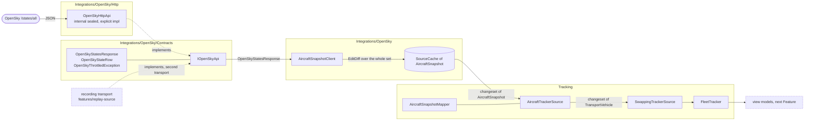

# Specification: Aircraft source

## 1. Business Goal

<!-- Rules: ../../../.spec/templates/feature.md § 1 -->

The demo exists to break a belief: that a reactive collection needs a push feed. Its audience polls REST endpoints and runs SQL queries, so the one step they need — a full snapshot becoming a changeset — is the step every DynamicData example skips. This feature builds that step for live aircraft, and it gives every thing the step passes through one responsibility and one name. Today a single interface carries the provider's payload, the domain set and the collection all at once, which is why the word "snapshot" means three things in conversation: `Snapshots` hands back domain objects even though a snapshot is the record you map _into_ a domain object. Worse, the thing that actually varies between an aircraft feed and a vessel feed — how a provider's record becomes a `TransportVehicle` — has no owner at all, so it ends up smeared across whichever component happens to be holding both types. The outcome is a typed API contract that mirrors what OpenSky publishes, a client that caches what it fetches, a per-type projection that is the only place a domain object is built, and a swap that happens behind a decorator rather than in the pipeline. The failure state removed is a demo whose headline mechanism and whose extension point both have no address in its own source.

## 2. User Needs

<!-- Rules: ../../../.spec/templates/feature.md § 2 -->

| #   | Persona                                                                                                                               | Need                                                                                                           | Pain point today                                                                                                                                             |
| --- | ------------------------------------------------------------------------------------------------------------------------------------- | -------------------------------------------------------------------------------------------------------------- | ------------------------------------------------------------------------------------------------------------------------------------------------------------ |
| 1   | Line-of-business .NET developer in the talk audience, whose data lives behind REST endpoints and SQL queries (README.md § "Audience") | To see the single point where a request/response feed becomes a reactive collection, and to be able to name it | Every DynamicData sample starts from a push feed or from a cache that is already full, so the step they actually need is the one nobody shows                |
| 2   | The same developer, reading this repository after the talk — the repository is the takeaway                                           | A name per layer, so a signature tells them which one they are in                                              | One interface returns domain objects but is named for snapshots; the payload, the cached record and the domain object are all "the snapshot" in conversation |
| 3   | The same developer, whose own app will grow a second data source                                                                      | One obvious place to add a source, and nothing else to touch                                                   | With no owner for "provider record becomes domain object", a second source means editing whatever currently holds both types                                 |
| 4   | The same developer, whose own API is versioned and will change under them                                                             | A typed contract they can version and fake without HTTP                                                        | A loose DTO plus a converter leaves nothing to version and nothing a test can substitute except the HTTP transport                                           |
| 5   | The presenter running the demo on stage (README.md § "Demo resilience")                                                               | The aircraft feed to survive a talk on a venue network, inside one day's credit budget                         | A 30-minute token expires mid-sentence, a rehearsal can spend the day's credits before the talk, and a missing credential is discovered in front of people   |
| 6   | The presenter, at the closing act (README.md § "Closing act")                                                                         | To swap planes for ships without the grid, the filters or the bindings noticing                                | If the swap is wired through the pipeline, the pipeline knows which source is live, and the claim the talk is making is false on stage                       |

## 3. Acceptance Criteria

<!-- Rules: ../../../.spec/templates/feature.md § 3 -->

Fifty-two claims, in nine groups — one per component, plus the boundary rules:
**B-005 – B-010, B-048 and B-049** the API contract; **B-001 – B-004** the API
types and the envelope; **B-011 – B-014** the snapshot; **B-015 – B-029 and
B-050** the snapshot client — except **B-026 – B-028**, re-subjected to the HTTP
transport when § 11 row 2 was answered, and still delivered by `0004`; **B-030 – B-032** the cache; **B-033 – B-037** the
tracker source strategy; **B-038 – B-040** the swap decorator; **B-041 – B-044,
B-051 and B-052** the fleet tracker; **B-045 – B-047** the layer boundaries.

B-052 sits in the last group because the fleet tracker is what the container
has to hand back, not because composition belongs to that component: it is the
one claim about the chain rather than about a layer of it.

B-048 – B-052 are out of numeric order because they were added after the rest
were written. Ids are permanent, so they keep the numbers they were given rather
than being slotted into the sequence.

| ID    | Claim                                                                                                                                                                                                                                                                                                                                                                                                                                                                                                                                         | Source                                                              |
| ----- | --------------------------------------------------------------------------------------------------------------------------------------------------------------------------------------------------------------------------------------------------------------------------------------------------------------------------------------------------------------------------------------------------------------------------------------------------------------------------------------------------------------------------------------------- | ------------------------------------------------------------------- |
| B-001 | The response envelope SHALL mirror what OpenSky sends — its reported time and its `states` rows — named as the provider names them.                                                                                                                                                                                                                                                                                                                                                                                                           | Decided call — the contract mirrors the API                         |
| B-002 | The envelope's `states` SHALL remain the provider's positional shape; no member of the envelope SHALL be a named per-aircraft type.                                                                                                                                                                                                                                                                                                                                                                                                           | README.md § "Response shape"; decided call                          |
| B-003 | The envelope's reported time SHALL be the observed instant for everything downstream, and no consumer SHALL read an ambient clock to supply one.                                                                                                                                                                                                                                                                                                                                                                                              | api-mock § "Replay"; dynamic-data-pipeline § "Staleness and expiry" |
| B-004 | The positional row type SHALL NOT be visible outside the integration code; no domain type, cache, strategy or view SHALL be able to name it.                                                                                                                                                                                                                                                                                                                                                                                                  | domain-model § "Never add"                                          |
| B-005 | The API contract SHALL declare one method per external endpoint, returning `Task<T>`, with `CancellationToken` as the last parameter.                                                                                                                                                                                                                                                                                                                                                                                                         | api-contract (global) § scrutiny                                    |
| B-006 | The API contract SHALL NOT name an `IObservable`, a cache, a changeset, a bounding box, a polling interval or a credential.                                                                                                                                                                                                                                                                                                                                                                                                                   | api-contract (global); decided call                                 |
| B-007 | Exactly one production class SHALL implement the API contract **per transport** — one reaching the provider over HTTP, one reading a recording — and each SHALL be `internal sealed` with **explicit interface implementation** on every method and no `public` endpoint method. A second implementation for a transport that already has one SHALL NOT exist.                                                                                                                                                                                | api-contract (global) § scrutiny; see § 4 row 20                    |
| B-008 | No implementing class's type SHALL be resolvable from outside the integration code; dependency injection SHALL alias the contract to one implementation **per constructed chain**, so a consumer names the contract and never selects between implementations.                                                                                                                                                                                                                                                                                | api-contract (global) § DI registration; see § 4 row 20             |
| B-009 | A new OpenSky API version SHALL produce a new contract interface; an existing contract interface SHALL NOT be edited once a class implements it.                                                                                                                                                                                                                                                                                                                                                                                              | api-contract (global) § versioning                                  |
| B-010 | **Withdrawn** — the API contract's test double was to be a hand-written fake that throws naming the unset response, and not produced by a mocking framework. Withdrawn 2026-10-05 by the person: the claim was adopted as conformance to the versioned-contract pattern rather than decided on its merits, and its cost — a test suite whose subject is a test double — had already landed. NSubstitute stands in at the contract seam, as it does everywhere else. § 10 carries the delta; § 4 row 18 records what the conflict resolved to. | api-contract (global) § testing; see § 4 row 18                     |
| B-048 | The API contract SHALL carry no version suffix and SHALL have no marker interface above it for as long as OpenSky publishes no API version; the versioned layer SHALL be introduced only when the provider declares a version to be agnostic about.                                                                                                                                                                                                                                                                                           | Decided call; see § 4 row 3                                         |
| B-049 | A contract layer SHALL exist only where the provider is request/response shaped; a push provider's strategy SHALL have none, and no contract SHALL be invented to give a socket one. The surface every strategy shares SHALL be `ITrackerSource` and nothing above it.                                                                                                                                                                                                                                                                        | Decided call; see § 4 row 4                                         |
| B-050 | The polling interval SHALL be configurable and SHALL default to 15 seconds; the bounding box SHALL be configurable with no default compiled in.                                                                                                                                                                                                                                                                                                                                                                                               | Decided call; decisions/0001                                        |
| B-051 | A vehicle past the staleness threshold SHALL remain in the collection and SHALL be observably stale; it SHALL NOT be removed for staleness. The threshold SHALL be configurable and SHALL default to five minutes.                                                                                                                                                                                                                                                                                                                            | Decided call; dynamic-data-pipeline § "Staleness and expiry"        |
| B-052 | The container the application constructs SHALL resolve `IFleetTracker` with every dependency satisfied and every decorator applied, so a chain that compiles and a chain that runs are the same thing.                                                                                                                                                                                                                                                                                                                                        | Decided call; ADR-0003 § Consequences                               |
| B-011 | The snapshot SHALL have value equality over every member it carries, so two snapshots reporting identical values compare equal and the differ emits no change for them.                                                                                                                                                                                                                                                                                                                                                                       | Decided call — the client diffs records                             |
| B-012 | The snapshot SHALL carry `icao24` as a non-optional member and SHALL be keyed on it.                                                                                                                                                                                                                                                                                                                                                                                                                                                          | README.md index 0 ("the cache key")                                 |
| B-013 | The snapshot SHALL carry the wire's values in the wire's units and SHALL perform no conversion, derivation or interpretation; it is the server's record with names on it.                                                                                                                                                                                                                                                                                                                                                                     | Decided call; mapping § "Conversions are explicit, never implicit"  |
| B-014 | The snapshot SHALL NOT carry a staleness flag, a display label, a grouping key, or any other value derived rather than reported.                                                                                                                                                                                                                                                                                                                                                                                                              | domain-model § "Never add"                                          |
| B-015 | The snapshot client SHALL take the API contract and its cache by constructor, and SHALL construct neither.                                                                                                                                                                                                                                                                                                                                                                                                                                    | Decided call — constructor injection                                |
| B-016 | The snapshot client SHALL read every field by its positional index per README.md § "Response shape", and an 18-element row SHALL populate each snapshot member from its own index.                                                                                                                                                                                                                                                                                                                                                            | README.md § "Response shape"                                        |
| B-017 | A `null` element SHALL be carried as absent on the snapshot, and SHALL NOT be substituted with `0`, `false`, an empty string, or any other default.                                                                                                                                                                                                                                                                                                                                                                                           | mapping § "Never add"                                               |
| B-018 | A 17-element row SHALL yield a snapshot whose category is **absent**, and an 18-element row whose index 17 is `0` SHALL yield a snapshot whose category is **present with value 0**; the two SHALL be distinguishable.                                                                                                                                                                                                                                                                                                                        | README.md index 17; domain-model                                    |
| B-019 | The snapshot's callsign SHALL have the wire's 8-character padding removed, and a callsign consisting only of padding SHALL be absent rather than empty or whitespace.                                                                                                                                                                                                                                                                                                                                                                         | README.md index 1                                                   |
| B-020 | The snapshot's squawk SHALL be a string and SHALL preserve leading zeros, so a wire value of `"0021"` is read as four characters and never as the number 21.                                                                                                                                                                                                                                                                                                                                                                                  | README.md index 14                                                  |
| B-021 | `sensors` (index 12) SHALL be read past deliberately and SHALL NOT appear on the snapshot or on any domain type; the exclusion SHALL be explicit rather than a side effect of nobody using it.                                                                                                                                                                                                                                                                                                                                                | mapping § "Unmapped members are errors"                             |
| B-022 | A row the client cannot read — an element count outside 17–18, an element of the wrong type, or an absent `icao24` — SHALL be excluded and counted, and SHALL NOT abort the remaining rows.                                                                                                                                                                                                                                                                                                                                                   | language-ext-usage                                                  |
| B-023 | The snapshot client SHALL write every fetched set to its cache as a differential update over the whole set, and SHALL expose the resulting snapshot changeset stream.                                                                                                                                                                                                                                                                                                                                                                         | Decided call — the client diffs; README.md § "Core idea"            |
| B-024 | The bounding box and the polling interval SHALL be supplied to the snapshot client as constructor or options input, and SHALL NOT appear on the API contract, on its own stream, or on anything downstream.                                                                                                                                                                                                                                                                                                                                   | api-contract § "The traps"                                          |
| B-025 | When the application offers grouping by aircraft category, the request SHALL set `extended=1`; a request without it SHALL yield snapshots whose category is absent rather than defaulted.                                                                                                                                                                                                                                                                                                                                                     | README.md § "Data source"; links B-018                              |
| B-026 | The HTTP transport SHALL refresh its OAuth2 token both when the current token has expired and when a request returns `401`, retrying that request once after a successful refresh; it SHALL NOT rely on expiry alone.                                                                                                                                                                                                                                                                                                                         | README.md § "Authentication"; § 11 row 2                            |
| B-027 | The HTTP transport SHALL log the `X-Rate-Limit-Remaining` header value at debug level on every poll, and no log line, exception message, test fixture or diagnostic SHALL contain a token, `client_id` or `client_secret` value.                                                                                                                                                                                                                                                                                                              | README.md § "Limits"; api-contract § "Credentials"; § 11 row 2      |
| B-028 | A `429` response SHALL be inspected for `X-Rate-Limit-Retry-After-Seconds` in the HTTP transport, and SHALL defer the snapshot client's next poll by exactly that many seconds; no exception SHALL reach a subscriber of the client's stream and no backoff SHALL be invented; every other non-2xx status SHALL remain an exception.                                                                                                                                                                                                          | README.md § "Limits"; flurl-http-client; ADR-0008; § 11 row 2       |
| B-029 | A missing OpenSky credential SHALL fail at application startup with a message naming which credential is absent; and a failed poll — timeout, `429`, `5xx`, or an unreadable body — SHALL NOT complete or error-terminate the client's stream.                                                                                                                                                                                                                                                                                                | api-contract § "Credentials"; hot-swap-source                       |
| B-030 | The cache SHALL be a plain keyed store of snapshots: no diff policy of its own, no projection, and no clock.                                                                                                                                                                                                                                                                                                                                                                                                                                  | Decided call — the cache is dumb                                    |
| B-031 | There SHALL be one cache per client, typed to that client's snapshot, and its lifetime SHALL be the application's rather than the client's.                                                                                                                                                                                                                                                                                                                                                                                                   | Decided call; hot-swap-source § "What must not be rebuilt"          |
| B-032 | The cache SHALL NOT hold, construct, reference or return a `TransportVehicle` or any other domain type.                                                                                                                                                                                                                                                                                                                                                                                                                                       | Decided call                                                        |
| B-033 | `ITrackerSource` SHALL declare the `TransportVehicle` changeset stream, so every strategy is substitutable through it without a cast.                                                                                                                                                                                                                                                                                                                                                                                                         | Decided call — the strategy seam                                    |
| B-034 | The aircraft tracker source SHALL adhere to `ITrackerSource` and SHALL own the Mapperly projection from snapshot to `Aircraft`; this SHALL be the first place a domain object exists.                                                                                                                                                                                                                                                                                                                                                         | Decided call; mapping § "One mapper per boundary"                   |
| B-035 | The projection SHALL store each value in the unit the wire reported it in — metres, metres per second, degrees clockwise from north — and SHALL NOT convert to feet, knots, or any display unit.                                                                                                                                                                                                                                                                                                                                              | ADR-0005 item 7; domain-model                                       |
| B-036 | Every absent snapshot value SHALL project to `Option<T>.None`: an absent altitude SHALL NOT become sea level and an absent position SHALL NOT become latitude 0, longitude 0; and barometric and geometric altitude SHALL both survive as separate optional members.                                                                                                                                                                                                                                                                          | language-ext-usage; mapping § "Optional values"                     |
| B-037 | `TransportVehicle.Key` SHALL be the snapshot's `icao24` in lowercase hex, non-optional and set on construction; and a per-type tracker source interface SHALL NOT widen the seam with source-describing members.                                                                                                                                                                                                                                                                                                                              | domain-model; api-contract § "Never add"                            |
| B-038 | A decorator registered as `ITrackerSource` SHALL select the live strategy at runtime, and there SHALL be no strategy-resolver type that callers ask which strategy to use.                                                                                                                                                                                                                                                                                                                                                                    | Decided call — decorator, not resolver                              |
| B-039 | The decorator SHALL be substitutable for any strategy it wraps, and no consumer SHALL be able to observe from its stream that a swap occurred.                                                                                                                                                                                                                                                                                                                                                                                                | hot-swap-source § "The mechanism"                                   |
| B-040 | Swapping SHALL stop the outgoing source, so a swapped-out poller stops spending OpenSky credits and a swapped-out socket stops reading.                                                                                                                                                                                                                                                                                                                                                                                                       | hot-swap-source § "Disposal discipline"                             |
| B-041 | `IFleetTracker` SHALL wrap `ITrackerSource` and SHALL be what view models depend on; no view model SHALL depend on a strategy, a client, a cache or the decorator.                                                                                                                                                                                                                                                                                                                                                                            | Decided call; mvvm                                                  |
| B-042 | `IFleetTracker` SHALL own the collection pipeline — filtering, sorting, grouping, aggregates, property-change refresh, expiry and binding — and that pipeline SHALL be constructed once and SHALL NOT be rebuilt because the live source changed.                                                                                                                                                                                                                                                                                             | Decided call; hot-swap-source § "What must not be rebuilt"          |
| B-043 | `IFleetTracker` SHALL own the injected clock: staleness SHALL derive from a vehicle's last contact against it, and no staleness or expiry decision anywhere SHALL read `DateTime.UtcNow` inline.                                                                                                                                                                                                                                                                                                                                              | dynamic-data-pipeline § "Staleness and expiry"; test-from-scenarios |
| B-044 | No code SHALL add to or remove from a bound collection imperatively; every change SHALL arrive through the pipeline `IFleetTracker` owns.                                                                                                                                                                                                                                                                                                                                                                                                     | dynamic-data-pipeline § "Never add"                                 |
| B-045 | The response envelope and the positional row SHALL be referenced only by the class implementing the API contract and by the snapshot client.                                                                                                                                                                                                                                                                                                                                                                                                  | api-contract § "Never add"                                          |
| B-046 | The snapshot SHALL be referenced by the snapshot client, its cache, and its tracker source's projection, and by nothing downstream of that projection.                                                                                                                                                                                                                                                                                                                                                                                        | Decided call — the snapshot dies at the projection                  |
| B-047 | No consumer downstream of `IFleetTracker` SHALL reference an API contract, a client, a cache, a snapshot, or a concrete `ITrackerSource`.                                                                                                                                                                                                                                                                                                                                                                                                     | Decided call; hot-swap-source                                       |

## 4. Constraints

<!-- Rules: ../../../.spec/templates/feature.md § 4 -->

| #   | Constraint                                                                                                                                                             | Source                                                      | Impact                                                                                                                                                                                                                                                                                                                                                                                                                                                                                                                                                                                                                                                                                                                                                         |
| --- | ---------------------------------------------------------------------------------------------------------------------------------------------------------------------- | ----------------------------------------------------------- | -------------------------------------------------------------------------------------------------------------------------------------------------------------------------------------------------------------------------------------------------------------------------------------------------------------------------------------------------------------------------------------------------------------------------------------------------------------------------------------------------------------------------------------------------------------------------------------------------------------------------------------------------------------------------------------------------------------------------------------------------------------- |
| 1   | OpenSky publishes no OpenAPI document.                                                                                                                                 | README.md § "Data source"; ADR-0001                         | Rules out a generated client and an attribute-driven typed interface. The index table in README.md § "Response shape" **is** the contract; it is read, not inferred from a sample payload.                                                                                                                                                                                                                                                                                                                                                                                                                                                                                                                                                                     |
| 2   | `states` is an array of arrays — fields are positional, not named.                                                                                                     | README.md § "Response shape"                                | Rules out Mapperly at the wire boundary and rules out deserializing straight to a named per-aircraft type. The rows-to-snapshot mapping is hand-written; only snapshot-to-domain is Mapperly's.                                                                                                                                                                                                                                                                                                                                                                                                                                                                                                                                                                |
| 3   | OpenSky publishes no API version — there is no `/v1/` in the path.                                                                                                     | README.md § "Data source"                                   | Rules out a version suffix, because a suffix matches the _provider's_ major version and there is none to match; an invented `V1` would be the internal version number the pattern forbids. The contract therefore has no suffix and no marker above it until OpenSky declares a version (B-048).                                                                                                                                                                                                                                                                                                                                                                                                                                                               |
| 4   | A WebSocket does not fit one `Task<T>` per endpoint. Subscribe-then-receive has no request to return a response.                                                       | ais-stream; api-contract (global)                           | Rules out a contract layer for a push provider, and rules out inventing a fake one to make the strategies look alike (B-049). The surface they share is `ITrackerSource`, which is why the seam sits at the domain boundary.                                                                                                                                                                                                                                                                                                                                                                                                                                                                                                                                   |
| 5   | Integration code does not live under `Features/`. `AGENTS.md` § "Code Conventions" governs feature code and is silent on integrations.                                 | Decided call; AGENTS.md                                     | Rules out a contract, a client or a cache inside `src/Transponder/Features/<FeatureName>/`. Integrations get their own root, so a provider's code is not mistaken for one feature's — see `coding-conventions`.                                                                                                                                                                                                                                                                                                                                                                                                                                                                                                                                                |
| 6   | `category` exists only when the request sets `extended=1`.                                                                                                             | README.md index 17                                          | Rules out offering category grouping without the extended request, and rules out a single "unknown category" value — absent and unknown are two states (B-018, B-025).                                                                                                                                                                                                                                                                                                                                                                                                                                                                                                                                                                                         |
| 7   | OAuth2 client credentials only; no basic auth; tokens last 30 minutes and can die early.                                                                               | README.md § "Authentication"                                | Rules out a token fetched once at startup, a clock-only refresh, and any call site attaching its own credential. Forces one token cache and refresh on both expiry and `401`.                                                                                                                                                                                                                                                                                                                                                                                                                                                                                                                                                                                  |
| 8   | Credits are the budget, and cost scales with bounding-box area: ≤25 sq° = 1, up to 4 for global. The registered free tier is 4,000 per day.                            | README.md § "Limits"                                        | Rules out an unbounded poll loop, and rules out a box large enough to leave the 1-credit tier. At the chosen 15-second interval (B-050) a ≤25 sq° box costs 240 credits/hour, so a talk spends ~180 of 4,000 and rehearsal is unconstrained — credits bound the _box_, not the interval.                                                                                                                                                                                                                                                                                                                                                                                                                                                                       |
| 9   | A `429` carries `X-Rate-Limit-Retry-After-Seconds`; remaining budget is in `X-Rate-Limit-Remaining`.                                                                   | README.md § "Limits"                                        | Rules out an invented backoff and any call style that discards response headers — so `GetJsonAsync<T>()` on a URL is unusable. A `429` must be inspectable rather than thrown.                                                                                                                                                                                                                                                                                                                                                                                                                                                                                                                                                                                 |
| 10  | OpenSky blocks AWS and other hyperscaler IPs.                                                                                                                          | README.md § "Gotchas"                                       | Rules out a CI job or test that reaches the live API, and rules out running the demo from a cloud VM. The replay strategy is the network contingency, not a nice-to-have.                                                                                                                                                                                                                                                                                                                                                                                                                                                                                                                                                                                      |
| 11  | Public presentation of this data owes the OpenSky citation.                                                                                                            | README.md § "Gotchas"                                       | Rules out presenting without a credit slide. Not a code constraint and not ours to simplify; tracked as a README.md open item.                                                                                                                                                                                                                                                                                                                                                                                                                                                                                                                                                                                                                                 |
| 12  | Credentials come from user secrets or environment variables, and are never committed, logged, or placed in a fixture.                                                  | api-contract § "Credentials"                                | Rules out a committed fixture with a real key, a token in debug output, and any test that passes only when a credential is present.                                                                                                                                                                                                                                                                                                                                                                                                                                                                                                                                                                                                                            |
| 13  | There is no Gherkin runner in this repository — no Reqnroll, no bindings, no step definitions.                                                                         | AGENTS.md; spec-and-traceability                            | Rules out the `.feature` file being the executing artifact, and rules out an `@ignore` tag. "A scenario exists" never means a claim is covered; the § 9 row pointing at an xUnit test does.                                                                                                                                                                                                                                                                                                                                                                                                                                                                                                                                                                    |
| 14  | No test may touch a network or the wall clock.                                                                                                                         | api-mock; test-from-scenarios                               | Rules out `Thread.Sleep`, a real delay, a retry-until-true, and a hand-rolled `HttpMessageHandler`. Every time-based element takes an injected scheduler or clock in production, not only in tests.                                                                                                                                                                                                                                                                                                                                                                                                                                                                                                                                                            |
| 15  | Flurl's `HttpTest` intercepts through the logical asynchronous call context and does not follow a message into an actor on its own dispatcher.                         | ADR-0001 § "Consequences"                                   | Rules out testing a poller actor with `HttpTest`. The contract's implementation stays a plain class tested directly — and a double of the contract is what lets everything above it be tested with no HTTP at all.                                                                                                                                                                                                                                                                                                                                                                                                                                                                                                                                             |
| 16  | The domain model references only the framework and LanguageExt — no DynamicData, Flurl, `HttpClient` or `System.Text.Json` types.                                      | domain-model § "Never add"                                  | Rules out the cache, the strategies or the tracker living inside the model. It is why each is a separate component rather than a member on `TransportVehicle`.                                                                                                                                                                                                                                                                                                                                                                                                                                                                                                                                                                                                 |
| 17  | A package is available only once it is in `Directory.Packages.props`, and the build runs only the targets it declares.                                                 | dynamic-data-pipeline; ADR-0003; `nuke-build`               | Rules out assuming a package is referenced: the first item that needs one adds it centrally, never pinned in a `.csproj`. Read the file and the build rather than this row — which packages and targets exist today is repository state, not a constraint. A green build proves only that the declared targets ran.                                                                                                                                                                                                                                                                                                                                                                                                                                            |
| 18  | The versioned-contract pattern bans a mocking framework for the contract's test double; this repository's conventions mandate NSubstitute (`transponder-conventions`). | api-contract (global) § scrutiny; `transponder-conventions` | **Resolved toward this repository's conventions, 2026-10-05.** It had been resolved the other way — B-010 obliged a hand-written fake inside the contract layer — and that resolution was conformance bookkeeping rather than a decision: commit 31dda56 records the conflict and the choice in one sentence, with no ADR behind it and no record of the trade-off being weighed. What it cost was visible by `0004`: a test suite whose subject was a test double, and arrangements this item needs that would have put a response queue and a recorded-calls list inside it. NSubstitute now stands in at the contract seam too, and B-010 is Withdrawn. The pattern's rule is not followed here, which § 6 and § 10 say rather than leave to be discovered. |
| 19  | The versioned-contract pattern is silent on caching, observables and streaming, and defines no layer above the contract.                                               | api-contract (global)                                       | Rules out claiming conformance for the client, the cache, the strategies, the decorator or the tracker. Only B-005 – B-009 are governed by it; everything above is this repository's own design and says so. B-010 was its sixth claim here and is Withdrawn, so the pattern's testing rule governs nothing in this repository — row 18.                                                                                                                                                                                                                                                                                                                                                                                                                       |
| 20  | Replay must be selectable at the `ITrackerSource` seam, and a recording is the provider's own envelope written verbatim.                                               | api-mock § "Replay"; hot-swap-source; ADR-0004              | Rules out the pattern's "exactly one production class" for the contract: replay substitutes _at the contract_, so a second implementation reads the recording and the same client, cache and projection sit above it unchanged. B-007 is therefore one implementation **per transport** and B-008 aliases per constructed chain. A narrow, deliberate departure from the global pattern, recorded here rather than discovered — the same treatment row 18 gives the NSubstitute conflict. The alternative, a replay client of its own, would have required widening B-045 and keeping a second positional row reader correct.                                                                                                                                  |

## 5. Out of Scope

<!-- Rules: ../../../.spec/templates/feature.md § 5 -->

| #   | Item                                                                                                                               | Exclusion reason                                                                                                                                                                                                                                                                                                                                                                                                                                                               |
| --- | ---------------------------------------------------------------------------------------------------------------------------------- | ------------------------------------------------------------------------------------------------------------------------------------------------------------------------------------------------------------------------------------------------------------------------------------------------------------------------------------------------------------------------------------------------------------------------------------------------------------------------------ |
| 1   | The pipeline operators themselves — filtering, sorting, grouping, aggregates, property-change refresh, expiry, binding             | B-042 claims only that `IFleetTracker` **owns** them and that they are built once. Building them is the next feature. The line matters: ownership is claimed here, behavior is not.                                                                                                                                                                                                                                                                                            |
| 2   | The `airplanes.live` backup source                                                                                                 | Its access terms are unresolved and README.md § "Backup source" says to email them first. A legal open question, not a technical one. It gets its own contract and strategy if and when that clears.                                                                                                                                                                                                                                                                           |
| 3   | The AISStream vessel feed, `Vessel`, and the vessel client, cache and tracker source                                               | The closing act and a stretch goal. This feature claims the shape a second strategy plugs into (B-033, B-038, B-049) and nothing about the vessel feed itself. Note it has **no** contract layer: a socket does not fit one `Task<T>` per endpoint (§ 4 row 4).                                                                                                                                                                                                                |
| 4   | The replay and simulated strategies                                                                                                | Separate implementations of the seam this feature defines. This spec gives them a seam and an observed instant to carry (B-003); it does not build them or record rehearsal fixtures. Replay now has its own specification — [`features/replay-source`](../../replay-source/.spec/README.md) — and it substitutes at the API contract, which is why B-007 is one implementation per transport (§ 4 row 20). The simulated strategy stays a forward reference with no spec yet. |
| 5   | The swap control, the stage choreography, and in-flight-result cancellation on swap                                                | `hot-swap-source` owns them. This feature claims the decorator's obligations (B-038 – B-040) and stops there; no selector UI, no disposal choreography.                                                                                                                                                                                                                                                                                                                        |
| 6   | `ExpireAfter` and any removal-for-staleness behavior                                                                               | B-051 decides it the other way: a stale aircraft is **marked and kept**, never removed. `ExpireAfter` therefore has no role in the aircraft demo and is not built here. Vessels may still want it — they go silent rather than departing — and that belongs to the closing act.                                                                                                                                                                                                |
| 7   | The grid, the detail pane, the search box, the dropdowns, the grouped view, the stale indicator's rendering, and the summary tiles | UI (`maui-ui`, `mvvm`). A view's obligations are not written into a scenario here, and no scenario names a UI mechanic.                                                                                                                                                                                                                                                                                                                                                        |
| 8   | The optional map view                                                                                                              | README.md § "The app" lists it as optional. Nothing in § 3 needs it, and a map is the most expensive way to prove a changeset arrived.                                                                                                                                                                                                                                                                                                                                         |
| 9   | A generated OpenSky client, or an OpenAPI document written by us to generate from                                                  | Rejected in ADR-0001 and foreclosed by Constraint 1. Writing a specification for someone else's undocumented API to feed a generator is a project, not a step.                                                                                                                                                                                                                                                                                                                 |
| 10  | A Gherkin runner, Reqnroll, step definitions, or bindings                                                                          | § 4 row 13. Scenarios are documentation. A runner would make the `.feature` file executable and move the coverage gate off § 9, which is where AGENTS.md puts it.                                                                                                                                                                                                                                                                                                              |
| 11  | Unit conversion to feet, knots or local time, and display formatting of an `Option<T>`                                             | A display concern (ADR-0005 item 7). SI is canonical in the model (B-035); conversion happens at the view in a named method.                                                                                                                                                                                                                                                                                                                                                   |
| 12  | OpenSky's `sensors` field (index 12)                                                                                               | Explicitly excluded by B-021. Recorded as a decision rather than left as an omission, so a later reader does not add it believing it was overlooked.                                                                                                                                                                                                                                                                                                                           |
| 13  | A second strategy seam, and any source-describing metadata — display name, which columns make sense, an icon                       | B-037 forbids widening a per-type interface for this. A source that genuinely needs to describe itself gets a separate small type in a separate feature.                                                                                                                                                                                                                                                                                                                       |
| 14  | Persisting snapshots, snapshot history, or a track per aircraft                                                                    | Each cache holds current state. A history store is a second collection, which dynamic-data-pipeline § "Never add" rules out, and nothing in § 3 or README.md asks for a trail.                                                                                                                                                                                                                                                                                                 |
| 15  | Registering the OpenSky account, creating the API client, and provisioning the credentials                                         | Operational tasks tracked in README.md § "Open items". B-029 claims the application's _behavior_ when a credential is absent; obtaining one is not code.                                                                                                                                                                                                                                                                                                                       |
| 16  | The poller's hosting — actor shape, supervision, registration, and whether a view model uses `Tell` or `Ask`                       | `akka-actor` and `mvvm`. This spec claims the client's observable behavior (B-015 – B-029), not where it runs. `Tell`-vs-`Ask` is a repository-wide undecided, open at README.md § "Open items".                                                                                                                                                                                                                                                                               |
| 17  | A `Test` target in the Nuke build                                                                                                  | A repository-wide call, and `0017` made it outside this Feature. Deciding it inside a feature specification would have settled a build convention by side effect.                                                                                                                                                                                                                                                                                                              |

## 6. Concern Separation

<!-- Rules: ../../../.spec/templates/feature.md § 6 -->

One row per concern, not per claim. Fifty-two rows would be § 3 with a column
bolted on, and a second copy of a claim drifts from the first; instead each row
names in its Notes the claim ids it answers for, so coverage is checked by
reading the ids down the column rather than by counting rows. The rows follow
§ 3's nine groups.

How the three classifications are applied here: **Business** where the shape
could have gone either way technically and a product judgment picked it;
**Technical** where no business party expressed a preference and a constraint or
a skill decided it; **Both** where a technical shape was chosen for a business
reason § 1 or § 2 names. The last is the column that earns the table — § 4 rows
18 and 20 are each a departure from the global contract pattern made for a
reason the business goal states, and reading either as purely technical loses
why it was allowed.

| Item                                                                | Classification | Notes                                                                                                                                                                                                                                                                                                                                                                                                                                                                              |
| ------------------------------------------------------------------- | -------------- | ---------------------------------------------------------------------------------------------------------------------------------------------------------------------------------------------------------------------------------------------------------------------------------------------------------------------------------------------------------------------------------------------------------------------------------------------------------------------------------- |
| One name per layer — envelope, snapshot, domain vehicle             | Both           | § 2 need 2: a signature must tell the reader which layer they are in, and today "snapshot" means three things. Three distinct types is the technical answer to a comprehension problem, not to a correctness one. B-001, B-011, B-034.                                                                                                                                                                                                                                             |
| The provider's positional shape is a transport detail               | Technical      | § 4 row 2 and `domain-model` § "Never add". Nobody outside the code has a stake in where the array dies. B-002, B-004.                                                                                                                                                                                                                                                                                                                                                             |
| The observed instant comes from the provider, never a clock         | Both           | § 2 need 5: on stage the fallback must age aircraft the way the live feed does, or the recording is visibly not live. ADR-0004 rules out the arrival time as the answer. B-003. Resolved by [ADR-0007](../../../.spec/adr/0007-the-live-source-advances-the-observed-clock.md): the live source advances the clock `IFleetTracker` owns, and `0004` writes each envelope's reported time to it.                                                                                    |
| A typed contract that can be versioned and faked without HTTP       | Both           | § 2 need 4: the audience's own APIs are versioned and will change under them. § 4 row 15 makes the contract the only seam a test can use at all, since `HttpTest` cannot follow a message into an actor. B-005, B-006, B-009.                                                                                                                                                                                                                                                      |
| The contract carries no version the provider never published        | Technical      | § 4 row 3 is the whole argument, and it is a reading of someone else's rule against this provider rather than a judgment anyone outside the code has a stake in. B-048.                                                                                                                                                                                                                                                                                                            |
| A contract layer only where the provider is request/response shaped | Technical      | § 4 row 4. The temptation it resists — making the two strategies look alike — is a presentation concern, and it is the last row of this table rather than this one. B-049.                                                                                                                                                                                                                                                                                                         |
| The contract's double is built the way every other double here is   | Both           | § 4 row 18, which now resolves toward this repository's conventions. Technically a narrow conflict between two documents whose scopes differ, and the business reason decides it: § 2 need 2 makes the repository the takeaway, and a reader who takes this away should find one way of building a double rather than a layer with a local exception and a test suite covering the exception. B-010, Withdrawn.                                                                    |
| One contract implementation per transport                           | Both           | § 4 row 20. The business reason is § 2 need 5 — replay exists so a talk survives a venue network, and for no technical reason at all. The technical consequence is that substitution happens at the deepest layer that exists, which keeps B-045 from widening and keeps one positional-row reader in the repository. B-007, B-008. Registration is also the only place the layers meet, so whether the assembled chain resolves at all is decided there and nowhere else — B-052. |
| The snapshot is the server's record, not an interpretation of it    | Technical      | `mapping` § "Conversions are explicit"; `domain-model` § "Never add". B-012, B-013, B-014.                                                                                                                                                                                                                                                                                                                                                                                         |
| A full snapshot becoming a changeset has an address in the source   | Both           | § 1: this is the step the audience needs and every DynamicData sample skips, so the feature exists to give it a name. The technical answer — the writer owns the write, `dynamic-data-pipeline` — would be the same even if nobody were watching. B-015, B-023.                                                                                                                                                                                                                    |
| The cache stores and does nothing else                              | Technical      | Three negative claims and no product stake. `dynamic-data-pipeline`. B-030, B-031, B-032.                                                                                                                                                                                                                                                                                                                                                                                          |
| Absent is not zero, and absent is not present-zero                  | Both           | Technically `Option<T>` at the wire boundary. Why it matters more here than in most code: a wrong answer renders as plausible data — an aircraft at sea level, or one in the Gulf of Guinea — in front of a room, so the failure is invisible exactly when it is most expensive. B-017, B-018, B-036.                                                                                                                                                                              |
| Grouping by category is what makes the request extended             | Both           | § 2 need 1 and README.md § "The app" ask for the grouped view; § 4 row 6 says `extended=1` is how the field arrives and that its absence is not a zero. B-025.                                                                                                                                                                                                                                                                                                                     |
| The wire's encodings are undone at the read, and visibly            | Technical      | Each field comes from its own positional index, and callsign padding and squawk's leading zeros are the provider's encoding; `mapping` § "Conversions are explicit" requires the undoing to be a named step rather than a side effect. B-016, B-019, B-020.                                                                                                                                                                                                                        |
| Canonical units are canonical in the model                          | Technical      | ADR-0005 item 7. The model stores what the wire reported — metres, metres per second, degrees from north — and conversion to anything a reader prefers is a view concern (§ 5 row 11). B-035.                                                                                                                                                                                                                                                                                      |
| `sensors` is excluded on the record, not by disuse                  | Technical      | `mapping` § "Unmapped members are errors", and § 5 row 12 records it so a later reader does not restore it believing it was overlooked. B-021.                                                                                                                                                                                                                                                                                                                                     |
| One unreadable row costs one row                                    | Both           | Technically a per-row result and a count. The business reason: the grid keeps its other aircraft on stage, which is the difference between a blemish and a dead demo. B-022.                                                                                                                                                                                                                                                                                                       |
| The box, the interval, and the credit budget                        | Both           | § 2 need 5 — one day's credits, and a rehearsal must not spend the talk's. § 4 row 8 is the technical half: credits bound the _box_, not the interval, which is the opposite of the intuition. B-024, B-050.                                                                                                                                                                                                                                                                       |
| Houston specifically                                                | Business       | `decisions/0001`: chosen for the variety the grouped view needs, and so the vessel closing act shares one geography. Any box works technically.                                                                                                                                                                                                                                                                                                                                    |
| Token lifecycle, the credit header, and the throttle                | Technical      | § 4 rows 7 and 9 are the provider's terms, not ours to simplify. B-026, B-028, which name the transport: it is the only thing holding the response, and B-006 keeps the credential off the contract.                                                                                                                                                                                                                                                                               |
| A credential never reaches a log, a fixture or a screenshot         | Both           | Technically § 4 row 12. The business reason is that this runs in front of a room and is recorded, so "it is only a debug log" does not apply. B-027.                                                                                                                                                                                                                                                                                                                               |
| A missing credential stops the application at startup               | Business       | Chosen so the presenter learns before the stage rather than during it (§ 2 need 5). Failing lazily on the first poll compiles equally well and is the natural implementation. B-029, first half.                                                                                                                                                                                                                                                                                   |
| A failed poll does not end the stream                               | Both           | Technically an `IObservable` that errors is finished for good. Why it is claimed at all: the grid must not go dead mid-sentence on a venue network. B-029, second half.                                                                                                                                                                                                                                                                                                            |
| The swap is unobservable from the stream                            | Both           | § 2 need 6: if the pipeline can tell which source is live, the claim the talk is making is false while it is being made. The decorator is the technical shape that buys it. B-038, B-039.                                                                                                                                                                                                                                                                                          |
| A swapped-out source stops spending                                 | Both           | Credits, and a leak reads as a library bug on a projector. `hot-swap-source` § "Disposal discipline" is the technical half. B-040.                                                                                                                                                                                                                                                                                                                                                 |
| What a viewer sees during the swap gap                              | Business       | `decisions/0002`. `hot-swap-source` leaves it to the specification deliberately; no technical reading picks between an empty view and a busy indicator.                                                                                                                                                                                                                                                                                                                            |
| Stale is marked and kept, never removed                             | Business       | The row most at risk of being settled technically: `ExpireAfter` sits in the README's own operator table as the obvious reach, and reaching for it answers a product question with an operator. A row vanishing reads as a bug; a flagged row reads as information. B-051.                                                                                                                                                                                                         |
| One clock, and the tracker owns it                                  | Technical      | § 4 row 14 and `dynamic-data-pipeline` § "Staleness and expiry". B-043.                                                                                                                                                                                                                                                                                                                                                                                                            |
| The pipeline is built once and survives the swap                    | Both           | § 2 need 6, and the closing act's whole proof. `hot-swap-source` § "What must not be rebuilt" is the technical half. B-041, B-042, B-044.                                                                                                                                                                                                                                                                                                                                          |
| One obvious place to add a source                                   | Both           | § 2 need 3. One seam carries every strategy, and it stays one member wide — a per-type interface that described its source would make the seam a place to look things up rather than a place to substitute. The three boundary claims are what make the promise true rather than aspirational, and each is falsifiable only from the far side, which is why they are assigned to the items that build the far side. B-033, B-037, B-045, B-046, B-047.                             |
| Integration code is the provider's, not one feature's               | Technical      | § 4 row 5. `AGENTS.md` governed feature layout and was silent on integrations; it gained the line.                                                                                                                                                                                                                                                                                                                                                                                 |
| Seven boxes is more than a slide wants                              | Business       | ADR-0002 § Consequences names the cost this layering carries on stage. How much of it the talk draws is a presentation call, and this Feature does not make it — which is why the row is here and the answer is not.                                                                                                                                                                                                                                                               |

## 7. Technical Design

<!-- Rules: ../../../.spec/templates/feature.md § 7 -->

The layering this section would otherwise have had to settle is decided
repository-wide in
[ADR-0002](../../../.spec/adr/0002-contract-client-strategy-tracker.md), the
decoration package in
[ADR-0003](../../../.spec/adr/0003-scrutor-for-decorator-registration.md), and
the tracked item's base in
[ADR-0005](../../../.spec/adr/0005-an-abstract-base-carries-the-tracked-item.md) —
none of them here, because each binds more than this Feature. What follows is
this Feature's own shape, and it cites those records rather than restating them.

**Domain model**

`Aircraft` is the one concrete subclass of `TransportVehicle`. The base's
members and the rules behind them are ADR-0005's; the four it contributes are
marked _(base)_ below so the ownership line is visible without leaving the
table.

| Field                      | Type                     | Notes                                                                                                                                                                                                                                                                        |
| -------------------------- | ------------------------ | ---------------------------------------------------------------------------------------------------------------------------------------------------------------------------------------------------------------------------------------------------------------------------- |
| `Key`                      | `string`                 | _(base)_ The snapshot's `icao24` lowercased, by a named `ToKey` in the mapper rather than inside a generated member mapping (B-037, `mapping` § "Conversions are explicit"). Plain `string`: a cache key is where `Option` stops (`language-ext-usage`).                     |
| `LastContact`              | `DateTimeOffset`         | _(base)_ Index 4's Unix seconds, converted by a named method.                                                                                                                                                                                                                |
| `Position`                 | `Option<GeoPosition>`    | _(base — ADR-0005 defines it and why it is one optional rather than two)_ What this Feature adds: it is fed from indices 5 and 6, combined by the mapper's `ToPosition`.                                                                                                     |
| `IsStale(asOf, threshold)` | `bool`                   | _(base)_ Derived, never stored. Takes the instant rather than holding a clock, because B-043 puts the clock in `IFleetTracker`.                                                                                                                                              |
| `Label`                    | `string`                 | _(base, abstract — overridden here)_ `Callsign` when present, else `Key`. Derived, which is why B-014 keeps it off the snapshot.                                                                                                                                             |
| `Callsign`                 | `Option<string>`         | Index 1, padding removed; all-padding is `None`, never `""` (B-019).                                                                                                                                                                                                         |
| `OriginCountry`            | `string`                 | Index 2. The index table declares no nullability, so it is non-optional and a null makes the row unreadable under B-022.                                                                                                                                                     |
| `TimePosition`             | `Option<DateTimeOffset>` | Index 3, converted by the same named method as `LastContact`.                                                                                                                                                                                                                |
| `BarometricAltitude`       | `Option<double>`         | Index 7, metres.                                                                                                                                                                                                                                                             |
| `GeometricAltitude`        | `Option<double>`         | Index 13, metres. Separate from the barometric one — B-036 requires both survive.                                                                                                                                                                                            |
| `OnGround`                 | `bool`                   | Index 8.                                                                                                                                                                                                                                                                     |
| `Velocity`                 | `Option<double>`         | Index 9, metres per second (B-035).                                                                                                                                                                                                                                          |
| `TrueTrack`                | `Option<double>`         | Index 10, degrees clockwise from north (B-035).                                                                                                                                                                                                                              |
| `VerticalRate`             | `Option<double>`         | Index 11, metres per second.                                                                                                                                                                                                                                                 |
| `Squawk`                   | `Option<string>`         | Index 14, a string so `"0021"` stays four characters (B-020).                                                                                                                                                                                                                |
| `Spi`                      | `bool`                   | Index 15.                                                                                                                                                                                                                                                                    |
| `PositionSource`           | `Option<PositionSource>` | Index 16, a four-value enum named from the README's index table. `None` means a code this build does not name, which is a different absence from an unreported field — B-018's warning applied to an enum. No `Unknown` member: that would be a value the source never sent. |
| `Category`                 | `Option<int>`            | Index 17, left as the wire's integer. § 4 row 1 makes the README index table the contract, and it publishes no value list, so naming the codes would invent a contract OpenSky did not. Display naming is a view concern, the same treatment § 5 row 11 gives units.         |

The grouping member ADR-0005 item 2 names is deliberately not implemented here.
ADR-0005 § "The members" says why it has no single answer for this source; § 5
rows 1 and 7 are what make leaving it unanswered affordable, since both the
grouped view and `Group` belong to the next Feature.

**The snapshot, and the index each member reads from**

`AircraftSnapshot` is an `internal sealed record` keyed on `Icao24`, read from
README.md § "Response shape" index by index (B-016). The table runs in index
order **including the excluded index**, because B-021 requires the exclusion to
be visible rather than inferred from a gap.

| Index  | Wire field        | Member               | Type             | Note                                                                                                                                                                                                                                                                                   |
| ------ | ----------------- | -------------------- | ---------------- | -------------------------------------------------------------------------------------------------------------------------------------------------------------------------------------------------------------------------------------------------------------------------------------- |
| 0      | `icao24`          | `Icao24`             | `string`         | The key (B-012). Absent ⇒ the row is excluded and counted (B-022).                                                                                                                                                                                                                     |
| 1      | `callsign`        | `Callsign`           | `Option<string>` | Padding trimmed; all-padding ⇒ `None`, not `""` and not whitespace (B-019).                                                                                                                                                                                                            |
| 2      | `origin_country`  | `OriginCountry`      | `string`         | Non-optional.                                                                                                                                                                                                                                                                          |
| 3      | `time_position`   | `TimePosition`       | `Option<long>`   | Unix seconds, **unconverted** — B-013. The conversion is the mapper's.                                                                                                                                                                                                                 |
| 4      | `last_contact`    | `LastContact`        | `long`           | Unix seconds, unconverted, non-optional.                                                                                                                                                                                                                                               |
| 5      | `longitude`       | `Longitude`          | `Option<double>` | Its own member here; combined into `Position` only at the domain.                                                                                                                                                                                                                      |
| 6      | `latitude`        | `Latitude`           | `Option<double>` | As above.                                                                                                                                                                                                                                                                              |
| 7      | `baro_altitude`   | `BarometricAltitude` | `Option<double>` | Metres.                                                                                                                                                                                                                                                                                |
| 8      | `on_ground`       | `OnGround`           | `bool`           | Non-optional.                                                                                                                                                                                                                                                                          |
| 9      | `velocity`        | `Velocity`           | `Option<double>` | m/s. `null` ⇒ `None`, never `0` (B-017).                                                                                                                                                                                                                                               |
| 10     | `true_track`      | `TrueTrack`          | `Option<double>` | Degrees. Same hazard.                                                                                                                                                                                                                                                                  |
| 11     | `vertical_rate`   | `VerticalRate`       | `Option<double>` | m/s. Same hazard.                                                                                                                                                                                                                                                                      |
| **12** | **`sensors`**     | **— none —**         | —                | **Read past deliberately (B-021.)** The reader names index 12 and skips it in a statement a human can see. It is also the only index whose value is a collection, which is part of why value equality holds below.                                                                     |
| 13     | `geo_altitude`    | `GeometricAltitude`  | `Option<double>` | Metres.                                                                                                                                                                                                                                                                                |
| 14     | `squawk`          | `Squawk`             | `Option<string>` | Read with `GetString()`, never `GetInt32()`: `"0021"` is four characters (B-020).                                                                                                                                                                                                      |
| 15     | `spi`             | `Spi`                | `bool`           | Non-optional.                                                                                                                                                                                                                                                                          |
| 16     | `position_source` | `PositionSource`     | `int`            | The wire integer, uninterpreted (B-013). Named at the domain.                                                                                                                                                                                                                          |
| 17     | `category`        | `Category`           | `Option<int>`    | **The hazard a converter collapses (B-018).** `Option<int>` is what makes the claim's two cases two values rather than two spellings of one. Presence is decided by element count and element count alone — never by whether `extended=1` was requested, because the two can disagree. |

Three things follow from the table:

- **Value equality (B-011) is structural, not configured.** Every member is a
  scalar, a `string`, or an `Option<T>` of one; `record` supplies the rest. No
  member is a collection, and the only collection-valued wire field is index 12,
  which B-021 removed. That is the whole reason the hazard `## Scoring` recorded
  against `0003` does not arise.
- **The envelope's reported time is not a snapshot member.** It would differ on
  every poll, so the differ would emit a change for every aircraft every
  interval and the headline mechanism would produce nothing but churn. Where it
  goes instead is ADR-0007's, below.
- **Element count is read first.** B-022 lists three ways a row can be
  unreadable and two of them are answerable before any member is parsed, so the
  count is the first thing the reader looks at and the row is excluded there
  rather than part-way through being built.

**Diagrams**

The constructed chain. Dashed nodes are outside this Feature (§ 5 rows 1, 4, 7);
the recording transport is drawn because B-007's "per transport" is only legible
once the second one is visible.



One poll. This earns its place because it is where the split between what the
transport sees and what the client decides becomes visible — the distinction
§ 11 question 2 turns on.

```mermaid
sequenceDiagram
  autonumber
  participant S as poll schedule
  participant C as AircraftSnapshotClient
  participant H as OpenSkyHttpApi
  participant P as OpenSky
  participant K as SourceCache

  S->>C: tick, default 15s (B-050)
  C->>H: GetStates(lamin, lomin, lamax, lomax, extended, ct)
  H->>P: GET /states/all

  alt 200
    P-->>H: time and positional states rows
    H->>H: log X-Rate-Limit-Remaining at debug, never the token (B-027)
    H-->>C: OpenSkyStatesResponse
    C->>C: read rows by index, skipping 12 (B-016, B-021)
    C->>C: exclude and count unreadable rows (B-022)
    C->>K: EditDiff over the whole set (B-023)
  else 401
    P-->>H: 401
    H->>H: refresh the token, retry this request once (B-026)
  else 429
    P-->>H: 429 and X-Rate-Limit-Retry-After-Seconds
    H-->>C: throws OpenSkyThrottledException
    C->>S: defer the next poll by exactly that many seconds (B-028)
  else 5xx, timeout, unreadable body
    P-->>H: failure
    H-->>C: throws
    C->>C: observed; the stream stays open (B-029)
  end
```

A class diagram is `Not applicable` — the declarations below are the
authoritative form, with accessibility, explicit implementation and generic
arguments a diagram would have to approximate. Drawing them as well would be a
second copy of the same thing to keep in step.

A state diagram is `Not applicable` — no component here holds more than one
state. The only state in the chain is the decorator's selected strategy, and the
control that changes it is § 5 row 5.

An entity-relationship diagram is `Not applicable` — nothing is persisted. § 5
row 14 excludes a snapshot store, and the recording format belongs to ADR-0004
and the replay Feature.

**Interface changes**

This section chose every name here; none of them existed when it was written.
The ones that have since been built are no longer written out — a declaration
belongs in a specification only until its file exists, and after that the row
points at the file, because two statements of one signature is one of them
going stale
([lesson 0004](../../../.spec/lessons/0004-a-specification-that-pastes-code-keeps-a-second-copy.md)).
The diagrams above keep their type names: a diagram states a relationship
rather than a declaration, and a stale name in one is something grep finds.

| Type                        | File                                                                                                                             | Claims it makes visible         |
| --------------------------- | -------------------------------------------------------------------------------------------------------------------------------- | ------------------------------- |
| `IOpenSkyApi`               | [`Contracts/IOpenSkyApi.cs`](../../../src/Transponder/Integrations/OpenSky/Contracts/IOpenSkyApi.cs)                             | B-005, B-006, B-024, B-048      |
| `OpenSkyStatesResponse`     | [`Contracts/OpenSkyStatesResponse.cs`](../../../src/Transponder/Integrations/OpenSky/Contracts/OpenSkyStatesResponse.cs)         | B-001, B-002                    |
| `OpenSkyStateRow`           | [`Contracts/OpenSkyStateRow.cs`](../../../src/Transponder/Integrations/OpenSky/Contracts/OpenSkyStateRow.cs)                     | B-002, B-004, B-016, B-022      |
| `OpenSkyThrottledException` | [`Contracts/OpenSkyThrottledException.cs`](../../../src/Transponder/Integrations/OpenSky/Contracts/OpenSkyThrottledException.cs) | B-028, transport half; ADR-0008 |
| `OpenSkyStateRowConverter`  | [`Http/OpenSkyStateRowConverter.cs`](../../../src/Transponder/Integrations/OpenSky/Http/OpenSkyStateRowConverter.cs)             | B-002                           |
| `OpenSkyHttpApi`            | [`Http/OpenSkyHttpApi.cs`](../../../src/Transponder/Integrations/OpenSky/Http/OpenSkyHttpApi.cs)                                 | B-007                           |
| `OpenSkyRegistration`       | [`Container/OpenSkyRegistration.cs`](../../../src/Transponder/Integrations/OpenSky/Container/OpenSkyRegistration.cs)             | B-008                           |
| `TransportVehicle`          | [`Model/TransportVehicle.cs`](../../../src/Transponder/Model/TransportVehicle.cs)                                                | ADR-0005; B-037, the key's form |
| `Aircraft`                  | [`Model/Aircraft.cs`](../../../src/Transponder/Model/Aircraft.cs)                                                                | B-034 – B-036                   |
| `GeoPosition`               | [`Model/GeoPosition.cs`](../../../src/Transponder/Model/GeoPosition.cs)                                                          | B-036                           |
| `PositionSource`            | [`Model/PositionSource.cs`](../../../src/Transponder/Model/PositionSource.cs)                                                    | B-036, the enum's absence       |
| `ITrackerSource`            | [`Tracking/ITrackerSource.cs`](../../../src/Transponder/Tracking/ITrackerSource.cs)                                              | B-033, B-049                    |
| `IAircraftTrackerSource`    | [`Tracking/Sources/IAircraftTrackerSource.cs`](../../../src/Transponder/Tracking/Sources/IAircraftTrackerSource.cs)              | B-037, the seam's width         |
| `AircraftTrackerSource`     | [`Tracking/Sources/AircraftTrackerSource.cs`](../../../src/Transponder/Tracking/Sources/AircraftTrackerSource.cs)                | B-033, B-034                    |
| `AircraftSnapshotMapper`    | [`Tracking/Sources/AircraftSnapshotMapper.cs`](../../../src/Transponder/Tracking/Sources/AircraftSnapshotMapper.cs)              | B-034 – B-037, B-046            |
| `IFleetTracker`             | [`Tracking/IFleetTracker.cs`](../../../src/Transponder/Tracking/IFleetTracker.cs)                                                | B-041, B-051                    |
| `FleetTracker`              | [`Tracking/FleetTracker.cs`](../../../src/Transponder/Tracking/FleetTracker.cs)                                                  | B-042, B-043, B-051             |
| `TrackedVehicle`            | [`Tracking/TrackedVehicle.cs`](../../../src/Transponder/Tracking/TrackedVehicle.cs)                                              | B-051, where the mark lives     |
| `TrackingRegistration`      | [`Tracking/Container/TrackingRegistration.cs`](../../../src/Transponder/Tracking/Container/TrackingRegistration.cs)              | B-052                           |

`IOpenSkyApi` carries no suffix, which is B-048 visible in the identifier. Not
`IOpenSkyApiContract`: "contract" is the pattern's word for the role, not part
of the thing's name. Not `IOpenSkyStatesApi`: B-005 is one method _per endpoint_
on one interface, and a name narrowed to one endpoint would make `/flights` look
like it needs a second interface, which B-009 reserves for a version change.
`GetStates` takes no `Async` suffix and puts `CancellationToken` last.

**Four loose coordinates rather than a bounding box.** B-006 and B-024 both
forbid a bounding box on the contract. These are OpenSky's own query-string
keys, so the signature matches the provider's documentation line for line while
the configured box stays on `OpenSkyOptions`. A request record holding the four
would be a bounding box under another name.

**The payload, and nothing beside it.**
[ADR-0008](../../../.spec/adr/0008-the-contract-is-the-boundary-and-may-throw.md)
settles what a contract returns when a call produces no payload, and carries
the options it was chosen over — an earlier draft of this section answered
`Either<OpenSkyThrottled, OpenSkyStatesResponse>` and that record is why it no
longer does. What this Feature owes it is one line of transport behaviour: the
`429` is read off the Flurl response _before_ it is thrown, so the seconds
OpenSky asked for travel on the exception rather than being lost with the
headers. B-001 is why the envelope could never have carried the throttle
itself.

Two members on the envelope, named as OpenSky names them (B-001), and no member
of it is a named per-aircraft type (B-002) — which is why there is no
`AircraftState` here. `OpenSkyStateRow` exposes **a count and an indexer and
nothing else**: it names no aircraft field, so it is not the named per-aircraft
type B-002 forbids, while still being something B-004 and B-045 can point at and
something the converter can attach to. `Count` is what B-016's element count and
B-022's 17–18 test read. It is a `class` rather than a `record` because a
`record` over a list advertises value equality it cannot honour — the type that
needs equality is the snapshot, in the index table further up. `OpenSkyThrottledException`
carries exactly the header's seconds and no invented backoff, and it sits in
`Contracts/` rather than in `Http/` for the reason ADR-0008 gives under its
third decision item.

`internal sealed`, explicit interface implementation, no `public` endpoint
method: all three of B-007's clauses are readable in the file. **It is not
finished.** `0002` built it taking the Flurl client cache and nothing else;
the token source and the logger it is designed to take arrive with B-026 and
B-027, which are `0004`'s and which § 11 row 2 has now placed here rather than
on the client. The name
says **the transport**, which is the axis B-007 counts along, so the replay
sibling gets a name that pairs with it. Not `OpenSkyApiClient` — "client" is
already the layer above, and that exact collision is the one-word-three-things
problem ADR-0002 opens with.

`0005` has since built the per-type seam, so it is pointed at in the table above
rather than written out.

Empty, and the emptiness is the claim: B-037's ban on widening the seam with
source-describing members is only visible if the interface exists and declares
nothing. `ITrackerSource` itself is unchanged — ADR-0002 item 6 declares it and
`api-contract` § "The two declarations" writes it out, so this Feature adds
nothing to it.

**Time is taken as a provider, not as a scheduler.** Every time-based element
here — the poll interval (B-050), the throttle's deferral (B-028) and the
token's expiry (B-026) — takes `Rocket.Surgery.Airframe.ISchedulerProvider` and
reads its `BackgroundThread`, so which thread the work runs on is stated where
the work is written rather than inherited from whatever one `IScheduler` the
container happened to hold. That package declares the interface and ships no
implementation, so `Transponder.Scheduling.SchedulerProvider` is this
repository's, and `AddOpenSky` registers it only when the host has not
registered its own. **It takes both schedulers by constructor** rather than
reading `CurrentThreadScheduler` and `TaskPoolScheduler` inside its members: the
composition root chooses them once, and a test builds the real type through its
fixture with one `TestScheduler` in both positions rather than substituting the
interface — which keeps § 4 row 14's one-object discipline and leaves no
arrangement to get wrong.

**The registration takes configuration, and is the only composition there is.**
`AddOpenSky(IConfiguration)` binds `OpenSkyOptions` and `OpenSkyCredentials`
from the `OpenSky` section, validates both on start, and wires the chain. An
application and a test call that same method and differ only in what
configuration they supply, so there is no second graph to keep in step — which is
what makes B-029's startup failure provable against the thing that actually
starts. `OpenSkyOptions.BaseUrl` is part of it and is **defaulted**, unlike the
box: the URL is the provider's and nobody here chooses it, while B-050 leaves the
box with no default on purpose.

Options and credentials are **two types, not one**, because B-027 bans a
credential reaching a log line and a single options object invites being logged
whole. The polling interval defaults to fifteen seconds and the bounding box has
no default compiled in (B-050); `ValidateOnStart` on the credentials is what
makes B-029's startup failure name the absent one.

The projection is a Mapperly mapper with `RequiredMappingStrategy.Both`, so a
forgotten member is a build error rather than a silent default, and with
`ToKey`, `ToInstant` and `ToPosition` as named methods a test can call directly.
Indices 5 and 6 are marked ignored at the source because `ToPosition` consumes
them, rather than being dropped silently. There is no unit conversion anywhere
in it (B-035).

**A named conversion whose type pair is not unique is scoped out of the default
mappings.** `ToKey` is `string` to `string`, and Mapperly applied it to every
string member it could — the first generated projection lowercased the origin
country as well as the key. `[UserMapping(Default = false)]` is what keeps it to
the one member that asks for it, and the same attribute scopes the
non-optional `ToInstant` to the factory. Recorded as
[lesson 0004](lessons/0004-a-named-conversion-is-a-mapping-for-every-member-of-its-type.md).

**The key the vehicle carries is the key the stream carries.** The cache is keyed
on `icao24` as the wire spelled it and `ToKey` lowercases it, so the projection
re-keys its changesets on the vehicle's own key; leaving the two different would
be the split into two entries B-037 exists to prevent, one layer further down.
The key and the last contact are set through the constructor ADR-0005 item 3
requires, which is why the mapper carries an `[ObjectFactory]` rather than an
object initialiser.

Everything under `Integrations/OpenSky/` is `internal`, the contract included: a
`public` interface cannot return an `internal` envelope, and `internal` is as
close as the compiler gets to B-004 inside one assembly. The only `public`
surface is the registration extension in `Container/`, which is what lets
`src/Gui` wire the chain without naming an implementation (B-008). The cost,
stated rather than discovered later: `Transponder.csproj` gains
`InternalsVisibleTo("Transponder.UnitTests")`, and `transponder-conventions`
§ `test-from-scenarios` now carries that as the convention.

Where the rest of it goes, following `transponder-conventions`
§ "Project structure":

```
src/Transponder/Tracking/                        SwappingTrackerSource
```

The block holds only what is still unbuilt, and shrinks as the table above
grows; `Contracts/`, `Container/`, `Model/`, `Scheduling/`, `Tracking/Sources/`
and the provider's own root have left it entirely, and `0007`'s tracker has
joined them. What is left is `0006`'s decorator.

The cache gets no type of its own. A `SourceCache` of `AircraftSnapshot` keyed
by `string`, registered with the application's lifetime, **is** B-030's plain
store, and the absence of a wrapper is what makes "no diff policy of its own"
true by construction rather than by assertion.

**The observed instant, decided**

[ADR-0007](../../../.spec/adr/0007-the-live-source-advances-the-observed-clock.md)
answers how the envelope's reported time reaches the clock B-043 puts in
`IFleetTracker`, and carries the options it was chosen over. What this Feature
owes it is one call: **`AircraftSnapshotClient` reports each envelope's instant
to `IObservedClockWriter` as the set is applied**, in the same method that
writes the cache, so the value never touches the snapshot, the cache or the
seam. The clock itself is registered alongside the chain and injected into
`FleetTracker` as `IObservedClock`.

**The tracker, built**

`0007` landed `IFleetTracker`, `FleetTracker`, `TrackedVehicle` and
`TrackingRegistration`. Four things about the shape, because the claims leave
each of them open.

**It publishes a stream and owns no collection.**
[ADR-0009](../../../.spec/adr/0009-the-pipeline-publishes-changesets-a-consumer-binds.md)
decided that after this section was written: `Fleet` is an
`IObservable<IChangeSet<TrackedVehicle, string>>`, shared by DynamicData's own
cache-aware `RefCount()`, and `Bind` plus the marshal to a user-interface
scheduler are the consumer's. B-044 is then true by construction — there is no
bound collection here to edit imperatively — and `fleet-pipeline` B-002 and
B-005 carry the obligation.

**B-042's clause naming binding is stale, and this is not the section that can
fix it.** It claims `IFleetTracker` owns "filtering, sorting, grouping,
aggregates, property-change refresh, expiry **and binding**", and ADR-0009 moved
the last of those to the consumer. Everything else in the claim holds: the chain
is assembled in the constructor, a swap happens below the seam, and nothing is
rebuilt for one. The amendment is `spec-author`'s, raised here rather than taken
here.

**The mark is derived onto the element, never stored on the vehicle.**
`TrackedVehicle` carries the vehicle and the flag, so a consumer reads staleness
off the row it already has, and `domain-model` § "Never add" keeps the flag off
`Aircraft`. `TransportVehicle.IsStale(asOf, threshold)` computes it against the
injected `IObservedClock` — B-043, and no `DateTime.UtcNow` anywhere in the
chain.

**The threshold is a value the tracker holds, and changing it re-marks the
fleet.** `StaleAfter(TimeSpan)` ticks a `BehaviorSubject<TimeSpan>` seeded at
`FleetTracker.DefaultStaleAfter`, five minutes, so B-051's default lives in the
thing that claims it. That subject is also the `Transform` stage's force
trigger, so a new threshold re-derives every mark without rebuilding a stage —
the operator's `IObservable<Unit>` overload exists for exactly this.

What this leaves for `fleet-pipeline`: a mark is re-derived when a changeset
arrives or when the threshold changes, and **not** when the clock advances on its
own. A vehicle that goes silent while nothing else moves stays unmarked until the
next changeset. That is `fleet-pipeline` B-018 and its `IObservedClockTicks` seam
(ADR-0010); this Feature claims none of it, because B-051 is about what happens
to a stale vehicle rather than about what notices one.

`TrackingRegistration.AddFleetTracking()` registers the tracker as a container
singleton (ADR-0009 decision 7). It is a separate call from `AddOpenSky` because
the tracker is no provider's: an application calls both, and B-052's chain is
what the two together resolve. `AddOpenSky` gained the one line that makes that
chain resolvable — the aircraft strategy registered as `ITrackerSource` itself,
which is both what the tracker takes and the inner registration `0006`'s
decorator wraps (ADR-0003). Until `0006` lands, `ITrackerSource` resolves to the
strategy directly, so B-052's "every decorator applied" half is not yet true of
anything.

## 8. Testing Strategy

<!-- Rules: ../../../.spec/templates/feature.md § 8 -->

**Testability assessment**

| Dimension          | Verdict       | Finding                                                                                                                                                                                                                                                                                                                                                                                                                                                                                                                                                                              | Recommendation                                                                                                                                                                                                                                                                                                                                                                                                                                  |
| ------------------ | ------------- | ------------------------------------------------------------------------------------------------------------------------------------------------------------------------------------------------------------------------------------------------------------------------------------------------------------------------------------------------------------------------------------------------------------------------------------------------------------------------------------------------------------------------------------------------------------------------------------ | ----------------------------------------------------------------------------------------------------------------------------------------------------------------------------------------------------------------------------------------------------------------------------------------------------------------------------------------------------------------------------------------------------------------------------------------------- |
| DI seams           | Pass          | Every layer takes its collaborators by constructor and constructs none of them (B-015), so each can be stood up with a double in one statement. The contract is the seam that matters: § 4 row 15 rules `HttpTest` out above the transport, and a substituted `IOpenSkyApi` is what makes the client, the cache, the projection, the decorator and the tracker testable with no HTTP at all. The double was a hand-written fake until B-010 was withdrawn (§ 4 row 18); it is NSubstitute's now, like every other double here.                                                       | —                                                                                                                                                                                                                                                                                                                                                                                                                                               |
| Behavior isolation | Pass          | The layers divide along the lines the assertions need: an index is read in one place, a domain object is built in one place (B-034), and a differential write happens in one place (B-023). The clock is the one shared dependency and it is injected (B-043).                                                                                                                                                                                                                                                                                                                       | —                                                                                                                                                                                                                                                                                                                                                                                                                                               |
| Coverage potential | **Qualified** | Thirty-two claims are about a computed value and are ordinary tests. Eighteen are about structure — what may _name_ what, how many methods a contract may declare, what a container may resolve, what may produce a double — and no test proves any of them. Reflection reaches signatures but not method bodies, so it cannot prove B-045 – B-047; and where it _can_ reach, a test over `typeof(...)` asserts the shape of a declaration rather than any behaviour, which is brittle and tells a reader nothing about what broke. Two more constrain code that does not exist yet. | A Roslyn analyzer carries the eighteen as build-time diagnostics ([ADR-0006](../../../.spec/adr/0006-an-analyzer-enforces-the-layer-boundaries.md)). It does not exist yet, so those rows stand `Missing` and the work is its own Feature. Seven of them briefly had tests over a declaration, a container or a registration's lifetime and no longer do ([lesson 0006](../../../.spec/lessons/0006-a-row-is-not-a-reason-to-write-a-test.md)). |
| Fixtures           | Pass          | Every value is synthetic and lives beside the tests (`transponder-conventions`). The provider's shape is positional, so a fixture is a JSON array held as a `static readonly` field — not a committed `.json` file, because a unit test that reads from disk depends on the file system and on a build step that puts the file there — and the 17-versus-18 element cases are two payloads rather than two code paths. Parsing one is `IJson`'s, once, rather than a helper per test class.                                                                                          | —                                                                                                                                                                                                                                                                                                                                                                                                                                               |
| Determinism        | Pass          | No test reaches a network (§ 4 row 14) and none reads the wall clock. Both the poll schedule and the staleness clock are injected, so a test advances time rather than waiting for it.                                                                                                                                                                                                                                                                                                                                                                                               | —                                                                                                                                                                                                                                                                                                                                                                                                                                               |

**Two mechanisms, and which proves what**

A claim about a value the code computes is an xUnit test. A claim about which
types may reference which is an analyzer diagnostic. The split is not a
preference — § 9's Test column names one or the other for every claim, and
ADR-0006 § Context is why the second exists at all. Nothing is asserted twice:
a diagnostic is not re-tested in xUnit, and a computed value is not checked by
an analyzer.

**A test over `typeof(...)` is not one of the two.** It executes, so it looks
like the first, and it asserts a declaration, so it is doing the second's job
badly — with no diagnostic at the offending line and a failure message that
names a missing member rather than a broken rule. § 9 names no such test.

**B-009 and B-049 take neither**, for the reason ADR-0006 § Decision gives:
each constrains code this repository does not contain, so there is nothing to
load and nothing to analyze. § 9 marks them Review, which is the honest form of
"a row naming no test" and not an oversight. It is not the same as a row that
can never move: a review is performed by a reader, recorded with what was looked
at, and re-done by the change that alters what it looked at. B-009's was done on
`0002`. B-049's waits on `0005`, which declares the `ITrackerSource` its third
clause names.

**Scenarios**

Full Gherkin lives in [`aircraft-source.feature`](aircraft-source.feature)
beside this file — fifty scenarios, each tagged with the `@B-00n` it
proves. Scenarios are documentation; the xUnit tests and the analyzer's
diagnostics are what execute.

- Happy path → B-001 – B-003, B-005, B-008, B-011, B-012, B-015, B-016,
  B-019, B-020, B-023 – B-025, B-027, B-030 – B-035, B-038, B-039, B-041,
  B-042, B-050, B-052
- Failure mode → B-022, B-026 – B-029, B-040, B-043, B-051
- Validation failure → B-004, B-006, B-007, B-009, B-013, B-014, B-017,
  B-021, B-036, B-037, B-044 – B-049
- Data-driven → B-018 – B-020, B-022, B-035

Ten claims carry two scenarios each, because each states two things a single
scenario would have had to prove at once — B-026's expiry and its `401`,
B-028's deferral and its every-other-status clause, B-051's marking and its
threshold. § 9 still gives each claim exactly one row; the row's tag anchors
both scenarios.

**What the tests need before any of them can be written**

`transponder-conventions` mandates AwesomeAssertions, NSubstitute and
`Rocket.Surgery.Extensions.Testing.AutoFixtures`. `0002` was the first item to
write a test, so it added all three centrally to
[`Directory.Packages.props`](../../../Directory.Packages.props) along with the
two pieces of plumbing nothing in the repository had: the test project's
reference to `src/Transponder`, and that project's
`InternalsVisibleTo("Transponder.UnitTests")`. A system under test is built by
its generated fixture rather than by a constructor call in the test, which is
what keeps a later constructor change from editing every test that names the
type. DynamicData is still absent; `0003` adds it the same way under § 4
row 17.

## 9. Traceability Matrix

<!-- Rules: ../../../.spec/templates/feature.md § 9 -->

**This is the gate, and eight of the fifty-one rows read `Missing`.**
Forty-three are `Verified`, and they arrived three different ways.
Twenty-six came from
items: `0002` built the contract, its envelope, the positional row's converter
and the HTTP transport, `0003` the snapshot and its
cache, `0004` the snapshot client, the token source, the observed clock and
the options, and `0005` the seam, the domain model and the projection — the tests
this section names against B-001, B-003, B-011 – B-013,
B-015 – B-029, B-033 – B-037 and B-050 pass in a run. **Two came from reviews rather than from a run**: B-009 constrains what a
second contract interface would have to be and B-049 what a push provider's
strategy may not be given, so for each there is no value to compute and
no declaration to analyze, and the row records what was looked at and when it is
looked at again. **Fifteen came from the mechanism rather than from an item**: the analyzer
[ADR-0006](../../../.spec/adr/0006-an-analyzer-enforces-the-layer-boundaries.md)
decides on is now complete, and all seventeen of its rules report — the reference
rules (B-004, B-032, B-044 – B-047), the declaration rules (B-002,
B-005 – B-007, B-014, B-048), and the call-site rules (B-008, B-030,
B-031). Each is reported at the line that violates it, and each by the test this
section named for it.

**Fifty-one rows, not fifty-two, and seventeen rules, not eighteen.** B-010 is
Withdrawn (§ 4 row 18), so it has no row here, and the analyzer's eighteenth
rule retired with it — ADR-0006 § "What the analyzer carries" records the
amendment.

Every other row names what will prove its claim and records that it does not. A
row's Status becomes `Verified` when **every** mechanism it names passes in a
run, which is why a row naming a passing test and an unbuilt half still reads
`Missing`. **One row is now that shape and nothing else**: B-041's analyzer half
is built and the half that says `IFleetTracker` wraps `ITrackerSource` has no
test yet. The remaining
seven rows wait on the items that compute their values — B-038 – B-040 on
`0006`, and B-042, B-043, B-051 and B-052 on `0007`.

The Scenario column carries the `@B-00n` tag rather than a scenario title, so a
retitled scenario does not silently orphan a row. Ten claims carry two
scenarios; the tag anchors both.

Three kinds of entry appear in Test. An **xUnit test** proves a computed value.
An **analyzer diagnostic** proves a claim about what may name what — the
mechanism is [ADR-0006](../../../.spec/adr/0006-an-analyzer-enforces-the-layer-boundaries.md),
specified and built as
[`features/boundary-analyzer`](../../boundary-analyzer/.spec/README.md). All
eighteen of its rules exist and report, so no row here is waiting on one.
A **review** proves a claim that constrains code the repository does not yet
contain, where there is no value to compute and no declaration to analyze; § 8
says why those two claims take neither of the other mechanisms. It appears
twice. A review is a mechanism and it can be performed: **Review** in a row
reading `Verified` records what was looked at, on which item, and what change
re-does it — the form `boundary-analyzer` § 9 uses for its four. A review that
cannot be performed yet leaves the row `Missing` and names what is absent, which
is B-049 and the clause waiting on `0005`.

| Claim ID | Scenario | Test                                                                                                                                                                                                                                                                                                                                                                                                                                                | Status   |
| -------- | -------- | --------------------------------------------------------------------------------------------------------------------------------------------------------------------------------------------------------------------------------------------------------------------------------------------------------------------------------------------------------------------------------------------------------------------------------------------------- | -------- |
| B-001    | `@B-001` | `OpenSkyStatesResponseTests.GivenAReportedTimeAndThreeRows_WhenTheResponseIsRead_ThenBothArriveNamedAsTheProviderNamesThem`                                                                                                                                                                                                                                                                                                                         | Verified |
| B-002    | `@B-002` | analyzer — `BoundaryAnalyzerTests.GivenAnEnvelopeMemberThatNamesAPerAircraftType_WhenAnalyzed_ThenItIsReported`                                                                                                                                                                                                                                                                                                                                     | Verified |
| B-003    | `@B-003` | `AircraftSnapshotClientTests.GivenAResponseReportingAnInstant_WhenTheSetIsApplied_ThenThatInstantIsTheObservedOne`                                                                                                                                                                                                                                                                                                                                  | Verified |
| B-004    | `@B-004` | analyzer — `BoundaryAnalyzerTests.GivenADomainTypeNamingThePositionalRow_WhenAnalyzed_ThenTheRowIsReportedOutOfReach`                                                                                                                                                                                                                                                                                                                               | Verified |
| B-005    | `@B-005` | analyzer — `BoundaryAnalyzerTests.GivenAContractMethodThatIsNotOnePerEndpointOrDoesNotTakeCancellationLast_WhenAnalyzed_ThenItIsReported`                                                                                                                                                                                                                                                                                                           | Verified |
| B-006    | `@B-006` | analyzer — `BoundaryAnalyzerTests.GivenAContractNamingAnObservableCacheBoxIntervalOrCredential_WhenAnalyzed_ThenItIsReported`                                                                                                                                                                                                                                                                                                                       | Verified |
| B-007    | `@B-007` | analyzer — `BoundaryAnalyzerTests.GivenASecondImplementationForOneTransportOrAPublicEndpointMethod_WhenAnalyzed_ThenItIsReported`                                                                                                                                                                                                                                                                                                                   | Verified |
| B-008    | `@B-008` | analyzer — `BoundaryAnalyzerTests.GivenAnImplementationTypeRegisteredOrResolvedOrASecondAliasForTheContract_WhenAnalyzed_ThenItIsReported`                                                                                                                                                                                                                                                                                                          | Verified |
| B-009    | `@B-009` | **Review**, done on `0002` — one contract interface exists, `IOpenSkyApi`, for the one version OpenSky publishes; its declared surface has not changed since `OpenSkyHttpApi` implemented it in #1. The file was touched once after, by #12, which added two `using` directives and no member. Re-done by the change that adds a version.                                                                                                           | Verified |
| B-011    | `@B-011` | `AircraftSnapshotTests.GivenTwoSnapshotsReportingIdenticalValues_WhenCompared_ThenTheyAreEqual`                                                                                                                                                                                                                                                                                                                                                     | Verified |
| B-012    | `@B-012` | `AircraftSnapshotTests.GivenASnapshot_WhenItsKeyIsRead_ThenItIsTheNonOptionalIcao24`                                                                                                                                                                                                                                                                                                                                                                | Verified |
| B-013    | `@B-013` | `AircraftSnapshotTests.GivenAWireRow_WhenTheSnapshotIsBuilt_ThenEveryValueIsTheWiresAndNoneIsConverted`                                                                                                                                                                                                                                                                                                                                             | Verified |
| B-014    | `@B-014` | analyzer — `BoundaryAnalyzerTests.GivenASnapshotMemberThatIsDerivedRatherThanReported_WhenAnalyzed_ThenItIsReported`                                                                                                                                                                                                                                                                                                                                | Verified |
| B-015    | `@B-015` | `AircraftSnapshotClientTests.GivenTheClient_WhenItIsConstructed_ThenItTakesContractAndCacheAndConstructsNeither`                                                                                                                                                                                                                                                                                                                                    | Verified |
| B-016    | `@B-016` | `AircraftSnapshotClientTests.GivenAnEighteenElementRow_WhenItIsRead_ThenEveryMemberComesFromItsOwnIndex`                                                                                                                                                                                                                                                                                                                                            | Verified |
| B-017    | `@B-017` | `AircraftSnapshotClientTests.GivenANullElement_WhenTheRowIsRead_ThenTheValueIsAbsentRatherThanADefault`                                                                                                                                                                                                                                                                                                                                             | Verified |
| B-018    | `@B-018` | `AircraftSnapshotClientTests.GivenASeventeenElementRowAndAnEighteenElementRowEndingInZero_WhenBothAreRead_ThenTheirCategoriesDiffer`                                                                                                                                                                                                                                                                                                                | Verified |
| B-019    | `@B-019` | `AircraftSnapshotClientTests.GivenAPaddedCallsign_WhenTheRowIsRead_ThenPaddingIsRemovedAndPaddingAloneIsAbsent`                                                                                                                                                                                                                                                                                                                                     | Verified |
| B-020    | `@B-020` | `AircraftSnapshotClientTests.GivenASquawkOfZeroZeroTwoOne_WhenTheRowIsRead_ThenItIsFourCharactersAndNotTwentyOne`                                                                                                                                                                                                                                                                                                                                   | Verified |
| B-021    | `@B-021` | `AircraftSnapshotClientTests.GivenARowWithSensors_WhenItIsRead_ThenIndexTwelveReachesNoSnapshotOrVehicleMember`                                                                                                                                                                                                                                                                                                                                     | Verified |
| B-022    | `@B-022` | `AircraftSnapshotClientTests.GivenOneUnreadableRowAmongSeveral_WhenTheSetIsRead_ThenItIsExcludedAndCountedAndTheRestSurvive`                                                                                                                                                                                                                                                                                                                        | Verified |
| B-023    | `@B-023` | `AircraftSnapshotClientTests.GivenAFetchedSet_WhenItIsApplied_ThenTheCacheTakesOneDifferentialUpdateOverTheWholeSet`                                                                                                                                                                                                                                                                                                                                | Verified |
| B-024    | `@B-024` | `AircraftSnapshotClientTests.GivenABoxAndAnInterval_WhenTheClientIsBuilt_ThenBothArriveAsInputAndNeitherIsOnTheContract`                                                                                                                                                                                                                                                                                                                            | Verified |
| B-025    | `@B-025` | `AircraftSnapshotClientTests.GivenCategoryGroupingIsOffered_WhenThePollIsSent_ThenTheRequestAsksForExtendedRows`                                                                                                                                                                                                                                                                                                                                    | Verified |
| B-026    | `@B-026` | `OpenSkyHttpApiTests.GivenAnExpiredTokenAndGivenAnUnauthorizedResponse_WhenAPollIsSent_ThenTheTokenRefreshesAndTheRequestRetriesOnce`                                                                                                                                                                                                                                                                                                               | Verified |
| B-027    | `@B-027` | `OpenSkyHttpApiTests.GivenAPollAndATokenRefresh_WhenBothAreLogged_ThenRemainingCreditIsRecordedAtDebugAndNoSecretAppears`                                                                                                                                                                                                                                                                                                                           | Verified |
| B-028    | `@B-028` | `OpenSkyHttpApiTests.GivenAThrottledResponseAndGivenAServerError_WhenEachIsHandled_ThenTheFirstDefersByTheHeaderAndTheSecondStaysAnException`                                                                                                                                                                                                                                                                                                       | Verified |
| B-029    | `@B-029` | `OpenSkyStartupTests.GivenAnAbsentCredential_WhenTheApplicationStarts_ThenItFailsNamingWhichOne` and `AircraftSnapshotClientTests.GivenATimedOutPoll_WhenItFails_ThenTheStreamNeitherCompletesNorErrors`                                                                                                                                                                                                                                            | Verified |
| B-030    | `@B-030` | analyzer — `BoundaryAnalyzerTests.GivenACacheWrappedInATypeOfItsOwn_WhenAnalyzed_ThenItIsReported`                                                                                                                                                                                                                                                                                                                                                  | Verified |
| B-031    | `@B-031` | analyzer — `BoundaryAnalyzerTests.GivenACacheRegisteredWithAnyLifetimeButTheApplicationsOrSharedBetweenClients_WhenAnalyzed_ThenItIsReported`                                                                                                                                                                                                                                                                                                       | Verified |
| B-032    | `@B-032` | analyzer — `BoundaryAnalyzerTests.GivenACacheNamingADomainType_WhenAnalyzed_ThenItIsReported`                                                                                                                                                                                                                                                                                                                                                       | Verified |
| B-033    | `@B-033` | `AircraftTrackerSourceTests.GivenTheSeam_WhenItIsInspected_ThenItDeclaresTheTransportVehicleChangesetAndNothingElse`                                                                                                                                                                                                                                                                                                                                | Verified |
| B-034    | `@B-034` | `AircraftTrackerSourceTests.GivenASnapshotChangeset_WhenItIsProjected_ThenTheStrategyIsWhereAnAircraftFirstExists`                                                                                                                                                                                                                                                                                                                                  | Verified |
| B-035    | `@B-035` | `AircraftSnapshotMapperTests.GivenMetresMetresPerSecondAndDegrees_WhenProjected_ThenEachReachesTheVehicleUnconverted`                                                                                                                                                                                                                                                                                                                               | Verified |
| B-036    | `@B-036` | `AircraftSnapshotMapperTests.GivenAnAbsentAltitudeAndAnAbsentPosition_WhenProjected_ThenNeitherBecomesZeroAndBothAltitudesSurvive`                                                                                                                                                                                                                                                                                                                  | Verified |
| B-037    | `@B-037` | `AircraftSnapshotMapperTests.GivenAnUppercaseIcao24_WhenProjected_ThenTheKeyIsLowercase`; the seam-widening half is analyzer — `BoundaryAnalyzerTests.GivenAPerTypeSeamWithASourceDescribingMember_WhenAnalyzed_ThenItIsReported`                                                                                                                                                                                                                   | Verified |
| B-038    | `@B-038` | `SwappingTrackerSourceTests.GivenTwoStrategies_WhenTheLiveOneIsSelected_ThenTheDecoratorChoosesAndNoResolverTypeExists`                                                                                                                                                                                                                                                                                                                             | Missing  |
| B-039    | `@B-039` | `SwappingTrackerSourceTests.GivenASubscriber_WhenASwapOccurs_ThenNothingInTheStreamRevealsIt`                                                                                                                                                                                                                                                                                                                                                       | Missing  |
| B-040    | `@B-040` | `SwappingTrackerSourceTests.GivenAnOutgoingSource_WhenTheSwapCompletes_ThenItIsStopped`                                                                                                                                                                                                                                                                                                                                                             | Missing  |
| B-041    | `@B-041` | the negative half is analyzer — `BoundaryAnalyzerTests.GivenAViewModelNamingAStrategyClientCacheOrDecorator_WhenAnalyzed_ThenItIsReported`, which passes; the wrapping half — `IFleetTracker` wraps `ITrackerSource` and is what a view model depends on — is `FleetTrackerTests.GivenAViewModelBuiltByTheContainer_WhenItsDependenciesAreRead_ThenTheyAreIFleetTrackerAndNothingBelowIt`                                                           | Missing  |
| B-042    | `@B-042` | `FleetTrackerTests.GivenASwapFollowedByASecondSwap_WhenEachCompletes_ThenThePipelineIsTheOneBuiltAtConstruction`                                                                                                                                                                                                                                                                                                                                    | Missing  |
| B-043    | `@B-043` | `FleetTrackerTests.GivenAnInjectedClockAdvancedPastTheThreshold_WhenStalenessIsRead_ThenItDerivesFromLastContactAndNoAmbientClockIsRead`                                                                                                                                                                                                                                                                                                            | Missing  |
| B-044    | `@B-044` | analyzer — `BoundaryAnalyzerTests.GivenCodeAddingToOrRemovingFromABoundCollection_WhenAnalyzed_ThenItIsReported`                                                                                                                                                                                                                                                                                                                                    | Verified |
| B-045    | `@B-045` | analyzer — `BoundaryAnalyzerTests.GivenATypeOtherThanTheContractImplementationOrClientNamingTheEnvelopeOrRow_WhenAnalyzed_ThenItIsReported`                                                                                                                                                                                                                                                                                                         | Verified |
| B-046    | `@B-046` | analyzer — `BoundaryAnalyzerTests.GivenATypeDownstreamOfTheProjectionNamingASnapshot_WhenAnalyzed_ThenItIsReported`                                                                                                                                                                                                                                                                                                                                 | Verified |
| B-047    | `@B-047` | analyzer — `BoundaryAnalyzerTests.GivenAConsumerOfTheFleetTrackerNamingAnythingUpstream_WhenAnalyzed_ThenItIsReported`                                                                                                                                                                                                                                                                                                                              | Verified |
| B-048    | `@B-048` | analyzer — `BoundaryAnalyzerTests.GivenAContractCarryingAVersionSuffixOrAMarkerAboveIt_WhenAnalyzed_ThenItIsReported`                                                                                                                                                                                                                                                                                                                               | Verified |
| B-049    | `@B-049` | **Review**, done on `0005` — `src/Transponder/Integrations/` holds one provider and one `Contracts/` folder, over the one request/response provider; no socket provider exists and no contract was invented for one; and `grep -rn ITrackerSource src` returns two declarations, `Tracking/ITrackerSource.cs` and the empty `IAircraftTrackerSource` deriving from it, with no type above either. Re-done by the Feature that adds a push provider. | Verified |
| B-050    | `@B-050` | `OpenSkyOptionsTests.GivenNoConfiguration_WhenOptionsAreRead_ThenTheIntervalIsFifteenSecondsAndTheBoxHasNoDefault`                                                                                                                                                                                                                                                                                                                                  | Verified |
| B-051    | `@B-051` | `FleetTrackerTests.GivenAVehiclePastTheConfiguredThreshold_WhenTheCollectionIsRead_ThenItIsPresentAndObservablyStale`                                                                                                                                                                                                                                                                                                                               | Missing  |
| B-052    | `@B-052` | `TransponderContainerTests.GivenEveryRegistrationTheApplicationMakes_WhenTheContainerIsBuilt_ThenTheFleetTrackerResolvesAndItsSourceIsTheDecorator`                                                                                                                                                                                                                                                                                                 | Missing  |

Fifty-one rows, fifty-one live claims, each appearing once — B-010 is Withdrawn
and has none. A scenario existing is not coverage; this section is the only place
a claim's build state is written, and eight of its rows still say the claim is
not proven. None of the eight waits on a mechanism any more: the analyzer is
complete, so every row left waits on `0006` or `0007` writing the code its test
names. The Feature cannot reach `done` until they do.

## 10. Lessons / Spec Deltas

<!-- Rules: ../../../.spec/templates/feature.md § 10 -->

Four Feature-scoped lessons.
[Lessons 0001](lessons/0001-a-claim-needs-a-subject-that-can-satisfy-it.md) is
§ 11 row 2: B-026 – B-028 named the snapshot client for behaviour only the
holder of the HTTP response can perform, so no component could satisfy them as
written. The design was right and the subject was a placeholder nobody went back
to replace — and the signals were a diagram disagreeing with a claim, a scenario
narrower than its sentence, and a § 9 row naming the transport's test class.
[Lessons 0003](lessons/0003-a-review-is-a-convention-nobody-wrote-down.md) is
`0004`'s review: twelve of its fifteen comments were each a test convention this
repository had an opinion about and had recorded nowhere, so the tests were
written to a reasonable guess and every later item would have guessed again.
[Lessons 0002](lessons/0002-an-inherited-rule-is-not-a-decision.md) is B-010:
a rule arrived from a pattern skill, was recorded as a conflict resolved rather
than as a decision taken, and then grew a claim, an analyzer rule and a test
suite over a test double before anyone asked why it was there.
[Lessons 0004](lessons/0004-a-named-conversion-is-a-mapping-for-every-member-of-its-type.md)
is `0005`'s projection: `ToKey` was written for one member and Mapperly applied
it to every string on the snapshot, so the origin country was lowercased too —
a wrong value that renders as plausible data, under a clean build and a passing
test for the member the method was written for.

**Delta, 2026-10-05 — B-010 is withdrawn, and the analyzer loses a rule with
it.** Trigger: `0004` reached the first test above the contract, which is where
§ 11 row 4 said the question would land, and the person asked where the rule had
come from. Nowhere anybody chose — see § 11 row 4 and § 4 row 18. Withdrawing a
claim is a bigger move than this Feature has made before, and it crosses into
another: B-010's second half was `boundary-analyzer`'s B-012, so that Feature
withdraws a claim too, retires `TRN0018`, and drops its mapping, code-fix and
§ 9 rows; ADR-0006 is amended from eighteen assigned rules to seventeen. Here:
§ 3's row is marked Withdrawn, § 4 rows 18 and 19 and § 6's row are rewritten,
§ 8's DI-seam finding names a substitute, § 9 loses its row and recounts, and
the hand-written fake, its fixture and its two tests are deleted. `0002` built
B-010 and `0004` unbuilds it, which is why § Tasks keeps the claim against
`0002`: the map says which item delivered a claim, not which item it survived.
§ 12 keeps its 🟢 rows — a withdrawal is a change to what is agreed, and the
person is who agreed it.

**Delta, 2026-10-05 — B-003 moves from `0002` to `0004`, and two stale
sentences go with it.** Trigger: `0002` could not reach `done`, and one of the
three rows holding it named a test on a class `0004` creates. The person gave
the claim to `0004`. § 3's sentence, § 9's row and § 7's placement are all
unchanged — each had been right from the start, and § Tasks' claim-to-item map
was the only place that said otherwise. The two sentences found while checking
it: § 6 row 3 still called the observed instant `Unresolved` and cited a § 7
heading that no longer exists, after ADR-0007 resolved it, and § 9's preamble
still said six of the analyzer's eighteen rules existed, after `0024` built the
last of them. No claim is added, altered or withdrawn and no § 9 status moves,
so § 12 keeps its 🟢 rows: what is agreed here did not change, and two
statements about it stopped being false.

**Delta, 2026-10-05 — B-009's review is performed, B-049 goes to `0005`, and
`0002` closes.** Trigger: `0002` still read `blocked` after B-003 moved, on two
rows § 8 had described as rows whose status "will not move". That description
was the defect. A review is a mechanism, and `boundary-analyzer` § 9 performs
four of them; these two had never been attempted. B-009's could be done and is
recorded in its row — one contract interface, for the one version OpenSky
publishes, declared surface unchanged since `OpenSkyHttpApi` implemented it.
B-049's could not: its third clause names an `ITrackerSource` that `0005`
declares, so the row is `0005`'s. § 11 row 5 asked which of two bad options to
take and the answer was neither; no row is waived and no status was added. One
row moves to `Verified` and one changes items, so §§ 8, 9 and Tasks all say so.

**Delta, 2026-10-06 — the published element is renamed `TrackedVehicle`, and
`Tracking/` stays where it is.** Trigger: `0007`'s pull request review. The
person asked why the element was `Stale` rather than `Tracked`, and almost no
instance of it is stale — it is the fleet's row, carrying one `bool` that is
usually `false`. Renamed in the code, in this § 7, and in `fleet-pipeline` and
`fleet-dashboard` § 7, with the old name kept in the two records of the review
that chose the wrapper
([lesson 0012](../../../.spec/lessons/0012-a-type-named-for-the-exception-describes-the-minority.md)).
The same review asked whether `Tracking/` should be `Features/Tracking/`: it
should not, because two Features and the replay source consume that layer, and
the answer was a citation of `transponder-conventions` § `coding` — which now
says so in a sentence that covers the tracker rather than only the model and the
strategies. No claim, scenario or § 9 row named the type, so none changed, and
§ 12 keeps its 🟢 rows.

Seven repository-wide lessons also bear on this document. [Lesson 0002](../../../.spec/lessons/0002-metadata-about-a-rule-drifts-too.md)
is why § 3 keeps no build state that § 9 owns, and why a § 9 row reads
`Missing` until something proves it rather than inheriting the template's
example `Verified`: a gate reporting a pass that nothing verified is the one
failure nothing downstream can detect. It is also why §§ 6-9 said in words that they
were unwritten, for as long as they were.
[Lesson 0003](../../../.spec/lessons/0003-a-dedupe-is-a-move-and-a-move-has-a-destination.md)
came out of writing § 7, which needed a member list a dedupe had removed from
the repository while naming a record that never received it.
[Lesson 0004](../../../.spec/lessons/0004-a-specification-that-pastes-code-keeps-a-second-copy.md)
has § 7 as its subject: it is why the declarations of the types `0002` built
are a table of files rather than pasted C#, and why the ones it has not built
are still written out.
[Lesson 0005](../../../.spec/lessons/0005-a-ruling-is-not-a-rule.md) is why
§ 7 cites ADR-0008 for the contract's return shape rather than arguing it, and
why the shape it argued first is named there rather than quietly replaced.
[Lesson 0006](../../../.spec/lessons/0006-a-row-is-not-a-reason-to-write-a-test.md)
is why three of § 9's rows name the analyzer rather than an xUnit test, and
why a row naming two mechanisms reads `Missing` until both of them pass.
[Lesson 0011](../../../.spec/lessons/0011-a-review-nobody-performed-is-not-a-review-nobody-can-perform.md)
is why § 8 no longer calls B-009 and B-049 rows whose status cannot move, and
why a `Review` row says what was looked at and what re-does it: both reviews had
been described as impossible and neither had been attempted.
[Lesson 0012](../../../.spec/lessons/0012-a-type-named-for-the-exception-describes-the-minority.md)
is `0007`'s review: the element the pipeline publishes was named after the state
a few of its instances carry, and the name had passed an architecture review, an
ADR, two Features' § 7 and an implementation without anyone asking what every
instance of it is.

## 11. Open Questions

<!-- Rules: ../../../.spec/templates/feature.md § 11 -->

None open, of five asked. The first two were opened by § 7, the third by § 8,
the fourth by review of pull request #1, and the fifth by `0002` running out of
ways to reach `done`; writing a section surfaces a question, reading the code it
produced surfaces another, and so does an item whose last two rows name no test
anything can write. All five have been
answered and moved to the paragraphs below. Their numbers are not reused, so a
reference written while one was open still points at the question it meant.

**Row 4 — answered: B-010 is withdrawn, both halves.** The question asked
whether a substitute may stand in at the contract seam. The person asked the
prior question instead — why the hand-written fake was decided in the first
place — and the answer is that it was not decided. Commit 31dda56 carries the
whole of it: the versioned-contract pattern bans a mocking framework for the
contract's double, `AGENTS.md` mandates NSubstitute, and the conflict was
resolved by obeying the pattern inside the contract layer. No ADR, no decision
record, no trade-off weighed. The hazard this row offered as the thing to weigh
against — a double returning `default` on an unset call — was written into
§ Scoring and into the analyzer's message after the rule was already in place,
which makes it this repository's account of an inherited obligation rather than
the reason the obligation was taken on. Meanwhile the cost had landed:
`OpenSkyApiFakeTests` was a test suite whose subject was a test double, and
`0004`'s arrangements would have put a response queue and a recorded-calls list
inside the fake, under fifteen claims. So the ban goes and the throw-on-unset
half goes with it — an unarranged `GetStates` now fails loudly rather than with
a named message, which is enough. `0004` carries every consequence: § 4 row 18
resolves the other way, § 6's row is rewritten, this Feature loses a § 9 row,
the analyzer loses TRN0018 and ADR-0006 is amended from eighteen rules to
seventeen. Recorded as
[lessons/0002](lessons/0002-an-inherited-rule-is-not-a-decision.md).

**Row 5 — answered: neither row needed a new status, because one of the two
reviews could be performed and the other belongs to `0005`.** The question
offered a third § 9 status or `blocked` as `0002`'s terminal state, and the
answer was that both options accepted a false premise. A review is a mechanism
like any other: `boundary-analyzer` § 9 performs four and records in each row
what was looked at, on which item, and what change re-does it. B-009's review
was performable and is done on `0002` — one contract interface, for the one
version OpenSky publishes, its declared surface unchanged since
`OpenSkyHttpApi` implemented it. B-049's is not: two of its three clauses hold
as the repository stands, and the third names an `ITrackerSource` that `0005`
declares, so the row is `0005`'s the way B-003's was `0004`'s. `0002` reaches
`done` with every claim it still carries `Verified`, and no row was waived to
get there. Its number is not reused and row 4 keeps its own.

**Row 2 — answered: B-026 and B-027 name the HTTP transport, and B-028 names
both it and the client.** The `429` is inspected where the response is held and
the deferral is decided where the schedule is, which is the split § 7's poll
diagram had already drawn and `OpenSkyThrottledException` had already been built
for. B-028's ban on an exception gets the _where_ it was missing: the scenario
forbade one at the subscriber, the sentence forbade one outright, and
[ADR-0008](../../../.spec/adr/0008-the-contract-is-the-boundary-and-may-throw.md)
makes the contract throw — so the sentence was the wrong one of the three. The
claims are written **the HTTP transport**, not the transport: B-007 counts
implementations per transport and a recording one has no token to refresh.
Recorded as [lessons/0001](lessons/0001-a-claim-needs-a-subject-that-can-satisfy-it.md).
The claim ids are unchanged, one sentence carries both halves of B-028, and all
three remain `0004`'s to deliver — a claim's subject is not its owning item,
which is why § 9 already named `OpenSkyHttpApiTests` for them. Its number is not
reused and rows 3 and 4 keep theirs. It unblocked `0004`.

**Row 3 — answered: the analyzer is complete, and it landed before the talk
rather than against it.** All eighteen rules
[ADR-0006](../../../.spec/adr/0006-an-analyzer-enforces-the-layer-boundaries.md)
assigned are built and reporting — `boundary-analyzer`'s `0020` – `0024`, with
that Feature's own § 9 at twenty rows `Verified` and none `Missing`. Sixteen of
the eighteen rows here left `Missing` with them. The two that did not, B-037 and
B-041, are not waiting on the analyzer: each has a half it cannot reach, and
those halves are `0005`'s mapper and a test nobody has written for the wrapping.
The scheduling half of this question dissolved rather than being decided — there
is nothing left to schedule. Its number is not reused and row 4 keeps its own.

Everything else this specification opened has been answered and recorded. How
the envelope's reported time reaches the clock `IFleetTracker` owns is
[ADR-0007](../../../.spec/adr/0007-the-live-source-advances-the-observed-clock.md),
which releases `0007` and binds
[`features/replay-source`](../../replay-source/.spec/README.md) the same way.
Then: the bounding box and interval in
[decisions/0001](decisions/0001-houston-bounding-box.md) and B-050, what the audience sees on a swap in
[decisions/0002](decisions/0002-busy-indicator-on-swap.md), the staleness policy
in B-051, the version suffix in B-048, the contract layer's applicability in
B-049, the integration layout in § 4 row 5, and the decoration package in
[ADR-0003](../../../.spec/adr/0003-scrutor-for-decorator-registration.md).

## 12. Sign-off

<!-- Rules: ../../../.spec/templates/feature.md § 12 -->

| Sections | Owner       | Status      |
| -------- | ----------- | ----------- |
| §§ 1-5   | spec-author | 🟢 Approved |
| §§ 6-7   | implementer | 🟢 Approved |
| §§ 8-9   | test-writer | 🟢 Approved |

What `approved` requires, and why a `Missing` row in § 9 does not hold it
back, is [the template's § 12](../../../.spec/templates/feature.md).

## Decisions

<!-- Rules: ../../../.spec/templates/feature.md § Decisions -->

- [0001 — Houston is the bounding box, and the interval starts at 15 seconds](decisions/0001-houston-bounding-box.md) — decided
- [0002 — A busy indicator covers the swap, then the new fleet arrives](decisions/0002-busy-indicator-on-swap.md) — decided

The layering this specification is written against is a cross-cutting technical
decision rather than a product call, so it is recorded in the repository-wide
[ADR-0002](../../../.spec/adr/0002-contract-client-strategy-tracker.md), and the
decoration package in
[ADR-0003](../../../.spec/adr/0003-scrutor-for-decorator-registration.md) —
neither here nor in this Feature's `adr/`.

## Tasks

<!-- Rules: ../../../.spec/templates/feature.md § Tasks -->

| Item                                                     | Claims                                          |
| -------------------------------------------------------- | ----------------------------------------------- |
| [`0001`](../.issue/0001-aircraft-source.yml)             | all 52 — the parent; its children hold the work |
| [`0002`](../.issue/0002-opensky-api-contract.yml)        | B-001, B-002, B-004 – B-010, B-048              |
| [`0003`](../.issue/0003-aircraft-snapshot-and-cache.yml) | B-011 – B-014, B-030 – B-032                    |
| [`0004`](../.issue/0004-aircraft-snapshot-client.yml)    | B-003, B-015 – B-029, B-045, B-050              |
| [`0005`](../.issue/0005-aircraft-tracker-source.yml)     | B-033 – B-037, B-046, B-049                     |
| [`0006`](../.issue/0006-source-swap-decorator.yml)       | B-038 – B-040                                   |
| [`0007`](../.issue/0007-fleet-tracker-wrapper.yml)       | B-041 – B-044, B-047, B-051, B-052              |

Every claim is carried by exactly one child, and `0001` carries all of them
because the children are slices of it rather than work beside it. `0002` keeps
B-010 after its withdrawal, and `0001` still reads 52: this map says which item
delivered a claim, and a withdrawn one was delivered before it was withdrawn.
What is live is § 3, where B-010 opens `**Withdrawn**`, and § 9, which has no
row for it. The three
layer-boundary claims are assigned to the child that makes each falsifiable —
B-045 to `0004`, B-046 to `0005`, B-047 to `0007` — because a boundary cannot be
asserted before both sides of it exist.

Each item's `depends_on` sequences the work: `0002` and `0003` have no
prerequisite, `0004` waits on both, `0005` waits on `0004`, and `0006` and
`0007` wait on `0005`.

## Scoring

<!-- Rules: ../../../.spec/templates/feature.md § Scoring -->

| Date       | Item   | Field | Rationale                                                                                                                                                                                                                                                                                                                                                                                                                                                                                                                                                                                                                                                                                                                             |
| ---------- | ------ | ----- | ------------------------------------------------------------------------------------------------------------------------------------------------------------------------------------------------------------------------------------------------------------------------------------------------------------------------------------------------------------------------------------------------------------------------------------------------------------------------------------------------------------------------------------------------------------------------------------------------------------------------------------------------------------------------------------------------------------------------------------- |
| 2026-10-04 | `0001` | value | § 1 names four outcomes — the contract, the caching client, the per-type projection and the decorated swap — and the business goal fails without any of them.                                                                                                                                                                                                                                                                                                                                                                                                                                                                                                                                                                         |
| 2026-10-04 | `0001` | risk  | The boundary claims B-045 – B-047 are the ones nothing verifies until both sides of each boundary exist, so they are the claims most likely to be "satisfied" by absence rather than by a test. Aim a test at each from the far side: name the envelope from a view model and fail.                                                                                                                                                                                                                                                                                                                                                                                                                                                   |
| 2026-10-04 | `0002` | risk  | B-010's fake is the hazard: a double that returns `default` instead of throwing on an unset response makes every test above it pass for the wrong reason, and nothing anywhere reports it. Second, B-007's explicit implementation compiles either way — an implicit `public` method satisfies the compiler and breaks the claim silently.                                                                                                                                                                                                                                                                                                                                                                                            |
| 2026-10-04 | `0003` | risk  | Lowest risk, one hazard, and it is the headline's foundation: a snapshot with a mutable or collection member makes two identical reports compare unequal (B-011), so the differ reports changes for aircraft that did not change. Nothing errors — the grid just churns. Aim at equality with a repeated report.                                                                                                                                                                                                                                                                                                                                                                                                                      |
| 2026-10-04 | `0004` | risk  | Four hazards, each a silent wrong answer rather than a failure. Absent versus present-zero category is the distinction a converter collapses (B-018). Squawk `"0021"` becomes the number 21 (B-020). A `null` element becomes `0`, `false` or `""` (B-017). One malformed row takes the whole batch down (B-022). A fifth if the transport is sloppy: a `429` thrown instead of deferred (B-028).                                                                                                                                                                                                                                                                                                                                     |
| 2026-10-04 | `0005` | risk  | Mapperly will do the wrong thing here without complaining: an absent altitude mapped to `0` is an aircraft at sea level, and an absent position mapped to `0,0` is one in the Gulf of Guinea (B-036). Both render as plausible data. Also aim at B-037 — an uppercase hex key splits one aircraft into two cache entries.                                                                                                                                                                                                                                                                                                                                                                                                             |
| 2026-10-04 | `0006` | risk  | Both hazards are invisible at runtime. Scrutor's `Decorate<>` wraps only what is **already** registered, so a strategy registered after the call resolves raw and the swap silently does nothing (ADR-0003). And an outgoing source that is not stopped keeps spending OpenSky credits with nothing on screen to show it (B-040).                                                                                                                                                                                                                                                                                                                                                                                                     |
| 2026-10-04 | `0007` | risk  | One inline `DateTime.UtcNow` in a staleness check (B-043) makes the behaviour untestable _and_ wrong under replay, where time comes from the recording. Then B-042: a pipeline rebuilt on swap leaks, and a leak in a demo reads as a memory bug on a projector. Aim at a swap followed by a second swap.                                                                                                                                                                                                                                                                                                                                                                                                                             |
| 2026-10-04 | `0001` | risk  | 4 → 3 against § 7. The boundary claims are no longer only test-enforced: the whole integration is `internal`, so most of "satisfied by absence" is now a compile error rather than a missing assertion. What remains is the reference-counting the @B-004 @B-045 scenario describes, which no compiler answers.                                                                                                                                                                                                                                                                                                                                                                                                                       |
| 2026-10-04 | `0002` | risk  | 3 → 4. § 7 **adds** hazards rather than retiring them. The contract returns `Either`, which is a shape the pattern's reviewers will not have seen on a governed interface. The positional row needs a hand-written `JsonConverter`, and a sloppy one defaults silently — the same failure as the fake that returns `default`. `InternalsVisibleTo` is plumbing no project here has yet. The two hazards recorded above stand unchanged, and the thrown-`429` hazard moves here from `0004`, since the status code is seen in this item's transport.                                                                                                                                                                                   |
| 2026-10-04 | `0003` | risk  | 2 → 1. The hazard recorded above is now structurally impossible rather than merely tested for: § 7 gives the snapshot only scalars, strings and `Option<T>` of one, and the single collection-valued wire field is index 12, which B-021 removed. A mutable or collection member cannot be added without contradicting the table. The residual is that someone adds one anyway.                                                                                                                                                                                                                                                                                                                                                       |
| 2026-10-04 | `0004` | risk  | 4 → 3. The same four hazards in kind, but each is now a named member at a named index whose type encodes the distinction: `Option<int>` for B-018, `Option<T>` throughout for B-017, `string` for B-020. The fifth moves to `0002`. Against that, open question 2 means this item's claim list may still change.                                                                                                                                                                                                                                                                                                                                                                                                                      |
| 2026-10-04 | `0005` | risk  | 3 → 2. B-036 moves from test-enforced to compile-enforced: one `Option<GeoPosition>` makes a half-position unrepresentable, the two altitudes are separate members, and `RequiredMappingStrategy.Both` makes a forgotten field a build error. What is left is `ToKey`'s lowercasing, which no type system catches.                                                                                                                                                                                                                                                                                                                                                                                                                    |
| 2026-10-04 | `0006` | risk  | 4, unchanged. § 7 adds nothing it was waiting for — ADR-0003 already carried both hazards. The row exists because the blanket provisional sentence it previously sat under is gone, and an unrestated number would read as an oversight.                                                                                                                                                                                                                                                                                                                                                                                                                                                                                              |
| 2026-10-04 | `0007` | risk  | 3 → 4. § 7 raises it: open question 1 lands on this item, and B-043's clock cannot be specified until the observed instant has a route to it. The two hazards recorded above stand.                                                                                                                                                                                                                                                                                                                                                                                                                                                                                                                                                   |
| 2026-10-04 | `0007` | risk  | 4 → 3, reversing the row above. ADR-0007 gives the observed instant its route, so B-043's clock is a type this item is injected with rather than a design it has to invent. The clock is also the mechanism that makes the two original hazards testable: a swap-then-swap assertion and a staleness assertion both advance one object. What keeps it at 3 rather than 2 is that `IObservedClock` reading `MinValue` before any source reports is a quiet default, and a test that forgets to observe an instant passes for the wrong reason.                                                                                                                                                                                         |
| 2026-10-04 | `0002` | risk  | 4 → 3. [ADR-0008](../../../.spec/adr/0008-the-contract-is-the-boundary-and-may-throw.md) retires the larger of the two hazards the 3 → 4 row recorded: the contract no longer returns a shape a reviewer of the governed pattern has to be taught before reading, and the thrown-`429` is now the design rather than the defect that moved here. What replaces them is smaller and both sit in the transport — an exception raised without first reading `X-Rate-Limit-Retry-After-Seconds` loses the only value the caller needs, and the next item's `catch` has to be narrow enough not to swallow a defect along with the throttle. The `JsonConverter` and `InternalsVisibleTo` hazards are retired by having landed and passed. |
| 2026-10-05 | `0002` | risk  | No change to the number — `0002` is `done` and its risk is history. The row exists because the 2026-10-04 row above calls B-010's fake "the hazard", and B-010 is now Withdrawn: the hazard is **abandoned rather than retired**. An unarranged `GetStates` on a substitute returns a null task, so a test that forgets to arrange it fails with a `NullReferenceException` instead of a named message. That is accepted, not solved. What makes it affordable is that it fails at all, loudly, in the test that forgot — the failure mode the fake was built against was a double answering a call nobody arranged with a plausible empty value, and a null task is not plausible.                                                   |
| 2026-10-05 | `0004` | risk  | 3, unchanged, and the sentence that said this item's claim list may still change is spent: § 11 row 2 answered it and row 4 answered the last open question. The four hazards the row above names are untouched. What B-010's withdrawal removes is work rather than risk — the response queue and recorded-calls list this item would have had to add to the fake, each a piece of double behaviour fifteen claims would have rested on.                                                                                                                                                                                                                                                                                             |

Why `0001` carries a `value` and no child does: a child omits it to inherit the
parent's, and `risk` is never inherited. The derivation of `priority` and `rank`
from the two, and the fact that a dependency cut in another Feature moves a rank
here with no row in this table, are the item schema's —
[`item.yml`](../../../.spec/templates/item.yml).

**§ 7 has landed, and the numbers above are no longer provisional.** Each item
carries a second row re-scoring it against the design rather than against a
guess at the design. Four moved down, because § 7 turned a hazard a test had to
catch into one the compiler catches; two moved up, because writing the design
found hazards that were not visible from the claims alone.

**§§ 8-9 have since landed too**, which is what moved the items. § 9 said
implementation waits on its rows existing, not on them reading `Verified` — a
`Missing` row blocks ship, which is a different gate. So `0002`, `0003`, `0005`
and `0006` are `ready-for-implementation`; `0004` and `0007` stayed at
`ready-for-architecture` behind § 11 questions 2 and 1; `0001` moves when its
children do.

**ADR-0007 has since answered question 1**, so `0007` is
`ready-for-implementation` too.

**§ 11 row 2 has since answered the other**, which releases `0004`: B-026 and
B-027 name the HTTP transport, B-028 names it and the client, and no claim id
moved. No child is held by a question now.

**§ 11 row 3 has since been answered too**, by the analyzer completing: all
eighteen rules it then carried are built, sixteen of the eighteen rows left
`Missing` with them, and the two that did not are waiting on halves of their own
rather than on the mechanism. Nothing in § 11 blocks an item any more. **`0004`
has since landed**, taking seventeen more rows to `Verified` and the eighteenth
— B-010 — out of the matrix altogether. What remains between this
Feature and `done` was its own fourteen `Missing` rows. **`0005` has since
landed too**, taking six more to `Verified` — the seam, the domain model and the
projection, and B-049's review with them — so eight rows remain, which are the
items `0006` and `0007` and nothing else.

**ADR-0008 has since replaced the contract's return shape.** Those two answers
are the two re-scores below; nothing else about the design moved with either.

Nothing is re-scored for §§ 8-9. The risks above were set against § 7's design
and §§ 8-9 changed none of it, and re-scoring against a mechanism that did not
exist yet would have been churn rather than assessment.

**The analyzer has since taken the boundary-claim hazard off `0001`, and the
re-score is not written yet.** ADR-0006 § Consequences said the "satisfied by
absence" hazard retires when a diagnostic fires on the side that violates a
rule, and six of the eighteen rules now do: B-045 – B-047 are the three the
hazard was recorded against, and they are `Verified` without either side of a
boundary having to exist first. The row that records what that does to `0001`'s
risk waits for the other twelve rules, because a hazard half-retired is a
number that would move twice.
