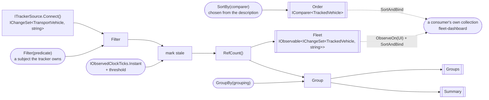
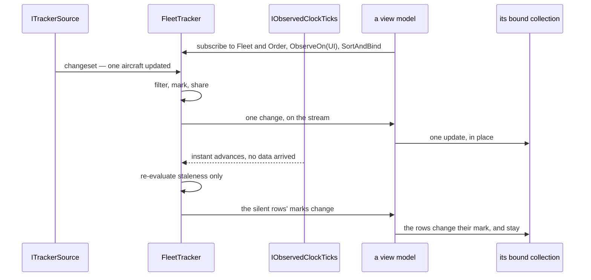

# Specification: Fleet pipeline

## 1. Business Goal

<!-- Rules: ../../../../.spec/templates/feature.md § 1 -->

`aircraft-source` built the half of the headline nobody shows: a polled snapshot becoming a changeset. It stops at the seam deliberately — its § 5 row 1 excludes the operators themselves and says building them is the next feature — so what exists today is a stream of domain vehicles arriving at an interface nothing consumes. The talk's claim is not that a snapshot can become a changeset; it is that **once it has, everything after it is an ordinary DynamicData pipeline**, indistinguishable from one fed by a push source. That claim is unproven while the pipeline does not exist, and it is the only part of the demo the audience will try to copy on Monday. This Feature builds the pipeline: one collection of `TransportVehicle`, built once at startup, filtered and sorted by inputs the user changes, grouped and counted, with a silent vehicle marked rather than vanishing — and a source description that supplies the columns and comparers, so swapping planes for ships swaps a registration and not a view. The failure state removed is a demo that can show data arriving and nothing being done with it.

## 2. User Needs

<!-- Rules: ../../../../.spec/templates/feature.md § 2 -->

| #   | Persona                                                                                                                               | Need                                                                                                                     | Pain point today                                                                                                                                                      |
| --- | ------------------------------------------------------------------------------------------------------------------------------------- | ------------------------------------------------------------------------------------------------------------------------ | --------------------------------------------------------------------------------------------------------------------------------------------------------------------- |
| 1   | Line-of-business .NET developer in the talk audience, whose data lives behind REST endpoints and SQL queries (README.md § "Audience") | To see that a polled source reaches the same operators a push source would, and to read the one place they are assembled | `aircraft-source` ends at `ITrackerSource`; the operators the audience came to see are named in a skill and a README table and exist nowhere in the source            |
| 2   | The same developer, whose own grid is re-queried and re-bound on every keystroke                                                      | A search box and a set of dropdowns that re-filter an existing collection without refetching or rebuilding anything      | Their current answer is a handler that clears a list and refills it, which is the pattern this demo exists to replace; nothing here yet shows the alternative         |
| 3   | The same developer, whose rows are a fixed set of columns compiled into the view                                                      | Columns, comparers and groupings that come from the source rather than from the markup                                   | With no description to supply them, a second source means editing the grid — which is the swap failing quietly rather than loudly                                     |
| 4   | The presenter, demonstrating that a feed can stop                                                                                     | A vehicle that goes silent to be visibly marked and kept, at a threshold they can set before the talk                    | Nothing derives staleness downstream of the seam; `TransportVehicle.IsStale` takes an instant and no caller passes one, so a row either vanishes or lies              |
| 5   | The presenter, at the closing act (README.md § "Closing act")                                                                         | The grid, filters, sorts, groups and counts to survive a source swap untouched                                           | `aircraft-source` B-042 claims only that the fleet tracker _owns_ a pipeline. Ownership of nothing survives any swap, so the closing act's claim is currently vacuous |
| 6   | Whoever maintains this repository after the talk                                                                                      | The pipeline assembled in one readable place, disposed deliberately                                                      | A pipeline grown a stage at a time across a view model, a page and a tracker is the shape every one of these skills' `Never add` lists is written against             |

## 3. Acceptance Criteria

<!-- Rules: ../../../../.spec/templates/feature.md § 3 -->

Thirty claims, in eight groups: **B-001 – B-005 and B-028** the spine —
what is built, when, what is published and who binds it; **B-006 – B-008** search
and filtering; **B-009 – B-011** sorting; **B-012 – B-015** grouping and
aggregates; **B-016 – B-019** staleness; **B-020 – B-022** the source
description; **B-023 and B-024** the boundaries; **B-025 – B-027** the arrival
notice.

B-029 and B-030 were added on 2026-10-07, from § 11 row 5: the filter control's
choices are of two kinds, and the pipeline is what each must come from. B-029
carries the choices the source declares — curated, offered whether or not a
vehicle satisfies one, and grouped with B-020 – B-022 because the description is
where they live. B-030 carries the choices the data holds, as the distinct values
of the current grouping key, and is grouped with B-012 – B-015 because it is an
aggregate over the same stream. Neither composes a predicate: `fleet-dashboard`
B-009 does that, and this Feature claims only what the pipeline offers it.

B-028 was added, and B-002 and B-005 amended, on 2026-10-05 by
[ADR-0009](../../../../.spec/adr/0009-the-pipeline-publishes-changesets-a-consumer-binds.md):
the pipeline publishes changeset streams and owns no bound collection, so the
`Bind` and the marshal to the UI scheduler belong to whoever consumes it. B-005
had required the opposite of [`mvvm`](../../../../.skills/mvvm/SKILL.md)
§ "Projecting state back", which puts marshalling at the view model boundary and
not deep inside the pipeline; the skill wins, and the claim is corrected to what
the pipeline actually owes — injected schedulers, and no marshalling on anyone's
behalf.

B-025 – B-027 were added on 2026-10-05, after the rest were written, when the
person asked for a visible sign that new data had arrived. They are the
pipeline's half of it — the signal — and they are here rather than in
`fleet-dashboard` because the tracker already holds the clock and derives the
counts, so a notice is the same derivation as the summary B-015 claims. What is
shown, and where, is `fleet-dashboard`'s.

**B-009 was amended on 2026-10-06**, on `0032`, because the library contradicted
its last clause. DynamicData's `SortAndBind` raises a single `Reset` when the
comparer changes, whatever the reset threshold, so "SHALL NOT clear, refill"
could not be read at the bound collection — and read there it would have failed a
pipeline that had done nothing wrong. The claim now says what the pipeline owes:
the same instances, reordered, with nothing re-fetched and no stage rebuilt,
which is what the test asserts. Rejected: keeping the words and marking the row
unprovable, and publishing `ISortedChangeSet` to get move notifications, which
ADR-0009 decision 2 turned down for widening `Fleet`'s type.

**B-031 was added on 2026-10-07**, at `fleet-dashboard`'s request: its § 11
row 6 asked what clears the refresh indicator B-028 carries, and the answer the
person took is the observed instant — every applied poll reports one
(`aircraft-source` B-003), including a poll whose data was identical, which is
the case a notice cannot cover because B-025 raises one only when something
changed. The clock already publishes that stream through `IObservedClockTicks`
(ADR-0010); what was missing is a consumer's way to reach it, since a view model
depends on `IFleetTracker` and nothing below it (`aircraft-source` B-041). So
this is a member on the published seam rather than a new dependency for a view
model, the same move `Notices` already makes with the same instant.
[`fleet-dashboard` decision 0001](../../Features/Fleet/.spec/decisions/0001-the-observed-instant-clears-the-refresh-indicator.md)
is the call; [`0059`](../.issue/0059-observed-instant-on-the-tracker.yml) builds it.

Claim ids are scoped to this specification. This Feature's `B-001` is not
`aircraft-source`'s, and neither is renumbered for the other
(`transponder-conventions` § "Claim ids are `B-00n`"). Where a claim of the other
Feature is cited it is written with its Feature's name.

| ID    | Claim                                                                                                                                                                                                                                                                                                                                                                              | Source                                                                        |
| ----- | ---------------------------------------------------------------------------------------------------------------------------------------------------------------------------------------------------------------------------------------------------------------------------------------------------------------------------------------------------------------------------------- | ----------------------------------------------------------------------------- |
| B-001 | The pipeline SHALL be constructed once, from `ITrackerSource.Connect()`, and SHALL NOT be rebuilt, re-subscribed or re-bound because the live source changed.                                                                                                                                                                                                                      | dynamic-data-pipeline § "The spine"; `aircraft-source` B-042                  |
| B-002 | The pipeline SHALL publish the fleet as a stream of changesets whose element carries the vehicle and its derived stale mark, and SHALL NOT own a bound collection; no tracker, pipeline stage or aggregate SHALL hold a second store of tracked items. What a consumer does with the stream is `fleet-dashboard` B-005's (§ 5 row 9).                                              | ADR-0009; dynamic-data-pipeline § "Never add"; mvvm § "Projecting state back" |
| B-003 | Every change to that collection SHALL arrive through the pipeline; no code SHALL add to, remove from, clear or reorder it imperatively.                                                                                                                                                                                                                                            | `aircraft-source` B-044; dynamic-data-pipeline § "Never add"                  |
| B-004 | Disposing the tracker SHALL complete every stream it publishes and dispose everything it created; while nothing is subscribed the tracker SHALL hold no subscription of its own. A source swap SHALL dispose nothing the pipeline needs and leak nothing it replaced.                                                                                                              | dynamic-data-pipeline § "Keep the pipeline the thing that does the work"      |
| B-005 | Every scheduler the pipeline uses SHALL be one it was given, and it SHALL NOT read `CurrentThreadScheduler`, `TaskPoolScheduler` or any other ambient scheduler inline; it SHALL NOT marshal to a user-interface thread on a consumer's behalf, because that is the consumer's boundary.                                                                                           | ADR-0009; mvvm § "Projecting state back"; `SchedulerProvider` remarks         |
| B-006 | Filtering SHALL be driven by a predicate value the caller hands the tracker: a new predicate SHALL re-evaluate the existing items and SHALL NOT re-subscribe to the source or refetch anything.                                                                                                                                                                                    | dynamic-data-pipeline § "The spine"; README.md § "DynamicData operators"      |
| B-007 | Before any caller sets a predicate, every vehicle the source reports SHALL be visible; the tracker SHALL hold that default itself rather than waiting for one, and an absent filter SHALL NOT be an empty fleet.                                                                                                                                                                   | Decided call — an empty grid at startup reads as a broken feed                |
| B-008 | No filter SHALL be applied by enumerating or editing the bound collection, and none SHALL be re-evaluated by a UI event handler.                                                                                                                                                                                                                                                   | maui-ui § "The UI reads; it never drives"                                     |
| B-009 | Sorting SHALL be driven by a comparer value the caller hands the tracker: a new comparer SHALL reorder the **existing item instances**, and SHALL NOT re-fetch them, rebuild a stage or re-subscribe to the seam. Which notification a bound collection raises for that reorder is the binding adapter's (amended 2026-10-06, below).                                              | dynamic-data-pipeline § "The spine"; maui-ui § "The UI reads"                 |
| B-010 | Every comparer SHALL come from the live source's description (B-020) and SHALL compare using members of `TransportVehicle` only.                                                                                                                                                                                                                                                   | maui-ui § "The swap test"; ADR-0005 item 6                                    |
| B-011 | A comparer SHALL break ties on `Key`, so the order is total and two sorts of an unchanged fleet produce the same sequence.                                                                                                                                                                                                                                                         | Decided call — rows swapping places on an unchanged fleet reads as churn      |
| B-012 | Grouping SHALL be driven by a grouping chosen from the description and handed to the tracker, and changing it SHALL regroup the existing items without rebuilding the pipeline.                                                                                                                                                                                                    | README.md § "UI features"; dynamic-data-pipeline § "The spine"                |
| B-013 | `TransportVehicle` SHALL declare the grouping answer as an `abstract` member, so a new source cannot inherit one; `Aircraft` SHALL answer with its origin country.                                                                                                                                                                                                                 | ADR-0005 item 2; README.md § "DynamicData operators"                          |
| B-014 | Each group SHALL carry its count of vehicles and its count of stale vehicles, derived from the same stream, and neither SHALL be computed by enumerating a collection bound from it.                                                                                                                                                                                               | README.md § "UI features"; dynamic-data-pipeline § "The spine"                |
| B-015 | A fleet-wide summary — vehicles tracked, vehicles stale, groups present — SHALL derive from the same stream as the collection and SHALL update as the collection does.                                                                                                                                                                                                             | README.md § "UI features"                                                     |
| B-016 | A vehicle silent for longer than the threshold SHALL be reported as stale **and SHALL remain in the fleet**, keyed and present in any collection bound from it.                                                                                                                                                                                                                    | README.md § "UI features"; dynamic-data-pipeline § "Staleness and expiry"     |
| B-017 | The staleness threshold SHALL be settable on the tracker and SHALL default to five minutes, held by the tracker rather than supplied by a caller at construction.                                                                                                                                                                                                                  | README.md § "UI features"                                                     |
| B-018 | Staleness SHALL be measured against the observed clock, SHALL NOT read `DateTime.UtcNow` or `DateTimeOffset.Now` inline, and SHALL be re-evaluated when the observed instant advances — so a vehicle becomes stale with no new data arriving for it.                                                                                                                               | `aircraft-source` B-043 and B-003; ADR-0007; ADR-0010                         |
| B-019 | No vehicle SHALL be removed from the fleet because it stopped reporting, and `ExpireAfter` SHALL NOT appear in this pipeline.                                                                                                                                                                                                                                                      | README.md § "DynamicData operators"; see § 5 row 2                            |
| B-020 | The live source SHALL supply a description naming the columns, comparers, grouping keys and filter choices available for it; each column SHALL be a display name plus a selector over `TransportVehicle`.                                                                                                                                                                          | maui-ui § "The swap test"; ADR-0005 item 6                                    |
| B-021 | Swapping the live source SHALL swap the description, and SHALL NOT require editing the pipeline, a comparer, a predicate or a grouping key.                                                                                                                                                                                                                                        | hot-swap-source; README.md § "Closing act"                                    |
| B-022 | No column, comparer, predicate, grouping key or aggregate SHALL downcast, type-test or `switch` on a concrete `TransportVehicle` subclass. **One exception**: a source's own description (B-029) MAY name the concrete type it was written for, and nothing else MAY — it is the per-source file a swap replaces, so a cast there cannot outlive the source it belongs to.         | ADR-0005 item 6; domain-model § "Never add"; § 11 row 6                       |
| B-023 | Nothing in this Feature SHALL name an API contract, an API type, a client, a cache, a snapshot or a concrete `ITrackerSource`.                                                                                                                                                                                                                                                     | `aircraft-source` B-047; hot-swap-source                                      |
| B-024 | Nothing in this Feature SHALL read a network, a file or a wall clock.                                                                                                                                                                                                                                                                                                              | dynamic-data-pipeline § "Testing"; see § 4 row 5                              |
| B-025 | The tracker SHALL publish a notice each time a changeset arrives carrying at least one change, and the notice SHALL carry the observed instant and the counts — vehicles tracked, and vehicles added, updated and removed by that changeset. A changeset carrying no change SHALL produce no notice.                                                                               | Decided call 2026-10-05; see § 7 § "The arrival notice"                       |
| B-026 | The notices SHALL be reachable as a stream paced by a caller-supplied minimum-interval observable, so two consumers SHALL be able to run at two different cadences at once and either SHALL be changeable while the application runs. An interval SHALL default to one second until a value arrives, and the most recent notice in a capped window SHALL be the one published.     | Decided call 2026-10-05; see § 4 rows 8 and 10                                |
| B-027 | The notices stream SHALL report a quiet notice when no changeset has arrived for longer than the staleness threshold, and a resumed notice on the next changeset after one, so silence is reported once rather than inferred from the absence of notices. The arrival timer SHALL be built per subscription, so the tracker holds none and B-028's teardown is not defeated by it. | Decided call 2026-10-05; `aircraft-source` decision 0002 (the swap's own)     |
| B-028 | The stages SHALL be shared: a second subscriber SHALL NOT cause a second connection to the seam, a second diff pass or a second evaluation of the filter, the sort or the stale mark, and the stages SHALL tear down when the last subscriber unsubscribes.                                                                                                                        | ADR-0009; dynamic-data-pipeline § "The spine"                                 |
| B-029 | The description SHALL carry the filter choices the live source offers, each a display name beside a predicate over `TransportVehicle`, and SHALL offer them whether or not any vehicle currently satisfies one — a choice is what the source admits, not what the data happens to hold.                                                                                            | § 11 row 6; `fleet-dashboard` B-009 and B-011                                 |
| B-030 | The tracker SHALL publish the distinct values the current grouping key takes across the fleet, as a changeset, so a choice can be offered for a value the data holds without any consumer enumerating the collection to find it.                                                                                                                                                   | § 11 row 6; `fleet-dashboard` B-009                                           |
| B-031 | The tracker SHALL publish the observed instant and every advance of it, so a consumer can tell a poll applied a response even when the response changed nothing; it SHALL re-publish the clock's own stream rather than hold a clock or read a wall clock, and the value SHALL be the instant the provider reported.                                                               | `fleet-dashboard` B-028 and decisions/0001; ADR-0010; `aircraft-source` B-003 |

## 4. Constraints

<!-- Rules: ../../../../.spec/templates/feature.md § 4 -->

| #   | Constraint                                                                                                                                                                                                  | Source                                                                                       | Impact                                                                                                                                                                                                                                                                                                                                                                                                                                                                                                                         |
| --- | ----------------------------------------------------------------------------------------------------------------------------------------------------------------------------------------------------------- | -------------------------------------------------------------------------------------------- | ------------------------------------------------------------------------------------------------------------------------------------------------------------------------------------------------------------------------------------------------------------------------------------------------------------------------------------------------------------------------------------------------------------------------------------------------------------------------------------------------------------------------------ |
| 1   | The seam is fixed and is not ours to widen: `ITrackerSource.Connect()` returns `IObservable<IChangeSet<TransportVehicle, string>>` and nothing else.                                                        | `aircraft-source` B-033, ADR-0002                                                            | Everything this Feature needs arrives as a changeset of the abstract base. A member a column wants and the base does not carry comes from the description (B-020), never from widening the seam or the base.                                                                                                                                                                                                                                                                                                                   |
| 2   | `IFleetTracker` exists, in a file another Feature owns: `aircraft-source` item `0007` declared it, gave it the clock, and published `Fleet` and `StaleAfter` (`src/Transponder/Tracking/IFleetTracker.cs`). | `aircraft-source` § Tasks; `0007`, on `main` at `be7b6ef`                                    | The prerequisite every item here names is satisfied in the tree. What this Feature adds are § 7's members on a file another Feature created — which is why § 7 writes members rather than the whole interface, and why a member already declared is not re-declared. `Fleet` already carries the stale mark and shares the chain, so B-001, B-002, B-004 and B-028 are claims about code that partly exists; the rest of § 7's surface — the scheduler provider, the description, the three remaining inputs — does not.       |
| 3   | `IObservedClock` exposes `Current` and no observable, so nothing can notice the instant advancing.                                                                                                          | `src/Transponder/Tracking/IObservedClock.cs`                                                 | B-018's second clause cannot be satisfied by reading `Current`. [ADR-0010](../../../../.spec/adr/0010-a-third-seam-carries-the-observed-clocks-ticks.md) adds a third read-side seam, `IObservedClockTicks`, rather than widening the interface `aircraft-source` published; both existing interfaces are untouched, so ADR-0007's separation holds unamended.                                                                                                                                                                 |
| 4   | A projection builds a **new** `Aircraft` per change: `AircraftTrackerSource` uses `Transform`, so an updated vehicle arrives as a replacement, not as a mutated instance.                                   | `src/Transponder/Tracking/Sources/AircraftTrackerSource.cs`                                  | `AutoRefresh` has no subject in this pipeline as it stands — there are no in-place property changes to refresh on. This is an open question, not a silent omission: § 7's decision block and § 11 row 1 carry it, and no claim depends on it.                                                                                                                                                                                                                                                                                  |
| 5   | No test here may reach a network, a file or the wall clock, and both schedulers are injected.                                                                                                               | `transponder-conventions` § `test-from-scenarios`; `SchedulerProvider` remarks               | A test feeds a changeset in and advances one `TestScheduler`. The clock is a double returning instants the test chose, which is also what makes B-018 provable without waiting five minutes.                                                                                                                                                                                                                                                                                                                                   |
| 6   | Staleness is **marked** for aircraft and **expiring** is a vessel treatment; the two are not interchangeable.                                                                                               | dynamic-data-pipeline § "Staleness and expiry"; README.md § "DynamicData operators"          | B-019 forbids `ExpireAfter` in this pipeline outright. The vessel source will need the other treatment, and it gets it in its own specification rather than by a flag here.                                                                                                                                                                                                                                                                                                                                                    |
| 7   | DynamicData is already referenced centrally; nothing here adds a package.                                                                                                                                   | `Directory.Packages.props`; `aircraft-source` § 4 row 17                                     | No central-package change belongs to this Feature. An item that needs one has found a design problem, not a missing dependency.                                                                                                                                                                                                                                                                                                                                                                                                |
| 8   | The notice interval is changed live, on stage, as part of the demo.                                                                                                                                         | Decided call 2026-10-05 (the person)                                                         | B-026's interval is an observable rather than an option read at startup. The input field is `fleet-dashboard`'s; the pipeline only promises that a new value takes effect without anything being rebuilt (B-001).                                                                                                                                                                                                                                                                                                              |
| 9   | A notice is a value, not a presentation. It carries an instant and counts, and nothing about a banner, a toast, a duration or a colour.                                                                     | mvvm § "Thin means"; domain-model § "Never add"                                              | B-025's notice is bindable by anything and renderable by anything. What is shown for which notice is `fleet-dashboard`'s, which is what lets the same notice drive a banner and a toast without the pipeline knowing either exists.                                                                                                                                                                                                                                                                                            |
| 10  | The banner and the toast pace independently — one can update every second while the other interrupts once a minute.                                                                                         | Decided call 2026-10-05 (the person)                                                         | The cap is **per consumer**, so it is not a member holding one interval. B-026 makes the notices a stream a caller paces, which keeps the rate-cap operator in the pipeline (one implementation, tested once) and the cadence with whoever is showing something. It also keeps `IFleetQuery` at four members rather than growing the bag § 11 row 4 concern 2 flags.                                                                                                                                                           |
| 11  | The pipeline publishes changeset streams and owns no bound collection ([ADR-0009](../../../../.spec/adr/0009-the-pipeline-publishes-changesets-a-consumer-binds.md)).                                       | ADR-0009; mvvm § "Projecting state back"                                                     | `Bind` and `ObserveOn(UserInterfaceThread)` are the consumer's, which is what B-002 and B-005 now say. A stage that needs a materialised collection to work has found a design problem: every stage here operates on a changeset.                                                                                                                                                                                                                                                                                              |
| 12  | The stages are shared by DynamicData's cache-aware `RefCount()` — not Rx's `Publish().RefCount()` pair.                                                                                                     | ADR-0009; DynamicData 9.4.33 `ObservableCacheEx.RefCount`                                    | One upstream subscription, an internal cache created on the first subscriber and disposed when the last unsubscribes. B-028 is provable by subscribing twice and counting connections to the seam. A consumer joining while another is bound reads the current fleet from that cache; the first one to arrive after every consumer has gone waits for the next changeset.                                                                                                                                                      |
| 13  | The tracker is a container singleton, disposed by the container; the view model disposes only its own `Bind` subscription.                                                                                  | ADR-0009; item [`0040`](../../../../.issue/0040-actor-wiring-and-tracker-lifetime-spike.yml) | B-004 is proved in a unit test that constructs the tracker directly, so no container stands between the claim and the assertion. How an actor above the seam gets its collaborators, and who starts the first poll, were `0040`'s and are answered: the dependency resolver and the first subscription, written out in `fleet-dashboard` § 7. The spike closed on 2026-10-07, and its finding on this row was that the singleton was already decided here and in the registration, and recorded in neither as an answer to it. |
| 14  | The four inputs are methods on the tracker, each ticking a `BehaviorSubject<T>` it owns and seeded with the claimed default.                                                                                | ADR-0009                                                                                     | B-007 and B-017's defaults are the pipeline's to keep, not a caller's to remember with `StartWith`. A test calls a method rather than constructing four subjects, and a view model sets a value from a property setter without owning any Rx. B-003 still holds because a method hands a value to a stage and touches no collection (§ 7).                                                                                                                                                                                     |

## 5. Out of Scope

<!-- Rules: ../../../../.spec/templates/feature.md § 5 -->

| #   | Item                                                                                                                   | Exclusion reason                                                                                                                                                                                                                                                                                                                                                   |
| --- | ---------------------------------------------------------------------------------------------------------------------- | ------------------------------------------------------------------------------------------------------------------------------------------------------------------------------------------------------------------------------------------------------------------------------------------------------------------------------------------------------------------ |
| 1   | Every MAUI surface — the grid, the search box, the dropdowns, the master-detail pane, the summary row, the view models | The dashboard is its own Feature, `fleet-dashboard`. This one is provable with no UI at all, and keeping the split means the pipeline's claims cannot be "satisfied" by a screenshot. The view models call the predicate, comparer and grouping-key methods § 4 row 14 names; this Feature claims what a stage does with a value, never where the value came from. |
| 2   | `ExpireAfter`, and removal on silence                                                                                  | B-019 excludes it here. It is the vessel treatment, and it belongs to the closing act's specification where going silent means gone rather than quiet.                                                                                                                                                                                                             |
| 3   | The map view                                                                                                           | README.md § "UI features" marks it optional, and a map is a surface rather than a pipeline stage. Nothing here forecloses it: a map binds the same one collection B-002 requires.                                                                                                                                                                                  |
| 4   | Turning search text and dropdown selections into a predicate                                                           | `mvvm` § "Two kinds of input, two routes" puts that in the view model, which supplies the predicate the user chose. This Feature claims what the pipeline does with a predicate, not how one is composed.                                                                                                                                                          |
| 5   | The source swap itself — the decorator, the disposal of an outgoing source, the busy indicator                         | `aircraft-source` `0006` owns it (its B-038 – B-040). This Feature claims only that the swap costs the pipeline nothing (B-001, B-021).                                                                                                                                                                                                                            |
| 6   | Recording and replay                                                                                                   | `replay-source` owns both. The pipeline cannot tell a replayed changeset from a live one, which is the point; it therefore says nothing about either.                                                                                                                                                                                                              |
| 7   | A second grouping level, grouped aggregates beyond count, and user-defined columns                                     | No need in §§ 1-2 asks for any of them, and `domain-model` § "Never add" rules out the third level the first would invite.                                                                                                                                                                                                                                         |
| 8   | A live poll interval, and the OpenSky credit cost shown beside it                                                      | [`decisions/0002`](decisions/0002-the-poll-interval-is-not-a-live-input.md) keeps the poll a startup option of `aircraft-source`'s: pacing a notice costs nothing, and a faster poll spends credits from a daily 4,000 (README.md § "Limits"). B-026's notice interval stays live.                                                                                 |
| 9   | The `Bind` call itself, and the `ReadOnlyObservableCollection` it produces                                             | ADR-0009 puts both in the consumer. This Feature publishes the changesets and claims what they contain (B-002); which collection is materialised, on which scheduler, and disposed with what, is `fleet-dashboard`'s — and a test here binds one itself rather than asserting a view's.                                                                            |

## 6. Concern Separation

<!-- Rules: ../../../../.spec/templates/feature.md § 6 -->

| Item                                                                    | Classification | Notes                                                                                                                                                                                                                 |
| ----------------------------------------------------------------------- | -------------- | --------------------------------------------------------------------------------------------------------------------------------------------------------------------------------------------------------------------- |
| A silent vehicle is marked, not removed, at a configurable five minutes | Business       | § 2 need 4 and README.md § "UI features". The threshold is a product number; what reads it is technical. B-016, B-017.                                                                                                |
| One collection, materialised by whoever binds, never rebuilt on a swap  | Both           | Business, because § 2 need 5 is the closing act's claim; technical, because the mechanism is subscription lifetime and disposal. B-001 – B-004.                                                                       |
| A column, comparer and grouping key come from the source                | Both           | Business: a second source must not mean editing the grid (§ 2 need 3). Technical: the description is what replaces the downcast ADR-0005 item 6 forbids. B-020 – B-022.                                               |
| Filtering and sorting take values through the tracker's methods         | Technical      | The user-visible behavior is the dashboard's; what the pipeline owes it is re-evaluation without a rebuild. B-006, B-009.                                                                                             |
| Counts per group and for the fleet                                      | Business       | § 2 need 1 — the summary row is part of what the audience is shown. Derivation from the same stream is the technical half. B-014, B-015.                                                                              |
| Staleness is measured against the observed clock                        | Technical      | The business statement is row 1 above. That the instant comes from the provider rather than the wall clock is ADR-0007's, and under replay it is the difference between a loaded fleet and a fleet that is all stale. |
| The boundaries                                                          | Technical      | B-022 – B-024 constrain what may name what. No business statement is served by them directly; the swap they protect is § 2 need 5's.                                                                                  |
| Who calls `Bind`, and where the marshal happens                         | Technical      | ADR-0009. No business statement is served either way: the audience sees the same grid. What it buys is a pipeline provable with no view model, and a `mvvm` rule that stops contradicting a claim. B-002, B-005.      |
| One connection to the seam however many consumers                       | Both           | Business, because a second diff pass over the same snapshots spends OpenSky credits the day's budget is counted in. Technical, because the mechanism is DynamicData's cache-aware `RefCount()`. B-028.                |

## 7. Technical Design

<!-- Rules: ../../../../.spec/templates/feature.md § 7 -->

The pipeline is one object's constructor and one disposal. `FleetTracker` takes
the seam, the clock and its ticks, the scheduler provider, the live source's
description and the four inputs the user changes; it builds the stages once in
the order `dynamic-data-pipeline` § "The spine" names; and it **publishes
observables** — the fleet, the groups, the summary, the description and the
notices. It binds nothing and holds no collection
([ADR-0009](../../../../.spec/adr/0009-the-pipeline-publishes-changesets-a-consumer-binds.md)),
and nothing else in the application subscribes to the seam.

The constructor takes only collaborators, and the inputs are methods:

```csharp
public FleetTracker(
    ITrackerSource source,
    IObservedClock clock,
    IObservedClockTicks ticks,
    ISchedulerProvider schedulers,
    IObservable<FleetSourceDescription> description)

/// <summary>Shows only the vehicles the predicate matches (B-006).</summary>
public void Filter(Func<TransportVehicle, bool> predicate);

/// <summary>Orders the fleet by a comparer from the description (B-009, B-010).</summary>
public void SortBy(IComparer<TransportVehicle> comparer);

/// <summary>Regroups the fleet under one of the description's groupings (B-012).</summary>
public void GroupBy(FleetGrouping grouping);

/// <summary>Sets how long a vehicle may be silent before it is marked (B-017).</summary>
public void StaleAfter(TimeSpan threshold);
```

Behind each method is a `BehaviorSubject<T>` the tracker owns, seeded with the
default the specification names: a predicate matching everything (B-007), the
description's first comparer and first grouping, and five minutes (B-017). Each
stage of the chain reads its subject, so a method call is a value arriving at a
stage and nothing more.

**Three of the four inputs feed a stage; `SortBy` feeds a published value**
(ADR-0009 decision 2, amended 2026-10-06). There is no sort stage in the chain:
DynamicData's `Sort` produces an `ISortedChangeSet`, the `Transform` that derives
the stale mark returns a plain changeset, and the order would be gone before
anything was published — the pipeline would sort and no consumer could honour it.
So the tracker publishes `Order`, the comparer it currently holds, adapted to the
published element and with B-011's key tie-break appended; the consumer sorts as
it binds, with DynamicData 9's `SortAndBind`. B-009 is unchanged, because it
claims a new comparer reorders the existing items in place and never named where
the operator sits.

**Why the methods rather than four observable parameters**, which is what an
earlier draft of ADR-0009 decided and what the § 11 row 4 review first replaced
`IFleetQuery` with:

- **The defaults live where the claims are.** B-007 and B-017 are the pipeline's
  promises, and with observables passed in they were kept by every caller
  remembering `StartWith`. A caller that forgot produced an empty grid at
  startup — the exact failure B-007 exists to forbid — and no test of the
  pipeline could catch it.
- **A caller does not have to own Rx to drive it.** A view model sets a value
  from a property setter; a test calls `Filter(v => v.IsAirborne)` instead of
  constructing four subjects and remembering which one feeds which stage.
- **The seam stops being shaped by its consumer**, which was concern 2's actual
  complaint. Four parameters answered it by moving the shape into a constructor;
  a method surface answers it by naming each input as an operation the pipeline
  offers.

**These methods set values; they never touch the collection.** That is the line
B-003 draws, and it is worth stating because the shape no longer makes it
obvious: an earlier draft had no settable member at all and could say "there is
nothing to drive". Now there is. What makes B-003 hold is that no method adds,
removes, clears or reorders anything — each one hands a value to a stage and the
pipeline re-derives, which is also why B-006, B-009 and B-012 claim the
re-evaluation rather than the call.

The stages are shared with DynamicData's `RefCount()` — **not** Rx's
`Publish().RefCount()` pair. The library's own is cache-aware: one upstream
subscription, an internal cache created on the first subscriber and disposed when
the last unsubscribes, so a consumer subscribing while another is bound reads the
current fleet rather than only later changes (B-028, § 4 row 12).

**Domain model**

The two additions this Feature makes to existing types, and the types it
introduces. `TransportVehicle` and `Aircraft` exist; the member below is new on
each (B-013).

| Field                              | Type                                              | Notes                                                                                                                                                                                                  |
| ---------------------------------- | ------------------------------------------------- | ------------------------------------------------------------------------------------------------------------------------------------------------------------------------------------------------------ |
| `TransportVehicle.GroupKey`        | `string`, `abstract`                              | The answer a view groups by, abstract so a new source cannot inherit one (ADR-0005 item 2, B-013). A string because a grouping key is a label, and the description names which key is being asked for. |
| `Aircraft.GroupKey`                | `string`, `override`                              | The origin country. `OriginCountry` is already non-optional and defaults to empty, so the key is never absent.                                                                                         |
| `FleetColumn.Name`                 | `string`                                          | What a header shows.                                                                                                                                                                                   |
| `FleetColumn.Value`                | `Func<TransportVehicle, string>`                  | The cell, already display-formatted. A selector rather than a member name, so no reflection and no cast (B-020, B-022).                                                                                |
| `FleetColumn.Comparer`             | `Option<IComparer<TransportVehicle>>`             | Absent when the column is not sortable, which is a fact about the column rather than a null to remember (`language-ext-usage`).                                                                        |
| `FleetGrouping.Name`               | `string`                                          | What the grouping dropdown shows — "Origin country", "Category".                                                                                                                                       |
| `FleetGrouping.Key`                | `Func<TransportVehicle, string>`                  | How the group is read. The default grouping's selector is `GroupKey`; a second grouping a source offers supplies its own.                                                                              |
| `FleetSourceDescription.Columns`   | `IReadOnlyList<FleetColumn>`                      | In display order (B-020).                                                                                                                                                                              |
| `FleetSourceDescription.Groupings` | `IReadOnlyList<FleetGrouping>`                    | What this source can be grouped by.                                                                                                                                                                    |
| `FleetSourceDescription.Filters`   | `IReadOnlyList<FleetFilterChoice>`                | The curated choices this source offers, in the order the control shows them (B-029). Empty is legal and means the control offers search alone.                                                         |
| `FleetFilterChoice.Name`           | `string`                                          | What the control shows — "On the ground", "Airborne".                                                                                                                                                  |
| `FleetFilterChoice.Matches`        | `Func<TransportVehicle, bool>`                    | What a vehicle must satisfy. Built in the source's own description, which is the one place a cast to the concrete type is allowed (B-022's exception, B-029).                                          |
| `FleetSummary.Tracked`             | `int`                                             | Vehicles in the fleet (B-015).                                                                                                                                                                         |
| `FleetSummary.Stale`               | `int`                                             | How many of them are stale.                                                                                                                                                                            |
| `FleetSummary.Groups`              | `int`                                             | Groups present under the current grouping.                                                                                                                                                             |
| `FleetGroup.Key`                   | `string`                                          | The group's value.                                                                                                                                                                                     |
| `FleetGroup.Count`                 | `int`                                             | Vehicles in the group (B-014).                                                                                                                                                                         |
| `FleetGroup.StaleCount`            | `int`                                             | How many of them are stale (B-014). Derived from the same stream, never by enumerating anything bound.                                                                                                 |
| `FleetGroup.Vehicles`              | `IObservable<IChangeSet<TrackedVehicle, string>>` | The group's rows as a stream, so a consumer rendering one group binds it and one that needs only the counts does not. Not a second store of items (B-002, ADR-0009).                                   |
| `TrackedVehicle.Vehicle`           | `TransportVehicle`                                | What the published element carries: the vehicle and whether it is currently stale. The flag is **not** stored on the vehicle — `domain-model` § "Never add" forbids that, and the clock moves.         |
| `TrackedVehicle.IsStale`           | `bool`                                            | Derived at the moment the pipeline evaluated it, from `TransportVehicle.IsStale(asOf, threshold)` (B-016, B-018).                                                                                      |
| `FleetNotice.Kind`                 | `FleetNoticeKind`                                 | `Updated`, `Quiet` or `Resumed` (B-025, B-027). An enum rather than three types, because every consumer handles all three and a hierarchy would be matched on.                                         |
| `FleetNotice.Instant`              | `DateTimeOffset`                                  | The observed instant the notice reports, read from the clock (B-018). Never a wall-clock read.                                                                                                         |
| `FleetNotice.Tracked`              | `int`                                             | Vehicles in the fleet when the notice was raised.                                                                                                                                                      |
| `FleetNotice.Added`                | `int`                                             | Vehicles the changeset added (B-025).                                                                                                                                                                  |
| `FleetNotice.Updated`              | `int`                                             | Vehicles it updated.                                                                                                                                                                                   |
| `FleetNotice.Removed`              | `int`                                             | Vehicles it removed. `Added + Updated + Removed` is zero only for a `Quiet` or `Resumed` notice, because B-025 raises none for an empty changeset.                                                     |

**The element is `TrackedVehicle`, renamed in review.** It was `StaleVehicle`
until `0007`'s pull request, where the person asked why a type every instance of
which is tracked is named for the state a few of them carry. The rows above and
the interface below use the new name; § 11 row 4's record of the review that
chose the wrapper keeps the old one, because that is what was decided that day.

**The arrival notice**

The person asked for a visible sign that new data had arrived. The pipeline's
half is the signal, and three decisions shape it.

**A notice is raised by a changeset that changed something, not by a poll.**
`EditDiff` already answers "did anything move": a fetch where no aircraft
reported differently produces an empty changeset, and B-025 raises nothing for
it. So silence means "nothing moved", which is information, and the alternative
— a notice per envelope — would announce 180 non-events in a 45-minute talk.
`Quiet` and `Resumed` (B-027) are what keep "nothing moved" distinguishable
from "the feed stopped", which is the one case where the absence of notices is
not information.

**The cap is per consumer, not per tracker.** The banner and the toast pace
independently (§ 4 row 10), so the notices are reached through a stream a caller
paces rather than through a property holding one interval:

```csharp
/// <summary>Notices, paced by the caller (B-025 – B-027).</summary>
/// <param name="minimumInterval">The least time between notices; a new value takes effect without rebuilding anything.</param>
IObservable<FleetNotice> Notices(IObservable<TimeSpan> minimumInterval);
```

Two callers, two cadences, one rate-cap operator — written and tested once, in
the pipeline, which is what keeps `fleet-dashboard` from implementing throttling
twice and differently. That it is a method on an interface of properties is
§ 11 row 4 concern 7, and the review kept it: pacing is an operator with
behaviour to test, not a projection a consumer shapes.

**The derivation is per subscription, and the tracker holds none.** This is what
the 2026-10-05 review forced (§ 12 finding 1): a quiet notice needs the gaps
between arrivals timed, and a tracker-held timer would keep the shared chain's
reference count above zero forever — defeating B-028's teardown and running the
chain with nobody watching. So `Notices` builds its own pipeline per call, over
the same shared stream:

```csharp
public IObservable<FleetNotice> Notices(IObservable<TimeSpan> minimumInterval) =>
    Observable.Defer(() => _fleet
        .WithArrivalInstants(_ticks)      // Updated, Quiet, Resumed
        .SelectNotices(_staleThreshold)
        .CapTo(minimumInterval))          // the rate cap, one implementation
        .TakeUntil(_shutdown);
```

No field holds a subscription, so silence is reported while someone is listening
and not otherwise — which is the whole of what is lost, and nobody was there to
hear it.

`_shutdown` is what makes `IDisposable` mean something once the tracker holds no
subscriptions: `Dispose()` completes it, every published stream is
`TakeUntil`-ed by it, and a bound consumer's collection stops receiving changes
because its source completed. That is B-004 as amended — disposal is observable
in the streams rather than in a list of handles.

**A notice carries values, not presentation** (§ 4 row 9). No duration, no
colour, no severity, no text. `Quiet` is a fact about the feed; that it is worth
interrupting someone for is a judgement, and it is made in
`fleet-dashboard`.

**Diagrams**



The dotted edges are the Feature boundary. Everything left of them is this
specification's; the `SortAndBind` on the right is `fleet-dashboard`'s, and § 5
row 9 says so. `Order` crosses as a value, which is why the sort reorders rows a
consumer already holds rather than refilling them.



Class diagram: not applicable — the shape is one class and six records, and the
member tables above state it without a second rendering to keep in step. State
machine: not applicable — the tracker has no modes; `FleetNoticeKind` is a value
on a notice, not a state the tracker sits in.

**Interface changes**

The review § 11 row 4 asked for landed on 2026-10-05, and these are the shapes
it decided ([ADR-0009](../../../../.spec/adr/0009-the-pipeline-publishes-changesets-a-consumer-binds.md),
[ADR-0010](../../../../.spec/adr/0010-a-third-seam-carries-the-observed-clocks-ticks.md)).
They are no longer provisional. Nothing in § 3 names a type, so the amendments
the review cost were the two claims whose _obligation_ changed, B-002 and B-005,
plus B-028 for the sharing — not one claim per declaration.

`IFleetTracker`'s file is created by `aircraft-source` `0007`; these are the
members this Feature adds to it, and they are written out because the file does
not exist yet (`transponder-conventions` § "Declarations in § 7").

```csharp
public interface IFleetTracker : IDisposable
{
    /// <summary>Gets the fleet, shared, for a consumer to bind (B-002, B-028).</summary>
    IObservable<IChangeSet<TrackedVehicle, string>> Fleet { get; }

    /// <summary>Gets the current grouping's groups (B-012).</summary>
    IObservable<IChangeSet<FleetGroup, string>> Groups { get; }

    /// <summary>Gets the counts, derived from the same stream as the fleet (B-015).</summary>
    IObservable<FleetSummary> Summary { get; }

    /// <summary>Gets the live source's columns and groupings (B-020).</summary>
    IObservable<FleetSourceDescription> Description { get; }

    /// <summary>Gets the order to bind by: the chosen comparer, over the published element, ties broken on the key (B-009 – B-011).</summary>
    IObservable<IComparer<TrackedVehicle>> Order { get; }

    /// <summary>Gets the observed instant, and every advance of it — one per applied poll, identical data included (B-031).</summary>
    IObservable<DateTimeOffset> Observed { get; }

    /// <summary>Notices, paced by the caller (B-025 – B-027).</summary>
    /// <param name="minimumInterval">The least time between notices; a new value takes effect without rebuilding anything.</param>
    IObservable<FleetNotice> Notices(IObservable<TimeSpan> minimumInterval);

    /// <summary>Shows only the vehicles the predicate matches (B-006).</summary>
    void Filter(Func<TransportVehicle, bool> predicate);

    /// <summary>Orders the fleet by a comparer from the description (B-009).</summary>
    void SortBy(IComparer<TransportVehicle> comparer);

    /// <summary>Regroups the fleet under one of the description's groupings (B-012).</summary>
    void GroupBy(FleetGrouping grouping);

    /// <summary>Sets how long a vehicle may be silent before it is marked (B-017).</summary>
    void StaleAfter(TimeSpan threshold);
}
```

Every member that publishes is a stream, so nothing on this interface is
UI-affine and a consumer need not know which thread it is on to read one. The
four inputs are methods, each taking the value itself: the tracker owns the
subject behind each and the default it starts at (above). **There is no
`IFleetQuery`** — an earlier draft declared one and the § 11 row 4 review deleted
it, because a seam shaped by its only implementer is the pipeline's input
pointing at its consumer.

One new interface, beside the two `aircraft-source` published rather than
widening either (§ 4 row 3, ADR-0010):

```csharp
public interface IObservedClockTicks
{
    /// <summary>Gets the observed instant, and every advance of it (B-018).</summary>
    IObservable<DateTimeOffset> Instant { get; }
}
```

`ObservedClock` implements it alongside `IObservedClock` and
`IObservedClockWriter`. Neither of those changes: the write side still only sets,
and a consumer holding a read side still cannot advance time (ADR-0007
decision 1).

**`Observed` is that stream re-published, with two things a consumer has to know
(B-031, built by `0059`).** The tracker puts its own shutdown on it and no
operator between — no `DistinctUntilChanged`, because the same instant reported
twice is two polls and deduplicating would leave `fleet-dashboard`'s indicator
spinning after the second; and no `ObserveOn`, because the pipeline marshals for
nobody (B-005). The two things, both asserted by a test rather than left to be
found:

- **Subscribing is itself an emission.** The clock holds the instant in force
  behind a `BehaviorSubject`, so a subscriber reads it immediately — before any
  poll, that is `DateTimeOffset.MinValue`. A consumer timing something from a
  gesture must skip the value it gets on subscription, or it reads its own press
  as the poll it was waiting for. `fleet-dashboard` `0058` is that consumer.
- **The value is the provider's, never a wall clock.** Under replay it comes from
  the recording, which is the whole of ADR-0007 and what makes a replayed fleet
  age correctly rather than being stale on load.

| Type                                                     | File                                                                                                     | Claims it makes visible                                   |
| -------------------------------------------------------- | -------------------------------------------------------------------------------------------------------- | --------------------------------------------------------- |
| `TransportVehicle`                                       | [`src/Transponder/Model/TransportVehicle.cs`](../../Model/TransportVehicle.cs)                           | B-013                                                     |
| `Aircraft`                                               | [`src/Transponder/Model/Aircraft.cs`](../../Model/Aircraft.cs)                                           | B-013                                                     |
| `IObservedClock`                                         | [`src/Transponder/Tracking/IObservedClock.cs`](../IObservedClock.cs)                                     | B-018                                                     |
| `IObservedClockTicks`                                    | [`src/Transponder/Tracking/IObservedClockTicks.cs`](../IObservedClockTicks.cs)                           | B-018, B-031                                              |
| `FleetColumn`, `FleetGrouping`, `FleetSourceDescription` | [`src/Transponder/Tracking/Fleet/`](../Fleet)                                                            | B-020 – B-022, B-029                                      |
| `FleetFilterChoice`                                      | [`src/Transponder/Tracking/Fleet/FleetFilterChoice.cs`](../Fleet/FleetFilterChoice.cs)                   | B-029                                                     |
| `AircraftFleetDescription`                               | [`src/Transponder/Tracking/Sources/AircraftFleetDescription.cs`](../Sources/AircraftFleetDescription.cs) | B-020, B-021, B-029                                       |
| `TrackedVehicle`, `FleetTracker`                         | [`src/Transponder/Tracking/`](..)                                                                        | B-001 – B-005, B-009 – B-011, B-016 – B-019, B-028, B-031 |
| `FleetGroup`                                             | [`src/Transponder/Tracking/Fleet/FleetGroup.cs`](../Fleet/FleetGroup.cs)                                 | B-012, B-014                                              |
| `FleetSummary`                                           | [`src/Transponder/Tracking/Fleet/FleetSummary.cs`](../Fleet/FleetSummary.cs)                             | B-015                                                     |
| `FleetNotice`, `FleetNoticeKind`                         | [`src/Transponder/Tracking/Fleet/`](../Fleet)                                                            | B-025 – B-027                                             |

Where the new types go, following `transponder-conventions` § "Project
structure":

```
src/Transponder/Tracking/          FleetTracker's pipeline, IObservedClockTicks, TrackedVehicle
src/Transponder/Tracking/Fleet/    FleetColumn, FleetGrouping, FleetFilterChoice, FleetSourceDescription, FleetGroup, FleetSummary, FleetNotice
```

The description lives under `Tracking/` rather than `Model/` deliberately: it
describes how a source is _presented_, which is not a domain fact, and
`domain-model` § "Never add" keeps UI-shaped types out of the model.

**What `0033` settled in building it**

Four things the section above left open, and all four are visible in the code
rather than only here.

- **The groups are formed by the operator's own regrouper, not by switching
  streams.** The group key selector reads the grouping subject on every
  evaluation and `GroupBy` pushes a value that re-evaluates membership, so a new
  grouping re-forms the groups over the items already there. Rejected: selecting
  a new group stage per grouping and `Switch`ing between them, which drops the
  shared chain's reference count to zero at the moment of the switch and
  reconnects the seam — B-012's "rebuilds nothing" failing in exactly the way
  B-028 is about.
- **The default grouping is the vehicle's own answer**, held by the tracker like
  the default predicate and the default threshold. Waiting for the description to
  supply one would leave the groups empty until it arrived, and an empty group
  stream and a fleet with no groups are the same value — so no test of the
  pipeline could tell them apart.
- **The summary is derived from the groups rather than from the fleet and the
  groups.** All three counts come off one stream: the tracked count sums the
  groups' counts, the stale count sums theirs, and the group count is the group
  stream's own. Combining two streams instead published twice per change, the
  first time with one half of the counts a change behind — a summary a view
  could render inconsistent.
- **The notices are counted from the stage above the stale mark.** That stage
  carries what the seam reported; the mark's re-derivation is not an arrival. A
  notice per re-marked vehicle would announce the passage of time as new data,
  and worse, it would make a quiet spell undetectable — the clock tick that
  detects silence would itself be producing the changesets that disprove it.

**No open decisions.**

`AutoRefresh` was the one open block here, and it is closed:
[`decisions/0001`](decisions/0001-no-autorefresh-in-this-pipeline.md) took option
A on 2026-10-05. There is no `AutoRefresh` stage, because `AircraftTrackerSource`
projects with `Transform` and an updated aircraft arrives as a new instance — § 4
row 4's fact, and nothing to refresh on. Staleness re-evaluates on
`IObservedClockTicks.Instant` (B-018), and a vehicle's value changes arrive as
changeset updates that `Filter` already sees, and that a consumer's `SortAndBind` re-orders on. README.md's operator
table now records where the operator would apply and why this pipeline does not
reach for it.

The shapes above came out of the § 11 row 4 review and are recorded in ADR-0009
and ADR-0010 rather than here; what is left for this section is to follow the
code once it exists — a declaration becomes a type-table row when its file
lands (`transponder-conventions` § "Declarations in § 7").

## 8. Testing Strategy

<!-- Rules: ../../../../.spec/templates/feature.md § 8 -->

**Testability assessment**

| Dimension          | Verdict       | Finding                                                                                                                                                                                                                                                                                                                                                                              | Recommendation                                                                                                                                                                                                                                                                                                                                                                                                                                                                                                                                                                                                                                                                                                                                                                                                                                                                                                                                                                                |
| ------------------ | ------------- | ------------------------------------------------------------------------------------------------------------------------------------------------------------------------------------------------------------------------------------------------------------------------------------------------------------------------------------------------------------------------------------ | --------------------------------------------------------------------------------------------------------------------------------------------------------------------------------------------------------------------------------------------------------------------------------------------------------------------------------------------------------------------------------------------------------------------------------------------------------------------------------------------------------------------------------------------------------------------------------------------------------------------------------------------------------------------------------------------------------------------------------------------------------------------------------------------------------------------------------------------------------------------------------------------------------------------------------------------------------------------------------------------- |
| DI seams           | Pass          | The tracker takes the seam, the clock and its ticks, the scheduler provider and the description by constructor and constructs none of them; the four inputs are method calls, so a test drives the pipeline with a `SourceCache<TransportVehicle, string>` it owns and four calls, binding the fleet stream itself, with no provider, no HTTP and no UI anywhere in the arrangement. | —                                                                                                                                                                                                                                                                                                                                                                                                                                                                                                                                                                                                                                                                                                                                                                                                                                                                                                                                                                                             |
| Behavior isolation | Pass          | Each stage is observable at its own output: the collection for filter and staleness, `Order` for the comparer, `Groups` for grouping, `Summary` for the aggregates. A failing assertion names a stage.                                                                                                                                                                               | —                                                                                                                                                                                                                                                                                                                                                                                                                                                                                                                                                                                                                                                                                                                                                                                                                                                                                                                                                                                             |
| Coverage potential | **Qualified** | Twenty-three claims are about a value or a sequence the code produces and are ordinary xUnit tests. Five are structural — B-003, B-008, B-022, B-023 and B-005's "SHALL NOT read inline" half — and a test cannot prove the absence of a line anywhere in an assembly.                                                                                                               | The analyzer already carries this class of rule for `aircraft-source` ([ADR-0006](../../../../.spec/adr/0006-an-analyzer-enforces-the-layer-boundaries.md)), and two of the five needed no new rule: `TRN0007` already reports an imperative change to a bound collection, so **B-003 cites it**, and B-005's half turned out provable by a run rather than by a declaration — synchronous delivery shows that no stage scheduled or marshalled. **One rule remains**, B-008's, with `0033`: B-022 turned out to need the same widening B-023 does, and is a review until `boundary-analyzer` makes that claim. **B-023 is a third that cannot be one here**: `Layers.IsDownstream` covers `Features` and `Gui` only, so reporting a reference from `Tracking/` means widening the analyzer's layer map under a new `TRN` id, which is `boundary-analyzer`'s work and its claim to make — until then B-023 stands on the review § 9 records. **B-024 is not one of them either** — see below. |
| Fixtures           | Pass          | Every vehicle is a synthetic `Aircraft` built in the test — invented `icao24` values, callsigns and countries — and a changeset is produced by writing to a cache the test holds. No JSON and no provider shape appear in this Feature's tests at all, which is B-023 showing up as an arrangement that cannot name a snapshot.                                                      | —                                                                                                                                                                                                                                                                                                                                                                                                                                                                                                                                                                                                                                                                                                                                                                                                                                                                                                                                                                                             |
| Determinism        | Pass          | Both schedulers are one `TestScheduler`, and the clock is a double whose `Instant` the test pushes. Five minutes of silence is three lines and no waiting (§ 4 row 5).                                                                                                                                                                                                               | —                                                                                                                                                                                                                                                                                                                                                                                                                                                                                                                                                                                                                                                                                                                                                                                                                                                                                                                                                                                             |

**B-024 is unenforced, deliberately.** Decided 2026-10-05 by the person: no
analyzer rule is written to prove that this Feature's tests do not reach a
network, a file or the wall clock. The rule stands as a convention and its § 9
row is satisfied by the Feature's own arrangement — every vehicle is built in
the test, every changeset written to a cache the test holds, both schedulers are
one `TestScheduler` and the clock is a double — checked by a reader at review
rather than by a build. A sixth analyzer rule asserting that tests we said we
would not write were not written buys enforcement of the one claim whose
violation is visible in the arrangement it would inspect. This is the documented
exemption `AGENTS.md` § "Exemption Requirements" asks for; B-024's row moves to
`Verified` when the suite exists and the review confirms it, like any other.

**What `0031` proved, 2026-10-06.** The spine's eight claims moved to `Verified`:
B-001 shares `aircraft-source` B-042's test rather than copying it, B-002, B-004
and B-028 are new tests over binding, disposal and sharing, B-005 is the
synchronous-delivery test above, and B-023 and B-024 are the two reviews. Two
things the suite found rather than asserted: `Dispose()` was not idempotent,
which the B-004 scenario's last line requires of a container singleton, and
`RSA1010` wants an `ObserveOn` before every `Bind`, which these tests suppress
with a reason — the pipeline marshals for nobody (B-005) and the consumer here is
a test with no user-interface thread.

**What `0032` proved, 2026-10-06.** Seven more rows: the description's columns
and groupings (B-020), the swap that replaces it and rebuilds nothing (B-021),
the three sort claims, and the abstract grouping answer (B-013). Two findings
came out of writing them. The library contradicted B-009's last clause, which is
the amendment § 3 records. And B-022 joined B-023 as a review rather than a
diagnostic: both need the analyzer's layer map widened past `Features` and `Gui`,
so **one** of the five rules § 8 first counted is still outstanding — B-008's,
with `0033`.

**What `0034` proved, 2026-10-06.** B-016 – B-019. The one new mechanism is
ADR-0010's third seam: `ObservedClock` now also implements `IObservedClockTicks`,
the tracker takes it, and the `Transform`'s force trigger is the threshold merged
with every advance of the instant — so silence alone re-derives a mark. B-018's
test is the one that could not have passed before: it advances the clock and
asserts the mark changed with no changeset arriving. B-019 carries a review beside
its test, because "no `ExpireAfter` anywhere" is an absence a test cannot read.

**What `0033` proved, 2026-10-06.** The last nine rows, eight of them by test.
B-006 and B-007 are the filter's two halves — a predicate re-evaluating what is
held, and the default the tracker supplies itself — and both assert the seam's
connection count beside the row count, because a pipeline that refetched would
produce the same rows. B-012 and B-014 are the groups: a regrouping that moves
six vehicles between groups without reconnecting the seam, the two counts read
off the grouping the operator formed, and a third test for the group's rows as a
stream, since a group holding a list would satisfy the counts and break B-002.
B-015 is the summary, asserted twice — the counts after an add, an update and a
remove, and that they arrive one per change. B-025 – B-027 are the notices: the
counts and the observed instant, the empty changeset that raises none, two
subscribers pacing the same notices at two cadences, an interval changed while
running, and silence reported once with the resumption after it.

**B-008 is the ninth, and it is a review rather than the rule § 9 named.**
Nothing under `Features/` or `src/Gui` calls `Filter`, `SortBy` or `GroupBy`,
and `src/Gui` holds no event handler at all, so the review is performable now
and was performed. The rule itself is filed as
[`0054`](../../../Transponder.Analyzers/.issue/0054-filter-re-evaluated-from-an-event-handler.yml)
in `boundary-analyzer`, `ready-for-architecture`, because the obvious rule
reports the shape § 7 chose: a view-model setter handing the tracker a predicate
is supported, and separating that from re-deriving a filter inside a handler is
a design question, not an implementation of one. That makes B-008 the third
claim here whose diagnostic belongs to that Feature to claim — B-022 and B-023
being the first two — and the one that has a performed review in the meantime
rather than an absence.

**What `0059` proved, 2026-10-07.** B-031, in four tests and no new mechanism:
the member re-publishes `IObservedClockTicks.Instant`, so the arrangement is the
one every staleness test already uses — an `ObservedClock` the test writes to,
and no scheduler at all. The test that matters is the identical poll: the clock
reports the instant it reported last time, and the stream carries it, which is
what a `DistinctUntilChanged` would have swallowed. Writing them turned up the
fact § 7 now records — subscribing is itself an emission — which is a defect
waiting for `fleet-dashboard` `0058` rather than one here.

**One finding for `spec-author`.** The notices' derivation sits above the stale
mark rather than on the published fleet stream, which is not what § 7's sketch
showed (`_fleet.WithArrivalInstants(_ticks)`). § 7 now records why; whether
B-025's wording should say "a changeset the seam reported" rather than "a
changeset arrives" is that section's author's call, and the claim is unamended
here.

**Two mechanisms, and which proves what.** The split `aircraft-source` § 8
establishes holds here unchanged: a computed value is an xUnit test, a rule
about which types may reference which is an analyzer diagnostic, and nothing is
asserted twice. A test over `typeof(...)` is neither.

**Scenarios**

Full Gherkin lives in [`fleet-pipeline.feature`](fleet-pipeline.feature) beside
this file — thirty-four scenarios, each tagged with the `@B-00n` it proves.
B-025 carries two, because it states two things a single scenario would have
had to prove at once: a changeset that changed something raises a notice, and
one that changed nothing raises none. B-004 carries two for the same reason
after the 2026-10-05 review: disposal completes the published streams, and an
idle tracker holds nothing at all. § 9 still gives it one row, and the
row's tag anchors both.
Scenarios are documentation; the xUnit tests and the analyzer's diagnostics are
what execute.

- Happy path → B-001, B-002, B-006, B-007, B-009, B-011 – B-015, B-020, B-025,
  B-028 – B-031
- Failure mode → B-004, B-005, B-016 – B-019, B-027
- Validation failure → B-003, B-008, B-010, B-021 – B-024
- Data-driven → B-011, B-014, B-017, B-026

## 9. Traceability Matrix

<!-- Rules: ../../../../.spec/templates/feature.md § 9 -->

**This is the gate. Thirty of the thirty-one rows read `Verified`; B-030 is the
one `Missing`, and `0056` is what builds it.** B-031 moved on 2026-10-07 with
`0059`, which published the observed instant on the seam. As of 2026-10-06 every row then
present read `Verified`: the spine `0031` delivered B-001 – B-005, B-023, B-024 and
B-028, the description and the sort `0032` delivered B-009 – B-011, B-013 and
B-020 – B-022, staleness `0034` delivered B-016 – B-019, and the filter, the
groups, the aggregates and the notices `0033` delivered B-006 – B-008, B-012,
B-014, B-015 and B-025 – B-027. Eight of `0033`'s nine are tests; B-008 is a
review, and the diagnostic its row first named is filed as `boundary-analyzer`
`0054` — the third claim here waiting on a rule that Feature has to claim. The named tests are the contract between this
section and the items in `## Tasks`; a row moves when a run, a build or a
performed review makes it move, never because the code looks right. Five rows are
reviews rather than runs, or carry one beside a test (B-008, B-019, B-022 – B-024), and each records what was looked at and
what re-does it, the form
[lesson 0011](../../../../.spec/lessons/0011-a-review-nobody-performed-is-not-a-review-nobody-can-perform.md)
asks for.

| Claim ID | Scenario | Test                                                                                                                                                                                                                                                                                                                                                                                                                                                                                                                                                                                                                         | Status   |
| -------- | -------- | ---------------------------------------------------------------------------------------------------------------------------------------------------------------------------------------------------------------------------------------------------------------------------------------------------------------------------------------------------------------------------------------------------------------------------------------------------------------------------------------------------------------------------------------------------------------------------------------------------------------------------- | -------- |
| B-001    | `@B-001` | `FleetTrackerTests.GivenASwapFollowedByASecondSwap_WhenEachCompletes_ThenThePipelineIsTheOneBuiltAtConstruction` — one test for this claim and `aircraft-source` B-042, which assert the same chain; a second copy would assert the same swap twice                                                                                                                                                                                                                                                                                                                                                                          | Verified |
| B-002    | `@B-002` | `FleetTrackerTests.GivenTheFleetStream_WhenTwoConsumersEachBindIt_ThenEachMaterialisesItsOwnCollectionCarryingTheStaleMark`                                                                                                                                                                                                                                                                                                                                                                                                                                                                                                  | Verified |
| B-003    | `@B-003` | analyzer — `TRN0007`, `BoundaryAnalyzerTests.GivenCodeAddingToOrRemovingFromABoundCollection_WhenAnalyzed_ThenItIsReported`, plus **review** on `0031`: the published surface is a changeset stream, and the only collection is the consumer's `ReadOnlyObservableCollection`, which declares no mutator to call. Re-done by any bound collection type this Feature introduces                                                                                                                                                                                                                                               | Verified |
| B-004    | `@B-004` | `FleetTrackerTests.GivenABoundConsumer_WhenTheTrackerIsDisposed_ThenEveryPublishedStreamCompletesAndNothingRemainsSubscribedToTheSeam`, and `FleetTrackerTests.GivenATrackerNobodyHasSubscribedTo_WhenTheSeamReports_ThenItWasNeverConnected` for the idle state the first would hide                                                                                                                                                                                                                                                                                                                                        | Verified |
| B-005    | `@B-005` | `FleetTrackerTests.GivenNoSchedulerInTheArrangement_WhenTheFleetChanges_ThenTheChangeArrivesSynchronouslyOnTheThreadThatFedTheSeam` — synchronous delivery is what proves no stage scheduled or marshalled. **Re-done on `0033`**, which added the first operator here that takes a scheduler at all: the notices' rate cap times its windows on the provider's background thread, every notice test advances that one scheduler rather than waiting, and the fleet, groups and summary stages still deliver synchronously — nothing marshals to a user-interface thread for a consumer                                      | Verified |
| B-006    | `@B-006` | `FleetFilterTests.GivenABoundFleet_WhenANewPredicateArrives_ThenTheVisibleRowsChangeAndTheSourceIsNotResubscribed` — three of five rows visible, five still in the source, and the seam connected once — `0033`                                                                                                                                                                                                                                                                                                                                                                                                              | Verified |
| B-007    | `@B-007` | `FleetFilterTests.GivenNoPredicateHasArrived_WhenVehiclesAreReported_ThenEveryVehicleIsVisible`, which also reads the default the tracker holds rather than trusting the count alone — `0033`                                                                                                                                                                                                                                                                                                                                                                                                                                | Verified |
| B-008    | `@B-008` | **Review**, performed on `0033` — nothing under `Features/` or `src/Gui` calls `Filter`, `SortBy` or `GroupBy`, and `src/Gui` declares no event handler; the pipeline's own `Filter` calls are DynamicData's operator over a predicate value. Re-done by the first view model that wires a search box, which is `fleet-dashboard` `0037`. The diagnostic this row first named is [`0054`](../../../Transponder.Analyzers/.issue/0054-filter-re-evaluated-from-an-event-handler.yml) in `boundary-analyzer`, `ready-for-architecture`: the obvious rule would report the view-model setter § 7 chose                          | Verified |
| B-009    | `@B-009` | `FleetSortTests.GivenABoundFleet_WhenANewComparerArrives_ThenTheRowsReorderWithoutBeingRefetchedOrRebuilt` — same instances, new order, one connection to the seam                                                                                                                                                                                                                                                                                                                                                                                                                                                           | Verified |
| B-010    | `@B-010` | `FleetSortTests.GivenEveryComparerInTheDescription_WhenEachIsApplied_ThenItReadsOnlyBaseMembers` — each comparer orders a vehicle of a type no source here reports, which a downcast could not                                                                                                                                                                                                                                                                                                                                                                                                                               | Verified |
| B-011    | `@B-011` | `FleetSortTests.GivenTwoVehiclesThatCompareEqual_WhenSortedTwice_ThenBothSortsOrderThemByKey`                                                                                                                                                                                                                                                                                                                                                                                                                                                                                                                                | Verified |
| B-012    | `@B-012` | `FleetGroupTests.GivenABoundFleet_WhenTheGroupingChanges_ThenTheGroupsReformWithoutRebuildingThePipeline` — six vehicles, three groups becoming two, the fleet's own instances untouched and the seam connected once — `0033`                                                                                                                                                                                                                                                                                                                                                                                                | Verified |
| B-013    | `@B-013` | `AircraftTests.GivenAnAircraft_WhenItsGroupKeyIsRead_ThenItIsTheOriginCountry`, and the compile error a source answering none is — `Barge` in `FleetSortTests` exists only because it answers both abstract members                                                                                                                                                                                                                                                                                                                                                                                                          | Verified |
| B-014    | `@B-014` | `FleetGroupTests.GivenAGroupWithOneSilentVehicle_WhenItsCountsAreRead_ThenTheyReportTwoTrackedAndOneStale`, with `GivenAGroupOfTwoCountries_WhenOneGroupsVehiclesAreBound_ThenOnlyThatGroupsRowsArrive` for the rows as a stream — a group holding a list would pass the counts and break B-002 — `0033`                                                                                                                                                                                                                                                                                                                     | Verified |
| B-015    | `@B-015` | `FleetSummaryTests.GivenAFleetThatChanges_WhenTheSummaryIsObserved_ThenEachChangeProducesTheNewCounts`, with `GivenThreeChangesToTheFleet_...ThenItChangedOncePerChangeAndNotOnATimer` for the cadence half — `0033`                                                                                                                                                                                                                                                                                                                                                                                                         | Verified |
| B-016    | `@B-016` | `StalenessTests.GivenAVehicleSilentPastTheThreshold_WhenTheFleetIsRead_ThenItIsMarkedStaleAndStillPresent`                                                                                                                                                                                                                                                                                                                                                                                                                                                                                                                   | Verified |
| B-017    | `@B-017` | `StalenessTests.GivenNoConfiguredThreshold_WhenStalenessIsEvaluated_ThenItIsFiveMinutes` — four minutes tolerated, six not, with nothing configured                                                                                                                                                                                                                                                                                                                                                                                                                                                                          | Verified |
| B-018    | `@B-018` | `StalenessTests.GivenNoNewDataForAVehicle_WhenTheObservedInstantAdvancesPastTheThreshold_ThenItBecomesStale` — the clock moves, no changeset arrives, the mark changes                                                                                                                                                                                                                                                                                                                                                                                                                                                       | Verified |
| B-019    | `@B-019` | `StalenessTests.GivenAVehicleSilentForAnHour_WhenTheFleetIsRead_ThenNothingWasRemoved`, and **review** on `0034` — `grep ExpireAfter` over `src/` returns only the remark in `FleetTracker` saying why there is none. Re-done by any new stage. The analyzer rule § 9 first named is `boundary-analyzer`'s to claim, like B-022's and B-023's                                                                                                                                                                                                                                                                                | Verified |
| B-020    | `@B-020` | `FleetSourceDescriptionTests.GivenTheAircraftDescription_WhenItsColumnsAreRead_ThenEachCarriesANameAndASelector`                                                                                                                                                                                                                                                                                                                                                                                                                                                                                                             | Verified |
| B-021    | `@B-021` | `FleetTrackerTests.GivenASecondDescription_WhenItArrives_ThenTheColumnsAndGroupingsChangeAndNoPipelineStageIsRebuilt`                                                                                                                                                                                                                                                                                                                                                                                                                                                                                                        | Verified |
| B-022    | `@B-022` | **Review**, done on `0032` — `grep` for `is Aircraft`, `as Aircraft` and `(Aircraft)` over `src/Transponder` and `src/Gui` returns nothing; the only production code naming the type constructs one, which is the projection, not a downcast. Re-done by any new consumer of the fleet, and by the detail pane when it lands. No analyzer rule yet: like B-023 it needs the analyzer's layer map widened, which is `boundary-analyzer`'s claim to make                                                                                                                                                                       | Verified |
| B-023    | `@B-023` | **Review**, done on `0031` — `src/Transponder/Tracking/*.cs` is the pipeline, and no file in it names a contract, client, cache, snapshot or concrete source; only `Tracking/Sources/` does, which is the projection this claim excludes. Re-done by any new file directly under `Tracking/`. No analyzer rule enforces it: `Layers.IsDownstream` covers `Features` and `Gui` only, so widening it is `boundary-analyzer`'s work and a new `TRN` id, not this Feature's                                                                                                                                                      | Verified |
| B-024    | `@B-024` | the Feature's own arrangement, **reviewed** on `0031` — every test builds a `SourceCache`, an `ObservedClock` double and synthetic `Aircraft`; no HTTP type is constructed, no file opened and no wall clock read. Unenforced by analyzer, by the exemption in § 8. Re-done by any new test in this Feature                                                                                                                                                                                                                                                                                                                  | Verified |
| B-025    | `@B-025` | `FleetNoticeTests.GivenAChangesetThatChangedSomething_WhenTheNoticesAreObserved_ThenOneCarriesTheInstantAndTheCounts`, and `GivenAnEmptyChangeset_WhenTheNoticesAreObserved_ThenNoNoticeIsRaised` — `0033`                                                                                                                                                                                                                                                                                                                                                                                                                   | Verified |
| B-026    | `@B-026` | `FleetNoticeTests.GivenTwoSubscribersAtDifferentIntervals_WhenNoticesArriveFaster_ThenEachReceivesTheLatestAtItsOwnCadence` over the three orders, with `GivenASubscriberPacedByAMinute_WhenItAsksForASecondInstead_ThenNoticesArriveWithoutResubscribing` for the interval changed while running — `0033`                                                                                                                                                                                                                                                                                                                   | Verified |
| B-027    | `@B-027` | `FleetNoticeTests.GivenNoChangesetForLongerThanTheThreshold_WhenTheClockAdvances_ThenAQuietNoticeIsRaisedOnceAndTheNextChangesetResumes` — one quiet notice, none on the next advance, and a resumed notice carrying what moved — `0033`                                                                                                                                                                                                                                                                                                                                                                                     | Verified |
| B-028    | `@B-028` | `FleetTrackerTests.GivenTwoSubscribers_WhenBothAreBound_ThenTheSeamIsConnectedOnceAndTheStagesStopWhenTheLastUnsubscribes` — one connection, one filter evaluation per changeset, and teardown on the last unsubscribe                                                                                                                                                                                                                                                                                                                                                                                                       | Verified |
| B-029    | `@B-029` | `FleetSourceDescriptionTests.GivenTheAircraftDescription_WhenItsFiltersAreRead_ThenEachCarriesANameAndAPredicateThatAdmitsAndRejects` — the curated choices, each admitting one synthetic vehicle and rejecting another, with an empty fleet never consulted — `0037`                                                                                                                                                                                                                                                                                                                                                        | Verified |
| B-030    | `@B-030` | [`0056`](../.issue/0056-distinct-grouping-values.yml) — the distinct-value stage is not built; nothing in the repository publishes the values the current grouping key takes                                                                                                                                                                                                                                                                                                                                                                                                                                                 | Missing  |
| B-031    | `@B-031` | `ObservedInstantTests.GivenAPollThatChangedNothing_WhenItReportsAnInstant_ThenTheTrackerPublishesItAnyway` — the case the notices cannot cover, and the one a `DistinctUntilChanged` would swallow; with `GivenAnInstantFromARecording_WhenItIsPublished_ThenItIsTheProvidersValueAndNotAWallClockRead` for the replayed instant, `GivenNoPollHasHappened_WhenAConsumerSubscribes_ThenItReadsTheInstantInForceBeforeAnyAdvance` for the emission a subscription is, and `GivenASubscriberToTheObservedInstant_WhenTheTrackerIsDisposed_ThenTheStreamCompletesAndNoFurtherInstantArrives` for B-004 over this member — `0059` | Verified |

## 10. Lessons / Spec Deltas

<!-- Rules: ../../../../.spec/templates/feature.md § 10 -->

**Delta, 2026-10-07 — subscribing to `Observed` is itself an emission.** Found
writing B-031's tests on `0059`, and recorded because the next item consumes it.
The clock holds the instant in force behind a `BehaviorSubject` (ADR-0010), so a
subscriber receives it at once — `DateTimeOffset.MinValue` before any poll. The
claim is unamended: "the observed instant and every advance of it" is exactly
that behaviour, and a consumer wanting a strict arrival skips the first value.
What changed is § 7, which now says so, and
[`0058`](../../Features/Fleet/.issue/0058-refresh-control.yml), whose indicator
would otherwise clear on the press that set it. Rejected: dropping the in-force
value here, which would leave a late subscriber with nothing to read until the
next poll and break the staleness re-derivation `Reevaluate` depends on.

## 11. Open Questions

<!-- Rules: ../../../../.spec/templates/feature.md § 11 -->

| #   | Question                                                                                                                                                                                                                                                                                                                                                                                                                                                                                                                                                                                                                                                                                                                                                                                                                                                                                                                                                                                                                                                                                                                         | Owner         | Target date |
| --- | -------------------------------------------------------------------------------------------------------------------------------------------------------------------------------------------------------------------------------------------------------------------------------------------------------------------------------------------------------------------------------------------------------------------------------------------------------------------------------------------------------------------------------------------------------------------------------------------------------------------------------------------------------------------------------------------------------------------------------------------------------------------------------------------------------------------------------------------------------------------------------------------------------------------------------------------------------------------------------------------------------------------------------------------------------------------------------------------------------------------------------- | ------------- | ----------- |
| 1   | **Answered 2026-10-05 — option A, [`decisions/0001`](decisions/0001-no-autorefresh-in-this-pipeline.md).** `AutoRefresh` has no subject in this pipeline (§ 4 row 4), staleness re-evaluates on the clock's observable (B-018), and README.md's operator table records where the operator would apply instead.                                                                                                                                                                                                                                                                                                                                                                                                                                                                                                                                                                                                                                                                                                                                                                                                                   | the person    | Closed      |
| 2   | **Answered 2026-10-05 — it stays on the tracker.** The pivot's scope call keeps every operator in the pipeline, aggregates included, so `Summary` is published beside the fleet and the groups and is derived once rather than in each consumer that shows it (ADR-0009 decision 2). B-015 is unchanged.                                                                                                                                                                                                                                                                                                                                                                                                                                                                                                                                                                                                                                                                                                                                                                                                                         | the person    | 2026-10-12  |
| 3   | **Answered 2026-10-05 — the display-formatted cell is the boundary.** `FleetColumn.Value` stays a `string`: the pipeline converts no unit and the view formats none, which keeps unit logic out of the markup and B-022's no-downcast rule cheap. B-020 is unchanged; a canonical value plus a formatter was rejected as a second member per column and a generic `FleetColumn<T>` no need asks for. No `decisions/` record — it shapes code, not what the demo does.                                                                                                                                                                                                                                                                                                                                                                                                                                                                                                                                                                                                                                                            | the person    | Closed      |
| 4   | **Answered 2026-10-05 — see the resolution below.** Seven concerns, resolved by [ADR-0009](../../../../.spec/adr/0009-the-pipeline-publishes-changesets-a-consumer-binds.md) and [ADR-0010](../../../../.spec/adr/0010-a-third-seam-carries-the-observed-clocks-ticks.md). § 7 was rewritten against them the same day, and § 12 §§ 6-7 is 🟢.                                                                                                                                                                                                                                                                                                                                                                                                                                                                                                                                                                                                                                                                                                                                                                                   | the architect | —           |
| 5   | **Answered 2026-10-05 — no, [`decisions/0002`](decisions/0002-the-poll-interval-is-not-a-live-input.md).** The poll interval stays `aircraft-source`'s startup option and is excluded by § 5 row 8; a control that polls faster can empty the day's 4,000 credits during the talk. The notice interval (B-026) stays live.                                                                                                                                                                                                                                                                                                                                                                                                                                                                                                                                                                                                                                                                                                                                                                                                       | the person    | Closed      |
| 6   | **Answered 2026-10-07 — both kinds exist, and each comes from here.** Raised building `fleet-dashboard` `0037`: `FleetViewModel.Filters` had no source, since the description published columns and groupings only. The person's answer was that a filter can be _defined for_ the user or _defined from_ the data. So B-029 carries the curated choices the source declares, and B-030 the distinct values the data holds. The dividing rule is `fleet-dashboard` B-009 and B-018: a view model may not enumerate the collection, so a choice derived from what the fleet contains is an aggregate this pipeline computes, never a loop in a view model. B-022 gained its one exception in the same answer — a source's own description may name the concrete type it was written for, because `Aircraft.OnGround` reaches no member of `TransportVehicle` and promoting it would invent a cross-source semantic ADR-0005 item 5 forbids. Rejected: deriving the curated choices from the groupings, which cannot express "on the ground"; and composing them in the dashboard, which makes a swap a view edit and fails B-021. | the person    | Closed      |

**§ 11 row 4 — the review, and what it decided.** Raised by the person on
2026-10-05 on reading § 7, and answered the same day. Concern 1 was not patched
but dissolved: asked which split to take, the person pivoted instead — an object
owning a `ReadOnlyObservableCollection` has already decided its consumer has a
UI, and `Bind` is the one part of the chain the consumer owns. The pipeline
publishes changesets; a consumer binds them. [ADR-0009](../../../../.spec/adr/0009-the-pipeline-publishes-changesets-a-consumer-binds.md)
records that and the four calls that follow from it;
[ADR-0010](../../../../.spec/adr/0010-a-third-seam-carries-the-observed-clocks-ticks.md)
records the clock seam. The seven concerns, and what each is now:

1. **`IFleetTracker` carries two kinds of member** — **dissolved.** It carries
   one kind: streams. The fleet and the groups are `IObservable<IChangeSet<…>>`,
   so no member is UI-affine and the thread question does not arise. Rejected on
   the way: splitting the interface by affinity, which answers the symptom and
   keeps a collection the pipeline cannot know anyone wants (ADR-0009, option 3);
   and moving the operators into the view model as well, which would have sent
   B-006 – B-015 to `fleet-dashboard` and made § 1's "one readable place" false.

2. **`IFleetQuery` is a bag of four unrelated observables** — **deleted, and
   replaced twice.** The review first made the four inputs `IObservable<T>`
   constructor parameters; the person then replaced those with **four methods on
   the tracker**, each ticking a `BehaviorSubject<T>` the tracker owns and seeds
   with the claimed default (§ 7, § 4 row 14). Both answer the segregation
   complaint; the methods also put B-007's and B-017's defaults inside the thing
   that claims them, instead of relying on every caller to `StartWith`.
   Rejected: one `FleetQuery` value republished whole, which re-pushes the
   comparer on every keystroke and needs `DistinctUntilChanged` per stage; and
   four single-member interfaces, four types for four observables one class
   implements anyway.

3. **`StaleVehicle` makes the bound element a wrapper** — **kept, and B-002
   amended to match.** The fleet stream's element carries the vehicle and its
   derived mark, so a consumer binds once and reads the mark off the row. The
   claim now says that, because a claim and a design that disagree is the defect,
   not the wrapper. Rejected: stale keys as a second stream, which puts a join in
   the layer `mvvm` wants thin; and `IsStale` on the vehicle, which stores clock
   state on a domain object.

4. **`IObservedClock` gains a member another Feature published** — **not
   widened.** A third read-side seam, `IObservedClockTicks`, carries the advance
   (ADR-0010). `IObservedClock` and `IObservedClockWriter` are untouched, so
   ADR-0007 stands unamended — it is still `proposed` and could have been
   widened, but its read/write split is what B-018 relies on. Rejected: a
   pipeline that ticks itself on a scheduler, which ages a paused replay.

5. **`FleetSourceDescription` is UI-shaped and sits under `Tracking/`** —
   **it stays there.** The tracker publishes it, so it lives with what publishes
   it, and `domain-model` is satisfied by its being out of `Model/`. B-020's
   subject does not move. Rejected: a shared top-level `Fleet/` folder, a third
   home needing its own reference rule; and splitting display names into the
   dashboard, which is the swap test failing quietly — a second source would mean
   editing the dashboard, which B-021 exists to prevent.

6. **`IFleetTracker : IDisposable`, resolved as a container singleton** —
   **singleton, container-disposed** (§ 4 row 13). The view model disposes only
   its own `Bind` subscription. B-004 is proved in a unit test that constructs the
   tracker directly, so the container never stands between the claim and the
   assertion, and `IDisposable` still means something: the tracker holds the
   staleness tick and quiet-notice subscriptions, which exist whether or not
   anyone is bound. Startup wiring stays [item `0040`](../../../../.issue/0040-actor-wiring-and-tracker-lifetime-spike.yml)'s.

7. **`Notices(IObservable<TimeSpan>)` is a method on an interface of
   properties** — **kept as a method.** Pacing is an operator with behaviour to
   test, not a projection, and one implementation is why two consumers cannot
   throttle differently by accident (§ 4 row 10). The mixed shape concern 1
   raised is gone with concern 1. Rejected: an uncapped property with each
   consumer applying its own cap, which moves a tested operator into two view
   models and amends `fleet-dashboard` B-027.

**What `0031` waits on: nothing, as of 2026-10-06.** §§ 1-5 and §§ 6-7 are 🟢
and § 7 describes the shape `0007` built to. The item's two held prerequisites
were cleared the same day and both were held wrongly. `0007` left `depends_on`
because what this Feature needed from it — `IFleetTracker`, declared, holding
the clock and publishing `Fleet` — is on `main` at `be7b6ef`, while the two
claims keeping `0007` open have subjects downstream of `0031`; those two moved to
the items that build their subjects (`aircraft-source` § Tasks). And spike
[`0040`](../../../../.issue/0040-actor-wiring-and-tracker-lifetime-spike.yml) left
`spikes`: its open questions are startup wiring, and no claim here is about
registration or who polls first — § 4 row 13 settled the singleton, which `0007`
registered.

The property that made this cheap held: no claim, scenario or § 9 row named a
type, so a review that replaced every declaration cost two claim amendments
(B-002, B-005) and one addition (B-028) — and those three because the pivot
changed _what the pipeline owes_, not because it changed a type. § 7 and its
member tables moved the same day, and `0007` built to that shape rather than to
the draft it replaced.

## 12. Sign-off

<!-- Rules: ../../../../.spec/templates/feature.md § 12 -->

| Sections | Owner       | Status      |
| -------- | ----------- | ----------- |
| §§ 1-5   | spec-author | 🟢 Approved |
| §§ 6-7   | implementer | 🟢 Approved |
| §§ 8-9   | test-writer | 🟢 Approved |

What `approved` requires, and why a `Missing` row in § 9 does not hold it back,
is [the template's § 12](../../../../.spec/templates/feature.md) and
[lesson 0007](../../../../.spec/lessons/0007-a-gate-that-waits-on-what-it-gates-never-closes.md):
§ 9 is the ship gate and blocks an item reaching `done`, not the agreement
reaching `approved`. All twenty-eight rows then present read `Missing`, and the sections are
written and agreed, so the rows above are 🟢 and `spec_status` is `approved`.

**Review of 2026-10-05.** Mechanically clean: 28 claims, 28 § 9 rows, 30
scenarios, every `@B-00n` tagged exactly once, ids contiguous and unduplicated,
§ 4/5/11 rows in order, every claim carried by exactly one child item. No
credential, token or live-provider reach. Both new ADRs follow
[`adr.md`](../../../../.spec/templates/adr.md) with a rejected alternative each;
ADR-0007 is unamended; no accepted record was edited; the swap test holds.

**Re-reviewed the same day, after the input surface changed.** The person
replaced the four `IObservable<T>` constructor parameters with four methods on
the tracker, each ticking a `BehaviorSubject<T>` it owns and seeds. That is a
change to what §§ 3 and 7 promise, so the rows above were re-earned rather than
carried over: B-006, B-007, B-009, B-012 and B-017 are reworded, § 7 writes the
method surface out, § 4 gains row 14, ADR-0009's decision 4 records both forms
and why the second replaced the first, and five scenarios now name the call
rather than an arriving value. Integrity re-checked after the edits.

The one thing the new shape costs is worth naming in the sign-off: the tracker
now has settable state, so B-003's line is no longer implied by the shape — "no
settable member, nothing to drive" was the old argument — and § 7 states it
instead. A method hands a value to a stage; nothing adds, removes, clears or
reorders a collection. B-006, B-009 and B-012 claim the re-evaluation, not the
call, which is what keeps them falsifiable.

Three findings were raised and all three are closed in the same pass:

1. **B-028's teardown against B-027's quiet notice — blocking, and resolved by
   the person.** A quiet notice needs the gaps between arrivals timed, and a
   tracker-held timer would hold the shared chain's reference count above zero
   forever: B-028's teardown would never happen and the chain would run with
   nobody watching, which is what ADR-0009 rejected `AsObservableCache()` for.
   The alternative attachment — a second connection to the seam — is B-028's
   first clause. **Resolved:** the notice derivation is built per `Notices(…)`
   call (§ 7), the tracker holds no subscription, and silence is reported while
   someone is listening and not otherwise. B-027 now claims it of the stream
   rather than of the tracker; ADR-0009's contradictory consequence bullet is
   corrected and says what the review found. **B-004 was amended as a knock-on:
   with no handles to dispose, disposal is "every published stream completes",
   which is observable, where "disposes every subscription it creates" had
   become vacuously true.** Its scenario and § 9 test name follow, and it gains
   a second scenario for the idle tracker — the state that would have hidden the
   defect.
2. **B-002 obliged a consumer this Feature excludes.** Tightened to the
   pipeline's own half: it publishes the stream, owns no bound collection, and
   holds no second store. What a consumer does with the stream is
   `fleet-dashboard` B-005's, which already claimed it (§ 5 row 9).
3. **B-014 still said "the bound collection"**, where B-016 and B-019 were
   reworded for the pivot. Now "a collection bound from it".

**Amended 2026-10-07 — two claims added from § 11 row 6.** B-029 and B-030 split
the filter control's choices into the two kinds the person named: declared by the
source, and derived from the data. Both are this Feature's because both are
things the pipeline offers; composing them into a predicate stays
`fleet-dashboard` B-009's. §§ 3, 7, 9, 11 and Tasks moved together, B-020's list
and B-022's rule were amended, and § 9 is now twenty-nine `Verified` and one
`Missing`. The rows above are re-earned rather than carried: B-022 gained an
exception, which is a change to what the agreement forbids, and the exception is
written with the reason it cannot leak — a description is the per-source file a
swap replaces, so a cast in one dies with the source that needed it.

**One finding outside this specification**, recorded here because this review is
where it surfaced: [`.agents/spec-reviewer.md`](../../../../.agents/spec-reviewer.md)
told the reviewer to flip `spec_status` only "when every row is 🟢 **and § 9 has
no `Missing` row**", which is exactly the gate lesson 0007 exists to forbid —
approval waiting on coverage, coverage waiting on implementation, implementation
waiting on approval. The role file is corrected to match the template and the
lesson. Nothing on this Feature depended on the wrong reading, because the
findings above would have blocked it anyway.

## Decisions

<!-- Rules: ../../../../.spec/templates/feature.md § Decisions -->

| Record                                                            | The call                                                                                                   |
| ----------------------------------------------------------------- | ---------------------------------------------------------------------------------------------------------- |
| [`0001`](decisions/0001-no-autorefresh-in-this-pipeline.md)       | No `AutoRefresh` stage here — the projection replaces rather than mutates, so the operator has no subject. |
| [`0002`](decisions/0002-the-poll-interval-is-not-a-live-input.md) | The notice cadence is live on stage; the poll interval stays a startup option, and § 5 row 8 excludes it.  |

Two repository-wide ADRs were written the same day and bind this Feature's
shape: [ADR-0009](../../../../.spec/adr/0009-the-pipeline-publishes-changesets-a-consumer-binds.md),
the pipeline publishes changesets and a consumer binds them, and
[ADR-0010](../../../../.spec/adr/0010-a-third-seam-carries-the-observed-clocks-ticks.md),
a third seam carries the observed clock's ticks. Both are cross-cutting rather
than this Feature's, which is why they are in the root `.spec/adr/`.

§ 7's decision block is answered by `0001` and its owner records the outcome
there. § 11 row 3 was answered without a record: it shapes code rather than what
the demo does, which the [decision template](../../../../.spec/templates/decision.md)
puts in an ADR's territory, and no shape changed.

The layering this specification sits downstream of is
[ADR-0002](../../../../.spec/adr/0002-contract-client-strategy-tracker.md), the
domain base it is written against
[ADR-0005](../../../../.spec/adr/0005-an-abstract-base-carries-the-tracked-item.md),
and the clock it measures silence with
[ADR-0007](../../../../.spec/adr/0007-the-live-source-advances-the-observed-clock.md)
— all three repository-wide, none restated here.

## Tasks

<!-- Rules: ../../../../.spec/templates/feature.md § Tasks -->

| Item                                                                                            | Claims                                            |
| ----------------------------------------------------------------------------------------------- | ------------------------------------------------- |
| [`0030`](../.issue/0030-fleet-pipeline.yml)                                                     | all 30 — the parent; its children hold the work   |
| [`0031`](../.issue/0031-pipeline-spine.yml)                                                     | B-001 – B-005, B-023, B-024, B-028                |
| [`0032`](../.issue/0032-source-description-and-sort.yml)                                        | B-009 – B-011, B-013, B-020 – B-022               |
| [`0033`](../.issue/0033-filter-group-and-aggregates.yml)                                        | B-006 – B-008, B-012, B-014, B-015, B-025 – B-027 |
| [`0034`](../.issue/0034-staleness-marking.yml)                                                  | B-016 – B-019                                     |
| [`0056`](../.issue/0056-distinct-grouping-values.yml)                                           | B-030                                             |
| [`0059`](../.issue/0059-observed-instant-on-the-tracker.yml)                                    | B-031                                             |
| `fleet-dashboard` [`0037`](../../Features/Fleet/.issue/0037-search-sort-and-grouping-input.yml) | B-029                                             |

**B-029 is the one claim here a child of another Feature carries.** It was added
by `fleet-dashboard` `0037`, which is where the gap was found and where the
control that consumes a choice is built, and the description it extends is one
file. Splitting it into an item of its own would have been two items, two pull
requests and a dashboard blocked on the first — for a record type gaining a list
(§ 11 row 6). `0056` is a child here in the ordinary way: B-030 is a stage over
the fleet stream, and nothing outside this Feature can build one.

Every other claim is carried by exactly one child. `0031` builds the spine and publishes
the streams, so the two boundary claims land there: a boundary cannot be
asserted before one side of it exists. `0032` comes before `0033` because the
grouping `0033` applies is chosen from the description `0032` introduces, and
because the comparer and the grouping key are the same mechanism.

Each item's `depends_on` sequences the work: `0031` waits on `aircraft-source`
`0007`, which declares `IFleetTracker`; `0032` and `0034` wait on `0031`; and
`0033` waits on both — on `0032` for the groupings it applies, and on `0034`
because B-014's stale count has nothing to count until a vehicle can be marked.
The prerequisites are direct ones only: no item restates a dependency it
already inherits through another. `0059` waits on nothing: the clock's stream
and the seam it is published on both exist, and the item is the member between
them — it is `fleet-dashboard` `0058` that waits, on this.

## Scoring

<!-- Rules: ../../../../.spec/templates/feature.md § Scoring -->

| Date       | Item   | Field | Rationale                                                                                                                                                                                                                                                                                                                                                                                                                                                                                                                                                                 |
| ---------- | ------ | ----- | ------------------------------------------------------------------------------------------------------------------------------------------------------------------------------------------------------------------------------------------------------------------------------------------------------------------------------------------------------------------------------------------------------------------------------------------------------------------------------------------------------------------------------------------------------------------------- |
| 2026-10-05 | `0030` | value | § 1 is the demo's own claim: that everything downstream of the cache is ordinary. `aircraft-source` proved the step into the pipeline and nothing after it, so without this Feature the talk demonstrates half a sentence.                                                                                                                                                                                                                                                                                                                                                |
| 2026-10-05 | `0030` | risk  | Five of twenty-eight claims are structural and need analyzer rules rather than tests (§ 8), which is a known mechanism rather than an unknown. The real hazard is § 11 row 1: an operator the project-wide README advertises has no subject here, and that is a specification answer, not a bug.                                                                                                                                                                                                                                                                          |
| 2026-10-05 | `0031` | value | Everything else in the Feature is a stage attached to what this item builds, and three items name it in `depends_on`.                                                                                                                                                                                                                                                                                                                                                                                                                                                     |
| 2026-10-05 | `0031` | risk  | The hazards are both invisible at runtime. A pipeline assembled per swap works perfectly and leaks (B-001, B-004) — on a projector that reads as a memory bug. And a `Bind` that marshals on whatever thread the source arrived on works on a developer's machine until the grid is real (B-005).                                                                                                                                                                                                                                                                         |
| 2026-10-05 | `0032` | value | The swap the closing act rests on is this item's: a column, comparer or grouping key compiled into a view is the swap failing quietly (§ 2 need 3).                                                                                                                                                                                                                                                                                                                                                                                                                       |
| 2026-10-05 | `0032` | risk  | Adding an `abstract` member to `TransportVehicle` breaks every subclass by design (B-013) — the point is that it does not compile — but it also lands in a file `aircraft-source` owns, so it needs that Feature's reader. A sortable column whose comparer reads a member the base does not carry is the other hazard, and it presents as a cast someone adds to make it build.                                                                                                                                                                                          |
| 2026-10-05 | `0033` | value | The search box and the dropdowns are what the audience watches, and §2 need 2 is the pattern they came to replace.                                                                                                                                                                                                                                                                                                                                                                                                                                                        |
| 2026-10-05 | `0033` | risk  | Lowest here: the stages are ordinary operators reading subjects the tracker owns, and the one trap — an empty predicate reading as an empty fleet (B-007) — is a claim precisely because it is the easy mistake.                                                                                                                                                                                                                                                                                                                                                          |
| 2026-10-05 | `0033` | risk  | 2 to 3, on taking B-025 – B-027. Two of the three hazards are silent: a rate cap applied per subscription rather than per subscriber swallows one consumer's notices into another's window, which reads as "the banner is just slow"; and a quiet notice raised on every clock tick past the threshold, rather than once, turns a stopped feed into a stream of identical interruptions. Aim a test at two subscribers at two intervals, and at advancing the clock twice past the threshold.                                                                             |
| 2026-10-05 | `0033` | value | 4, unchanged. The notice is the visible sign that the feed is alive, which is § 2 need 1's whole point, but it is an addition to this item's existing outcome rather than a new one.                                                                                                                                                                                                                                                                                                                                                                                      |
| 2026-10-05 | `0034` | value | § 2 need 4 and a visible demo beat: a feed that stops is what a stale mark exists to show.                                                                                                                                                                                                                                                                                                                                                                                                                                                                                |
| 2026-10-05 | `0034` | risk  | Highest of the four. B-018's second clause needs a member `IObservedClock` does not have (§ 4 row 3), so the item changes an interface another Feature delivered. Then two silent-wrong-answer hazards: an inline `UtcNow` passes every test written against a controlled clock and is wrong only under replay, and staleness evaluated once on arrival leaves a silent fleet permanently fresh — which looks exactly like a working demo.                                                                                                                                |
| 2026-10-05 | `0031` | risk  | Unchanged at 3 after ADR-0009, for a different reason. The leak hazard is smaller — no bound collection to rebuild per swap — and a new one replaces it: sharing is one `RefCount()` call, and without it two subscribers mean two diff passes over the same snapshots, which is invisible until someone profiles it or the credits run out early. Reaching for Rx's `Publish().RefCount()` instead of DynamicData's is the same trap one layer down: it shares the subscription and loses the cache, so a second page opens empty. B-028 exists to make both assertable. |
| 2026-10-05 | `0034` | risk  | 4 to 3 after ADR-0010. The item no longer widens an interface another Feature published — a new seam breaks no implementer and no test double — so what is left is the two silent-wrong-answer hazards: an inline `UtcNow` that passes every controlled-clock test and fails only under replay, and staleness evaluated once on arrival, which leaves a silent fleet permanently fresh and looks exactly like a working demo.                                                                                                                                             |
| 2026-10-07 | `0059` | value | 2. Nothing the audience sees is this item's: it exists so `fleet-dashboard` B-028's indicator can clear truthfully, and the Feature's own § 1 outcomes all hold without it. It scores above 1 because the alternative readings both put a lie on screen — an indicator that clears before the data lands, or one that never clears when a poll returned identical data.                                                                                                                                                                                                   |
| 2026-10-07 | `0059` | risk  | 1, the lowest scored here. One property over a stream `ObservedClock` already publishes, on a seam that already exists, with no stage, no scheduler and no subject added — and B-005 is what a test asserts has not changed. The one hazard is naming: a member called `Instant` beside `Fleet`, `Groups` and `Summary` reads as the tracker's own clock rather than the provider's reported time, so § 7 declares it `Observed` and says what it is.                                                                                                                     |
