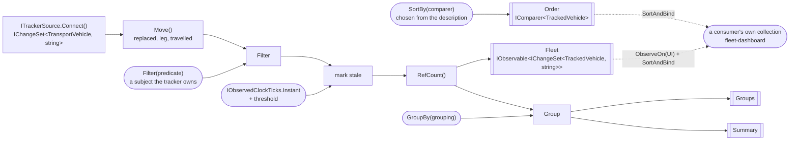
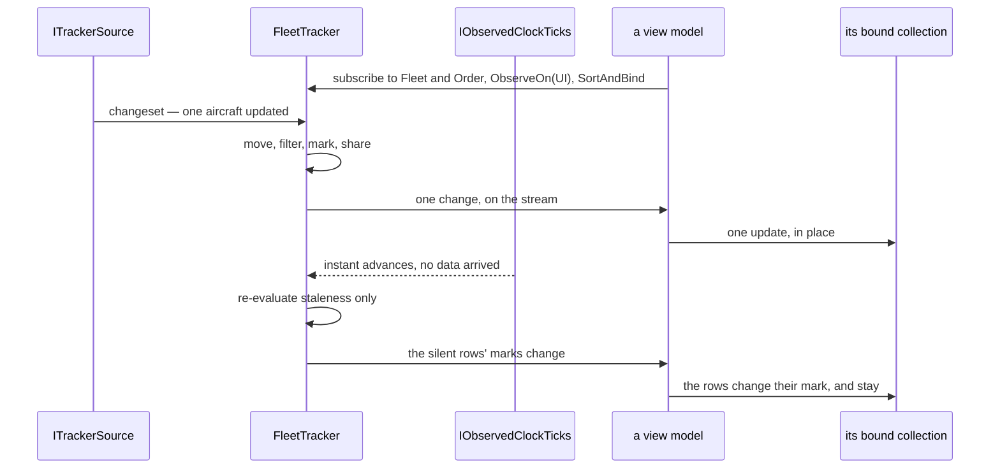

# Specification: Fleet pipeline

## 1. Business Goal

<!-- Rules: ../../../../.spec/templates/feature.md § 1 -->

`aircraft-source` built the half of the headline nobody shows: a polled snapshot becoming a changeset. It stops at the seam deliberately — its § 5 row 1 excludes the operators themselves and says building them is the next feature — so what exists today is a stream of domain vehicles arriving at an interface nothing consumes. The talk's claim is not that a snapshot can become a changeset; it is that **once it has, everything after it is an ordinary DynamicData pipeline**, indistinguishable from one fed by a push source. That claim is unproven while the pipeline does not exist, and it is the only part of the demo the audience will try to copy on Monday. This Feature builds the pipeline: one collection of `TransportVehicle`, built once at startup, filtered and sorted by inputs the user changes, grouped and counted, with a silent vehicle marked rather than vanishing — and a source description that supplies the columns and comparers, so swapping planes for ships swaps a registration and not a view. The failure state removed is a demo that can show data arriving and nothing being done with it.

## 2. User Needs

<!-- Rules: ../../../../.spec/templates/feature.md § 2 -->

| #   | Persona                                                                                                                               | Need                                                                                                                         | Pain point today                                                                                                                                                          |
| --- | ------------------------------------------------------------------------------------------------------------------------------------- | ---------------------------------------------------------------------------------------------------------------------------- | ------------------------------------------------------------------------------------------------------------------------------------------------------------------------- |
| 1   | Line-of-business .NET developer in the talk audience, whose data lives behind REST endpoints and SQL queries (README.md § "Audience") | To see that a polled source reaches the same operators a push source would, and to read the one place they are assembled     | `aircraft-source` ends at `ITrackerSource`; the operators the audience came to see are named in a skill and a README table and exist nowhere in the source                |
| 2   | The same developer, whose own grid is re-queried and re-bound on every keystroke                                                      | A search box and a set of dropdowns that re-filter an existing collection without refetching or rebuilding anything          | Their current answer is a handler that clears a list and refills it, which is the pattern this demo exists to replace; nothing here yet shows the alternative             |
| 3   | The same developer, whose rows are a fixed set of columns compiled into the view                                                      | Columns, comparers and groupings that come from the source rather than from the markup                                       | With no description to supply them, a second source means editing the grid — which is the swap failing quietly rather than loudly                                         |
| 4   | The presenter, demonstrating that a feed can stop                                                                                     | A vehicle that goes silent to be visibly marked and kept, at a threshold they can set before the talk                        | Nothing derives staleness downstream of the seam; `TransportVehicle.IsStale` takes an instant and no caller passes one, so a row either vanishes or lies                  |
| 5   | The presenter, at the closing act (README.md § "Closing act")                                                                         | The grid, filters, sorts, groups and counts to survive a source swap untouched                                               | `aircraft-source` B-042 claims only that the fleet tracker _owns_ a pipeline. Ownership of nothing survives any swap, so the closing act's claim is currently vacuous     |
| 6   | Whoever maintains this repository after the talk                                                                                      | The pipeline assembled in one readable place, disposed deliberately                                                          | A pipeline grown a stage at a time across a view model, a page and a tracker is the shape every one of these skills' `Never add` lists is written against                 |
| 7   | The developer of need 1, watching a card say how far an aircraft moved and draw where it has been                                     | To see that a value derived from a change — a distance, a trail — is a stage like the counts are, not a loop in a view model | The only derived values downstream of the seam are counts and a stale mark; nothing reads a vehicle's previous position, so the dashboard has no honest source for either |

## 3. Acceptance Criteria

<!-- Rules: ../../../../.spec/templates/feature.md § 3 -->

Forty-three claims, in ten groups: **B-001 – B-005 and B-028** the spine —
what is built, when, what is published and who binds it; **B-006 – B-008** search
and filtering; **B-009 – B-011** sorting; **B-012 – B-015 and B-030** grouping
and aggregates; **B-016 – B-019** staleness; **B-020 – B-022, B-029 and B-043**
the source description; **B-023 and B-024** the boundaries; **B-025 – B-027 and
B-039** the arrival notice; **B-031 and B-040** what the tracker re-publishes
from below it; **B-032 – B-038, B-041 and B-042** values derived from movement,
and what the description says about a card.

**B-043 was added on 2026-10-09**, from the person's review of
`fleet-dashboard` `0038`. The detail pane had matched on `Aircraft`, labelled
its own lines and converted metres to feet in a view model — logic that is
neither thin nor the view model's, and conversions `DisplayUnit` already
owned. The person moved the lines into the description: the pane is one more
surface the description lays out, as B-036 made the card, so it names no
subclass and converts nothing, and B-022's exception still holds every cast in
the per-source file a swap replaces.

**"The fleet" is the published stream, after the filter** (B-002, B-006). What
the source reports, before the filter, is said in those words: B-030's values,
B-033's sum and B-039's window are over what the source reports, so a search
neither withdraws a choice, nor restarts a total, nor reads as a change.

**B-032 – B-040 were added on 2026-10-08**, from
[`fleet-dashboard` decision 0002](../../Features/Fleet/.spec/decisions/0002-cards-and-a-trail-map-replace-the-grid.md):
the person replaced the grid's rows with cards and a detail map, and asked that a
card say where its aircraft is and how far it moved since the last poll. Every
one of those values is derived, and `fleet-dashboard` B-018 forbids a view model
deriving anything, so each is claimed here as a stage or as something the
description names. B-032 – B-035 are the movement — a leg, a running total, a
trail and the gaps in it — and they ride on the fleet element rather than in a
store beside it, which is what keeps B-002's "no second store" true. B-036 – B-038
extend the description: the roles a card fills, the measure a trail is coloured
by, and a place resolved from a table compiled in. B-039 windows the changes
the source made, which B-025's notices count after the filter. B-040 is B-031's move again — a value from below the seam
re-published on it — and the seam it needs from the source is
[ADR-0013](../../../../.spec/adr/0013-a-read-side-seam-carries-a-sources-poll-status.md).

**B-041 and B-042 were added, and B-038 amended, the same day**, when the
person answered `fleet-dashboard` § 11 row 8 and this Feature's rows 7 and 8. A
readout shows what changed, so the element carries the vehicle one update back
(B-041), and a readout column may name a delta that formats the change (B-042):
the cell is still a formatted string, as row 3 decided, and the arithmetic lives
in the per-source description beside the unit conversion it needs. B-038 gained
the bound row 8 chose.

**B-035 was amended, and B-034 confirmed, on 2026-10-08**, before `0063` was
designed, from the 2026-10-08 review's findings 4 and 3 (§ 12). B-035 measured
a gap from the trail point before, which is the last _move_, not the last
_report_: an aircraft parked for ten minutes and reporting every fifteen seconds
would get a gap the moment it taxied, though the feed never fell silent. It now
measures from the vehicle the update replaced, which is the last report
(B-041), against the threshold in force when the point is added. B-034 already
said a point is added only when the position moves, and its scenario agreed;
`0063`'s summary said an update that changes the altitude alone adds one too.
The person chose the claim: no point without a move, because a parked
aircraft's barometric jitter would fill the bound with points of zero length and
push the path out. The item is corrected.

**B-039 was amended on 2026-10-08**, by the person, answering the first
2026-10-08 review's finding 5, which no row recorded until now: a window of the
last twenty is state, and B-039 said neither where it lives nor for how long.
B-004 forbids the tracker a subscription of its own while nothing is
subscribed, and B-028 tears the stages down when the last subscriber goes, so a
window that outlived its consumers would have broken both — and kept polling a
provider nobody was watching, spending the credits B-028 exists to save. The
window is kept once in the shared stages, beside the trail and the running
total, and goes with them (§ 4 row 15). Rejected: a window per subscription,
starting empty, which would show two consumers two different rates. B-039 also
names the notices it windows: `Updated` ones only, one per changeset that
changed something. Whether a silence happened is timed per subscription
(B-027), so a shared window cannot know it: no `Quiet` notice enters, and the
changeset that ends a silence — which a subscription's own notices call
`Resumed` — enters as `Updated`, with its counts, because it changed the fleet
like any other. A window of changes has no use for a silence, which the
toast reports already.

**B-030 and B-038 – B-040 were amended on 2026-10-08**, by the review that
re-earns §§ 1-5 (§ 12), with three of them the person's calls. B-030's values
are taken before the filter, because after it, choosing a country withdrew every
other from the control. B-039's window counts only the changes the source made:
`_arrivals` sits after the filter, so a search would have entered the window as
adds and removes, and a stage connecting late is handed the fleet as one large
add. **B-025 is deliberately not changed with it.** A notice reports what the
fleet a consumer binds just did, a search narrowing it included; the window
reports the feed's rate of change. And B-039 now publishes the totals across the
window, summed in the stage, because `fleet-dashboard` B-037 shows totals and
its B-023 forbids a consumer computing one. B-038 now obliges the aircraft
description to offer a place, which "MAY" alone did not, and says what a
vehicle with no position yields. B-040's clauses about a non-polling source and
a swap bound the swap decorator, which § 5 row 5 places in `aircraft-source`;
they now bind only what the tracker re-publishes, and the decorator's half is
`aircraft-source` B-056, filed the same day: that it switches the poll status
with the live strategy and registers none for a strategy that does not poll.
Likewise `fleet-dashboard` B-039 offers B-030's values as filter choices beside
B-029's, and clears a selected value of the old key when the grouping changes.
**B-025 also counts the fleet a late subscriber is handed**, as one add: that
subscriber's bind receives the same add, so the notice reports what its fleet
just did, and the reading above covers it. Generating B-038's table from the Gazetteer is a
build-time step outside this Feature; B-024 binds what runs. B-032 – B-034, B-041 and B-042
were reworded without changing what they require: their movement, sum, trail
and replaced vehicle run from when the source last began reporting the vehicle,
not from when it entered the published fleet, which is what B-033's filter test
already proves, and B-042's
"no replaced vehicle" case is the readout's change, not the delta's, which never
sees an element.

**B-036 and B-042 were amended on 2026-10-08**, before `0064` was designed,
because each ended in a clause obliging a consumer this Feature does not build:
"no consumer SHALL fill it with a member of its own choosing" and "no consumer
SHALL compute a delta itself". That is the defect the 2026-10-05 review took out
of B-002 (§ 12): a claim here is proved by a test here, and no test here can see
a view model. Both halves already stand on the consumer's side —
`fleet-dashboard` B-029 lays a card out from the roles and leaves an empty one
absent, its B-038 shows the change the description names, and its B-019 leaves
a view model no transformation but display formatting, which rules out a
subtraction — so the clauses are dropped rather than moved. B-042 kept a SHALL
by gaining one about what a named delta returns, so it still binds the
description and is not two permissions. Rejected: keeping them as a review, which
would be a review of another Feature's code with nothing in this Feature to
re-do it.

B-029 and B-030 were added on 2026-10-07, from § 11 row 6: the filter control's
choices are of two kinds, and the pipeline is what each must come from. B-029
carries the choices the source declares — curated, offered whether or not a
vehicle satisfies one, and grouped with B-020 – B-022 because the description is
where they live. B-030 carries the choices the data holds, as the distinct values
of the current grouping key, and is grouped with B-012 – B-015 because it is an
aggregate over the same stream. Neither composes a predicate: `fleet-dashboard`
B-009 does that, and this Feature claims only what the pipeline offers it.

B-028 was added, and B-002 and B-005 amended, on 2026-10-05 by
[ADR-0009](../../../../.spec/adr/0009-the-pipeline-publishes-changesets-a-consumer-binds.md):
the pipeline publishes changeset streams and owns no bound collection, so the
`Bind` and the marshal to the UI scheduler belong to whoever consumes it. B-005
had required the opposite of [`mvvm`](../../../../.skills/mvvm/SKILL.md)
§ "Projecting state back", which puts marshalling at the view model boundary and
not deep inside the pipeline; the skill wins, and the claim is corrected to what
the pipeline actually owes — injected schedulers, and no marshalling on anyone's
behalf.

B-025 – B-027 were added on 2026-10-05, after the rest were written, when the
person asked for a visible sign that new data had arrived. They are the
pipeline's half of it — the signal — and they are here rather than in
`fleet-dashboard` because the tracker already holds the clock and derives the
counts, so a notice is the same derivation as the summary B-015 claims. What is
shown, and where, is `fleet-dashboard`'s.

**B-009 was amended on 2026-10-06**, on `0032`, because the library contradicted
its last clause. DynamicData's `SortAndBind` raises a single `Reset` when the
comparer changes, whatever the reset threshold, so "SHALL NOT clear, refill"
could not be read at the bound collection — and read there it would have failed a
pipeline that had done nothing wrong. The claim now says what the pipeline owes:
the same instances, reordered, with nothing re-fetched and no stage rebuilt,
which is what the test asserts. Rejected: keeping the words and marking the row
unprovable, and publishing `ISortedChangeSet` to get move notifications, which
ADR-0009 decision 2 turned down for widening `Fleet`'s type.

**B-031 was added on 2026-10-07**, at `fleet-dashboard`'s request: its § 11
row 6 asked what clears the refresh indicator B-028 carries, and the answer the
person took is the observed instant — every applied poll reports one
(`aircraft-source` B-003), including a poll whose data was identical, which is
the case a notice cannot cover because B-025 raises one only when something
changed. The clock already publishes that stream through `IObservedClockTicks`
(ADR-0010); what was missing is a consumer's way to reach it, since a view model
depends on `IFleetTracker` and nothing below it (`aircraft-source` B-041). So
this is a member on the published seam rather than a new dependency for a view
model, the same move `Notices` already makes with the same instant.
[`fleet-dashboard` decision 0001](../../Features/Fleet/.spec/decisions/0001-the-observed-instant-clears-the-refresh-indicator.md)
is the call; [`0059`](../.issue/0059-observed-instant-on-the-tracker.yml) builds it.

Claim ids are scoped to this specification. This Feature's `B-001` is not
`aircraft-source`'s, and neither is renumbered for the other
(`transponder-conventions` § "Claim ids are `B-00n`"). Where a claim of the other
Feature is cited it is written with its Feature's name.

| ID    | Claim                                                                                                                                                                                                                                                                                                                                                                                                                                                                                                                                                                                                                                                                                                                                                                                                                                                                                                                                                                                                    | Source                                                                                        |
| ----- | -------------------------------------------------------------------------------------------------------------------------------------------------------------------------------------------------------------------------------------------------------------------------------------------------------------------------------------------------------------------------------------------------------------------------------------------------------------------------------------------------------------------------------------------------------------------------------------------------------------------------------------------------------------------------------------------------------------------------------------------------------------------------------------------------------------------------------------------------------------------------------------------------------------------------------------------------------------------------------------------------------- | --------------------------------------------------------------------------------------------- |
| B-001 | The pipeline SHALL be constructed once, from `ITrackerSource.Connect()`, and SHALL NOT be rebuilt, re-subscribed or re-bound because the live source changed.                                                                                                                                                                                                                                                                                                                                                                                                                                                                                                                                                                                                                                                                                                                                                                                                                                            | dynamic-data-pipeline § "The spine"; `aircraft-source` B-042                                  |
| B-002 | The pipeline SHALL publish the fleet as a stream of changesets whose element carries the vehicle and its derived stale mark, and SHALL NOT own a bound collection; no tracker, pipeline stage or aggregate SHALL hold a second store of tracked items. What a consumer does with the stream is `fleet-dashboard` B-005's (§ 5 row 9).                                                                                                                                                                                                                                                                                                                                                                                                                                                                                                                                                                                                                                                                    | ADR-0009; dynamic-data-pipeline § "Never add"; mvvm § "Projecting state back"                 |
| B-003 | Every change to that collection SHALL arrive through the pipeline; no code SHALL add to, remove from, clear or reorder it imperatively.                                                                                                                                                                                                                                                                                                                                                                                                                                                                                                                                                                                                                                                                                                                                                                                                                                                                  | `aircraft-source` B-044; dynamic-data-pipeline § "Never add"                                  |
| B-004 | Disposing the tracker SHALL complete every stream it publishes and dispose everything it created; while nothing is subscribed the tracker SHALL hold no subscription of its own. A source swap SHALL dispose nothing the pipeline needs and leak nothing it replaced.                                                                                                                                                                                                                                                                                                                                                                                                                                                                                                                                                                                                                                                                                                                                    | dynamic-data-pipeline § "Keep the pipeline the thing that does the work"                      |
| B-005 | Every scheduler the pipeline uses SHALL be one it was given, and it SHALL NOT read `CurrentThreadScheduler`, `TaskPoolScheduler` or any other ambient scheduler inline; it SHALL NOT marshal to a user-interface thread on a consumer's behalf, because that is the consumer's boundary.                                                                                                                                                                                                                                                                                                                                                                                                                                                                                                                                                                                                                                                                                                                 | ADR-0009; mvvm § "Projecting state back"; `SchedulerProvider` remarks                         |
| B-006 | Filtering SHALL be driven by a predicate value the caller hands the tracker: a new predicate SHALL re-evaluate the existing items and SHALL NOT re-subscribe to the source or refetch anything.                                                                                                                                                                                                                                                                                                                                                                                                                                                                                                                                                                                                                                                                                                                                                                                                          | dynamic-data-pipeline § "The spine"; README.md § "DynamicData operators"                      |
| B-007 | Before any caller sets a predicate, every vehicle the source reports SHALL be visible; the tracker SHALL hold that default itself rather than waiting for one, and an absent filter SHALL NOT be an empty fleet.                                                                                                                                                                                                                                                                                                                                                                                                                                                                                                                                                                                                                                                                                                                                                                                         | Decided call — an empty grid at startup reads as a broken feed                                |
| B-008 | No filter SHALL be applied by enumerating or editing the bound collection, and none SHALL be re-evaluated by a UI event handler.                                                                                                                                                                                                                                                                                                                                                                                                                                                                                                                                                                                                                                                                                                                                                                                                                                                                         | maui-ui § "The UI reads; it never drives"                                                     |
| B-009 | Sorting SHALL be driven by a comparer value the caller hands the tracker: a new comparer SHALL reorder the **existing item instances**, and SHALL NOT re-fetch them, rebuild a stage or re-subscribe to the seam. Which notification a bound collection raises for that reorder is the binding adapter's (amended 2026-10-06, below).                                                                                                                                                                                                                                                                                                                                                                                                                                                                                                                                                                                                                                                                    | dynamic-data-pipeline § "The spine"; maui-ui § "The UI reads"                                 |
| B-010 | Every comparer SHALL come from the live source's description (B-020) and SHALL compare using members of `TransportVehicle` only.                                                                                                                                                                                                                                                                                                                                                                                                                                                                                                                                                                                                                                                                                                                                                                                                                                                                         | maui-ui § "The swap test"; ADR-0005 item 6                                                    |
| B-011 | A comparer SHALL break ties on `Key`, so the order is total and two sorts of an unchanged fleet produce the same sequence.                                                                                                                                                                                                                                                                                                                                                                                                                                                                                                                                                                                                                                                                                                                                                                                                                                                                               | Decided call — rows swapping places on an unchanged fleet reads as churn                      |
| B-012 | Grouping SHALL be driven by a grouping chosen from the description and handed to the tracker, and changing it SHALL regroup the existing items without rebuilding the pipeline.                                                                                                                                                                                                                                                                                                                                                                                                                                                                                                                                                                                                                                                                                                                                                                                                                          | README.md § "UI features"; dynamic-data-pipeline § "The spine"                                |
| B-013 | `TransportVehicle` SHALL declare the grouping answer as an `abstract` member, so a new source cannot inherit one; `Aircraft` SHALL answer with its origin country.                                                                                                                                                                                                                                                                                                                                                                                                                                                                                                                                                                                                                                                                                                                                                                                                                                       | ADR-0005 item 2; README.md § "DynamicData operators"                                          |
| B-014 | Each group SHALL carry its count of vehicles and its count of stale vehicles, derived from the same stream, and neither SHALL be computed by enumerating a collection bound from it.                                                                                                                                                                                                                                                                                                                                                                                                                                                                                                                                                                                                                                                                                                                                                                                                                     | README.md § "UI features"; dynamic-data-pipeline § "The spine"                                |
| B-015 | A fleet-wide summary — vehicles tracked, vehicles stale, groups present — SHALL derive from the same stream as the collection and SHALL update as the collection does.                                                                                                                                                                                                                                                                                                                                                                                                                                                                                                                                                                                                                                                                                                                                                                                                                                   | README.md § "UI features"                                                                     |
| B-016 | A vehicle silent for longer than the threshold SHALL be reported as stale **and SHALL remain in the fleet**, keyed and present in any collection bound from it.                                                                                                                                                                                                                                                                                                                                                                                                                                                                                                                                                                                                                                                                                                                                                                                                                                          | README.md § "UI features"; dynamic-data-pipeline § "Staleness and expiry"                     |
| B-017 | The staleness threshold SHALL be settable on the tracker and SHALL default to five minutes, held by the tracker rather than supplied by a caller at construction.                                                                                                                                                                                                                                                                                                                                                                                                                                                                                                                                                                                                                                                                                                                                                                                                                                        | README.md § "UI features"                                                                     |
| B-018 | Staleness SHALL be measured against the observed clock, SHALL NOT read `DateTime.UtcNow` or `DateTimeOffset.Now` inline, and SHALL be re-evaluated when the observed instant advances — so a vehicle becomes stale with no new data arriving for it.                                                                                                                                                                                                                                                                                                                                                                                                                                                                                                                                                                                                                                                                                                                                                     | `aircraft-source` B-043 and B-003; ADR-0007; ADR-0010                                         |
| B-019 | No vehicle SHALL be removed from the fleet because it stopped reporting, and `ExpireAfter` SHALL NOT appear in this pipeline.                                                                                                                                                                                                                                                                                                                                                                                                                                                                                                                                                                                                                                                                                                                                                                                                                                                                            | README.md § "DynamicData operators"; see § 5 row 2                                            |
| B-020 | The live source SHALL supply a description naming the columns, comparers, grouping keys and filter choices available for it; each column SHALL be a display name plus a selector over `TransportVehicle`.                                                                                                                                                                                                                                                                                                                                                                                                                                                                                                                                                                                                                                                                                                                                                                                                | maui-ui § "The swap test"; ADR-0005 item 6                                                    |
| B-021 | Swapping the live source SHALL swap the description, and SHALL NOT require editing the pipeline, a comparer, a predicate or a grouping key.                                                                                                                                                                                                                                                                                                                                                                                                                                                                                                                                                                                                                                                                                                                                                                                                                                                              | hot-swap-source; README.md § "Closing act"                                                    |
| B-022 | No column, comparer, predicate, grouping key or aggregate SHALL downcast, type-test or `switch` on a concrete `TransportVehicle` subclass. **One exception**: a source's own description (B-029) MAY name the concrete type it was written for, and nothing else MAY — it is the per-source file a swap replaces, so a cast there cannot outlive the source it belongs to.                                                                                                                                                                                                                                                                                                                                                                                                                                                                                                                                                                                                                               | ADR-0005 item 6; domain-model § "Never add"; § 11 row 6                                       |
| B-023 | Nothing in this Feature SHALL name an API contract, an API type, a client, a cache, a snapshot or a concrete `ITrackerSource`.                                                                                                                                                                                                                                                                                                                                                                                                                                                                                                                                                                                                                                                                                                                                                                                                                                                                           | `aircraft-source` B-047; hot-swap-source                                                      |
| B-024 | Nothing in this Feature SHALL read a network, a file or a wall clock.                                                                                                                                                                                                                                                                                                                                                                                                                                                                                                                                                                                                                                                                                                                                                                                                                                                                                                                                    | dynamic-data-pipeline § "Testing"; see § 4 row 5                                              |
| B-025 | The tracker SHALL publish a notice each time a changeset arrives carrying at least one change, and the notice SHALL carry the observed instant and the counts — vehicles tracked, and vehicles added, updated and removed by that changeset. A changeset carrying no change SHALL produce no notice.                                                                                                                                                                                                                                                                                                                                                                                                                                                                                                                                                                                                                                                                                                     | Decided call 2026-10-05; see § 7 § "The arrival notice"                                       |
| B-026 | The notices SHALL be reachable as a stream paced by a caller-supplied minimum-interval observable, so two consumers SHALL be able to run at two different cadences at once and either SHALL be changeable while the application runs. An interval SHALL default to one second until a value arrives, and the most recent notice raised within a capped interval SHALL be the one published.                                                                                                                                                                                                                                                                                                                                                                                                                                                                                                                                                                                                              | Decided call 2026-10-05; see § 4 rows 8 and 10                                                |
| B-027 | The notices stream SHALL report a quiet notice when no changeset has arrived for longer than the staleness threshold, and a resumed notice on the next changeset after one, so silence is reported once rather than inferred from the absence of notices. The arrival timer SHALL be built per subscription, so the tracker holds none and B-028's teardown is not defeated by it.                                                                                                                                                                                                                                                                                                                                                                                                                                                                                                                                                                                                                       | Decided call 2026-10-05; `aircraft-source` decision 0002 (the swap's own)                     |
| B-028 | The stages SHALL be shared: a second subscriber SHALL NOT cause a second connection to the seam, a second diff pass or a second evaluation of the filter, the sort or the stale mark, and the stages SHALL tear down when the last subscriber unsubscribes.                                                                                                                                                                                                                                                                                                                                                                                                                                                                                                                                                                                                                                                                                                                                              | ADR-0009; dynamic-data-pipeline § "The spine"                                                 |
| B-029 | The description SHALL carry the filter choices the live source offers, each a display name beside a predicate over `TransportVehicle`, and SHALL offer them whether or not any vehicle currently satisfies one — a choice is what the source admits, not what the data happens to hold.                                                                                                                                                                                                                                                                                                                                                                                                                                                                                                                                                                                                                                                                                                                  | § 11 row 6; `fleet-dashboard` B-009 and B-011                                                 |
| B-030 | The tracker SHALL publish, as a changeset, the distinct values the current grouping key takes across every vehicle the source reports, before the filter (B-006), so a choice can be offered for a value the data holds without any consumer enumerating the collection to find it, and choosing one never withdraws the others. Each value SHALL carry the predicate that admits exactly the vehicles answering it under the key that produced it, so a consumer offering it as a choice names no grouping key and keeps no default of its own (`fleet-dashboard` B-039). A change of grouping key SHALL replace the values with the new key's, and a consumer subscribing SHALL read the values in force at once.                                                                                                                                                                                                                                                                                      | § 11 row 6; `fleet-dashboard` B-009                                                           |
| B-031 | The tracker SHALL publish the observed instant and every advance of it, so a consumer can tell a poll applied a response even when the response changed nothing; it SHALL re-publish the clock's own stream rather than hold a clock or read a wall clock, and the value SHALL be the instant the provider reported.                                                                                                                                                                                                                                                                                                                                                                                                                                                                                                                                                                                                                                                                                     | `fleet-dashboard` B-028 and decisions/0001; ADR-0010; `aircraft-source` B-003                 |
| B-032 | The fleet stream's element SHALL carry the distance its vehicle moved in the changeset that last updated it — the great-circle distance between its position before that update and after it, measured from `TransportVehicle.Position` alone — and SHALL carry no distance, rather than zero, when either position is absent or the source has only just begun reporting the vehicle.                                                                                                                                                                                                                                                                                                                                                                                                                                                                                                                                                                                                                   | `fleet-dashboard` decisions/0002 and B-030; § 2 need 7                                        |
| B-033 | The element SHALL carry the sum of every distance B-032 measured for its vehicle since the source last began reporting it; a vehicle removed and later reported again SHALL start a new sum.                                                                                                                                                                                                                                                                                                                                                                                                                                                                                                                                                                                                                                                                                                                                                                                                             | `fleet-dashboard` decisions/0002 and B-030                                                    |
| B-034 | The element SHALL carry its vehicle's trail: the positions it was reported at since the source last began reporting it, oldest first, each with its last contact, the trail measure (B-037) read at that point, and its distance from the point before. A point SHALL be added when the source begins reporting the vehicle with a position, or when an update reports a position other than the trail's last point, and at no other time; the trail SHALL be bounded by a count the tracker holds, defaulting to 240 — an hour at fifteen seconds — with the oldest dropped first; and it SHALL travel with the element, so it goes when the source stops reporting the vehicle, is kept while a filter hides it, and is never a store kept beside it.                                                                                                                                                                                                                                                  | `fleet-dashboard` decisions/0002, B-034 and B-035; B-002; dynamic-data-pipeline § "Never add" |
| B-035 | A trail point SHALL be marked as following a gap where its last contact follows the last contact of the vehicle its update replaced (B-041) by more than the staleness threshold (B-017) in force when the point is added, so a consumer can draw a break rather than a straight line across a silence nobody observed; a trail's first point SHALL follow no gap, having no line before it to break.                                                                                                                                                                                                                                                                                                                                                                                                                                                                                                                                                                                                    | `fleet-dashboard` B-034; B-016                                                                |
| B-036 | The description SHALL name which of its columns fill a card's roles — a title, a subtitle, a place and an ordered list of readouts — beside the columns B-020 names; a role the source does not fill SHALL be empty.                                                                                                                                                                                                                                                                                                                                                                                                                                                                                                                                                                                                                                                                                                                                                                                     | `fleet-dashboard` decisions/0002 and B-029; B-020; B-021                                      |
| B-037 | The description SHALL name a trail measure — a display name, the range a colour ramp spans, and a selector from `TransportVehicle` to an optional number (altitude in metres, for aircraft) — and that selector MAY name the concrete type its source was written for, under B-022's exception and no wider.                                                                                                                                                                                                                                                                                                                                                                                                                                                                                                                                                                                                                                                                                             | `fleet-dashboard` B-034; B-022; § 4 row 16                                                    |
| B-038 | The description MAY offer a place column, naming the nearest place to a position — by B-032's great-circle distance to an entry's recorded point — from a table compiled into the application, and the aircraft description SHALL offer one, bounded at ten kilometres over the US Census Bureau's Gazetteer places (§ 11 row 8). Resolving one SHALL make no network call and read no file or resource at runtime: the table is source. Where no entry lies within the column's bound it SHALL yield the position's coordinates rather than a place, and where the vehicle has no position it SHALL yield neither.                                                                                                                                                                                                                                                                                                                                                                                      | `fleet-dashboard` decisions/0002; B-024; § 4 row 18; § 11 row 8                               |
| B-039 | The tracker SHALL publish a window of the twenty most recent changes the source made — one `Updated` notice for each changeset the seam delivered that changed something, counted before the filter (B-006), so its tracked count is every vehicle the source reports — oldest dropped first and unpaced by B-026, and with each window the added, updated and removed totals across it, summed in the stage, so the banner (`fleet-dashboard` B-037) keeps and sums no list itself. A changeset that reports the current fleet to a stage connecting, rather than a change the source made, SHALL NOT enter it, nor SHALL a `Quiet` notice (B-027); a changeset a subscription's own notices report as `Resumed` SHALL enter it as `Updated`, with the same counts. The window SHALL be kept once, so every consumer subscribed to it at once reads the same window; a consumer subscribing SHALL read the window in force at once; and it SHALL be emptied when the last of them unsubscribes (B-028). | `fleet-dashboard` B-037                                                                       |
| B-040 | The tracker SHALL re-publish the latest poll status the poll-status seam reports (ADR-0013) — the instant the live source's next poll is due, and while the provider is refusing polls, the interval it asked for — and nothing older, with no timer, clock read or provider name of its own; so while the live source does not poll the tracker publishes none, and a status the seam replaces on a swap is replaced on the tracker. A consumer subscribing SHALL read the status in force at once.                                                                                                                                                                                                                                                                                                                                                                                                                                                                                                     | `fleet-dashboard` B-036; `aircraft-source` B-054 and B-055; B-031; ADR-0013                   |
| B-041 | The element SHALL carry the vehicle its last update replaced, read from the changeset that made the update, so a consumer can show what changed without keeping a copy; an element whose vehicle the source has just begun reporting SHALL carry none, and nothing older than one update SHALL be kept.                                                                                                                                                                                                                                                                                                                                                                                                                                                                                                                                                                                                                                                                                                  | `fleet-dashboard` B-038 and § 11 row 8; B-002                                                 |
| B-042 | A readout column in the description MAY name a delta — a selector over the vehicle B-041 carries and the current one, returning the change already formatted. A delta it names SHALL return the change at the precision its cell shows, and none where that cell did not change or where either vehicle has no value for it; a readout's change SHALL be none where the element carries no replaced vehicle; and that selector MAY name the concrete type its source was written for, under B-022's exception and no wider.                                                                                                                                                                                                                                                                                                                                                                                                                                                                              | `fleet-dashboard` B-038 and § 11 row 8; B-022; § 11 row 3                                     |
| B-043 | The description SHALL name the columns a detail pane shows, in reading order, beside those B-020 and B-036 name — each a display name and a selector over `TransportVehicle`, a canonical value read in the display unit it names — and a source naming none SHALL leave the list empty. The aircraft description SHALL name the fields only an aircraft reports among them, so no consumer names `Aircraft` to show one.                                                                                                                                                                                                                                                                                                                                                                                                                                                                                                                                                                                | `fleet-dashboard` B-013, B-019 and B-022; B-022; B-036                                        |

## 4. Constraints

<!-- Rules: ../../../../.spec/templates/feature.md § 4 -->

| #   | Constraint                                                                                                                                                                                                  | Source                                                                                       | Impact                                                                                                                                                                                                                                                                                                                                                                                                                                                                                                                                                                                                                                     |
| --- | ----------------------------------------------------------------------------------------------------------------------------------------------------------------------------------------------------------- | -------------------------------------------------------------------------------------------- | ------------------------------------------------------------------------------------------------------------------------------------------------------------------------------------------------------------------------------------------------------------------------------------------------------------------------------------------------------------------------------------------------------------------------------------------------------------------------------------------------------------------------------------------------------------------------------------------------------------------------------------------ |
| 1   | The seam is fixed and is not ours to widen: `ITrackerSource.Connect()` returns `IObservable<IChangeSet<TransportVehicle, string>>` and nothing else.                                                        | `aircraft-source` B-033, ADR-0002                                                            | Everything this Feature needs arrives as a changeset of the abstract base. A member a column wants and the base does not carry comes from the description (B-020), never from widening the seam or the base.                                                                                                                                                                                                                                                                                                                                                                                                                               |
| 2   | `IFleetTracker` exists, in a file another Feature owns: `aircraft-source` item `0007` declared it, gave it the clock, and published `Fleet` and `StaleAfter` (`src/Transponder/Tracking/IFleetTracker.cs`). | `aircraft-source` § Tasks; `0007`, on `main` at `be7b6ef`                                    | The prerequisite every item here names is satisfied in the tree. What this Feature adds are § 7's members on a file another Feature created — which is why § 7 writes members rather than the whole interface, and why a member already declared is not re-declared. `Fleet` already carries the stale mark and shares the chain, so B-001, B-002, B-004 and B-028 are claims about code that partly exists; the rest of § 7's surface — the scheduler provider, the description, the three remaining inputs — does not.                                                                                                                   |
| 3   | `IObservedClock` exposes `Current` and no observable, so nothing can notice the instant advancing.                                                                                                          | `src/Transponder/Tracking/IObservedClock.cs`                                                 | B-018's second clause cannot be satisfied by reading `Current`. [ADR-0010](../../../../.spec/adr/0010-a-third-seam-carries-the-observed-clocks-ticks.md) adds a third read-side seam, `IObservedClockTicks`, rather than widening the interface `aircraft-source` published; both existing interfaces are untouched, so ADR-0007's separation holds unamended.                                                                                                                                                                                                                                                                             |
| 4   | A projection builds a **new** `Aircraft` per change: `AircraftTrackerSource` uses `Transform`, so an updated vehicle arrives as a replacement, not as a mutated instance.                                   | `src/Transponder/Tracking/Sources/AircraftTrackerSource.cs`                                  | `AutoRefresh` has no subject in this pipeline as it stands — there are no in-place property changes to refresh on. This is an open question, not a silent omission: § 7's decision block and § 11 row 1 carry it, and no claim depends on it.                                                                                                                                                                                                                                                                                                                                                                                              |
| 5   | No test here may reach a network, a file or the wall clock, and both schedulers are injected.                                                                                                               | `transponder-conventions` § `test-from-scenarios`; `SchedulerProvider` remarks               | A test feeds a changeset in and advances one `TestScheduler`. The clock is a double returning instants the test chose, which is also what makes B-018 provable without waiting five minutes.                                                                                                                                                                                                                                                                                                                                                                                                                                               |
| 6   | Staleness is **marked** for aircraft and **expiring** is a vessel treatment; the two are not interchangeable.                                                                                               | dynamic-data-pipeline § "Staleness and expiry"; README.md § "DynamicData operators"          | B-019 forbids `ExpireAfter` in this pipeline outright. The vessel source will need the other treatment, and it gets it in its own specification rather than by a flag here.                                                                                                                                                                                                                                                                                                                                                                                                                                                                |
| 7   | DynamicData is already referenced centrally; nothing here adds a package.                                                                                                                                   | `Directory.Packages.props`; `aircraft-source` § 4 row 17                                     | No central-package change belongs to this Feature. An item that needs one has found a design problem, not a missing dependency.                                                                                                                                                                                                                                                                                                                                                                                                                                                                                                            |
| 8   | The notice interval is changed live, on stage, as part of the demo.                                                                                                                                         | Decided call 2026-10-05 (the person)                                                         | B-026's interval is an observable rather than an option read at startup. The input field is `fleet-dashboard`'s; the pipeline only promises that a new value takes effect without anything being rebuilt (B-001).                                                                                                                                                                                                                                                                                                                                                                                                                          |
| 9   | A notice is a value, not a presentation. It carries an instant and counts, and nothing about a banner, a toast, a duration or a colour.                                                                     | mvvm § "Thin means"; domain-model § "Never add"                                              | B-025's notice is bindable by anything and renderable by anything. What is shown for which notice is `fleet-dashboard`'s, which is what lets the same notice drive a banner and a toast without the pipeline knowing either exists.                                                                                                                                                                                                                                                                                                                                                                                                        |
| 10  | The banner and the toast pace independently — one can update every second while the other interrupts once a minute.                                                                                         | Decided call 2026-10-05 (the person)                                                         | The cap is **per consumer**, so it is not a member holding one interval. B-026 makes the notices a stream a caller paces, which keeps the rate-cap operator in the pipeline (one implementation, tested once) and the cadence with whoever is showing something. It also keeps `IFleetQuery` at four members rather than growing the bag § 11 row 4 concern 2 flags.                                                                                                                                                                                                                                                                       |
| 11  | The pipeline publishes changeset streams and owns no bound collection ([ADR-0009](../../../../.spec/adr/0009-the-pipeline-publishes-changesets-a-consumer-binds.md)).                                       | ADR-0009; mvvm § "Projecting state back"                                                     | `Bind` and `ObserveOn(UserInterfaceThread)` are the consumer's, which is what B-002 and B-005 now say. A stage that needs a materialised collection to work has found a design problem: every stage here operates on a changeset.                                                                                                                                                                                                                                                                                                                                                                                                          |
| 12  | The stages are shared by DynamicData's cache-aware `RefCount()` — not Rx's `Publish().RefCount()` pair.                                                                                                     | ADR-0009; DynamicData 9.4.33 `ObservableCacheEx.RefCount`                                    | One upstream subscription, an internal cache created on the first subscriber and disposed when the last unsubscribes. B-028 is provable by subscribing twice and counting connections to the seam. A consumer joining while another is bound reads the current fleet from that cache; the first one to arrive after every consumer has gone waits for the next changeset.                                                                                                                                                                                                                                                                  |
| 13  | The tracker is a container singleton, disposed by the container; the view model disposes only its own `Bind` subscription.                                                                                  | ADR-0009; item [`0040`](../../../../.issue/0040-actor-wiring-and-tracker-lifetime-spike.yml) | B-004 is proved in a unit test that constructs the tracker directly, so no container stands between the claim and the assertion. How an actor above the seam gets its collaborators, and who starts the first poll, were `0040`'s and are answered: the dependency resolver and the first subscription, written out in `fleet-dashboard` § 7. The spike closed on 2026-10-07, and its finding on this row was that the singleton was already decided here and in the registration, and recorded in neither as an answer to it.                                                                                                             |
| 14  | The four inputs are methods on the tracker, each ticking a `BehaviorSubject<T>` it owns and seeded with the claimed default.                                                                                | ADR-0009                                                                                     | B-007 and B-017's defaults are the pipeline's to keep, not a caller's to remember with `StartWith`. A test calls a method rather than constructing four subjects, and a view model sets a value from a property setter without owning any Rx. B-003 still holds because a method hands a value to a stage and touches no collection (§ 7).                                                                                                                                                                                                                                                                                                 |
| 15  | The stages are torn down when the last subscriber goes (B-028), and the trail, the running total and the window of recent notices live in them.                                                             | B-028; § 4 row 12; decided 2026-10-08 by the person for B-039                                | One rule for every value derived across changesets: built once in the shared stages, read the same by every consumer subscribed to it at once, and gone when the last of them leaves. The trail and the total ride on the fleet, so they last as long as anything binds it; the window is its own stream, so it lasts as long as anything subscribes to it. B-033, B-034 and B-039 cover what was observed while something was subscribed, not since the application started. A dashboard bound for the whole run sees no difference; a second page opened later reads what the first one kept alive. § 5 row 10 excludes anything longer. |
| 16  | `GeoPosition` carries a latitude and a longitude, and `TransportVehicle` carries no altitude.                                                                                                               | `src/Transponder/Model/GeoPosition.cs`; ADR-0005 item 5                                      | B-032's distance is measured on the surface, and the value a trail is coloured by cannot be read from the base. B-037 makes it something the description names, which is the per-source file a swap replaces — promoting altitude to the base would give a ship one.                                                                                                                                                                                                                                                                                                                                                                       |
| 17  | A trail point is added on entry with a position and per update that moves it, and the poll interval is fifteen seconds (`aircraft-source` B-050).                                                           | `aircraft-source` B-050 and decisions/0001                                                   | B-034's default of 240 points is an hour of one aircraft. Every point is a value carried on an immutable element, so a trail costs memory per vehicle and nothing per subscriber — B-028's sharing still holds, because the trail is built once in the shared stages.                                                                                                                                                                                                                                                                                                                                                                      |
| 18  | The US Census Bureau's Gazetteer places file is a work of the US government, and so in the public domain.                                                                                                   | § 11 row 8; `aircraft-source` decisions/0001                                                 | B-038's table for aircraft is generated from it, trimmed to the box the demo flies (`aircraft-source` decisions/0001), and compiled in: nothing is read at runtime, and no on-screen credit is owed beyond the OpenSky citation. The box is configurable (`aircraft-source` B-050), so a box moved elsewhere needs the table regenerated — and until it is, every position reads as coordinates, which is B-038's fallback rather than a failure.                                                                                                                                                                                          |

## 5. Out of Scope

<!-- Rules: ../../../../.spec/templates/feature.md § 5 -->

| #   | Item                                                                                                                   | Exclusion reason                                                                                                                                                                                                                                                                                                                                                   |
| --- | ---------------------------------------------------------------------------------------------------------------------- | ------------------------------------------------------------------------------------------------------------------------------------------------------------------------------------------------------------------------------------------------------------------------------------------------------------------------------------------------------------------ |
| 1   | Every MAUI surface — the grid, the search box, the dropdowns, the master-detail pane, the summary row, the view models | The dashboard is its own Feature, `fleet-dashboard`. This one is provable with no UI at all, and keeping the split means the pipeline's claims cannot be "satisfied" by a screenshot. The view models call the predicate, comparer and grouping-key methods § 4 row 14 names; this Feature claims what a stage does with a value, never where the value came from. |
| 2   | `ExpireAfter`, and removal on silence                                                                                  | B-019 excludes it here. It is the vessel treatment, and it belongs to the closing act's specification where going silent means gone rather than quiet.                                                                                                                                                                                                             |
| 3   | Drawing a map                                                                                                          | A map is a surface rather than a pipeline stage. Since 2026-10-08 the detail pane draws one (`fleet-dashboard` B-034), and what this Feature owes it is the trail on the element (B-034, B-035) and the measure it is coloured by (B-037) — nothing about how a line is drawn. A map binds the same one collection B-002 requires.                                 |
| 4   | Turning search text and dropdown selections into a predicate                                                           | `mvvm` § "Two kinds of input, two routes" puts that in the view model, which supplies the predicate the user chose. This Feature claims what the pipeline does with a predicate, not how one is composed.                                                                                                                                                          |
| 5   | The source swap itself — the decorator, the disposal of an outgoing source, the busy indicator                         | `aircraft-source` `0006` owns it (its B-038 – B-040). This Feature claims only that the swap costs the pipeline nothing (B-001, B-021).                                                                                                                                                                                                                            |
| 6   | Recording and replay                                                                                                   | `replay-source` owns both. The pipeline cannot tell a replayed changeset from a live one, which is the point; it therefore says nothing about either.                                                                                                                                                                                                              |
| 7   | A second grouping level, grouped aggregates beyond count, and user-defined columns                                     | No need in §§ 1-2 asks for any of them, and `domain-model` § "Never add" rules out the third level the first would invite.                                                                                                                                                                                                                                         |
| 8   | A live poll interval, and the OpenSky credit cost shown beside it                                                      | [`decisions/0002`](decisions/0002-the-poll-interval-is-not-a-live-input.md) keeps the poll a startup option of `aircraft-source`'s: pacing a notice costs nothing, and a faster poll spends credits from a daily 4,000 (README.md § "Limits"). B-026's notice interval stays live.                                                                                 |
| 9   | The `Bind` call itself, and the `ReadOnlyObservableCollection` it produces                                             | ADR-0009 puts both in the consumer. This Feature publishes the changesets and claims what they contain (B-002); which collection is materialised, on which scheduler, and disposed with what, is `fleet-dashboard`'s — and a test here binds one itself rather than asserting a view's.                                                                            |
| 10  | A trail kept across a restart, reaching back before the vehicle entered the fleet, or kept while nothing is bound      | § 4 row 15. Persisting one is a second store, which B-002 and `aircraft-source` § 5 row 14 both rule out, and a trail rebuilt from history needs a history nobody records.                                                                                                                                                                                         |
| 11  | Resolving a place over a network, or from a table beyond the live source's own area                                    | B-038 compiles the table in. A reverse-geocoding call per vehicle per poll spends a second provider's budget on every changeset, and fails on the stage network the replay source exists to survive. Which table, and how far its bound reaches, is § 11 row 8.                                                                                                    |
| 12  | A previous value kept beyond one update, or a delta for a column that is not a readout                                 | B-041 carries the vehicle one update back, which is all B-042's delta needs, and B-034's trail is the only history this Feature keeps. A delta per sort or filter column has no surface asking for it.                                                                                                                                                             |

## 6. Concern Separation

<!-- Rules: ../../../../.spec/templates/feature.md § 6 -->

| Item                                                                    | Classification | Notes                                                                                                                                                                                                                 |
| ----------------------------------------------------------------------- | -------------- | --------------------------------------------------------------------------------------------------------------------------------------------------------------------------------------------------------------------- |
| A silent vehicle is marked, not removed, at a configurable five minutes | Business       | § 2 need 4 and README.md § "UI features". The threshold is a product number; what reads it is technical. B-016, B-017.                                                                                                |
| One collection, materialised by whoever binds, never rebuilt on a swap  | Both           | Business, because § 2 need 5 is the closing act's claim; technical, because the mechanism is subscription lifetime and disposal. B-001 – B-004.                                                                       |
| A column, comparer and grouping key come from the source                | Both           | Business: a second source must not mean editing the grid (§ 2 need 3). Technical: the description is what replaces the downcast ADR-0005 item 6 forbids. B-020 – B-022.                                               |
| Filtering and sorting take values through the tracker's methods         | Technical      | The user-visible behavior is the dashboard's; what the pipeline owes it is re-evaluation without a rebuild. B-006, B-009.                                                                                             |
| Counts per group and for the fleet                                      | Business       | § 2 need 1 — the summary row is part of what the audience is shown. Derivation from the same stream is the technical half. B-014, B-015.                                                                              |
| Staleness is measured against the observed clock                        | Technical      | The business statement is row 1 above. That the instant comes from the provider rather than the wall clock is ADR-0007's, and under replay it is the difference between a loaded fleet and a fleet that is all stale. |
| The boundaries                                                          | Technical      | B-022 – B-024 constrain what may name what. No business statement is served by them directly; the swap they protect is § 2 need 5's.                                                                                  |
| Who calls `Bind`, and where the marshal happens                         | Technical      | ADR-0009. No business statement is served either way: the audience sees the same grid. What it buys is a pipeline provable with no view model, and a `mvvm` rule that stops contradicting a claim. B-002, B-005.      |
| One connection to the seam however many consumers                       | Both           | Business, because a second diff pass over the same snapshots spends OpenSky credits the day's budget is counted in. Technical, because the mechanism is DynamicData's cache-aware `RefCount()`. B-028.                |

## 7. Technical Design

<!-- Rules: ../../../../.spec/templates/feature.md § 7 -->

The pipeline is one object's constructor and one disposal. `FleetTracker` takes
the seam, the clock and its ticks, the scheduler provider, the live source's
description and the four inputs the user changes; it builds the stages once in
the order `dynamic-data-pipeline` § "The spine" names; and it **publishes
observables** — the fleet, the groups, the summary, the description and the
notices. It binds nothing and holds no collection
([ADR-0009](../../../../.spec/adr/0009-the-pipeline-publishes-changesets-a-consumer-binds.md)),
and nothing else in the application subscribes to the seam.

The constructor takes only collaborators, and the inputs are methods:

```csharp
public FleetTracker(
    ITrackerSource source,
    IObservedClock clock,
    IObservedClockTicks ticks,
    ISchedulerProvider schedulers,
    IObservable<FleetSourceDescription> description)

/// <summary>Shows only the vehicles the predicate matches (B-006).</summary>
public void Filter(Func<TransportVehicle, bool> predicate);

/// <summary>Orders the fleet by a comparer from the description (B-009, B-010).</summary>
public void SortBy(IComparer<TransportVehicle> comparer);

/// <summary>Regroups the fleet under one of the description's groupings (B-012).</summary>
public void GroupBy(FleetGrouping grouping);

/// <summary>Sets how long a vehicle may be silent before it is marked (B-017).</summary>
public void StaleAfter(TimeSpan threshold);
```

Behind each method is a `BehaviorSubject<T>` the tracker owns, seeded with the
default the specification names: a predicate matching everything (B-007), the
description's first comparer and first grouping, and five minutes (B-017). Each
stage of the chain reads its subject, so a method call is a value arriving at a
stage and nothing more.

**Three of the four inputs feed a stage; `SortBy` feeds a published value**
(ADR-0009 decision 2, amended 2026-10-06). There is no sort stage in the chain:
DynamicData's `Sort` produces an `ISortedChangeSet`, the `Transform` that derives
the stale mark returns a plain changeset, and the order would be gone before
anything was published — the pipeline would sort and no consumer could honour it.
So the tracker publishes `Order`, the comparer it currently holds, adapted to the
published element and with B-011's key tie-break appended; the consumer sorts as
it binds, with DynamicData 9's `SortAndBind`. B-009 is unchanged, because it
claims a new comparer reorders the existing items in place and never named where
the operator sits.

**Why the methods rather than four observable parameters**, which is what an
earlier draft of ADR-0009 decided and what the § 11 row 4 review first replaced
`IFleetQuery` with:

- **The defaults live where the claims are.** B-007 and B-017 are the pipeline's
  promises, and with observables passed in they were kept by every caller
  remembering `StartWith`. A caller that forgot produced an empty grid at
  startup — the exact failure B-007 exists to forbid — and no test of the
  pipeline could catch it.
- **A caller does not have to own Rx to drive it.** A view model sets a value
  from a property setter; a test calls `Filter(v => v.IsAirborne)` instead of
  constructing four subjects and remembering which one feeds which stage.
- **The seam stops being shaped by its consumer**, which was concern 2's actual
  complaint. Four parameters answered it by moving the shape into a constructor;
  a method surface answers it by naming each input as an operation the pipeline
  offers.

**These methods set values; they never touch the collection.** That is the line
B-003 draws, and it is worth stating because the shape no longer makes it
obvious: an earlier draft had no settable member at all and could say "there is
nothing to drive". Now there is. What makes B-003 hold is that no method adds,
removes, clears or reorders anything — each one hands a value to a stage and the
pipeline re-derives, which is also why B-006, B-009 and B-012 claim the
re-evaluation rather than the call.

The stages are shared with DynamicData's `RefCount()` — **not** Rx's
`Publish().RefCount()` pair. The library's own is cache-aware: one upstream
subscription, an internal cache created on the first subscriber and disposed when
the last unsubscribes, so a consumer subscribing while another is bound reads the
current fleet rather than only later changes (B-028, § 4 row 12).

**Domain model**

The two additions this Feature makes to existing types, and the types it
introduces. `TransportVehicle` and `Aircraft` exist; the member below is new on
each (B-013).

| Field                                    | Type                                              | Notes                                                                                                                                                                                                           |
| ---------------------------------------- | ------------------------------------------------- | --------------------------------------------------------------------------------------------------------------------------------------------------------------------------------------------------------------- |
| `TransportVehicle.GroupKey`              | `string`, `abstract`                              | The answer a view groups by, abstract so a new source cannot inherit one (ADR-0005 item 2, B-013). A string because a grouping key is a label, and the description names which key is being asked for.          |
| `Aircraft.GroupKey`                      | `string`, `override`                              | The origin country. `OriginCountry` is already non-optional and defaults to empty, so the key is never absent.                                                                                                  |
| `FleetColumn.Name`                       | `string`                                          | What a header shows.                                                                                                                                                                                            |
| `FleetColumn.Value`                      | `Func<TransportVehicle, string>`                  | The cell, already display-formatted. A selector rather than a member name, so no reflection and no cast (B-020, B-022).                                                                                         |
| `FleetColumn.Comparer`                   | `Option<IComparer<TransportVehicle>>`             | Absent when the column is not sortable, which is a fact about the column rather than a null to remember (`language-ext-usage`).                                                                                 |
| `FleetGrouping.Name`                     | `string`                                          | What the grouping dropdown shows — "Origin country", "Category".                                                                                                                                                |
| `FleetGrouping.Key`                      | `Func<TransportVehicle, string>`                  | How the group is read. The default grouping's selector is `GroupKey`; a second grouping a source offers supplies its own.                                                                                       |
| `FleetSourceDescription.Columns`         | `IReadOnlyList<FleetColumn>`                      | In display order (B-020).                                                                                                                                                                                       |
| `FleetSourceDescription.Groupings`       | `IReadOnlyList<FleetGrouping>`                    | What this source can be grouped by.                                                                                                                                                                             |
| `FleetSourceDescription.Filters`         | `IReadOnlyList<FleetFilterChoice>`                | The curated choices this source offers, in the order the control shows them (B-029). Empty is legal and means the control offers search alone.                                                                  |
| `FleetSourceDescription.Card`            | `FleetCard`                                       | Which columns fill a card (B-036). Defaults to a card with every role empty, so a source that names none is legal.                                                                                              |
| `FleetSourceDescription.Detail`          | `IReadOnlyList<FleetColumn>`                      | The detail pane's lines, in reading order (B-043). Defaults to empty, so a source that names none is legal.                                                                                                     |
| `FleetCard.Title`, `.Subtitle`, `.Place` | `Option<FleetColumn>`                             | Each one of the description's own column instances, or absent (B-036).                                                                                                                                          |
| `FleetCard.Readouts`                     | `IReadOnlyList<FleetReadout>`                     | In the order a card shows them.                                                                                                                                                                                 |
| `FleetReadout.Column`                    | `FleetColumn`                                     | The column the readout shows, one of the description's own (B-036).                                                                                                                                             |
| `FleetReadout.Delta`                     | `Option<FleetDelta>`                              | `FleetDelta` is the named delegate `(replaced, current) => Option<string>`, so the order of two arguments of one type is in the signature (B-042). `FleetReadout.Change(element)` is where a consumer reads it. |
| `FleetFilterChoice.Name`                 | `string`                                          | What the control shows — "On the ground", "Airborne".                                                                                                                                                           |
| `FleetFilterChoice.Matches`              | `Func<TransportVehicle, bool>`                    | What a vehicle must satisfy. Built in the source's own description, which is the one place a cast to the concrete type is allowed (B-022's exception, B-029).                                                   |
| `FleetSummary.Tracked`                   | `int`                                             | Vehicles in the fleet (B-015).                                                                                                                                                                                  |
| `FleetSummary.Stale`                     | `int`                                             | How many of them are stale.                                                                                                                                                                                     |
| `FleetSummary.Groups`                    | `int`                                             | Groups present under the current grouping.                                                                                                                                                                      |
| `FleetGroup.Key`                         | `string`                                          | The group's value.                                                                                                                                                                                              |
| `FleetGroup.Count`                       | `int`                                             | Vehicles in the group (B-014).                                                                                                                                                                                  |
| `FleetGroup.StaleCount`                  | `int`                                             | How many of them are stale (B-014). Derived from the same stream, never by enumerating anything bound.                                                                                                          |
| `FleetGroup.Vehicles`                    | `IObservable<IChangeSet<TrackedVehicle, string>>` | The group's rows as a stream, so a consumer rendering one group binds it and one that needs only the counts does not. Not a second store of items (B-002, ADR-0009).                                            |
| `TrackedVehicle.Vehicle`                 | `TransportVehicle`                                | What the published element carries: the vehicle and whether it is currently stale. The flag is **not** stored on the vehicle — `domain-model` § "Never add" forbids that, and the clock moves.                  |
| `TrackedVehicle.IsStale`                 | `bool`                                            | Derived at the moment the pipeline evaluated it, from `TransportVehicle.IsStale(asOf, threshold)` (B-016, B-018).                                                                                               |
| `TrackedVehicle.Replaced`                | `Option<TransportVehicle>`                        | The vehicle the last update replaced (B-041). The _vehicle_, never the element that carried it, so nothing older than one update is reachable. `None` on an add.                                                |
| `TrackedVehicle.Leg`                     | `Option<double>`                                  | Metres, great-circle, from the replaced vehicle's position to this one's (B-032). `None` on an add and where either side has no position; `Some(0)` where both have one and it did not move.                    |
| `TrackedVehicle.Travelled`               | `double`                                          | Metres, the sum of every leg since the vehicle entered the fleet (B-033). Zero on an add, so zero again on re-entry.                                                                                            |
| `FleetNotice.Kind`                       | `FleetNoticeKind`                                 | `Updated`, `Quiet` or `Resumed` (B-025, B-027). An enum rather than three types, because every consumer handles all three and a hierarchy would be matched on.                                                  |
| `FleetNotice.Instant`                    | `DateTimeOffset`                                  | The observed instant the notice reports, read from the clock (B-018). Never a wall-clock read.                                                                                                                  |
| `FleetNotice.Tracked`                    | `int`                                             | Vehicles in the fleet when the notice was raised.                                                                                                                                                               |
| `FleetNotice.Added`                      | `int`                                             | Vehicles the changeset added (B-025).                                                                                                                                                                           |
| `FleetNotice.Updated`                    | `int`                                             | Vehicles it updated.                                                                                                                                                                                            |
| `FleetNotice.Removed`                    | `int`                                             | Vehicles it removed. `Added + Updated + Removed` is zero only for a `Quiet` or `Resumed` notice, because B-025 raises none for an empty changeset.                                                              |

**The element is `TrackedVehicle`, renamed in review.** It was `StaleVehicle`
until `0007`'s pull request, where the person asked why a type every instance of
which is tracked is named for the state a few of them carry. The rows above and
the interface below use the new name; § 11 row 4's record of the review that
chose the wrapper keeps the old one, because that is what was decided that day.

**The arrival notice**

The person asked for a visible sign that new data had arrived. The pipeline's
half is the signal, and three decisions shape it.

**A notice is raised by a changeset that changed something, not by a poll.**
`EditDiff` already answers "did anything move": a fetch where no aircraft
reported differently produces an empty changeset, and B-025 raises nothing for
it. So silence means "nothing moved", which is information, and the alternative
— a notice per envelope — would announce 180 non-events in a 45-minute talk.
`Quiet` and `Resumed` (B-027) are what keep "nothing moved" distinguishable
from "the feed stopped", which is the one case where the absence of notices is
not information.

**The cap is per consumer, not per tracker.** The banner and the toast pace
independently (§ 4 row 10), so the notices are reached through a stream a caller
paces rather than through a property holding one interval:

```csharp
/// <summary>Notices, paced by the caller (B-025 – B-027).</summary>
/// <param name="minimumInterval">The least time between notices; a new value takes effect without rebuilding anything.</param>
IObservable<FleetNotice> Notices(IObservable<TimeSpan> minimumInterval);
```

Two callers, two cadences, one rate-cap operator — written and tested once, in
the pipeline, which is what keeps `fleet-dashboard` from implementing throttling
twice and differently. That it is a method on an interface of properties is
§ 11 row 4 concern 7, and the review kept it: pacing is an operator with
behaviour to test, not a projection a consumer shapes.

**The derivation is per subscription, and the tracker holds none.** This is what
the 2026-10-05 review forced (§ 12 finding 1): a quiet notice needs the gaps
between arrivals timed, and a tracker-held timer would keep the shared chain's
reference count above zero forever — defeating B-028's teardown and running the
chain with nobody watching. So `Notices` builds its own pipeline per call, over
the same shared stream:

```csharp
public IObservable<FleetNotice> Notices(IObservable<TimeSpan> minimumInterval) =>
    Observable.Defer(() => _fleet
        .WithArrivalInstants(_ticks)      // Updated, Quiet, Resumed
        .SelectNotices(_staleThreshold)
        .CapTo(minimumInterval))          // the rate cap, one implementation
        .TakeUntil(_shutdown);
```

No field holds a subscription, so silence is reported while someone is listening
and not otherwise — which is the whole of what is lost, and nobody was there to
hear it.

`_shutdown` is what makes `IDisposable` mean something once the tracker holds no
subscriptions: `Dispose()` completes it, every published stream is
`TakeUntil`-ed by it, and a bound consumer's collection stops receiving changes
because its source completed. That is B-004 as amended — disposal is observable
in the streams rather than in a list of handles.

**A notice carries values, not presentation** (§ 4 row 9). No duration, no
colour, no severity, no text. `Quiet` is a fact about the feed; that it is worth
interrupting someone for is a judgement, and it is made in
`fleet-dashboard`.

**Diagrams**



The dotted edges are the Feature boundary. Everything left of them is this
specification's; the `SortAndBind` on the right is `fleet-dashboard`'s, and § 5
row 9 says so. `Order` crosses as a value, which is why the sort reorders rows a
consumer already holds rather than refilling them.



Class diagram: not applicable — the shape is one class and six records, and the
member tables above state it without a second rendering to keep in step. State
machine: not applicable — the tracker has no modes; `FleetNoticeKind` is a value
on a notice, not a state the tracker sits in.

**Interface changes**

The review § 11 row 4 asked for landed on 2026-10-05, and these are the shapes
it decided ([ADR-0009](../../../../.spec/adr/0009-the-pipeline-publishes-changesets-a-consumer-binds.md),
[ADR-0010](../../../../.spec/adr/0010-a-third-seam-carries-the-observed-clocks-ticks.md)).
They are no longer provisional. Nothing in § 3 names a type, so the amendments
the review cost were the two claims whose _obligation_ changed, B-002 and B-005,
plus B-028 for the sharing — not one claim per declaration.

`IFleetTracker`'s file is created by `aircraft-source` `0007`; these are the
members this Feature adds to it, and they are written out because the file does
not exist yet (`transponder-conventions` § "Declarations in § 7").

```csharp
public interface IFleetTracker : IDisposable
{
    /// <summary>Gets the fleet, shared, for a consumer to bind (B-002, B-028).</summary>
    IObservable<IChangeSet<TrackedVehicle, string>> Fleet { get; }

    /// <summary>Gets the current grouping's groups (B-012).</summary>
    IObservable<IChangeSet<FleetGroup, string>> Groups { get; }

    /// <summary>Gets the counts, derived from the same stream as the fleet (B-015).</summary>
    IObservable<FleetSummary> Summary { get; }

    /// <summary>Gets the live source's columns and groupings (B-020).</summary>
    IObservable<FleetSourceDescription> Description { get; }

    /// <summary>Gets the order to bind by: the chosen comparer, over the published element, ties broken on the key (B-009 – B-011).</summary>
    IObservable<IComparer<TrackedVehicle>> Order { get; }

    /// <summary>Gets the observed instant, and every advance of it — one per applied poll, identical data included (B-031).</summary>
    IObservable<DateTimeOffset> Observed { get; }

    /// <summary>Notices, paced by the caller (B-025 – B-027).</summary>
    /// <param name="minimumInterval">The least time between notices; a new value takes effect without rebuilding anything.</param>
    IObservable<FleetNotice> Notices(IObservable<TimeSpan> minimumInterval);

    /// <summary>Shows only the vehicles the predicate matches (B-006).</summary>
    void Filter(Func<TransportVehicle, bool> predicate);

    /// <summary>Orders the fleet by a comparer from the description (B-009).</summary>
    void SortBy(IComparer<TransportVehicle> comparer);

    /// <summary>Regroups the fleet under one of the description's groupings (B-012).</summary>
    void GroupBy(FleetGrouping grouping);

    /// <summary>Sets how long a vehicle may be silent before it is marked (B-017).</summary>
    void StaleAfter(TimeSpan threshold);
}
```

Every member that publishes is a stream, so nothing on this interface is
UI-affine and a consumer need not know which thread it is on to read one. The
four inputs are methods, each taking the value itself: the tracker owns the
subject behind each and the default it starts at (above). **There is no
`IFleetQuery`** — an earlier draft declared one and the § 11 row 4 review deleted
it, because a seam shaped by its only implementer is the pipeline's input
pointing at its consumer.

One new interface, beside the two `aircraft-source` published rather than
widening either (§ 4 row 3, ADR-0010):

```csharp
public interface IObservedClockTicks
{
    /// <summary>Gets the observed instant, and every advance of it (B-018).</summary>
    IObservable<DateTimeOffset> Instant { get; }
}
```

`ObservedClock` implements it alongside `IObservedClock` and
`IObservedClockWriter`. Neither of those changes: the write side still only sets,
and a consumer holding a read side still cannot advance time (ADR-0007
decision 1).

**`Observed` is that stream re-published, with two things a consumer has to know
(B-031, built by `0059`).** The tracker puts its own shutdown on it and no
operator between — no `DistinctUntilChanged`, because the same instant reported
twice is two polls and deduplicating would leave `fleet-dashboard`'s indicator
spinning after the second; and no `ObserveOn`, because the pipeline marshals for
nobody (B-005). The two things, both asserted by a test rather than left to be
found:

- **Subscribing is itself an emission.** The clock holds the instant in force
  behind a `BehaviorSubject`, so a subscriber reads it immediately — before any
  poll, that is `DateTimeOffset.MinValue`. A consumer timing something from a
  gesture must skip the value it gets on subscription, or it reads its own press
  as the poll it was waiting for. `fleet-dashboard` `0058` is that consumer.
- **The value is the provider's, never a wall clock.** Under replay it comes from
  the recording, which is the whole of ADR-0007 and what makes a replayed fleet
  age correctly rather than being stale on load.

| Type                                                     | File                                                                           | Claims it makes visible     |
| -------------------------------------------------------- | ------------------------------------------------------------------------------ | --------------------------- |
| `TransportVehicle`                                       | [`src/Transponder/Model/TransportVehicle.cs`](../../Model/TransportVehicle.cs) | B-013                       |
| `Aircraft`                                               | [`src/Transponder/Model/Aircraft.cs`](../../Model/Aircraft.cs)                 | B-013                       |
| `IObservedClock`                                         | [`src/Transponder/Tracking/IObservedClock.cs`](../IObservedClock.cs)           | B-018                       |
| `IObservedClockTicks`                                    | [`src/Transponder/Tracking/IObservedClockTicks.cs`](../IObservedClockTicks.cs) | B-018, B-031                |
| `IPollStatus`, `PollStatus`, `NoPollStatus`              | [`src/Transponder/Tracking/`](..)                                              | B-040                       |
| `FleetColumn`, `FleetGrouping`, `FleetSourceDescription` | [`src/Transponder/Tracking/Fleet/`](../Fleet)                                  | B-020 – B-022, B-029, B-043 |
| `FleetCard`, `FleetReadout`, `FleetDelta`                | [`src/Transponder/Tracking/Fleet/`](../Fleet)                                  | B-036, B-042                |

| `DisplayUnit` | [`src/Transponder/Tracking/Fleet/DisplayUnit.cs`](../Fleet/DisplayUnit.cs) | B-042 |
| `FleetFilterChoice` | [`src/Transponder/Tracking/Fleet/FleetFilterChoice.cs`](../Fleet/FleetFilterChoice.cs) | B-029 |
| `AircraftFleetDescription` | [`src/Transponder/Tracking/Sources/AircraftFleetDescription.cs`](../Sources/AircraftFleetDescription.cs) | B-020, B-021, B-029, B-036, B-042 |
| `TrackedVehicle`, `FleetTracker` | [`src/Transponder/Tracking/`](..) | B-001 – B-005, B-009 – B-011, B-016 – B-019, B-028, B-031 – B-033, B-041 |
| `MovedVehicle`, `FleetMovement`, `GreatCircle` (internal) | `src/Transponder/Tracking/` | B-032, B-033, B-041 |
| `FleetGroup` | [`src/Transponder/Tracking/Fleet/FleetGroup.cs`](../Fleet/FleetGroup.cs) | B-012, B-014 |
| `FleetSummary` | [`src/Transponder/Tracking/Fleet/FleetSummary.cs`](../Fleet/FleetSummary.cs) | B-015 |
| `FleetNotice`, `FleetNoticeKind` | [`src/Transponder/Tracking/Fleet/`](../Fleet) | B-025 – B-027 |

Where the new types go, following `transponder-conventions` § "Project
structure":

```
src/Transponder/Tracking/          FleetTracker's pipeline, IObservedClockTicks, IPollStatus, PollStatus, NoPollStatus, TrackedVehicle, MovedVehicle, GreatCircle, SharedLatest, NearestPlace, PlaceEntry
src/Transponder/Tracking/Sources/  AircraftFleetDescription, GazetteerPlaces.g.cs (generated)
tools/Transponder.Gazetteer/       the generator, run deliberately
src/Transponder/Tracking/Fleet/    FleetColumn, FleetGrouping, FleetFilterChoice, FleetSourceDescription, FleetCard, FleetReadout, FleetDelta, DisplayUnit, FleetGroup, FleetSummary, FleetNotice, FleetNoticeWindow
```

The description lives under `Tracking/` rather than `Model/` deliberately: it
describes how a source is _presented_, which is not a domain fact, and
`domain-model` § "Never add" keeps UI-shaped types out of the model.

**What `0033` settled in building it**

Four things the section above left open, and all four are visible in the code
rather than only here.

- **The groups are formed by the operator's own regrouper, not by switching
  streams.** The group key selector reads the grouping subject on every
  evaluation and `GroupBy` pushes a value that re-evaluates membership, so a new
  grouping re-forms the groups over the items already there. Rejected: selecting
  a new group stage per grouping and `Switch`ing between them, which drops the
  shared chain's reference count to zero at the moment of the switch and
  reconnects the seam — B-012's "rebuilds nothing" failing in exactly the way
  B-028 is about.
- **The default grouping is the vehicle's own answer**, held by the tracker like
  the default predicate and the default threshold. Waiting for the description to
  supply one would leave the groups empty until it arrived, and an empty group
  stream and a fleet with no groups are the same value — so no test of the
  pipeline could tell them apart.
- **The summary is derived from the groups rather than from the fleet and the
  groups.** All three counts come off one stream: the tracked count sums the
  groups' counts, the stale count sums theirs, and the group count is the group
  stream's own. Combining two streams instead published twice per change, the
  first time with one half of the counts a change behind — a summary a view
  could render inconsistent.
- **The notices are counted from the stage above the stale mark.** That stage
  carries what the seam reported; the mark's re-derivation is not an arrival. A
  notice per re-marked vehicle would announce the passage of time as new data,
  and worse, it would make a quiet spell undetectable — the clock tick that
  detects silence would itself be producing the changesets that disprove it.

**Movement on the element (B-032, B-033, B-041), designed for `0062`**

Three values ride on `TrackedVehicle` (the rows above): the vehicle the last
update replaced, the leg between the two, and the distance travelled since the
vehicle entered. They are derived in **one new stage, `Move()`, first in the
chain** — between the seam and the filter — and nowhere else.

**It is a stage of its own because `Transform` cannot fold.** DynamicData's
`Transform` overload with a previous value hands the factory the previous
_source_ (`Optional<TransportVehicle>`), never the previous _destination_. That
is enough for B-041 and B-032 and not for B-033, which is a sum: the total for
this update is the last element's total plus this leg. So `Move()` is written
the way DynamicData writes its own operators — `Observable.Create` over the
changeset stream, with a `ChangeAwareCache` per subscription — and per change:

- **Add**: the element with `Replaced` and `Leg` empty and `Travelled` zero.
- **Update**: `Replaced` is the change's `Previous`; `Leg` is
  `GreatCircle.Metres` between the two positions when both have one; and `Travelled` is the cached element's plus the leg, or the cached element's
  unchanged where there is no leg.
- **Remove**: the element goes from the cache, and its total with it.
- **Refresh**: passed through with the cached element unchanged.

**`Move()` emits an internal `MovedVehicle`** — `Vehicle`, `Replaced`, `Leg`,
`Travelled` — and the stale mark's `Transform` projects it onto
`TrackedVehicle`, deriving `IsStale` beside the three values it copies. The
filter and the notices carry `MovedVehicle` between the two. Rejected: emitting
`TrackedVehicle` with a placeholder `IsStale` for the mark to overwrite, which
would put an element carrying a wrong mark on the stream the notices read.

**The cache is the stage's output, not a store beside the fleet.** It holds
exactly the elements the stage last emitted, one per key, which is what
`Transform` holds internally too. Nothing outside the operator reads it, and it
dies with the subscription. That is how B-002 stays true, and how `0063`'s trail
can fold into the same element later without adding a store.

**First, because the stages after it would corrupt it.**

- The stale mark is a `Transform` forced on every clock tick (B-018). If the
  movement were derived there, a tick would re-run it with the previous source
  equal to the current one: every leg would read zero and every `Replaced` would
  read as itself. Above the mark, a tick re-marks an element whose movement is
  already settled. The mark now copies the three values onto `TrackedVehicle`
  and derives `IsStale` beside them.
- `Filter` turns a predicate change into removes and adds. Below it, a vehicle
  filtered out and back would restart its total. Above it, the total keeps
  counting while the vehicle is hidden, because it is a fact about the vehicle
  and not about the view. The predicate still takes a `TransportVehicle`; the
  stage adapts it to the moved element.
- The notices are counted from the filtered stage, as before. Counting is
  unchanged, so B-025 – B-027 do not move.

**`Replaced` is a vehicle, not an element.** If the stage stored the previous
element, each element would point at the one before, and an aircraft tracked for
an hour would hold a chain of 240 elements. Storing the replaced vehicle keeps
the chain one link long, which is what B-041's "nothing older than one update"
asks.

**`GreatCircle` is an internal static class in `Tracking/`.**
`Metres(GeoPosition from, GeoPosition to)` is the haversine distance on a sphere
of the mean Earth radius, 6,371,008.8 m. That is within half a percent of the
ellipsoid, which is invisible at a tenth of a kilometre. It is not a member of
`GeoPosition`: the model is `aircraft-source`'s and ADR-0005's, and the two
callers are both here — this stage, and `0065`'s place column, which measures
its ten-kilometre bound with the same function. Values stay in metres, the
canonical unit (ADR-0005 item 7), and kilometres are a display conversion in
the description (`fleet-dashboard` B-019).

**What restarts a total, so nobody mistakes it for a bug:**

- **A vehicle leaving and returning.** This is B-033's own rule.
- **A swap.** `SwappingTrackerSource` switches with DynamicData's `Switch`, so the
  outgoing fleet leaves as removes and the incoming one arrives as adds, and no
  leg is drawn from a live position to a recorded one.
- **The last subscriber leaving.** That is § 4 row 15: the stages are torn down
  (B-028), and the next subscription reads the source's current fleet as adds.

**No clock and no scheduler.** The stage reads the changeset and nothing else, so
replay and live derive the same legs from the same positions. A test drives it
with a `SourceCache` and no virtual time.

**Card roles and readout deltas (B-036, B-042), designed for `0064`**

The card rides on the description the tracker already publishes. A swap
replaces it with the columns (B-021), and `IFleetTracker` gains no member.
`FleetSourceDescription.Card` names a `FleetCard`, whose roles and readouts
are the type table's rows; `0064` landed the three files in `Tracking/Fleet/`
beside the description on 2026-10-08.

- **A role holds the column itself, not its name.** Each filled role is one of
  the instances in `Columns`, so a role and the column it names cannot disagree
  on a selector. A name looked up at runtime makes a typo into an empty role,
  which B-036 calls legal, so the failure would be a card with no title and
  nothing reporting it. The type cannot say "one of its columns"; a test asserts
  each filled role is the same instance as an entry in `Columns`.
- **A readout is its own type, and the delta lives on it.** A delta on
  `FleetColumn` would admit one on a sort or filter column, which § 5 row 12
  excludes. The type keeps it to readouts.
- **The delta is a named delegate, `(replaced, current)`.** Two arguments of one
  type in a `Func` swap without a compile error, and the sign flips: a climb
  reads as a descent. Named parameters put the order in the signature, and a
  test asserts the direction.
- **`Change` is where the three ways to have no change meet.** It yields none
  when the readout names no delta, when the element carries no replaced vehicle
  (B-041: it has just entered), or when the delta yields none. A consumer calls
  it the way it reads `Column.Value`, so no view model matches on `Replaced`.
- **"Nothing changed" is decided at the precision the cell shows.** A delta
  rounds both sides to the unit its cell displays before subtracting, so
  9,000 m to 9,000.1 m is no change rather than "▲ +0 ft". A side with no value
  is no change either, since a change from nothing is not a number.
- **A change is an arrow and a signed magnitude**: "▲ +120 ft", "▼ −120 ft",
  the minus being U+2212. Formatted in the invariant culture like every cell
  here, so no locale writes a decimal comma into it.

**The aircraft's card.** The title is the callsign column and the subtitle the
origin-country column. The place is empty until `0065` adds the place column
(B-038) and fills it; the empty role is B-036's own case, and the dashboard
leaves it off the card meanwhile (`fleet-dashboard` B-029). The readouts, in
order:

| Readout       | Reads                   | Cell              | Delta                                                                             |
| ------------- | ----------------------- | ----------------- | --------------------------------------------------------------------------------- |
| Altitude      | `BarometricAltitude`, m | `"29,528 ft"`     | to the whole foot                                                                 |
| Ground speed  | `Velocity`, m/s         | `"389 kt"`        | to the whole knot                                                                 |
| Heading       | `TrueTrack`, degrees    | `"090°"`          | none: a heading wraps at 360, so a subtraction reads 359° to 1° as a turn of 358° |
| Vertical rate | `VerticalRate`, m/s     | `"+1,000 ft/min"` | none: it is already a rate of change                                              |

A missing value reads "—". The four join `Columns` with no comparer: B-010
keeps every comparer on base members, and none of the four is one. Each reads
`Aircraft` through a pattern match in the description, which is B-022's
exception and no wider; the casts are four readers returning the value in the
unit the vehicle keeps. The conversion, the rounding, the cell and the change
are one object, `DisplayUnit` — `Feet`, `Knots` and `FeetPerMinute`, over
0.3048 m to the foot and 1,852 m to the nautical mile — so a cell and its
change read through one rounding and cannot disagree, and a second source that
reports knots reuses the unit rather than copying four methods. It is internal
to `Tracking/Fleet/` beside the description, because the unit is a display
choice and the description is where display lives (§ 11 row 3); the vehicle
keeps metres (ADR-0005 item 7). The person asked for the composition in PR
#62's review on 2026-10-08; the first cut had four static conversions and
three formatting helpers on the description. The heading is not a
`DisplayUnit`: it wraps at 360 and has no change, so it stays a cell in the
description. Barometric rather than geometric
altitude, because it is the one B-037's trail measure reads, and a card and its
trail should not disagree about how high the aircraft is.

**Two consequences on the dashboard, both B-021 working.** The grid builds its
columns from `Columns` (`fleet-dashboard` B-007), so until `0070` replaces it
with cards the grid shows four more. And search matches every column's cell
(`fleet-dashboard` B-010), so from `0064` on it matches the readouts too —
"29,528" finds an aircraft at that altitude. That lasts past `0070`, and it is
the kind of match search already makes on the position and last-contact cells.

**Two remarks became false, and `0064` rewrote them.** `FleetColumn`'s says
a selector never casts, and `AircraftFleetDescription`'s calls the filter
choices the only casts in the file. The readout cells and deltas are casts
inside B-022's exception, so the remarks narrow to that, and the `grep` B-022's
§ 9 review records is re-run against the new text.

**A negative cell carries U+2212 too.** A descending aircraft's vertical rate
reads "−1,000 ft/min", with the same minus sign as a delta, and a climbing
one "+1,000 ft/min".

Rejected: a role flag on `FleetColumn`, which cannot order the readouts apart
from the grid's column order and makes every column carry the card; a delta
returning a number for the view to format, which is § 11 row 3 reopened and the
decimal-comma hazard `0064` names; and the card as a second per-source file
beside the description, which is a second thing a swap must replace.

**The detail pane's lines (B-043), delivered on `fleet-dashboard` `0038`**

`FleetSourceDescription.Detail` is a list of `FleetColumn`, the type B-020
already names, so the pane reads a line exactly as the search reads a cell: a
name and `Value(vehicle)`. The aircraft description reuses its column instances
where a line is one of them — callsign, origin country, last contact, position,
altitude, ground speed, heading and vertical rate — and adds the fields only an
aircraft reports: ICAO24, squawk, category, GPS altitude, on the ground and
position source. Each new reader is a cast in `AircraftFleetDescription`, under
B-022's exception, and each altitude, speed and rate reads through
`DisplayUnit`, so the pane and the card cannot round a value two ways.

Rejected: a static projector in `Tracking/` that switches on the vehicle, which
is a second file naming `Aircraft` outside the description and a second thing a
swap must replace; and a detail view model that switches on the subclass, which
the person's review of `0038` found was logic in a view model and conversions
`DisplayUnit` already owned.

**A trail on the element (B-034, B-035, B-037), designed for `0063`**

The trail folds into the element `Move()` already emits, which is what the
movement block above left room for: one more value on `MovedVehicle` and
`TrackedVehicle`, derived in the same stage, copied by the mark, and gone with
the element. No store beside the fleet and no new stage. Two declarations,
written out because their files do not exist yet:

```csharp
public sealed record TrailPoint
{
    public required GeoPosition Position { get; init; }
    public required DateTimeOffset LastContact { get; init; }
    public required Option<double> Measure { get; init; }
    public required Option<double> Distance { get; init; }
    public required bool FollowsGap { get; init; }
}

public sealed record FleetTrailMeasure
{
    public required string Name { get; init; }
    public required double Minimum { get; init; }
    public required double Maximum { get; init; }
    public required Func<TransportVehicle, Option<double>> Value { get; init; }
}
```

`TrackedVehicle.Trail` and `MovedVehicle.Trail` are `IReadOnlyList<TrailPoint>`,
oldest first, empty by default. `FleetSourceDescription.Trail` is a `required
FleetTrailMeasure`, because B-037 says every description names one.

- **A point is added when the position moves, and only then.** On an add or an
  update, a point is appended where the vehicle has a position and the trail is
  empty or its last point is somewhere else. An update that changes the
  altitude alone adds nothing (B-034, the person's call in § 3). An update with
  no position adds nothing and keeps the trail, and the next fix is measured
  from the last point, wherever it was.
- **A point's distance is from the point before, not B-032's leg.** The two
  agree whenever the replaced vehicle had a position, which is nearly always.
  They differ after a lost fix: the leg is none, because B-032 measures between
  consecutive reports, while the point's distance spans the lost fix, because a
  map draws from point to point. The total stays B-033's sum of legs. The first
  point has no distance.
- **A gap is measured from the replaced vehicle, against the threshold in
  force.** A point follows a gap where its last contact minus the replaced
  vehicle's is longer than the threshold at the moment the point is made.
  `Move()` takes a function that reads `_staleAfter.Value`, the way the mark
  does. Both instants are the provider's, so replay marks the gaps live did and
  no clock is read. A threshold changed later re-marks nothing: a point records
  what was a silence when it was drawn, and the mark, which re-runs on every
  threshold change, copies `FollowsGap` and never derives it. A trail's first
  point follows no gap — whether it came with the add or with a first fix after
  a silence — because there is no line before it to break.
- **A lost fix the feed kept reporting through is not a gap.** A vehicle that
  reported every fifteen seconds with no position, then a fix elsewhere, gets a
  point whose distance spans the stretch and which follows no gap: B-035 is
  about silence, and the feed was not silent. A consumer draws a straight line
  across that stretch, which is the best the reports allow.
- **The bound is the tracker's, at 240.** `FleetTracker.DefaultTrailBound` is
  passed to `Move()`, and when a point would make 241 the oldest goes first. It
  is not configurable: the item puts that out of scope, and B-034 asks only that
  the tracker hold it. The trail is an `ImmutableList<TrailPoint>`, so appending
  and dropping share structure with the list before, and an element never sees
  its trail change under it.
- **The measure is read when the point is made, from the latest description.**
  `Move()` takes the descriptions' measures as a stream and keeps the latest
  inside its `Observable.Create`, subscribed before the source, so a description
  that replays is in hand for the first add. Until one arrives, a point's
  measure is none, never zero. Storing the number rather than the vehicle is
  B-041's "nothing older than one update", and keeps a trail of 240 points from
  holding 240 vehicles. Rejected: `WithLatestFrom`, which drops every changeset
  before the first description — an add lost there is a vehicle missing from
  the fleet; and `CombineLatest`, which re-runs the fold on the last changeset
  whenever a description arrives — the move-only rule adds no second point, but
  the last update's leg is added to B-033's total again, and a vehicle that
  changeset added is entered again, restarting its trail and total.
- **`Move()` reads `Description`, and disposes it with the source.** The
  constructor assigns `Description` before `_arrivals`, so the stage is handed
  the shared `Replay(1)` stream rather than a null, mapped to each
  description's `Trail.Value`. The `Observable.Create` returns a
  `CompositeDisposable` of both subscriptions, so B-028's teardown releases the
  description's as it releases the source's.
- **A swap restarts the trail**, as it restarts the total: the outgoing fleet
  leaves as removes. Points made after a new description read its measure. If a
  new source's first changeset arrives before its description, those points read
  the old measure. The order between the two belongs to whoever publishes the
  description, and today nothing does on a swap: the description is a
  `BehaviorSubject` registered once in `OpenSkyRegistration`, and
  `SwappingTrackerSource` publishes none. It is noted rather than guarded, for
  the item that makes a swap publish one.

**The aircraft's measure** is "Altitude", 0 to 12,500 m, read by the
barometric-altitude reader the altitude readout already uses — the same cast,
under B-022's exception, so a card and its trail cannot disagree about how high
the aircraft is. 12,500 m is about 41,000 ft, the ceiling of the airliners over
Houston; a value above it takes the ramp's last colour, which is the consumer's
to clamp (`fleet-dashboard` B-034). The range is in metres, like the vehicle.

Rejected: keeping each point's vehicle for the consumer to measure, which is the
chain B-041 forbids; marking gaps at read time from consecutive points, which is
finding 4's false gap; and a trail store keyed by vehicle beside the fleet,
which is B-002's second store and outlives the vehicle.

**The window of recent changes (B-039), designed for `0066`**

The window is a stage of its own beside the notices, not built from them:
`Notices()` is per subscription and paced, and `_arrivals` sits after the
filter, so neither can be what B-039 counts. Two declarations, written out
because their files do not exist yet:

```csharp
public sealed record FleetNoticeWindow
{
    public IReadOnlyList<FleetNotice> Notices { get; init; } = [];
    public int Added { get; init; }
    public int Updated { get; init; }
    public int Removed { get; init; }
}

/// <summary>Gets the twenty most recent changes the source made, and their totals (fleet-pipeline B-039).</summary>
IObservable<FleetNoticeWindow> Recent { get; }
```

`FleetNoticeWindow` goes in `Tracking/Fleet/` beside `FleetNotice`, and `Recent`
on `IFleetTracker`. `Notices` is oldest first, and the totals are summed over it
in the stage, so the banner sums nothing (`fleet-dashboard` B-023, B-037).

- **The seam's stream is split in two, so the window reads before the
  filter.** Today `_arrivals` is `source.Connect().Move().Filter(…).RefCount()`.
  It becomes `_reported = source.Connect().Move().RefCount()`, with `_arrivals
= _reported.Filter(…).RefCount()` over it. The window subscribes to
  `_reported`, so it sees what the source reported and nothing a search did,
  and DynamicData's cache-aware `RefCount()` keeps it one connection to the seam
  and one `Move()` state however many stages read it (B-028). `0063`'s block
  says `Move()` is handed the description beside `_arrivals`; whichever of the
  two items lands second follows this split, and the description goes to
  `_reported`'s `Move()`.
- **The fleet a stage is handed as it connects is counted, not entered.** The
  cache-aware `RefCount()` gives a stage that subscribes while the seam is
  connected the current fleet as one changeset of adds, and a seam connecting
  afresh does the same with whatever its cache holds. Both arrive while the
  window's subscribe call is still running, so the stage marks the changeset
  delivered during subscription as connecting: it moves the tracked count —
  B-039's tracked count is every vehicle the source reports — and enters
  nothing. Rejected: DynamicData's `SkipInitial()`, which is
  `DeferUntilLoaded().Skip(1)`: on a seam whose cache is empty when the window
  connects, the first changeset that is not empty is the first poll, and it
  would be skipped.
- **Every entry is `Updated`, raised by the stage's own fold.** A `Scan` over
  `_reported` carries the tracked count and an `ImmutableQueue<FleetNotice>`.
  A changeset with at least one change adds a notice: kind `Updated`, the
  instant `_clock.Current` — as `Raised()` reads it, so replay and live agree
  — the tracked count after it, and its adds, updates and removes. The
  twenty-first drops the oldest. An empty changeset adds nothing (B-025's rule,
  applied here too). There is no quiet state, so a changeset after a silence
  is `Updated` with its counts, and no `Quiet` notice can enter (B-027).
- **One window for every subscriber, emptied when the last one leaves.** The
  window is shared by a small operator, `ShareLatest()`, in
  `Tracking/SharedLatest.cs`: the first subscriber connects the fold and every
  later one receives the latest window at once, then each new one. When the
  last unsubscribes, the connection and the latest window are both dropped, so
  the next subscriber connects afresh and reads an empty window first — the
  fold starts with one. Rejected:
    - Rx's `Replay(1).RefCount()`, which keeps its `ReplaySubject` across a
      reconnection: the next first subscriber reads the window the last ones
      left before the new connection replaces it, which is the "emptied" clause
      failing for one emission;
    - `Publish().RefCount()` with `StartWith`, where a second subscriber reads
      nothing until the next change, which fails "read at once";
    - a one-entry DynamicData cache, which makes a single value a changeset a
      consumer has to bind;
    - a window per subscription, starting empty, which the person rejected on
      2026-10-08 (§ 3).
- **Its lifetime is its own** (§ 4 row 15). A subscriber to `Recent` keeps
  `_reported`, and so the seam, connected even while nothing binds the fleet —
  B-028's teardown runs when the last subscriber to any stage goes, and that
  includes this one. An idle tracker still holds nothing (B-004):
  `ShareLatest()` holds no subscription until it has a subscriber.
  `TakeUntil(_shutdown)` completes it on disposal, like every published stream.
- **No scheduler, and no pacing.** The window changes when a changeset
  arrives, synchronously, on the thread that delivered it (B-005); B-026's cap
  is for the notices a consumer paces, and a window paced by one consumer would
  be thinned for every other.
- **A swap enters the window** as the removes and adds the decorator's switch
  produces. That is a change the source made, and the banner shows it as one;
  nothing marks it as a swap, because nothing downstream may know one occurred
  (`aircraft-source` B-039).

The size is `FleetTracker.RecentWindowSize`, twenty, held like the trail's
bound: B-039 fixes it, and nothing configures it.

**The values the grouping key takes (B-030), designed for `0056`**

One member, added to `IFleetTracker` and written out because its file does not
exist yet:

```csharp
/// <summary>Gets the distinct values the current grouping key takes across every vehicle the source reports (fleet-pipeline B-030).</summary>
IObservable<IChangeSet<string, string>> GroupingValues { get; }
```

Each value is its own key, which is what DynamicData's `DistinctValues` emits
(`IDistinctChangeSet<string>` is an `IChangeSet<string, string>`), so a
consumer binds it as it binds the groups, and the filter control offers a
choice per element (`fleet-dashboard` B-039). No new type.

- **It reads `_reported`, before the filter.** The split is the one the window
  of recent changes needs (`0066`, above); whichever of `0056` and `0066` lands
  first makes it, and the second reads the field the first added. Reading
  `Groups` instead would be the trap the item names: the groups are formed
  after the filter, so choosing "Germany" would withdraw every other country
  the moment it was chosen.
- **`DistinctValues` counts, and nothing here does.** It reference-counts each
  value: the first vehicle answering it adds it, the last one leaving or
  answering differently removes it, and a vehicle updated to the same answer
  emits nothing. It emits adds and removes only, so no consumer sees an update
  to a value.
- **A new grouping key switches the stage; it does not re-read the key.**
  `_groupBy.Select(grouping => _reported.DistinctValues(moved =>
grouping.Key(moved.Vehicle))).Switch()` — DynamicData's changeset `Switch`,
  which on each new key removes every value the old stage published and then
  adds the new stage's. The new stage's values come from the snapshot the
  cache-aware `RefCount()` on `_reported` hands a stage connecting, so a
  regroup needs no poll. Rejected: one `DistinctValues` whose selector reads
  `_groupBy.Value`, as `Grouped` does for the groups. `GroupWithImmutableState`
  has a regrouper to tell it the key moved; `DistinctValues` has none, so it
  would go on holding the old key's values, and would count a vehicle's removal
  under a key it was never added under — the corrupted reference count its
  documentation warns of.
- **A value both keys take is removed and added back.** `Switch` resets in
  full, so a consumer sees each of the old values go and each of the new ones
  arrive. That is what "replace" in B-030 means, and it is why
  `fleet-dashboard` B-039 clears a selected value on a regroup from the
  control's own call to `GroupBy`, not from watching a value disappear.
- **Shared, and read at once.** `.RefCount()` — DynamicData's, cache-aware —
  then `.TakeUntil(_shutdown)`: one stage however many consumers bind, and a
  consumer subscribing late is handed the values in force as adds. Its
  lifetime is B-028's: while anything binds it the seam stays connected, and
  when the last consumer leaves it is torn down. Unlike the window (§ 4 row
  15), nothing is lost by that — the values are a function of the fleet the
  source reports now, so a stage built again reads the same values from the
  snapshot.
- **No scheduler, no clock** (B-005). The values change when a changeset
  arrives, on the thread that delivered it; staleness does not touch them,
  because a stale vehicle is still reported, and B-016 keeps it.

**The place under a vehicle (B-038), designed for `0065`**

Three parts, and only the first is generic: a nearest-place search any source's
description can use, a table generated for the aircraft, and the tool that
generates it. Declared here because none of their files exist yet:

```csharp
/// <summary>One entry in a place table compiled into the application (fleet-pipeline B-038).</summary>
internal sealed record PlaceEntry(string Name, GeoPosition Point);

/// <summary>The nearest entry in a compiled table, bounded, and the column that shows it (fleet-pipeline B-038).</summary>
internal static class NearestPlace
{
    /// <summary>The entry nearest the position by great-circle distance, none when every entry is farther than the bound.</summary>
    internal static Option<PlaceEntry> Within(IReadOnlyList<PlaceEntry> table, GeoPosition position, double boundMetres);

    /// <summary>A column naming that entry, the position's coordinates past the bound, and <see cref="DisplayUnit.Missing"/> with no position.</summary>
    internal static FleetColumn Column(string name, IReadOnlyList<PlaceEntry> table, double boundMetres);

    /// <summary>A position as a cell reads it — "29.700, -95.200".</summary>
    internal static string Coordinates(GeoPosition position);
}
```

- **The search is generic, and the bound belongs to the description.**
  `NearestPlace` sits in `Tracking/` beside `GreatCircle`, whose `Metres` it
  measures with (B-032's distance, as B-038 requires). It knows no source and
  no table: the aircraft description calls `NearestPlace.Column("Place",
GazetteerPlaces.Table, 10_000)`, so the ten kilometres is the aircraft's, as
  B-038 says, and another source names its own table and bound or offers no
  place at all. Two entries at the same distance are broken on `Name`,
  ordinally, so a cell never flickers between them.
- **The column joins the description as its ninth, and fills the card's place
  role.** B-036 makes a filled role one of `Columns`, the instance, so the
  place column is added to `Columns` after "Position" and assigned to
  `Card.Place`. It has no comparer: sorting by the nearest town is not a
  question anyone asks of a fleet. The "Position" column's formatting moves to
  `NearestPlace.Coordinates`, so a position past the bound reads exactly as the
  "Position" cell does, and the two cannot drift.
- **No position is `DisplayUnit.Missing`**, the dash the readouts use, not
  "no fix" — that is the "Position" column's cell, and B-038 says neither a
  place nor coordinates. Showing nothing on the card is the dashboard's choice
  (`fleet-dashboard` `0070`).
- **The table is source.** `GazetteerPlaces` in `Tracking/Sources/`, beside
  `AircraftFleetDescription`, in a file named `GazetteerPlaces.g.cs`: an
  `internal static class` whose `Table` is a collection expression of
  `PlaceEntry` values. No `File`, `Stream`, `Assembly.GetManifestResourceStream`
  or embedded resource is involved, which is what makes B-038's "no file or
  resource read" a review of one file rather than a property to test, and what
  keeps the Mac Catalyst sandbox from refusing it silently. Rejected: an
  embedded CSV read on first use — a resource read, and the one B-038 names.
- **The description takes the table as an argument, so a test can give it
  another.** `AircraftFleetDescription.Offered` becomes
  `Describe(GazetteerPlaces.Table)`, and `Describe` is `internal`. The `@B-038`
  scenario holding one entry, "Pasadena", hands it a one-entry table; nothing
  else in the description changes with the table.
- **A linear scan, rejecting the far latitudes first.** The trimmed table is a
  few hundred entries. `Within` skips an entry whose latitude differs by more
  than the bound's arc — ten kilometres is under a tenth of a degree — before
  measuring it, and measures the rest. Rejected: a spatial index, which buys
  nothing at this size and is a second structure to keep in step with a
  generated file; and remembering each vehicle's last answer, which is a store
  keyed by vehicle beside the fleet (B-002). The cell is evaluated when
  something reads it, not per poll — and the search reads it:
  `FleetSearch.AnyCell` tries every column's cell, so once the place column
  joins `Columns` the filter runs `Within` for every vehicle the source
  reports, on every keystroke and on every update to a vehicle. That is a few
  hundred vehicles times a few hundred entries less the latitude skip, which
  is small; it is also why a search for "Pasadena" admits the aircraft over
  Pasadena, which `fleet-dashboard` B-010 asks for, since it matches any
  column's cell.
  The item reports the generated table's entry count and one timed scan in its
  pull request; if either surprises, it says so there.
- **The generator is a tool, run deliberately.** `tools/Transponder.Gazetteer`,
  beside `0052`'s `Transponder.SampleRecording`, and referenced by
  `UnitTests.csproj` the way that one is. It reads a Gazetteer places file the
  person downloaded — a path argument, not a download of its own, because the
  Census Bureau names the file by year — and a box as four arguments, since the
  box has no compiled default (`aircraft-source` B-050). It writes
  `GazetteerPlaces.g.cs` with CRLF line endings and an `<auto-generated/>`
  header that names the input file, the box, the margin and the entry count,
  and says the file is regenerated, never edited. It is never part of a build.
- **It trims to the box plus the bound.** An aircraft inside the box near its
  edge is nearest a town just outside it; a table trimmed to the box itself
  would read that aircraft as coordinates while the town sits nine kilometres
  away. So the generator keeps every entry within ten kilometres of the box.
- **It names a place as a person says it.** The Gazetteer's `NAME` carries the
  place's legal description — "Pasadena city", "Channelview CDP". The generator
  drops the trailing description the `LSAD` column codes, so the entry is
  "Pasadena". No state suffix: every place in the Houston box is in Texas, and
  a box that crosses a state line is a regeneration this table does not
  foresee. Every place type is kept, census-designated places included, because
  Channelview and Mission Bend are where people live.

**The poll status (B-040), delivered by `0067`**

ADR-0013 left the member names to this § 7 and the writer half to
`aircraft-source` § 7. The declarations live in their files — `PollStatus`,
`IPollStatus` and `NoPollStatus` in `Tracking/`, row in the type table above —
and `IFleetTracker.PollStatus` beside `Observed`. What they owe:

- **A value, not two streams.** The due instant and the refusal are reported
  together by one poll (`aircraft-source` B-055 moves the due instant when it
  refuses), so one record keeps a consumer from pairing a refusal with the
  wrong instant. Absence is `Option`, and a source with no status is
  `PollStatus.None`, a value a consumer reads, not a stream that never emits —
  "the tracker publishes none" has to be readable at once.
- **The seam starts with the status in force,** as `IObservedClockTicks` starts
  with the instant in force. That is the seam's contract, not the tracker's
  work: whatever writes it holds the latest, which is where `aircraft-source`
  § 7 puts the writer half.
- **`PollStatus` is the seam re-published, with the tracker's shutdown and no
  operator between,** the move `Observed` made (above). No `Replay` — a second
  copy of the latest, kept by the tracker, is a status that can outlive the
  seam replacing it, which is the "nothing older" clause failing for a late
  subscriber; the seam's own contract already answers "read at once". No
  `DistinctUntilChanged`, because two reports of one status are the writer's to
  make. No timer, no clock and no scheduler: the countdown is
  `fleet-dashboard` B-036's view animation toward `NextDue`, and the tracker
  never computes "seconds left". No `ObserveOn`, because the consumer marshals
  (B-005).
- **Its lifetime is the seam's, not the fleet's.** Subscribing to `PollStatus`
  connects nothing of `ITrackerSource`, so B-028's teardown is untouched, and an
  idle tracker holds nothing (B-004). `TakeUntil(_shutdown)` completes it on
  disposal, like every published stream.
- **`NoPollStatus` is what is registered until `0068`.** An internal class
  whose `Status` is `Observable.Never<PollStatus>().StartWith(PollStatus.None)`:
  it reads none at once and never completes on its own, so completion stays
  B-004's signal and nothing else's. `0068` replaces the registration with the
  status the swap decorator selects (`aircraft-source` B-056), and a source
  that does not poll is registered with `NoPollStatus`. The tracker takes
  `IPollStatus` by constructor, and nothing in `Features/` or `src/Gui` names
  it — a view model reads `IFleetTracker.PollStatus` (`fleet-dashboard` B-020,
  ADR-0013).
- **A swap is invisible here.** The tracker cannot tell a status the decorator
  switched from one a poller replaced, and does not need to: both are the next
  value. That is the swap test holding for status, and why B-040's swap
  scenario is proven with a double that reports a status and then none.

Rejected: a `TimeSpan` "seconds until the next poll" on the status, which is a
value that changes with no report and so needs a timer somewhere — the clause
B-040 and `fleet-dashboard` B-017 forbid; a `Refused` flag beside an interval,
which lets the two disagree; and `PollStatus` as `Option<PollStatus>`, which
puts a binding-hostile type on the one stream a view model binds straight from.

**No open decisions.**

`AutoRefresh` was the one open block here, and it is closed:
[`decisions/0001`](decisions/0001-no-autorefresh-in-this-pipeline.md) took option
A on 2026-10-05. There is no `AutoRefresh` stage, because `AircraftTrackerSource`
projects with `Transform` and an updated aircraft arrives as a new instance — § 4
row 4's fact, and nothing to refresh on. Staleness re-evaluates on
`IObservedClockTicks.Instant` (B-018), and a vehicle's value changes arrive as
changeset updates that `Filter` already sees, and that a consumer's `SortAndBind` re-orders on. README.md's operator
table now records where the operator would apply and why this pipeline does not
reach for it.

The shapes above came out of the § 11 row 4 review and are recorded in ADR-0009
and ADR-0010 rather than here; what is left for this section is to follow the
code once it exists — a declaration becomes a type-table row when its file
lands (`transponder-conventions` § "Declarations in § 7").

## 8. Testing Strategy

<!-- Rules: ../../../../.spec/templates/feature.md § 8 -->

**Testability assessment**

| Dimension          | Verdict       | Finding                                                                                                                                                                                                                                                                                                                                                                              | Recommendation                                                                                                                                                                                                                                                                                                                                                                                                                                                                                                                                                                                                                                                                                                                                                                                                                                                                                                                                                                                |
| ------------------ | ------------- | ------------------------------------------------------------------------------------------------------------------------------------------------------------------------------------------------------------------------------------------------------------------------------------------------------------------------------------------------------------------------------------ | --------------------------------------------------------------------------------------------------------------------------------------------------------------------------------------------------------------------------------------------------------------------------------------------------------------------------------------------------------------------------------------------------------------------------------------------------------------------------------------------------------------------------------------------------------------------------------------------------------------------------------------------------------------------------------------------------------------------------------------------------------------------------------------------------------------------------------------------------------------------------------------------------------------------------------------------------------------------------------------------- |
| DI seams           | Pass          | The tracker takes the seam, the clock and its ticks, the scheduler provider and the description by constructor and constructs none of them; the four inputs are method calls, so a test drives the pipeline with a `SourceCache<TransportVehicle, string>` it owns and four calls, binding the fleet stream itself, with no provider, no HTTP and no UI anywhere in the arrangement. | —                                                                                                                                                                                                                                                                                                                                                                                                                                                                                                                                                                                                                                                                                                                                                                                                                                                                                                                                                                                             |
| Behavior isolation | Pass          | Each stage is observable at its own output: the collection for filter and staleness, `Order` for the comparer, `Groups` for grouping, `Summary` for the aggregates. A failing assertion names a stage.                                                                                                                                                                               | —                                                                                                                                                                                                                                                                                                                                                                                                                                                                                                                                                                                                                                                                                                                                                                                                                                                                                                                                                                                             |
| Coverage potential | **Qualified** | Twenty-three claims are about a value or a sequence the code produces and are ordinary xUnit tests. Five are structural — B-003, B-008, B-022, B-023 and B-005's "SHALL NOT read inline" half — and a test cannot prove the absence of a line anywhere in an assembly.                                                                                                               | The analyzer already carries this class of rule for `aircraft-source` ([ADR-0006](../../../../.spec/adr/0006-an-analyzer-enforces-the-layer-boundaries.md)), and two of the five needed no new rule: `TRN0007` already reports an imperative change to a bound collection, so **B-003 cites it**, and B-005's half turned out provable by a run rather than by a declaration — synchronous delivery shows that no stage scheduled or marshalled. **One rule remains**, B-008's, with `0033`: B-022 turned out to need the same widening B-023 does, and is a review until `boundary-analyzer` makes that claim. **B-023 is a third that cannot be one here**: `Layers.IsDownstream` covers `Features` and `Gui` only, so reporting a reference from `Tracking/` means widening the analyzer's layer map under a new `TRN` id, which is `boundary-analyzer`'s work and its claim to make — until then B-023 stands on the review § 9 records. **B-024 is not one of them either** — see below. |
| Fixtures           | Pass          | Every vehicle is a synthetic `Aircraft` built in the test — invented `icao24` values, callsigns and countries — and a changeset is produced by writing to a cache the test holds. No JSON and no provider shape appear in this Feature's tests at all, which is B-023 showing up as an arrangement that cannot name a snapshot.                                                      | —                                                                                                                                                                                                                                                                                                                                                                                                                                                                                                                                                                                                                                                                                                                                                                                                                                                                                                                                                                                             |
| Determinism        | Pass          | Both schedulers are one `TestScheduler`, and the clock is a double whose `Instant` the test pushes. Five minutes of silence is three lines and no waiting (§ 4 row 5).                                                                                                                                                                                                               | —                                                                                                                                                                                                                                                                                                                                                                                                                                                                                                                                                                                                                                                                                                                                                                                                                                                                                                                                                                                             |

**B-024 is unenforced, deliberately.** Decided 2026-10-05 by the person: no
analyzer rule is written to prove that this Feature's tests do not reach a
network, a file or the wall clock. The rule stands as a convention and its § 9
row is satisfied by the Feature's own arrangement — every vehicle is built in
the test, every changeset written to a cache the test holds, both schedulers are
one `TestScheduler` and the clock is a double — checked by a reader at review
rather than by a build. A sixth analyzer rule asserting that tests we said we
would not write were not written buys enforcement of the one claim whose
violation is visible in the arrangement it would inspect. This is the documented
exemption `AGENTS.md` § "Exemption Requirements" asks for; B-024's row moves to
`Verified` when the suite exists and the review confirms it, like any other.

**What `0031` proved, 2026-10-06.** The spine's eight claims moved to `Verified`:
B-001 shares `aircraft-source` B-042's test rather than copying it, B-002, B-004
and B-028 are new tests over binding, disposal and sharing, B-005 is the
synchronous-delivery test above, and B-023 and B-024 are the two reviews. Two
things the suite found rather than asserted: `Dispose()` was not idempotent,
which the B-004 scenario's last line requires of a container singleton, and
`RSA1010` wants an `ObserveOn` before every `Bind`, which these tests suppress
with a reason — the pipeline marshals for nobody (B-005) and the consumer here is
a test with no user-interface thread.

**What `0032` proved, 2026-10-06.** Seven more rows: the description's columns
and groupings (B-020), the swap that replaces it and rebuilds nothing (B-021),
the three sort claims, and the abstract grouping answer (B-013). Two findings
came out of writing them. The library contradicted B-009's last clause, which is
the amendment § 3 records. And B-022 joined B-023 as a review rather than a
diagnostic: both need the analyzer's layer map widened past `Features` and `Gui`,
so **one** of the five rules § 8 first counted is still outstanding — B-008's,
with `0033`.

**What `0034` proved, 2026-10-06.** B-016 – B-019. The one new mechanism is
ADR-0010's third seam: `ObservedClock` now also implements `IObservedClockTicks`,
the tracker takes it, and the `Transform`'s force trigger is the threshold merged
with every advance of the instant — so silence alone re-derives a mark. B-018's
test is the one that could not have passed before: it advances the clock and
asserts the mark changed with no changeset arriving. B-019 carries a review beside
its test, because "no `ExpireAfter` anywhere" is an absence a test cannot read.

**What `0033` proved, 2026-10-06.** The last nine rows, eight of them by test.
B-006 and B-007 are the filter's two halves — a predicate re-evaluating what is
held, and the default the tracker supplies itself — and both assert the seam's
connection count beside the row count, because a pipeline that refetched would
produce the same rows. B-012 and B-014 are the groups: a regrouping that moves
six vehicles between groups without reconnecting the seam, the two counts read
off the grouping the operator formed, and a third test for the group's rows as a
stream, since a group holding a list would satisfy the counts and break B-002.
B-015 is the summary, asserted twice — the counts after an add, an update and a
remove, and that they arrive one per change. B-025 – B-027 are the notices: the
counts and the observed instant, the empty changeset that raises none, two
subscribers pacing the same notices at two cadences, an interval changed while
running, and silence reported once with the resumption after it.

**B-008 is the ninth, and it is a review rather than the rule § 9 named.**
Nothing under `Features/` or `src/Gui` calls `Filter`, `SortBy` or `GroupBy`,
and `src/Gui` holds no event handler at all, so the review is performable now
and was performed. The rule itself is filed as
[`0054`](../../../Transponder.Analyzers/.issue/0054-filter-re-evaluated-from-an-event-handler.yml)
in `boundary-analyzer`, `ready-for-architecture`, because the obvious rule
reports the shape § 7 chose: a view-model setter handing the tracker a predicate
is supported, and separating that from re-deriving a filter inside a handler is
a design question, not an implementation of one. That makes B-008 the third
claim here whose diagnostic belongs to that Feature to claim — B-022 and B-023
being the first two — and the one that has a performed review in the meantime
rather than an absence.

**What `0059` proved, 2026-10-07.** B-031, in four tests and no new mechanism:
the member re-publishes `IObservedClockTicks.Instant`, so the arrangement is the
one every staleness test already uses — an `ObservedClock` the test writes to,
and no scheduler at all. The test that matters is the identical poll: the clock
reports the instant it reported last time, and the stream carries it, which is
what a `DistinctUntilChanged` would have swallowed. Writing them turned up the
fact § 7 now records — subscribing is itself an emission — which is a defect
waiting for `fleet-dashboard` `0058` rather than one here.

**What `0062` proved, 2026-10-08.** B-032, B-033 and B-041, in `GreatCircleTests`
and `FleetMovementTests`, with the arrangement every staleness test already uses
— a `SourceCache` the test writes to, `FleetTrackerFixture`, and an
`ObservedClock` advanced where a tick matters — and no scheduler, because
`Move()` reads the changeset and nothing else (§ 7). Every expected distance is
computed from the formula (R × the central angle, R = 6,371,008.8 m) rather than
copied from a map, so each is checkable by hand. The test the design exists for
advances the clock with no changeset and reads the leg unchanged: movement
derived in the mark's forced `Transform` would read a zero leg there and
nowhere else. B-041's "nothing older kept" is a review rather than a test, and
§ 9 records it: the only runtime test, a `WeakReference` and a forced
collection, depends on the JIT's view of a local's lifetime and fails on a
debug build for reasons that have nothing to do with the claim.

**What none of them proves:** a leg's display in kilometres. That is the
description's (`0064`) and the dashboard's (`fleet-dashboard` `0070`), under
`fleet-dashboard` B-019.

**One finding for `spec-author`.** The notices' derivation sits above the stale
mark rather than on the published fleet stream, which is not what § 7's sketch
showed (`_fleet.WithArrivalInstants(_ticks)`). § 7 now records why; whether
B-025's wording should say "a changeset the seam reported" rather than "a
changeset arrives" is that section's author's call, and the claim is unamended
here.

**What `0064` proved, 2026-10-08.** B-036 and B-042, in
`FleetSourceDescriptionTests` and `FleetReadoutTests`, with no stage and no
scheduler: a description is a value, and a readout's change is a function of
one element. Every expected cell is computed from the factors § 7 names
(0.3048 m to the foot, 1,852 m to the nautical mile), so each is checkable by
hand. One test runs through the tracker, because it alone fails a readout
reading anything but B-041's replaced vehicle, and B-021's swap test carries
B-036's card arriving with the second description.

**What none of them proves:** how a card lays its roles out, which is
`fleet-dashboard` `0070`; the pulse, which is its `0073`; and the place, which
is `0065`. B-022's review is re-done on this item, because the four readout
cells and the two deltas are new casts in the description, inside the
exception.

**What `0063` will prove, planned 2026-10-08.** B-034, B-035 and B-037,
through the tracker with the arrangement `FleetMovementTests` uses, because the
trail is the stage's output and a test of `Move()` alone would miss the mark
dropping it. Positions are synthetic points in the Houston box, every distance
computed from `GreatCircle` as `0062`'s were. A `required` trail measure means
`FleetSourceDescriptionFixture` gains a default measure reading none. The cases
that fail a wrong implementation are the `@B-034`, `@B-035` and `@B-037`
scenarios, and the reviews no test can make are § 9's.

**What none of them proves:** drawing the trail, its colour ramp and its
breaks, which are `fleet-dashboard` `0071`.

**What `0066` will prove, planned 2026-10-08.** B-039, through the tracker with
the arrangement `FleetNoticeTests` uses — a `SourceCache` the test writes to and
an `ObservedClock` — and no scheduler, because the window is unpaced and
nothing in it waits. `ShareLatest()` is tested on its own as well as through
`Recent`, because its one property no fleet arrangement shows by accident is
what a subscriber reads after a reconnection, and that is the property `Replay`
gets wrong. The cases that fail a wrong implementation are the `@B-039`
scenarios: a search, a silence, a stage connecting while the fleet is bound,
and a first poll after an empty start.

**What none of them proves:** the banner, which is `fleet-dashboard` `0041`.

**What `0056` will prove, planned 2026-10-08.** B-030, through the tracker with
the arrangement `FleetGroupTests` uses — a `SourceCache` the test writes to, and
`GroupBy` called with a second grouping — and no scheduler. The values are
asserted as the changesets a consumer receives, not as a list read at the end,
because a stage that holds the old key's values after a regroup passes a count
and fails the removes. The cases are the `@B-030` scenarios.

**What none of them proves:** the filter control offering a value, which is
`fleet-dashboard` `0078`.

**What `0065` will prove, planned 2026-10-08.** B-038, in two places.
`NearestPlace` and the aircraft description's place column through
`Describe` with a synthetic table — positions set at known great-circle
distances from an entry, which `GreatCircleTests` already arranges. The
generator through a synthetic places file of a few rows, written by the test,
never the Census file itself. Those generator tests trace to no claim here:
B-038 says the table is source and leaves the generator outside the Feature.
They exist because the table is the input B-038's cells read, and a wrong trim
or a name left as "Pasadena city" would ship in a generated file nobody reads;
§ 9 does not list them. The cases that fail a wrong implementation are
the `@B-038` scenarios. What no test can make — that nothing reachable from the
column reads a file or resource — is the review § 9's row already names.

**What none of them proves:** how a card shows the place, which is
`fleet-dashboard` `0070`.

**What `0067` will prove, planned 2026-10-09.** B-040, through the tracker,
with a double for `IPollStatus` that is a `BehaviorSubject<PollStatus>` the test
writes — the double the item names, standing in for the poller and the
decorator alike. No scheduler, because nothing in the tracker waits, and the
arrangement's `IObservedClock` is a substitute, so "no clock read" is asserted
as no call to it. The cases:

- the status in force read at once by a consumer that subscribes after it was
  reported, and only that one — a tracker that buffered would hand the late
  subscriber the earlier status too, which is the "nothing older" clause;
- a refusal of 42 seconds, then an applied poll clearing it, re-published in
  that order and nothing between, with the clock substitute never read — a
  timer or a countdown in the tracker adds values the double never wrote;
- a status and then `PollStatus.None`, the decorator's swap to a push source,
  re-published as none;
- `NoPollStatus` read at once as `PollStatus.None`, with no completion;
- disposal completing `PollStatus`, as B-004's test does for every other
  stream.

**What none of them proves:** what OpenSky reports and the decorator's
selection, which are `aircraft-source` `0068`; the countdown, which is
`fleet-dashboard` `0072`.

**Two mechanisms, and which proves what.** The split `aircraft-source` § 8
establishes holds here unchanged: a computed value is an xUnit test, a rule
about which types may reference which is an analyzer diagnostic, and nothing is
asserted twice. A test over `typeof(...)` is neither.

**Scenarios**

Full Gherkin lives in [`fleet-pipeline.feature`](fleet-pipeline.feature) beside
this file — seventy-five scenarios, each tagged with the `@B-00n` it proves.
B-025 carries two, because it states two things a single scenario would have
had to prove at once: a changeset that changed something raises a notice, and
one that changed nothing raises none. B-004 carries two for the same reason
after the 2026-10-05 review: disposal completes the published streams, and an
idle tracker holds nothing at all. § 9 still gives it one row, and the
row's tag anchors both. B-030 – B-035, B-037 – B-040 and B-042 carry more than
one for the same reason: each states a rule and the case that breaks a naive
reading of it, such as B-035's parked aircraft. A case that fails a wrong
implementation is written here as a scenario, not as a list of planned tests:
the tests are the record of their own names and values, and § 9 names them.
Scenarios are documentation; the xUnit tests and the analyzer's diagnostics are
what execute.

- Happy path → B-001, B-002, B-006, B-007, B-009, B-011 – B-015, B-020, B-025,
  B-028 – B-034, B-036 – B-043
- Failure mode → B-004, B-005, B-016 – B-019, B-027, B-032 (a tick zeroing a
  leg), B-033 (a filter or a swap restarting a total), B-034 (a bound reached, a filter restarting a trail),
  B-035 (a silence, a parked aircraft that was not one, and a threshold changed
  after the point), B-030 (a filter withdrawing a choice), B-037 (a
  description not yet arrived), B-038 (a vehicle with no position), B-039 (a
  silence, or a search, kept out of the window), B-042 (a change below the
  cell's precision)
- Validation failure → B-003, B-008, B-010, B-021 – B-024
- Data-driven → B-011, B-014, B-017, B-026, B-032, B-035, B-042

## 9. Traceability Matrix

<!-- Rules: ../../../../.spec/templates/feature.md § 9 -->

**This is the gate. Thirty-seven of the forty-three rows read `Verified`; B-030, B-034, B-035
and B-037 – B-039 are the six `Missing` — `0056` builds the first, and the five left of those
added on 2026-10-08 are cut into `0063`, `0065` and `0066`.** `0067` delivered B-040 on 2026-10-09. `fleet-dashboard` `0038` delivered B-043 on 2026-10-09. `0064` delivered B-036 and B-042
on 2026-10-08. `0062` delivered B-032, B-033 and B-041 on 2026-10-08. B-031 moved on 2026-10-07 with
`0059`, which published the observed instant on the seam. As of 2026-10-06 every row then
present read `Verified`: the spine `0031` delivered B-001 – B-005, B-023, B-024 and
B-028, the description and the sort `0032` delivered B-009 – B-011, B-013 and
B-020 – B-022, staleness `0034` delivered B-016 – B-019, and the filter, the
groups, the aggregates and the notices `0033` delivered B-006 – B-008, B-012,
B-014, B-015 and B-025 – B-027. Eight of `0033`'s nine are tests; B-008 is a
review, and the diagnostic its row first named is filed as `boundary-analyzer`
`0054` — the third claim here waiting on a rule that Feature has to claim. The named tests are the contract between this
section and the items in `## Tasks`; a row moves when a run, a build or a
performed review makes it move, never because the code looks right. Seven rows are
reviews rather than runs, or carry one beside a test (B-003, B-008, B-019, B-022 – B-024, B-041), and each records what was looked at and
what re-does it, the form
[lesson 0011](../../../../.spec/lessons/0011-a-review-nobody-performed-is-not-a-review-nobody-can-perform.md)
asks for.

| Claim ID | Scenario | Test                                                                                                                                                                                                                                                                                                                                                                                                                                                                                                                                                                                                                                                                                                                                                                                                                                                                                                                     | Status   |
| -------- | -------- | ------------------------------------------------------------------------------------------------------------------------------------------------------------------------------------------------------------------------------------------------------------------------------------------------------------------------------------------------------------------------------------------------------------------------------------------------------------------------------------------------------------------------------------------------------------------------------------------------------------------------------------------------------------------------------------------------------------------------------------------------------------------------------------------------------------------------------------------------------------------------------------------------------------------------ | -------- |
| B-001    | `@B-001` | `FleetTrackerTests.GivenASwapFollowedByASecondSwap_WhenEachCompletes_ThenThePipelineIsTheOneBuiltAtConstruction` — one test for this claim and `aircraft-source` B-042, which assert the same chain; a second copy would assert the same swap twice                                                                                                                                                                                                                                                                                                                                                                                                                                                                                                                                                                                                                                                                      | Verified |
| B-002    | `@B-002` | `FleetTrackerTests.GivenTheFleetStream_WhenTwoConsumersEachBindIt_ThenEachMaterialisesItsOwnCollectionCarryingTheStaleMark`                                                                                                                                                                                                                                                                                                                                                                                                                                                                                                                                                                                                                                                                                                                                                                                              | Verified |
| B-003    | `@B-003` | analyzer — `TRN0007`, `BoundaryAnalyzerTests.GivenCodeAddingToOrRemovingFromABoundCollection_WhenAnalyzed_ThenItIsReported`, plus **review** on `0031`: the published surface is a changeset stream, and the only collection is the consumer's `ReadOnlyObservableCollection`, which declares no mutator to call. Re-done by any bound collection type this Feature introduces                                                                                                                                                                                                                                                                                                                                                                                                                                                                                                                                           | Verified |
| B-004    | `@B-004` | `FleetTrackerTests.GivenABoundConsumer_WhenTheTrackerIsDisposed_ThenEveryPublishedStreamCompletesAndNothingRemainsSubscribedToTheSeam`, and `FleetTrackerTests.GivenATrackerNobodyHasSubscribedTo_WhenTheSeamReports_ThenItWasNeverConnected` for the idle state the first would hide                                                                                                                                                                                                                                                                                                                                                                                                                                                                                                                                                                                                                                    | Verified |
| B-005    | `@B-005` | `FleetTrackerTests.GivenNoSchedulerInTheArrangement_WhenTheFleetChanges_ThenTheChangeArrivesSynchronouslyOnTheThreadThatFedTheSeam` — synchronous delivery is what proves no stage scheduled or marshalled. **Re-done on `0033`**, which added the first operator here that takes a scheduler at all: the notices' rate cap times its windows on the provider's background thread, every notice test advances that one scheduler rather than waiting, and the fleet, groups and summary stages still deliver synchronously — nothing marshals to a user-interface thread for a consumer                                                                                                                                                                                                                                                                                                                                  | Verified |
| B-006    | `@B-006` | `FleetFilterTests.GivenABoundFleet_WhenANewPredicateArrives_ThenTheVisibleRowsChangeAndTheSourceIsNotResubscribed` — three of five rows visible, five still in the source, and the seam connected once — `0033`                                                                                                                                                                                                                                                                                                                                                                                                                                                                                                                                                                                                                                                                                                          | Verified |
| B-007    | `@B-007` | `FleetFilterTests.GivenNoPredicateHasArrived_WhenVehiclesAreReported_ThenEveryVehicleIsVisible`, which also reads the default the tracker holds rather than trusting the count alone — `0033`                                                                                                                                                                                                                                                                                                                                                                                                                                                                                                                                                                                                                                                                                                                            | Verified |
| B-008    | `@B-008` | **Review**, performed on `0033` — nothing under `Features/` or `src/Gui` calls `Filter`, `SortBy` or `GroupBy`, and `src/Gui` declares no event handler; the pipeline's own `Filter` calls are DynamicData's operator over a predicate value. Re-done by the first view model that wires a search box, which is `fleet-dashboard` `0037`. The diagnostic this row first named is [`0054`](../../../Transponder.Analyzers/.issue/0054-filter-re-evaluated-from-an-event-handler.yml) in `boundary-analyzer`, `ready-for-architecture`: the obvious rule would report the view-model setter § 7 chose                                                                                                                                                                                                                                                                                                                      | Verified |
| B-009    | `@B-009` | `FleetSortTests.GivenABoundFleet_WhenANewComparerArrives_ThenTheRowsReorderWithoutBeingRefetchedOrRebuilt` — same instances, new order, one connection to the seam                                                                                                                                                                                                                                                                                                                                                                                                                                                                                                                                                                                                                                                                                                                                                       | Verified |
| B-010    | `@B-010` | `FleetSortTests.GivenEveryComparerInTheDescription_WhenEachIsApplied_ThenItReadsOnlyBaseMembers` — each comparer orders a vehicle of a type no source here reports, which a downcast could not                                                                                                                                                                                                                                                                                                                                                                                                                                                                                                                                                                                                                                                                                                                           | Verified |
| B-011    | `@B-011` | `FleetSortTests.GivenTwoVehiclesThatCompareEqual_WhenSortedTwice_ThenBothSortsOrderThemByKey`                                                                                                                                                                                                                                                                                                                                                                                                                                                                                                                                                                                                                                                                                                                                                                                                                            | Verified |
| B-012    | `@B-012` | `FleetGroupTests.GivenABoundFleet_WhenTheGroupingChanges_ThenTheGroupsReformWithoutRebuildingThePipeline` — six vehicles, three groups becoming two, the fleet's own instances untouched and the seam connected once — `0033`                                                                                                                                                                                                                                                                                                                                                                                                                                                                                                                                                                                                                                                                                            | Verified |
| B-013    | `@B-013` | `AircraftTests.GivenAnAircraft_WhenItsGroupKeyIsRead_ThenItIsTheOriginCountry`, and the compile error a source answering none is — `Barge` in `FleetSortTests` exists only because it answers both abstract members                                                                                                                                                                                                                                                                                                                                                                                                                                                                                                                                                                                                                                                                                                      | Verified |
| B-014    | `@B-014` | `FleetGroupTests.GivenAGroupWithOneSilentVehicle_WhenItsCountsAreRead_ThenTheyReportTwoTrackedAndOneStale`, with `GivenAGroupOfTwoCountries_WhenOneGroupsVehiclesAreBound_ThenOnlyThatGroupsRowsArrive` for the rows as a stream — a group holding a list would pass the counts and break B-002 — `0033`                                                                                                                                                                                                                                                                                                                                                                                                                                                                                                                                                                                                                 | Verified |
| B-015    | `@B-015` | `FleetSummaryTests.GivenAFleetThatChanges_WhenTheSummaryIsObserved_ThenEachChangeProducesTheNewCounts`, with `GivenThreeChangesToTheFleet_...ThenItChangedOncePerChangeAndNotOnATimer` for the cadence half — `0033`                                                                                                                                                                                                                                                                                                                                                                                                                                                                                                                                                                                                                                                                                                     | Verified |
| B-016    | `@B-016` | `StalenessTests.GivenAVehicleSilentPastTheThreshold_WhenTheFleetIsRead_ThenItIsMarkedStaleAndStillPresent`                                                                                                                                                                                                                                                                                                                                                                                                                                                                                                                                                                                                                                                                                                                                                                                                               | Verified |
| B-017    | `@B-017` | `StalenessTests.GivenNoConfiguredThreshold_WhenStalenessIsEvaluated_ThenItIsFiveMinutes` — four minutes tolerated, six not, with nothing configured                                                                                                                                                                                                                                                                                                                                                                                                                                                                                                                                                                                                                                                                                                                                                                      | Verified |
| B-018    | `@B-018` | `StalenessTests.GivenNoNewDataForAVehicle_WhenTheObservedInstantAdvancesPastTheThreshold_ThenItBecomesStale` — the clock moves, no changeset arrives, the mark changes                                                                                                                                                                                                                                                                                                                                                                                                                                                                                                                                                                                                                                                                                                                                                   | Verified |
| B-019    | `@B-019` | `StalenessTests.GivenAVehicleSilentForAnHour_WhenTheFleetIsRead_ThenNothingWasRemoved`, and **review** on `0034` — `grep ExpireAfter` over `src/` returns only the remark in `FleetTracker` saying why there is none. Re-done by any new stage. The analyzer rule § 9 first named is `boundary-analyzer`'s to claim, like B-022's and B-023's                                                                                                                                                                                                                                                                                                                                                                                                                                                                                                                                                                            | Verified |
| B-020    | `@B-020` | `FleetSourceDescriptionTests.GivenTheAircraftDescription_WhenItsColumnsAreRead_ThenEachCarriesANameAndASelector`                                                                                                                                                                                                                                                                                                                                                                                                                                                                                                                                                                                                                                                                                                                                                                                                         | Verified |
| B-021    | `@B-021` | `FleetTrackerTests.GivenASecondDescription_WhenItArrives_ThenTheColumnsAndGroupingsChangeAndNoPipelineStageIsRebuilt`                                                                                                                                                                                                                                                                                                                                                                                                                                                                                                                                                                                                                                                                                                                                                                                                    | Verified |
| B-022    | `@B-022` | **Review**, done on `0032` — `grep` for `is Aircraft`, `as Aircraft` and `(Aircraft)` over `src/Transponder` and `src/Gui` returns nothing; the only production code naming the type constructs one, which is the projection, not a downcast. Re-done on `0064` on 2026-10-08, with the description's own exception in force: the same `grep` returns six lines, every one in `Tracking/Sources/AircraftFleetDescription.cs` — the two filter choices and the four readers the readout cells and the two deltas share — and none anywhere else. Re-done on `0038` on 2026-10-09: every line the `grep` returns is in `Tracking/Sources/AircraftFleetDescription.cs`, the detail lines' readers among them, and `Features/` and `src/Gui` return none. Re-done by any new consumer of the fleet. No analyzer rule yet: like B-023 it needs the analyzer's layer map widened, which is `boundary-analyzer`'s claim to make | Verified |
| B-023    | `@B-023` | **Review**, done on `0031` — `src/Transponder/Tracking/*.cs` is the pipeline, and no file in it names a contract, client, cache, snapshot or concrete source; only `Tracking/Sources/` does, which is the projection this claim excludes. Re-done by any new file directly under `Tracking/`. No analyzer rule enforces it: `Layers.IsDownstream` covers `Features` and `Gui` only, so widening it is `boundary-analyzer`'s work and a new `TRN` id, not this Feature's                                                                                                                                                                                                                                                                                                                                                                                                                                                  | Verified |
| B-024    | `@B-024` | the Feature's own arrangement, **reviewed** on `0031` — every test builds a `SourceCache`, an `ObservedClock` double and synthetic `Aircraft`; no HTTP type is constructed, no file opened and no wall clock read. Unenforced by analyzer, by the exemption in § 8. Re-done by any new test in this Feature                                                                                                                                                                                                                                                                                                                                                                                                                                                                                                                                                                                                              | Verified |
| B-025    | `@B-025` | `FleetNoticeTests.GivenAChangesetThatChangedSomething_WhenTheNoticesAreObserved_ThenOneCarriesTheInstantAndTheCounts`, and `GivenAnEmptyChangeset_WhenTheNoticesAreObserved_ThenNoNoticeIsRaised` — `0033`                                                                                                                                                                                                                                                                                                                                                                                                                                                                                                                                                                                                                                                                                                               | Verified |
| B-026    | `@B-026` | `FleetNoticeTests.GivenTwoSubscribersAtDifferentIntervals_WhenNoticesArriveFaster_ThenEachReceivesTheLatestAtItsOwnCadence` over the three orders, with `GivenASubscriberPacedByAMinute_WhenItAsksForASecondInstead_ThenNoticesArriveWithoutResubscribing` for the interval changed while running — `0033`                                                                                                                                                                                                                                                                                                                                                                                                                                                                                                                                                                                                               | Verified |
| B-027    | `@B-027` | `FleetNoticeTests.GivenNoChangesetForLongerThanTheThreshold_WhenTheClockAdvances_ThenAQuietNoticeIsRaisedOnceAndTheNextChangesetResumes` — one quiet notice, none on the next advance, and a resumed notice carrying what moved — `0033`                                                                                                                                                                                                                                                                                                                                                                                                                                                                                                                                                                                                                                                                                 | Verified |
| B-028    | `@B-028` | `FleetTrackerTests.GivenTwoSubscribers_WhenBothAreBound_ThenTheSeamIsConnectedOnceAndTheStagesStopWhenTheLastUnsubscribes` — one connection, one filter evaluation per changeset, and teardown on the last unsubscribe                                                                                                                                                                                                                                                                                                                                                                                                                                                                                                                                                                                                                                                                                                   | Verified |
| B-029    | `@B-029` | `FleetSourceDescriptionTests.GivenTheAircraftDescription_WhenItsFiltersAreRead_ThenEachCarriesANameAndAPredicateThatAdmitsAndRejects` — the curated choices, each admitting one synthetic vehicle and rejecting another, with an empty fleet never consulted — `0037`                                                                                                                                                                                                                                                                                                                                                                                                                                                                                                                                                                                                                                                    | Verified |
| B-030    | `@B-030` | [`0056`](../.issue/0056-distinct-grouping-values.yml) — the distinct-value stage is not built; nothing in the repository publishes the values the current grouping key takes                                                                                                                                                                                                                                                                                                                                                                                                                                                                                                                                                                                                                                                                                                                                             | Missing  |
| B-031    | `@B-031` | `ObservedInstantTests.GivenAPollThatChangedNothing_WhenItReportsAnInstant_ThenTheTrackerPublishesItAnyway` — the case the notices cannot cover, and the one a `DistinctUntilChanged` would swallow; with `GivenAnInstantFromARecording_WhenItIsPublished_ThenItIsTheProvidersValueAndNotAWallClockRead` for the replayed instant, `GivenNoPollHasHappened_WhenAConsumerSubscribes_ThenItReadsTheInstantInForceBeforeAnyAdvance` for the emission a subscription is, and `GivenASubscriberToTheObservedInstant_WhenTheTrackerIsDisposed_ThenTheStreamCompletesAndNoFurtherInstantArrives` for B-004 over this member — `0059`                                                                                                                                                                                                                                                                                             | Verified |
| B-032    | `@B-032` | `GreatCircleTests.GivenTwoPositions_WhenMeasured_ThenTheDistanceIsTheGreatCircleInMetres`; `FleetMovementTests.GivenABoundFleet_WhenAnUpdateMovesAVehicle_ThenItsElementCarriesTheLegItFlew`, `GivenAVehicleWithNoPosition_WhenAnUpdateGivesItOne_ThenItsElementCarriesNoLeg`, `GivenAVehicleThatMoved_WhenTheObservedInstantAdvances_ThenItsLegIsUnchanged` and `GivenAVehicleThatLosesItsPosition_WhenItIsUpdated_ThenItsElementCarriesNoLegAndItsTotalStands`, on [`0062`](../.issue/0062-movement-on-the-element.yml)                                                                                                                                                                                                                                                                                                                                                                                                | Verified |
| B-033    | `@B-033` | `FleetMovementTests.GivenAVehicleThatFlewThreeLegs_WhenTheFleetIsRead_ThenItsTravelledIsTheirSum`, `GivenAVehicleRemovedAndReported_WhenItReenters_ThenItsTravelledStartsAtZero`, `GivenAVehicleFilteredOutWhileItMoves_WhenItIsFilteredBackIn_ThenItsTravelledIncludesTheHiddenLegs` and `GivenTwoStrategies_WhenTheLiveOneIsSwapped_ThenNoLegIsDrawnAcrossTheSwap`, on [`0062`](../.issue/0062-movement-on-the-element.yml). The filter test fails with the stage moved below the filter, checked on `0062`                                                                                                                                                                                                                                                                                                                                                                                                            | Verified |
| B-034    | `@B-034` | [`0063`](../.issue/0063-bounded-trail.yml) — planned: `FleetMovementTests.GivenAVehicleHiddenByAFilter_WhenItMovesAndTheFilterClears_ThenItsTrailHoldsEveryPoint` for the filter scenario, beside the bound and lost-fix cases § 8 plans; plus a **review** on `0063` that no store of trails exists beside the fleet: `TrailPoint` is held only by `MovedVehicle.Trail` and `TrackedVehicle.Trail`, and no field of `FleetTracker` or `FleetMovement` outside the per-subscription cache holds one, since a dictionary cleared on remove would pass every test. Re-done by any change to either                                                                                                                                                                                                                                                                                                                         | Missing  |
| B-035    | `@B-035` | [`0063`](../.issue/0063-bounded-trail.yml) — planned: `FleetMovementTests.GivenAPointMadeUnderOneThreshold_WhenTheThresholdChanges_ThenItsGapMarkStands`, in both directions, beside the gap and first-point cases § 8 plans                                                                                                                                                                                                                                                                                                                                                                                                                                                                                                                                                                                                                                                                                             | Missing  |
| B-036    | `@B-036` | delivered on [`0064`](../.issue/0064-card-roles-and-readout-deltas.yml) — `FleetSourceDescriptionTests.GivenTheAircraftDescription_WhenItsCardIsRead_ThenEachFilledRoleIsOneOfItsColumns`, `GivenADescriptionNamingNoCard_WhenItsRolesAreRead_ThenEveryRoleIsEmpty`, and B-021's `FleetTrackerTests.GivenASecondDescription_WhenItArrives_ThenTheColumnsAndGroupingsChangeAndNoPipelineStageIsRebuilt` for the card swapped with the description                                                                                                                                                                                                                                                                                                                                                                                                                                                                         | Verified |
| B-037    | `@B-037` | [`0063`](../.issue/0063-bounded-trail.yml) — no test yet, plus a **review** that no member of `TransportVehicle` carries an altitude: `grep -i altitude` over `TransportVehicle.cs` returns nothing. Re-done by any change to the base                                                                                                                                                                                                                                                                                                                                                                                                                                                                                                                                                                                                                                                                                   | Missing  |
| B-038    | `@B-038` | [`0065`](../.issue/0065-place-from-a-compiled-table.yml) — no test yet, plus a **review** that resolving reads no file or resource: the table is source, and no `File`, `Stream` or manifest-resource call is reachable from the place column                                                                                                                                                                                                                                                                                                                                                                                                                                                                                                                                                                                                                                                                            | Missing  |
| B-039    | `@B-039` | [`0066`](../.issue/0066-recent-notice-window.yml) — no test yet                                                                                                                                                                                                                                                                                                                                                                                                                                                                                                                                                                                                                                                                                                                                                                                                                                                          | Missing  |
| B-040    | `@B-040` | delivered on [`0067`](../.issue/0067-poll-status-seam.yml) — `FleetTrackerPollStatusTests.GivenAStatusInForce_WhenAConsumerSubscribesLate_ThenItReadsThatStatusAndNoOlder`, `GivenARefusalThenAnAppliedPoll_WhenTheSeamReportsThem_ThenTheTrackerRepublishesExactlyThoseAndReadsNoClock`, `GivenAPolledSourceReportingADueInstant_WhenItIsSwappedForOneThatPushes_ThenThePollStatusIsReplacedByNone`, `GivenNoPollStatus_WhenItIsRead_ThenItIsNoneAtOnceAndNeverCompletes` and `GivenABoundConsumer_WhenTheTrackerIsDisposed_ThenThePollStatusCompletesAndNothingFollows`                                                                                                                                                                                                                                                                                                                                                | Verified |
| B-041    | `@B-041` | `FleetMovementTests.GivenAVehicleUpdatedTwice_WhenItsElementIsRead_ThenItCarriesOnlyTheVehicleTheLastUpdateReplaced` and `GivenAVehicleJustAdded_WhenItsElementIsRead_ThenItCarriesNoReplacedVehicle`, plus **review** on [`0062`](../.issue/0062-movement-on-the-element.yml) for "nothing older kept": `TrackedVehicle.Replaced` and `MovedVehicle.Replaced` are `Option<TransportVehicle>`, and nothing under `src/Transponder/Model/` names `TrackedVehicle` or `MovedVehicle`, so a replaced vehicle reaches no element. Re-done by any change to `TrackedVehicle`, `MovedVehicle` or a member of `TransportVehicle`                                                                                                                                                                                                                                                                                                | Verified |
| B-042    | `@B-042` | delivered on [`0064`](../.issue/0064-card-roles-and-readout-deltas.yml) — `FleetReadoutTests.GivenTwoAircraft_WhenAReadoutsDeltaIsRead_ThenItIsTheChangeAtTheCellsPrecision`, `GivenAnElementJustAdded_WhenEachReadoutsChangeIsRead_ThenThereIsNone`, `GivenAReadoutNamingNoDelta_WhenItsChangeIsRead_ThenThereIsNone`, `GivenABoundFleet_WhenAnUpdateClimbs_ThenTheAltitudeReadoutReadsTheChangeOffTheElement` and `GivenAnAircraft_WhenItsReadoutCellsAreRead_ThenEachIsInItsDisplayUnit`                                                                                                                                                                                                                                                                                                                                                                                                                              | Verified |
| B-043    | `@B-043` | delivered on `fleet-dashboard` [`0038`](../../Features/Fleet/.issue/0038-detail-pane-and-summary.yml) — `FleetSourceDescriptionTests.GivenTheAircraftDescription_WhenItsDetailIsRead_ThenItNamesTheFieldsOnlyAnAircraftReports` and `GivenADescriptionNamingNoDetail_WhenItsDetailIsRead_ThenItIsEmpty`, with B-022's review re-done for the readers it added                                                                                                                                                                                                                                                                                                                                                                                                                                                                                                                                                            | Verified |

## 10. Lessons / Spec Deltas

<!-- Rules: ../../../../.spec/templates/feature.md § 10 -->

**Delta, 2026-10-07 — subscribing to `Observed` is itself an emission.** Found
writing B-031's tests on `0059`, and recorded because the next item consumes it.
The clock holds the instant in force behind a `BehaviorSubject` (ADR-0010), so a
subscriber receives it at once — `DateTimeOffset.MinValue` before any poll. The
claim is unamended: "the observed instant and every advance of it" is exactly
that behaviour, and a consumer wanting a strict arrival skips the first value.
What changed is § 7, which now says so, and
[`0058`](../../Features/Fleet/.issue/0058-refresh-control.yml), whose indicator
would otherwise clear on the press that set it. Rejected: dropping the in-force
value here, which would leave a late subscriber with nothing to read until the
next poll and break the staleness re-derivation `Reevaluate` depends on.

## 11. Open Questions

<!-- Rules: ../../../../.spec/templates/feature.md § 11 -->

| #   | Question                                                                                                                                                                                                                                                                                                                                                                                                                                                                                                                                                                                                                                                                                                                                                                                                                                                                                                                                                                                                                                                                                                                         | Owner         | Target date |
| --- | -------------------------------------------------------------------------------------------------------------------------------------------------------------------------------------------------------------------------------------------------------------------------------------------------------------------------------------------------------------------------------------------------------------------------------------------------------------------------------------------------------------------------------------------------------------------------------------------------------------------------------------------------------------------------------------------------------------------------------------------------------------------------------------------------------------------------------------------------------------------------------------------------------------------------------------------------------------------------------------------------------------------------------------------------------------------------------------------------------------------------------- | ------------- | ----------- |
| 1   | **Answered 2026-10-05 — option A, [`decisions/0001`](decisions/0001-no-autorefresh-in-this-pipeline.md).** `AutoRefresh` has no subject in this pipeline (§ 4 row 4), staleness re-evaluates on the clock's observable (B-018), and README.md's operator table records where the operator would apply instead.                                                                                                                                                                                                                                                                                                                                                                                                                                                                                                                                                                                                                                                                                                                                                                                                                   | the person    | Closed      |
| 2   | **Answered 2026-10-05 — it stays on the tracker.** The pivot's scope call keeps every operator in the pipeline, aggregates included, so `Summary` is published beside the fleet and the groups and is derived once rather than in each consumer that shows it (ADR-0009 decision 2). B-015 is unchanged.                                                                                                                                                                                                                                                                                                                                                                                                                                                                                                                                                                                                                                                                                                                                                                                                                         | the person    | 2026-10-12  |
| 3   | **Answered 2026-10-05 — the display-formatted cell is the boundary.** `FleetColumn.Value` stays a `string`: the pipeline converts no unit and the view formats none, which keeps unit logic out of the markup and B-022's no-downcast rule cheap. B-020 is unchanged; a canonical value plus a formatter was rejected as a second member per column and a generic `FleetColumn<T>` no need asks for. No `decisions/` record — it shapes code, not what the demo does.                                                                                                                                                                                                                                                                                                                                                                                                                                                                                                                                                                                                                                                            | the person    | Closed      |
| 4   | **Answered 2026-10-05 — see the resolution below.** Seven concerns, resolved by [ADR-0009](../../../../.spec/adr/0009-the-pipeline-publishes-changesets-a-consumer-binds.md) and [ADR-0010](../../../../.spec/adr/0010-a-third-seam-carries-the-observed-clocks-ticks.md). § 7 was rewritten against them the same day, and § 12 §§ 6-7 is 🟢.                                                                                                                                                                                                                                                                                                                                                                                                                                                                                                                                                                                                                                                                                                                                                                                   | the architect | —           |
| 5   | **Answered 2026-10-05 — no, [`decisions/0002`](decisions/0002-the-poll-interval-is-not-a-live-input.md).** The poll interval stays `aircraft-source`'s startup option and is excluded by § 5 row 8; a control that polls faster can empty the day's 4,000 credits during the talk. The notice interval (B-026) stays live.                                                                                                                                                                                                                                                                                                                                                                                                                                                                                                                                                                                                                                                                                                                                                                                                       | the person    | Closed      |
| 6   | **Answered 2026-10-07 — both kinds exist, and each comes from here.** Raised building `fleet-dashboard` `0037`: `FleetViewModel.Filters` had no source, since the description published columns and groupings only. The person's answer was that a filter can be _defined for_ the user or _defined from_ the data. So B-029 carries the curated choices the source declares, and B-030 the distinct values the data holds. The dividing rule is `fleet-dashboard` B-009 and B-018: a view model may not enumerate the collection, so a choice derived from what the fleet contains is an aggregate this pipeline computes, never a loop in a view model. B-022 gained its one exception in the same answer — a source's own description may name the concrete type it was written for, because `Aircraft.OnGround` reaches no member of `TransportVehicle` and promoting it would invent a cross-source semantic ADR-0005 item 5 forbids. Rejected: deriving the curated choices from the groupings, which cannot express "on the ground"; and composing them in the dashboard, which makes a swap a view edit and fails B-021. | the person    | Closed      |
| 7   | **Answered 2026-10-08 — a new read-side seam, [ADR-0013](../../../../.spec/adr/0013-a-read-side-seam-carries-a-sources-poll-status.md).** A provider-agnostic stream in `Tracking/`, written by whatever polls and read by the tracker, which the swap decorator selects with the source; a push source registers none. It is ADR-0010's shape for a second kind of value, and no seam another Feature published is widened. Rejected: widening `ITrackerSource`, which `aircraft-source` B-033 and B-037 hold to the changeset stream; riding the observed clock's seam, which makes the clock carry a refusal its readers ignore; a notice kind, raised only from a changeset; and withdrawing the poll status, which leaves throttling invisible on stage.                                                                                                                                                                                                                                                                                                                                                                    | the architect | Closed      |
| 8   | **Answered 2026-10-08 — the US Census Bureau's Gazetteer places, within ten kilometres.** Public domain, so no attribution beyond OpenSky's; US-only, which matches the box; trimmed to the box and compiled in (§ 4 row 18). Past ten kilometres from every entry a card reads as coordinates, so an aircraft over open water says so rather than naming a town it is not over. B-038 is amended to carry the bound. Rejected: GeoNames, which is worldwide but owes a CC BY credit on screen; and withdrawing the place line, which loses the most readable line on the card.                                                                                                                                                                                                                                                                                                                                                                                                                                                                                                                                                  | the person    | Closed      |

**§ 11 row 4 — the review, and what it decided.** Raised by the person on
2026-10-05 on reading § 7, and answered the same day. Concern 1 was not patched
but dissolved: asked which split to take, the person pivoted instead — an object
owning a `ReadOnlyObservableCollection` has already decided its consumer has a
UI, and `Bind` is the one part of the chain the consumer owns. The pipeline
publishes changesets; a consumer binds them. [ADR-0009](../../../../.spec/adr/0009-the-pipeline-publishes-changesets-a-consumer-binds.md)
records that and the four calls that follow from it;
[ADR-0010](../../../../.spec/adr/0010-a-third-seam-carries-the-observed-clocks-ticks.md)
records the clock seam. The seven concerns, and what each is now:

1. **`IFleetTracker` carries two kinds of member** — **dissolved.** It carries
   one kind: streams. The fleet and the groups are `IObservable<IChangeSet<…>>`,
   so no member is UI-affine and the thread question does not arise. Rejected on
   the way: splitting the interface by affinity, which answers the symptom and
   keeps a collection the pipeline cannot know anyone wants (ADR-0009, option 3);
   and moving the operators into the view model as well, which would have sent
   B-006 – B-015 to `fleet-dashboard` and made § 1's "one readable place" false.

2. **`IFleetQuery` is a bag of four unrelated observables** — **deleted, and
   replaced twice.** The review first made the four inputs `IObservable<T>`
   constructor parameters; the person then replaced those with **four methods on
   the tracker**, each ticking a `BehaviorSubject<T>` the tracker owns and seeds
   with the claimed default (§ 7, § 4 row 14). Both answer the segregation
   complaint; the methods also put B-007's and B-017's defaults inside the thing
   that claims them, instead of relying on every caller to `StartWith`.
   Rejected: one `FleetQuery` value republished whole, which re-pushes the
   comparer on every keystroke and needs `DistinctUntilChanged` per stage; and
   four single-member interfaces, four types for four observables one class
   implements anyway.

3. **`StaleVehicle` makes the bound element a wrapper** — **kept, and B-002
   amended to match.** The fleet stream's element carries the vehicle and its
   derived mark, so a consumer binds once and reads the mark off the row. The
   claim now says that, because a claim and a design that disagree is the defect,
   not the wrapper. Rejected: stale keys as a second stream, which puts a join in
   the layer `mvvm` wants thin; and `IsStale` on the vehicle, which stores clock
   state on a domain object.

4. **`IObservedClock` gains a member another Feature published** — **not
   widened.** A third read-side seam, `IObservedClockTicks`, carries the advance
   (ADR-0010). `IObservedClock` and `IObservedClockWriter` are untouched, so
   ADR-0007 stands unamended — it is still `proposed` and could have been
   widened, but its read/write split is what B-018 relies on. Rejected: a
   pipeline that ticks itself on a scheduler, which ages a paused replay.

5. **`FleetSourceDescription` is UI-shaped and sits under `Tracking/`** —
   **it stays there.** The tracker publishes it, so it lives with what publishes
   it, and `domain-model` is satisfied by its being out of `Model/`. B-020's
   subject does not move. Rejected: a shared top-level `Fleet/` folder, a third
   home needing its own reference rule; and splitting display names into the
   dashboard, which is the swap test failing quietly — a second source would mean
   editing the dashboard, which B-021 exists to prevent.

6. **`IFleetTracker : IDisposable`, resolved as a container singleton** —
   **singleton, container-disposed** (§ 4 row 13). The view model disposes only
   its own `Bind` subscription. B-004 is proved in a unit test that constructs the
   tracker directly, so the container never stands between the claim and the
   assertion, and `IDisposable` still means something: the tracker holds the
   staleness tick and quiet-notice subscriptions, which exist whether or not
   anyone is bound. Startup wiring stays [item `0040`](../../../../.issue/0040-actor-wiring-and-tracker-lifetime-spike.yml)'s.

7. **`Notices(IObservable<TimeSpan>)` is a method on an interface of
   properties** — **kept as a method.** Pacing is an operator with behaviour to
   test, not a projection, and one implementation is why two consumers cannot
   throttle differently by accident (§ 4 row 10). The mixed shape concern 1
   raised is gone with concern 1. Rejected: an uncapped property with each
   consumer applying its own cap, which moves a tested operator into two view
   models and amends `fleet-dashboard` B-027.

**What `0031` waits on: nothing, as of 2026-10-06.** §§ 1-5 and §§ 6-7 are 🟢
and § 7 describes the shape `0007` built to. The item's two held prerequisites
were cleared the same day and both were held wrongly. `0007` left `depends_on`
because what this Feature needed from it — `IFleetTracker`, declared, holding
the clock and publishing `Fleet` — is on `main` at `be7b6ef`, while the two
claims keeping `0007` open have subjects downstream of `0031`; those two moved to
the items that build their subjects (`aircraft-source` § Tasks). And spike
[`0040`](../../../../.issue/0040-actor-wiring-and-tracker-lifetime-spike.yml) left
`spikes`: its open questions are startup wiring, and no claim here is about
registration or who polls first — § 4 row 13 settled the singleton, which `0007`
registered.

The property that made this cheap held: no claim, scenario or § 9 row named a
type, so a review that replaced every declaration cost two claim amendments
(B-002, B-005) and one addition (B-028) — and those three because the pivot
changed _what the pipeline owes_, not because it changed a type. § 7 and its
member tables moved the same day, and `0007` built to that shape rather than to
the draft it replaced.

## 12. Sign-off

<!-- Rules: ../../../../.spec/templates/feature.md § 12 -->

| Sections | Owner       | Status      |
| -------- | ----------- | ----------- |
| §§ 1-5   | spec-author | 🟡 Draft    |
| §§ 6-7   | implementer | 🟢 Approved |
| §§ 8-9   | test-writer | 🟢 Approved |

What `approved` requires, and why a `Missing` row in § 9 does not hold it back,
is [the template's § 12](../../../../.spec/templates/feature.md) and
[lesson 0007](../../../../.spec/lessons/0007-a-gate-that-waits-on-what-it-gates-never-closes.md):
§ 9 is the ship gate and blocks an item reaching `done`, not the agreement
reaching `approved`. All twenty-eight rows then present read `Missing`, and the sections are
written and agreed, so the rows above were 🟢 and `spec_status` was `approved` —
until 2026-10-08, below.

**Review of 2026-10-05.** Mechanically clean: 28 claims, 28 § 9 rows, 30
scenarios, every `@B-00n` tagged exactly once, ids contiguous and unduplicated,
§ 4/5/11 rows in order, every claim carried by exactly one child item. No
credential, token or live-provider reach. Both new ADRs follow
[`adr.md`](../../../../.spec/templates/adr.md) with a rejected alternative each;
ADR-0007 is unamended; no accepted record was edited; the swap test holds.

**Re-reviewed the same day, after the input surface changed.** The person
replaced the four `IObservable<T>` constructor parameters with four methods on
the tracker, each ticking a `BehaviorSubject<T>` it owns and seeds. That is a
change to what §§ 3 and 7 promise, so the rows above were re-earned rather than
carried over: B-006, B-007, B-009, B-012 and B-017 are reworded, § 7 writes the
method surface out, § 4 gains row 14, ADR-0009's decision 4 records both forms
and why the second replaced the first, and five scenarios now name the call
rather than an arriving value. Integrity re-checked after the edits.

The one thing the new shape costs is worth naming in the sign-off: the tracker
now has settable state, so B-003's line is no longer implied by the shape — "no
settable member, nothing to drive" was the old argument — and § 7 states it
instead. A method hands a value to a stage; nothing adds, removes, clears or
reorders a collection. B-006, B-009 and B-012 claim the re-evaluation, not the
call, which is what keeps them falsifiable.

Three findings were raised and all three are closed in the same pass:

1. **B-028's teardown against B-027's quiet notice — blocking, and resolved by
   the person.** A quiet notice needs the gaps between arrivals timed, and a
   tracker-held timer would hold the shared chain's reference count above zero
   forever: B-028's teardown would never happen and the chain would run with
   nobody watching, which is what ADR-0009 rejected `AsObservableCache()` for.
   The alternative attachment — a second connection to the seam — is B-028's
   first clause. **Resolved:** the notice derivation is built per `Notices(…)`
   call (§ 7), the tracker holds no subscription, and silence is reported while
   someone is listening and not otherwise. B-027 now claims it of the stream
   rather than of the tracker; ADR-0009's contradictory consequence bullet is
   corrected and says what the review found. **B-004 was amended as a knock-on:
   with no handles to dispose, disposal is "every published stream completes",
   which is observable, where "disposes every subscription it creates" had
   become vacuously true.** Its scenario and § 9 test name follow, and it gains
   a second scenario for the idle tracker — the state that would have hidden the
   defect.
2. **B-002 obliged a consumer this Feature excludes.** Tightened to the
   pipeline's own half: it publishes the stream, owns no bound collection, and
   holds no second store. What a consumer does with the stream is
   `fleet-dashboard` B-005's, which already claimed it (§ 5 row 9).
3. **B-014 still said "the bound collection"**, where B-016 and B-019 were
   reworded for the pivot. Now "a collection bound from it".

**Amended 2026-10-07 — two claims added from § 11 row 6.** B-029 and B-030 split
the filter control's choices into the two kinds the person named: declared by the
source, and derived from the data. Both are this Feature's because both are
things the pipeline offers; composing them into a predicate stays
`fleet-dashboard` B-009's. §§ 3, 7, 9, 11 and Tasks moved together, B-020's list
and B-022's rule were amended, and § 9 is now twenty-nine `Verified` and one
`Missing`. The rows above are re-earned rather than carried: B-022 gained an
exception, which is a change to what the agreement forbids, and the exception is
written with the reason it cannot leak — a description is the per-source file a
swap replaces, so a cast in one dies with the source that needed it.

**One finding outside this specification**, recorded here because this review is
where it surfaced: [`.agents/spec-reviewer.md`](../../../../.agents/spec-reviewer.md)
told the reviewer to flip `spec_status` only "when every row is 🟢 **and § 9 has
no `Missing` row**", which is exactly the gate lesson 0007 exists to forbid —
approval waiting on coverage, coverage waiting on implementation, implementation
waiting on approval. The role file is corrected to match the template and the
lesson. Nothing on this Feature depended on the wrong reading, because the
findings above would have blocked it anyway.

**Reopened 2026-10-08.** B-032 – B-042 were added and B-038 amended from `fleet-dashboard` decisions/0002 and
the answers to its open questions, so the approval above was given to an
agreement that no longer exists. §§ 1-5 wait on review of the new claims, and
§§ 6-7 on a § 7 that says how they are built — it says so for `0062`'s three
claims and `0064`'s two, and for nothing else yet. Until those rows are re-earned, **no item of
this Feature** moves to `in-progress` — `0062` – `0067`, and `0056` with them,
whose claims did not change — unless the person waives this for that named
item. `spec_status` is
`in-review` meanwhile. §§ 8-9 reopened the same day: § 8 has a strategy for
`0062`'s and `0064`'s claims and none for the rest, and § 9 names items where it
will name tests for B-030, B-034, B-035 and B-037 – B-040.

**Reviewed 2026-10-08 for `0064` — B-036, B-042, § 7's card design and § 8's
plan.** `spec-reviewer` read them against the item, the consumer claims in
`fleet-dashboard` (B-007, B-010, B-018, B-019, B-029, B-038) and ADR-0005, then
read the answers to the findings again. Two findings were blocking, and both are
closed. B-042 lost its only SHALL along with the consumer clause, which left two
permissions that an implementation naming no delta would satisfy. It now says
what a named delta returns. And § 8's case of 9,000 m to 9,000.1 m could not
fail for the reason it named: a subtraction before rounding also yields none
there. It is now labelled as the raw-comparison case, and 8,999.95 m to
9,000.01 m, "▲ +1 ft", is the case that catches the subtraction. Seven
non-blocking findings are closed too:

- the § 3 paragraph cites `fleet-dashboard` B-019 as what forbids a view model
  subtracting;
- § 7 says that search now matches the readout cells (`fleet-dashboard` B-010),
  names the two code remarks `0064` rewrites, and puts U+2212 on a negative
  cell;
- § 8 asserts the aircraft's empty place, has B-021's test read the card, and
  adds a descending vertical rate;
- § 9 names the planned tests, still `Missing`;
- the item's acceptance criteria admit an empty role.

The stale sentence about § 7 in the paragraph above is corrected. Every expected
value in § 7 and § 8 was recomputed from 0.3048 m to the foot and 1,852 m to the
nautical mile, and every one holds. Nothing contradicts B-010, B-020 – B-022,
§ 5 row 12, § 11 row 3 or ADR-0005 item 7. The swap test holds, because the card
is replaced along with the description. One wording note is non-blocking and
left to `spec-author`: B-042's last case of none, an element with no replaced
vehicle, belongs to the readout's `Change` and not to the delta, which never
sees an element. The planned test holds the behaviour either way. **Verdict:
§§ 3 (B-036 and B-042), 6-7 and 8-9 are complete for `0064`.** The rows stay
🟡: the other new claims are unreviewed, and there is no partial status. So
`0064` starts only if the person waives the gate for it by name.

**Reviewed 2026-10-08 for `0063` — B-034, B-035, B-037, § 7's trail design and
§ 8's plan.** `spec-reviewer` read them against the item, the code they extend
(`FleetMovement`, `MovedVehicle`, `TrackedVehicle`, `FleetTracker`,
`FleetSourceDescription`, `AircraftFleetDescription`, `SwappingTrackerSource`),
the consumer claims in `fleet-dashboard` (B-034, B-035, decisions/0002),
ADR-0005, § 4 rows 12 and 15 – 17, § 5 rows 10 and 12, and B-002, B-017, B-018,
B-021, B-022, B-028, B-032, B-033 and B-041. It then read the answers to its
findings again. Mechanically clean: forty-two claims, thirty-five `Verified` and
seven `Missing` in § 9, fifty-three scenarios, each of the three claims tagged.
The amended B-035 is sound. Both instants are the provider's, so replay marks
what live did and no clock is read (B-018, `aircraft-source` B-043); "more than" is B-017's
"longer than"; and measuring from the replaced vehicle rather than the trail's
last point keeps the parked aircraft's case free of a gap. Storing points rather
than vehicles keeps B-002's single store and B-041's one replaced vehicle. A
point's distance spans a lost fix where B-032's leg does not, and that
contradicts neither B-033 nor `fleet-dashboard` B-035, which asks for exactly
that distance. Keeping the latest measure inside `Move()` rebuilds no stage and
reconnects nothing, so B-021's test still reads one connection.

One finding was blocking, and it is closed. B-035's "in force when the point is
added" had no test that could fail it: every gap case set the threshold before
the move, so a gap derived at read time, in the mark that re-runs on every
threshold change, passed them all. § 8 now plans
`GivenAPointMadeUnderOneThreshold_WhenTheThresholdChanges_ThenItsGapMarkStands`
in both directions, § 7 says the mark copies `FollowsGap` and never derives it,
and § 9's B-035 row names the test. Thirteen non-blocking findings are closed
too:

- § 7 rejects `CombineLatest` for the right reason now: the leg added to B-033's
  total a second time, and a vehicle re-entered with its trail restarted, rather
  than doubled points;
- § 7 says the order between a swap's changeset and its description belongs to
  whoever publishes the description, and that nothing does so on a swap today;
- § 7 has `Description` assigned before `_arrivals` and handed to `Move()`
  mapped to its measure, and both subscriptions disposed together, so B-028's
  teardown covers the description's;
- § 8 plans a tracker given a `Subject<FleetSourceDescription>` that has not
  emitted, which fails `WithLatestFrom`;
- B-034 and § 4 row 17 count the point made on entry with a position;
- B-035 says a trail's first point follows no gap, and § 8 plans the case of a
  first fix after a silence;
- § 7 records that a lost fix the feed reported through is not a gap, and the
  lost-fix test asserts it, with a distance of 22,239.0 m;
- § 9's B-034 row adds a review that no store of trails exists beside the fleet;
- § 8 re-does B-041's and B-022's reviews on `0063`;
- § 8 no longer says `FleetTrackerFixture` gains a default it already had, and
  gives `FleetSourceDescriptionFixture` and the vessel description a measure
  each;
- the bound test steps a thousandth of a degree, the first test asserts the last
  point's altitude, and the lost-fix test asserts the distance's value;
- the item's summary and B-034's acceptance criterion agree with the claims;
- § 8's scenario prose names every claim carrying more than one scenario, and
  the coverage lists place B-034, B-035 and B-037.

Every distance was rechecked, including the new 22,239.0 m and 111.2 m, against
`GreatCircle`, and every count against the files. Nothing contradicts ADR-0005
item 5, § 4 row 16 or B-022's exception, because the measure reuses the
readout's own reader. The swap test holds: the measure is replaced with the
description. One note was non-blocking and left to `spec-author`: B-035's new
clause, a trail's first point following no gap, had a planned test but no
scenario. `spec-author` added it beside the other two `@B-035` scenarios before
`0063` was implemented (AGENTS.md rule 1), which makes fifty-four. **Verdict: §§ 3 (B-034, B-035, B-037), 6-7 and
8-9 are complete for `0063`.** The rows stay 🟡, because B-030 and B-038 – B-040
are unreviewed, and there is no partial status. So `0063` starts only if the
person waives the gate for it by name.

**Reviewed 2026-10-08 — B-030 and B-038 – B-040, for §§ 1-5.** `spec-reviewer`
read the four claims against B-002, B-004, B-021 – B-028 and B-031, § 4 rows 12
and 15, § 5 rows 5 and 11, ADR-0009, ADR-0013, `FleetTracker.cs`, items `0056`
and `0065` – `0067`, and the consumer claims `fleet-dashboard` B-009, B-023 and
B-036 – B-037. It then re-read the amended claims, with their scenarios, twice:
B-025, B-026, B-030, B-033, B-038 – B-040 and B-042 as `63d7ae7` amended them,
and then B-032 – B-034 and B-041 as the answer to that re-read amended them.
Mechanically clean: forty-two claims, one § 9 row each, and seventy scenarios.
That matches § 8's count and its list of claims carrying more than one. Six
findings were blocking, and all six are closed:

1. B-030 said "across the fleet", and the stage `0056` described sat after the
   filter, so choosing one country withdrew every other from the control. Now
   before the filter, by the person's call, with a scenario for it and one for
   a new grouping key.
2. B-039 did not say which changesets enter. `_arrivals` sits after the filter,
   so a search read as adds and removes, and a stage connecting late is handed
   the fleet as one large add. Now only changes the source made, before the
   filter, with a scenario for a search; the replayed fleet is excluded and
   still counted in the tracked total.
3. B-039 published entries and `fleet-dashboard` B-037 shows totals, which its
   B-023 forbids the banner computing. B-039 now publishes the totals, summed in
   the stage, by the person's call; B-037 is unchanged.
4. B-040's clauses about a non-polling source and a swap bound the swap
   decorator, which § 5 row 5 places in `aircraft-source`. B-040 now binds what
   the tracker re-publishes, and the decorator's half is `aircraft-source`
   B-056, filed the same day and cut into `0068`.
5. B-038 held only conditional SHALLs under a MAY. The aircraft description
   now SHALL offer a place.
6. B-038 gave a vehicle with no position no value. It now yields neither a
   place nor coordinates, with a scenario.

All eleven non-blocking findings are closed: B-039's lifetime and § 4 row 15;
B-039 and B-040 read at once on subscribing; B-039's `Resumed` case worded per
subscription, which agrees with `FleetTracker.Arrived` carrying the real
counts; B-026's "capped interval"; B-030's scenarios; B-038's measure, its "no
file or resource" with a review in § 9, and the generator left outside the
Feature; B-040's seam named and its refusal clearing in a scenario; "the fleet"
defined; B-042's no-replaced case moved to the readout; § 3's group lists and
its § 11 row cite; and the consumer claim for B-030's values, filed as
`fleet-dashboard` B-039 and cut into `0078`.

**B-025 is not blocking.** It still counts after the filter, and a late
subscriber to `Notices` is told of the fleet it was handed as an add. Both
follow from the person's reading in § 3, that a notice reports what the fleet a
consumer binds just did. That consumer's bind receives the same add, and
B-027's per-subscription state starts from nothing. No claim contradicts it,
and § 3 now records the late subscriber's add as a decision.

The first re-read raised one new blocking finding, and the amendment had
caused it. § 3 had just defined "the fleet" as the published stream, after the
filter. B-032, B-034 and B-041 still said "entered" and "leaves the fleet" for
what the source reports, which is where `Move()` runs. So a vehicle filtered
back in would have restarted its trail and carried no leg and no replaced
vehicle. **Closed:** the three now run from when the source begins or stops
reporting the vehicle. B-034 says its trail is kept while a filter hides it,
and a new `@B-034` scenario hides a vehicle while it moves. Three
non-blocking notes from that re-read are closed too: B-033 now reads "since the
source last began reporting it", § 3 no longer says B-039 windows B-025's
notices or names a sparkline, and § 8's coverage lists place B-038 – B-040.

Two notes remain, neither blocking §§ 1-5:

- `fleet-dashboard` B-037's "beside the latest notice's" does not say which
  notice. B-025's counts follow the filter and B-039's totals do not, so the
  banner shows two bases side by side. Both claims here are unambiguous, so
  that is `fleet-dashboard`'s wording to settle.
- § 9's B-034 row names no test for the new filter scenario. That is
  `test-writer`'s, before `0063` is implemented.

**Verdict: §§ 1-5 are 🟢.** Nothing blocking remains, and no section this
review covered contradicts B-002, B-004, B-028, ADR-0009, ADR-0013 or the
consumer claims in `fleet-dashboard` and `aircraft-source`. §§ 6-7 and 8-9 stay
🟡, so `spec_status` stays `in-review`.

**Reviewed 2026-10-09 — §§ 6-7 and 8-9, for the two rows still 🟡.** The person
asked for the sign-off to be earned rather than waived item by item, so
`spec-reviewer` read the whole of §§ 6-9 against §§ 1-5 as approved above, the
designs `d2123c9` added for `0056`, `0065` and `0066`, which no review had read,
ADR-0013, `FleetTracker.cs`, `FleetSearch.cs` and the open items `0056`, `0063`,
`0065` – `0067` and `0077`. Mechanically clean: forty-two claims, one § 9 row
each, thirty-five `Verified` and seven `Missing` — B-030, B-034, B-035 and
B-037 – B-040 — and seventy-four scenarios, which is § 8's count, with every
`@B-0nn` present. The designs for the window, the grouping values and the place
column hold against B-002, B-004, B-005, B-006, B-028 and ADR-0009: each reads
`_reported`, before the filter, through DynamicData's cache-aware `RefCount()`,
so the seam stays one connection; the rejected alternatives are rejected for
reasons the claims give; and the swap test holds, because the place table and
its bound are the description's. Two findings are blocking and four are not.

1. **B-040 has no design — blocking, `implementer`.** ADR-0013 hands "the member
   names, where the writer half lives, and how the decorator selects it" to this
   § 7 and `aircraft-source` § 7. This § 7 names no seam type, no member on
   `IFleetTracker`, no value type for a status, and says nothing of how the
   tracker re-publishes it, how a consumer subscribing reads it at once, or what
   B-004's disposal does to it. §§ 6-7 cannot be agreed while one claim has no
   shape.
2. **B-040 has no test plan — blocking, `test-writer`.** § 8 names B-040 only in
   its coverage list. Every other open claim has a "What `0nnn` will prove"
   paragraph; `0067` has none, so nothing says which arrangement holds the
   "nothing older" and "no timer or clock read" clauses, or how the swap
   scenario is proven without the decorator, which the item says is a test
   double writing the seam.
3. **§ 9's B-035 row contradicts the review of 2026-10-08 — `test-writer`.**
   That review records that "§ 9's B-035 row names the test"
   `GivenAPointMadeUnderOneThreshold_WhenTheThresholdChanges_ThenItsGapMarkStands`;
   the row reads "no test yet". The same review left B-034's row without a test
   for the filter scenario. Both rows should name what `0063` will add, as the
   B-042 row did before `0064`.
4. **B-043 does not exist — `spec-author`.** The review of 2026-10-08 for `0063`
   cites "(B-018, B-043)" for replay marking what live did. This specification
   has forty-two claims, so the reference dangles. B-018's source column names
   `aircraft-source` B-043, which is the claim it meant; it should say so.
5. **§ 7's cost of the place column is understated — `implementer`.** It says
   "the cell is evaluated when a view reads it … so its cost is the cards on
   screen times the table". `FleetSearch.AnyCell` reads every column's cell, so
   once the place column joins `Columns` the search runs `Within` for every
   vehicle the filter tests, on every keystroke and every update. At a few
   hundred entries with the latitude skip that is still small, but the sentence
   should say so, and should say that a search now matches a place name
   (`fleet-dashboard` B-010), which is wanted and is nowhere stated.
6. **The generator's tests trace to no claim — `test-writer`.** § 8 plans tests
   of `tools/Transponder.Gazetteer` — trimming to the box plus the bound,
   dropping the `LSAD` description — and § 3 says the generator is outside the
   Feature. § 8 should say those tests trace to no claim here and why they exist
   anyway, or drop them.

**Verdict: §§ 6-7 and 8-9 stay 🟡** until findings 1 and 2 are answered and
re-read. Findings 3 – 6 do not hold the rows back on their own.

**Reopened 2026-10-09 — B-043 added.** The person's review of `fleet-dashboard`
`0038` moved the detail pane's lines out of its view model and into the
description, so §§ 1-5 changed and their row falls to 🟡 until B-043 is
reviewed. §§ 6-7 and 8-9 carry it already — § 7's design, the `Detail` row,
§ 9's row and B-022's re-done review — and were 🟡 before it. The reference to
B-043 in the review of 2026-10-08 for `0063` meant `aircraft-source` B-043, and
now says so, since this specification has its own; that answers finding 4
above, whose "B-043 does not exist" this claim makes no longer true.

**Answered 2026-10-09, by the owning roles.**

1. `implementer`: § 7 gains "The poll status (B-040), designed for `0067`" —
   a `PollStatus` record with an optional due instant and an optional refusal
   interval, the read-side seam `IPollStatus` starting with the status in
   force, `IFleetTracker.PollStatus` as the seam with the tracker's shutdown and
   no operator between, and `NoPollStatus` registered until `0068`. The
   declarations are in "Interface changes", the types in the type table and the
   location tree. A `Replay` in the tracker is rejected because it is a second
   copy of the latest that can hand a late subscriber something older.
2. `test-writer`: § 8 gains "What `0067` will prove", through the tracker with
   a `BehaviorSubject<PollStatus>` for the seam and no scheduler, and § 9's
   B-040 row names `FleetTrackerPollStatusTests`, still `Missing`.
3. `test-writer`: § 9's B-034 and B-035 rows name the tests `0063` will add,
   still `Missing`.
4. `spec-author`: answered by the reopening above, which also corrected the
   citation to "(B-018, `aircraft-source` B-043)".
5. `implementer`: the cost sentence says the search reads the place cell for
   every vehicle on every keystroke and update, why that is still small, and
   that a search matches a place name, as `fleet-dashboard` B-010 asks.
6. `test-writer`: § 8 says the generator's tests trace to no claim, exist to
   guard the generated table B-038 reads, and are not listed in § 9.

**Re-read 2026-10-09 by `spec-reviewer`.** Findings 1 – 6 are answered. The
B-040 design satisfies each clause of the claim: the tracker re-publishes the
seam's latest and keeps none of its own, so "nothing older" holds for a late
subscriber; it reads no clock, owns no timer and names no provider; a source
that does not poll is `PollStatus.None` read at once; a swap is the seam's next
value; and the stream ends on disposal (B-004) and holds no fleet connection
(B-028). The plan's cases each fail a wrong implementation — a buffering
tracker, a countdown, a tracker that ignores none, or one that never completes.
The same re-read covers B-043, which the reopening above left owed: it is
testable, names no concrete type outside the description's own exception
(B-022, whose review `0038` re-did), and the swap test holds, because the lines
are the description's and a swap replaces them with the rest. Mechanically
clean: forty-three claims, forty-three § 9 rows, seventy-five scenarios. No new
finding. **Recommended: all three rows to 🟢**, which is the person's to
agree; the rows above stay 🟡 until they do.

**Agreed 2026-10-09 by the person.** All three rows are 🟢 and `spec_status`
is `approved`. § 9 still has seven `Missing` rows — B-030, B-034, B-035 and
B-037 – B-040 — which block those items reaching `done`, not this agreement
(lesson 0007). A change to a signed section lowers its row again.

**Amended 2026-10-09 — B-030, drafted by `spec-author` for `fleet-dashboard`
finding 9.** A value now carries the predicate that admits the vehicles
answering it under the key that produced it. Without that, the dashboard's
value choices had to restate the tracker's default grouping, which is a second
record of a default that no test would hold. The `@B-030` scenario that
publishes the values now says that each value admits its own vehicles. §§ 1-5
are lowered to 🟡 and `spec_status` to `in-review` until the person agrees.

§ 7's `GroupingValues` still declares `IChangeSet<string, string>`, which no
longer carries what the claim asks for. It is the `implementer`'s to redesign,
and that change lowers §§ 6-7 when it is written. §§ 6-7 and 8-9 stay 🟢 over
sections that have not changed.

## Decisions

<!-- Rules: ../../../../.spec/templates/feature.md § Decisions -->

| Record                                                            | The call                                                                                                   |
| ----------------------------------------------------------------- | ---------------------------------------------------------------------------------------------------------- |
| [`0001`](decisions/0001-no-autorefresh-in-this-pipeline.md)       | No `AutoRefresh` stage here — the projection replaces rather than mutates, so the operator has no subject. |
| [`0002`](decisions/0002-the-poll-interval-is-not-a-live-input.md) | The notice cadence is live on stage; the poll interval stays a startup option, and § 5 row 8 excludes it.  |

Two repository-wide ADRs were written the same day and bind this Feature's
shape: [ADR-0009](../../../../.spec/adr/0009-the-pipeline-publishes-changesets-a-consumer-binds.md),
the pipeline publishes changesets and a consumer binds them, and
[ADR-0010](../../../../.spec/adr/0010-a-third-seam-carries-the-observed-clocks-ticks.md),
a third seam carries the observed clock's ticks. Both are cross-cutting rather
than this Feature's, which is why they are in the root `.spec/adr/`.
[ADR-0013](../../../../.spec/adr/0013-a-read-side-seam-carries-a-sources-poll-status.md),
from § 11 row 7, adds the seam B-040's poll status arrives on.

§ 7's decision block is answered by `0001` and its owner records the outcome
there. § 11 row 3 was answered without a record: it shapes code rather than what
the demo does, which the [decision template](../../../../.spec/templates/decision.md)
puts in an ADR's territory, and no shape changed.

The layering this specification sits downstream of is
[ADR-0002](../../../../.spec/adr/0002-contract-client-strategy-tracker.md), the
domain base it is written against
[ADR-0005](../../../../.spec/adr/0005-an-abstract-base-carries-the-tracked-item.md),
and the clock it measures silence with
[ADR-0007](../../../../.spec/adr/0007-the-live-source-advances-the-observed-clock.md)
— all three repository-wide, none restated here.

## Tasks

<!-- Rules: ../../../../.spec/templates/feature.md § Tasks -->

| Item                                                                                            | Claims                                            |
| ----------------------------------------------------------------------------------------------- | ------------------------------------------------- |
| [`0030`](../.issue/0030-fleet-pipeline.yml)                                                     | all 30 — the parent; its children hold the work   |
| [`0031`](../.issue/0031-pipeline-spine.yml)                                                     | B-001 – B-005, B-023, B-024, B-028                |
| [`0032`](../.issue/0032-source-description-and-sort.yml)                                        | B-009 – B-011, B-013, B-020 – B-022               |
| [`0033`](../.issue/0033-filter-group-and-aggregates.yml)                                        | B-006 – B-008, B-012, B-014, B-015, B-025 – B-027 |
| [`0034`](../.issue/0034-staleness-marking.yml)                                                  | B-016 – B-019                                     |
| [`0056`](../.issue/0056-distinct-grouping-values.yml)                                           | B-030                                             |
| [`0059`](../.issue/0059-observed-instant-on-the-tracker.yml)                                    | B-031                                             |
| [`0062`](../.issue/0062-movement-on-the-element.yml)                                            | B-032, B-033, B-041                               |
| [`0063`](../.issue/0063-bounded-trail.yml)                                                      | B-034, B-035, B-037                               |
| [`0064`](../.issue/0064-card-roles-and-readout-deltas.yml)                                      | B-036, B-042                                      |
| [`0065`](../.issue/0065-place-from-a-compiled-table.yml)                                        | B-038                                             |
| [`0066`](../.issue/0066-recent-notice-window.yml)                                               | B-039                                             |
| [`0067`](../.issue/0067-poll-status-seam.yml)                                                   | B-040                                             |
| `fleet-dashboard` [`0037`](../../Features/Fleet/.issue/0037-search-sort-and-grouping-input.yml) | B-029                                             |
| `fleet-dashboard` [`0038`](../../Features/Fleet/.issue/0038-detail-pane-and-summary.yml)        | B-043                                             |

**B-032 – B-042 were cut into `0062` – `0067` on 2026-10-08**, once the
person had answered § 11 rows 7 and 8 and asked for the items. They hang under
`0030` as `0059` does: the parent closed on 2026-10-06 and is not reopened for
children cut after it. The split follows what has to exist first. `0062` puts
the replaced vehicle, the leg and the total on the element, and `0063` and
`0064` wait on it — the trail's points carry B-032's leg, and B-042's delta
reads B-041's vehicle. `0065`'s place table, `0066`'s notice window and
`0067`'s poll-status seam wait on nothing. `aircraft-source` `0068` waits on
`0067`, and `fleet-dashboard` `0070`, `0071`, `0072`, `0073` and `0041` wait on
the items whose values they bind.

**B-029 is the one claim here a child of another Feature carries.** It was added
by `fleet-dashboard` `0037`, which is where the gap was found and where the
control that consumes a choice is built, and the description it extends is one
file. Splitting it into an item of its own would have been two items, two pull
requests and a dashboard blocked on the first — for a record type gaining a list
(§ 11 row 6). `0056` is a child here in the ordinary way: B-030 is a stage over
the fleet stream, and nothing outside this Feature can build one.

Every other claim is carried by exactly one child. `0031` builds the spine and publishes
the streams, so the two boundary claims land there: a boundary cannot be
asserted before one side of it exists. `0032` comes before `0033` because the
grouping `0033` applies is chosen from the description `0032` introduces, and
because the comparer and the grouping key are the same mechanism.

Each item's `depends_on` sequences the work: `0031` waits on `aircraft-source`
`0007`, which declares `IFleetTracker`; `0032` and `0034` wait on `0031`; and
`0033` waits on both — on `0032` for the groupings it applies, and on `0034`
because B-014's stale count has nothing to count until a vehicle can be marked.
The prerequisites are direct ones only: no item restates a dependency it
already inherits through another. `0059` waits on nothing: the clock's stream
and the seam it is published on both exist, and the item is the member between
them — it is `fleet-dashboard` `0058` that waits, on this.

## Scoring

<!-- Rules: ../../../../.spec/templates/feature.md § Scoring -->

| Date       | Item   | Field | Rationale                                                                                                                                                                                                                                                                                                                                                                                                                                                                                                                                                                 |
| ---------- | ------ | ----- | ------------------------------------------------------------------------------------------------------------------------------------------------------------------------------------------------------------------------------------------------------------------------------------------------------------------------------------------------------------------------------------------------------------------------------------------------------------------------------------------------------------------------------------------------------------------------- |
| 2026-10-05 | `0030` | value | § 1 is the demo's own claim: that everything downstream of the cache is ordinary. `aircraft-source` proved the step into the pipeline and nothing after it, so without this Feature the talk demonstrates half a sentence.                                                                                                                                                                                                                                                                                                                                                |
| 2026-10-05 | `0030` | risk  | Five of twenty-eight claims are structural and need analyzer rules rather than tests (§ 8), which is a known mechanism rather than an unknown. The real hazard is § 11 row 1: an operator the project-wide README advertises has no subject here, and that is a specification answer, not a bug.                                                                                                                                                                                                                                                                          |
| 2026-10-05 | `0031` | value | Everything else in the Feature is a stage attached to what this item builds, and three items name it in `depends_on`.                                                                                                                                                                                                                                                                                                                                                                                                                                                     |
| 2026-10-05 | `0031` | risk  | The hazards are both invisible at runtime. A pipeline assembled per swap works perfectly and leaks (B-001, B-004) — on a projector that reads as a memory bug. And a `Bind` that marshals on whatever thread the source arrived on works on a developer's machine until the grid is real (B-005).                                                                                                                                                                                                                                                                         |
| 2026-10-05 | `0032` | value | The swap the closing act rests on is this item's: a column, comparer or grouping key compiled into a view is the swap failing quietly (§ 2 need 3).                                                                                                                                                                                                                                                                                                                                                                                                                       |
| 2026-10-05 | `0032` | risk  | Adding an `abstract` member to `TransportVehicle` breaks every subclass by design (B-013) — the point is that it does not compile — but it also lands in a file `aircraft-source` owns, so it needs that Feature's reader. A sortable column whose comparer reads a member the base does not carry is the other hazard, and it presents as a cast someone adds to make it build.                                                                                                                                                                                          |
| 2026-10-05 | `0033` | value | The search box and the dropdowns are what the audience watches, and §2 need 2 is the pattern they came to replace.                                                                                                                                                                                                                                                                                                                                                                                                                                                        |
| 2026-10-05 | `0033` | risk  | Lowest here: the stages are ordinary operators reading subjects the tracker owns, and the one trap — an empty predicate reading as an empty fleet (B-007) — is a claim precisely because it is the easy mistake.                                                                                                                                                                                                                                                                                                                                                          |
| 2026-10-05 | `0033` | risk  | 2 to 3, on taking B-025 – B-027. Two of the three hazards are silent: a rate cap applied per subscription rather than per subscriber swallows one consumer's notices into another's window, which reads as "the banner is just slow"; and a quiet notice raised on every clock tick past the threshold, rather than once, turns a stopped feed into a stream of identical interruptions. Aim a test at two subscribers at two intervals, and at advancing the clock twice past the threshold.                                                                             |
| 2026-10-05 | `0033` | value | 4, unchanged. The notice is the visible sign that the feed is alive, which is § 2 need 1's whole point, but it is an addition to this item's existing outcome rather than a new one.                                                                                                                                                                                                                                                                                                                                                                                      |
| 2026-10-05 | `0034` | value | § 2 need 4 and a visible demo beat: a feed that stops is what a stale mark exists to show.                                                                                                                                                                                                                                                                                                                                                                                                                                                                                |
| 2026-10-05 | `0034` | risk  | Highest of the four. B-018's second clause needs a member `IObservedClock` does not have (§ 4 row 3), so the item changes an interface another Feature delivered. Then two silent-wrong-answer hazards: an inline `UtcNow` passes every test written against a controlled clock and is wrong only under replay, and staleness evaluated once on arrival leaves a silent fleet permanently fresh — which looks exactly like a working demo.                                                                                                                                |
| 2026-10-05 | `0031` | risk  | Unchanged at 3 after ADR-0009, for a different reason. The leak hazard is smaller — no bound collection to rebuild per swap — and a new one replaces it: sharing is one `RefCount()` call, and without it two subscribers mean two diff passes over the same snapshots, which is invisible until someone profiles it or the credits run out early. Reaching for Rx's `Publish().RefCount()` instead of DynamicData's is the same trap one layer down: it shares the subscription and loses the cache, so a second page opens empty. B-028 exists to make both assertable. |
| 2026-10-05 | `0034` | risk  | 4 to 3 after ADR-0010. The item no longer widens an interface another Feature published — a new seam breaks no implementer and no test double — so what is left is the two silent-wrong-answer hazards: an inline `UtcNow` that passes every controlled-clock test and fails only under replay, and staleness evaluated once on arrival, which leaves a silent fleet permanently fresh and looks exactly like a working demo.                                                                                                                                             |
| 2026-10-07 | `0059` | value | 2. Nothing the audience sees is this item's: it exists so `fleet-dashboard` B-028's indicator can clear truthfully, and the Feature's own § 1 outcomes all hold without it. It scores above 1 because the alternative readings both put a lie on screen — an indicator that clears before the data lands, or one that never clears when a poll returned identical data.                                                                                                                                                                                                   |
| 2026-10-07 | `0059` | risk  | 1, the lowest scored here. One property over a stream `ObservedClock` already publishes, on a seam that already exists, with no stage, no scheduler and no subject added — and B-005 is what a test asserts has not changed. The one hazard is naming: a member called `Instant` beside `Fleet`, `Groups` and `Summary` reads as the tracker's own clock rather than the provider's reported time, so § 7 declares it `Observed` and says what it is.                                                                                                                     |
| 2026-10-08 | `0062` | value | 4. Three of the dashboard's new items bind what this one derives, and the distance on a card is the most visible sign the pipeline is doing work between polls.                                                                                                                                                                                                                                                                                                                                                                                                           |
| 2026-10-08 | `0062` | risk  | 3. Great-circle distance is ordinary arithmetic; the hazards are silent ones — a missing position summed as zero, and a replaced vehicle kept for longer than one update, which is a history nobody asked for.                                                                                                                                                                                                                                                                                                                                                            |
| 2026-10-08 | `0063` | value | 4. The trail is the map the brief asked for, and the stream made visible over time rather than only at the last changeset.                                                                                                                                                                                                                                                                                                                                                                                                                                                |
| 2026-10-08 | `0063` | risk  | 3. A bound and a gap rule, both easy; the trap is a trail store beside the fleet, which works until a vehicle leaves and its trail does not.                                                                                                                                                                                                                                                                                                                                                                                                                              |
| 2026-10-08 | `0064` | value | 4. The card is laid out from these roles, so the swap test holds for cards as it held for columns; and the delta is what makes a change readable.                                                                                                                                                                                                                                                                                                                                                                                                                         |
| 2026-10-08 | `0064` | risk  | 2. A record gaining fields, under an exception B-022 already draws. The one hazard — a delta computed from formatted strings — is the reason the claim exists.                                                                                                                                                                                                                                                                                                                                                                                                            |
| 2026-10-08 | `0065` | value | 3. The most readable line on a card, and nothing the demo's argument rests on.                                                                                                                                                                                                                                                                                                                                                                                                                                                                                            |
| 2026-10-08 | `0065` | risk  | 3. Generated data compiled in: a generator to write, a table to size, and a sandbox that refuses a runtime file read silently.                                                                                                                                                                                                                                                                                                                                                                                                                                            |
| 2026-10-08 | `0066` | value | 2. The banner reads better with a window, and every outcome in § 1 holds without it.                                                                                                                                                                                                                                                                                                                                                                                                                                                                                      |
| 2026-10-08 | `0066` | risk  | 1. One bounded buffer over a stream that exists, built before any consumer's pacing.                                                                                                                                                                                                                                                                                                                                                                                                                                                                                      |
| 2026-10-08 | `0067` | value | 3. Throttling is the failure a presenter most needs to see on stage, and this is the route it reaches the page by.                                                                                                                                                                                                                                                                                                                                                                                                                                                        |
| 2026-10-08 | `0067` | risk  | 3. A new seam beside two others and a second thing for the decorator to select — the cost ADR-0013 names. The hazard is a status surviving a swap.                                                                                                                                                                                                                                                                                                                                                                                                                        |
