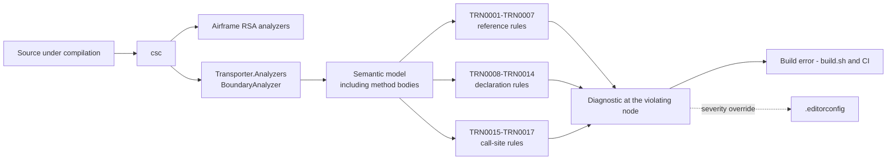
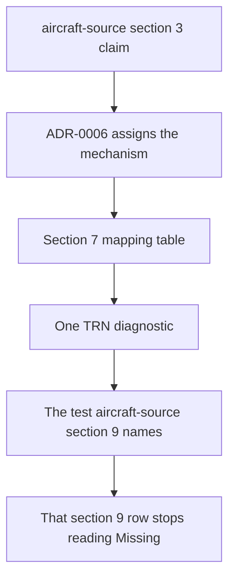

# Specification: Boundary analyzer

## 1. Business Goal

<!-- Rules: ../../../.spec/templates/feature.md § 1 -->

A third of [`aircraft-source`](../../Transporter/Integrations/OpenSky/.spec/README.md)'s claims
exist to hold its layers apart, and none of them is verified. Eighteen rows in
that specification's § 9 read `Missing` and name a test class that does not
exist, so every item in the Feature can be implemented and **nothing can ship**
— which is what its § 11 row 3 records. The failure state this Feature removes
is not an absent test suite; it is worse than that. A boundary claim is the
kind a reader believes is satisfied because no code has crossed it yet, and
[ADR-0006](../../../.spec/adr/0006-an-analyzer-enforces-the-layer-boundaries.md)
established that the obvious mechanism cannot tell the difference: a reference
lives in a method body, `System.Reflection` reaches signatures only, so a
reflection test for `aircraft-source` B-045 passes on a view model that
constructs a response envelope inside a method and throws it away. This Feature
builds the mechanism that decision chose — a Roslyn analyzer, shipped from this
repository, reporting those claims as compiler diagnostics at the line that
violates them, while it is being written. The outcome is that the repository's
layering stops being an agreement the author remembers and becomes a build
error for everyone, including a contributor who has read none of this. For a
repository whose purpose is to be a conference talk's takeaway, the enforcement
is part of what is being demonstrated.

## 2. User Needs

<!-- Rules: ../../../.spec/templates/feature.md § 2 -->

| #   | Persona                                                               | Need                                                                                                                             | Pain point today                                                                                                                                                                                      |
| --- | --------------------------------------------------------------------- | -------------------------------------------------------------------------------------------------------------------------------- | ----------------------------------------------------------------------------------------------------------------------------------------------------------------------------------------------------- |
| 1   | The presenter, after the talk, maintaining the repository as a sample | The layering survives contact with contributors who never read the specification                                                 | The rules live in prose — a specification section, a skill, a code review. Nothing stops a pull request that names a wire type from a view model, and review is worst at catching one line at a time. |
| 2   | A developer in the audience reading the repository afterwards         | To see the layer rules enforced by the same compiler that builds the code, as the demonstrated practice rather than an assertion | The repository tells them a boundary exists and shows them nothing that holds it. The most interesting claim the sample makes about structure is the one it cannot show working.                      |
| 3   | The implementer of any `aircraft-source` item                         | A boundary violation to fail where it was written, with the claim named, rather than as a red assertion elsewhere read backwards | Eighteen § 9 rows name a test that does not exist, so the implementer gets no signal at all, and the claims most likely to be "satisfied by absence" are exactly the unverified ones.                 |
| 4   | The person deciding what ships                                        | The eighteen `Missing` rows to close, because a `Missing` row blocks ship                                                        | `aircraft-source` § 11 row 3 is open: no mechanism exists, so no item can claim `done`, and the scheduling question has no answer written anywhere.                                                   |

## 3. Acceptance Criteria

<!-- Rules: ../../../.spec/templates/feature.md § 3 -->

Twenty claims in five groups: **B-001 – B-008** the diagnostic surface — what
a diagnostic is, what it carries, where it reports and how loud it is;
**B-009 – B-013** what the rules may examine and what they may not;
**B-014 – B-017** how the analyzer ships and how a violation reaches a build;
**B-018 and B-019** the discipline that keeps this Feature from becoming a
second store for another specification's claims; and **B-020**, appended when
§ 5 row 2 was reversed rather than renumbered into the group it belongs to —
ids here are permanent.

Claim ids are per-Feature, per
[`spec-and-traceability`](../../../.skills/spec-and-traceability/SKILL.md)
§ "Claims and traceability". `B-004` here and `B-004` in
[`aircraft-source`](../../Transporter/Integrations/OpenSky/.spec/README.md) are different
claims. Because this specification is _about_ that one, every reference to a
foreign claim below is written with its specification —
`aircraft-source B-045`, never a bare `B-045`. A bare id in this document is
this document's own.

| ID    | Claim                                                                                                                                                                                                                                                                                                                                                                                                                                                                                                        | Source                                                                                 |
| ----- | ------------------------------------------------------------------------------------------------------------------------------------------------------------------------------------------------------------------------------------------------------------------------------------------------------------------------------------------------------------------------------------------------------------------------------------------------------------------------------------------------------------ | -------------------------------------------------------------------------------------- |
| B-001 | Each claim the analyzer enforces SHALL have exactly one diagnostic id, and each diagnostic id SHALL enforce exactly one claim.                                                                                                                                                                                                                                                                                                                                                                               | ADR-0006 § Decision                                                                    |
| B-002 | Every diagnostic SHALL carry the `TRN` prefix, SHALL be numbered from the analyzer's own sequence starting at `TRN0001`, and SHALL NOT encode the number of the claim it enforces.                                                                                                                                                                                                                                                                                                                           | [adr/0001](adr/0001-trn-ids-on-their-own-sequence.md); ADR-0006 § Decision 4           |
| B-003 | A diagnostic's title and message SHALL name the specification and the claim id it enforces, so a build message says which agreement broke without the reader holding this document.                                                                                                                                                                                                                                                                                                                          | ADR-0006 § Decision 4                                                                  |
| B-004 | A diagnostic SHALL be reported at the syntax node that violates the claim — the reference, the declaration, or the registration — and SHALL NOT be reported with no location, nor with an empty symbol name in its message.                                                                                                                                                                                                                                                                                  | ADR-0006 § Decision 2; `RocketSurgeonsGuild/Airframe#403`                              |
| B-005 | No diagnostic SHALL be reported against generated code; the analyzer SHALL declare `GeneratedCodeAnalysisFlags.None`.                                                                                                                                                                                                                                                                                                                                                                                        | `RocketSurgeonsGuild/Airframe#403`; `.editorconfig` cannot reach a generator           |
| B-006 | Every diagnostic SHALL default to `error`, and the only way to weaken one SHALL be a severity entry in [`.editorconfig`](../../../.editorconfig).                                                                                                                                                                                                                                                                                                                                                            | ADR-0006 § Consequences                                                                |
| B-007 | A diagnostic id SHALL NOT be renumbered, and a retired one SHALL NOT be reused.                                                                                                                                                                                                                                                                                                                                                                                                                              | [adr/0001](adr/0001-trn-ids-on-their-own-sequence.md) § Decision 3                     |
| B-008 | The analyzer SHALL carry exactly the seventeen `aircraft-source` claims ADR-0006 assigns it — `aircraft-source` B-002, B-004 – B-008, B-014, B-030 – B-032, B-037, B-041, B-044 – B-048 — and SHALL carry no rule that no claim asks for.                                                                                                                                                                                                                                                                    | ADR-0006 § Decision drivers; `aircraft-source` § 11 row 3                              |
| B-009 | A claim about what may reference what SHALL be evaluated over the semantic model including method bodies — a local, a `new`, a cast, a generic argument supplied at a call site, a type named only inside a method — and SHALL NOT be reported satisfied from signatures alone.                                                                                                                                                                                                                              | ADR-0006 § Context — the constraint that forces the choice                             |
| B-010 | A claim about a declaration's shape SHALL be evaluated on that declaration, and reported on it.                                                                                                                                                                                                                                                                                                                                                                                                              | ADR-0006 § Context — "what a declaration may look like"                                |
| B-011 | A claim about registration SHALL be evaluated at the registration call site rather than on the registered type, so a lifetime or an alias is read where it is chosen.                                                                                                                                                                                                                                                                                                                                        | `aircraft-source` B-008, B-031 — both are about the call, not the type                 |
| B-012 | **Withdrawn** — the mocking-framework half of `aircraft-source` B-010 was to be reported at the call that produces the double. Withdrawn 2026-10-05 with the claim it enforced: `aircraft-source` B-010 is Withdrawn, so there is no agreement left for a rule to carry. `TRN0018` is retired, its id reserved in `AnalyzerReleases.Unshipped.md`. See `aircraft-source` § 11 row 4 and [its lesson 0002](../../Transporter/Integrations/OpenSky/.spec/lessons/0002-an-inherited-rule-is-not-a-decision.md). | `aircraft-source` § 9 row B-010                                                        |
| B-013 | No diagnostic SHALL assert a computed value; a claim about behaviour SHALL remain an xUnit test, and the analyzer SHALL NOT become a second place to assert one.                                                                                                                                                                                                                                                                                                                                             | ADR-0006 § Decision 6                                                                  |
| B-014 | The analyzer SHALL be its own project, referenced by the projects it analyzes as an analyzer and not as an assembly, so no analyzer code reaches the shipped application.                                                                                                                                                                                                                                                                                                                                    | ADR-0006 § Consequences — nothing new in the app's graph                               |
| B-015 | The analyzer SHALL take no dependency the application takes, and no application project SHALL name a type from it; the test project names it only in order to test it.                                                                                                                                                                                                                                                                                                                                       | `transporter-conventions` references/coding.md § Dependencies; ADR-0006 § Consequences |
| B-016 | Each enforced claim SHALL be proven by the test `aircraft-source` § 9 already names for it, under that name; those names SHALL NOT be changed to suit the implementation.                                                                                                                                                                                                                                                                                                                                    | `aircraft-source` § 9; `spec-and-traceability` § "A cite names something that exists"  |
| B-017 | A violation SHALL fail the ordinary build — `./build.sh` and the pull-request workflow it drives — rather than a separate lint step a contributor can skip.                                                                                                                                                                                                                                                                                                                                                  | ADR-0006 § Consequences — "a build error for everyone"                                 |
| B-018 | A rule SHALL NOT exist before the claim it enforces: a new diagnostic requires a § 3 row in the specification it serves, written by that specification's `spec-author`.                                                                                                                                                                                                                                                                                                                                      | ADR-0006 § Decision 4; `spec-and-traceability` § "Section ownership"                   |
| B-019 | § 7's mapping table SHALL be the only store for which diagnostic enforces which claim, and SHALL NOT restate a foreign claim's text, nor the test name `aircraft-source` § 9 owns.                                                                                                                                                                                                                                                                                                                           | `spec-and-traceability` § "One answer, one section"                                    |
| B-020 | Every diagnostic SHALL ship a code fix, or § 7 SHALL record why its violation has no mechanical fix. A fix SHALL change only what the claim requires, and SHALL NOT guess at a design decision.                                                                                                                                                                                                                                                                                                              | The person, 2026-10-04; `RocketSurgeonsGuild/Airframe#402`                             |

## 4. Constraints

<!-- Rules: ../../../.spec/templates/feature.md § 4 -->

| #   | Constraint                                                                                                                                                                     | Source                                                                                               | Impact                                                                                                                                                                   |
| --- | ------------------------------------------------------------------------------------------------------------------------------------------------------------------------------ | ---------------------------------------------------------------------------------------------------- | ------------------------------------------------------------------------------------------------------------------------------------------------------------------------ |
| 1   | An analyzer is loaded by the compiler, not by the application, so it targets the Roslyn load contract rather than the repository's application framework                       | Roslyn analyzer hosting                                                                              | The analyzer project's target framework is fixed by what `csc` will load, not by `global.json`'s SDK or the app's `net10.0`. B-014's reference shape follows from it.    |
| 2   | A diagnostic reported with no location cannot be suppressed by a `#pragma` or by any `.editorconfig` section, and one reported against generated source cannot be fixed at all | `RocketSurgeonsGuild/Airframe#403`, reproduced in this repository on 2026-10-04                      | B-004 and B-005 are not polish: they are the difference between a rule a contributor can work with and one whose only escape is disabling it for a whole project.        |
| 3   | No architecture-rule library joins the repository                                                                                                                              | ADR-0006 § Consequences                                                                              | NetArchTest and ArchUnitNET are out, and `Directory.Packages.props` grows only by what the analyzer project itself needs.                                                |
| 4   | Package versions are central and a `.csproj` carries no `Version` attribute                                                                                                    | `transporter-conventions` references/coding.md § Dependencies                                        | Every package the analyzer and its tests need is added to `Directory.Packages.props` in the same change.                                                                 |
| 5   | A claim id identifies a claim only with its specification                                                                                                                      | `spec-and-traceability` § "Claims and traceability"                                                  | A diagnostic id cannot carry a claim number, which is what [adr/0001](adr/0001-trn-ids-on-their-own-sequence.md) decides and B-002 states.                               |
| 6   | The Airframe `RSA` set already loads for every project in the repository, with five of its rules raised to `error`                                                             | [`Directory.Build.props`](../../../Directory.Build.props); [`.editorconfig`](../../../.editorconfig) | `TRN` ids must not collide with `RSA`, `CS`, `CA` or `IDE`, and a `TRN` severity override sits in the same file as the `RSA` ones rather than in a mechanism of its own. |
| 7   | Every claim this analyzer carries stands `Missing` until it exists, and a `Missing` row blocks ship                                                                            | `aircraft-source` §§ 9, 11 row 3                                                                     | The schedule is not this Feature's to set, but the dependency is one-way: no `aircraft-source` item can claim `done` before this one lands.                              |

## 5. Out of Scope

<!-- Rules: ../../../.spec/templates/feature.md § 5 -->

| #   | Item                                                                                | Exclusion reason                                                                                                                                                                                                                                                                                             |
| --- | ----------------------------------------------------------------------------------- | ------------------------------------------------------------------------------------------------------------------------------------------------------------------------------------------------------------------------------------------------------------------------------------------------------------ |
| 1   | `aircraft-source` B-009 and B-049                                                   | ADR-0006 § Decision: both constrain code that does not exist — no published provider version, no push provider — so there is nothing to analyze. They are review obligations on the change that creates the precondition.                                                                                    |
| 2   | A code fix for a diagnostic whose violation has no mechanical fix                   | **Reversed 2026-10-04** — this row read "a code fix for any diagnostic" and is now B-020: a diagnostic ships a fix, or § 7 records why the violation is a decision only the author can make. What stays excluded is a fix that would have to guess at a design change, which is most of the reference rules. |
| 3   | Rules for [`replay-source`](../../../features/replay-source/.spec/README.md) claims | That specification's § 9 is unwritten, so no claim there has been assigned to this mechanism yet. § 11 row 3 carries the question.                                                                                                                                                                           |
| 4   | Re-litigating the Airframe `RSA` severities, or replacing that set                  | `.editorconfig` already configures them and ADR-0006 § Decision 3 treats this analyzer as the same mechanism with our rules in it, not a replacement.                                                                                                                                                        |
| 5   | Naming, ordering, line length and documentation rules                               | Airframe's `RSA1xxx` – `RSA3xxx` already cover style. B-008 and B-018 forbid a rule no claim asks for, and a style rule here would be exactly that.                                                                                                                                                          |
| 6   | Packaging the analyzer for consumption by other repositories                        | It enforces this repository's layering, named against this repository's folders. A package implies rules general enough to reuse, which these are not.                                                                                                                                                       |
| 7   | Analyzing the `.build` project                                                      | [`.build/Directory.Build.props`](../../../.build/Directory.Build.props) deliberately imports nothing from the root, so the build project carries no analyzers at all today. Keeping it that way is the existing decision.                                                                                    |

## 6. Concern Separation

<!-- Rules: ../../../.spec/templates/feature.md § 6 -->

| Item                                                          | Classification | Notes                                                                                                                                                                                                                  |
| ------------------------------------------------------------- | -------------- | ---------------------------------------------------------------------------------------------------------------------------------------------------------------------------------------------------------------------- |
| Closing the eighteen `Missing` rows so items can ship         | Business       | The reason this Feature is scheduled at all. It is a release gate, not a technical preference, and § 1's failure state is stated in those terms.                                                                       |
| Enforcement at compile time rather than at test time          | Both           | Technically it is the only option that sees method bodies (ADR-0006 § Context). It is also the business claim the talk makes about this repository, which is why the technical reading alone would understate it.      |
| The diagnostic id scheme and its own sequence                 | Technical      | [adr/0001](adr/0001-trn-ids-on-their-own-sequence.md). No audience sees an id; it exists so the rules stay addressable as the analyzer grows.                                                                          |
| Reporting at the violating node, and never on generated code  | Both           | Technically a Roslyn registration detail. In business terms it is whether a contributor can act on the message or can only switch the rule off, which Constraint 2 shows is a real outcome and not a hypothetical one. |
| Default severity `error`, overridable only in `.editorconfig` | Both           | The technical choice is a `DiagnosticDescriptor` default. The business choice is that stopping work is acceptable and that the escape hatch is a visible edit rather than a silent suppression.                        |
| What the analyzer may not assert                              | Technical      | B-013. Keeping behaviour in xUnit is a separation-of-mechanism rule; no outcome in § 1 depends on which one proves a computed value.                                                                                   |

## 7. Technical Design

<!-- Rules: ../../../.spec/templates/feature.md § 7 -->

**The mapping**

One diagnostic per enforced claim (B-001), `TRN` ids on their own sequence
([adr/0001](adr/0001-trn-ids-on-their-own-sequence.md), B-002), grouped by what
the rule has to look at. This table is the only store for the mapping (B-019):
the claim's text lives in
[`aircraft-source`](../../Transporter/Integrations/OpenSky/.spec/README.md) § 3 and the test
that proves it in that specification's § 9, so neither is copied here.

| Diagnostic | Enforces                | What it examines                                                                                                                   |
| ---------- | ----------------------- | ---------------------------------------------------------------------------------------------------------------------------------- |
| `TRN0001`  | `aircraft-source` B-004 | Every reference to the positional row from outside the integration                                                                 |
| `TRN0002`  | `aircraft-source` B-045 | Every reference to the envelope or the row, against the implementations of the contract and the snapshot client                    |
| `TRN0003`  | `aircraft-source` B-046 | Every reference to a snapshot, against the client, its cache and the projection                                                    |
| `TRN0004`  | `aircraft-source` B-047 | References from below `IFleetTracker` to a contract, client, cache, snapshot or concrete source, excluding what the seam publishes |
| `TRN0005`  | `aircraft-source` B-032 | References to a domain type from the cache                                                                                         |
| `TRN0006`  | `aircraft-source` B-041 | References from a view model to a strategy, a client, a cache or the decorator, excluding what the seam publishes                  |
| `TRN0007`  | `aircraft-source` B-044 | Imperative mutation of a bound collection                                                                                          |
| `TRN0008`  | `aircraft-source` B-002 | The envelope's members                                                                                                             |
| `TRN0009`  | `aircraft-source` B-005 | The contract's method signatures                                                                                                   |
| `TRN0010`  | `aircraft-source` B-006 | The types the contract's declarations name                                                                                         |
| `TRN0011`  | `aircraft-source` B-007 | Implementations of the contract: count per transport, accessibility, sealedness, explicit implementation                           |
| `TRN0012`  | `aircraft-source` B-014 | The snapshot's members                                                                                                             |
| `TRN0013`  | `aircraft-source` B-037 | The per-type tracker source interface's members                                                                                    |
| `TRN0014`  | `aircraft-source` B-048 | The contract's name and any interface above it                                                                                     |
| `TRN0015`  | `aircraft-source` B-008 | Registration and resolution call sites naming an implementation type                                                               |
| `TRN0016`  | `aircraft-source` B-030 | The cache's declaration and the type it is registered as                                                                           |
| `TRN0017`  | `aircraft-source` B-031 | The cache's registration: lifetime, and one per client                                                                             |

**What a fix can do, and where it cannot**

B-020 asks for a code fix per diagnostic or a reason there is none. Three rules
admit one; fourteen do not, and the pattern is the same one Airframe records for
its own `RSA2008`, `RSA2009` and `RSA2012` — a fix exists where the compliant
form is _determined_, and nowhere else.

| Diagnostic                      | Fix | What it does, or why there is none                                                                                                                                                                                                                    |
| ------------------------------- | --- | ----------------------------------------------------------------------------------------------------------------------------------------------------------------------------------------------------------------------------------------------------- |
| `TRN0009`                       | Yes | Moves the `CancellationToken` to last. The compliant parameter order is determined by the claim.                                                                                                                                                      |
| `TRN0011`                       | Yes | Adds the `internal` and `sealed` the claim requires and converts a public endpoint method to an explicit implementation. The modifiers are the ones the claim names, not a choice.                                                                    |
| `TRN0017`                       | Yes | Rewrites the cache's registration to the application's lifetime. One call, one argument.                                                                                                                                                              |
| `TRN0001` – `TRN0007`           | No  | A forbidden reference is removed by moving work to the layer that may hold it. Which layer, and what the replacement seam is, is the design decision the claim exists to force — a fix that deleted the reference would delete the behaviour with it. |
| `TRN0008`, `TRN0012`, `TRN0013` | No  | The compliant form is a member that is not there. Deleting a member is destructive and the author may instead want it moved, so the fix is a conversation.                                                                                            |
| `TRN0010`, `TRN0014`            | No  | Both are satisfied by renaming or re-siting a type. Either changes a public surface, and `TRN0014`'s compliant form depends on whether the provider has published a version.                                                                          |
| `TRN0015`, `TRN0016`            | No  | A registration that reaches an implementation type is fixed by introducing or using an alias that may not exist yet.                                                                                                                                  |

A fix ships with the rule it fixes, in the item that builds it and in
`src/Transporter.CodeFixes`, and its own test applies one action per pass and
re-analyzes — a fix that only works in
isolation is the failure mode Airframe's `AllDesignRulesFixedTests` exists to
catch.

`TRN0001` – `TRN0007` are the rules that cannot be written any other way:
each is satisfied or violated by a reference that may appear only inside a
method body, which is ADR-0006 § Context's whole argument and this
specification's B-009. `TRN0008` – `TRN0014` read declarations (B-010).
`TRN0015` – `TRN0017` read call sites — registrations and resolutions (B-011).
`TRN0018` read the call that built the contract's double and is retired with
B-012; the id stays in the release record so nothing reuses it (B-007).

**Layout**

```
src/Transporter.Analyzers/            the analyzer project (B-014)
  BoundaryAnalyzer.cs                 one DiagnosticAnalyzer; the registrations
  Diagnostics.cs                      the TRN descriptors (B-002, B-003, B-006)
  Layers.cs                           namespace to layer, per adr/0002
  AnalyzerReleases.Unshipped.md       every id handed out (B-007)
src/Transporter.CodeFixes/            the fixes B-020 asks for, in a project of their own
test/UnitTests/Analyzers/             the tests, and the harness wrapper they share
```

**The fixes are a second project**, not a folder in the first. A
`CodeFixProvider` needs `Microsoft.CodeAnalysis.Workspaces`, which an analyzer
does not and should not carry into the compiler's load path; the `source-generators`
skill § "Project Structure" fixes that split, and § "Why Separate Analyzer and
CodeFix Assemblies" says why. It is referenced the same way the analyzer is —
`OutputItemType="Analyzer"`, `ReferenceOutputAssembly="false"` — from the same
item group in the root `Directory.Build.props`.

The analyzer project sits under `src/` beside the application projects rather
than under `.build/`: it is shipped code that the compiler loads, not build
automation. `test/UnitTests` keeps the tests, because
[`transporter-conventions`](../../../.skills/transporter-conventions/SKILL.md)
§ `test-from-scenarios` names one test project and ADR-0006 § Decision 5 says
the analyzer's tests are ordinary tests.

**Diagrams**





Not applicable — no sequence diagram and no state diagram: the analyzer has no
collaborators to sequence and no state. Nothing in it outlives one compilation.

**Interface changes**

No file exists yet, so the shape is written out here rather than as a row; it
becomes a row under `| Type | File | Claims it makes visible |` in the change
that creates each file, per
[`spec-and-traceability`](../../../.skills/spec-and-traceability/SKILL.md)
§ "A declaration belongs to the file that compiles".

```csharp
// One analyzer, seventeen descriptors. One analyzer class per rule would give
// seventeen copies of the layer identification below, which is the part most
// likely to change once § 11 row 1 is answered.
[DiagnosticAnalyzer(LanguageNames.CSharp)]
public sealed class BoundaryAnalyzer : DiagnosticAnalyzer
{
    public override ImmutableArray<DiagnosticDescriptor> SupportedDiagnostics { get; }

    public override void Initialize(AnalysisContext context);
}
```

`Initialize` is where B-005 is satisfied, by
`ConfigureGeneratedCodeAnalysis(GeneratedCodeAnalysisFlags.None)`, and B-009 by
registering operation actions over bodies rather than symbol actions over
signatures. A descriptor carries the `TRN` id (B-002), the enforced claim in
its title and message format (B-003), and `error` as its default severity
(B-006); `Diagnostics.cs` holds them so the conventions B-001 – B-007 are
checkable in one place by one test class rather than seventeen.

**Decision required**

No open decisions. The one this section carried — how a rule identifies a layer
— is answered in [adr/0002](adr/0002-layers-are-identified-by-namespace.md):
the containing namespace, read against the layout
[`transporter-conventions`](../../../.skills/transporter-conventions/SKILL.md)
§ "Project structure" already fixes, with the mapping held in `Layers.cs` so the
seven reference rules ask one place. A marker attribute stays available for a
type the convention cannot classify, and is built for nothing today.

The hazard that answer carries is recorded with it: a misfiled file silently
changes which rules apply to it. It is paid for with a test of its own rather
than with a different mechanism.

## 8. Testing Strategy

<!-- Rules: ../../../.spec/templates/feature.md § 8 -->

**Testability assessment**

| Dimension          | Verdict       | Finding                                                                                                                                                                                                                                     | Recommendation                                                                                                                    |
| ------------------ | ------------- | ------------------------------------------------------------------------------------------------------------------------------------------------------------------------------------------------------------------------------------------- | --------------------------------------------------------------------------------------------------------------------------------- |
| DI seams           | Pass          | An analyzer has no dependencies to inject: it is handed a compilation and reports. The seam under test is the source text, which the test supplies as a string.                                                                             | —                                                                                                                                 |
| Behavior isolation | Pass          | Each rule is one descriptor over one registration, and a test compiles the minimum source that triggers it. No rule reads the filesystem, a clock, or the network.                                                                          | —                                                                                                                                 |
| Coverage potential | **Qualified** | Thirteen of this Feature's claims are ordinary tests. Four are not: B-014 and B-015 are about the project graph, B-017 about the build, B-018 about process. A test asserting an `.csproj` attribute asserts the build file, not behaviour. | Those four stand **Review** in § 9 with the obligation named, rather than being given a test that would read as coverage of them. |

**Scenarios**

Scenarios live in
[`boundary-analyzer.feature`](boundary-analyzer.feature) beside this file, each
carrying the `@B-00n` tag of the claim it proves. Scenarios are documentation;
the xUnit tests execute
([`test-from-scenarios`](../../../.skills/test-from-scenarios/SKILL.md)).

- Diagnostic surface → B-001 – B-008
- What a rule may examine → B-009 – B-013
- Shipping and the build gate → B-014 – B-017
- The discipline that keeps one store → B-018, B-019
- A fix, or a recorded reason there is none → B-020

A rule's own correctness is proven by the test
[`aircraft-source`](../../Transporter/Integrations/OpenSky/.spec/README.md) § 9 names for the
claim it enforces, under that name (B-016). Those seventeen tests are not
restated here and not re-specified: that matrix owns them, and this
specification's scenarios cover the analyzer's conventions, not the seventeen
rules' subject matter.

The tests compile source text in-process and assert both the diagnostic id and
its location, because B-004 is a claim about where a diagnostic lands and a
test that asserts only the id would pass on the failure mode Constraint 2
describes.

## 9. Traceability Matrix

<!-- Rules: ../../../.spec/templates/feature.md § 9 -->

| Claim ID | Scenario | Test                                                                                                                                                                                                                     | Status   |
| -------- | -------- | ------------------------------------------------------------------------------------------------------------------------------------------------------------------------------------------------------------------------ | -------- |
| B-001    | `@B-001` | `BoundaryAnalyzerDescriptorTests.GivenTheSupportedDiagnostics_WhenEachIsMappedToAClaim_ThenTheMappingIsOneToOne`                                                                                                         | Verified |
| B-002    | `@B-002` | `BoundaryAnalyzerDescriptorTests.GivenTheSupportedDiagnostics_WhenTheIdsAreRead_ThenEachIsTrnPrefixedAndCarriesNoClaimNumber`                                                                                            | Verified |
| B-003    | `@B-003` | `BoundaryAnalyzerDescriptorTests.GivenTheSupportedDiagnostics_WhenTheTitlesAndMessagesAreRead_ThenEachNamesItsSpecificationAndClaim`                                                                                     | Verified |
| B-004    | `@B-004` | `BoundaryAnalyzerTests.GivenAViolationInAMethodBody_WhenAnalyzed_ThenTheDiagnosticIsReportedAtThatNodeAndNamesTheSymbol`                                                                                                 | Verified |
| B-005    | `@B-005` | `BoundaryAnalyzerTests.GivenAViolationInGeneratedSource_WhenAnalyzed_ThenNothingIsReported`                                                                                                                              | Verified |
| B-006    | `@B-006` | `BoundaryAnalyzerDescriptorTests.GivenTheSupportedDiagnostics_WhenTheDefaultSeveritiesAreRead_ThenEveryOneIsError`                                                                                                       | Verified |
| B-007    | `@B-007` | `BoundaryAnalyzerDescriptorTests.GivenTheSupportedDiagnostics_WhenTheIdsAreCompared_ThenNoneIsDuplicatedAndNoRetiredIdIsReused`                                                                                          | Verified |
| B-008    | `@B-008` | `BoundaryAnalyzerDescriptorTests.GivenTheMappingTable_WhenComparedWithTheAssignedClaims_ThenItIsExactlyTheSeventeenAndNothingMore`                                                                                       | Verified |
| B-009    | `@B-009` | `BoundaryAnalyzerTests.GivenATypeNamingAForbiddenTypeOnlyInsideAMethodBody_WhenAnalyzed_ThenItIsReported`                                                                                                                | Verified |
| B-010    | `@B-010` | `BoundaryAnalyzerTests.GivenAForbiddenShapeOnADeclaration_WhenAnalyzed_ThenItIsReportedOnThatDeclaration`                                                                                                                | Verified |
| B-011    | `@B-011` | `BoundaryAnalyzerTests.GivenAForbiddenRegistration_WhenAnalyzed_ThenItIsReportedAtTheRegistrationCall`                                                                                                                   | Verified |
| B-013    | `@B-013` | `BoundaryAnalyzerDescriptorTests.GivenTheMappingTable_WhenEachClaimIsClassified_ThenNoneIsAClaimAboutAComputedValue`                                                                                                     | Verified |
| B-014    | `@B-014` | **Review**, done on `0020` — `OutputItemType="Analyzer"` with `ReferenceOutputAssembly="false"`, and no copy of `Transporter.Analyzers.dll` under `src/Transporter/bin`, `src/Gui/bin` or `test/UnitTests/bin`.          | Verified |
| B-015    | `@B-015` | **Review**, done on `0020` and `0021` — `Microsoft.CodeAnalysis.CSharp` is referenced by the analyzer project and by the tests that drive it, by no application project, and no application file names an analyzer type. | Verified |
| B-016    | `@B-016` | **Review** — a cite check, not a behaviour: each test name in `aircraft-source` § 9 exists in `test/UnitTests` spelled that way. A test asserting its own name proves nothing.                                           | Verified |
| B-017    | `@B-017` | **Review**, done on `0021` — a seeded reference to the row from `DemoViewModel` failed `./build.sh` with `error TRN0001` at that line and column, and the seed was reverted.                                             | Verified |
| B-018    | `@B-018` | `BoundaryAnalyzerDescriptorTests.GivenADiagnosticWithNoClaimInTheMappingTable_WhenTheDescriptorsAreRead_ThenItIsReportedAsUnclaimed`                                                                                     | Verified |
| B-019    | `@B-019` | `BoundaryAnalyzerDescriptorTests.GivenTheMappingTable_WhenARowIsRead_ThenItNamesASpecificationAndClaimAndRestatesNeitherTextNorTest`                                                                                     | Verified |
| B-020    | `@B-020` | `BoundaryAnalyzerDescriptorTests.GivenADiagnosticWithNoCodeFix_WhenTheMappingTableIsRead_ThenItRecordsWhyNoneIsPossible`                                                                                                 | Verified |

**Nineteen rows `Verified`, none `Missing`: the gate is closed.** What is proven is
the analyzer's surface — the ids, the messages, the severities, the release
record, the mapping against this document's own § 7 table, the exclusion of
generated code, and a diagnostic that lands on the node and names the symbol —
and the three rule families, each reporting on what its claims are about: a
reference named anywhere including a method body (B-009), a declaration's shape
on that declaration (B-010), and a registration at the call that
writes it (B-011). B-020 holds every diagnostic to a fix or a recorded
reason, and three fixes ship. B-016 was the last to close, and only `0024` could
close it: it is a cite check over the test names `aircraft-source` § 9 fixes,
and it could not pass until the last of them existed. B-012 is Withdrawn and has
no row — `aircraft-source` B-010 went with it, which is also why that matrix now
holds seventeen of this analyzer's claims rather than eighteen.

**A closed gate here is not a closed gate there.** This specification's own
§ 9 says the analyzer does what it claims; `aircraft-source` § 9 still reports
fourteen rows unproven — thirty-two until its `0004` landed — because the
behaviour its items compute is not this Feature's to build. What did leave that matrix is every claim ADR-0006 assigned
to a diagnostic.

The seventeen rows in
[`aircraft-source`](../../Transporter/Integrations/OpenSky/.spec/README.md) § 9 are a separate
gate — eighteen until B-010 was withdrawn — and **fifteen of them have now left
`Missing`**: B-004 from `0021`; B-032
and B-044 – B-047 from `0022`; B-002, B-005 – B-007, B-014 and B-048 from
`0023`; B-008, B-030 and B-031 from `0024`. Each left by the test that
matrix named for it (B-016), under that name. B-010 left that matrix too, by
being withdrawn rather than by being proven.

**Two did not, and both for the same reason**: the claim has a half the analyzer
cannot reach. B-037 wants the key lowercased on construction, which is `0005`'s
mapper. B-041 wants `IFleetTracker` to wrap `ITrackerSource` and be what a view
model depends on, which no test asserts yet. The analyzer's half of each passes;
the rows name both mechanisms and stay `Missing`, because a row's status is the
conjunction of what it names. That matrix remains the only place those claims'
build state is written.

Four rows name a review obligation rather than a test, for the reason § 8's
coverage row gives: a test over a project file or a build script asserts the
file, not the claim. The obligation names what is checked and when, which is
[lesson 0006](../../../.spec/lessons/0006-a-row-is-not-a-reason-to-write-a-test.md)'s
form — a row is not a reason to write a test — rather than a gap left silent.

## 10. Lessons / Spec Deltas

<!-- Rules: ../../../.spec/templates/feature.md § 10 -->

**Delta, 2026-10-05 — B-012 is withdrawn and `TRN0018` is retired.** Trigger:
`aircraft-source` B-010 was withdrawn by the person, and B-012 enforced nothing
else. A rule outlives neither its claim nor the agreement the claim recorded, so
the descriptor, its analysis, its three tests and its test data are deleted, and
its mapping, code-fix and § 9 rows go with them. The id is **not** reused and
stays in `AnalyzerReleases.Unshipped.md` (B-007). B-008's set drops from eighteen
to seventeen, which also drops `aircraft-source`'s mechanism-derived count. The
reasoning behind the withdrawal is that Feature's, not this one's:
[its lesson 0002](../../Transporter/Integrations/OpenSky/.spec/lessons/0002-an-inherited-rule-is-not-a-decision.md).
Nothing about the analyzer's own conventions moved — this Feature's B-001 – B-007
hold identically over seventeen descriptors — so § 12 keeps its rows.

**Delta, 2026-10-05 — `TRN0016`'s wrapper clause exempts the snapshot client.**
Trigger: `0004` registered `AircraftSnapshotClient` and the build failed with
`TRN0016`, reporting that the registration "gives the cache a type of its own".
The rule read a registered type holding a cache field as a wrapper, and the
client holds one because `aircraft-source` B-015 **requires** it to take the
cache by constructor — so as written the two claims could not both be satisfied.
The rule was narrowed rather than suppressed: what B-030 forbids is a type that
_is_ the cache, and the writer above a cache never is. No claim changed and no
§ 9 row moved; the test for `TRN0016` gains a third case, a registered client
holding its cache, reported as nothing. Found by the first item to register a
client, which is the first moment the false positive could exist.

**Delta, 2026-10-06 — `TRN0004` and `TRN0006` exempt what the seam publishes.**
Trigger: the first view model `fleet-dashboard` added did not compile, because
both rules read "a non-interface type under `Transporter.Tracking`" as a source
internal and [ADR-0009](../../../.spec/adr/0009-the-pipeline-publishes-changesets-a-consumer-binds.md)
put the published element and the description in that namespace. The rules now
read the seam — `IFleetTracker`'s members, and the types those carry — rather
than the namespace, so a member added to the interface carries its types across
with it. No claim changed: `aircraft-source` B-041 and `fleet-dashboard` B-020
never forbade the published element, and the strategy, the client, the cache and
the decorator are reported exactly as before
([lesson 0001](lessons/0001-a-rule-that-reads-a-namespace.md), item
[`0045`](../.issue/0045-published-types-reported-as-internals.yml)).

**Delta, 2026-10-06 — `TRN0002` reads the contract a class implements rather
than the folder it sits in.** Trigger: the first file `replay-source` `0011`
added did not compile, because the rule allowed the transport namespace and a
`Client` name suffix, and a replay implementation of the same contract is
neither — so it was reported for naming the envelope its own signature returns.
The rule now asks what a class implements, which is what
`aircraft-source` B-045 says and what the descriptor's message already printed.
No claim changed, no descriptor changed and B-008's set is still seventeen; a
type beside the replay contract that implements nothing is reported exactly as
before ([lesson 0002](lessons/0002-a-rule-that-reads-a-folder.md), item
[`0053`](../.issue/0053-contract-implementation-read-from-its-folder.yml)).

Two Feature-scoped lessons,
[lesson 0001](lessons/0001-a-rule-that-reads-a-namespace.md) and
[lesson 0002](lessons/0002-a-rule-that-reads-a-folder.md) — one rule that read a
namespace and one that read a folder, which is the same mistake twice and why
the rule now lives in a skill. Three
repository-wide lessons bear on this document:
[lesson 0002](../../../.spec/lessons/0002-metadata-about-a-rule-drifts-too.md),
which is why § 3 carries no build state and § 9 is the only store for one;
[lesson 0006](../../../.spec/lessons/0006-a-row-is-not-a-reason-to-write-a-test.md),
which is why the four rows above name a review obligation instead of a test
that would read as coverage; and
[lesson 0003](../../../.spec/lessons/0003-a-dedupe-is-a-move-and-a-move-has-a-destination.md),
which is why B-019 states where the mapping lives rather than only forbidding
a copy of it.

B-004 and B-005 were not derived from ADR-0006. They were written after an
upstream analyzer in this repository's own build reported a diagnostic with an
empty symbol name and no location at all, which no `#pragma` and no
`.editorconfig` section could reach, leaving a project-wide `NoWarn` as the
only escape — `RocketSurgeonsGuild/Airframe#403`, filed 2026-10-04. The rule we
are about to write has exactly that failure mode available to it.

## 11. Open Questions

<!-- Rules: ../../../.spec/templates/feature.md § 11 -->

| #   | Question                                                                                                                                                                                                                                                                                                        | Owner         | Target date                           |
| --- | --------------------------------------------------------------------------------------------------------------------------------------------------------------------------------------------------------------------------------------------------------------------------------------------------------------- | ------------- | ------------------------------------- |
| 3   | Does this analyzer also carry [`replay-source`](../../../features/replay-source/.spec/README.md) claims? That specification's § 9 is unwritten, so none is assigned yet, and B-008 fixes the set at seventeen. If any arrive, this is a § 3 amendment and a new `TRN` id, not an extension of an existing rule. | `spec-author` | Before `replay-source` § 9 is written |

**Row 1 — answered: a rule identifies a layer by namespace.** Recorded as
[adr/0002](adr/0002-layers-are-identified-by-namespace.md) rather than deleted,
with the marker attribute and the project-per-layer option and the reason each
was rejected. Its number is not reused and rows 2 – 4 keep theirs, so a
reference written while it was open still points at the question it meant. It
unblocked `0022`.

**Row 4 — answered: it landed on 2026-10-05, before the talk rather than
against it.** The question was when this Feature would be scheduled, and the
answer is that it is finished: `0020` – `0024` built all eighteen rules
ADR-0006 then assigned, § 9 above read twenty `Verified` and none `Missing`,
and sixteen of the eighteen `aircraft-source` rows left `Missing` with them.
Both counts dropped by one later that day, when `aircraft-source` B-010 was
withdrawn and `TRN0018` retired with it — the answer to this question is
unchanged, since nothing about it turned on how many rules there were. That retires the "when" half of
that specification's § 11 row 3, which this document had only answered the "by
whom" half of. Its number is not reused and row 3 keeps its own.

**Row 2 — answered: B-044 is the eighteenth, and
[ADR-0006](../../../.spec/adr/0006-an-analyzer-enforces-the-layer-boundaries.md)
§ Context now lists it.** The record said eighteen and enumerated seventeen;
the missing id was the one claim here reported on a call rather than on a
name, which is why it fell out of a list written by what each rule examines.
Nothing else moved: B-008 already fixed the set at eighteen — seventeen since
B-012's withdrawal — § 7's table
already carried `TRN0007` for it, and `0022` already built and proved the
rule. The ADR is `proposed`, so correcting it is an edit rather than a
supersession. Its number is not reused and rows 3 and 4 keep theirs.

## 12. Sign-off

<!-- Rules: ../../../.spec/templates/feature.md § 12 -->

| Sections | Owner       | Status      |
| -------- | ----------- | ----------- |
| §§ 1-5   | spec-author | 🟢 Approved |
| §§ 6-7   | implementer | 🟢 Approved |
| §§ 8-9   | test-writer | 🟢 Approved |

What `approved` requires, and why a `Missing` row in § 9 does not hold it
back, is [the template's § 12](../../../.spec/templates/feature.md).

## Decisions

<!-- Rules: ../../../.spec/templates/feature.md § Decisions -->

None yet. No product or scope call has been made or reversed here: the
mechanism was chosen repository-wide in
[ADR-0006](../../../.spec/adr/0006-an-analyzer-enforces-the-layer-boundaries.md)
and the one choice this Feature has made of its own — the diagnostic id scheme
— is a durable technical decision, so it is
[adr/0001](adr/0001-trn-ids-on-their-own-sequence.md) beside this file rather
than a `decisions/` record.

## Tasks

<!-- Rules: ../../../.spec/templates/feature.md § Tasks -->

| Item                                                         | Claims                                          |
| ------------------------------------------------------------ | ----------------------------------------------- |
| [`0019`](../.issue/0019-boundary-analyzer.yml)               | all 19 — the parent; its children hold the work |
| [`0020`](../.issue/0020-analyzer-project-and-build-gate.yml) | B-014, B-015, B-017                             |
| [`0021`](../.issue/0021-diagnostic-surface.yml)              | B-001 – B-008, B-013, B-016, B-018, B-019       |
| [`0022`](../.issue/0022-reference-rules.yml)                 | B-009                                           |
| [`0023`](../.issue/0023-declaration-rules.yml)               | B-010                                           |
| [`0024`](../.issue/0024-registration-and-double-rules.yml)   | B-011, B-012 (Withdrawn)                        |
| [`0051`](../.issue/0051-verbose-comment-diagnostic.yml)      | none yet — § 3 gains them when § 7 settles it   |

`0051` is the one row whose Claims column is empty, and that is what
`ready-for-architecture` means here: pull request #36's review asked for a
diagnostic over verbose XML comments and raised a second, narrower question —
whether a comment may carry a claim or record identifier at all — as a
suspicion rather than a decision. § 7 answers it, § 3 gains a claim per rule,
and only then is there anything to build
([lesson 0017](../../../.spec/lessons/0017-a-written-convention-with-no-gate-is-a-preference.md)
is why the rule needs a gate at all).

Every claim is carried by exactly one child, and `0019` carries all of them
because the children are slices of it. `0024` keeps B-012 after its withdrawal:
this map says which item delivered a claim, and `0024` did deliver it. What is
live is § 3, where B-012 opens `**Withdrawn**`, and § 9, which has no row
for it. The children are cut on what a rule has
to look at rather than on § 3's four groups: `0021` holds the conventions every
rule obeys, and `0022` – `0024` hold the three families § 7's mapping table
groups, because a reference rule, a declaration rule and a call-site rule are
three different registrations against the same compilation.

`depends_on` sequences them: `0020` first, because nothing can be written
before the project the compiler loads exists; `0021` next, because the
descriptor conventions are what every rule is then built against; then `0022`,
`0023` and `0024` in parallel, each held by § 11 row 1 only in `0022`'s case.

The seventeen `aircraft-source` claims are **not** listed in any `claims:` here.
They belong to that specification and its § 9 owns their coverage; an item in
this Feature naming them would be the second store B-019 forbids.

## Scoring

<!-- Rules: ../../../.spec/templates/feature.md § Scoring -->

| Date       | Item   | Field | Rationale                                                                                                                                                                                                                                                                                                                                                          |
| ---------- | ------ | ----- | ------------------------------------------------------------------------------------------------------------------------------------------------------------------------------------------------------------------------------------------------------------------------------------------------------------------------------------------------------------------ |
| 2026-10-04 | `0019` | value | 5. Eighteen rows in another Feature's § 9 cannot leave `Missing` without this, and a `Missing` row blocks ship — so every item in `aircraft-source` is complete-but-unshippable until this lands. Nothing else in the repository has that property.                                                                                                                |
| 2026-10-04 | `0019` | risk  | 4. The hazard is a rule that is wrong rather than absent: a reference rule written too broadly stops work that was never wrong, and ADR-0006 § Consequences names the only escape as a severity override. A rule written too narrowly is worse — it reports nothing, the § 9 row reads `Verified`, and the boundary is unenforced while the matrix says otherwise. |
| 2026-10-04 | `0020` | risk  | 3. An analyzer referenced as an assembly rather than as an analyzer compiles, loads, and silently analyzes nothing — `CS8032` on a bad load is a _warning_, which this repository's own build demonstrated on 2026-10-04 when a version bump left every `RSA` rule inactive and the build green.                                                                   |
| 2026-10-04 | `0021` | risk  | 2. Lowest of the children and deliberately first after the project: the conventions are checkable by one test class over `SupportedDiagnostics`, and getting them wrong is visible immediately rather than silently. B-004 and B-005 are the two that matter, and both have a known failure mode to write the test against.                                        |
| 2026-10-04 | `0022` | risk  | 4. The reference rules are the ones ADR-0006 exists for and the ones with nothing to fall back on. They need the semantic model over method bodies, they are held by § 11 row 1, and a misfiled file under the recommended namespace convention changes which rules apply to it without reporting anything.                                                        |
| 2026-10-04 | `0023` | risk  | 3. Declaration rules read what is in front of them, so the shape is tractable. The hazard is partial reading: `aircraft-source` B-007 is four conditions in one claim — one implementation per transport, `internal`, `sealed`, explicitly implemented — and a rule that checks three of them reports `Verified` for the fourth.                                   |
| 2026-10-04 | `0024` | risk  | 4. Call-site rules are the most brittle: a registration is an extension-method call whose lifetime and alias are arguments, and the same registration can be spelled several ways. A rule keyed to one spelling misses the others and the § 9 row still flips to `Verified`.                                                                                       |

`0019` carries a `value` and no child does: a child omits it to inherit the
parent's, and `risk` is never inherited. The derivation of `priority` and
`rank` from the two is the item schema's
([`item.yml`](../../../.spec/templates/item.yml)), including that a dependency
edge cut in another Feature moves a rank here with no row in this table.

Every number above is scored against §§ 6-7 as written, not against a guess at
them, because this specification's design sections were written in the same pass
as its claims. They are re-scored when § 11 row 1 is answered, which is the one
open question that changes a child's shape rather than its schedule.
